# Architecture de l'application de pesée — document de référence

**Version** : 1.0 — 24/07/2026
**Statut** : arbitré. Ce document remplace `conception/synthese-brute.md`. Il intègre les 32 critiques de `conception/critiques.md` et les 7 arbitrages A1–A7 du commanditaire.
**Portée** : tout ce qu'il faut pour écrire le plan d'implémentation. Aucun point n'est laissé ouvert : ce qui n'est pas mesurable depuis un bureau est listé en §21 avec sa manœuvre de levée, son coût en minutes et ce qu'il bloque.

**Documents amont** : `01-etat-des-lieux.md` (l'existant), `conception/spec-domaine.md` (noyau métier testable), `conception/spec-etiquette.md` (étiquette, code-barres, impression). Ces trois documents restent la référence de détail ; le présent document tranche partout où ils laissaient un choix ouvert et **prime sur eux** en cas de divergence.

**Pièces de référence** : deux exemplaires **authentiques** du fichier d'échange Odoo, fournis par le commanditaire. **Ils priment sur toute hypothèse de ce document.**

- `annexes/flv.csv` — **527 233 octets, 24/07/2026, 355 produits, images comprises**. C'est la **pièce principale** : sauf mention contraire, tout chiffre de ce document est mesuré sur elle.
- `annexes/flv_1.csv` — 10 413 octets, 05/01/2022, poste 1, 153 produits. Conservée comme **seconde fixture**, et elle n'est pas redondante : elle représente un catalogue **sans aucune image** et aux données plus dégradées (9 produits sans code-barres, 7 clés de contrôle fausses), deux situations absentes de `flv.csv`.

Le format qui était « reconstitué par inversion » est désormais observé, et **confirmé identique à quatre ans et demi d'écart** (§10.2). Le contenu a invalidé un dimensionnement mémoire (§10.5), une conception entière — le « contrôle d'intégrité » (§10.3, ADR-021) — et la règle de détermination du mode de vente de l'ancienne application (§10.2). Ces fichiers sont repris tels quels comme **fixtures de test du dépôt** : quand un chiffre de ce document est discuté, ce sont eux qui tranchent.

---

## 0. Comment lire ce document

| Si vous cherchez… | Allez en |
|---|---|
| Pourquoi telle décision | §20 (ADR) |
| Ce qu'il reste à mesurer en magasin | §21 |
| Le planning | §18 |
| Le code du calcul du prix | §6.3 |
| La géométrie exacte de l'étiquette | §7.2 |
| Le traitement d'une critique précise | Annexe B |
| Ce qu'on ne fait pas | §19 |

Conventions : les montants sont en **centimes entiers**, les masses en **grammes entiers**, les longueurs de l'étiquette en **micromètres entiers** (µm) dans les fichiers et en **milli-dots entiers** dans le moteur de rendu. Aucun flottant ne franchit une frontière de paquet.

---

## 1. Contraintes et arbitrages — rappel normatif

### 1.1 Contraintes techniques (non négociables)

1. Backend **Go**, UI **Svelte** compilée et embarquée par `embed.FS`. **Un seul binaire**, cross-compilé Windows/amd64, Linux/amd64, Linux/arm64.
2. **`CGO_ENABLED=0`** sur les trois cibles. SQLite par `modernc.org/sqlite`.
3. Drivers **enfichables compilés dans le binaire**, sélectionnés par configuration. Balance : GRAM XFOC RS, GRAM XFOC +, saisie manuelle, rejeu. Imprimante : **`raster` (défaut)**, **`sbpl`** et **`preview` (PDF/PNG)** — les trois valeurs admises par `printer.type` (§8.1, §11.2, contrôle 3-5 de §11.3). *(A2 ne supprime pas le driver SBPL, elle change ce qu'il transporte : dans les trois cas le symbole est tracé dans le bitmap et la commande native `<BD>` n'est jamais utilisée. Le troisième driver s'appelle `preview` et non « PDF » : il produit indifféremment un PDF grandeur nature ou un PNG.)*
4. Chaque poste **100 % autonome**. Aucun serveur central. **Aucune dépendance réseau pour peser.**
5. Catalogue alimenté par un **CSV déposé par une application distante dans un répertoire surveillé, un fichier par poste**. **La suppression du fichier après lecture est l'acquittement.** Protocole inchangé.
6. **Aucune migration** depuis l'ancienne application. Installation = données vierges.
7. Écran d'administration **dans l'application**, utilisable par des bénévoles non-informaticiens, avec **export/import de configuration** pour cloner un poste.
8. Double tarif adhérent/solidaire **optionnel**, activé par configuration.
9. **Journal technique roulant** en SQLite avec purge automatique, consultable depuis l'admin. **Pas d'écran de statistiques.**

### 1.2 Arbitrages du commanditaire (priment sur tout)

| # | Arbitrage | Où il s'applique |
|---|---|---|
| **A1** | ~~L'étiquette est reproduite à l'identique~~ — **retiré le 30/07/2026, remplacé par A1 bis.** | — |
| **A1 bis** | **Ce qui est tenu, c'est le contrat de caisse, pas le dessin.** L'étiquette porte un **EAN-13** au plan de numérotation d'ADR-028, **zones de silence intactes** et **HRI imprimée**. La mise en page, la hauteur des barres, l'interligne et la bande HRI sont des **variables de conception**. **Ni l'imprimante ni le consommable ne changent** — décision du 30/07/2026, faute de budget et parce que les étiquettes passent en caisse depuis des années. La conformité pleine du symbole est donc hors d'atteinte : par **arbitrage économique**, pas par impossibilité. Condition de réouverture nommée : une dégradation du taux de lecture en caisse. | §7 entier, §7.7, ADR-051 |
| **A2** | **Le driver raster est le défaut.** Il dessine **l'intégralité** de l'étiquette, code-barres compris, dans un bitmap. La commande SBPL `<BD>` disparaît, ainsi que la table de caractères, CP858, l'octet euro, le sélecteur de type de code-barres et le champ `WithBarcode`. | §7, §8, ADR-002 |
| **A3** | **La stabilité n'est pas bloquante par défaut.** Détection implémentée, rendu **informatif**. Mode bloquant disponible en configuration. Péremption **dérivée de la cadence réellement observée**, affichée en diagnostic. | §6.5, §13, ADR-005 |
| **A4** | **Import manuel de CSV au périmètre V1** (glisser-déposer dans l'admin). | §10.4, ADR-011 |
| **A5** | **Transport d'impression LOCAL par défaut** (winspool RAW / devfile). TCP:9100 disponible mais pas défaut. Imprimante de secours configurable. | §8.4, ADR-007 |
| **A6** | **Arrondi commercial** (half-up), configurable. VBA `Round()` est un arrondi au pair : l'écart est documenté, borné à 1 centime, et seulement sur une égalité exacte au demi-centime. | §6.1, §6.3, ADR-008 |
| **A7** | **Double tarif optionnel**, rendu établi par les preuves : prix **adhérent en gros**, solidaire en petit ; remise appliquée **au prix unitaire** puis multiplié par le poids ; remise configurable en pourcentage ; **appliquée sur tous les chemins de saisie**. | §6.3, §7.2, ADR-009 *(amendé par ADR-034)* |

---

## 2. Les principes directeurs

1. **Un seul chemin de calcul.** `Prepare(Product, Measurement, Config) → Label` est unique. Balance connectée, balance absente, unité, saisie manuelle ne changent que la *source du poids*, jamais la règle. C'est la correction du risque fonctionnel n° 1 de l'existant (4 copies divergentes de la tarification).
2. **Tout ce qui décide est pur.** `Transition`, `Evaluate`, `Price`, `Generate`, `Rasterize` sont des fonctions sans I/O, sans horloge interne, sans état global. Il n'y a donc rien à simuler pour les tester.
3. **Aucun flottant dans le domaine.** Centimes entiers, grammes entiers, micromètres entiers, milli-dots entiers. La seule division est explicite et porte une politique d'arrondi nommée.
4. **Le poids est figé à l'instant de la validation**, jamais relu ensuite. Aucune valeur n'est devinée : une trame incomplète est rejetée, pas extrapolée.
5. **Une seule source de vérité par grandeur.** Un seul moteur de rendu pour l'écran, le PDF et l'imprimante ; une seule normalisation de texte partagée par Go et le navigateur (fixture commune) ; une seule résolution (`Media.DotsPerMM`).
6. **On dégrade le confort, jamais le service.** Journal saturé, disque plein, statut d'imprimante indisponible, catalogue en échec : la pesée sort quand même. Une panne de périphérique ne redémarre jamais le processus.
7. **Le poste démarre toujours.** Configuration invalide, base corrompue, catalogue vide : l'application démarre, affiche un écran explicite avec un code `ERR-xxx-nn`, et l'écran d'administration reste joignable.
8. **Les seuils, préfixes, tarifs, messages et gabarits sont des données**, pas du code. Aucun `-282`, aucun `0,9`, aucun `"0491"`, aucun `curcuma` en dur.

---

## 3. Vue d'ensemble — deux processus, un binaire

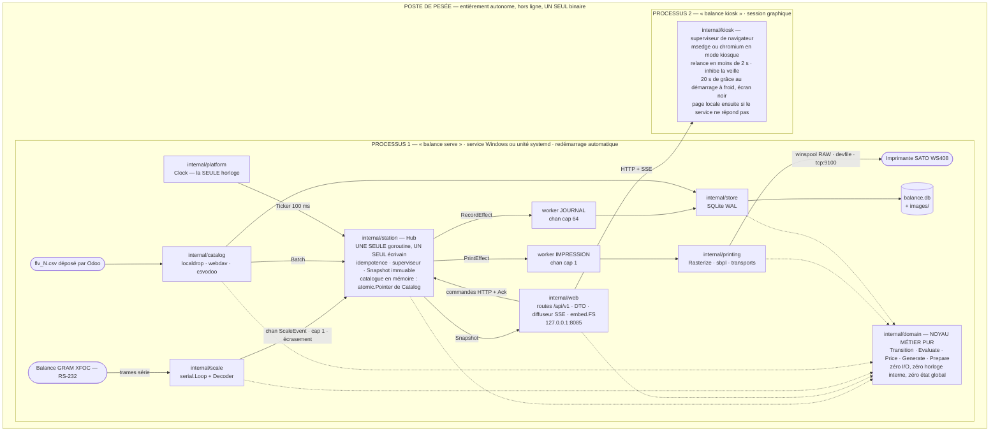

*Flèches pleines : le flux des données. Flèches pointillées : le **sens des dépendances de compilation**. Tout pointe vers `domain` ; **aucune flèche n'en sort** — c'est la coupe n° 1 de §5.2, vérifiée par `make boundary`.*

**Pourquoi deux processus.** Le navigateur est la seule brique que le binaire unique n'élimine pas, et la plus susceptible de tomber (fuite GPU, mise à jour Edge, tactile insistant). Séparés, un crash de l'IHM ne ferme pas le port série, ne coupe pas SQLite, ne perd pas la pesée en cours ; l'`EventSource` se reconnecte seul. Inversement, le service redémarre (mise à jour, watchdog) sans fermer la fenêtre. **Aucune moitié n'entraîne l'autre dans sa chute.**

---

## 4. Le chemin complet d'une pesée

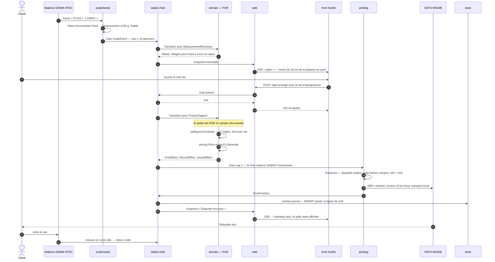

Budget visé sur le matériel cible (PC bureautique 2015, i3, 4 Go, SSD).

| # | Étape | Paquet responsable | Budget |
|---|---|---|---|
| 1 | La trame `ST,GS,+  1.236KG\r\n` arrive sur le port série ; lecture bloquante avec timeout | `internal/scale/serial` | — |
| 2 | `frame.Accumulator.Feed` → `Measurement{Gross: 1236 g, Stability: Stable, Timestamp: …}` — aucune valeur devinée | `internal/domain/frame` | < 0,05 ms |
| 3 | `Emit` sur `chan ScaleEvent` **cap 1, écrasement** : la dernière mesure gagne | `internal/scale` | < 0,01 ms |
| 4 | Le Hub reçoit, calcule `age = Now − Measurement.Timestamp`, met à jour la cadence observée | `internal/station` | < 0,05 ms |
| 5 | `domain.Transition(Model, MeasurementReceived, TransitionContext)` — **pure** ; `WeightLatch.Feed` ancre la valeur | `internal/domain` | < 0,1 ms |
| 6 | Snapshot immuable → diffusion SSE (canal cap 1, drop-old) → repaint du bandeau | `internal/station` + `internal/web` | < 20 ms balance→pixel |
| 7 | *(2 à 5 s plus tard)* le client touche la tuile **AIL** — le **nom** est l'élément principal, la photo un enrichissement facultatif (§14.3) ; la tuile est désactivée au `pointerdown`. **L'ordre inverse est admis** : produit touché avant que le sac soit posé → `ProductArmed`, et c'est la première mesure valide qui déclenche l'étape 9 (§6.6, ADR-022) | `web/` (front) | — |
| 8 | `POST /api/v1/weigh {product_id, seen_weight_g, measurement_seq, key}` → `Hub.Submit` → **202 Accepted** | `internal/web` | 1–3 ms |
| 9 | `Transition` : `ProductTapped` → `Validating`. **Le poids est figé ici**, jamais relu ensuite | `internal/domain` | < 0,1 ms |
| 10 | `safeguard.Evaluate` : 14 règles, brut puis net ; premier bloquant → `Rejected` | `internal/domain` | < 0,05 ms |
| 11 | `pricing.Price` → `A 4,79 €/kg`, `A 5,92 €`, `S 6,58 €` ; `ean13.Generate` → `0493021012365` | `internal/domain` | < 0,05 ms |
| 12 | `PrintEffect` → `chan cap 1` → worker impression (le Hub n'attend jamais l'imprimante) | `internal/station` | < 0,01 ms |
| 13 | `printing.Rasterize` : **toute** l'étiquette, code-barres compris, en bitmap 1 bit 320×203 | `internal/printing` | 6–20 ms |
| 14 | Encapsulation SBPL minimale (`<A>…<G>H040203…<Z>`, ≈ 16 ko hexa) et écriture sur le transport local | `internal/printing/sbpl` | 5–40 ms |
| 15 | `PrintFinished` → Hub → `Succeeded` + `RecordEffect` + `SoundEffect` ; SSE : « Étiquette envoyée » **dans le bandeau, la grille reste affichée** — aucun écran de confirmation (§14.3) | `internal/station`, `internal/web` | < 10 ms |
| 16 | Worker journal : `INSERT` pesée + lignes de tarif, **hors du chemin client** ; purge une fois sur 50 | `internal/store` | 2–15 ms |
| 17 | L'imprimante sort physiquement l'étiquette ; le client retire le sac → `Idle`, modèle remis à zéro | SATO / `internal/domain` | ≈ 350 ms |

**Trois propriétés à retenir.**

1. **Aucun accès disque dans le chemin de pesée.** Le catalogue est un snapshot immuable en mémoire (`atomic.Pointer`, **355 produits mesurés sur le fichier réel** — §10.2 —, < 150 ko : **les images n'y sont pas**, elles sont adressées par leur SHA sur disque, §10.7). Base verrouillée, disque plein, import en cours : la pesée sort.
2. **L'impression est asynchrone du HTTP.** Le `POST` répond en < 5 ms ; le résultat arrive par SSE. Une imprimante muette ne fait jamais expirer une requête du navigateur.
3. **Une clé d'idempotence par toucher.** Le front génère un ULID au `pointerdown` ; le Hub garde les 32 dernières clés. Double-tap, rejeu réseau, retry du navigateur : **une seule étiquette**.

---

## 5. Arborescence et frontières

### 5.1 Les paquets

```
balance/
├── cmd/openscale/                 LE binaire : serve · kiosk · doctor · capture · label
│   └── drivers.go               les deux registres, UNE LIGNE par driver (ADR-043) —
│                                SEUL fichier de l'arbre qui nomme un driver concret
├── internal/
│   ├── domain/                  NOYAU MÉTIER PUR — zéro I/O, zéro os, zéro database/sql
│   │   ├── quantity.go          Cents, Grams, Micrometers, RoundingPolicy.Divide
│   │   ├── text.go              Normalize (NFD + désaccentuation), fixture partagée avec le front
│   │   ├── ean13.go             EAN13, CheckDigit, Compose, Generate, internalPlan (§6.2), Modules[95], Diagnose
│   │   ├── pricing.go           PriceTier, PricingRules, Label, Price
│   │   ├── product.go           Product, Category, SaleMode, Catalog (snapshot immuable)
│   │   ├── safeguard.go         WeighingLimits, Diagnostic, Evaluate (14 règles)
│   │   ├── measurement.go       Measurement, Stability, WeightLatch, RateMeter
│   │   ├── machine.go           State, Event, Effect, Transition (PURE)
│   │   ├── prepare.go           Prepare : le SEUL chemin produit+mesure → Label
│   │   ├── template.go          Template, Element, Validate (9 règles dures)
│   │   ├── config.go            Config, Validate (liste des contrôles en §11.3), Fingerprint, Export
│   │   ├── profiles.go          NeutralProfile SEUL (§11.5) — les valeurs d'un site
│   │   │                        sont un fichier livré, jamais du code compilé
│   │   └── frame/               Parse, Accumulator — grammaire des trames balance (fuzzé)
│   ├── scale/                   drivers balance + registre
│   │   ├── serial/              Loop, Options, Decoder — 95 % du code, écrit une fois
│   │   ├── gramxfoc/            XFOC RS et XFOC + : deux entrées de registre, un décodeur
│   │   ├── absent/ · replay/    source de poids vide (état saisie manuelle) · rejeu d'un
│   │   │                        fichier de trames — NI L'UN NI L'AUTRE dans scale.type
│   │   ├── conformance/         suite de tests imposée à TOUT driver (ADR-048)
│   │   └── corpus/              rejoue testdata/frames/<scale.type>/ par le décodeur
│   │                            du protocole qui l'a enregistré (§15.4)
│   ├── printing/                rendu raster + drivers d'impression + registre
│   │   ├── render.go            Rasterize → *image.Gray au pas de la tête, TOUT compris
│   │   ├── symbol.go            tracé EAN-13 à module fractionnaire + HRI
│   │   ├── encode.go · pdf.go   PNG et PDF grandeur nature — encodeurs PARTAGÉS : trois
│   │   │                        appelants, un seul est un driver (§8.1, ADR-047)
│   │   ├── raster/              driver par défaut : bitmap → encapsulation → transport
│   │   ├── sbpl/                encapsulation SBPL minimale (<A>…<G>…<Z>), typée
│   │   ├── transport/           winspool · devfile · tcp · file (+ jumeaux _other.go)
│   │   ├── preview/             driver « aperçu » (admin, développement sans matériel)
│   │   └── conformance/         suite de tests imposée à TOUT driver d'impression (ADR-048)
│   ├── catalog/                 sources + parseur CSV Odoo + qualification + images
│   │   ├── localdrop/ webdav/   les deux sources
│   │   └── csvodoo/             parseur en flux, qualification, signalements
│   ├── store/                   SQLite (modernc), migrations, 6 dépôts, purge
│   ├── station/                 ORCHESTRATION : Hub, workers, superviseur, idempotence
│   │   └── ports/               interfaces CONSOMMÉES par le Hub (§5.3)
│   ├── web/                     routes, SSE, DTO /api/v1, auth argon2id, embed.FS du front
│   ├── kiosk/                   superviseur de navigateur (processus 2)
│   ├── platform/                chemins OS, disque, ports série, files d'impression, verrou,
│   │                            PathChecker (lire, et pouvoir déposer — contrôles 44 et 46)
│   ├── diag/                    doctor (17 contrôles), santé, diagnostic.zip, auto-tests
│   ├── obs/                     slog + rotation, anneau RAM 500 événements, codes ERR-xxx-nn
│   └── assets/                  //go:embed polices, gabarits, profils, sons
├── web/                         front Svelte 5 + TS (client + admin), dist COMMITÉ
├── deploy/{windows,linux}/      installeurs, unités systemd, règles udev
└── testdata/                    corpus vivant : trames, CSV, configurations
```

**Volume visé** : ~11 500 lignes de Go dont ~4 500 de tests, ~3 500 lignes de Svelte/TS. À comparer aux 11 226 lignes d'un seul module VBA de l'existant.

### 5.2 Les cinq coupes

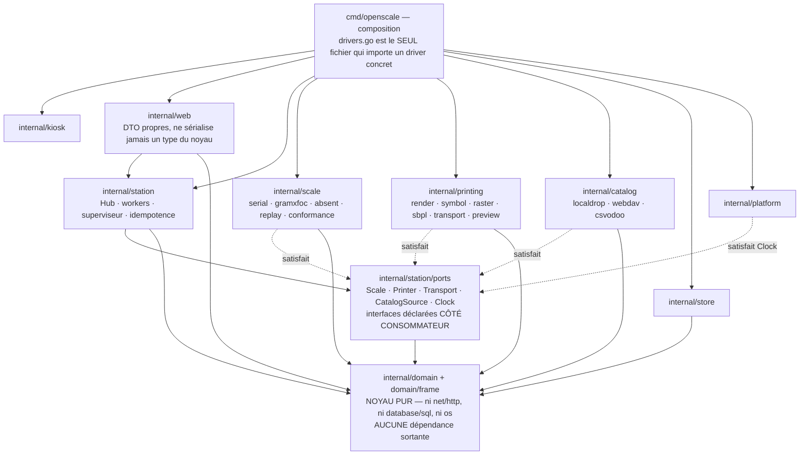

*`station` ne connaît aucun driver concret : il ne voit que `ports`, et c'est `cmd/openscale/drivers.go` qui câble les implémentations. Les flèches pointillées se lisent « fournit une implémentation de », jamais « est importé par ».*

| # | Coupe | Vérifiée par |
|---|---|---|
| 1 | `domain` n'importe ni `net/http`, ni `database/sql`, ni `os` | `make boundary` : imports **directs** de `go list`, suivis transitivement **à travers nos propres paquets**. Pas `go list -deps` : la clôture transitive du noyau contient `os` et le contiendra toujours, parce que `fmt` l'importe — pris au pied de la lettre, le contrôle interdirait `fmt.Errorf` et serait rouge en permanence ou désactivé en silence. La bibliothèque standard est donc tenue pour sûre derrière `fmt` et `sort` ; c'est une limite assumée, écrite dans l'outil pour qu'on ne la prenne pas pour un oubli |
| 1 bis | **Aucun appel à `time.Now()`** hors des deux exceptions listées en §5.3 | `make boundary` : analyse AST (`go/ast`) sur `./internal/...`, liste blanche explicite des **2 fichiers** nommés en §5.3 — `internal/platform/clock.go` et `internal/web/stream.go` —, **le fichier entier et non une ligne** : l'outil compare des chemins, pas des positions, et une liste blanche qui prétendrait viser la seule ligne `SetWriteDeadline` décrirait un contrôle que personne n'a écrit. Le refus porte sur `Now`, `Since`, `Until`, `Tick`, `After`, `AfterFunc`, `NewTicker` et `NewTimer`. `time` **est** une dépendance légitime du noyau (`Measurement.Timestamp`, `TransitionContext.Now`, `Expiry`) : c'est l'**appel** qui est interdit, pas le paquet |
| 2 | `station` ne connaît aucun driver concret ; seul `cmd/openscale/drivers.go` les importe | `make boundary` : analyse AST sur `./cmd/...`, `./internal/...` et `./tools/...`. Un **paquet driver** n'est pas un chemin inscrit dans une liste, c'est tout paquet qui **expose une entrée de registre** — une déclaration exportée de type `scale.Driver` ou `printing.Driver`. La couche d'octets (`scale/serial`, `printing/transport`), le parseur de corpus (`scale/replay`), l'état `absent` et les encodeurs partagés n'en exposent aucune et restent donc importables. Les `_test.go` sont hors coupe : ils ne sont dans aucun binaire |
| 3 | Les interfaces sont déclarées **côté consommateur** (`station/ports`), pas côté implémentation | revue |
| 4 | `web` a ses propres DTO ; il ne sérialise jamais un type du noyau | test de compatibilité JSON gelé |
| 5 | Chaque fichier `_windows.go` a un jumeau `_other.go` qui renvoie une erreur explicite en français | compilation croisée en CI sur 3 cibles |

Ajouter une balance = **1 paquet + 1 ligne** dans `drivers.go`. Zéro modification de `station`, `web` ou du front : l'admin découvre les drivers par le registre et génère leur formulaire depuis le schéma déclaré.

> **La ligne est écrite à la main, et c'est une décision** (ADR-043). Ni `init()` déclenché par un import « `_` », ni génération de code. L'ordre du registre **est** celui que le bénévole lit dans la liste déroulante — `Descriptors()` le dit en toutes lettres —, et l'ordre des `init()` n'est pas celui d'un fichier qu'on relit ; un registre alimenté par `init()` est nécessairement global, donc non réinitialisable entre deux tests, alors que les deux registres sont des **valeurs** précisément pour cela ; et `Register` **panique** sur une faute de composition, or une panique dans un `init()` tue le binaire avant `main`, sans dire ce qui l'a demandée. Le paquet driver, lui, n'a pas à savoir qu'il est enregistré : c'est ce qui permet d'en livrer un **compilé, passé au banc et jamais enregistré** (ADR-050).

### 5.3 Les quatre interfaces enfichables

> **Convention de documentation, dite une fois pour tout le document.** Tout élément public porte sa documentation dans la convention de son langage : **godoc** en Go — commentaire commençant par le nom de l'identifiant et formant une phrase complète terminée par un point —, **TSDoc** en TypeScript/Svelte (`/** … */`, `@param`, `@returns`, `@throws`, `@example`). Une seule règle par langage, chacune dans son langage.
>
> **Conflit Clean Code / Go idiomatique, tranché une fois pour tout le document.** Là où les deux divergent, **le Go idiomatique gagne** : identifiants courts dans les portées courtes (`i`, `r`, `w`, `ctx`, `err`, `h` pour le Hub), aucun préfixe `I` sur les interfaces, paquets courts et au singulier (`domain`, `scale`, `store`, `frame`), et interfaces déclarées **côté consommateur** (`station/ports`).

```go
// Package ports declares everything the Hub CONSUMES. No implementation lives
// here. Import path: internal/station/ports.
package ports

// --- 1. SCALE --------------------------------------------------------------

// Scale is the plug-in contract of a weighing device driver.
//
// The driver owns its reader goroutine and its reconnection policy. It NEVER
// gives up on a transient error: it reports StatusDisconnected and keeps
// trying (the legacy application waited for 1000 errors, about 7 minutes of
// frozen screen).
//
// CRITICAL CONTRACT (bloquant-2): Start receives the channel, NEVER closes it,
// and signals its own termination by closing done. The channel belongs to the
// Hub for the whole lifetime of the process: that is what makes the
// serial -> manual -> serial round trip possible.
//
// MANDATORY COROLLARY: done is closed ON EVERY EXIT PATH, including when Start
// returns an error before it ever started its goroutine (port not found,
// access denied). Otherwise the wait in restartScale (§11.4) would never
// unblock. That wait is bounded by a deadline anyway, because a Close that
// never returns on a faulty Windows serial port must not freeze the write of
// the configuration.
type Scale interface {
    // Descriptor reports the driver identity and its declared capabilities.
    Descriptor() domain.ScaleDescriptor
    // Start publishes scale events on out until ctx is done, then closes done.
    Start(ctx context.Context, out chan<- domain.ScaleEvent, done chan<- struct{}) error
    // Close releases the device and BLOCKS, because a Windows serial port is exclusive.
    Close() error
}

// --- 2. PRINTER ------------------------------------------------------------

// Printer is the plug-in contract of a label printer driver.
//
// Print blocks until the bytes have been handed over to the transport, NOT
// until the label physically comes out: no transport guarantees the latter.
type Printer interface {
    // Descriptor reports the driver identity and its declared capabilities.
    Descriptor() domain.PrinterDescriptor
    // Print renders one job and returns the receipt identifying it.
    Print(ctx context.Context, job PrintJob) (PrintReceipt, error)
    // Status reports what the device says about itself, or an unknown status.
    Status(ctx context.Context) PrinterStatus
    // SelfTest prints one built-in pattern: "label", "alignment" or "ruler".
    SelfTest(ctx context.Context, what string) error
    // Close releases the device.
    Close() error
}

// --- 3. TRANSPORT ----------------------------------------------------------

// Transport is the byte layer, independent of any printer language. It is the
// plug-in point that tells winspool, devfile, tcp and file apart.
type Transport interface {
    // Name reports the registry key of the transport, such as "winspool".
    Name() string
    // Write hands p over to the device and reports how many bytes were accepted.
    Write(ctx context.Context, p []byte) (int, error)
    // Query returns ErrUnsupported when the transport is one-way.
    Query(ctx context.Context, request []byte, budget time.Duration) ([]byte, error)
    // Describe returns the operator-facing wording shown in the admin screen.
    // That wording stays French, e.g. « file Windows "SATO WS408_1" » — where
    // « file » is the French for print QUEUE, never a file on disk — or
    // « /dev/usb/lp0 ».
    Describe() string
    // Close releases the underlying handle.
    Close() error
}

// --- 4. CATALOG SOURCE -----------------------------------------------------

// CatalogSource yields whole catalogs, full replace, one batch at a time.
//
// Acknowledgement is EXPLICIT and SEPARATE from reading: Next reads and
// validates without touching the file, Acknowledge archives it and only then
// DELETES it. Deleting at read time would let a crash between reading and
// applying lose an update for good, and without a trace.
type CatalogSource interface {
    // Name reports the registry key of the source, such as "local_drop".
    Name() string
    // Next blocks until a batch is available or ctx is done.
    Next(ctx context.Context) (*Batch, error)
    // Acknowledge archives then removes the batch that produced result.
    Acknowledge(ctx context.Context, b *Batch, result BatchResult) error
    // Close stops watching the source.
    Close() error
}
```

Cinquième interface, non enfichable mais injectée partout — **c'est la correction du bloquant-1** :

```go
// Clock is the only source of time in the application: no decision, be it
// business, temporal or budget related, rests on time.Now().
//
// The Hub itself takes its ticker from here: with the fake implementation,
// Advance(2*time.Second) really does produce the 20 ticks, and every
// time-dependent test (stability, expiry, UI timeouts, reprint window, print
// budget) runs in microseconds.
type Clock interface {
    // Now reports the current instant as seen by this clock.
    Now() time.Time
    // After delivers one instant once d has elapsed on this clock.
    After(d time.Duration) <-chan time.Time
    // Ticker delivers an instant every d and returns the func that stops it.
    Ticker(d time.Duration) (<-chan time.Time, func())
}

// WithBudget derives a context from a DURATION MEASURED BY THE INJECTED CLOCK,
// and not by context.WithTimeout, which reads the real clock. That is what
// makes failure test 6 ("printer hanging for 60 s") instantaneous instead of
// burning 8 seconds of wall time.
//
// The goroutine it spawns is transient: it ends with the context or with the
// deadline, never later than the work it bounds (§13.1).
func WithBudget(ctx context.Context, clk Clock, d time.Duration) (context.Context, context.CancelFunc)
```

> **Les deux seules exceptions, nommées et vérifiées par `make boundary`.**
> 1. `internal/web/stream.go` : `rc.SetWriteDeadline(...)` est une **échéance d'E/S réseau** posée dans la pile TCP du noyau OS ; aucune horloge factice ne peut la piloter. Elle ne porte **aucune décision métier** : elle borne l'écriture vers un navigateur zombie.
> 2. `internal/platform/clock.go` : l'implémentation réelle de `Clock`, qui **est** l'appel à `time.Now()`, une fois, au seul endroit prévu.
>
> Toute autre occurrence fait échouer la CI. En particulier `internal/store` reçoit l'horloge par injection (§12.5) — l'horodate d'un nom de fichier de sauvegarde en vient aussi ; `internal/web` la reçoit également, et le **battement SSE de 15 s est un `Ticker` de l'horloge injectée**, pas un `time.NewTicker` (§13.3) ; `App.Stop` mesure sa durée et son budget d'arrêt avec `Clock.Now` et `ports.WithBudget`, jamais avec `time.Now` ni `context.WithTimeout` (§13.4). La seule ligne de `stream.go` qui reste sur l'horloge réelle est le `SetWriteDeadline` ci-dessus, et c'est à ce titre — cette ligne, pas ce fichier — qu'elle figure dans la liste blanche.

---

## 6. Le noyau métier

### 6.1 Types atomiques et politique d'arrondi

```go
// Package: internal/domain

// Cents is a monetary amount, in euro cents.
type Cents int64

// Grams is a mass, in whole grams.
type Grams int64

// Micrometers is a label geometry length, in µm; no float ever reaches a file.
type Micrometers int64

const (
    // Kilogram is the number of grams in one kilogram.
    Kilogram = Grams(1000)
    // MaxWeight is the capacity of the NNDDD payload field of the barcode.
    MaxWeight = Grams(99_999)
)
```

> **Pourquoi pas un flottant — la démonstration exacte, recalculée.** Le contre-exemple « 0,996 kg » qui circulait dans les versions précédentes de ce document **est faux** et doit disparaître partout : `float64("0.996")` vaut bien 0,99599999999999999645…, mais `×1000` **arrondit au double le plus proche, soit exactement `996.0`**, et la troncature rend 996. Le vrai contre-exemple, vérifié, est **`1,001 kg`** : `float64("1.001")*1000` vaut **1000,9999999999999**, et `int()` rend **1000 g au lieu de 1001**. Sur les 99 999 masses à 3 décimales de 0,001 à 99,999 kg, **741 cassent, soit 0,74 %** — une pesée sur 135, pas « 5 % ». C'est un bug invisible en test naïf, silencieux, et il fait perdre 1 g **et 1 centime** au hasard. **Aucun `strconv.ParseFloat` dans le noyau.** *(Le chiffre 741 et le premier cas 1,001 kg sont figés dans un test : `TestFloatBreaksOn741Weights`.)*
> **Pourquoi pas un décimal arbitraire** (`shopspring/decimal`, `cockroachdb/apd`) : le domaine a une unité atomique naturelle et bornée ; un décimal n'éviterait pas la question de la politique d'arrondi, qui doit de toute façon être tranchée explicitement.
> **Pourquoi `int64`** : le produit intermédiaire `unitPrice × weight` atteint `MaxUnitPrice × MaxWeight` = 999 999 c/kg × 99 999 g ≈ 1e11. **`MaxUnitPrice = 999 999` n'est pas une hypothèse : c'est une borne imposée trois fois** — `CHECK (unit_price_cents BETWEEN 0 AND 999999)` dans le DDL (§12.3), règle « le prix est-il un nombre exploitable ? » à l'import (§10.3), et contrôle de configuration n° 43 sur tout prix porté par un fichier de configuration livré (§11.3). L'invariant « pas d'overflow » devient alors trivialement vrai, et il est testé aux bornes.

**La politique d'arrondi — arbitrage A6 appliqué.**

```go
// RoundingPolicy names how the result of an integer division is rounded.
type RoundingPolicy uint8

const (
    // RoundHalfUp is the DEFAULT (A6): 6.57552 -> 6.58.
    RoundHalfUp RoundingPolicy = iota
    // RoundTowardZero truncates: 6.57552 -> 6.57.
    RoundTowardZero
    // RoundHalfToEven rounds to the nearest even value, like VBA Round().
    RoundHalfToEven
)

// Divide applies the policy to the integer division num/den.
//
// It is symmetric around zero: negative weights do exist (the "basket
// missing" safeguard), and an asymmetric rounding would surprise there.
//
// PRECONDITION: den > 0. Price's two call sites pass positive CONSTANTS --
// FullDiscount for the tier coefficient, 1000 for the gram-to-kilogram
// conversion -- so no tier grid can reach this precondition any more. It used
// to be reachable: coef_den came from the file, check 11 was what kept it
// positive, and a negative denominator would have panicked in the Hub
// goroutine and killed the process (ADR-034). The third caller, Quantize,
// derives its denominator from the plan's Decimals, which the plan check keeps
// non-negative (ean13.go:99) -- there the guarantee is still UPSTREAM, not
// structural.
func (p RoundingPolicy) Divide(num, den int64) int64 {
    if den <= 0 {
        panic("domain: zero or negative denominator") // programming defect, never data
    }
    negative := num < 0
    if negative {
        num = -num
    }
    q, r := num/den, num%den
    switch {
    case p == RoundHalfUp && r*2 >= den:
        q++
    case p == RoundHalfToEven && r*2 > den:
        q++
    case p == RoundHalfToEven && r*2 == den && q%2 == 1:
        q++ // exact half goes to the even neighbour
    }
    if negative {
        q = -q
    }
    return q
}
```

> `r*2 >= den` plutôt que `(num + den/2)/den` : pas d'overflow, pas de perte quand `den` est impair.

**Ce que dit l'arbitrage A6, chiffré.**

La configuration de production porte `Decimales_Prix = 2` = « centimes arrondis », et le chemin d'impression automatique — 90 % des pesées — fait `Round(Prix_calcule, 2)`. Donc **arrondi, pas troncature**. L'exemple « 6,57 € » du texte d'aide `FAideDecimalesPoids` est **erroné** : 1,236 × 5,32 = 6,5755 → 6,58. Ce même texte d'aide contient une seconde erreur déjà établie : la référence `0493021000009` a une clé invalide (la bonne est `0493021000003`). **Le texte d'aide n'est pas une source fiable ; la table de configuration et le code font foi.**

**La nuance, traitée explicitement.** `Round()` en VBA est un arrondi **au pair le plus proche** (*banker's rounding*). Pour une égalité parfaite avec l'ancienne application il faudrait le reproduire. On retient **l'arrondi commercial (half-up)** :

- l'écart ne peut apparaître **que** sur une égalité exacte au demi-centime, c'est-à-dire quand `unitPrice × netWeight ≡ 500 (mod 1000)` ;
- il vaut **au maximum 1 centime**, et seulement dans la moitié de ces cas (ceux où le centime précédent est pair) ;
- ordre de grandeur, **rapporté à la seule volumétrie observée et sans aucune extrapolation temporelle** (§12.4 : les 20 662 lignes de `Stats` sont le cumul d'un poste sur une période **inconnue**) : 20 662 pesées × 0,1 % × ½ ≈ **10 étiquettes** auraient différé d'un centime, **sur toute la durée couverte par cette base**. Aucune fréquence annuelle n'est avancée ici, et aucune décision n'en dépend ;
- exemple concret : prix unitaire 5,00 €/kg, poids 1,110 kg → 5,55 € exactement… mais 5,00 €/kg × 0,105 kg = 0,525 € → **0,53 €** en commercial, **0,52 €** en VBA ;
- en outre, VBA calcule en `Double` : `5,325` n'y est pas exactement représentable, si bien que le comportement historique n'est même pas déterministe au sens mathématique. **L'arithmétique entière est un gain de justesse, pas seulement de propreté.**
- `RoundHalfToEven` est implémenté et testé : un exploitant qui voudrait l'égalité stricte avec l'ancien comportement le sélectionne dans l'admin, sans recompiler.

### 6.2 Code-barres

**Le plan de numérotation interne est un contrat avec la caisse, et il est déclaré par préfixe.** Les structures encodées sont des faits ; ce qui est tranché ici, c'est **d'où vient la largeur de chaque champ**. Elle n'est ni réglable, ni devinée à partir des chiffres du code : elle est une **propriété du préfixe**, portée par une table constante du binaire (ADR-028).

| Préfixe | Mode de vente | Structure | Référence | Charge utile | Zone réservée, à zéro dans le catalogue |
|---|---|---|---|---|---|
| `0493`–`0498` | **au poids**, 3 décimales | `PPPP RRR NNDDD C` | 3 digits | 5 digits — poids net **en grammes** | digits 8→12 = `00000` |
| `0499` | **à l'unité** | `PPPP RRRRRR NN C` | 6 digits | 2 digits — nombre d'unités | digits 11→12 = `00` |

Un préfixe absent de cette table n'a **pas** de mode d'encodage : `0490`/`0491`/`0492` sont des codes internes que la balance ne sait pas encoder (`INTERNAL_CODE_NOT_WEIGHABLE`, §10.3), tout autre préfixe est un EAN fournisseur, donc un **préemballé** (§10.3). Il n'existe **aucune entrée « au poids, 2 décimales »** : la réfutation chiffrée est plus bas. *(La plage `0493`–`0498` n'est pas une extrapolation : c'est le message même de l'ancienne application — `Module1.bas:4085`, « Le produit est au poids mais le Code Barre ne commence pas par '0493-0498' ». Seul `0493` est utilisé par les deux catalogues ; les cinq autres sont déclarés parce que la caisse les connaît déjà.)*

```go
// PrefixPlan describes how one internal prefix lays out the 13 digits of a
// barcode.
//
// The plan is a CONSTANT OF THE BINARY: no admin screen, no file editable from
// the scale. Touching it is a version change, reviewed and tested as such
// (ADR-028).
type PrefixPlan struct {
    Prefix       string   // "0493"
    Mode         SaleMode // the PREFIX IS AUTHORITATIVE for the sale mode (§10.2)
    RefWidth     int      // reference digits, right after the prefix
    PayloadWidth int      // digits reserved for the weight or the unit count
    Decimals     int      // decimals of the value carried by the payload
    PriceLabel   string   // default price suffix, LEADING SPACE included (§10.2)
}

var internalPlan = map[string]PrefixPlan{
    "0493": {"0493", ByWeight, 3, 5, 3, " €/kg"},      // same for 0494…0498
    "0499": {"0499", ByUnit, 6, 2, 0, " € l'unité"},
}

// init self-checks the plan at start-up: 4 (prefix) + ref + payload + 1 (check
// digit) == 13, and both widths are non-zero. Without that second condition, a
// "reference 8, payload 0" plan would pass the arithmetic and leave the
// variable field non-existent. An inconsistent plan kills the process AT
// START-UP, never at print time (T29, T30).
func init() {
    for _, plan := range internalPlan {
        if plan.RefWidth < 1 || plan.PayloadWidth < 1 ||
            4+plan.RefWidth+plan.PayloadWidth+1 != 13 {
            panic("inconsistent numbering plan: " + plan.Prefix)
        }
    }
}
```

**L'appartenance au plan se vérifie produit par produit, par un invariant de gabarit.** Le plan dit *où* est le champ variable ; le catalogue doit le présenter **intégralement à zéro**, puisqu'il sera écrasé à l'impression par la valeur pesée. S'il ne l'est pas, la référence **déborde** sur le champ poids : le produit est refusé (`RESERVED_ZONE_NOT_EMPTY`, §10.3) et le rapport d'import dit quoi corriger dans Odoo (§10.3 bis). **Aucune devinette, aucune branche « au cas où ».** Dit à un bénévole : *« sur un code `0493`, les 3 chiffres qui suivent `0493` sont le numéro de l'article et les 5 suivants sont réservés au poids ; dans le catalogue ils doivent donc être à zéro. S'ils ne le sont pas, le numéro déborde sur le poids, et l'étiquette imprimée désignerait un autre article à la caisse. »*

**« Le catalogue porte deux conventions simultanément » : l'hypothèse a été posée sur les données, puis écartée.** Seize codes de `flv.csv` ressemblent à une convention `0493` + référence **4** digits + charge **4** digits — clé valide, références contiguës `1001`…`1022`, produits créés ensemble (suffixes `-MV`/`-MR`). Trois mesures les disqualifient. **(a) Vraisemblance :** sous l'hypothèse « référence 4 digits », 316 des 332 références `0493` de `flv.csv` (95,2 %) et **92 sur 92** de `flv_1.csv` seraient des multiples exacts de 10, avec des écarts consécutifs de 10, 20, 30 — un plan dont 90 % de l'espace serait perdu ; sous l'hypothèse « 3 digits », les écarts sont 1, 2, 3 et seules 11,1 % des références finissent par zéro : une numérotation humaine ordinaire. **(b) L'ancienne application ne connaît qu'un seul découpage** — `Module1.bas:4128`, `6989`, `7050` testent `Mid(CodeBarre, 8, 5) <> "00000"` (commentaire `' NNDDD 0493xxxNNDDDC`) et `l.4139`, `6994`, `7052` testent `Mid(CodeBarre, 11, 2) <> "00"` pour `0499` : **la largeur est déjà une propriété du préfixe**, et ces 16 codes sont **déjà rejetés en production** (« Code Barre Invalide : les digits de 8 à 12 doivent être à 00000 », puis blocage à la sélection « Contactez un responsable »). **(c) Le lot se contredit lui-même** : dans la même série `-MV`/`-MR`, les 5 fromages plus anciens (ids 3509–4064) portent des références 3 digits parfaitement conformes (771, 772, 773, 836, 874). Une convention ne se contredit pas à l'intérieur d'un lot créé le même jour : **c'est une saisie qui a dérapé**, pas un second plan. Ces 16 lignes sont donc un **second bug avéré** de l'existant — à côté du plafond silencieux de 120 produits par catégorie (`01-etat-des-lieux.md`, §14.3) — et ces produits sont **invisibles sur les balances aujourd'hui**. À la mise en service, cela fait **deux écarts visibles à expliquer** : des produits « Autres » qui réapparaissent, et 16 produits boucherie / volaille / fruits qui restent absents **tant que leur code-barres n'est pas corrigé dans Odoo**. D'où l'exigence de §10.3 bis : le rapport doit sortir ces 16 lignes **dès la première exécution**, avant le basculement.

**Le contre-exemple chiffré, qui est aussi un test (T31–T33).** `0493100100006` — *« ♥AA-TOMME DE SAVOIE -MV »*, id Odoo 5115 — pesé à **1,236 kg**. Lu comme une référence de 4 digits (`1001`), il produirait l'étiquette **`0493100112368`**. La caisse, elle, lit **toujours** 3 digits de référence et 5 de poids : elle y voit la référence **`100`** — c'est-à-dire **`PATATE DOUCE SAF`, id 973, 4,67 €/kg** — et un poids de **11,236 kg**. Non seulement un **facteur 10** sur la masse, mais une **substitution silencieuse d'article**. Poussé sur les 16 codes, l'effet est massif et se mesure : imprimés à 1,236 kg sous le plan `3+5`, ils ne produisent que **trois** étiquettes distinctes — `0493100012361`, `0493101012360`, `0493102012369` —, soit *PATATE DOUCE SAF* (id 973), *SAUCISSE CANARD FACON TOULOUSE* (id 5143) et *AIL BLANC SAF* (id 894). Aucune de ces étiquettes n'est produite : le produit est refusé en amont, à l'import.

**Résultat de la règle, mesuré sur les deux fixtures.** `flv.csv` : **331 acceptés** (316 au poids `0493` + 15 à l'unité `0499`), **8 hors plan**, **16 refusés**, **0 cas ambigu**. `flv_1.csv` : **107 acceptés** (92 + 15), **39 hors du plan de pesée** (30 préemballés + 9 sans code-barres), **7 refusés** — tous pour clé de contrôle fausse, **aucun pour une question de largeur** —, **0 ambigu**. Sur les 508 produits des deux fichiers : **0 largeur devinée**, **0 collision de référence** parmi les acceptés. Le plan `0493` est occupé à **316 références sur 1000** — 684 libres : renuméroter les 16 fautifs ne demande aucune extension du plan.

**Le doute résiduel est nommé, et il ne bloque rien.** Un code peut être conforme **par accident** : si la référence voulue par le saisisseur était plus longue et se terminait par un zéro, l'invariant passe sans que le code soit celui qu'on croit. Détection, en seconde passe : une référence acceptée qui est aussi le préfixe d'une référence portée par un code **refusé** du même catalogue lève un **avertissement non bloquant**. Sur `flv.csv` : **3 lignes** — id 973 `PATATE DOUCE SAF` (réf 100), id 5143 `SAUCISSE CANARD FACON TOULOUSE X 2-MR` (réf 101), id 894 `AIL BLANC SAF` (réf 102) — dont **une seule est réellement suspecte** (l'id 5143 appartient au lot récent et visait manifestement `1010`) ; sur `flv_1.csv`, **0**. Bruyant à deux tiers, et c'est assumé : **ce n'est pas une détection, c'est une question posée à l'équipe**, elle ne retire jamais un produit de la grille.

**Cohérence avec la suppression de `weight_decimals`, qui reste entière.** La revue anti-clonage a supprimé ce réglage avec un argument juste : *un bouton d'administration qui change le sens du code-barres lu par la caisse est dangereux*. Elle supposait en revanche une convention unique, ce qui n'était pas établi. Le plan par préfixe **remplace** ce réglage sans le réintroduire, et la différence est de nature, pas de degré : (a) c'est une **constante du binaire**, pas un écran atteignable depuis la balance ; (b) il est **indexé par préfixe**, donc il porte déjà deux largeurs différentes — 5 digits pour `0493`, 2 pour `0499` — ce qu'aucun réglage global unique ne sait faire ; (c) il ne **mélange plus deux sujets** : l'ancien `Decimales_Poids` était présenté comme un choix d'arrondi d'affichage alors qu'il pilotait aussi la largeur du champ écrit (`FormulaireCalcul.cls:3455`, `Left(Reference, 12 − Len(Poids))` — la largeur écrite était celle de la chaîne de poids formatée), et **c'est ce couplage qui était le danger, pas la constante**. Le plan n'est donc **pas exposé en configuration en V1** (§11.2, ADR-025).

> **Ce qui reste ouvert, et c'est un critère de recette bloquant.** Le plan est **établi**, pas **prouvé**. Que `0493` signifie « référence 3 digits + poids 5 digits à 3 décimales » repose sur trois faisceaux concordants — le code de l'ancienne application, la structure statistique des références, l'absence de contre-exemple sur **424 codes `0493`** répartis sur deux catalogues à quatre ans et demi d'écart. La source d'autorité réelle reste **la configuration de la caisse**. Elle se confirme par une question écrite au commanditaire **et** par un test d'acceptation physique : imprimer une étiquette d'un produit connu à un poids connu, la scanner en caisse, vérifier que **l'article et le poids affichés sont les bons** (§21 n° 13). Tant que ce test n'est pas passé, la mise en service ne l'est pas. Si la caisse était en réalité réglée sur 2 décimales, tout le plan se décalerait d'un digit — c'est le même risque que celui dénoncé par la revue, simplement déplacé là où il doit être : dans une décision d'ingénierie tracée et testée, pas dans un bouton d'écran.

Le type et le générateur, une fois le plan posé :

```go
// EAN13 is a 13 ASCII digit code whose check digit is valid. The invariant is
// enforced by the constructor: there is no way to build an invalid EAN13
// outside this file.
type EAN13 string

// CheckDigit computes the standard EAN-13 check digit, identical to
// Module1.bas:6903.
//
//	check = (10 - ((3 x sum of even positions) + sum of odd positions) mod 10) mod 10
func CheckDigit(twelve string) (byte, error) {
    if len(twelve) != 12 {
        return 0, ErrEAN13Format
    }
    var even, odd int
    for i := 0; i < 12; i++ {
        c := twelve[i]
        if c < '0' || c > '9' {
            return 0, ErrEAN13Format
        }
        if (i+1)%2 == 0 {
            even += int(c - '0')
        } else {
            odd += int(c - '0')
        }
    }
    return byte('0' + (10-(3*even+odd)%10)%10), nil
}

// Generate overwrites the payload field of pattern, right aligned, and CHECKS
// what it overwrites.
//
// The legacy application did Left(ref, 12-Len(p)) & p, which is correct ONLY
// because the reference already carries zeros at the right positions -- and
// silently produces a barcode pointing at ANOTHER PRODUCT otherwise. Here it
// is required, and verified.
//
// width is NEVER a free parameter at the call site: it is always
// internalPlan[pattern[:4]].PayloadWidth, and the only non-test caller is
// Prepare, which passes the plan of an ALREADY qualified product (§10.3). A
// product whose prefix is not in the plan never reaches this function: it has
// no tile.
//
// That sentence is not a politeness convention, it is VERIFIED here. Without
// this check, width would become exactly the deleted weight_decimals setting:
// a free integer deciding what the till will read (T9, T10).
func Generate(pattern EAN13, payload int64, width int) (EAN13, error) {
    // pattern is 13 digits long: the invariant is carried by the EAN13 type.
    plan, ok := internalPlan[string(pattern)[:4]]
    if !ok {
        return "", fmt.Errorf("%w: prefix %s is absent from the plan",
            ErrPrefixNotInPlan, string(pattern)[:4])
    }
    if width != plan.PayloadWidth {
        return "", fmt.Errorf("%w: plan %s reserves %d payload digits, "+
            "%d requested", ErrWidthNotInPlan, plan.Prefix, plan.PayloadWidth, width)
    }
    maxPayload := int64(1)
    for i := 0; i < width; i++ {
        maxPayload *= 10
    }
    if payload < 0 || payload > maxPayload-1 {
        return "", fmt.Errorf("%w: %d does not fit on %d digits",
            ErrPayloadOutOfRange, payload, width)
    }
    head := string(pattern)[:12-width]
    reserved := string(pattern)[12-width : 12]
    if strings.Trim(reserved, "0") != "" {
        return "", fmt.Errorf("%w: pattern %s, digits %d..12 = %q",
            ErrPatternNotZeroed, pattern, 13-width, reserved)
    }
    return Compose(head + fmt.Sprintf("%0*d", width, payload))
}
```

| Préfixe (mode) | Charge utile | Largeur | Décimales | Exemple |
|---|---|---|---|---|
| `0493`–`0498` — au poids *(production)* | poids net **en grammes** | 5 | 3 | 1236 g → `01236` |
| `0499` — à l'unité | nombre d'unités | 2 | 0 | 3 → `03` |
| *(aucun préfixe au plan)* — prix | montant du tarif de référence, en centimes | 5 | 2 | 658 → `00658` |

**La ligne « poids, 2 décimales » a disparu de ce tableau**, et c'est la conséquence directe du plan : aucun préfixe ne la porte, donc aucune référence ne peut l'atteindre. Les deux vecteurs qui l'exerçaient, **T9 et T10**, deviennent des **rejets** et gardent leur numéro (Annexe A).

**Cohérence poids affiché / poids encodé.** Une seule quantification, **en amont**, une seule fois : `Quantize(g, plan.Decimals)` — la valeur venant du **plan du préfixe du produit**, jamais d'un réglage — alimente à la fois l'affichage, le prix **et** le code-barres. L'existant appliquait `Decimales_Poids` à l'affichage mais pas à l'encodage : l'étiquette pouvait afficher `1,23 kg` et encoder `1,236 kg`.

**Poids ou prix.** `content ∈ {weight, price}`, **`weight` en production**, et cette fois **réellement piloté sur tous les chemins** (l'existant le neutralisait par une auto-affectation, `FormulaireCalcul.cls:3401`). **Aucun préfixe du plan ne porte `content = price` en V1** : `0491`/`0492`, les seuls concernés, n'ont pas d'entrée au plan et sortent en `INTERNAL_CODE_NOT_WEIGHABLE` (§10.3). L'encodage prix reste donc une **capacité du noyau, testée** (T14, T14 bis, T21) mais sans produit pour l'atteindre — c'est un `if` en dur de moins, et une table `rules_by_prefix` en moins dans la configuration (§11.2). Le rendre atteignable serait une décision explicite du commanditaire : une entrée au plan, donc une version.

### 6.3 Tarification — arbitrage A7

```go
// PriceTier is one configured price level, such as member or solidarity.
type PriceTier struct {
    Code     string   `json:"code"`   // "MEMBER", "SOLIDARITY" -- stable, used as a key
    Label    string   `json:"label"`  // "Adhérent" -- customer facing, stays French
    Abbrev   string   `json:"abbrev"` // "A" -- prefix printed on the label
    Discount Discount `json:"discount_percent,omitempty"`
    Rank     int      `json:"rank"`
}
```

> **Remise en pourcentage, jamais en flottant.** Une remise se déclare `discount_percent`
> au dixième de point et se stocke en dixièmes **entiers** : 10,2 % vaut 102. Le `0.9` en
> dur de l'existant disparaît, et aucun flottant ne s'interpose entre le fichier et le
> centime imprimé. **Le tarif désigné par `reference_code` ne porte aucune remise** :
> c'est le prix du catalogue, celui que la caisse encaisse, et l'absence de la clé *est*
> cette affirmation (ADR-034).

```go
// Price is the ONLY implementation of the pricing rule of the application.
// It is pure.
//
// ORDER OF OPERATIONS -- not negotiable, it reproduces the legacy application
// (FormulaireCalcul.cls:3478) and arbitration A7:
//   1. derived unit price = unitPriceRounding(base x (FullDiscount - discount) / FullDiscount)
//   2. amount             = amountRounding(derivedUnitPrice x netWeight / 1000)
// and NOT amountRounding(base x weight / 1000) x (FullDiscount - discount) / FullDiscount.
//
// WHY: the derived unit price is the one PRINTED on the label
// ("A: 4,79 €/kg") and the one recorded in Odoo. Applying the coefficient to
// the amount would print a price per kilo which, multiplied by the printed
// weight, would not give back the printed amount -- an inconsistency visible
// to the customer and at the till.
func Price(p Product, m Measurement, rules PricingRules) (Label, error) {
    label := Label{
        Product: p, Mode: p.Mode,
        GrossWeight: m.Gross, Tare: m.Tare, NetWeight: m.Gross - m.Tare,
        Quantity: m.Quantity,
    }
    for _, tier := range rules.SortedTiers() {
        // Last-resort guard, and it no longer guards the same thing. The
        // denominator is a CONSTANT now, so no grid can reach Divide's
        // precondition and kill the Hub goroutine -- that failure mode is gone
        // by construction (ADR-034). What remains is the SIGN of the price: a
        // discount outside [0, 100 %] would print a negative price, or one
        // above the catalog's.
        if tier.Discount < 0 || tier.Discount > FullDiscount {
            return Label{}, fmt.Errorf("%w: tier %s, discount %s %%",
                ErrInconsistentTiers, tier.Code, tier.Discount)
        }
        unitPrice := Cents(rules.UnitPriceRounding.Divide(
            int64(p.UnitPrice)*int64(FullDiscount-tier.Discount), int64(FullDiscount)))

        var amount Cents
        switch p.Mode {
        case ByWeight:
            // Dividing by 1000 is the kg -> g conversion, not a cosmetic
            // rounding.
            amount = Cents(rules.AmountRounding.Divide(
                int64(unitPrice)*int64(label.NetWeight), 1000))
        case ByUnit:
            amount = unitPrice * Cents(label.Quantity) // exact multiplication
        }
        label.Lines = append(label.Lines,
            PriceLine{Tier: tier, UnitPrice: unitPrice, Amount: amount})
    }
    label.PrimaryLine = label.Find(rules.PrimaryCode)
    label.ReferenceLine = label.Find(rules.ReferenceCode)
    if label.PrimaryLine == nil || label.ReferenceLine == nil {
        return Label{}, ErrInconsistentTiers
    }
    return label, nil
}
```

**Le double tarif n'est plus un booléen : c'est le cardinal de `Tiers`.** Mono-tarif = une seule entrée, et l'étiquette n'imprime qu'un prix. C'est la mise en œuvre de la contrainte 8 (« optionnel, activé par configuration ») sans aucun `if dualPricing` dans le code de rendu.

```go
// La Cagette price grid -- established from the evidence (A7). It lives in
// config-lacagette.json, a delivered and versioned file, not in the binary
// (§11.5).
PricingRules{
    Tiers: []PriceTier{
        {Code: "MEMBER",     Label: "Adhérent",  Abbrev: "A", Discount: 100, Rank: 1},
        {Code: "SOLIDARITY", Label: "Solidaire", Abbrev: "S", Rank: 2},
    },
    PrimaryCode:       "MEMBER",               // the BIG one, legacy control `Prix`, 11 pt bold, right aligned
    SecondaryCodes:    []string{"SOLIDARITY"}, // the SMALL one, legacy control `LabelAPayer`, 7 pt
    ReferenceCode:     "SOLIDARITY",           // encoded when content == price: the till never under-charges
    AmountRounding:    RoundHalfUp,            // A6
    UnitPriceRounding: RoundHalfUp,            // A6
}
```

**Vecteur de référence, déroulé complet.** Ail, `UnitPrice = 532` c/kg, gabarit `0493021000003`, pesée 1236 g, tare 0, grille La Cagette, arrondi commercial :

| Étape | Calcul | Résultat |
|---|---|---|
| PU solidaire | `RoundHalfUp(532×(1000−0), 1000)` = 532 000/1000, r = 0 | `532` → **5,32 €/kg** |
| Montant solidaire | `RoundHalfUp(532×1236, 1000)` = 657 552/1000, r = 552, 552×2 ≥ 1000 | `658` → **6,58 €** |
| PU adhérent | `RoundHalfUp(532×(1000−100), 1000)` = 478 800/1000, r = 800, 800×2 ≥ 1000 | `479` → **4,79 €/kg** |
| Montant adhérent | `RoundHalfUp(479×1236, 1000)` = 592 044/1000, r = 44, 44×2 < 1000 | `592` → **5,92 €** |
| Charge utile | poids net en grammes | `1236` → `"01236"` |
| 12 digits | `"0493021"` + `"01236"` | `049302101236` |
| Clé | pairs (4,3,2,0,2,6) = 17 ×3 = 51 ; impairs (0,9,0,1,1,3) = 14 ; 65 → (10−5) %10 | `5` |
| **Code-barres** | | **`0493021012365`** |

**Ce que porte l'étiquette** : `AIL VIOLET BIO` · `1,236 kg` · `A: 4,79 €/kg` (gras, encadré) · `S: 6,58 €` (petit) · `A: 5,92 €` (gros, à droite) · le symbole.

**Correction fonctionnelle par rapport à l'existant (A7).** Dans l'ancienne application, la remise n'existe **que** dans le chemin automatique et **pas** dans les trois pavés numériques : deux clients paient deux prix différents pour le même produit au même poids. Ici, `Price` est appelée par `Prepare`, qui est le point de passage **unique** de tous les chemins de saisie. **L'incohérence est supprimée par construction, pas par vigilance.**

### 6.4 Les garde-fous

14 règles, **ordre d'évaluation normatif** : le premier diagnostic bloquant détermine le message affiché.

> **Ce qui est réglable ici, et ce qui ne l'est pas.** Les **seuils numériques** sont de la configuration (`limits.*`, §11.2) : ce sont de vraies décisions de magasin — le poids d'un panier, la capacité de la balance. Les **messages** sont des données, mais **une seule fois**, dans la table ci-dessous, avec leurs interpolations `{{.Weight}}` ; ils sont éditables depuis l'écran Règles (§14.4). La **sévérité, elle, n'est pas réglable règle par règle** : `limits.rules{}` — la table qui permettait de surcharger la sévérité et le message *par code* — est **supprimée** (§10.3, ADR-025), parce qu'elle mettait la définition de « ce qui est vendable » entre les mains d'un bénévole. Deux exceptions, nommées, et ce sont des arbitrages écrits, pas des surcharges par code : `stability.mode` bascule la règle 6 d'`Info` à `Blocking` (A3), et `basket_check_enabled` active ou désactive la règle 3.

| # | Code | Condition | Porte sur | Message par défaut | Sévérité |
|---|---|---|---|---|---|
| 1 | `OVERLOAD` | trame `OL` ou `gross > MaxWeight` | brut | « La balance est en surcharge. Retirez votre article. » | Bloquant |
| 2 | `MEASUREMENT_EXPIRED` | `age > Expiry` (§6.5) | — | « Poids indisponible. Patientez ou appelez un bénévole. » | Bloquant |
| 3 | `BASKET_MISSING` | `BasketMin ≤ gross ≤ BasketMax` (règle active) | brut | « Le panier n'est pas sur la balance. Reposez-le. » | Bloquant |
| 4 | `SCALE_EMPTY` | `abs(gross) ≤ EmptyMax` | brut | « Posez votre produit. » | Bloquant — **filet, hors parcours nominal** (§6.6) |
| 5 | `TARE_REQUIRED` | `gross < −EmptyMax`, hors fenêtre panier | brut | « La balance doit être remise à zéro. » | Bloquant |
| 6 | `WEIGHT_UNSTABLE` | `Stability == Unstable` | mesure | « Pesée en cours… » | **Info (A3)** — Bloquant si `stability.mode = "blocking"` |
| 7 | `TARE_INVALID` | `tare ≥ gross` ou `tare > MaxTare` | tare | « Le poids de l'emballage est supérieur ou égal à la pesée. » | Bloquant |
| 8 | `WEIGHT_TOO_LOW` | `ByWeight && 0 < net ≤ MinWeight(product)` *(dérogation par produit, §10.6)* | **net** | « La balance doit être retarée, ou l'emballage est trop lourd. » | Bloquant |
| 9 | `WEIGHT_TOO_HIGH` | `net > MaxWeight` | net | « {{.Weight}} kg, ça paraît un peu lourd ! » | Bloquant |
| 10 | `UNITS_OUT_OF_RANGE` | `ByUnit && (q < min ‖ q > max)` | quantité | « {{.Quantity}} unités, ça paraît un peu beaucoup ! » | Bloquant |
| 11 | `AMOUNT_OUT_OF_CAPACITY` | `content == price && referenceAmount > MaxAmount` | étiquette | « Prix trop élevé pour le code-barres. » | Bloquant |
| 12 | `ZERO_PRICE` | `primaryAmount == 0` | étiquette | « Prix nul. Appelez un bénévole. » | Bloquant |
| 13 | `LIGHT_PRODUCT_ALLOWED` | règle 8 non déclenchée grâce à la dérogation du produit | net | *(rien à l'écran)* | Info, journalisé **avec l'`id` du produit** |
| 14 | `PRODUCT_WITHDRAWN` | décision locale « ne plus proposer ce produit » (§10.6) | produit | « Ce produit n'est pas disponible. » | Bloquant |

> **Règle 9, `>` et non `≥`** : `max_weight_g = 99 999 g` est la **capacité du champ `NNDDD`** du code-barres, pas un seuil de vraisemblance. Avec `≥`, la masse maximale encodable était refusée avant d'atteindre l'encodeur, et le vecteur T4 de l'Annexe A (99,999 kg) était inatteignable par le chemin de pesée tout en étant présenté comme nominal. Avec `>`, la borne du garde-fou et la borne de l'encodeur coïncident exactement. La règle 1 (`OVERLOAD`, `gross > MaxWeight`) utilisait déjà `>`.

> **Règle 4 n'est plus un mur, c'est un filet.** Dans l'ancienne application, toucher un produit au poids sur une balance vide affichait une `MsgBox` bloquante : l'impression était déclenchée **synchroniquement** par le clic, qui relisait le `Caption` du bandeau à l'instant même — il n'existait aucun endroit où mémoriser une sélection en attente. Cette architecture en a un (`Model` + `WeightLatch`), donc ce geste **arme** la sélection au lieu de la refuser (§6.6, ADR-022). La règle reste évaluée — un chemin dérivé, une saisie manuelle à 0 g, un bug ne doivent jamais produire une étiquette à 0,000 kg — mais elle n'est **plus atteignable par le parcours nominal**, et son texte est une **consigne** du bandeau, jamais un écran rouge de 5 s.

**Amélioration de fond : la séparation brut / net.** L'ancien code évaluait *tous* les seuils sur le `Caption` du bandeau, qui contenait le net dès qu'une tare était saisie. Conséquence réelle : un client pesant 300 g avec une tare de 295 g déclenchait « La balance a besoin d'être retarée » alors que la balance était parfaitement tarée. Ici les règles 1 à 7 portent sur l'**état de la balance** (brut), les règles 8 à 14 sur la **vente** (net).

```go
// Evaluate is pure and returns EVERY diagnostic, not only the first one: the
// admin screen displays them all ("at 8 g, this product would be rejected"),
// while the state machine keeps only the first blocking one.
func Evaluate(in CheckInput, limits WeighingLimits) []Diagnostic

// MinWeight reports the lowest net weight this product may be sold at.
//
// The waiver is a PROPERTY OF THE PRODUCT, carried by
// CheckInput.ProductMinWeight (local_decisions.min_weight_g, §10.6), and no
// longer a substring search in the commercial label. When it is absent (nil),
// the general limit applies. The safeguard stays pure, and rule 13 records a
// product id instead of a lexical guess.
func MinWeight(in CheckInput, limits WeighingLimits) Grams
```

### 6.5 Stabilité et péremption — arbitrage A3

**Ce que fait l'existant** : rien. La trame `ST,GS,+ kk.gggKG` porte deux champs d'état (`ST`/`US`, `GS`/`NT`) que l'application n'a **jamais** lus. Le magasin fonctionne ainsi depuis des années.

**Décision (A3)** : on implémente la détection — l'information est dans la trame et elle a de la valeur — mais **le comportement par défaut est informatif. L'impression n'est jamais bloquée.**

```go
// StabilityPolicy holds every setting that governs stability detection and the
// derived expiry of a measurement.
type StabilityPolicy struct {
    // Mode is "advisory" (DEFAULT) or "blocking".
    //
    // advisory: stability is DISPLAYED (animated grey border / solid green)
    //   and RECORDED (weighings.stability), but ProductTapped goes straight to
    //   Validating. No waiting, no refusal. This is the behaviour of the legacy
    //   application, plus one usable piece of information.
    // blocking: the AwaitingStability state is inserted, with Timeout and
    //   OnTimeout. Only to be enabled after an on-site measurement campaign.
    Mode string `json:"mode"`

    MinDuration    Duration `json:"min_duration_ms"` // 300 ms
    ToleranceGrams Grams    `json:"tolerance_g"`     // 2
    Timeout        Duration `json:"timeout_ms"`      // 3000 ms -- blocking mode only
    OnTimeout      string   `json:"on_timeout"`      // warn_and_print (default) |
                                                     // reject | manual_entry

    // SAFETY NET OF THE BLOCKING MODE (bloquant-6, point 4).
    // Blocking mode may only be enabled after an on-site measurement campaign,
    // but nothing guarantees the scale will keep settling: a wobbling table, a
    // fan, a swinging bag are enough. When fewer than MinLatchRate of the
    // weighings reach stability over LatchRateWindow, the mode falls back
    // AUTOMATICALLY to warn_and_print, with an ORANGE light and a technical
    // event naming the cause. The "the scale only settles one time out of two"
    // scenario stops being unprotected.
    MinLatchRate    float64  `json:"min_latch_rate"`       // 0.70
    LatchRateWindow Duration `json:"latch_rate_window_ms"` // 300000 (5 min)

    // Expiry is DERIVED, never constant (A3, bloquant-6).
    ExpiryFloor   Duration `json:"expiry_floor_ms"`   // 1200
    ExpiryCeiling Duration `json:"expiry_ceiling_ms"` // 5000
    ExpiryFactor  int      `json:"expiry_factor"`     // 3
}
```

**L'auto-désactivation du mode bloquant, en clair.** Le Hub tient une fenêtre glissante de 5 minutes des issues de `AwaitingStability` (`latched` / `timeout`). Dès que la fenêtre compte au moins 20 pesées **et** que le taux de figeage tombe sous 70 %, le Hub :

1. force `on_timeout = warn_and_print` **pour la session en cours** — la configuration sur disque n'est pas réécrite, la bascule n'est pas silencieuse et n'est pas définitive ;
2. allume un **feu orange** libellé « la balance ne se stabilise plus (58 % sur les 5 dernières minutes) — l'attente de stabilité a été désactivée automatiquement » ;
3. journalise `ERR-SCL-07` en événement technique, avec le taux et le compte.

Le retour au mode nominal est automatique dès que le taux repasse au-dessus de 70 % sur une fenêtre pleine. **Le service ne se dégrade jamais en refus de pesée sans qu'on l'ait décidé.** *(En pratique le cas ne peut se produire que si un exploitant a explicitement mis `stability.mode = "blocking"` : A3 rend le mode informatif par défaut. C'est un filet, pas un chemin nominal.)*

**La péremption est dérivée de la cadence réellement observée.**

```go
// RateMeter is a ring of the last 64 intervals between VALID measurements.
//
// The median is robust to gaps (reconnection, noisy frame) where an average is
// not. It is pure: no internal clock, the instants all come from
// Measurement.Timestamp.
type RateMeter struct {
    intervals [64]time.Duration
    n, i      int
    previous  time.Time
}

// Observe records the interval between m and the previous measurement.
func (r *RateMeter) Observe(m Measurement) { /* … */ }

// Median returns (0, false) as long as fewer than 8 intervals are known.
func (r *RateMeter) Median() (time.Duration, bool)

// Expiry returns max(floor, factor x median), capped by the ceiling.
//
// Before 8 observations it falls back on the NOMINAL rate declared by the
// driver (ScaleDescriptor.NominalRate: 400 ms for the GRAM), and the admin
// screen displays « provisoire ».
func (r *RateMeter) Expiry(p StabilityPolicy, nominal time.Duration) time.Duration
```

**Conséquences d'exploitation, exigées par A3 :**

- l'écran de diagnostic affiche en clair : **« Balance : une mesure toutes les 420 ms (médiane sur 64 mesures) — péremption 1 260 ms »** ;
- **une seule condition d'alerte, partagée par le tableau de bord, `openscale doctor` et le test de panne n° 3 bis** : `expiry_factor × median > expiry_ceiling_ms`, c'est-à-dire, avec les valeurs livrées (facteur 3, plafond 5 000 ms), **médiane > 1 667 ms**. La formulation précédente (« si la cadence observée dépasse la péremption plafond ») était fausse : à 2,4 s de cadence — l'exemple donné par le document lui-même, repris par §15.4 et par le test 3 bis — elle n'allumait aucun feu, puisque 2,4 s < 5 s ;
- quand elle est remplie, un feu orange s'allume avec un message qui **nomme la cause** (« la balance émet toutes les 2,4 s ; la péremption souhaitée serait de 7,2 s, elle est plafonnée à 5 s : le poids sera considéré comme périmé avant la mesure suivante »), au lieu d'un poste muet et inexplicable.

**Le figeur** (utilisé pour l'indicateur visuel, et pour le mode bloquant s'il est activé) :

```go
// Feed turns a stream of measurements into a "latched / not latched" state.
//
// The weight it keeps is the ANCHOR, not the last frame: inside a window that
// holds to within ±2 g we want a reproducible value, not the latest
// fluctuation.
//
// NAMING -- one quantity, one name across the whole document and the whole
// code base: Measurement{Gross, Tare, Quantity, Stability, Timestamp, Seq}.
// The latch anchors the GROSS weight (the state of the scale), not the net
// one: that is the very quantity safeguard rules 1 to 7 apply to (§6.4).
func (l *WeightLatch) Feed(m Measurement) LatchState {
    if l.hasAnchor && abs(m.Gross-l.anchor.Gross) <= l.policy.ToleranceGrams &&
        m.Stability != Unstable {
        // window carries on: the anchor does not move
    } else {
        l.anchor, l.hasAnchor = m, true
    }
    if l.policy.Mode == ModeBlocking && m.Stability == Unstable {
        return LatchState{}
    }
    held := m.Timestamp.Sub(l.anchor.Timestamp)
    return LatchState{Latched: held >= l.policy.MinDuration, Gross: l.anchor.Gross, Held: held}
}
```

Trois états visuels. Les **deux premiers ne bloquent jamais** en mode informatif : poids gris + liseré animé (« Pesée en cours… ») ; poids noir + liseré vert plein (« Posez votre produit puis touchez son image »). Le **troisième** — poids masqué + fond neutre (« Poids indisponible ») **au-delà de la péremption** — est **le seul cas où l'impression est refusée, et il l'est dans les deux modes** : c'est le garde-fou n° 2 `MEASUREMENT_EXPIRED` (§6.4), c'est-à-dire exactement ce que bloquant-1 exigeait de rendre effectif. **On n'empêche jamais le client de regarder un poids que la balance vient d'émettre ; on refuse d'imprimer un poids dont on ne sait plus s'il est encore vrai.**

Cas `Stability == StabilityUnknown` (modèle qui ne remonte pas le flag) : le critère de variation prend le relais, indépendamment du firmware. Saisie manuelle : `StabilityNotApplicable`, figé par construction, aucune attente. **Le driver `manual` ne ment pas** — `Capabilities{}` vide — et le moteur n'a aucun cas particulier.

### 6.6 La machine à états

```go
// State enumerates every state the weighing station can be in.
type State uint8

const (
    Initializing State = iota
    Idle              // scale empty, ready, nothing selected
    ProductArmed      // product chosen, bag not on the scale yet -- BOUNDED arming (ADR-022)
    WeightPresent     // mass detected
    WeightStable      // mass latched: an indicator, not a print condition in advisory mode
    AwaitingStability // blocking mode only
    EnteringTare
    EnteringWeight
    ManualMode
    Validating
    Printing
    Succeeded
    Rejected
    Faulted
    ScaleLost
    OutOfService
)

// TransitionContext carries everything a transition is allowed to read. It
// depends on no database, no port, no network and no global clock.
type TransitionContext struct {
    Cfg             Config
    Now             time.Time     // comes from ports.Clock, NEVER from time.Now()
    LastMeasurement Measurement
    MeasurementAge  time.Duration // COMPUTED: Now − Measurement.Timestamp (bloquant-1)
    Expiry          time.Duration // DERIVED from the observed rate (A3)
    Catalog         *Catalog      // immutable snapshot
}

// Transition is PURE: same inputs -> same outputs, no side effect, no clock
// access, no I/O. It is the single most important design decision of the
// domain: it makes the machine replayable offline from the journal.
func Transition(m Model, ev Event, ctx TransitionContext) (Model, []Effect)
```

Événements : `MeasurementReceived`, `ScaleDisconnected`, `ScaleReconnected`, `ProductTapped`, `TareTapped`, `TareConfirmed`, `ManualWeightConfirmed`, `PrintFinished`, `ReprintRequested`, `CatalogReady`, `Cancel`, `Dismiss`, `Tick`, `ConfigurationRepaired`.

> **`ConfigurationRepaired` est la SEULE sortie de `OutOfService`, et elle est arrivée après coup.** Cet état est le miroir exact de la façon dont il est atteint : §11.3 le fait poser **depuis l'extérieur** de la machine, par la racine de composition, quand le fichier lu porte des fautes. En sortir de la même façon — sur un signal que la racine lève quand il n'y a plus aucune faute — est ce qui rend vraie, pour ce poste-là aussi, la promesse de §11.4 : *aucun bloc de configuration n'exige un redémarrage du processus*. Sans elle, un poste réparé depuis l'écran d'administration continuait d'afficher « Poste hors service » jusqu'à ce que quelqu'un relance un service pour lequel l'écran n'a **délibérément aucun bouton**. L'événement ne porte rien et il est **inerte dans les quinze autres états** : une configuration enregistrée pendant qu'un client pèse ne doit pas toucher à la pesée en cours.

Effets : `PrintEffect`, `RecordEffect`, `MessageEffect`, `SoundEffect`, `AckEffect`, `TechnicalLogEffect`, `ArmTimerEffect`, `ApplyCatalogEffect`.

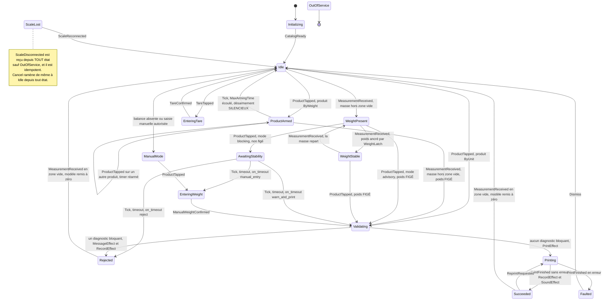

> **`EnteringUnits` et `UnitsConfirmed` ont disparu, et ce n'est pas un oubli.** Un produit vendu à l'unité s'imprime **au premier toucher, pour 1 unité** — même geste et même immédiateté qu'un produit au poids (§14.3, ADR-023). La quantité multiple est une **affordance locale de la tuile**, tenue par le front, transportée par le champ `units` du `POST /api/v1/weigh` déjà existant (§14.5) : elle ne fait pas sortir de la grille, donc elle n'est **pas un état de la machine**. Le garde-fou n° 10 `UNITS_OUT_OF_RANGE` continue de s'appliquer côté Go, à `Validating`, comme pour tout autre champ soumis. Sur le fichier authentique, 15 produits sur 355 sont concernés (préfixe `0499`) — et dans l'immense majorité des cas la réponse est « 1 ».

**Transitions structurantes après A3 :**

| État | Événement | Garde | Suivant | Effets |
|---|---|---|---|---|
| `Idle` | `ProductTapped` | produit `ByUnit` | `Validating` | — (quantité = 1, ou celle du sélecteur de tuile) |
| `Idle` | `ProductTapped` | produit `ByWeight` | **`ProductArmed`** | `MessageEffect(« Posez votre produit »)`, `ArmTimerEffect(MaxArmingTime)` |
| **`ProductArmed`** | `MeasurementReceived` | masse **hors** zone vide | `Validating` | — (**le poids est figé ici**) |
| **`ProductArmed`** | `ProductTapped` | autre produit | `ProductArmed` | nouvelle sélection, timer **réarmé** |
| **`ProductArmed`** | `Tick` | écoulé ≥ `MaxArmingTime` (10 s) | `Idle` | désarmement **silencieux**, aucun message |
| `WeightPresent` / `WeightStable` | `ProductTapped` | **mode informatif**, gardes OK | `Validating` | — (**le poids est figé ici**) |
| `WeightPresent` | `ProductTapped` | **mode bloquant**, non figé | `AwaitingStability` | `MessageEffect(Info)`, `ArmTimerEffect` |
| `AwaitingStability` | `Tick` | écoulé ≥ Timeout, `warn_and_print` | `Validating` | journalise `stability='unstable'` |
| `Validating` | *(interne)* | aucun diagnostic bloquant | `Printing` | `PrintEffect` |
| `Validating` | *(interne)* | un bloquant | `Rejected` | `MessageEffect`, `RecordEffect(rejected)` |
| `Printing` | `PrintFinished{nil}` | — | `Succeeded` | `RecordEffect`, `SoundEffect("ok")` |
| `Succeeded` / `Rejected` | `MeasurementReceived` en zone vide | — | `Idle` | reset complet du modèle |
| tout sauf `OutOfService` | `ScaleDisconnected` | — | `ScaleLost` | `MessageEffect`, timer de reconnexion |

> **Pourquoi `ProductArmed` est borné à 10 s, et pourquoi il se désarme sans rien dire.** Le risque de l'armement est unique et concret : un client choisit son produit, se ravise et s'en va ; le client suivant pose son sac et repart avec l'étiquette du premier. `MaxArmingTime` — **10 s, constante du code**, pas un réglage — le supprime : c'est plus que le temps d'ouvrir un sac et moins que le temps de changer de client. Le désarmement est silencieux parce qu'il n'y a personne devant l'écran pour lire un message, et qu'un écran qui parle tout seul dans un magasin vide est du bruit. Toucher un autre produit réarme sur le nouveau : la dernière intention exprimée gagne, toujours.
>
> **`Rejected` retombe sur le même signal physique que `Succeeded`.** Ni l'un ni l'autre n'attend un chronomètre : le client retire son sac, la balance repasse en zone vide, l'écran revient au repos. C'est le signal que la machine possède déjà, et il est plus juste qu'une durée devinée.

### 6.7 Invariants vérifiés par test

1. Depuis n'importe quel état, `Cancel` mène à un état où `CurrentProduct == nil` et `Label == nil`.
2. `PrintEffect` n'est émis **que** par la transition sortante de `Validating`, et **exactement une fois par cycle** (pas de double étiquette).
3. `LatchedWeight` n'est jamais modifié après la sortie de `Validating`.
4. Aucun cycle sans passage par `Idle` : pas d'étiquettes en rafale sur une même pose de sac.
5. `Transition` ne panique jamais — test exhaustif du produit cartésien (16 états × 14 événements = **224** couples).
   *(Le produit avait maigri de 224 à 208 : `EnteringUnits` s'en allait et `ProductArmed` prenait sa place — 16 états inchangés —, mais l'événement `UnitsConfirmed` disparaissait avec la surcouche qui l'émettait, soit 16 couples de moins à couvrir. Supprimer un écran allège aussi le test. Il revient à 224 avec `ConfigurationRepaired`, quatorzième événement et seule sortie de `OutOfService` — un état ne se quitte pas en dehors de la machine.)*
6. `Price` est monotone : `remise(t1) ≥ remise(t2) ⇒ montant(t1) ≤ montant(t2)` — une remise plus grande ne coûte jamais plus cher (10⁴ tirages).
7. `Divide` est exacte : comparaison à `big.Rat` sur `num ∈ [−3000, 3000] × den ∈ {1,3,10,100,1000}` = 30 005 cas, et `D(−n) == −D(n)`.
8. **L'armement expire.** Depuis `ProductArmed`, `MaxArmingTime` + 1 tic sans mesure hors zone vide ramène à `Idle` avec `CurrentProduct == nil` : **aucune sélection ne survit au départ d'un client**, et aucune étiquette ne peut être imprimée pour le sac du suivant.

---

## 7. L'étiquette — reproduction à l'identique (A1)

### 7.1 La décision et ses chiffres

> **« Les étiquettes actuelles fonctionnent très bien, donc je propose de conserver l'arbitrage qui a été fait et de sortir les étiquettes à l'identique. »**

**Le symbole EAN-13 reste délibérément tronqué.** Ce n'est plus un défaut à corriger, c'est un compromis assumé et documenté.

| Grandeur | Valeur retenue | Norme EAN-13 (SC2, 100 %) |
|---|---|---|
| Module X | **0,293 mm** (293 µm) | 0,330 mm |
| Grandissement | **88,8 %** — *dans* la plage GS1 [80 % ; 200 %] | 100 % |
| Largeur hors-tout (113 modules) | **33,11 mm** | 37,29 mm |
| Largeur des barres (95 modules) | **27,84 mm** | 31,35 mm |
| Hauteur des barres | **11,72 mm** *(barres seules ; la HRI ajoute 2,93 mm sous la ligne de base — §7.4)* | **22,85 mm** *(soit 20,29 mm une fois ramenée au grandissement retenu de 88,8 %)* |
| Troncature | **≈ 58 %** : 11,72 mm de barres là où la norme, ramenée à ce grandissement, en demande 20,29 | — |

**La justification, une fois pour toutes.** Un EAN-13 conforme à ce grandissement occupe **33,1 × 23,3 mm** (barres 20,3 mm + ≈ 3 mm de chiffres lisibles). Sur une étiquette de **40 × 25 mm**, il ne resterait pas 2 mm pour les cinq champs texte imposés (nom du produit, poids, prix au kilo, prix adhérent, prix solidaire). **La troncature est le seul moyen de faire tenir l'ensemble**, et les étiquettes passent en caisse depuis des années : c'est la preuve qui compte.

**Ce qui en découle et qui est fait :**

1. une **règle de validation dure** refuse tout gabarit dont le contenu encré dépasse la **géométrie encrée que la tête déclare** — **35 × 25 mm, soit 280 × 200 dots**, sur la SATO WS408 du parc (§7.5, ADR-045) ;
2. **le chiffre appartient à l'imprimante, pas au noyau** : le chemin de production envoie un rendu raster à une file d'impression Windows **déjà installée et déjà calibrée**, et c'est le driver qui rapporte ce que sa tête encre. *(L'affirmation « aucune mesure de rouleau n'est requise » a été **retirée le 29/07/2026** : le banc a montré que la géométrie tenue jusque-là venait d'un PDF de test que le pilote n'avait jamais produit, et que le poste déclarait une zone imprimable **cinq millimètres plus large que le papier**. L'ordre d'autorité est désormais écrit : l'imprimante d'abord, le pied à coulisse ensuite, les documents en dernier — amendement d'ADR-003.)* ;
3. l'**ADR-003** écrit noir sur blanc que le symbole est volontairement tronqué, avec la raison, pour que personne ne « corrige » ce choix dans six mois.

**Les critiques bloquant-3, bloquant-4, bloquant-5 et bloquant-10 sont closes sans objet** : elles portaient toutes sur la mise en conformité du symbole (grandissement 75,8 % à 2 dots, changement de consommable, gabarit `weighing_40x40`, budget vertical). Voir ADR-003.

### 7.2 Le gabarit `weighing_identical` — géométrie exacte
> **AMENDÉ PAR ADR-029 — à lire avant d'utiliser les valeurs de cette section.** La
> géométrie ci-dessous est celle de l'étiquette **telle qu'elle est imprimée
> aujourd'hui**, et elle a été **confirmée à 40 µm près** par la mesure du flux de
> contenu de `reference/test_etiquette_EtataImprimer.pdf`. Deux corrections en
> découlent :
>
> 1. **Le texte recouvre les barres, et c'est un choix du commanditaire** — les deux
>    prix mangent 4 573 µm des 11 722 µm de barres, qui ne sont donc propres que sur
>    **8 341 µm**, soit 71 % de l'annoncé. ADR-029 empile les trois lignes et pose le
>    symbole **sous** elles : les barres deviennent **uniformes**. ADR-029 les avait
>    posées à 10 875 µm en s'interdisant de toucher à l'interligne et à la bande HRI ;
>    **ADR-051 a levé cet interdit et la valeur livrée est 11 375 µm**, soit **+36 %**
>    de hauteur réellement lisible contre les 8 341 µm propres de l'existant.
> 2. **L'origine du symbole donnée ici (8 996 µm) est celle de la BOÎTE du contrôle
>    Access**, pas celle du symbole tracé : la ligne de base du glyphe est à
>    21 326 µm et les barres commencent à **9 604 µm**, 608 µm plus bas. La hauteur du
>    bloc, 14 650 µm, est exacte.
>
> La géométrie **livrée** est celle d'ADR-029 ; les valeurs ci-dessous restent la
> description de l'existant, et c'est à ce titre qu'elles font foi.

Source : `reports/EtataImprimer.report` de l'export MSAccess VCS. Conversion **1 mm = 56,6929 twips**, résolution de la tête **8 dots/mm** (203,2 dpi, 1 dot = 0,125 mm).

**État** : largeur 2109 twips = **37,199 mm** ; section Détail 1430 twips = **25,224 mm**. Zone encrée mesurée sur PDF de test : **35,11 × 25,23 mm** — cohérent avec la largeur du contrôle `Produit` (1983 twips = 34,98 mm).

| Élément | Contrôle Access | X (twips → µm) | Y (twips → µm) | L × H (µm) | Corps | Style | Alignement |
|---|---|---|---|---|---|---|---|
| `product_name` | `Produit` | 0 → **0** | 0 → **0** | 34 978 × 3 916 | 9 pt = 3 175 µm | normal | gauche, 1 ligne |
| `quantity` | `PoidsUnites` | 0 → **0** | 204 → **3 599** | 16 140 × 5 027 | 9 pt | normal | gauche |
| `primary_unit_price` | `Prixaukilo` | 852 → **15 029** | 204 → **3 599** | 20 020 × 4 763 | 9 pt | **gras + cadre 1 dot** | **droite** |
| `secondary_total_price` | `LabelAPayer` | 0 → **0** | 426 → **7 514** | 15 011 × 2 999 | **7 pt = 2 469 µm** | normal | gauche |
| `primary_total_price` | `Prix` | 1021 → **18 011** | 454 → **8 008** | 17 022 × 5 009 | **11 pt = 3 881 µm** | **gras** | **droite** |
| `barcode` | `CodeBarre` | 0 → **0** | 510 → **8 996** | 34 837 × 16 228 | *(voir §7.4)* | — | gauche |

En dots (8 dots/mm), ce que le rastériseur produit réellement :

| Élément | X (dots) | Y (dots) | L × H (dots) | em (dots) |
|---|---|---|---|---|
| `product_name` | 0 | 0 | 280 × 31 | 25,4 |
| `quantity` | 0 | 28,8 | 129 × 40 | 25,4 |
| `primary_unit_price` | 120,2 | 28,8 | 160 × 38 | 25,4 |
| `secondary_total_price` | 0 | 60,1 | 120 × 24 | **19,8** ← plancher de lisibilité |
| `primary_total_price` | 144,1 | 64,1 | 136 × 40 | 31,0 |
| `barcode` — *boîte du contrôle Access* | 0 | 72,0 | 278,7 × 129,8 | — |
| `barcode` — **symbole réellement tracé** (§7.4) | 0 | 72,0 | **265 × 117** | — |
| **Section Détail (boîte Access)** | | | **280 × 202** | |
| **Contenu réellement encré** | | | **280 × 189** | |

> **Deux lignes pour `barcode`, et c'est important.** La colonne µm de la table précédente décrit la **boîte du contrôle Access** (`CodeBarre`, 1975 × 920 twips = 34 837 × 16 228 µm), qui est un conteneur de label — il déborde volontairement le symbole. La colonne dots de la ligne suivante décrit le **symbole que le rastériseur trace** : 113 modules de hors-tout = 264,9 → **265 dots** de large (§7.4), et 93,8 dots de barres + 23,4 dots de bande HRI = 117,2 → **117 dots** de haut. Confondre les deux — ce que faisait la version précédente de cette table, en donnant « 265 × 130 » — mélange le conteneur et le contenu sur la même ligne, alors que **c'est cette ligne qui fixe la place de la zone de silence droite dans la largeur du média** et qui alimente la règle dure n° 3 de §7.5. **Ce qui contraint, c'est le contenu encré : 189 dots de haut, pas 202.**

**Contenu des champs (A7).** Le préfixe imprimé est l'`Abbrev` du tarif, suivi de `": "` — exactement `"A: 4,79 €/kg"`, `"S: 6,58 €"`, `"A: 5,92 €"`. **Le suffixe `€/kg` n'est pas une constante du gabarit** : c'est le `PriceSuffix` du produit, issu de la colonne `unite` du CSV (§10.2) — ` €/kg`, ` € le litre` ou ` € l'unité`. Le champ est dimensionné sur le plus long des trois, `" € le litre"`. En mono-tarif, `Abbrev` est vide et `secondary_total_price` porte la condition `when: "multi_tier"` : le champ disparaît, aucun code conditionnel n'est nécessaire.

**Le champ à 7 points est au plancher de lisibilité thermique** (em = 19,8 dots). Règle du moteur : **tout élément dont l'em est < 20 dots est rendu dans la variante Bold** de la police embarquée — **sauf `auto_bold: false`.**

> **⚠ CE CHAMP N'EXISTE PLUS À 7 POINTS DANS LE GABARIT LIVRÉ.** La relecture à
> 60–80 cm que cette section annonçait comme « critère de sortie de L4/L5 » a été
> faite, et elle a tranché **le 29/07/2026** : le prix solidaire était illisible au
> corps 7 face au corps 11 du prix adhérent. **Les deux prix partagent désormais un
> corps** — `secondary_total_price` est à **3 888 µm (11 pt)** dans
> `internal/domain/templates.go`, et non à 2 469. Deux conséquences que ce document
> n'a pas répercutées :
>
> 1. `auto_bold: false` **n'a plus de rôle fonctionnel** : à 31 dots d'em le champ est
>    très au-dessus du seuil de 20 dots, donc la règle automatique ne se déclencherait
>    pas de toute façon. Le drapeau ne subsiste que comme trace d'une intention.
> 2. **Aucun champ de `weighing_identical` n'est plus au plancher de lisibilité.** Les
>    trois lignes valent 9 / 9 / 11 pt. L'argument « le 7 pt est au plancher » ne peut
>    plus servir à justifier quoi que ce soit sur le budget vertical.
>
> **Ce que le gabarit livré fait autrement, en deux points, tous deux du 29/07/2026 :**
> le **cadre de `primary_unit_price` est retiré** (`Framed: false` — l'encre qu'il
> économise est celle que la zone de silence du symbole n'avait pas), et le **corps du
> prix solidaire passe de 7 à 11 pt**. Les lignes correspondantes des deux tableaux
> ci-dessus décrivent l'**existant Access**, pas le livré.

### 7.3 Le moteur de rendu

**Un rendu unique, quatre consommateurs** — et cette fois c'est vrai sans réserve, puisque le symbole est dans le même bitmap (A2, important-1, important-5) :

```go
// internal/printing/render.go

// RenderOptions carries the debugging overlays Rasterize may add to a label.
type RenderOptions struct {
    // Annotate draws the printable area, the barcode quiet zones and a ruler.
    Annotate bool
}

// Rasterize renders the WHOLE label — text, frames, EAN-13 symbol and its HRI
// line — at the exact pitch of the print head.
//
// Media dimensions come from the TEMPLATE (media.width_um, media.height_um,
// media.dots_per_mm), never from a constant of the engine. The value shipped in
// weighing_identical is 35 x 25 mm, i.e. 280 x 200 dots at 8 dots/mm — the
// printable area the SATO driver of the parc holds, measured on the bench of
// 28/07/2026. It aligns the life-size preview; its SIZE validates nothing.
// Hard rule 3 compares the inked content to the geometry the HEAD DECLARES
// (PrinterCapabilities.InkedWidthDots / InkedHeightDots, see 7.5-3 and ADR-045);
// media.dots_per_mm alone stays load-bearing, as the single source of resolution
// and as the head this template was measured for.
//
// The RenderOptions.WithBarcode field is GONE (A2 / important-1): no consumer
// delegates the symbol to the firmware any more.
func Rasterize(g *domain.Template, label domain.Label, loc domain.Locale, o RenderOptions) (*image.Gray, error)
```

| Besoin | Bibliothèque | Pur Go |
|---|---|---|
| Analyse TrueType | `golang.org/x/image/font/sfnt` | oui |
| Fonte à une taille | `golang.org/x/image/font/opentype` (rastériseur `x/image/vector`) | oui |
| Tracé et mesure | `x/image/font.Drawer`, `font.MeasureString` | oui |
| Police embarquée | `//go:embed Carlito{,-Bold}.ttf` (SIL OFL) — **métriquement compatible Calibri** ; `DejaVuSansCondensed{,-Bold}.ttf` en second jeu | oui |
| Symbole EAN-13 | **implémentation locale**, §7.4 | oui |
| Rectangles, cadres | `image/draw` (stdlib) | oui |

**La police de l'existant est Calibri, et c'est la seule divergence de fond avec « à l'identique ».** Le source le dit sans ambiguïté : le bloc de valeurs par défaut de `reports/EtataImprimer.report` porte `FontSize = 11 / FontName = "Calibri"`, et **aucun** des cinq labels ne surcharge `FontName`. Les cinq champs texte de l'étiquette de production sont donc en **Calibri**.

**Calibri n'est pas redistribuable** : c'est une police propriétaire Microsoft, sous licence liée au système ou à Office. On ne peut ni l'embarquer dans le binaire, ni la supposer présente sur un poste Linux. La substitution est donc **obligatoire**, et le seul choix qui reste est celui du substitut :

| Substitut | Licence | Métriques | Conséquence sur l'étiquette |
|---|---|---|---|
| **Carlito** *(retenu)* | SIL OFL 1.1, redistribuable | **métriquement compatible Calibri** : mêmes chasses, mêmes crénages, même largeur de chaîne au 1/1000 d'em | les cinq champs occupent **la même largeur qu'aujourd'hui** ; le dessin des glyphes diffère à la loupe, la mise en page ne bouge pas |
| DejaVu Sans Condensed | Bitstream Vera, redistribuable | chasse **plus large** que Calibri de 10 à 15 % — *mesuré*, voir la note — métriques sans rapport | les champs **déborderaient** de leur boîte et déclencheraient la réduction automatique du corps, au lieu de simplement finir plus tôt |

> **Le sens de l'écart de DejaVu a été mesuré, et il est l'inverse de ce que cette table
> a longtemps affirmé.** Son nom « Condensed » invite à la croire plus étroite ; elle ne
> l'est que par rapport à la DejaVu Sans ordinaire, pas par rapport à Calibri, qui est
> une humanistique déjà très économe. Rendues au même corps,
> `internal/printing/metrics_test.go` mesure DejaVu Sans Condensed **plus large** que
> Carlito de +10,65 % à +15,30 % selon la chaîne (« TRUC SUPER CHER » : +13,39 % ;
> « 0,250 kg » : +15,30 %). La conclusion d'ADR-020 ne change pas — elle se renforce :
> un texte plus large ne finit pas plus tôt, il **sort de son champ** et déclenche la
> boucle de réduction de §7.3, ce qui changerait le corps imprimé et non seulement la
> position de fin de chaîne.

**Décision : `Carlito` est la police de `weighing_identical`** (Regular + Bold, ~700 ko pour les deux, embarqués) — **ADR-020**. DejaVu Sans Condensed reste embarquée comme police des **gabarits neutres** et comme repli si Carlito manque à un caractère : **elle n'est la police d'aucun champ de l'étiquette de production.** **Critère de recette de L4, mesurable et non subjectif** : pour les 5 chaînes réelles de l'étiquette de démonstration, `font.MeasureString` avec Carlito au corps du gabarit doit rendre une largeur **à moins de 1 % de la largeur mesurée sur le PDF de test produit par Access en Calibri** ; au-delà, l'écart est journalisé et remonté avant de figer le gabarit. C'est ce qui rend vérifiable le critère « superposé à une étiquette de production sur une table lumineuse, il coïncide ».

```go
img := image.NewGray(image.Rect(0, 0, widthDots, heightDots))
draw.Draw(img, img.Bounds(), image.NewUniform(color.Gray{0xFF}), image.Point{}, draw.Src)

face, err := opentype.NewFace(fnt, &opentype.FaceOptions{
    Size: float64(el.FontSizeUM) * 72.0 / 25400.0, // typographic points
    DPI:  g.Media.DotsPerMM * 25.4,                // 203.2 — SINGLE SOURCE (mineur-3)
})
// Deliberately NO "Hinting: font.HintingFull": x/image/font/sfnt does not hint
// outlines at all ("This implementation does not support hinting"), so the
// setting would only affect METRICS while pretending to sharpen small sizes.
//
// WHAT ACTUALLY GUARANTEES LEGIBILITY (mineur-1): there is NO "em >= 20 dots"
// invariant. The shipped template goes down to 19.8 dots on
// secondary_total_price, and hard rule 9 only sets a floor at
// font_size_um >= 1800 (14.4 dots). What remains, and is real:
//   1. the hard floor of rule 9, which rejects any template below 1800 um;
//   2. the automatic switch to Bold below 20 dots of em, EXCEPT auto_bold:false
//      (the case of weighing_identical, see 7.2);
//   3. the differentiated thresholding below, which preserves thin stems;
//   4. above all a PHYSICAL exit criterion for L4/L5: real printing, read back
//      at 60-80 cm. The legibility of a 7 pt body on a thermal head cannot be
//      demonstrated from a desk.

// FINAL thresholding, mandatory: the head is binary. Keeping grays would let
// the driver dither the render and produce irregular bars — precisely the
// defect we refuse to introduce.
// The threshold is DIFFERENTIATED (mineur-1): the symbol is already drawn in
// pure black and white and is insensitive to it, while text goes down to 0x68
// to preserve thin stems.
applyThreshold(img, symbolArea, 0x80)
applyThreshold(img, restOfLabel, g.TextThreshold) // default 0x68
```

**Trois corrections d'ingénierie** (mineur-1) : les `font.Face` sont **mémoïsées** dans une `map[faceKey]font.Face` où **`faceKey = struct{ Font string; PPEM int; Bold bool }`** — une clé réduite au seul ppem confondrait Regular et Bold au même corps, ce qui, avec le passage automatique en Bold sous 20 dots, rendrait un style pour l'autre ou écraserait l'entrée à chaque alternance — et fermées à la destruction du rastériseur — la boucle de réduction automatique en créait jusqu'à 20 par champ et par étiquette, jamais fermées ; la réduction descend par pas de 0,1 mm jusqu'à `MinFontSizeUM` puis **tronque avec ellipse** au dernier corps valide en journalisant une anomalie technique, au lieu de sortir silencieusement ; et le repli de police est `gofont/gobold` + `goregular` (`[]byte` en dur, BSD-3) si le fichier embarqué manque.

> **Mémoïser une face ne suffit pas à la partager, et la différence est un plantage.**
> Ni `sfnt.Font` ni `opentype.Face` ne sont sûrs en concurrence : chacun réutilise d'un
> glyphe au suivant un tampon de travail et un rastériseur vectoriel. Protéger la *carte*
> des faces mémoïsées tout en distribuant les faces elles-mêmes à des goroutines qui
> tracent en parallèle ne protège donc rien. Deux aperçus d'étiquette simultanés ont
> planté le poste ainsi — l'aperçu se rafraîchit à chaque frappe dans l'éditeur de
> gabarit, et « quatre consommateurs » veut dire quatre goroutines. **Un rendu prend
> l'exclusivité de sa bibliothèque pour toute sa durée** : quelques millisecondes, et un
> poste imprime une étiquette à la fois. Le verrou est distinct de celui qui garde la
> carte, et `Close()` le prend aussi — libérer un rastériseur sous une goroutine qui
> trace encore est le même plantage. `internal/printing/concurrency_test.go` fait
> échouer la version sans verrou en quelques dizaines de rendus.

### 7.4 Le symbole, tracé à module fractionnaire

C'est **le** point technique de l'arbitrage A1. Le module vaut 0,293 mm, soit **2,344 dots** à 203 dpi : il n'est **pas entier**. Tout rendu de ce symbole doit donc caser 2,344 dots par module, et aucun ne peut faire autrement qu'alterner des barres de 2 et de 3 dots. C'est ce qu'aucun langage d'imprimante ne sait exprimer, puisque le module s'y déclare en dots entiers : **seul un rendu raster y parvient, et c'est la justification arithmétique du choix « raster par défaut » (A2).**

> **Ce que nous reproduisons, et ce que nous ne prétendons pas reproduire.** L'alternance 2/3 dots réellement imprimée aujourd'hui est produite par une **fonte** et par le **rastériseur GDI** du pilote (encadré suivant : le fait et ses métriques), pas par un arrondi de position idéale. Nous faisons un **choix délibéré** : tracer le symbole **géométriquement**, par arrondi de la position idéale de chaque bord. Ce choix est **déterministe, testable au pixel et sans dépendance à un rastériseur de fontes** (ADR-019). Il garantit **le même module moyen, le même hors-tout, la même séquence de modules et chaque bord à ±0,5 dot** — il ne garantit **pas** l'égalité bit à bit avec le rendu GDI actuel, et le document ne le prétend nulle part. **Ce qui tranche est physique** : 50 étiquettes de production contre 50 étiquettes neuves, passées **au même scanner de caisse**, refus et relectures comptés — critère de recette de L5, protocole identique à celui de §7.6.

> **Comment le symbole est produit AUJOURD'HUI — le fait, et ce qu'il implique.** Le symbole actuel **n'est pas tracé** : c'est un **label en police TrueType**. Le source le dit sans ambiguïté (`reports/EtataImprimer.report`, contrôle `CodeBarre`) : `FontName = "Code EAN13"`, `FontSize = 34`, `Caption = "1CDOFQR*iacfad+"` (15 glyphes : garde gauche + 6, garde centrale, 6 + garde droite), boîte de 1975 × 920 twips. Le rendu final est celui de **GDI**, via le pilote.
>
> **La fonte a été ouverte, et elle a répondu — l'inconnue de la HRI est close.** Il s'agit de la fonte `Code EAN13` de *grandzebu*, **sous LGPL, donc redistribuable**. Ses métriques, relevées sur le PDF de test : `FontBBox [0 −244 342 977]`, ascendante **977**, descendante **−244**, soit une boîte de **1,221 em**. **Au corps 34 pt du contrôle `CodeBarre`** :
>
> | Ce que la fonte dessine | Fraction d'em | En points | En mm | En dots (8/mm) |
> |---|---|---|---|---|
> | Barres, au-dessus de la ligne de base | 0,977 em | 33,2 pt | **11,72 mm** | **93,8** |
> | Chiffres lisibles, dans la descente | 0,244 em | 8,3 pt | **2,93 mm** | **23,4** |
> | **Boîte totale du glyphe** | **1,221 em** | **41,5 pt** | **14,65 mm** | **117,2 → 117** |
>
> Chaque glyphe `A`–`J` / `K`–`T` / `a`–`j` dessine **7 modules de barres ET le chiffre lisible en dessous** ; le premier caractère de la chaîne encodée (`1`, un chiffre brut) dessine le chiffre **placé à gauche du symbole** ; `*` est la garde centrale et `+` la garde droite. **La ligne HRI existe donc déjà sur l'étiquette de production, elle est tracée par la police, et sa hauteur est mesurée, pas supposée.** Ces trois valeurs — 11,72 / 2,93 / 14,65 mm — sont les **valeurs de référence du gabarit A**. Il n'y a plus rien à décider sur la présence de la HRI ; il reste à **confirmer sur site la hauteur imprimée des barres et la position du bloc sur la découpe** (§21 n° 2).
>
> **Pourquoi ne pas simplement embarquer cette fonte, alors ?** C'était une option réelle — sa licence LGPL le permet. Elle est **écartée** au profit du tracé géométrique : voir **ADR-019**. En deux mots : une fonte fait dépendre le symbole d'un rastériseur de contours (hinting, arrondis, version de la bibliothèque), là où l'arrondi entier de `edge(i)` est reproductible au pixel, testable par golden et lisible dans le code.

```go
// internal/printing/symbol.go

// Modules returns the 95 modules of an EAN-13: true means bar (black).
// Layout: 3 (left guard) + 6x7 + 5 (centre guard) + 6x7 + 3 (right guard) = 95.
func Modules(e domain.EAN13) ([95]bool, error)

// SymbolOptions describes the geometry of one EAN-13 symbol, in dots.
type SymbolOptions struct {
    XDots, YDots     int
    ModuleMilliDots  int       // 2344 = 2.344 dots = 0.293 mm
    BarHeightDots    int       // 94 in template A (11.72 mm)
    GuardDescentDots int
    HRIFace          font.Face // size derived from hri_height_um by the template
    HRIHeightDots    int       // 23 in template A (2.93 mm) — never 0
}

// DrawEAN13 draws the symbol at a FRACTIONAL module.
//
// ModuleMilliDots is an integer count of milli-dots: 2344 = 2.344 dots =
// 0.293 mm at 8 dots/mm. Every module edge is the rounded IDEAL position, never
// an accumulation of a rounded step:
//
//	edge(i) = (i*ModuleMilliDots + 500) / 1000
//
// Consequences, all covered by tests:
//   - the position error of an edge is bounded by 0.5 dot, with no cumulative
//     drift over the 95 modules (accumulating 2 or 3 dot steps would reach
//     15 dots of error at the end of the symbol);
//   - the total width is round(95 * 2.344) = 223 dots = 27.875 mm;
//   - bars alternate between 2 and 3 dots, as does ANY render of this module at
//     this resolution. That is the INTENDED behaviour, not a defect. What this
//     drawing does NOT claim: being bit-for-bit identical to the sequence the
//     "Code EAN13" font rasterized by GDI produces today. Geometric drawing is
//     a deliberate choice (deterministic, testable pixel by pixel) and is
//     settled by real checkout scanning, not by pixel equality (ADR-019).
//
// The HRI is part of the symbol (important-5) and is ALWAYS drawn: it exists on
// the current label, where the font draws it inside its own descent (see the
// note above). DrawEAN13 therefore also receives the 13 digits and the render
// face; without them the function could not draw the line it is credited with —
// that was the flaw of the previous signature.
func DrawEAN13(dst *image.Gray, e domain.EAN13, m [95]bool, o SymbolOptions) error {

    edge := func(i int) int { return (i*o.ModuleMilliDots + 500) / 1000 }
    for i, black := range m {
        if !black {
            continue
        }
        h := o.BarHeightDots
        if i < 3 || (i >= 45 && i < 50) || i >= 92 {
            h += o.GuardDescentDots // guards run 5 X lower
        }
        r := image.Rect(o.XDots+edge(i), o.YDots, o.XDots+edge(i+1), o.YDots+h)
        draw.Draw(dst, r, image.NewUniform(color.Gray{0x00}), image.Point{}, draw.Src)
    }
    return drawHRI(dst, e, o, edge) // ALWAYS: 1 digit on the left + 6 + 6
}
```

**La HRI est tracée par nous, pour tous les drivers** (important-5) : premier chiffre à gauche du symbole dans la zone de silence gauche, six chiffres sous le groupe gauche, six sous le groupe droit — **exactement la disposition que la police `Code EAN13` produit aujourd'hui**. Ce n'est pas un champ de texte libre du gabarit : c'est un élément du symbole, tracé par `DrawEAN13`, qui reçoit pour cela les 13 chiffres et une `font.Face`. **Elle n'est pas optionnelle** : la supprimer serait un écart à A1, puisqu'elle est imprimée depuis toujours. **La caissière garde son filet de secours si la douchette refuse.**

> **Où finit le symbole — UNE seule définition, normative.** Les chiffres de la HRI sont **logés dans la bande de descente des gardes** : leur ligne de base est alignée sur le **bas des barres de garde**, comme sur un EAN-13 normalisé — et comme le fait la police actuelle, dont les chiffres vivent dans la descente du glyphe. La hauteur du bloc n'est donc **pas** une somme `barres + descente + HRI`, mais :
>
> ```
> symbol_height = bar_height + max(guard_descent, hri_height)
>               = 11 720 + max(1 465 ; 2 930) = 14 650 µm = 117 dots
> ```
>
> La formulation additive qui figurait dans la règle 3 de §7.5 donnerait 16 115 µm pour la même géométrie, contre 14 650 µm pour la lecture « ligne de base alignée » : **deux hauteurs différentes pour la même règle bloquante de validation**. C'est `max(...)` qui fait foi, et c'est cette expression qui est écrite dans la règle 3 et dans le test. *(La HRI mesurée — 2 930 µm — est **plus haute** que la descente des gardes : c'est elle qui commande le bas du bloc. `max` reste écrit tel quel pour les gabarits d'exploitant qui donneraient une HRI plus basse.)*

**Géométrie du bloc symbole dans `weighing_identical` :**

| Grandeur | µm | dots |
|---|---|---|
| Module | 293 | 2,344 (`module_milli_dots = 2344`) |
| Zone de silence gauche (11 X) | 3 223 | 25,8 |
| Barres (95 X) | 27 835 | 222,7 → 223 |
| Zone de silence droite (7 X) | 2 051 | 16,4 |
| **Hors-tout (113 X)** | **33 109** | **264,9 → 265** |
| Hauteur des barres *(0,977 em au corps 34)* | 11 720 | 93,8 → 94 |
| Descente des gardes (5 X) | 1 465 | 11,7 → 12 |
| **Bande HRI — chiffres lisibles** *(0,244 em au corps 34)* | **2 930** | **23,4 → 23** |
| **Hauteur du bloc** = barres + max(descente ; HRI) | **14 650** | **117,2 → 117** |
| Origine du bloc (X, Y) | 0 ; 8 996 | 0 ; 72 |
| **Bas du bloc** | **23 646** | **189** |

> **Ce tableau décrit l'EXISTANT. Le gabarit livré fait 265 × 113, pas 265 × 117.**
> En empilant les trois lignes de texte et en posant le symbole dessous, ADR-029 avait
> descendu l'origine du bloc de 8 996 à 11 069 µm et ramené les barres de 11 720 à
> 10 875. **ADR-051 a rouvert les deux nombres qu'ADR-029 s'interdisait de toucher** —
> l'interligne et la bande HRI, tous deux hérités — et la géométrie livrée est
> désormais : origine **10 688 µm** (85,50 dots), barres **11 375 µm**, bande HRI
> **2 700 µm**. Le bloc vaut `11 375 + max(1 465 ; 2 700) = 14 075 µm = 112,6 dots`, et
> son bas tombe à **24 763 µm = 198,10 dots**.
>
> **Le budget vertical, poste par poste, tel que `IdenticalTemplate()` le calcule :**
>
> | Poste | µm | D'où il vient |
> |---|---|---|
> | 3 lignes de texte, 9 / 9 / **11** pt, 2 interlignes de 150 | 10 538 | `body9`, `body11`, `leading` |
> | Interligne texte → symbole | 150 | `leading` |
> | Barres | **11 375** | ADR-051 — 91 dots exactement |
> | `max(descente des gardes ; HRI)` = HRI | 2 700 | ADR-051 — 21 dots d'encre, 1 de jeu |
> | Marge basse | 237 | **1,9 dot** — la réserve des flèches ±1 dot, doublée |
> | **Total** | **25 000** | hauteur encrée déclarée par la tête |
>
> **Un bloc de 117,2 dots à cette origine mettrait l'encre à 202,7 dots**, au-delà des
> 200 admis par la tête : il ferait échouer la règle dure 3. Les deux chiffres ne sont
> donc pas au choix, et le 113 n'est pas une approximation du 117.
>
> **Le 117 ne subsiste nulle part, et c'est une correction du 30/07/2026.** Ce
> paragraphe affirmait que `weighing_neutral_single` et `weighing_integer_module`
> « portent toujours 11 720 µm de barres et mesurent bien 265 × 117 », et que « les
> trois gabarits terminent leur encre à 200,7–200,8 dots ». **Les deux affirmations
> sont fausses**, et la seconde décrivait un gabarit que la règle dure 3 rejette
> (200,7 > 200). Les valeurs vérifiées dans `internal/domain/templates.go` et
> mesurées par `internal/domain/template_test.go` :
>
> | Gabarit | Barres | Bloc symbole | Bas de l'encre |
> |---|---|---|---|
> | `weighing_identical` | 11 375 µm | 14 075 µm = 112,60 dots | **198,10 dots** |
> | `weighing_neutral_single` | 11 125 µm | 13 825 µm = 110,60 dots | **198,20 dots** |
> | ~~`weighing_integer_module`~~ | *retiré le 30/07/2026 (ADR-051)* | — | — |
>
> L'origine de l'erreur est identifiée : `IdenticalTemplate()` porte encore, en
> commentaire, les valeurs `3 525 / 7 050 / 10 938 / 11 288` calculées à
> `leading = 350`, avant que le banc du 28/07 ne ramène l'interligne à 277. **Les
> commentaires sont périmés, le code est juste**, et c'est le commentaire qui a été
> recopié ici.
>
> **Mesuré sur le rendu, pas seulement calculé** : le bitmap du PDF de démonstration
> donne 223 dots de hors-tout de barres, une hauteur encrée **constante à 109 pixels
> par ligne** sur toute la longueur du symbole — l'objet même d'ADR-029 — et une encre
> qui s'arrête à 199 dots.

**Tests de non-régression du symbole :**

1. `Modules("0493021012365")` produit une chaîne de 95 bits **figée dans le test**, obtenue une fois et vérifiée avec un décodeur indépendant ;
2. pour tout `i`, `|edge(i) − i×2,344| ≤ 0,5 dot` — **pas de dérive cumulative** ;
3. la largeur totale du symbole vaut exactement 223 dots ;
4. avec `module_milli_dots = 2000` — **une géométrie construite dans le test**, depuis le retrait du gabarit B (ADR-051) —, **toute plage de même couleur a une largeur multiple de 2** : l'invariant devient exact dès que le module est entier, et c'est le seul endroit où il est exactement vérifiable. Il n'avait aucune raison d'être porté par un gabarit livrable ;
5. golden au pixel près du bloc symbole, versionné en PNG ;
6. le bloc rendu mesure exactement **265 × 117 dots**, HRI comprise, et la HRI est **toujours** présente : un rendu dont la bande basse est vide fait échouer le test (les 13 chiffres sont relus sur le PNG par comparaison de gabarits de chiffres).

### 7.5 Validation d'un gabarit — 9 règles dures, et l'accord gabarit/tête

```go
// Validate reports every hard rule the template breaks, measured against the
// head of the parc; an empty slice means the template may be loaded.
func (t *Template) Validate(tierCount int) []Fault

// ValidateOn reports the same rules measured against THIS head. A station
// validates against the head its own driver declares; a head that declares
// nothing falls back on ReferenceHead.
func (t *Template) ValidateOn(head PrinterCapabilities, tierCount int) []Fault
```

1. Toutes les boîtes d'éléments sont **dans la zone imprimable** déclarée.
2. La zone imprimable est **dans le média**.
3. **Le contenu encré tient dans la géométrie encrée que la TÊTE déclare** (A1, conséquence obligatoire (a) ; ADR-045) — `PrinterCapabilities.InkedWidthDots` et `InkedHeightDots`, comptés au pas de cette tête :
   ```
   max(  bottom of every active text element,
         symbol.y + symbol.bar_height + max(symbol.guard_descent, symbol.hri_height)  )
     <= head.InkedHeightDots
   right edge of the widest active element, quiet zones included
     <= head.InkedWidthDots
   ```
   Sur le parc — une SATO WS408 — cette déclaration vaut **280 × 200 dots à 8 dots/mm**, mesurés au banc du 28/07/2026 (amendement d'ADR-003). Ce couple reste écrit dans le noyau sous le nom de `ReferenceHead`, mais comme **repli et non comme loi** : c'est ce sur quoi retombe un appelant qui n'a pas de descripteur en main — `Validate`, l'aperçu, un driver qui n'encre rien. Tenu en constante, il faisait échouer ce contrôle **au démarrage**, sur un gabarit que personne ne pouvait lui faire accepter, à tout poste dont la tête n'est pas celle du parc.

   **Règle bloquante, testée, qui fait échouer la CI.** Elle porte sur le **contenu encré**, jamais sur la boîte du contrôle Access dont il est issu (§7.2) : cette boîte est un conteneur de label de l'ancienne application, elle déborde volontairement le symbole et n'est imprimée nulle part.

   > **La référence de cette règle est l'imprimante, pas le média déclaré.** Comparer un gabarit à `media.height_um` reviendrait à faire décider la géométrie par un chiffre que le gabarit écrit lui-même. Ce qui contraint réellement, c'est **la surface que la tête encre**, et c'est la tête qui la déclare. `media` reste dans le gabarit — il cale l'aperçu grandeur nature —, mais **aucune règle ne dépend de sa taille**. Une seule de ses valeurs est structurante, et c'est la résolution : voir la règle 3 bis.
   >
   > *(L'ordre d'autorité posé par l'amendement d'ADR-003 vaut ici aussi : l'imprimante d'abord, le pied à coulisse ensuite, les documents en dernier. La phrase « aucune mesure de rouleau n'est requise » a été retirée le 29/07/2026 — c'était précisément la mesure qui manquait.)*

   **Règle 3 bis — le gabarit et la tête comptent les dots au même pas.** `template.media.dots_per_mm` reste la **source unique de résolution** (mineur-3), et c'est aussi la déclaration de la tête pour laquelle ce gabarit a été mesuré. Le noyau refuse l'attelage incohérent **au chargement**, en français, en nommant les deux chiffres : *« le gabarit est mesuré pour une tête de 8 dots/mm et la tête d'impression en fait 12 dots/mm : à ce module le symbole sortirait à un autre grandissement »*. Ce n'est pas une précaution de style : `symbol.module_milli_dots` est **la seule longueur d'un gabarit exprimée en unités de résolution** — délibérément, 0,293 mm valant 2,344 dots, et ce module fractionnaire est tout l'intérêt technique de A2. Les mêmes 2 344 milli-dots impriment 0,293 mm sur une WS408 et 0,195 mm sur une WS412, **sous tous les planchers GS1, sans qu'un seul octet de la trame le dise**. L'étiquette sortirait simplement fausse.

4. Le hors-tout du symbole `113 × module_milli_dots / 1000` tient dans la **largeur encrée déclarée par la tête** — même référence que la règle 3, donc même indépendance vis-à-vis du média déclaré.
5. Aucun élément n'intersecte le rectangle du symbole **zones de silence comprises**.
6. `offset_x` / `offset_y` sont appliqués **AVANT** la validation (mineur-2) : un décalage qui ferait sortir une zone de silence est refusé avec le message *« ce décalage rognerait la zone de silence du code-barres ; maximum admissible : N dots »*. Les flèches ±1 dot de l'admin invitent à ce réglage : il doit être borné par la géométrie, pas seulement par ±99.
7. Chaque `field` appartient à la liste **fermée** des `FieldID` ; chaque `when` existe. Pas de moteur de template, donc pas d'injection ni d'erreur de rendu à l'exécution.
8. Aucun chevauchement entre deux éléments actifs sous une même condition.
9. `module_milli_dots ∈ [1500, 6000]` et `font_size_um ≥ 1800` pour tout élément.

   > **Amendement du 30/07/2026 — ces bornes n'ont pas d'origine, et la bonne en a une.**
   > `[1500, 6000]` milli-dots ne dit rien : la borne vaut 0,1875–0,750 mm sur une tête
   > à 8 dots/mm et 0,125–0,500 mm sur une tête à 12, c'est-à-dire qu'elle **accepte du
   > non-conforme sur l'une et refuse du conforme sur l'autre**. Elle est écrite en
   > unités de résolution alors qu'elle contrôle une grandeur physique.
   >
   > La règle qui a une origine est la plage GS1 elle-même, traduite à la résolution que
   > **la tête déclare** (ADR-045), et complétée par le hors-tout :
   >
   > ```
   > X = module_milli_dots / (1000 × head.DotsPerMM)      en mm
   > 0,264 ≤ X ≤ 0,660                                    plage GS1 (80 %–200 %)
   > 113 × X × head.DotsPerMM ≤ head.InkedWidthDots       zones de silence comprises
   > ```
   >
   > Sur la tête du parc, ces deux conditions donnent **X ∈ [0,2640 ; 0,3097] mm**, soit
   > `module_milli_dots ∈ [2112, 2478]` — une fenêtre quatre fois plus étroite que
   > `[1500, 6000]`, et qui **exclut le gabarit B** (`2000` = 75,8 %, sous le plancher).
   > C'est le contrôle que §7.6 attendait d'un ADR et qu'aucune règle ne rendait.
   >
   > Le plancher `font_size_um ≥ 1800` (≈ 5,1 pt) est cohérent avec `MinFontSizeUM` mais
   > **contredit le « plancher de lisibilité thermique » de §7.2**, qui est à 2 469 µm.
   > Les deux nombres coexistent parce qu'ils mesurent deux choses : 1 800 est la limite
   > au-delà de laquelle le rendu casse, 2 469 celle au-delà de laquelle un bénévole ne
   > lit plus. **Seul le second a été validé physiquement** (relecture à 60–80 cm du
   > 29/07/2026, §7.2).

> **Quatre chiffres de hauteur circulent ; voici lequel fait foi et pourquoi la règle 3 ne se retourne pas contre A1.**
>
> | Grandeur | Valeur | Statut |
> |---|---|---|
> | Hauteur du média déclarée dans `weighing_identical` | 25,0 mm = 200 dots | **indicative** — cale l'aperçu ; **aucune règle ne dépend de sa taille**, seule sa résolution est structurante (règle 3 bis) |
> | Hauteur de la section `Détail` du rapport Access | 25,224 mm = 202 dots | mesure du source, **boîte de mise en page** — ne contraint rien |
> | **Hauteur encrée déclarée par la tête** (`InkedHeightDots`) | **25,0 mm = 200 dots** sur une WS408 | **c'est la référence de la règle 3** — mesurée au banc du 28/07/2026, et **déclarée par le driver**, pas figée dans le noyau |
> | Hauteur du **contenu réellement encré** par `weighing_identical` | **24,87 mm = 199 dots** | **c'est la grandeur comparée** |
>
> Le contenu descend au plus bas à `10 688 + 14 075 = 24 763 µm`, soit **198,10 dots** — bas du bloc symbole, HRI comprise (§7.4) ; les trois lignes de texte s'arrêtent à 10 538 µm. **`weighing_identical` passe donc la règle 3 avec 1,9 dot de marge**, et cette marge est **délibérée et non résiduelle** : c'est elle que les flèches ±1 dot de l'admin consomment quand un rouleau est posé un cheveu de travers, et la règle 6 applique le décalage **avant** de valider. *(Elle valait 1,0 dot jusqu'au 30/07/2026, et elle avait alors été payée sur l'interligne — 350 → 277 µm — parce qu'ADR-003 protégeait le symbole. ADR-051 a levé cette protection : l'interligne descend à 150 et la bande HRI à 2 700, les barres montent à 11 375, et la marge double au passage.)* En largeur, le contenu remplit son encre à **22 µm près**. *(Les 189 dots qu'annonçait la version précédente de ce tableau étaient ceux de la mise en page d'avant ADR-029, où le symbole était posé sous un texte qui le recouvrait à moitié.)* Deux versions de ce document ont eu tort ici, et pour deux raisons différentes qu'il faut distinguer. La première comparait 202 dots (une boîte Access) à 200 dots (un média supposé) et faisait échouer la CI **sur le gabarit exigé par A1** : la conséquence obligatoire de A1 se retournait contre A1, avec 2 dots. La seconde a corrigé la comparaison mais a gardé le chiffre du **PDF de test** — 25,23 mm, 202 dots —, un document que le pilote de l'imprimante n'a jamais produit ; le banc l'a démenti (amendement d'ADR-003). Ce qui rend la troisième version stable n'est pas un meilleur chiffre, c'est un **changement de propriétaire** : la géométrie encrée appartient désormais à la tête, qui la déclare, et non au noyau, qui l'affirmait pour tout le monde (ADR-045).

**Le diagnostic du symbole ne bloque pas, il informe — et il ne crie pas au loup.**

```go
// SymbolDiagnostic reports how far a template departs from the EAN-13 standard.
// It never blocks a template: it feeds the admin screen.
type SymbolDiagnostic struct {
    ModuleUM         int
    ModuleDots       float64
    Magnification    float64 // SC2 reference: X = 0.330 mm at 100 %
    TotalWidthUM     int
    BarHeightUM      int
    StandardHeightUM int     // 22 850 um * Magnification
    HeightRatio      float64 // 0.58 for the identical template
    IntegerModule    bool
    Warnings         []string
}
```

Le gabarit porte **`truncation_accepted: true`**. Quand ce drapeau est levé, l'écran d'admin affiche le diagnostic sous forme **informative** :

> *Symbole : module 0,293 mm (88,8 % — dans la plage GS1), barres 11,72 mm = 58 % de la hauteur normative, HRI 2,93 mm. **Troncature volontaire et documentée (ADR-003)** — ne pas « corriger » sans décision explicite portant sur le consommable.*

Quand le drapeau est baissé (gabarit expérimental), le même diagnostic devient un **avertissement orange**. C'est ce qui empêche un contributeur de six mois plus tard de prendre la décision du commanditaire pour un bug.

### 7.6 Le test terrain

> **⚠ LE GABARIT B EST RETIRÉ — 30/07/2026, ADR-051.** Le protocole A/B décrit ci-dessous
> n'a plus de bras B, et le comptage qui subsiste est celui du **tracé géométrique**
> (§7.4, ADR-019) : 50 étiquettes de production Access contre 50 étiquettes neuves, au
> même scanner de caisse.
>
> **Pourquoi il tombe.** `weighing_integer_module` portait un module de 2 dots pour
> mesurer si des barres rigoureusement uniformes se lisent mieux que l'alternance 2/3.
> L'hypothèse n'est **pas** réfutée — elle est **inexploitable** : 2 dots valent 0,250 mm,
> soit **75,8 %**, sous le plancher GS1 de 80 %. Le paragraphe ci-dessous le disait déjà,
> et en tirait la conclusion qu'il fallait « remettre un chiffre au commanditaire ».
> C'était une demi-mesure : **un test dont le bras gagnant ne peut pas être adopté n'est
> pas un test**, c'est une dépense de bénévolat contre une information qu'on s'interdit
> d'utiliser. La règle dure 9, réécrite contre la plage GS1 (ADR-051), le refuse
> désormais au chargement, ce qui rend le retrait exécutoire au lieu d'être seulement
> écrit.
>
> **Ce qui survit du gabarit B**, et c'était sa meilleure part : l'invariant de tracé
> qu'il exerçait — à module entier, toute plage de même couleur est un multiple du
> module — reste un **test unitaire de `DrawEAN13`**, qui construit sa géométrie sur
> place. C'est le seul cas où l'invariant est exactement vérifiable, et il n'avait
> aucune raison d'être porté par un gabarit livrable.
>
> **Le protocole ci-dessous est conservé pour ce qu'il enseigne sur la méthode**, et
> parce que sa dernière phrase — « aucun basculement par défaut, aucune décision prise
> par un protocole de test » — reste vraie de tous les comptages du dossier.

#### L'état antérieur : gabarit A contre gabarit B

L'arbitrage A2 pose une hypothèse à valider : *à module entier (2 dots), chaque barre fait exactement 2 dots, donc les barres sont rigoureusement uniformes ; le symbole est probablement mieux lu malgré sa largeur réduite.*

**Précision technique importante : cette uniformité vient du module entier, pas du langage d'imprimante.** Puisque le rastériseur trace lui-même le symbole, il produit tout aussi bien un module rigoureusement uniforme. **L'hypothèse se teste donc sans écrire une ligne de code spécifique : il suffit d'un second gabarit.**

| | **Gabarit A — `weighing_identical`** *(défaut)* | **Gabarit B — `weighing_integer_module`** |
|---|---|---|
| `module_milli_dots` | 2 344 | **2 000** |
| Module | 0,293 mm | 0,250 mm |
| Grandissement | 88,8 % (dans la plage GS1) | 75,8 % (**sous** le plancher de 80 %) |
| Largeur hors-tout | 33,11 mm | **28,25 mm** |
| Régularité des barres | alternance 2/3 dots — **même séquence de largeurs qu'aujourd'hui, sans égalité bit à bit garantie avec le rendu GDI** (§7.4, ADR-019) | **rigoureusement uniforme** |
| Hauteur des barres | 11,72 mm (58 % de la norme) | 11,72 mm (68 % de la norme à ce grandissement) |
| Reste de l'étiquette | identique | identique |

**Protocole de recette (fin de L5, ~45 min de bénévolat)** : imprimer **50 étiquettes de chaque gabarit** avec des produits et des poids variés, les passer une par une à la douchette de la caisse, compter les refus et les relectures. **Le même passage sert à un second comptage, celui qui tranche la question du tracé géométrique** (§7.4, ADR-019) : **50 étiquettes sorties de la production Access** contre **50 étiquettes neuves du gabarit A**, au **même scanner de caisse**. C'est ce comptage-là — et non une comparaison de pixels avec le rendu GDI — qui décide si le tracé géométrique est acceptable. Les deux gabarits sont produits par le même moteur, donc l'aperçu PDF grandeur nature de L4 permet déjà de les comparer au réglet avant même d'avoir une imprimante.

> **Ce que ce comptage peut décider, et ce qu'il ne peut PAS décider.** Il produit **une mesure**, pas un basculement automatique. **`weighing_identical` (A) reste le gabarit livré dans `config-lacagette.json` quel que soit le résultat.** Adopter le gabarit B par défaut serait **deux décisions du commanditaire, pas une conclusion de test** : (a) cesser de reproduire l'étiquette à l'identique, ce que A1 exige explicitement (« le grandissement reste celui d'aujourd'hui : module 0,293 mm, hors-tout 33,1 mm ») ; (b) sortir de la plage GS1 par le bas — 75,8 %, **sous** le plancher de 80 % — c'est-à-dire réintroduire exactement la non-conformité que bloquant-3 soulevait et qu'ADR-003 déclare close, alors que « 88,8 %, dans la plage » est un argument central de §7.1.
>
> Si B l'emporte nettement, le livrable est donc **un chiffre remis au commanditaire** (« A : n refus sur 50 ; B : m refus sur 50 »), accompagné de ces deux conséquences écrites. Le basculement, s'il est décidé, est **une ligne de configuration** (`printer.template`) et **un nouvel ADR** amendant ADR-003. **Aucun basculement par défaut, aucune décision prise par un protocole de test.**

### 7.7 Les mesures d'optimisation disponibles, et leur rendement

> **Ouvert le 30/07/2026 à la demande du commanditaire, qui rouvre A1.** Cette section
> ne décide rien : elle chiffre les leviers, pour que la décision porte sur des nombres.
> Tout y est mesuré contre le gabarit **livré**, pas contre l'existant Access.

**Le budget vertical est fermé.** Les cinq postes de §7.4 somment exactement à 25 000 µm.
Gagner de la hauteur de barres, c'est en retirer à l'un des quatre autres, ou agrandir
le papier. Il n'y a pas de sixième possibilité.

**Ce qui n'est plus un levier, et il faut le dire en premier.** La marge la plus visible
— les trois lignes de texte, 10 792 µm, 43 % du budget — **a été fermée par le
commanditaire le 29/07/2026** en portant le prix solidaire de 7 à 11 pt pour la
lisibilité à bout de bras (§7.2). Sous cette contrainte, **la mise en page livrée est
déjà à son optimum** : 10 875 µm est la valeur maximale que le budget autorise. Les
gains « gratuits » que suggérerait un retour au corps 7 rouvriraient une décision
vieille de vingt-quatre heures, et ne sont donc pas listés ici comme acquis.

#### Les six leviers, du moins cher au plus cher

| # | Levier | Barres | % de la norme (20 290 µm) | Ce qu'il coûte | État |
|---|---|---|---|---|---|
| — | avant le 30/07/2026 | 10 875 | 53,6 % | — | — |
| **O2** | Interligne 277 → 150 µm | 11 256 | 55,5 % | densité de l'empilement | **appliqué** |
| **O1** | Bande HRI 2 930 → 2 700 µm | 11 105 | 54,7 % | **rien** | **appliqué** |
| **O1+O2** | les deux | **11 375** | **56,1 %** | — | **LIVRÉ** |
| O1″ | Bande → 2 625 µm | 11 450 | 56,4 % | chiffres **soudés** aux barres | écarté |
| O1‴ | Bande → 2 200 µm | 11 875 | 58,5 % | chiffres −12 % **et** soudés | écarté |
| O1⁗ | Bande → 1 800 µm | 12 250 | 60,4 % | chiffres **−31 %** et soudés | écarté |
| **O5** | Support 38 × 32 | 18 486 | **conforme à 80,9 %** | rouleau à sourcer | **écarté — budget** |
| **O5′** | Support 38 × 34 | 20 486 | **conforme à 89,7 %** | rouleau à sourcer | **écarté — budget** |
| **O5″** | Support 40 × 40 | 26 486 | **conforme, module inchangé** | rouleau standard, papier +60 % | **écarté — budget** |

> **Les trois lignes O5 sont écartées le 30/07/2026, et il faut dire par quoi.** Pas par
> un argument technique — elles sont toutes les trois valides et chiffrées — mais par
> **l'absence de budget** et par un constat d'exploitation : *« on ne changera ni
> l'imprimante ni les étiquettes si tout fonctionne comme ça »*. Les étiquettes passent
> en caisse depuis des années, et ce fait pèse plus qu'un pourcentage de conformité.
>
> **Ce n'est donc pas une décision définitive, c'est une décision datée**, et sa
> condition de réouverture est nommée : **si le taux de lecture en caisse se dégrade**
> — tête usée, nouvelle douchette, nouveau lot de papier. Le jour où cela arrive, le
> dossier n'a pas à refaire l'analyse : les trois chiffres sont là, et O5′ (38 × 34,
> conforme à 89,7 %, mise en page intacte) est le candidat désigné.
>
> **Ce qui reste à faire d'ici là, et qui ne coûte rien : O4.** Le balayage
> noircissement × vitesse (§21 n° 8 bis) est le seul levier restant, il ne demande ni
> papier ni imprimante, et son rendement est inconnu — donc c'est le seul qui puisse
> encore surprendre. Il devient **le premier remède** en cas de dégradation, avant tout
> arbitrage de consommable.

> **La première version de cette table était fausse, et il faut dire comment.** Elle
> annonçait 12 386 µm de barres pour un cumul « HRI à 1 800 + interligne à 150 », soit
> +14 %. Le chiffre était calculé sur la **profondeur** de la bande HRI, sans vérifier
> **ce que la bande contient**. La mesure a corrigé cela.

**O1 — la bande HRI est un héritage, mais elle n'était presque pas creuse.** Les 2 930 µm
sont la descente de la fonte `Code EAN13` au corps 34 (0,244 em) : personne ne les a
choisis, et GS1 ne fixe aucune hauteur numérique pour la HRI, seulement sa lisibilité.
Mais `FitHRIFace` **n'est pas borné par la bande** : il l'est par la **cellule**, les
sept modules sous lesquels chaque chiffre doit tenir, soit 14 dots de large. Mesuré :

| Bande | dots | em retenu | Encre du chiffre | Jeu barres ↔ chiffres |
|---|---|---|---|---|
| 2 930 | 23 | 3 699 µm | 21 dots | **2 dots** |
| **2 700** | **22** | **3 699 µm** *(inchangé)* | 21 dots | **1 dot** |
| 2 625 | 21 | 3 699 µm | 21 dots | **0 — soudés** |
| 2 200 | 18 | 3 261 µm *(−12 %)* | 18 dots | 0 |
| 1 800 | 14 | 2 535 µm *(−31 %)* | 14 dots | 0 |

**Sur les 23 dots de bande, 21 sont de l'encre. Deux seulement étaient libres, et l'un
des deux doit rester** : une caissière qui relève treize chiffres collés au bas des
barres, c'est le filet de secours dégradé au moment où on prétend l'améliorer. La bande
s'arrête donc à 2 700 µm, et **les chiffres sortent exactement comme avant**.

Deux contraintes encadrent ce levier, et les deux sont dans le code : la bande doit
rester **supérieure à la descente des gardes (1 465 µm)**, sinon le `max(…)` de §7.4
bascule sur la descente et le gain s'évapore ; et à 1 800 µm les chiffres tombent à
≈ 1,75 mm d'encre, **l'ordre de grandeur du corps 7 que le commanditaire venait de
rejeter** pour le prix solidaire. Descendre là serait une incohérence de vingt-quatre
heures.

**O2 — l'interligne est le seul poste vraiment creux.** Le banc du 28/07 l'avait ramené
de 350 à 277 µm pour rendre 93 µm au papier ; ADR-029 nommait déjà 150 comme son repli.
Il rend **381 µm**, soit les trois quarts du gain total.

**O3 — le décalage horizontal ne se gagne PAS sur le module.** Contre-intuitif, et le
document a laissé croire l'inverse. Le contenu remplit sa largeur à **22 µm près**, mais
ce n'est pas le symbole qui la remplit : le symbole fait 33 109 µm et laisse 1 891 µm.
Ce qui touche le bord, c'est la **boîte de `product_name`, à 34 978 µm** — une largeur de
contrôle Access. Réduire le module ne rendrait donc **aucun** jeu de réglage. Le levier
réel est de **rétrécir les boîtes de texte** : les ramener à 33 200 µm rend **1,8 mm de
course horizontale** aux flèches ±1 dot de l'admin, au prix d'un déclenchement plus
précoce de la réduction automatique du corps sur les noms longs (`MinFontSizeUM`).

**O4 — le balayage noircissement × vitesse n'a jamais été fait.** ADR-003 le nomme comme
« le remède qui reste » et ne lui donne aucun protocole. Le mécanisme est connu : à
noircissement élevé chaque barre déborde thermiquement d'une fraction de dot, **tous les
bords se décalent dans le même sens**, et la décodabilité chute sans qu'aucune cote
change. Descendre à 4 ips permet souvent de baisser le noircissement d'un cran à densité
optique égale. Protocole : 5 combinaisons (vitesse × noircissement), 20 étiquettes
chacune, même douchette, refus et relectures comptés. **Coût : une heure de bénévolat et
100 étiquettes. C'est le seul levier dont le rendement est inconnu, donc le seul qui
puisse encore surprendre.**

**O4 bis — la compensation de grossissement de barre est impossible à 203 dpi.** Puisque
le rastériseur trace lui-même le symbole, il pourrait rétrécir chaque barre d'une
fraction de dot pour compenser O4 (*bar width reduction*). À 8 dots/mm le plus petit
retrait est **un dot entier, soit 50 % d'une barre de 2 dots** : inapplicable. À
12 dots/mm, un dot sur les 3,5 du module vaut −28 %, dosable. **C'est le seul argument
technique réel en faveur d'une tête 305 dpi** — et il ne suffit pas : le passage
n'apporte aucun module entier conforme (amendement d'ADR-002), déclenche le refus
d'attelage d'ADR-045, et périme toutes les cotes en dots de §7.2 et §7.4.

**O5 — la hauteur du support est le seul chemin vers la conformité.** Barres disponibles
sur une hauteur `H` : `H − 10 792 − 277 − HRI − 126`. Conformité atteinte quand
`barres ≥ 22 850 × m`, avec `m ∈ [80 % ; 93,9 %]` (largeur, amendement d'ADR-002).

| Support | Barres dispo | Grandissement conforme max | Verdict |
|---|---|---|---|
| **38 × 25** *(livré)* | 11 486 | 50,3 % | ✗ très loin du plancher |
| 38 × 30 | 16 486 | 72,2 % | ✗ |
| **38 × 32** | 18 486 | **80,9 %** | ✓ **tout juste au-dessus du plancher** |
| **38 × 34** | 20 486 | **89,7 %** | ✓ **confortable, mise en page intacte** |
| 38 × 35 | 21 486 | 93,9 % *(borné par la largeur)* | ✓ |
| **40 × 40** *(impr. 37 × 40)* | 26 486 | 99,2 % *(borné par la largeur)* | ✓ **module inchangé** |

**Le point de conception propre sur 38 × 34 : module 0,285 mm (86,4 %).** Barres
normatives 19 733 µm contre 20 486 disponibles — 753 µm de marge. Hors-tout 32 205 µm,
donc 2 795 µm de jeu latéral une fois les boîtes de texte rétrécies (O3). Le module reste
fractionnaire (2,28 dots), **donc le raster reste obligatoire** : la conformité et
ADR-002 ne s'opposent pas.

**Sur 40 × 40, rien ne change que le papier** : le module reste à 0,293 mm, la mise en
page reste celle du 29/07, et les barres passent à 20 290 µm avec plus de 6 mm de reste.
C'est le gabarit `weighing_40x40` que la critique bloquant-5 proposait et qu'ADR-003 a
clos « sans objet ». Contrepartie : +60 % de papier par étiquette, et une étiquette
carrée sur un sac.

#### Ce que le cumul donne

- **Livré, sans toucher au papier ni à une décision du commanditaire : 11 375 µm de
  barres, 56,1 % de la norme, contre 10 875 et 53,6 %.** Soit **+4,6 %**, dont les trois
  quarts viennent du seul interligne. Le gain est modeste et c'est le résultat honnête :
  la mise en page était déjà près de son optimum, et la bande HRI n'était pas le
  gisement qu'elle paraissait.
- **Un bénéfice qui ne se lit pas dans ce chiffre** : la marge basse passe de 1,0 à
  **1,9 dot**, donc les flèches ±1 dot de l'admin retrouvent une course verticale que
  l'amendement d'ADR-045 disait épuisée.
- **Avec le papier : la conformité pleine dès 32 mm de hauteur**, sans rouvrir la
  lisibilité des prix tranchée le 29/07, et confortablement à 34.
- **Le passage à 305 dpi n'apparaît dans aucune de ces lignes** : il n'achète ni
  conformité, ni affranchissement du raster — seulement O4 bis et du confort de rendu de
  texte, pour quatre imprimantes.

---

## 8. Impression — drivers, encapsulation, transports (A2, A5)

### 8.1 Ce que la décision A2 supprime — et ce qu'elle ne supprime pas

| Supprimé | Pourquoi |
|---|---|
| `RenderOptions.WithBarcode` | Le symbole est toujours dans le bitmap. Plus aucun consommateur ne délègue. |
| Commande SBPL `<BD>` et ses inconnues | Plus de code-barres natif : l'origine de `<H>`, l'inclusion ou non de la HRI dans `ccc`, le format du sélecteur (`3` vs `03`) n'ont plus d'objet. |
| Nombre de digits envoyés à `<BD>` | **important-6 sans objet.** |
| Table de caractères du firmware, `charmap_ws408.go`, auto-test `character-table` | Plus aucun texte n'est envoyé en natif. |
| Encodage CP858, `euro_byte` (0xD5), `text_mode` | Idem. |
| `barcode_type` en chaîne libre | **important-8 sans objet** pour le code-barres ; le principe (champs à largeur fixe construits par fonction typée) reste appliqué au reste du SBPL, §8.3. |

Gain collatéral : **l'aperçu à l'écran devient littéralement identique à l'impression**, au point de chauffe près. Le réglage du décalage X/Y fait dans l'admin sur la base de l'aperçu est **juste** sur la vraie étiquette (important-1, important-5).

**Ce que A2 ne supprime PAS : le driver SBPL. Elle change ce qu'il transporte.**

A2 dit deux choses, et les deux sont tenues : *« le driver SBPL reste au périmètre mais en OPTION, à valider sur site »* et *« le SBPL n'a plus qu'à transporter un bitmap »*. La seconde ne supprime pas la première : elle **redéfinit la charge utile**. Ce qui disparaît, c'est le **code-barres natif** (`<BD>`) et le **mode texte natif**, pas la trame SBPL ni le driver qui la produit.

**Trois drivers d'imprimante, désignés par `printer.type` :**

| `printer.type` | Ce qu'il fait du bitmap rendu | Statut disponible | Quand le choisir |
|---|---|---|---|
| **`raster`** *(DÉFAUT)* | l'encapsule en `<A>…<G>…<Z>` et **le remet au système d'impression de l'hôte** : file Windows en **RAW** par `winspool` ; sous Linux, le nœud d'impression du système (`devfile` — le chemin **CUPS/IPP** est identifié mais hors périmètre V1, §19) | N1 + **N2** (file du système) | le montage réel du parc : une file par poste, déjà installée, gérée par l'OS |
| **`sbpl`** | produit **la même trame** et **l'écrit directement sur le périphérique**, hors spouleur (`tcp`:9100, `devfile`, `file`) | N1 + **N3** (`ENQ` natif, §8.5) | l'option A2 « à valider sur site » : file inexistante, file qui refuse le type RAW, SATO réellement en réseau, ou relevé de la trame exacte pour diagnostic. **C'est le repli immédiat de l'inconnue n° 4** |
| **`preview`** | l'écrit dans **deux fichiers** : un PNG au pas de la tête, un PDF à l'échelle physique | sans objet | recette, réglage du décalage, support à distance |

*(Honnêteté du tableau : sous Linux **sans** spouleur, `raster` et `sbpl` empruntent le même nœud `devfile` et deviennent équivalents. La distinction a un effet réel là où un spouleur existe — c'est-à-dire sur le parc, qui est Windows — et elle a une valeur d'exploitation partout : elle donne un **interrupteur nommé** pour contourner la file quand la file est le problème.)*

**Deux des trois sont enregistrés, et il faut dire lequel manque.** `printerRegistry()` (`cmd/openscale/drivers.go`) enregistre `raster` et `preview`. `printer.type` ne prend donc **aujourd'hui que ces deux valeurs** : ce sont elles que les contrôles 3-5 acceptent et elles seules que la liste déroulante de l'écran Matériel propose (§11.3).

`preview` est **livré** (`internal/printing/preview`). Il partage tout le rendu et écrit le bitmap dans deux fichiers — un PNG au pas de la tête, un PDF à l'échelle physique — sous `<data>/previews`, un répertoire **distinct** de `<data>/labels` où le transport `file` dépose les trames brutes (§8.4), pour que « envoyez-moi le fichier de la dernière étiquette » n'ait qu'une seule réponse. Il **ne déclare aucune option** et n'ouvre aucun périphérique : c'est ce qui permet au profil neutre, qui ne porte pas de bloc `printer.options`, de le nommer (§11.3). Il ne déclare pas la capacité `Status` et son état ne vaut **jamais** `PrinterReady` — il n'y a pas d'appareil à interroger, et un voyant vert sur un poste dont aucune étiquette ne sort serait un mensonge. Il refuse les auto-tests `alignment` et `ruler`, qui règlent une tête d'impression réelle (§8.6), et le dit en français.

`sbpl` **n'est enregistré par aucun binaire**, et la décision décrite ci-dessus ne bouge pas pour autant : `internal/printing/sbpl` est l'**encodeur** partagé de la trame (§8.3), celui dont `raster` se sert déjà, et non un `ports.Printer`. Ce qui reste à écrire, c'est le driver qui porterait cette trame jusqu'au périphérique hors spouleur. L'inscrire au registre avant qu'il existe mettrait dans la liste déroulante d'un bénévole une valeur qu'aucun poste ne peut honorer.

**Ce qui est vrai des trois, sans exception : le symbole EAN-13 et sa HRI sont tracés DANS le bitmap** (§7.4), et **la commande native `<BD>` n'est jamais émise**. Elle est écartée pour deux raisons qui ne dépendent d'aucune mesure sur site : elle rendrait **l'aperçu infidèle** (le firmware dessinerait un symbole que l'écran ne montre pas, ce qui est exactement la critique important-1), et elle **rouvrirait les inconnues de firmware** refermées ci-dessus (origine de `<H>`, inclusion de la HRI dans `ccc`, format du sélecteur). `raster` et `sbpl` produisent donc **les mêmes octets** pour une même étiquette — le golden de §8.3 les couvre tous les deux — et ne diffèrent que par **qui porte la trame jusqu'à la tête**.

L'intérêt technique que A2 prêtait par ailleurs au SBPL — *« à 2 dots chaque module fait exactement 2 dots, donc les barres sont rigoureusement uniformes »* — reste vrai et **ne mène nulle part**. L'uniformité vient bien du **module entier** et non du langage d'imprimante, et le rastériseur la produit dès qu'on lui donne `module_milli_dots = 2000`. Mais 2 000 milli-dots valent 0,250 mm, soit **75,8 %** : sous le plancher GS1, donc inadoptable, donc intestable utilement. **Le gabarit B qui portait ce comptage est retiré** (§7.6, ADR-051), et la règle dure 9 le refuse désormais au chargement. Ce qui subsiste est l'**invariant de tracé** — à module entier, toute plage de même couleur est un multiple du module — conservé comme test unitaire de `DrawEAN13`, seul endroit où il est exactement vérifiable.

### 8.2 Le driver `raster` — chemin de production par défaut

```go
// Descriptor identifies one printer driver and what it is able to do.
type Descriptor struct {
    // ID is "raster" (default), "sbpl" or "preview" — the three values of
    // printer.type (see 8.1). Rendering and encapsulation are shared; only the
    // output path differs.
    ID           string
    Label        string // shown to volunteers: « Imprimante d'étiquettes (rendu image) »
    Capabilities Capabilities
}

// Capabilities describes what a printer driver supports.
type Capabilities struct {
    Raster    bool
    Status    bool
    Cutter    bool
    MaxCopies int
    DotsPerMM float64 // 8 (WS408) | 12 (WS412) — SINGLE SOURCE
}
```

Séquence d'un travail : `Rasterize` → seuillage → empaquetage 1 bit/pixel → encapsulation → `Transport.Write`. Le driver ne recalcule **rien** : `domain.Label` arrive complète, montants et code-barres compris. **Le driver `sbpl` partage cette séquence entière** (§8.1) : il n'en change que le dernier maillon — l'écriture directe sur le périphérique au lieu de la file du système — et **jamais** le contenu de la trame.

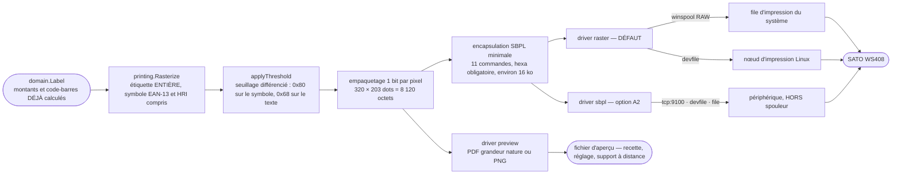

*`raster` et `sbpl` produisent **les mêmes octets** : ils ne diffèrent que par le dernier maillon, celui qui porte la trame jusqu'à la tête. La commande native `<BD>` n'est jamais émise, quel que soit le driver.*

Le service d'impression sérialise : **une étiquette à la fois**, jamais d'entrelacement. C'est ce qui manque à l'existant, où le garde-fou est un `If AllReports("EtataImprimer").IsLoaded Then Exit Sub` qui **abandonne silencieusement la pesée**.

```go
// retryDelays is a TABLE, not a formula: the 300*(n+1) formula produced 300 ms
// then 600 ms, while both the taxonomy of 8.5 and failure test 4 announce
// "300 ms then 1 s". The wait happens BEFORE a retry and never after the last
// failure — the previous loop still slept 900 ms before returning the error,
// for nothing.
var retryDelays = []time.Duration{300 * time.Millisecond, 1 * time.Second}

// Print sends one label to the printer and retries only transient failures.
// It serializes jobs: one label at a time, never interleaved.
//
// bloquant-1: the 8 s budget comes from the INJECTED CLOCK (ports.WithBudget,
// see 5.3), not from context.WithTimeout, which reads the real clock. Otherwise
// failure test 6 ("printer hanging for 60 s") would burn 8 seconds of wall
// clock — in direct contradiction with the "go test -race under 10 s" budget
// and with the rule "if a test needs a time.Sleep, the time dependency has not
// been extracted" (see 16.4).
func (s *Service) Print(ctx context.Context, label domain.Label) (PrintReceipt, error) {
    s.mu.Lock()
    defer s.mu.Unlock()

    ctx, cancel := ports.WithBudget(ctx, s.clock, 8*time.Second)
    defer cancel()

    var lastErr error
    for attempt := 0; ; attempt++ {
        receipt, err := s.driver.Print(ctx, PrintJob{Label: label, Template: s.template, Locale: s.locale})
        if err == nil {
            return receipt, nil
        }
        lastErr = err
        var printErr *PrintError
        if !errors.As(err, &printErr) || !printErr.Retryable() || attempt >= len(retryDelays) {
            break // permanent error, or third and last attempt: leave WITHOUT waiting
        }
        select {
        case <-s.clock.After(retryDelays[attempt]): // 300 ms, then 1 s
        case <-ctx.Done():
            return PrintReceipt{}, ctx.Err()
        }
    }
    return PrintReceipt{}, lastErr
}
```

### 8.3 L'encapsulation SBPL minimale

Le SBPL **n'a plus qu'à transporter un bitmap** (A2) — pour le driver `sbpl` comme pour le driver `raster`, qui émettent la même trame (§8.1). **Onze commandes** réparties sur dix lignes (`<V>` et `<H>` ne s'emploient jamais l'une sans l'autre et sont comptées comme deux), toutes vérifiées dans le manuel WS4 :

```
<A>                              début de travail — REMET TOUS LES PARAMÈTRES PAR DÉFAUT
<A1>aaaabbbb                     taille du média, en dots (hauteur, largeur)
<A3>V±ddddH±dddd                 décalage global (réglage bénévole, borné §7.5-6)
<#E>a                            noircissement 1..5
<CS>a                            vitesse 2..6 ips
<%>0                             rotation : parallèle 1
<V>aaaa<H>aaaa                   position du bloc graphique — 1..9999 en dots SBPL,
                                 où le dot n° 1 est le premier dot du média.
                                 Nos coordonnées de gabarit partent de 0 : la
                                 conversion +1 est faite dans graphic(), au
                                 seul endroit du code qui émet ces deux champs.
<G>Hbbbccc<hexa>                 graphique : bbb = largeur en OCTETS (≤104), ccc = hauteur (≤600)
<Q>aaaaaa                        nombre d'exemplaires
<Z>                              fin — déclenche l'impression
```

**Format `H` (hexadécimal) obligatoire, jamais `B` (binaire).** En binaire, un octet valant `1B`, `02`, `03`, `05`, `18` ou `00` serait interprété comme un code de contrôle du protocole. Le manuel prévoit de remapper ces codes par `<LD>`, mais c'est un réglage **persistant de l'imprimante**, donc un piège d'exploitation. L'hexa double le volume et supprime le problème.

**Volume réel** : étiquette 40 × 25,4 mm à 8 dots/mm ⇒ 320 × 203 dots ⇒ 40 octets × 203 lignes = 8 120 octets ⇒ **16 240 caractères hexa ≈ 16 ko** par étiquette. Sur USB/winspool ou TCP, moins de 50 ms. *(Un transport série à 9600 bauds prendrait 17 s : le transport série d'imprimante n'est donc pas proposé, et la configuration le refuse explicitement.)*

**`<A>` remet tous les paramètres par défaut** (manuel, note « Important » p. 10) : `<A1>`, `<A3>`, `<#E>`, `<CS>` sont donc **ré-émis à chaque travail**. Ne pas « optimiser » en les envoyant une fois au démarrage.

**Construction typée, jamais par concaténation de valeurs de configuration** (principe conservé d'important-8) :

```go
// Every command is a function that VALIDATES its bounds and returns an explicit
// PrintError{Kind: KindConfig} rather than emitting a malformed frame, whose
// only on-site symptom would be "the printer prints nothing".
// Messages stay in French: they are read by volunteers on the admin screen.
func (e *encoder) media(heightDots, widthDots int) error {
    if heightDots < 1 || heightDots > 9999 || widthDots < 1 || widthDots > 9999 {
        return &PrintError{Kind: KindConfig, Op: "sbpl.media",
            Message: fmt.Sprintf("média %d×%d dots hors bornes SBPL (1..9999)", widthDots, heightDots)}
    }
    fmt.Fprintf(e.w, "\x1bA1%04d%04d", heightDots, widthDots)
    return nil
}

// SETTLED — the manual constraint ("minimum position 1, never 0") and the (0;0)
// origin of the full-format block contradicted each other. The manual is right:
// its constraint is EXACT and kept; it is our coordinate system that is offset.
// SBPL numbers dots from 1, the template from 0 (see 7.2: product_name at
// (0;0), symbol block at (0;72)). We therefore do not move the template origin
// — that would distort a measured geometry to suit an encoder — we convert
// HERE, once, and validate the bounds like every other field.
func (e *encoder) graphic(xDots, yDots int, img *image.Gray) error {
    widthBytes := (img.Bounds().Dx() + 7) / 8
    height := img.Bounds().Dy()
    if xDots < 0 || xDots > 9998 || yDots < 0 || yDots > 9998 {
        return &PrintError{Kind: KindTemplate, Op: "sbpl.graphic",
            Message: fmt.Sprintf("position (%d;%d) hors bornes : 0..9998 en dots de gabarit "+
                "(1..9999 une fois convertie en dots SBPL)", xDots, yDots)}
    }
    if widthBytes > e.maxBytes { // 104 on the WS408
        return &PrintError{Kind: KindTemplate, Op: "sbpl.graphic",
            Message: fmt.Sprintf("%d octets de large, maximum %d pour ce modèle", widthBytes, e.maxBytes)}
    }
    if height > 600 {
        return &PrintError{Kind: KindTemplate, Op: "sbpl.graphic",
            Message: fmt.Sprintf("%d dots de haut, maximum 600 par bloc <G>", height)}
    }
    fmt.Fprintf(e.w, "\x1bV%04d\x1bH%04d", yDots+1, xDots+1) // 0-based -> 1-based
    fmt.Fprintf(e.w, "\x1bGH%03d%03d", widthBytes, height)
    return e.writeHex(img, widthBytes, height)
}
```

Golden **octet à octet** par commande et pour la trame complète, plus un test de bornes par champ — **`<V>`/`<H>` compris** : le cas nominal du bitmap plein format, `graphic(0, 0, img)`, doit produire `\x1bV0001\x1bH0001` et **jamais** `0000` ; `graphic(9998, 9998, …)` passe ; `graphic(9999, 0, …)` et `graphic(-1, 0, …)` sont refusés avec une `PrintError{Kind: KindTemplate}` explicite.

**Polarité des bits** : `invert_bits` reste en configuration, levée en 10 minutes par l'auto-test `alignment` (§8.6). C'est la seule inconnue SBPL qui subsiste, contre sept auparavant.

### 8.4 Les transports — local par défaut (A5)

> La décision 4 interdit toute dépendance réseau pour peser. Le montage réel est **une file Windows par poste** (`SATO WS408_1..4`), donc une imprimante rattachée au poste. **Le transport par défaut est donc LOCAL.**

| Transport | Plateforme | Défaut | Mise en œuvre |
|---|---|---|---|
| `winspool` | Windows | **oui** | Sept appels `syscall` vers `winspool.drv`, liés paresseusement : `OpenPrinterW` → `StartDocPrinterW` (`DOC_INFO_1.pDatatype = "RAW"`) → `StartPagePrinter` → `WritePrinter` → `EndPagePrinter` → `EndDocPrinter` → `ClosePrinter`. Le spouleur transmet les octets tels quels, **sans passer par le rendu GDI du pilote**. Aucun cgo, et **aucun module** : `github.com/alexbrainman/printer` était budgété et n'a pas été pris (§17.1, ADR-039). |
| `devfile` | Linux | **oui** | `os.OpenFile("/dev/usb/lp0", O_RDWR|O_SYNC, 0)`. Utilisateur dans le groupe `lp`, plus une règle udev qui fixe un nom stable `/dev/sato-weighing`. **Jamais `libusb`/`gousb`** : cgo obligatoire, cross-compilation cassée. |
| `tcp` | toutes | non | `net.DialTimeout` sur `:9100`, une connexion neuve par travail (plus robuste qu'une socket longue face à un redémarrage d'imprimante ; 16 ko par étiquette le permettent). **Réservé aux imprimantes réellement en réseau**, avec IP fixe posée sur le panneau et procédure écrite dans `INSTALLATION.md`. |
| `file` | toutes | non | écrit `2026-07-24T14-32-05_<jobid>.sbpl` et le PNG correspondant. Développement, tests, support à distance (« envoyez-moi le fichier de la dernière étiquette »). |

**Il n'existe pas d'USB brut exploitable sous Windows** : les périphériques de classe *Printer* sont liés à `usbprint.sys` et aucun chemin brut n'est publié ; les noms `\\.\USB001` créés par certains pilotes ne sont pas fiables. `winspool` en RAW **est** la voie correcte, et c'est déjà le montage en production.

**Imprimante de secours (bloquant-8).** Le bloc imprimante porte une **adresse de secours facultative** — typiquement la file ou l'IP de l'imprimante du poste voisin. Un bouton explicite de l'écran de dépannage, **« Imprimer sur l'imprimante du poste N »**, bascule le transport pour la session en cours et l'affiche en bandeau permanent. Configuration purement locale, aucun serveur central : la décision 4 est respectée. Quand une imprimante meurt, le poste continue de servir au lieu de fermer pour la journée pendant que trois imprimantes identiques fonctionnent à deux mètres.

**Recherche d'imprimante** : l'écran Matériel propose « Rechercher l'imprimante » (balayage du /24 local sur le port 9100, 2 s) et « Lister les files » (énumération winspool / CUPS) — au même titre que « Détecter automatiquement » pour la balance. Un bénévole ne sait pas ce qu'est une adresse IP ; il sait cliquer sur une ligne dans une liste.

**Chaque transport DÉCLARE la clé par laquelle il désigne son appareil**, et chaque destination énumérée déclare celle dans laquelle elle va. `DriverDescriptor.DeviceKey` porte la première (`queue` pour `winspool`, `path` pour `devfile` et `file`, `address` pour `tcp`) et voyage jusqu'à l'écran dans la charge du tableau de bord ; `platform.PrintQueue.Key` porte la seconde, parce que l'énumération est la seule couche qui le sache. L'écran en tire trois choses : le **transport se choisit dans une liste**, le **champ d'appareil en dessous prend la clé du transport choisi**, et une destination qu'un clic écrirait dans une clé que ce transport ne lit pas **n'est pas proposée** — l'écart est annoncé, en nommant le transport qui la lirait.

> **C'est ADR-025 appliqué une seconde fois au même écran**, et il a fallu le même défaut pour le voir. `transport` était un champ de texte libre au-dessus d'un unique champ câblé sur `printer.options.queue` quoi qu'on tape au-dessus. « Rechercher l'imprimante » rend des **hôtes** — `192.168.0.43:9100` —, et cliquer sur l'un d'eux écrivait cette adresse dans la clé de la file Windows. **Rien ne le refusait** : `queue` est une clé du driver, aucun contrôle de §11.3 ne lie une clé à un transport, et une clé qu'aucun transport ne lit est légitimement vide (§8.4). Le fichier s'enregistrait, le poste n'imprimait pas, et la seule phrase juste — « printer.options.address : aucune adresse d'imprimante n'est déclarée » — n'arrivait qu'à l'ouverture du transport. Un écran qui détient sa propre copie de « quelle clé va avec quel transport » détient une copie de ce que le registre sait, et les deux dérivent.

**Ce que le passage en RAW change et qu'il faut savoir** : en `<G>` brut, on court-circuite le rendu du pilote Windows du SATO. Les réglages **de l'imprimante** (calibration du capteur de gap, pas d'étiquette, longueur) restent en NVRAM et s'appliquent ; les réglages **du pilote** (format de papier déclaré dans Windows) ne s'appliquent plus — c'est `<A1>` qui les porte. Conséquence pratique : **l'imprimante doit être calibrée pour le rouleau installé** (auto-calibration depuis le panneau, 2 minutes), une fois. C'est l'inconnue n° 4 du §21, levée dès la réception du banc L0. Le repli documenté, si `<G>` déçoit sur site, est le chemin **GDI** (§19, V1.1), qui réutilise les réglages du pilote.

### 8.5 Statut, erreurs, réimpression, fin de rouleau

**Trois niveaux de statut, du certain à l'incertain :**

| Niveau | Méthode | Fiabilité |
|---|---|---|
| N1 — toujours | Écriture réussie sur le transport (`printer.Open`, `os.Stat` du nœud, connexion TCP). Donne : joignable / injoignable. | certaine |
| N2 — Windows | `printer.Open(queue).Jobs()` + statut de file : `OFFLINE`, `PAPER_OUT`, `ERROR`, `PAPER_JAM`, nombre de travaux en attente. **La source la plus riche des deux OS.** | certaine |
| N2 — Linux | `/sys/class/usbmisc/…` + code retour d'écriture ; à défaut, statut inconnu assumé. | partielle |
| N3 — SBPL natif | `ENQ` (`0x05`) sur le transport bidirectionnel, lecture 500 ms. **Toute réponse non vide = imprimante vivante.** Le décodage fin est **désactivé par défaut**, activable une fois la trame relevée. La trame brute est affichée en hexa dans l'admin — c'est ce qui permettra de compléter le décodage sans se déplacer. | à qualifier |

**On ne confirme jamais un événement physique avec une sonde qui ne l'observe pas** (important-7). `Print` rend la main quand les octets sont remis au transport ; une imprimante qui n'a pas commencé, ou qui a rejeté silencieusement la trame, répond « prête ». **Décision : la distinction « Étiquette imprimée » / « Étiquette envoyée » est supprimée.** Le message est toujours **« Étiquette envoyée à l'imprimante »**, honnête, et le recours est permanent (la barre de réimpression, plus bas dans cette même section). Coût nul, mensonge supprimé.

**On ne transforme jamais un succès en erreur** (important-9). Après un `Print` réussi, le statut post-impression **ne peut plus réaffecter `err`**. C'est le cas de la fin de rouleau : la dernière étiquette sort, **puis** l'imprimante signale `media-empty`. Le client repartait avec une étiquette valide et un écran rouge lui disant de prévenir un responsable ; il en collait deux, ou repesait — double comptage en caisse. Désormais : `result='sent'`, **feu orange de MAINTENANCE**, message « rouleau à changer », et la pesée reste un succès.

**Compteur de rouleau.** `meta.labels_since_roll` est incrémenté à chaque impression. La capacité du rouleau est configurable (`printer.roll_capacity`, défaut 1000). À 90 %, feu orange : *« environ 100 étiquettes restantes »*. L'écran de dépannage porte **« J'ai changé le rouleau »**, qui remet le compteur à zéro. La fin de rouleau est l'événement de maintenance le plus fréquent d'une étiqueteuse thermique et il est **entièrement prévisible** : il ne doit plus tomber en pleine file sans préavis.

**Réimpression, sortie de l'incrustation** (important-10). Le bouton « Je n'ai pas eu mon étiquette » vivait dans une incrustation de succès, dont la sortie est « quelques secondes **ou retrait du sac** » — c'est-à-dire immédiatement, puisque le client retire justement son sac pour chercher son étiquette : la fenêtre de 60 s n'existait pas. Désormais, une **zone permanente en barre basse** : *« Dernière étiquette : ail 1,236 kg — Réimprimer »*, active pendant `reprint_window_s` (60 s) et **indépendante de tout accusé de succès** — lequel n'occupe d'ailleurs plus l'écran (§14.3, ADR-023). Une seule réimpression, journalisée `result='reprint'`, avec la mention **`RÉIMPRESSION`** imprimée sur l'étiquette — ce qui neutralise le vecteur de fraude (un caissier la voit) sans laisser un client repartir sans étiquette.

**Taxonomie des erreurs — par action attendue, pas par cause technique :**

| Kind | Écran client | Écran admin | Politique |
|---|---|---|---|
| `KindData` | « Ce produit n'est pas disponible. Prévenez un responsable. » | référence, champ fautif, valeur | pas de réessai ; produit signalé |
| `KindTemplate` | « Impression indisponible. » | gabarit, élément, contrainte violée | pas de réessai ; refus au chargement |
| `KindTransient` | « Un instant… » puis « L'imprimante ne répond pas. » | file/adresse, erreur système | **2 réessais**, 300 ms puis 1 s |
| `KindConsumable` | *(rien : la pesée a réussi)* | motif exact, feu **orange** de maintenance | pas de réessai ; statut réinterrogé toutes les 10 s |
| `KindConfig` | « Impression indisponible. » | ce qui est configuré **vs** la liste de ce qui existe réellement | pas de réessai |
| `KindInternal` | « Une erreur est survenue (ERR-PRN-99). » | pile d'appel | pas de réessai |

### 8.6 Auto-tests, depuis l'écran de dépannage

| Auto-test | Ce qu'il imprime | Ce qu'il lève |
|---|---|---|
| `label` | une étiquette de démonstration complète (ail, 1,236 kg, double tarif) | réglage général, décalage X/Y, **superposition avec une étiquette actuelle sur une table lumineuse** |
| `alignment` | un carré plein de 64 × 64 dots + une croix de 1 dot dans chaque coin de la zone imprimable | polarité de `<G>` (`invert_bits`), calage du média, zone réellement imprimable |
| `ruler` | une réglette millimétrée sur deux bords + le cadre de la zone imprimable | vérification du pas réel (dots/mm) et du média déclaré |

**Qui les déclenche.** `label` est le bouton *« Imprimer une étiquette de test »* de la page Dépannage, **sans mot de passe** (§14.4, §14.5, ADR-018) : c'est le geste de recette d'un bénévole, superposition comprise. `alignment` et `ruler` sont des auto-tests de mise au point, sur la page **Matériel** du mode expert.

**Un driver DÉCLARE les auto-tests qu'il honore, dans son entrée de registre** (ADR-049). Le champ `Driver.SelfTests` porte la liste ; `Register` refuse un nom hors catalogue et un nom déclaré deux fois ; la déclaration voyage jusqu'à l'écran dans `DriverDescriptor.SelfTests`, et **la page Matériel ne dessine que les boutons honorés**. `raster` déclare les trois — il pilote une tête, et les deux derniers se lisent **sur du papier**, qui est exactement ce qu'il produit. `preview` n'en déclare **qu'un**, `label` : il écrit des fichiers et n'encre rien, donc ni la polarité de `<G>` ni le pas réel de la tête ne sont des faits qu'il puisse établir.

> **Une liste vide est une affirmation, pas un oubli** — « ce driver n'imprime aucun auto-test ». Ce qu'aucun driver n'a le droit de faire, c'est de **se taire** sur un motif qu'il ne produit pas : c'est le silence qui mettait les deux boutons fautifs sur l'écran. Auparavant `preview` répondait à `alignment` et à `ruler` une phrase française parfaitement écrite, pendant que la page Matériel continuait d'offrir les trois boutons — dont deux échouaient **au clic**, devant quelqu'un qui cherchait déjà pourquoi rien ne sort. C'est ADR-025 appliqué à un écran : un contrôle n'existe que là où un choix légitime existe, et un bouton dont la seule réponse possible est un refus n'est pas un choix.
>
> **Le refus subsiste, en seconde ligne.** `preview.SelfTest` répond toujours à `alignment` et à `ruler` la phrase qui dit pourquoi ils demandent du papier : la route `POST /admin/api/printer/test?what=…` s'appelle depuis l'extérieur de l'écran, tapée à la main ou rejouée depuis un script. Ce refus est désormais atteignable **par la route et par aucun bouton** — et le banc de conformité exige les deux moitiés : un auto-test déclaré **imprime**, un auto-test non déclaré est refusé par une phrase qui le **nomme avec sa raison**, jamais par « auto-test inconnu », formule qui enverrait chercher une faute de frappe que personne n'a faite.

L'auto-test `barcode-frame` et l'auto-test `character-table` **disparaissent** : sans commande `<BD>` ni mode texte natif, ils n'ont plus d'objet (A2). Le noyau garde leurs deux noms et la raison de leur suppression, pour qu'une configuration ou un script qui les nomme encore reçoive *« cet auto-test a été supprimé : … »* et non « auto-test inconnu ».

---

## 9. Balance

### 9.1 La boucle série, écrite une fois

```go
// internal/scale/serial/options.go — the package holds 95% of a serial driver's code.

// Options holds the link settings of a serial scale plus the single decoder
// that varies from one model to the next.
type Options struct {
    Port           string         // "COM8", "/dev/balance-serial"
    Baud           int            // 9600
    Bits           int            // 8
    Parity         string         // "N"
    Stop           int            // 1
    Decoder        domain.Decoder // THE only per-model variation point
    ReadBufferSize int            // 4096 — not 16 as in SetupComm(h,16,16)
    BackoffMin, BackoffMax time.Duration // 200 ms → 5 s
}

// Loop opens the port, reads, decodes, emits and reconnects until ctx is done.
// CONTRACT (bloquant-2): `out` belongs to the Hub. Loop NEVER closes it. On
// exit it emits one last ScaleEvent{StatusDisconnected} then closes `done`, a
// dedicated throwaway channel recreated at every instantiation.
//
// ★ défaut 40 — what TRIGGERS scale loss on the Hub side is the `Status` field
// ALONE, never `Err` (§13.2). Loop's contract is tightened anyway, so that the
// cause always remains loggable: the `Err` field of that last event is NEVER
// nil — it is the device error when there is one, `ctx.Err()` on cancellation,
// and ErrLoopStopped otherwise. Neither half depends on the other: even a
// third-party driver implementation leaving `Err` nil would still have its
// scale loss reach the state machine.
func Loop(ctx context.Context, o Options, out chan<- domain.ScaleEvent,
    done chan<- struct{}, log ports.TechnicalLog)
```

| Défaut de l'existant | Correction |
|---|---|
| `SetupComm(h, 16, 16)` : buffer de 16 octets pour des trames de 18 | buffer 4 ko |
| Lecture de **18 octets fixes** sans accumulation → trames coupées à chaque cycle | lecture de ce qui est disponible + `Accumulator`. Les trames « dégradées » du corpus (`.996kg`, `<esp>0.996kg`) en sont un **artefact**, pas une propriété de la balance |
| `"COM10"` inaccessible (pas de préfixe `\\.\`) | `go.bug.st/serial` gère la nomenclature |
| Polling par `Form_Timer` à 400 ms | lecture bloquante avec timeout |
| Reconnexion après **1000** erreurs consécutives (~7 min d'écran figé) | backoff exponentiel dès la 1ʳᵉ erreur, statut remonté immédiatement |
| `return gPoidsBalanceConnectee` — dernière valeur connue, sans âge | péremption **dérivée de la cadence observée** (A3, §6.5) |

**Compléter une liaison est un geste explicite.** `serial.Options.Complete()` pose les défauts du parc — 9600 8N1, tampon de lecture de 4 096 octets, backoff de 200 ms à 5 s — et refuse **en français** une liaison qu'aucun port ne pourrait accepter, en nommant la clé de `scale.options` à corriger. Elle est **exportée** parce que la promesse « le zéro d'`Options` est utilisable dès que `Port`, `Decoder` et `Clock` sont posés » n'était tenue que par `New`, `Loop` et `ParseOptions` : tout autre appelant obtenait une liaison sans parité, refusée avant même que le périphérique soit touché — c'est ce qui rendait la détection automatique de l'écran Matériel (§14.4) incapable d'aboutir, sur n'importe quel port de n'importe quelle machine. La complétion n'est délibérément **pas** cachée dans `OpenSystemPort` : celui qui lie un port doit voir, à son propre point d'appel, que la liaison a été complétée, et doit pouvoir distinguer un refus de **ses réglages** d'un refus du **système** — les deux n'appellent pas le même geste de la part du bénévole.

### 9.2 La grammaire des trames

```
frame      := prefix? sign? blanks* number blanks* unit terminator?
prefix     := status "," [ mode "," ]
status     := "ST" | "US" | "OL" | "S" | "U"     (case-insensitive)
mode       := "GS" | "NT" | "G" | "N"
sign       := "+" | "-"
number     := digit{1,6} [ ("." | ",") digit{1,4} ]
unit       := "KG" | "G"                          (case-insensitive)
terminator := CR | LF | CRLF | (none)
```

```go
// Parse decodes one complete frame into a measurement. It is pure and stateless.
func Parse(frame []byte, now time.Time) (domain.Measurement, error)

// Feed appends p to the pending tail and returns every measurement the buffer
// now yields. It silently drops the noise that precedes a valid frame; past
// MaxBuffer (512 B) without a valid frame it resynchronises by keeping only the
// last 64 bytes → no memory leak, and no permanent lock-up on a noisy line.
func (a *Accumulator) Feed(p []byte, now time.Time) []domain.Measurement

// NO strconv.ParseFloat — and the counter-example of §6.1, recomputed.
// It is NOT "0.996": float64("0.996") is indeed 0.99599999999999999645…, but
// ×1000 rounds to the nearest double, exactly 996.0, and truncation yields 996.
// The real, verified case is "1.001": float64("1.001")*1000 = 1000.9999999999999,
// and int() yields 1000 g instead of 1001. Over the 99,999 three-decimal weights
// from 0.001 to 99.999 kg, 741 break — 0.74%, one weighing in 135. Invisible to a
// naive test, silent in production, and it costs 1 g AND 1 cent.
// (Frozen by TestFloatBreaksOn741Weights.)
func toGrams(intPart, fracPart string, u Unit) (domain.Grams, error) {
    n, err := strconv.ParseInt(intPart, 10, 64)
    if err != nil {
        return 0, ErrUnrecognizedFrame
    }
    switch u {
    case UnitKg:
        f := (fracPart + "000")[:3] // pad on the RIGHT, truncate beyond
        m, _ := strconv.ParseInt(f, 10, 64)
        return domain.Grams(n*1000 + m), nil
    case UnitGram:
        return domain.Grams(n), nil
    }
    return 0, ErrUnrecognizedFrame
}
```

**30 cas de table + fuzz.** Les cas structurants : `.996kg` → **`ErrUnrecognizedFrame`** (l'existant retournait 0,996 kg par `Left(chaine,5)` alors que la vraie valeur pouvait être 1,996 ou 10,996 — **on ne devine pas**) ; `"ST,GS,+  1.2"` puis `"36KG\r\n"` → **une** mesure de 1236 g ; `"ST,GS,+  1.2KG"` → **1200 g** (padding à droite, pas à gauche) ; `strings.Repeat("x", 600)` → 0 mesure, buffer resynchronisé ≤ 64 o.

**Test de non-régression du découpage à 18 octets** : rejouer un flux nominal découpé en tranches de 18 octets — exactement le comportement de `CommRead(NumPort, strData, 18, …)` — et exiger **100 trames sur 100**, là où l'implémentation historique en perdait ou en tronquait une sur deux.

### 9.3 Les deux entrées de registre — et les deux qui n'en sont pas

| ID | Libellé admin | Implémentation |
|---|---|---|
| `gram-xfoc-rs` | GRAM XFOC RS | même décodeur, valeurs par défaut du modèle |
| `gram-xfoc-plus` | GRAM XFOC + | même décodeur, valeurs par défaut du modèle |

> **`scale.type` ne nomme que des protocoles matériels réels.** La version précédente mêlait dans une même liste déroulante — présentée à un bénévole et validée par le même contrôle — deux protocoles, **un mode dégradé** (`manual`) et **un outil de test** (`replay`). C'était `Systeme.BalanceConnectee = O/N` transposé : l'ancienne application demandait à l'exploitant de **déclarer** si une balance était branchée parce qu'elle ne savait pas le découvrir. Celle-ci sait (§14.4 : « Détecter automatiquement » ouvre chaque port 3 s, applique le parseur et annonce « COM8 : 12 trames valides, GRAM XFOC »), et elle bascule seule quand le matériel ne répond plus (§11.4). Le même état était donc atteignable par **trois portes** — une valeur de configuration, un repli automatique, un bouton de dépannage —, ce qui rendait indécidable la seule question qui compte un matin de panne : *pourquoi ce poste est-il en saisie manuelle ?* Les trois questions sont désormais séparées :
>
> - **Quel protocole ?** → `scale.type`, contrat matériel, inchangé.
> - **Y a-t-il une balance ?** → **détecté**. L'assistant de premier démarrage propose ce qu'il a trouvé ; un poste délibérément sans balance porte une **déclaration explicite et unique**, `scale.present: false`, qui éteint le feu au lieu de le laisser rouge en permanence.
> - **Sait-on peser à la main ?** → `manual_entry_allowed`, seul interrupteur d'exploitation.
>
> **`replay` quitte `config.json` et la liste déroulante** pour rejoindre la surface de diagnostic qui existe déjà : `openscale capture` / `openscale replay` en ligne de commande (§15.1), le bouton « Rejouer cette trame » du journal (§15.4) et les tests (`--scale replay`, §16.1). Personne, depuis une page blanche, ne met un lecteur de fichier de trames dans l'énumération du matériel de pesée.

**Ce qu'une entrée de registre porte, et pourquoi le décodeur en fait partie** (ADR-046, ADR-047). Une entrée porte quatre choses : son **descripteur** (l'ID, qui est la valeur de `scale.type`, et le libellé lu sur l'autocollant du matériel), le **schéma de ses options**, une **fabrique de décodeur** (`NewDecoder`) et la déclaration du **point d'accès** sur lequel ce protocole sait se faire reconnaître (`Endpoint`). Les deux dernières sont ce qui a changé.

- `NewDecoder` est **obligatoire**, et c'est une fabrique et non une valeur : un décodeur retient les octets qui attendent la fin de leur trame, et deux appelants qui partageraient un tampon se compléteraient mutuellement leurs demi-trames — une masse que personne n'a pesée, sur une étiquette collée sur un sac. Quatre outils décodent des octets **sans faire tourner un poste** : la détection, `openscale capture`, `openscale replay` et le bouton « Rejouer cette trame ». Tous les quatre construisaient jusqu'ici l'accumulateur de la GRAM dans la racine de composition, c'est-à-dire parlaient la grammaire de la GRAM quoi que dise `scale.type`. Aucun n'**échouait** sur un autre protocole : ils rendaient zéro trame, en silence — la réponse exacte que donne un câble débranché.
- `Endpoint` sépare deux questions que §14.4 ne pose pas au même interlocuteur. **Énumérer** les points d'accès d'une machine — quels ports série, quelles adresses répondent — est une question posée au **système d'exploitation**, et elle reste à la racine de composition, là où vit `platform`. **Reconnaître** ce qui répond est une question sur le **protocole**, et seul le driver sait à quoi ressemble une de ses trames. `EndpointNone` est la valeur par défaut et une **déclaration légitime** : une balance qui ne parle que si on l'interroge n'est pas reconnaissable à l'écoute, l'écran le dit et invite à la choisir à la main. Un bouton de détection dont la seule issue possible serait le silence enverrait chercher un câble.

**Deux entrées, un décodeur.** L'existant a deux fonctions (`ReformatePoidsBalanceXFOCRS` / `…XFOCPLUS`) qui diffèrent par la casse du suffixe, une fenêtre d'extraction de 8 vs 7 caractères et le comportement sur trame courte. **Ce ne sont pas des différences de protocole** : ce sont deux copies divergentes d'un même code à fenêtres fixes. Un parseur insensible à la casse fondé sur une grammaire les couvre tous les deux. Mais la contrainte 3 demande deux drivers, et un bénévole qui remplace une balance doit retrouver dans le menu le nom qu'il lit sur l'étiquette du matériel : **deux entrées de registre, une implémentation.**

**La saisie manuelle est un ÉTAT, et il est RÉVERSIBLE** (bloquant-2). On y entre par trois chemins, **aucun n'est une valeur qu'on tape dans un fichier** : `scale.present = false` (poste sans balance, la saisie est alors nominale) ; matériel absent ou en panne avec `manual_entry_allowed` — état `ScaleLost`/`OutOfService`, le front propose « Saisir le poids à la main » ; bouton de dépannage « Basculer en saisie manuelle ». Dans les trois cas, **un bandeau permanent affiche la cause et l'horodate d'entrée** dans l'état. Le retour série → manuel → série est un test obligatoire (§16).

**Ajouter un modèle de balance** : 1 paquet, et une ligne dans `drivers.go`. Capturer (`openscale capture --port COM3 --duration 60s`), écrire un `Decoder`, verser la capture sous `internal/scale/testdata/frames/<scale.type>/`, brancher la **suite de conformité partagée** (`conformance.Suite`), enregistrer. L'admin découvre le driver par le registre et génère son formulaire depuis le schéma déclaré. **Aucune UI à modifier.**

> **Ce que cela coûte, mesuré et non estimé.** `internal/scale/gramxfoc` — deux entrées de registre, un décodeur — fait **4 fichiers et 693 lignes, dont 536 de tests** : `gramxfoc.go` 157, `gramxfoc_test.go` 365, `conformance_test.go` 94, `corpus_test.go` 77. *(La version précédente de cette ligne annonçait « 3 fichiers, ~120 lignes dont 70 de tests », un chiffre écrit avant que le banc et le corpus par protocole n'existent.)*
>
> **Le branchement au banc coûte d'une dizaine de lignes à une centaine, et l'écart se lit.** Un driver qui n'ouvre rien s'y branche par un appel : `absent/conformance_test.go` fait **34 lignes**, dont une dizaine de code — il n'a ni port à simuler ni octets à livrer. Un driver adossé à une source d'octets doit fournir au banc de quoi lui écrire dessus, et c'est là que passent les lignes : **94** pour `gramxfoc` (un port simulé, une table qui relie chaque driver au sien, parce que le banc construit un driver neuf par contrôle), **112** pour `replay`, **129** pour `serial`. Ce n'est pas de la cérémonie : c'est exactement le point d'injection que §9.1 laisse — `Options.Open` — et c'est ce qui rend la conformité vérifiable **sans matériel**.

---

## 10. Catalogue

### 10.1 Les deux sources

**`local_drop`.** Un répertoire **que le service crée lui-même quand personne n'en désigne un autre** (`<data>/catalog/incoming/`) : ni identifiant, ni mot de passe. Depuis ADR-038, `catalog.options.directory` permet d'en nommer un — un point de montage, un partage UNC —, et **le poste ne le crée alors jamais** : un chemin mal saisi fabriquerait une arborescence que personne ne surveille, et le poste attendrait son fichier dans un endroit que personne ne connaît. Ce qui reste vrai de cette source, et qui **est** sa définition, c'est qu'elle **ne porte aucun secret** ; le seul canal authentifié est `webdav`, ci-dessous, et c'est le vrai. N'importe quoi peut y déposer un fichier — un outil de synchronisation, l'export d'un producteur, ou le **glisser-déposer de l'écran d'administration**, qui emprunte ce même chemin au lieu d'être une troisième source. *(Un répertoire « local » qui réclamerait un compte et un mot de passe ne serait pas un répertoire local : ce serait le lecteur `Z:` de l'existant sous un autre nom, et le contrôle 39 continue de refuser `username` et `password` sur cette source. Une lettre de lecteur, elle, n'est plus écartée par une règle de forme mais par la mesure : le contrôle 46 sonde le chemin **depuis le compte du service**, qui ne voit pas les montages d'une session utilisateur, et la faute sort au moment de la saisie plutôt qu'au premier import manqué.)* Scrutation toutes les `poll_interval_s` (5 s) :

1. `os.Stat(<dir>/flv_<n>.csv)` — absent → rien à faire. **Le nom est dérivé de `station.number`** et de rien d'autre (§11.2).
2. **Contrôle de stabilité** : taille **et** mtime identiques sur **deux scrutations consécutives** (≥ 5 s d'immobilité). Sur un partage distant avec un producteur qui écrit, c'est le seul garde-fou contre la lecture d'un fichier partiel ; la transaction ne protège pas de ça, elle rend juste l'application atomique.
3. **Lecture en flux** (bloquant-9) : `bufio` + `encoding/csv` en streaming, jamais de chargement complet en mémoire ; le pic mémoire est **une ligne**, pas deux fois le fichier.

   > **Le plafond `max_file_size_mb` descend de 32 à 8, et la lecture en flux garde toute sa justification.** Le fichier authentique `flv.csv` (§10.2) pèse **527 233 octets pour 355 produits**, dont **500 368 octets de base64 d'images** — l'image *est* le fichier, le reste tient en 27 ko. Les « ~16 Mo de base64 » qui dimensionnaient ce document restaient faux d'un facteur trente, mais le volume d'images, lui, **existe**. 8 Mo laissent passer un catalogue **quinze fois** plus gros que celui qu'on reçoit — assez pour que les 355 produits portent tous une photo *et* que le catalogue double — et refusent un fichier qui n'est manifestement plus un catalogue : c'est une garde de dernier ressort, explicable en une phrase. La lecture en flux **reste indispensable** : le pic mémoire est **une ligne**, la plus grosse observée portant 15 352 octets de base64, et c'est elle qui permet de garder ce plafond bas sans risque. *(La seconde fixture `flv_1.csv` pèse 10 413 octets pour 153 produits, champ image vide sur 153 lignes sur 153 : un catalogue sans photos tient dans un centième du plafond. L'écart entre les deux fichiers — un facteur cinquante — est exactement la raison pour laquelle le plafond ne peut pas être serré au plus près de la mesure du jour.)*
4. `sha256` calculé **au fil de la lecture** → `Batch.ID`.
5. **Qualification** de chaque ligne (§10.3), construction du lot. **Ne touche pas au fichier.**
6. Le Hub applique (une transaction, §12.3).
7. `Acknowledge(Applied)` : **copie** vers `archives/flv_<n>-2026-07-24T15-38-12.csv`, `fsync`, **puis `os.Remove` sur la source**. L'acquittement **est** le `Remove`.

> **Pourquoi une copie puis un `Remove`, et jamais un `os.Rename`** : entre un partage réseau et le disque local, `Rename` échoue en `ERROR_NOT_SAME_DEVICE` / `EXDEV`, ce qui laisserait le fichier en place et reboucterait l'import indéfiniment.

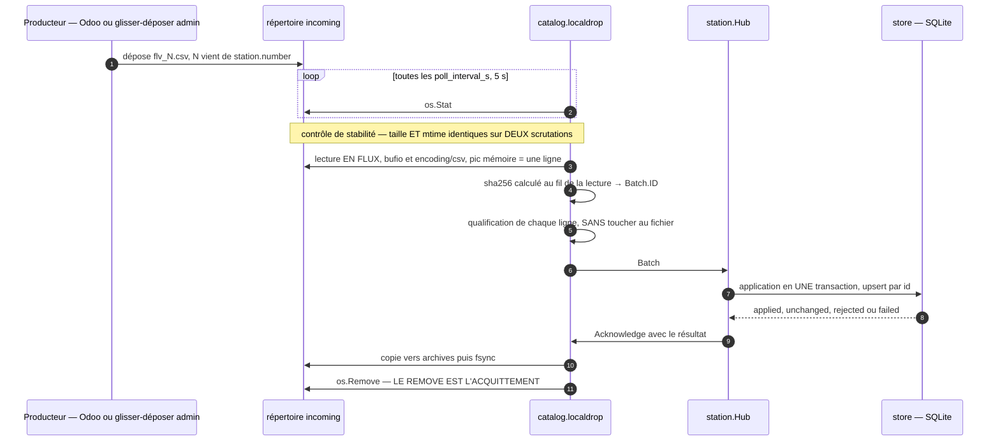

**`webdav`.** Même séquence en `net/http` + `encoding/xml` : `PROPFIND Depth: 1` (liste + `getcontentlength` + `getlastmodified`, contrôle de stabilité identique), `GET` avec `Accept-Encoding: identity`, **`DELETE` = acquittement**. Timeouts explicites (10 s connexion, 120 s corps), 3 réessais, aucune redirection hors du même hôte.

> **Pourquoi ce driver est maintenu en V1 alors qu'important-14 propose de le couper.** Le partage de production est un hôte **WebDAV en HTTPS sur un port non standard** (`https://dav.example.org:8001/`), monté en lettre `Z:`. Or une lettre de lecteur est un mapping **par session utilisateur, invisible d'un service Windows**, et un chemin UNC ne permet pas d'atteindre un hôte HTTPS sur un port non standard. **Sans ce driver, la chaîne d'alimentation réelle de La Cagette ne fonctionne pas** — c'est la différence entre livrer et ne pas livrer. Coût : ~200 lignes de `net/http` + `encoding/xml`. La compensation budgétaire est prise ailleurs (§18 : GDI/CUPS hors V1, 3 gabarits sur 5, thème sombre).

**Le glisser-déposer de l'administration — arbitrage A4 — n'est pas une source.** L'écran d'administration écrit le fichier reçu **dans `local_drop`**, et la scrutation fait le reste : même parseur, même qualification, même transaction, même acquittement. Le lot porte `source='manual'` comme **observation** de sa provenance, pas comme branche de code.

> **Pourquoi c'est au périmètre V1.** En base de production `Recup_Odoo_activee = N`, le dernier chargement Odoo réussi date de **12/2022**, la dernière tentative (22/08/2025) est **en échec**. Le format, lui, n'est plus une hypothèse : **deux** exemplaires authentiques ont été fournis, et le plus récent est daté **du 24/07/2026** (§10.2) — le job d'export **produit donc encore un fichier**. Ce qui reste inconnu est plus étroit, et pas moins gênant : **rien ne garantit qu'il soit déposé automatiquement là où les postes le lisent** (§21 n° 9, ADR-011), et il n'y a **aucune migration** (contrainte 6). Sans dépôt manuel, un poste neuf peut démarrer avec une grille vide **et aucun moyen de la remplir**. Le parseur existe déjà : c'est un handler HTTP qui écrit un fichier. **C'est le seul repli le jour de la mise en service.**

**Validation (important-11)** : la configuration **refuse** un hôte HTTP(S) placé derrière un chemin de dépôt, avec le message qui renvoie explicitement sur la source `webdav`. `local_drop` **n'a ni utilisateur ni mot de passe** : il n'y a aucun secret à porter pour lire un répertoire, qu'on le possède ou qu'on le partage — et c'est le contrôle 39 qui le tient. Symétriquement, le contrôle 47 refuse `directory` sur `webdav` : une clé qui n'a pas de sens pour la source déclarée est une faute, pas une valeur ignorée en silence. Le tableau de bord affiche **en permanence** la source active, le chemin ou l'URL surveillé, le compte utilisé quand il y en a un (`webdav`), et l'horodate du dernier essai.

### 10.2 Lecture du CSV — le format n'est plus reconstitué, il est observé

**Deux exemplaires authentiques du fichier d'échange existent désormais au dossier.** La pièce principale est `docs/annexes/flv.csv` — **527 233 octets, 24/07/2026, 355 produits, images comprises** : tout ce qui suit est mesuré sur elle, pas déduit. La seconde fixture est `docs/annexes/flv_1.csv` — 10 413 octets, 05/01/2022, poste 1, 153 produits —, gardée parce qu'elle porte ce que `flv.csv` n'a pas : **aucune image**, 9 produits **sans code-barres** et 7 **clés de contrôle fausses**. Les deux sont repris **tels quels** comme fixtures du dépôt (`internal/catalog/csvodoo/testdata/`). Quand les deux mesures diffèrent, ce document cite les deux, **`flv.csv` d'abord**.

**Ce qu'ils confirment (la forme), à quatre ans et demi d'écart.** UTF-8 **sans BOM**, fins de ligne **CRLF**, séparateur `;`, **toutes** les valeurs entre guillemets doubles, en-tête exactement `"id";"nom";"code-barre";"prix";"categorie";"unite";"image"`. Le format n'a pas bougé d'un octet — c'est le seul point de ce document qui soit confirmé par deux mesures indépendantes. Sur `flv.csv` : aucun doublon d'`id` (355 distincts), aucun doublon de code-barres (355 distincts) ; les `id` vont de **20 à 5209 et ne sont pas contigus** — c'est la clé d'un producteur, **jamais un indice de tableau ni un compteur de lignes**. Catégories : **A = 140, V = 118, L = 68, F = 29** — contre L = 84, V = 58, F = 10, A = 1 dans `flv_1.csv` : la répartition est **instable d'un export à l'autre**, aucun dimensionnement d'écran ne doit en dépendre. Noms de **8 à 69 caractères**, moyenne 27 ; aucun ne contient de guillemet ni de point-virgule ; **10 contiennent une apostrophe**.

> **Le nom le plus long est un cas de test, pas une curiosité :** `♥AA-LA TOMME DES CROQUANTS AFFINE A LA LIQUEUR DE NOIX DU PERIGORD-MV`, **69 caractères**. Il déborde très largement d'une étiquette de 35 mm de large : le mécanisme de **réduction automatique du corps** (§7.3) ne sera pas un chemin d'exception exercé une fois par an, il tournera en production tous les jours. Cette chaîne exacte entre au corpus golden du moteur de rendu et à celui de la tuile (§16.1), avec le résultat attendu figé. *(Le plus long de `flv_1.csv` — `RAPADURA SUCRE DE CANNE COMPLET - COSTA RICA 10KG`, 49 caractères — restait dans l'épure ; il n'était pas représentatif.)*

**Ce que `flv.csv` corrige dans ce document (le contenu).** Trois faits changent, et le troisième invalide une règle métier :

- **Les images sont là.** Le champ `image` est rempli sur **181 lignes sur 355** — 500 368 octets de base64, 375 074 octets de binaire — et **vide sur 174**. La chaîne de décodage n'est plus une éventualité (§10.7), et **49 % du catalogue reste sans photo** : une tuile sans image n'est pas un cas dégradé marginal, c'est presque un produit sur deux (§14.2, §14.3). *(Sur `flv_1.csv`, le champ est vide sur 153 lignes sur 153 : le remplissage a été activé entre 2022 et 2026, ou dépend de l'export. Les deux cas sont donc réels et tous deux doivent fonctionner.)*
- **Le prix ne réserve aucune surprise.** Toujours le **point décimal**, 1 ou 2 décimales (`16.05`, `4.3` — **330 lignes à deux décimales, 25 à une**), **jamais de virgule, jamais de valeur vide, jamais de zéro** — sur les 355 lignes comme sur les 153. La tolérance à la virgule du parseur reste une politesse, pas un besoin observé.
- **La colonne `unite` prend une troisième valeur** : `kg` (**328**), `Unité(s)` (**18**) et **`Litre(s)` (9)**. Elle ne vaut jamais « unite », « U » ni « pièce ». Cette troisième valeur fait tomber la règle de mode de vente de l'ancienne application — voir juste en dessous.

**La règle de mode de vente de l'ancienne application est fausse, et `flv.csv` le démontre.** L'existant décide du mode par la colonne `unite` : `kg` ⇒ au poids, **tout le reste** ⇒ à l'unité. Or parmi les 9 produits déclarés `Litre(s)`, deux portent un code interne **au poids** — `0493469000009 « SHAMPOING CHEVEUX NORMAUX »` et `0493590000008 « SAVON LIQUIDE LAVANDE 20KG »`. C'est du **vrac liquide qu'on pèse** : on pose le flacon sur la balance. L'ancienne application les vend à l'unité, en contradiction avec leur propre code-barres — donc avec ce que la caisse décodera.

**Le préfixe du code-barres fait foi pour le mode de vente ; la colonne `unite` ne pilote que le libellé.** C'est la seule répartition défendable, et elle tient en une phrase : *le code-barres est la seule des deux informations que la caisse lit*. Le mode de vente est un **contrat avec la caisse** ; le libellé est un **affichage**. Les mélanger, c'est laisser une colonne de texte libre décider de ce qui sera facturé.

| `unite` | Nature de la grandeur | Libellé du prix | Mode de vente |
|---|---|---|---|
| `kg` (328) | continue | ` €/kg` | **donné par le préfixe** |
| `Litre(s)` (9) | continue | ` € le litre` | **donné par le préfixe** |
| `Unité(s)` (18) | discrète | ` € l'unité` | **donné par le préfixe** |

- Une valeur **inconnue** retombe sur le libellé par défaut du préfixe (` €/kg` au poids, ` € l'unité` à l'unité) et lève `UNKNOWN_UNIT`, non bloquant : un libellé de repli vaut mieux qu'un produit absent.
- Une **contradiction de nature** — grandeur discrète sur un code au poids, grandeur continue sur un code à l'unité — laisse le produit pesable, applique le préfixe, et lève `UNIT_MISMATCH` (§10.3). C'est une **erreur de configuration Odoo**, nommée pour être corrigée à la source.
- `Litre(s)` sur un code au poids **n'est pas une contradiction** : c'est une grandeur continue comme le kg. On pèse, et seul le suffixe affiché change. *(Le champ encodé reste la masse pesée en grammes : « le litre » est un libellé, il ne convertit rien. Un litre d'eau pèse un kilogramme, et l'écart reste faible sur les produits concernés — savon, lessive, vinaigre. C'est aussi tout ce que la caisse sait faire : elle ne reçoit qu'une masse.)*

Mesuré sur `flv.csv` : `0493`+`kg` **328**, `0499`+`Unité(s)` **15**, `0493`+`Litre(s)` **2** (vrac liquide légitime), `0493`+`Unité(s)` **2** (dont un seul survit à la qualification, §10.3), préfixes hors plan + `Litre(s)`/`Unité(s)` **8**.

`encoding/csv` avec `Comma = ';'`, `LazyQuotes = false`, `FieldsPerRecord = 7`. **Le parseur retire les guillemets** — fin de la concaténation SQL brute et de l'injection généralisée de l'existant. BOM UTF-8 retiré **s'il est présent** (il ne l'est pas dans le fichier réel, mais un tableur en réintroduit un sans prévenir). **CRLF et LF acceptés** (l'existant cassait sur LF seul). La première ligne est **comparée octet à octet** à l'en-tête ci-dessus ; divergence → signalement non bloquant `UNEXPECTED_HEADER` (l'existant construisait `EnteteCSV` et ne la comparait jamais).

| # | Colonne | Destination | Transformation |
|---|---|---|---|
| 0 | `id` | `Product.ID` | brut, trim — **clé du producteur, stable d'un import à l'autre** (§10.9) |
| 1 | `nom` | `Name` | brut, trim. **Une seule source de vérité** : la forme désaccentuée est calculée **au moment de servir le catalogue JSON** (§14.5), jamais stockée |
| 2 | `code-barre` | `Reference` **et mode de vente** | `domain.ParseEAN13` (13 chiffres + clé), **peut être vide** — 0 ligne sur 355 dans `flv.csv`, **9 sur 153** dans `flv_1.csv`. **C'est cette colonne, et elle seule, qui détermine si le produit se vend au poids ou à l'unité** (ci-dessus) |
| 3 | `prix` | `UnitPrice Cents` | **parsing entier**, jamais `ParseFloat` : `"16.05"`→1605, `"4.3"`→430, `"3"`→300. La virgule est acceptée par tolérance (`"5,32"`→532) mais **le fichier réel n'en contient aucune** *(l'existant produisait `"3",00` hors guillemets, injectant une colonne et perdant le produit silencieusement)* |
| 4 | `categorie` | `CategoryCode` | `F`/`L`/`V`/`A` → constante de l'adaptateur Odoo (§10.2 bis) |
| 5 | `unite` | **`PriceSuffix` seulement** | `"kg"` → ` €/kg` ; **`"Litre(s)"`** → ` € le litre` ; **`"Unité(s)"`** → ` € l'unité` ; inconnue → libellé par défaut du préfixe + `UNKNOWN_UNIT`. **Ne détermine jamais le mode de vente.** Les trois valeurs littérales, accents et parenthèses compris, figurent telles quelles dans les tests et dans les messages |
| 6 | `image` | `ImageSHA` | **base64, rempli sur 181 lignes sur 355** (vide sur 153/153 dans `flv_1.csv`). Décodé **en flux**, format reconnu **aux octets d'en-tête** et jamais à l'extension, adressé par son sha (§10.7) |

**Il n'y a plus de champ `Bio`.** L'existant le déduisait du nom par recherche de sous-chaîne (« BIO » ⇒ vrai, sauf « PAS BIO », « NON BIO »…) pour colorer un libellé en vert et trier des produits apparentés — deux fonctions que cette application n'a pas. Les deux fichiers authentiques montrent surtout que **cette règle n'a pas de valeur stable** : elle vaut faux sur les 153 lignes de `flv_1.csv` et vrai sur **83 des 355** lignes de `flv.csv` — 23 % — dont `Figue baglama calibre n°3  BIO`. Un critère métier qui passe de 0 % à 23 % entre deux exports du même magasin n'est pas un critère, c'est un artefact de saisie. Une mention « bio » à l'écran, si elle est voulue, viendra d'une **donnée** d'Odoo — colonne à demander au producteur, ou libellé de catégorie —, jamais d'une sous-chaîne d'un libellé commercial qui change sans préavis. **Question ouverte au commanditaire : voulez-vous distinguer le bio à l'écran ?**

**Un mot sur les caractères.** Le jeu réellement rencontré dans les noms de `flv.csv`, mesuré et non supposé, est : `°` `É` `Ê` `Ô` `à` `â` `é` `ï` **`Œ`** **`œ`** et **U+2665 `♥`**. Deux d'entre eux sortent du Latin-1 courant et méritent d'être nommés : la **ligature `Œ`/`œ`** (« Œuf chocolat lait cœur lacté 2 kg », 3 noms) et le **cœur U+2665**, présent dans **127 noms sur 355**, en tête de 85 d'entre eux (« ♥ LENTILLES VERTES 10Kg », « ♥♥ » en fin de nom). Ce n'est pas un détail décoratif : c'est plus d'un nom sur trois, à l'écran **et sur l'étiquette**. Conséquences tranchées ici : (a) **la couverture de U+2665 par Carlito n'est pas supposée, elle est vérifiée** — un test de CI interroge la table `cmap` de chaque fonte embarquée et échoue si un caractère du corpus de référence n'a de glyphe nulle part ; (b) le moteur applique un **repli de caractère explicite et ordonné** — Carlito, puis **DejaVu Sans**, déjà embarquée et qui possède le glyphe (ADR-020) —, et si aucune fonte embarquée ne l'a, il dessine le **caractère de remplacement `U+FFFD`, visible**, et journalise `MISSING_GLYPH` avec le point de code et le nom du produit ; **jamais un carré vide silencieux, jamais une chaîne tronquée en silence** ; (c) ces chaînes réelles entrent au corpus de rendu de référence (§16.1).

#### 10.2 bis Les catégories

**Les libellés ne viennent pas du CSV** : le CSV porte une **lettre**, la configuration porte le **libellé, l'ordre, la couleur** et le fait de montrer ou non la catégorie sur ce poste. La correspondance `F`→fruits, `L`→légumes, `V`→vrac, `A`→autres est en revanche une **constante de l'adaptateur Odoo**, au même titre que le séparateur, l'ordre des sept colonnes et les valeurs `kg` / `Litre(s)` / `Unité(s)` : aucun exploitant n'a de choix légitime à faire sur « L signifie-t-il légumes ou fruits ? », et la rendre modifiable créerait un réglage dont la seule valeur correcte est celle qui est déjà écrite. Une lettre hors `F`/`L`/`V`/`A` est **un défaut du fichier** : signalement `UNKNOWN_CATEGORY` **avec son numéro de ligne**, produit rangé dans `fallback_category` et **affiché quand même**. **Il n'existe donc aucun scénario où la grille est vide** à cause d'une catégorie inattendue.

### 10.3 La question posée à chaque ligne : **ce produit est-il pesable ?**

**C'est la reconception la plus importante de ce document, et elle corrige une erreur d'interprétation vieille de dix ans.** L'ancienne application soumettait chaque ligne à un « contrôle d'intégrité » de 13 règles dont le verdict était binaire — *produit valide* / *produit en erreur* — et dont la sanction était le masquage (`ProduitIndisponibleSurErreur = "O"` en production). Mesuré sur `flv_1.csv`, ce filet attrape **46 produits sur 153, soit 30 % du catalogue** ; sur `flv.csv`, **24 sur 355** (6,8 %). L'écart entre les deux mesures est lui-même l'argument : un indicateur qui vaut 30 % un jour et 7 % un autre ne mesure pas la santé d'un catalogue. Parmi les 46 de 2022, `3329482011050 « BOULGOUR GROS 5 KG »`, `3760031080095`, `7061255343345` ; parmi les 24 de 2026, six `3700147…` (gel douche, lessive, vinaigre) : des EAN-13 **parfaitement valides**. Ces produits ne sont pas en erreur. Ce sont des **produits préemballés**, qui portent déjà leur propre code-barres et **n'ont aucune raison d'être pesés**. Les masquer n'est pas corriger une anomalie, c'est constater qu'ils ne relèvent pas de la balance.

**Depuis une page blanche, on ne demande pas « ce produit est-il conforme au référentiel de la balance ? ». On demande « ce produit est-il pesable ? ». Et cette question a trois réponses, pas deux.**

Chaque ligne reçoit donc, **à l'import et une fois pour toutes**, une `Qualification` — un champ énuméré porté par le produit — et un `Reason` qui dit pourquoi, en français, avec le numéro de ligne du CSV.

```go
// Qualification answers, once per imported row: can this product be weighed?
type Qualification uint8

const (
    Weighable    Qualification = iota // it enters the grid
    NotWeighable                      // it does not, and that is normal
    Anomaly                           // it does not, and someone must look into it
)
```

**L'enchaînement des questions, dans cet ordre.** Chacune est nommée dans la langue du métier, pas dans celle de l'ancienne base.

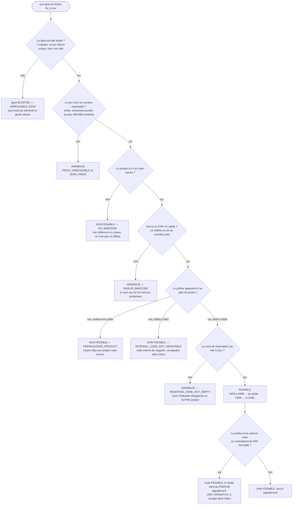

| Question | Réponse | Issue | Motif | `flv.csv` · `flv_1.csv` |
|---|---|---|---|---|
| **La ligne est-elle lisible ?** 7 champs, `id` non vide et unique, `nom` non vide | non | *ligne écartée* | `UNREADABLE_ROW` — ce n'est pas un produit, c'est du texte cassé ; seul cas qui alimente le garde absolu (§10.4) | **0 · 0** |
| **Le prix est-il un nombre exploitable ?** parse entier, `0 < prix ≤ 999 999` centimes *(borne haute = `MaxUnitPrice`, §6.1, 2ᵉ des trois impositions)* | non | **ANOMALIE** | `PRICE_UNREADABLE` / `ZERO_PRICE` — on ne met pas un prix inventé sur une étiquette | **0 · 0** |
| **Le produit a-t-il un code-barres ?** | non | **NON PESABLE** | `NO_BARCODE` — *« non référencé en caisse »*. Ce n'est pas un défaut : la caisse ne saurait pas le lire | **0 · 9** |
| **Le code-barres est-il un EAN-13 valide ?** 13 chiffres, clé de contrôle juste | non | **ANOMALIE** | `INVALID_BARCODE` — un code interne inventé (dans `flv_1.csv`, six `9999990…` et un `7441017910226`) ; **le seul cas où l'on écrit au producteur** | **0 · 7** |
| **Est-ce un code du plan de pesée ?** préfixe `0493`–`0498` (au poids) ou `0499` (à l'unité) — **le plan de §6.2**, qui donne aussi la largeur des champs | non, préfixe hors `049x` | **NON PESABLE** | `PREPACKAGED_PRODUCT` — *« il porte déjà son propre code-barres »*. Préfixes réellement observés, **clé de contrôle juste** : dans `flv.csv` six `3700147…` (gel douche, lessive, vinaigre, multi-usage) et un `3580281…` ; dans `flv_1.csv` `3329…` (14), `9999999…` (8), `3273…` (3), `3760…` (2), `7061…` (1), `3556…` (1) | **7 · 29** |
| | non, `049x` hors plan de pesée (`0490`, `0491`, `0492`) | **NON PESABLE** | `INTERNAL_CODE_NOT_WEIGHABLE` — `0490000402001` *« DEGRAISSANT SANS RINCAGE VRAC ♥♥ »* dans `flv.csv`, `0490000018004` *« ♥ Bouteille + capsule T.Battant »* dans `flv_1.csv`. Les préfixes « prix variable » `0491`/`0492` retombent ici : la balance ne sait pas les encoder, ce n'est pas une faute du producteur. **Signalé à part des préemballés** : un `049x` est un code *interne*, donc quelqu'un du magasin l'a attribué, et c'est corrigeable dans Odoo — un `3700147…` ne l'est pas | **1 · 1** |
| **La zone de réservation est-elle à zéro ?** | non | **ANOMALIE** | `RESERVED_ZONE_NOT_EMPTY` — **cas critique** : sans ce contrôle on écrase un digit significatif et on imprime un code-barres qui désigne **un autre produit** — à 1,236 kg, `0493100100006` sortirait une étiquette lue en caisse comme `PATATE DOUCE SAF` pesant **11,236 kg** (§6.2, T32). Dans `flv.csv`, 16 codes du lot boucherie/volaille récent (`0493100100006 « ♥AA-TOMME DE SAVOIE -MV »`…) ; ils sont **déjà refusés par l'application actuelle**, donc absents des balances aujourd'hui | **16 · 0** |
| *toutes les réponses ci-dessus franchies* | — | **PESABLE** | `0493` ⇒ au poids (**316 · 92**), `0499` ⇒ à l'unité (**15 · 15**) | **331 · 107** |

**Un signalement supplémentaire, qui ne change pas la qualification.** Quand le préfixe et la colonne `unite` se contredisent **par nature** — grandeur discrète (`Unité(s)`) sur un code `0493`, grandeur continue (`kg`, `Litre(s)`) sur un code `0499` —, le produit **reste pesable**, le mode vient du préfixe, et la ligne porte le signalement `UNIT_MISMATCH`. **Le code-barres fait foi**, parce qu'il est la seule des deux informations que la caisse lit : changer le mode d'après une colonne de texte produirait une étiquette que la caisse décoderait autrement (§10.2). Ces lignes sont **nommées, datées et listées** dans l'onglet Catalogue avec la mention *« à corriger dans Odoo »*, et l'interrupteur « Ne plus proposer ce produit » est à un clic.

- `flv.csv` : **1** — `CAROTTE BOTTE SAF` (`0493585000006`, déclaré `Unité(s)` alors que son code dit « au poids »).
- `flv_1.csv` : **5** — `LENTILLES CORAIL FRANCE 5KG` (`0493115000001`, déclaré `Unité(s)`) et quatre `0499` déclarés `kg` dont `♥ Concombre BDC` et `♥ Navet primeur JDL`.
- **Ne sont pas des divergences** : les 2 produits `0493` déclarés `Litre(s)` — `SHAMPOING CHEVEUX NORMAUX`, `SAVON LIQUIDE LAVANDE 20KG`. Ils sont pesés, comme leur code l'indique, et affichent ` € le litre`. Rien à signaler, rien à corriger : c'est du vrac liquide, et l'ancienne application était seule à se tromper dessus.

**Le compte, sur la pièce de référence — et c'est le compte que l'administration affiche :**

```
355 produits reçus
  331 pesables            316 en 0493 (au poids) + 15 en 0499 (à l'unité)
    8 non pesables        7 préemballés + 1 code interne 0490 — c'est normal
   16 anomalies           zone de réservation occupée — à corriger dans Odoo
  + 1 unité divergente    pesable, unité à corriger (comptée dans les 331)
```

*(Pour mémoire, `flv_1.csv` : 153 reçus · 107 pesables · 39 non pesables · 7 anomalies · 5 unités divergentes. Le profil est très différent — 25 % de préemballés en 2022 contre 2 % en 2026 — et c'est pour cela que les deux fixtures sont gardées.)*

**Jamais « 46 produits en erreur »**, qui est faux, alarmant, et qui allumerait un feu rouge permanent dès le premier import pour un catalogue parfaitement normal.

**Ce qui disparaît avec cette reconception**, et pourquoi c'est un gain et non une perte :

- **`product_unavailable_on_anomaly`** (§11.2) : un non-pesable n'est pas « masqué en option », il n'a **jamais** de tuile. Aucun exploitant n'a de choix légitime à faire sur « est-ce que je vends les produits en erreur ? ».
- **`limits.rules`**, la table qui permettait de « surcharger la sévérité et le message par code » : elle mettait la définition de *produit vendable* entre les mains d'un bénévole. La qualification est **calculée, non réglable**.
- **le caractère « configurable » de `ZERO_PRICE`** : un produit à 0 € est une anomalie, sans nuance.
- **`IMAGE_MISSING`** comme anomalie de catalogue : voir §10.7. Une tuile sans photo est un **état d'affichage**, pas un défaut d'import — et sur les fichiers réels, `IMAGE_MISSING` se déclencherait sur **49 %** des lignes de `flv.csv` et **100 %** de celles de `flv_1.csv`. *(`IMAGE_INVALID`, en revanche, **revient** : depuis que le champ est rempli, un contenu base64 qui n'est ni JPEG, ni PNG, ni GIF, ni BMP est un fait signalable — §10.7.)*
- **`products.visible`** (colonne dérivée stockée) et **`products.anomalies`** (JSON doublonnant la table des signalements) : remplacés par `qualification` + `reason` (§12.3).

**Les signalements sont conservés par import** (`findings`, §12.3), avec ligne CSV, identifiant Odoo, **nom du produit**, code, valeur fautive et phrase française — au lieu du `RapportIntegrite` purgé à chaque exécution. Deux signalements ne portent sur aucun produit en particulier : `UNEXPECTED_HEADER` (§10.2) et `UNKNOWN_CATEGORY` (§10.2 bis) ; ni l'un ni l'autre n'empêche quoi que ce soit.

Le nom est un **instantané d'affichage**, écrit par l'import qui l'a lu, et pour la raison qui vaut déjà pour `weighings.product_name` : le nom bouge dans Odoo, la ligne qui décrit un import de mars ne bouge pas. Aller le chercher dans `products` au moment de l'affichage montrerait, des signalements d'un import passé, un fait que cet import n'a pas dit — et n'en montrerait aucun pour un lot refusé, dont aucun produit n'est jamais entré en base. Il est vide dans les deux cas où le fichier n'en donne pas : un signalement qui ne porte sur aucun produit, et une ligne trop abîmée pour porter un nom, ce que `UNREADABLE_ROW` dit déjà.

#### 10.3 bis Le rapport d'import est un outil de correction d'Odoo, pas seulement un filtre

**Le commanditaire a donné à cette section une finalité qu'elle n'avait pas** : *« Ce fichier csv peut contenir des produits inutiles ou non pesables car l'utilisation et la configuration des articles dans Odoo est parfois erronée. C'est pour ça qu'à terme je souhaite interroger Odoo directement pour avoir des données plus fiables. »*

La qualification à trois issues n'est donc pas seulement une garde à l'entrée de la balance : **c'est la seule mesure de la qualité de la configuration Odoo que quelqu'un regardera**. Un signalement qui dit *« 16 anomalies »* est un filtre ; un signalement qui dit *quoi corriger, où et pourquoi* est un plan de travail. Chaque ligne du rapport porte donc les trois, **et cette structure est imposée par le type, pas par la bonne volonté de celui qui écrit le message** :

| Champ | Contenu | Exemple réel (`flv.csv`) |
|---|---|---|
| **Où** | `id` Odoo **et** nom du produit — de quoi ouvrir la fiche sans chercher | id `5115`, `♥AA-TOMME DE SAVOIE -MV` |
| **Quoi** | l'action, à l'impératif, avec la valeur attendue | *« Corriger le code-barres : les chiffres 8 à 12 valent `10000` au lieu de `00000`. »* |
| **Pourquoi** | la conséquence concrète, en français de magasin | *« La référence déborde sur le champ poids : à l'impression, l'étiquette désignerait un autre article, avec son prix. »* |

Le rapport est exportable en CSV depuis l'onglet Catalogue, trié par `id` Odoo : c'est le format dans lequel il sera relu du côté d'Odoo. **Il doit sortir dès la première exécution, avant la mise en service**, pour que les corrections soient faites en amont plutôt que découvertes en caisse.

> **La nuance honnête, à écrire avant qu'on ne la découvre.** L'API Odoo ne supprimera pas les erreurs de configuration : un article mal configuré le sera aussi à travers l'API. Ce que l'accès direct apporte, c'est de **lire des champs structurés** — catégorie, mode de vente, unité de mesure — au lieu de les **déduire d'un préfixe de code-barres**, ce qui retirera des règles à ce document et supprimera des classes entières de divergence (`UNIT_MISMATCH` n'existerait plus : le mode serait donné, pas inféré). Le rapport d'anomalies, lui, **reste utile dans les deux cas** — il change seulement de sujet, passant de « ce code-barres est-il exploitable ? » à « cet article est-il configuré comme ce qu'il est ? ». C'est à ce titre qu'il est conçu maintenant et non plus tard (§19, ADR-011).

### 10.4 Les garde-fous de qualité — chacun sur la grandeur qu'il surveille

Les trois seuils de la version précédente étaient calibrés sur une lecture du monde héritée, où *non conforme au référentiel balance* voulait dire *erreur*. Appliqués aux fichiers authentiques, ils donnaient : garde absolu franchi, mais **30 % de produits masqués sur `flv_1.csv`** (7 % sur `flv.csv`), donc **feu rouge permanent dès le tout premier import** et bandeau client affiché en continu — pour un catalogue normal. Le document écrit lui-même qu'*« un feu rouge qui se déclenche à tort est le pire ennemi de l'exploitation »*. Chaque garde est donc rebranché sur la grandeur qu'il est censé détecter.

**(a) Garde absolu — il détecte un fichier tronqué.** Il porte sur les **lignes illisibles** (`UNREADABLE_ROW` : mauvais nombre de champs, `id` ou `nom` vide), et sur rien d'autre. Si moins de `min_readable_ratio` (**90 %**) des lignes sont lisibles, **le lot entier est rejeté** : un CSV coupé en plein vol ne remplace pas un catalogue sain. Fichiers réels : **100 % de lignes lisibles sur les 355 comme sur les 153**. Le seuil peut être haut précisément parce qu'il ne mesure plus que la lisibilité du texte.

**(b) Garde relatif (important-13) — il détecte un décalage de colonne chez Odoo.** Il porte sur le nombre de **PESABLES**, d'un import à l'autre : s'il tombe sous 90 % de celui de l'import précédent, **le lot n'est pas appliqué**, le catalogue N−1 reste en service, **feu ROUGE**, et le message **nomme les 3 motifs majoritaires avec un numéro de ligne d'exemple**. C'est la bonne grandeur : un décalage de colonne fait s'effondrer les pesables sans toucher au nombre de lignes lisibles.

**(c) Feu rouge — il porte sur les ANOMALIES RÉELLES, jamais sur les non-pesables.** Le tableau de bord affiche le compte exact et **la liste, avec ligne CSV et motif**. `flv.csv` : **16 anomalies + 1 unité divergente sur 355**, soit un feu **orange** qui nomme dix-sept lignes précises et une action utile — *corriger ces fiches dans Odoo* (§10.3 bis). `flv_1.csv` : 7 + 5 sur 153. Un produit préemballé, lui, n'allume rien.

**Il n'y a plus de bandeau sur l'écran client.** *« Certains produits sont momentanément indisponibles »* était **faux** : un boulgour préemballé n'est pas momentanément indisponible, il ne relève simplement pas de la balance. Sur ce fichier, ce bandeau se serait affiché **tous les jours, en permanence**, sur le seul écran que quelqu'un regarde toute la journée.

> **Les valeurs sont provisoires, et elles le disent.** Deux fichiers authentiques ne font pas encore une distribution — ils font deux points, à quatre ans et demi d'écart, et c'est sur eux que les trois seuils sont **déjà refixés**. Ils sont revus **au troisième exemplaire archivé** (§18, L0), qui dira si la répartition par catégorie et le taux d'images se stabilisent. En attendant, l'écran d'administration les affiche **à côté de la mesure du jour** (« seuil : 90 % · dernier import : 100 % ») pour qu'un réglage sans rapport avec la réalité se voie immédiatement.

### 10.5 Le fichier déjà vu, et le fichier corrompu

**Un fichier au sha déjà appliqué est un cas NOMINAL, pas une anomalie** (important-2, important-12). Le producteur peut déposer chaque nuit un export identique à l'octet.

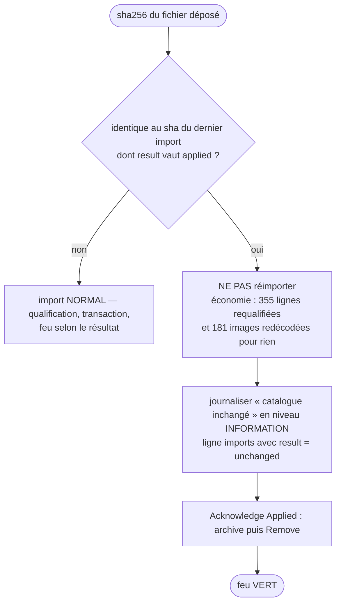

> **Le « ≈ 16 Mo de base64 » est mort — mais pas parce que les images n'existent pas.** Ce chiffre était un calcul d'hypothèses — `340 produits × 35 ko de vignette × 4/3` — construit **faute d'exemplaire réel du fichier**. Les exemplaires existent : `flv.csv` pèse **527 233 octets pour 355 produits**, dont **500 368 octets de base64** — soit **1,4 ko de vignette en moyenne, et 15 ko au maximum**, vingt-cinq fois moins que l'hypothèse. `flv_1.csv`, lui, n'a **aucune** image. Le travail évité par ce test de sha est donc la requalification de 355 lignes **et le redécodage de 181 images** — quelques dizaines de millisecondes, pas quelques secondes. **Aucune limite, aucun budget de tick, aucune décision de ce document ne repose sur le volume d'images hypothétique** : le plafond `max_file_size_mb` descend de 32 à 8 (§10.1), et partout où « ≈ 16 Mo » apparaissait (§13.2, ADR-010, ADR-015), c'est désormais « un import de catalogue », dont l'ordre de grandeur mesuré est le **demi-mégaoctet**.

**`imports` devient append-only** : `CREATE INDEX idx_imports_sha` (non unique). L'unicité appartenait à l'état de quarantaine, pas à l'historique — avec `UNIQUE(sha256)`, un catalogue parfaitement valide et inchangé violait la contrainte, annulait la transaction, n'était pas acquitté, était retenté, et finissait **banni définitivement** avec un feu rouge.

**Table de quarantaine dédiée :**

```sql
CREATE TABLE quarantine (
    sha256           TEXT PRIMARY KEY,
    failure_count    INTEGER NOT NULL DEFAULT 0,
    first_failure_at TEXT NOT NULL,
    last_failure_at  TEXT NOT NULL,
    code             TEXT NOT NULL DEFAULT '',
    reason           TEXT NOT NULL DEFAULT ''
) STRICT;
-- INSERT … ON CONFLICT(sha256) DO UPDATE SET failure_count = failure_count+1,
--                                            last_failure_at = excluded.last_failure_at
```

Le rejet immédiat ne s'applique que si `failure_count >= failures_before_reject` (3), et l'admin expose **« Oublier la quarantaine »** — sinon un CSV corrigé par le producteur et redéposé avec un contenu identique resterait banni.

**Deux codes d'erreur séparés, deux compteurs séparés** (important-12) :

| Code | Cause | Feu | Quarantaine |
|---|---|---|---|
| `ERR-CAT-03` | **contenu** inexploitable (parse, garde absolu sur les lignes illisibles, garde relatif sur les pesables) | rouge après 3 échecs | oui |
| `ERR-CAT-05` | fichier **lu et appliqué mais impossible à supprimer** : *« droits en écriture manquants sur \<chemin\> pour le compte \<compte\> »* | orange | **jamais** |

`quarantine.failure_count` n'est incrémenté que sur un échec de **contenu**. Un feu rouge qui se déclenche à tort est le pire ennemi de l'exploitation : après trois fausses alertes, l'équipe cesse de regarder les feux.

### 10.6 La décision humaine — « ne plus proposer ce produit »

**important-17 est adopté.** Le rejet du « CRUD produit local » avait emporté une fonction d'exploitation quotidienne qui n'est pas du CRUD.

**Ce n'est ni la qualification, ni une correction d'anomalie : c'est une troisième chose, et elle a besoin d'être nommée à part.** La qualification (§10.3) répond à une question de fait — *ce produit est-il pesable ?* — et sa réponse est calculée. Ce bouton-ci répond à une question de jugement — *voulons-nous le proposer aujourd'hui ?* — et sa réponse appartient à un humain. Le cas d'usage est précisément celui qu'**aucune règle d'import ne peut détecter** : une référence irréprochable (13 chiffres, clé juste, zone de réservation nulle, préfixe cohérent) mais **fausse au fond** — code appartenant à un autre article, prix erroné côté Odoo, produit hors saison ou retiré de la vente. Celle-là est qualifiée `Weighable`, s'affiche dans la grille, et produit une étiquette que **la caisse refuse ou facture au mauvais prix**, devant un client, jusqu'à ce qu'Odoo soit corrigé. C'est le seul recours local, et il est immédiat.

```sql
CREATE TABLE local_decisions (
    product_id   TEXT PRIMARY KEY,     -- Odoo id, stable (§10.9)
    offered      INTEGER NOT NULL DEFAULT 1 CHECK (offered IN (0,1)),
    min_weight_g INTEGER,              -- NULL = the general limits.min_weight_g (10 g)
    reason       TEXT NOT NULL DEFAULT '',
    decided_at   TEXT NOT NULL,
    decided_by   TEXT NOT NULL DEFAULT ''
) STRICT;
```

> **La deuxième colonne est la dérogation « produit léger », et elle change de nature.** L'ancienne application portait une `TableProduitsLegers` de **deux lignes** — `curcuma`, `piment` — appliquée par recherche de **sous-chaîne** sur le nom désaccentué, et la première version de ce document l'avait recopiée jusqu'aux deux valeurs, en configuration (`limits.light_product_terms`). C'était le dernier endroit où une décision métier se prenait sur un **libellé commercial**, c'est-à-dire sur de la matière vivante : les fichiers authentiques le montrent bien (noms de 8 à 69 caractères, accents, ligatures `Œ`, apostrophes, le caractère `♥` dans 127 noms sur 355 — et le plus long nom de 2026 n'existait pas en 2022), alors que l'`id` Odoo est unique et stable sur les 355 lignes comme sur les 153. Deux modes de panne concrets et symétriques : *« Curcuma Perou SAF »* renommé *« CURCUMA MOULU EN SACHET »* garde sa dérogation par hasard, mais **« SAFRAN » — le cas suivant, inévitable — est refusé silencieusement à 8 g** sans que personne comprenne pourquoi ; à l'inverse un *« PIMENT DOUX 5 KG »* hérite d'une dérogation qu'il ne doit surtout pas avoir. La dérogation est donc attachée **au produit**, par son `id`, dans la table qui porte déjà les décisions humaines, avec la même durée de vie et le même écran. Le garde-fou n° 13 `LIGHT_PRODUCT_ALLOWED` journalise alors **un identifiant de produit, pas une devinette lexicale**, et la règle devient explicable à un bénévole : *« ce produit précis est autorisé à peser moins de 10 g »*. La liste de termes ne survit **que** comme aide à la saisie de l'écran (« ces 3 produits contiennent “curcuma”, voulez-vous les déroger ? »), jamais comme règle d'exécution.

Un interrupteur **« Ne plus proposer ce produit »** et sa réciproque, dans l'onglet Catalogue. *(L'ancien libellé « Retirer le produit de la vente » était repris mot pour mot d'un menu contextuel d'Access ; il laissait aussi croire à une action sur le stock, ce que ce bouton ne fait pas.)* Ce n'est ni une création, ni une modification de prix, ni une divergence avec Odoo. Le nombre de décisions locales actives est affiché au tableau de bord **avec leur motif et leur date** — c'est ce qui empêche un produit d'y rester six mois parce que personne ne se souvient pourquoi il y est entré.

> **Cette table n'a plus besoin de « survivre » à quoi que ce soit.** Depuis §10.9, le produit garde son identité d'un import à l'autre : `local_decisions.product_id` est une clé étrangère ordinaire vers `products(id)`, et non plus une table orpheline jointe à la main après chaque destruction du catalogue.

### 10.7 Images — le CSV en apporte, une sur deux, et leur extension ment

**Les faits qui commandent cette section, mesurés sur `flv.csv` :**

| Mesure | Valeur |
|---|---|
| Produits **avec** image | **181 sur 355** (51 %) |
| Produits **sans** image | **174 sur 355** (49 %) |
| Base64 dans le fichier | 500 368 octets → **375 074 octets de binaire** |
| Formats **réels** | **171 JPEG, 10 PNG** |
| Plus grosse image | 15 352 octets de base64 → **11 513 octets** de binaire |
| Répartition par catégorie | A 45/140 · F 20/29 · L 50/68 · V 66/118 |

Trois conséquences, chacune tranchée ici.

**(a) Le format est reconnu aux octets d'en-tête, jamais à l'extension — parce que l'extension est fausse.** L'ancienne application écrit `C:\Balance\Images\<id>_image.jpg` **quel que soit le contenu décodé**. Sur ce fichier, **10 images sur 181 sont des PNG enregistrés en `.jpg`** : un dixième du parc porte une extension qui ment. C'est sans effet dans Access, qui ne regarde jamais le nom ; c'en est un pour un navigateur et pour toute chaîne qui déduit le type du chemin. Le nouveau code lit donc **les premiers octets** :

| Format | Signature | Extension écrite |
|---|---|---|
| JPEG | `FF D8 FF` | `.jpg` |
| PNG | `89 50 4E 47 0D 0A 1A 0A` | `.png` |
| GIF | `47 49 46 38` (`GIF8`) | `.gif` |
| BMP | `42 4D` (`BM`) | `.bmp` |
| *tout le reste* | — | **refusé** |

Un contenu qui n'est aucun de ces quatre formats **n'est pas écrit sur le disque** et lève `IMAGE_INVALID` — signalement **non bloquant** : le produit reste pesable, il perd sa photo, il garde sa tuile. Le `Content-Type` servi est celui du format **détecté**, et le nom du fichier en découle : il n'existe aucun chemin par lequel un octet d'en-tête et un nom de fichier puissent diverger. *(GIF et BMP sont acceptés bien qu'absents des deux fixtures : la détection les coûte quatre octets, et les refuser reviendrait à refuser une photo pour une raison que personne ne saurait expliquer au comptoir.)*

**(b) Deux bornes, l'une sur le fichier, l'autre sur l'image.** Le plafond de fichier de 8 Mo (§10.1) offre **une marge de quinze** sur les 527 ko observés : c'est le bon ordre de grandeur, il est confirmé. Il ne protège pas de tout pour autant — un seul base64 monstrueux tiendrait dedans —, d'où une seconde borne, **par image** : `max_image_size_kb` = **256 ko** de binaire, soit **vingt-deux fois** la plus grosse observée, et un contrôle de dimensions par `image.DecodeConfig` **avant** décodage complet (refus au-delà de 4096 × 4096), qui ferme la bombe de décompression. Dépassement ⇒ `IMAGE_TOO_LARGE`, non bloquant, même traitement qu'un format inconnu : le produit reste, la photo saute.

**(c) Une tuile sans photo n'est pas un cas dégradé : c'est 49 % du catalogue.** La grille ne peut donc pas être conçue autour de la photo, et elle ne l'est pas (§14.2, §14.3) : le **nom** est dimensionné en premier, la photo s'ajoute quand elle existe et son absence ne laisse **ni trou ni cadre gris**. Le déséquilibre par catégorie l'impose aussi : `F` est illustrée à 69 %, `A` à 32 % — une même grille contient les deux, à la même taille de tuile, sans que l'œil y voie deux gabarits. **`IMAGE_MISSING` n'est pas une anomalie de catalogue** : un signalement qui se déclenche sur 174 lignes n'informe personne.

**La source d'images reste déclarée, et le CSV en devient le défaut.**

| Source d'images | Ce que c'est | Statut |
|---|---|---|
| `csv` | la colonne `image` du fichier : base64 décodé **en flux**, format reconnu aux octets d'en-tête, `image.DecodeConfig`, sha256 | **défaut** — c'est ce que le fichier de référence contient |
| `image_directory` | un répertoire indexé par `id` Odoo — `C:\Balance\Images\<id>_image.jpg`, l'héritage. Les extensions y sont fausses de la même façon : **le contenu est reniflé à l'identique**, le nom du fichier n'est qu'une clé de recherche | repli, utile tant que le parc n'a pas été réimporté |
| `none` | le parc n'a pas de photos, ou on ne veut pas les afficher | valide, et sans conséquence — `flv_1.csv` est exactement ce cas |

- Les images sont **adressées par leur SHA-256**, écrites en `tmp` + `fsync` + `os.Rename`, chemin `<data>/images/<2 premiers car. du sha>/<sha>.<ext détectée>`. *(Corrige le JPEG corrompu de l'existant : `Open For Binary` sans troncature laissait la queue de l'image précédente quand la nouvelle était plus courte.)* Servies avec `Cache-Control: public, max-age=31536000, immutable` + `ETag`. L'adressage par sha rend l'import **idempotent** : réimporter le même catalogue ne réécrit pas 181 fichiers, il en recalcule les empreintes et n'en écrit aucun.
- **Le ramasse-miettes à 7 jours disparaît** : il n'existait que parce que le catalogue était détruit à chaque import et rendait les images orphelines (§10.9). Une image devient supprimable quand le produit qui la porte est retiré **depuis plus de `archive_days`**, ce que la purge existante fait déjà.
- **L'inconnue « d'où viennent les images du parc ? » (§21 n° 5) se referme sur le fond, pas sur la forme** : le CSV en apporte, donc l'application sait s'alimenter seule et ne dépend plus d'un répertoire que personne ne sait qui remplit. Reste à demander à Cooperatic **pourquoi une image sur deux manque** — article sans photo dans Odoo, ou export partiel — parce que la réponse change la cible à viser, pas le code à écrire.

### 10.8 La bascule différée du catalogue

**important-18 est adopté.** L'existant écrit le nouveau catalogue dans des tables miroirs et ne bascule que lorsque l'écran est **inactif depuis `Delai_idle_en_s`** (10 s en production). C'est explicitement là pour ne pas perturber un client en cours de pesée, et cette garde avait disparu.

Sans elle : un import qui arrive pendant qu'un client parcourt la grille réordonne les tuiles sous son doigt ; le `pointerdown` visait « Ail », le `pointerup` tombe ailleurs ; **l'étiquette imprimée porte le mauvais produit et le mauvais prix**, le client la colle sur son sac, la détection n'a lieu qu'en caisse, et le journal enregistre une pesée parfaitement cohérente du mauvais produit — **l'incident est indétectable après coup.**

Reprise à coût quasi nul dans le Hub : le lot est stocké dans `pendingBatch` ; `h.catalog.Store` n'est appelé que si `h.model.State == Idle` **et** qu'aucune interaction n'a eu lieu depuis `MaxSwitchIdle` (**10 s, constante du code** : c'est une garde de sûreté interne, pas une politique de magasin — l'exposer en configuration permettait de la mettre à 0 et de rouvrir le mode de panne décrit ci-dessus), l'attente étant drainée sur `Tick`. Côté front : **jamais de re-rendu de la grille tant qu'un pointeur est enfoncé**, et la sélection est transportée par `product_id`, **jamais par index de tuile**. Test de panne dédié : « catalogue remplacé pendant une pesée en cours ».

### 10.9 Le produit garde son identité

L'ancienne application remplaçait le catalogue **en bloc** : `CopyObject` vers `SauvegardeProduits`, `DELETE FROM Produits`, puis un `INSERT` par ligne. Un produit disparu du CSV disparaissait de la base, **sans trace ni signalement**. La première version de ce document a transposé ce choix sans le nommer, et trois artefacts n'existaient que par lui : `products.import_id … REFERENCES imports(id)` (une ligne produit *appartenait* à un import), `weighings.product_id` **sans clé étrangère** avec le commentaire « le produit peut disparaître », et une table de masques annotée « SURVIT au remplacement complet du catalogue ».

Les fichiers authentiques tranchent : les **355 `id` Odoo de `flv.csv` sont distincts**, sans un doublon, comme les 153 de `flv_1.csv`, et c'est la clé du producteur. On détruisait 355 identités pour en recréer 355 identiques. *(Ces `id` vont de 20 à 5209 sans être contigus : ils identifient, ils ne comptent pas et ils n'indexent rien.)*

**Un import est donc un `UPSERT` par `id`, pas un remplacement.**

```
for each row of the batch : INSERT … ON CONFLICT(id) DO UPDATE SET … , seen_at = :now
at end of transaction     : UPDATE products SET withdrawn_at = :now
                            WHERE seen_at < :now AND withdrawn_at IS NULL
```

Un produit absent du fichier n'est pas effacé : il est **marqué retiré**, à une date. Il sort de la grille (il n'est plus au catalogue, donc plus pesable), mais **il reste une ligne** — avec son historique de pesées, sa décision locale et son image. Conséquences en cascade, toutes des simplifications :

- `weighings.product_id` redevient une **vraie clé étrangère** ; `product_name` n'est plus qu'un instantané d'affichage, conservé parce qu'un libellé change chez Odoo, non parce que la ligne va être détruite.
- `local_decisions` (§10.6) n'a plus besoin de « survivre » à une destruction : elle est jointe par clé étrangère.
- Les images ne deviennent jamais orphelines, donc **le ramasse-miettes à 7 jours disparaît** (§10.7).
- **« Ce produit a disparu du CSV » devient un fait observable, affichable et alertable** — *« 4 produits retirés depuis l'import du 12/03 »* — au lieu d'un silence.
- `import_id` devient `last_import_id` : une **observation** (« quel import a vu ce produit pour la dernière fois »), pas un propriétaire.

**L'échange reste UNE transaction** (§12.3, §13.2) : soit le catalogue N−1 reste intact, soit le nouveau est intégralement en place. Ce qui change, c'est la nature de l'écriture — un upsert borné à 355 lignes au lieu d'un `DELETE` suivi de 355 `INSERT` —, et elle est plus rapide.

---

## 11. Configuration

### 11.1 Format et emplacement

**Un fichier JSON, qui est aussi le format d'export.** Pas de TOML ni de YAML : `encoding/json` est dans la bibliothèque standard, il sérialise et désérialise **la même structure Go** que celle qu'édite l'écran d'admin, et « cloner un poste » devient une copie de fichier. Contrepartie assumée : pas de commentaires — mais personne ne l'édite à la main, c'est le but. Un champ `_readme` en tête sert de mode d'emploi.

| | Windows | Linux |
|---|---|---|
| Configuration | `C:\ProgramData\Balance\config.json` | `/etc/openscale/config.json` |
| Versions précédentes | `config.json.1` … `.5` | idem |
| Base | `C:\ProgramData\Balance\data\balance.db` | `/var/lib/openscale/balance.db` |
| Images | `…\data\images\<xx>\<sha>.<jpg\|png\|gif\|bmp>` | `/var/lib/openscale/images/` |
| Étiquettes capturées | `…\data\labels\` (30 dernières) | `/var/lib/openscale/labels/` |
| Archives / rejets CSV | `…\data\catalog\{archives,rejected}\` | idem |
| Journaux texte | `…\data\logs\balance.log` (5 Mo × 3) | `/var/log/balance/` |

Surcharges : `--config`, `--data`, `OPENSCALE_CONFIG`, `OPENSCALE_DATA`. **Aucune autre variable d'environnement, aucun chemin en dur dans le code.**

> **La configuration n'est PAS en base, exprès** : un bénévole doit pouvoir la copier sur une clé USB, et l'application doit pouvoir démarrer et afficher un écran d'admin **même si la base est corrompue**.

### 11.2 Le schéma, commenté

```jsonc
{
  "version": 1,
  "_readme": "Modifiable depuis l'écran d'administration. Édition manuelle : arrêtez le service, éditez, redémarrez. Copies de secours en config.json.1 à .5.",
  "modified_at": "2026-07-24T14:32:05Z",

  "station": { "number": 2, "name": "Poste 2 — fruits", "coop": "La Coope" },
  "network": { "listen": "127.0.0.1:8085", "admin_on_lan": false },

  "ui": { "language": "fr", "sound": true,
          "idle_timeout_s": 45,               // clears a FORGOTTEN entry (tare, tile count):
                                              // trade-off between the slow customer and the
                                              // reset for the next one. Closes no "screen":
                                              // there are none left (§14.3).
          "reprint_window_s": 60,             // PERMANENT bottom bar — trade-off between
                                              // serving the customer and the fraud window
          "show_grid_prices": true,
          "show_by_unit_products": false,     // are the by-unit tiles (prefix 0499) in the
                                              // grid? DEFAULT: NO. A choice about the SHOP
                                              // and not about looks: such a tile prints a
                                              // label WITHOUT EVER READING THE SCALE (§6.6),
                                              // and not every cooperative offers that gesture
                                              // at the counter. The name follows the PREFIX,
                                              // which alone carries the sale mode; the
                                              // `unite` column of the CSV is a price label
                                              // and decides nothing (§10.2). A DISPLAY and
                                              // never a refusal: Prepare still judges the
                                              // qualification alone.
          "grid_columns": 0,                  // HOW MANY COLUMNS the client grid shows.
                                              // 0 = AUTOMATIC, the default, and it is a
                                              // BEHAVIOUR and never « aucune colonne »:
                                              // the grid follows the screen exactly as it
                                              // does today, 5 columns on the 24" of the
                                              // parc and 10 on a 4K (ADR-035 intact).
                                              // 3 to 12 = THAT MANY COLUMNS ON ANY SCREEN,
                                              // and the rest of the tile follows by a
                                              // factor DEDUCED from the column width the
                                              // browser gives. An OVERRIDE and never a
                                              // replacement: a file written before this
                                              // key keeps the grid it had (ADR-057).
                                              // A count and not a scale factor, on purpose:
                                              // a factor sits on top of clamp() and lands
                                              // on five, six or twelve columns depending on
                                              // the screen for the ONE value written.
                                              // Control 49 refuses everything else, and
                                              // says what zero means while refusing.
          "min_products_for_chip": 5,         // HOW MANY weighable tiles a category
                                              // needs before the grid gives it a filter
                                              // CHIP. Default 5, floor 1, NO CEILING,
                                              // applied to EACH category separately, on
                                              // its own count -- there is no setting on
                                              // the NUMBER of categories. Under the
                                              // threshold a category loses its CHIP and
                                              // never its tiles: they stay in « Tout »
                                              // and stay searchable; categories[].visible
                                              // is the only setting that removes products
                                              // from a screen (ADR-059, which amends
                                              // ADR-024 without reversing it). A file
                                              // written before this key, the shipped one
                                              // included, decodes to the default, exactly
                                              // as it already does for grid_columns.
                                              // Control 50 refuses only the floor.
          // tile_size REMOVED: la densité s'adapte en continu à l'écran (clamp CSS,
          // ADR-035). Le contrôle 20 REFUSE désormais cette clé — un exemple qui la
          // porterait encore ferait recopier une configuration que le poste rejette.
          // Ce qui se règle depuis ADR-057 est le NOMBRE DE COLONNES, ci-dessus : ni la
          // même forme, ni le même sens, donc ni le même nom.
          // title REMOVED: "La Cagette" was not decoration, it was the string passed to
          // FindWindowA to lock the Access kiosk down. The name of the cooperative lives in
          // station.coop and is shown on the administration dashboard (§14.4).
          // open_category REMOVED: the idle view is the COMPLETE grid of weighable products,
          // categories are filters and not four pre-built screens (§14.3).
          // grid_density REMOVED, and grid_columns above is NOT it under another name: a
          // density is a PROPORTION, so one figure written by hand fits a HETEROGENEOUS
          // FLEET — the work clamp() does better than an operator, and still does, since it
          // remains the default. grid_columns settles another question altogether, « combien
          // de produits voir d'un coup », which no measurement of a screen answers (ADR-025,
          // ADR-057). The two physical constraints that once forbade any such setting —
          // touch target >= 72 px, a 69-character name read at 60-80 cm — have not moved:
          // they stopped being a prohibition and became what §14.4 ANNOUNCES before the
          // save. (69 and not 49: 49 was the longest name of flv_1.csv, the 2022 catalogue,
          // which §10.2 records as unrepresentative.)
          // success_delay_ms, reject_delay_ms, switch_delay_s REMOVED: code constants.
          // The first two timed overlays that no longer exist; the third is a Hub safety
          // guard (§10.8). No operator has a legitimate choice to make about how long a
          // success acknowledgement lasts: that is a design trade-off, measured once on
          // site, not an operating parameter.
        },

  "scale": {
    "type": "gram-xfoc-plus",                 // gram-xfoc-rs | gram-xfoc-plus — HARDWARE
                                              // PROTOCOLS, AND NOTHING ELSE. "manual" and
                                              // "replay" have left this enumeration (§9.3):
                                              // the first is a STATE, not a scale model; the
                                              // second is a diagnostic tool with no business
                                              // in a volunteer's drop-down list.
    "present": true,                          // "this station has a scale". Proposed by the
                                              // detection at first start (§14.4); at false,
                                              // EXPLICIT DECLARATION of a station without a
                                              // scale: the light goes off instead of staying
                                              // red, and manual entry becomes nominal.
    "options": { "port": "COM8", "baud": 9600, "bits": 8, "parity": "N", "stop": 1,
                 "backoff_min_ms": 200, "backoff_max_ms": 5000 },
    "manual_entry_allowed": true,             // ONLY operator switch of the degraded mode
    "degrade_after_s": 20
  },

  "printer": {
    "type": "raster",                         // raster (DEFAULT, A2) | sbpl | preview — §8.1
    "template": "weighing_identical",         // A1
    "options": { "transport": "winspool",     // winspool (Windows default) | devfile
                                              // (Linux default) | tcp | file    (A5)
                 "queue": "SATO WS408_2",
                 "path": "",                  // when transport = devfile
                 "address": "",               // when transport = tcp
                 "fallback": { "enabled": false, "transport": "winspool", "queue": "SATO WS408_3" },
                 "darkness": 3,               // <#E>
                 "speed": 4,                  // <CS>
                 "offset_x": 0,               // <A3> H, dots — VALIDATED against the geometry
                 "offset_y": 0,
                 "invert_bits": false,        // polarity of <G>, "alignment" self-test
                 "copies": 1,
                 "roll_capacity": 1000 }      // "change the roll" alert at 90 %
  },

  "pricing": {
    "tiers": [
      { "code":"MEMBER",     "label":"Adhérent",  "abbrev":"A", "discount_percent":10, "rank":1 },
      { "code":"SOLIDARITY", "label":"Solidaire", "abbrev":"S", "rank":2 }
    ],
    "primary_code": "MEMBER",                 // A7 — printed LARGE
    "secondary_codes": ["SOLIDARITY"],        // A7 — printed small
    "reference_code": "SOLIDARITY",           // encoded when the payload carries a price
    "amount_rounding": "half_up",             // A6
    "unit_price_rounding": "half_up"          // A6
  },

  "barcode": {
    "verify_reference_check_digit": true
    // THE NUMBERING PLAN IS NOT HERE, AND THAT IS THE WHOLE POINT (§6.2, ADR-028).
    // Prefixes, reference width, payload width, decimals and sale mode are a BINARY
    // CONSTANT indexed by prefix, self-checked at start-up (4 + ref + payload + 1 == 13).
    // REMOVED on that ground: content, weight_decimals, units_field_width, weight_prefix,
    // unit_prefix, rules_by_prefix — and checks 19 and 20 change their object (§11.3).
    // A field that changes the MEANING of the code read by the till is not a setting, it is
    // an external contract: it changes with a binary version, reviewed and tested, never
    // from the screen of a station (ADR-025).
    // resolution_dpi REMOVED (mineur-3): the only source is template.media.dots_per_mm.
    // module and bar height REMOVED from here: they belong to the TEMPLATE (§7.2).
  },

  "limits": {
    "empty_max_g": 5,
    "basket_check_enabled": true, "basket_min_g": -282, "basket_max_g": -270,
    "min_weight_g": 10, "max_weight_g": 99999, "max_tare_g": 9999,
    "min_units": 1, "max_units": 99, "max_amount_cents": 99999
    // light_product_terms REMOVED: it was the last place where a business decision — "this
    // product sells in very small quantities" — was taken on a SUBSTRING of a commercial
    // name, and the two shipped values ("curcuma", "piment") were literally the content of
    // TableProduitsLegers. The name comes from Odoo and moves: "SAFRAN" would be rejected at
    // 8 g without anyone understanding why, and "PIMENT DOUX 5 KG" would inherit an
    // exemption it must absolutely not have. The exemption is now attached TO THE PRODUCT,
    // by its Odoo id, in local_decisions.min_weight_g (§10.6) — set in one click, listed
    // among the active exemptions, explainable to a volunteer.
    // product_unavailable_on_anomaly REMOVED (§10.3): the qualification "is this product
    // weighable?" is COMPUTED, not adjustable. A prepackaged product is not "optionally
    // hidden", it never gets a tile.
    // rules{} REMOVED: overriding the severity of a reason through configuration put the
    // definition of "sellable product" in the hands of a volunteer.
  },

  "stability": {                              // A3
    "mode": "advisory",                       // advisory (DEFAULT) | blocking
    "min_duration_ms": 300, "tolerance_g": 2,
    "timeout_ms": 3000, "on_timeout": "warn_and_print",
    "expiry_floor_ms": 1200,
    "expiry_ceiling_ms": 5000,
    "expiry_factor": 3                        // expiry = 3 × observed median rate
  },

  "catalog": {
    "type": "webdav",                         // local_drop | webdav
    "options": { // directory: local_drop ONLY — control 47 refuses the key here, which is
                 // why this webdav example does not carry it. Empty or absent = the
                 // <data>/catalog/incoming the service CREATES; named = that directory,
                 // which the service never creates and probes at save time (control 46,
                 // ADR-038).
                 "url": "https://dav.example.org:8001/",
                 "username": "balance", "password": "",   // webdav ONLY — encrypted at rest, never exported,
                                                          // and never served to the browser (§14.5)
                 "separator": ";",
                 // pattern REMOVED: "flv_<n>.csv" is a constant of the exchange format,
                 // just like the semicolon and the order of the 7 columns. The file name
                 // derives from station.number and from nothing else: two declarations of
                 // the same fact is the failure the legacy application died of.
                 "poll_interval_s": 5, "stable_polls": 2,
                 "max_file_size_mb": 8,        // last-resort guard — the real file is 527 kB (§10.1)
                 "max_image_size_kb": 256,     // per DECODED image; the largest observed is 11 kB (§10.7)
                 "min_readable_ratio": 0.9,    // ABSOLUTE guard, on UNREADABLE rows (§10.4a)
                 "max_weighable_drop": 0.10,   // RELATIVE guard, on WEIGHABLE products (§10.4b, important-13)
                 "max_archives": 30, "archive_days": 60,
                 "failures_before_reject": 3 },
    "images": { "source": "csv",               // csv | image_directory | none — §10.7
                                               // csv by DEFAULT: the reference file carries
                                               // 181 images out of 355. Format recognized from
                                               // the header bytes, never from the extension.
                "path": "" },                  // empty = <data>/product_images/ (source image_directory)
    "fallback_category": "other",              // where a letter outside F/L/V/A lands (§10.2 bis)
    // mappings{} REMOVED: F/L/V/A → fruits/vegetables/bulk/other is a constant of the Odoo
    // adapter. No operator has a legitimate choice to make about "does L mean vegetables or
    // fruits?".
    "categories": [
      {"code":"fruits","label":"Fruits","rank":1,"color":"#C0392B","visible":true},
      {"code":"vegetables","label":"Légumes","rank":2,"color":"#27AE60","visible":true},
      {"code":"bulk","label":"Vrac","rank":3,"color":"#B7950B","visible":true},
      {"code":"other","label":"Autres","rank":4,"color":"#5D6D7E","visible":true}
      // label, rank, color and "show this category ON THIS STATION" are real shop
      // decisions — the "fruits" station has no reason to show bulk goods. The LETTER,
      // however, belongs to the producer.
    ]
  },

  "journal": { "max_rows": 5000, "max_days": 90, "max_technical": 2000 },
  // capture_frames REMOVED: a setting with a single correct value is not a setting. At false
  // it broke, in one go, the viewer of the last 20 frames (§14.4), the last 30 frames of
  // diagnostic.zip (§15.4) and the living corpus that feeds the permanent tests — that is,
  // the backbone of remote support. Capture is a bounded in-memory ring, ALWAYS on, exactly
  // like the 500-line technical ring (§12.1); its cost is known and constant. What remains
  // adjustable is the RETENTION of what is persisted: max_technical and max_days.

  "admin": { "password_hash": "$argon2id$v=19$m=65536,t=3,p=2$...",
             "recovery_code_hash": "$argon2id$...",   // important-10
             "session_minutes": 30, "attempts_per_minute": 5 },

  "maintenance": { "weekly_integrity_check": true, "disk_alert_mb": 200 }
}
```

> **`show_by_unit_products` est dans `ui` et non dans `catalog`, alors qu'elle parle du catalogue.** Trois raisons, toutes mesurées. (1) Un changement du bloc `catalog` déclenche la **sonde disque du contrôle 46** (§11.3) : basculer un réglage d'affichage échouerait alors parce qu'un partage WebDAV est momentanément injoignable. (2) Un changement du bloc `catalog` **relance la source du catalogue**, là où un changement du bloc `ui` est instantané et sans coupure de service (§11.4). (3) Ce réglage ne change **rien à ce que le poste importe, qualifie ou stocke** : le même fichier produit les mêmes 331 produits pesables, et l'inventaire d'import ne bouge pas d'une ligne.
>
> **Le filtre est côté client, et il doit l'être.** `product_count` du catalogue et `catalog_count` du flux d'état doivent rester **égaux** : le navigateur redemande le catalogue dès qu'ils diffèrent. Filtrer côté serveur créerait une divergence permanente, donc un `GET /api/v1/catalog` **par événement du flux — jusqu'à dix par seconde** (§13.3), répondu en 304, invisible sans profileur réseau. Le serveur sert donc l'inventaire de tout ce qui a une tuile, et le poste décide de ce qu'il en montre — exactement le mécanisme de `categories[].visible`. Un banc lit les deux routes et exige leur égalité : la faute ne peut plus revenir en silence.
>
> **Le compte ne suffit pourtant pas à faire arriver un réglage d'affichage, et c'est ADR-057 qui l'a découvert.** Une présentation qui change **sans** changer le nombre de produits — `show_grid_prices`, `show_by_unit_products`, `grid_columns` — ne déclenchait aucune relecture : on réglait, on enregistrait, et rien ne se passait sur l'écran d'à côté. Le flux d'état porte donc, à côté de `catalog_count`, une **empreinte de présentation** que le navigateur **compare sans jamais la lire**. Elle est prise sur le **DTO de présentation** et non sur la configuration entière : une empreinte globale rechargerait toute la grille au changement de port série ou de noircissement d'impression, pour une donnée que l'écran client ne lit pas. Un champ ajouté demain à la présentation y entre **sans qu'on ait à y penser** ; un bloc qui n'y est pas n'y entrera jamais. L'ETag du catalogue fait qu'une présentation inchangée coûte un 304.
>
> **Le défaut `false` s'applique en silence aux fichiers existants.** La lecture du document n'applique aucun défaut : un fichier écrit avant cette clé se relit comme « masqués ». C'est ce qui est demandé, mais un poste mis à jour perd quinze tuiles sans un message. D'où deux exigences tenues : les fichiers livrés **écrivent la clé** plutôt que de compter sur le zéro du langage — `config-lacagette.json` à `false`, `config-demo.json` à `true`, `NeutralProfile` à `false` —, et la page **Catalogue** annonce combien de produits sont concernés sur le catalogue en service (§14.4). La clé traverse `Export(false)`, donc l'**empreinte de configuration** que les postes d'un parc comparent à l'œil : ajouter cette clé change les huit caractères de tous les postes, même à valeur identique (§11.5, ADR-041).

### 11.3 Validation — un numéro n'est jamais réemployé, tous les contrôles remontés d'un coup

```go
// Fault is a single configuration error, named by the field that carries it.
type Fault struct {
    Field   string   `json:"field"`   // "pricing.tiers[1].discount_percent"
    Message string   `json:"message"` // "le tarif de référence est le prix du catalogue : il ne porte pas de remise"
    Values  []string `json:"values,omitempty"`
}

// Validate returns ALL the faults, not the first one: the admin screen is used
// by volunteers, it must report everything at once, in French, with the
// offending field named and, whenever possible, the list of available values.
// reg carries the driver descriptors, which is what allows the options of each
// driver to be validated instead of just its type.
func (c *Config) Validate(reg Registries) []Fault
```

`Registries` porte les descripteurs de drivers, ce qui permet de valider **les options de chaque driver** et pas seulement « type inconnu » : `port` dans la liste énumérée, `queue` parmi les files **réellement visibles**, `address` en `host:port`. Il porte aussi la **géométrie de tête** que le driver d'impression déclare, dont les contrôles 29 et 38 se servent (ADR-045).

> **Aucune clé d'option n'est nommée dans cette fonction** (ADR-044). Le noyau ne connaît ni `scale.options.port` ni `printer.options.copies` : il applique le **schéma que le driver choisi déclare**, et c'est tout. Deux contrôles l'ont appris à leurs dépens, et leurs numéros portent la cicatrice — voir plus bas.

1–2 `station.number ∈ [1,99]`, `network.listen` parseable · 3–5 types de balance/imprimante/source connus, **liste des valeurs disponibles dans `Fault.Values`** — pour la balance, **exactement les deux protocoles du registre** (§9.3) ; pour l'imprimante, **exactement les descripteurs enregistrés**, c'est-à-dire `raster` (défaut) et `preview`, `sbpl` restant un encodeur et non un driver (§1.1-3, §8.1, §8.2) · 6–9 options de driver validées par leur schéma · 10–13 au moins un tarif, **le tarif désigné par `reference_code` ne porte pas de remise** (c'est le prix du catalogue, pas un réglage), codes uniques, **`discount_percent ∈ [0 %, 100 %]`** au dixième de point — *le dénominateur constant d'ADR-034 a supprimé la panne que cette ligne retenait : un `coef_den` non positif atteignait `RoundingPolicy.Divide` et tuait la goroutine du Hub* · 14–16 `primary_code`, `reference_code`, chaque `secondary_codes` appartiennent à la grille · 17–18 **le plan de numérotation interne s'auto-contrôle au démarrage** (§6.2, ADR-028) : chaque préfixe déclaré fait exactement 4 chiffres, et `4 + RefWidth + PayloadWidth + 1 = 13` — un plan incohérent **arrête le processus au démarrage**, jamais à l'impression · 19 aucun préfixe déclaré deux fois dans le plan · 20 **une configuration qui porte encore `weight_decimals`, `units_field_width`, `weight_prefix`, `unit_prefix`, `content`, `rules_by_prefix`, `coef_num`, `coef_den` ou `ui.tile_size` est refusée**, avec un message qui renvoie au plan compilé pour les six premières, à `discount_percent` (ADR-034) pour les deux suivantes et à `ui.grid_columns` (ADR-057) pour la dernière : après mise à jour, un poste ne doit surtout pas croire que son ancien réglage de largeur, son ancien coefficient ou son ancien palier de densité s'applique encore. **`domain.Migrate` (§11.6, ADR-058) s'exécute avant ce contrôle sur tout ce qu'un poste LIT** — démarrage, `doctor`, `config validate` — de sorte qu'au moins une partie de ces neuf clés en disparaît avant d'y arriver, quand la conversion est possible : `ui.tile_size` toujours, `coef_num`/`coef_den` quand la fraction est exacte. Ce que ce contrôle voit encore est donc, sur ce chemin, ce que la migration n'a pas su trancher — ou ce qu'un document tapé directement dans `PUT /admin/api/config` porte, chemin que la migration ne touche pas · 21 **`template.media.dots_per_mm` unique source de résolution** (mineur-3) · 22 `basket_min_g ≤ basket_max_g ≤ 0` · 23 `min_weight_g < max_weight_g ≤ 99999` · 24 `min_units ≤ max_units ≤ 99` · 25 `max_amount_cents ≤ 99999` · 26 `timeout_ms > min_duration_ms` · 27 `expiry_floor_ms ≥ 1000` et `< expiry_ceiling_ms` · 28 `stability.mode` et `on_timeout` dans la liste · 29 **`template` existe ET `Template.ValidateOn()` passe SUR LA TÊTE QUE LE DRIVER DÉCLARE** (les 9 règles et l'accord de pas, §7.5, ADR-045) — géométrie recomposée avec les décalages de l'exploitant · 30 `journal.max_rows ≥ 100` · 31 `admin.password_hash` non vide et bien formé · 32 `catalog.fallback_category ∈ categories` · 33 codes de catégorie uniques · 34 `min_readable_ratio ∈ [0,1]` · 35 couleurs `#RRGGBB` · 36 `poll_interval_s ≥ 1` · **37 — numéro laissé en trou** : `copies` n'est plus un contrôle en propre, sa borne est déclarée par le driver qui possède la clé et appliquée par le contrôle 7 (ADR-044) · 38 **`offset_x/y` recomposé avec la géométrie du gabarit ET la marge que CETTE tête laisse** (mineur-2, ADR-045) · 39 **pas d'hôte HTTP(S) derrière un chemin de dépôt** (important-11) · 40 `max_weighable_drop ∈ [0, 0.5]` · 41 `roll_capacity ≥ 50` · 42 **transport série interdit pour l'imprimante** (16 ko/étiquette, §8.3) · 43 **tout prix porté par un fichier de configuration livré (`config-lacagette.json`, produits de démonstration, `flv_demo.csv`) vérifie `0 ≤ prix ≤ 999 999` centimes** — 3ᵉ et dernière imposition de `MaxUnitPrice` (§6.1), avec le DDL (§12.3) et la règle de prix de §10.3. *Depuis §11.5 c'est un contrôle de configuration **ordinaire**, appliqué à un fichier comme tous les autres ; il validait auparavant des valeurs compilées, c'est-à-dire du code source* · 44 `catalog.images.source` dans la liste, et `path` lisible **depuis le contexte du service** quand la source est `image_directory` · 45 `max_image_size_kb ∈ [16, 4096]` **et** `max_image_size_kb × 1024 ≤ max_file_size_mb × 1 048 576` — une image ne peut pas être autorisée à dépasser le fichier qui la contient (§10.7) · 46 **sur `local_drop`, un `catalog.options.directory` non vide est *inscriptible* depuis le contexte du service** — le fichier témoin y est créé **puis supprimé**, parce que l'acquittement d'un import *est* une suppression (ADR-004, ADR-038) —, et ce n'est pas le répertoire d'archives du poste, qui relirait ses propres copies en boucle ; vide, c'est le répertoire du poste et il n'y a rien à sonder · **47 — numéro laissé en trou**, comme le 37 : il refusait `directory` sur `webdav`, ce que le contrôle 9 refuse déjà pour **toute** source, présente ou à venir — une clé que la source choisie ne déclare pas ; sa phrase a déménagé dans le 9, qui **nomme** désormais la source qui porte la clé (ADR-052) · 48 **`update.repository` est un couple `propriétaire/projet`, jamais une URL** (ADR-040) : c'est le seul champ du fichier qui désigne d'où viendra du code privilégié, et l'hôte est compilé dans le binaire · 49 **`ui.grid_columns` vaut `0` — automatique — ou un nombre de colonnes de 3 à 12** (ADR-057), et le refus porte **l'intervalle *et* le sens de `0`** dans `Fault.Values` : les deux valeurs sont de natures différentes et une seule est un nombre de colonnes. Quelqu'un qui écrit `1` demande une grille plus dense ; un refus qui ne nommerait que l'intervalle lui ferait lire « 1 est hors de [3, 12] » sans jamais lui apprendre que la grille qu'il avait s'écrit `0` — ce qui, dans un fichier, ressemble exactement à « aucune colonne » · **50** `ui.min_products_for_chip` vaut au moins **1**, **sans plafond** (ADR-059) : sous 1, une catégorie qui n'a pas la moindre tuile obtiendrait quand même sa puce, ce qui n'a pas de lecture légitime — c'est le plancher que ce contrôle refuse. Un plafond protégerait contre un seuil supérieur au plus gros rayon d'une coopérative, qui laisse la barre avec « Tout » seul ; ce cas n'a pas de refus, parce qu'il se répare en revenant sur le champ, et qu'aucun couple de bornes n'est vrai de tous les catalogues (§14.3-2).

> **Un numéro est en trou, un autre a maigri, et c'est le même mouvement** (ADR-044). Le **37** portait `copies ∈ [1,10]`. Il nommait une clé d'un driver que le noyau ne voit pas, et il était l'**une des trois bornes** posées sur un même chiffre : cette règle et le schéma d'options disaient `[1, 10]`, pendant que `raster.Settings.Validate` acceptait les six chiffres du champ `<Q>`. Ce n'était pas une incohérence mais **deux notions** — ce qu'un *travail d'impression* demande, et ce qu'une *configuration* autorise —, et le désaccord ne se voyait qu'en lisant les trois. Le **3**, lui, exigeait littéralement la clé `scale.options.port` de tout poste dont `scale.present` était levé, quel que soit son `scale.type` : un driver atteint par une **adresse** — TCP, USB — était refusé avant d'être interrogé, sur une clé que son propre schéma ne porte pas, et en ajouter un aurait demandé d'éditer `Config.Validate`. Le 3 subsiste, réduit à ce qu'il sait faire — *ce protocole existe-t-il dans ce binaire ?* — et le 37 **n'est pas renuméroté** : §11.3 désigne ses contrôles par leur numéro, ici, dans les tests et dans le code, et renuméroter ferait mentir toutes les citations d'un coup. **Un troisième numéro les a rejoints depuis** : le **47**, retiré par ADR-052 pour la même raison que le 37 — il refusait sur `webdav` une clé que le contrôle 9 refuse déjà pour toute source qui ne la déclare pas. **Le numéro d'un contrôle retiré n'est donc jamais repris, et jamais donné à un contrôle nouveau** : la liste énumérée ci-dessus est ce qui fait foi sur ce qu'un poste vérifie réellement, un contrôle à la fois — pas un total recopié à cet endroit, qui a déjà menti pour avoir oublié une suppression et redirait la même chose au premier ajout suivant.
>
> **Ce qui est abandonné est nommé.** Sur un registre **vide** — `openscale config validate` lancé sur un portable —, le contrôle par schéma ne s'exécute pas du tout : la borne de `copies` n'est alors pas appliquée à la validation. Elle l'est là où elle décide de quelque chose, à la construction du driver. Une borne qu'un paquet d'imprimante est seul à pouvoir énoncer vaut mieux qu'une borne que le noyau répète.

> **Quatre contrôles ont disparu et il faut dire lesquels, sinon on croit à un oubli.** L'ancien n° 32 (`catalog.pattern` contient `%d`) protégeait d'un dégât qu'on vient de rendre impossible en supprimant `pattern` (§11.2). L'ancien n° 34 (valeurs de `mappings ∈ categories`) protégeait d'un dégât qu'on vient de rendre impossible en faisant de `F/L/V/A` une constante de l'adaptateur. L'ancien n° 38 (pas de lettre de lecteur si le processus tourne comme service) avait perdu son objet le jour où `local_drop` est devenu un répertoire que le service crée lui-même ; ADR-038 lui rend un objet, et le contrôle 46 le traite **par la mesure et non par la forme du chemin** — il n'interdit pas d'écrire `Z:\`, il constate que le compte du service ne l'atteint pas. L'ancien n° 37 (`ui.open_category ∈ categories`) non plus : **il n'y a plus d'onglet ouvert au repos**, la vue au repos est la grille complète et les catégories sont des filtres (§14.3). **Un contrôle de validation dont la seule fonction est de rattraper un réglage qui n'aurait pas dû exister est un symptôme, pas une garantie.**

> **Deux contrôles touchent le disque, et ils ne tournent pas toujours.** Le 44 et le 46 passent par le `PathChecker` que `Registries` porte, et une sonde **absente est un état légitime** : `openscale config validate` sur un portable ne peut pas savoir ce que le compte du service voit, il valide la forme et pas l'existence. Sur un poste en service la sonde existe (`platform.NewPathChecker`), et le 46 ne s'exécute alors **que si le bloc `catalog` du document soumis diffère de celui du fichier** : un enregistrement qui porte sur les tarifs ne doit pas échouer parce qu'un partage est momentanément indisponible. La décision « faut-il sonder ? » appartient à la couche HTTP, qui seule connaît les deux versions ; l'exécution reste dans le domaine.

**Une configuration invalide ne tue pas le processus.** Le serveur démarre en mode « configuration invalide », charge `NeutralProfile` **en mémoire sans écrire**, sert la liste des fautes **sur l'adresse que le fichier déclare tant qu'aucune faute ne porte sur son bloc `network`** — sinon sur `http://127.0.0.1:8085` — et affiche un plein écran client *« Poste en configuration d'usine (ERR-CFG-01) — prévenez un responsable »*. **Le poste démarre toujours** : une configuration cassée ne doit jamais produire un écran noir.

> **Cette phrase n'a été intégralement vraie qu'à partir du 01/08/2026 (§11.6, ADR-058), et il faut le dire plutôt que laisser croire qu'elle l'a toujours été.** Elle ne valait auparavant que pour un fichier qui **se décodait** puis échouait `Validate` : un document tronqué — une virgule en trop, une accolade qui manque — faisait échouer la lecture avant même `Validate`, et **le service ne démarrait pas du tout**. `domain.DecodeConfigBlockByBlock` (§11.6) a fermé ce cas : un document qui ne se décode pas du tout produit désormais une faute nommée `domain.WholeDocumentField`, comme n'importe quel autre bloc illisible, et le poste sert ERR-CFG-01 au lieu de ne pas démarrer.

> **Le profil neutre remplace ce sur quoi le poste TOURNE, jamais la façon dont on l'ATTEINT pour le réparer.** Le bloc `network` du fichier — `listen` **et** `admin_on_lan` — survit au repli au même titre que le bloc `admin`, et pour la même raison : l'adresse est celle qui figure sur la fiche d'installation, et c'est celle que le kiosque compose depuis ce même fichier, qu'une configuration fautive laisse parfaitement lisible ; `admin_on_lan` est ce qui permet à un bénévole d'arriver avec un portable plutôt qu'avec un clavier. Emprunter l'adresse du profil neutre déplaçait le service pendant que le kiosque continuait d'ouvrir l'adresse déclarée : **écran client noir sur le poste même que cette section existe pour garder vivant**, et écran d'administration refermé sur la boucle locale au moment où quelqu'un vient réparer. Le bloc est repris **entier ou pas du tout** : une adresse ouverte au réseau derrière une garde d'administration fermée serait plus difficile à diagnostiquer qu'un repli cohérent dans les deux sens.
>
> **Une adresse d'écoute VIDE n'est plus une faute, elle est un fichier qui ne dit rien (10/08/2026).** `Config.UnmarshalJSON` la ramène à celle du profil neutre, exactement comme il corrige `update.repository` vide (ADR-040) et `ui.min_products_for_chip` à zéro (ADR-059) — même mécanisme, même raison écrite : *un fichier qui ne dit rien tourne sur le défaut, et le refuser ici ferait refuser à un poste sa propre configuration livrée*. Le cas n'était pas théorique, c'était **le cas nominal** : `Export` remet tout le bloc `network` à zéro (§11.5), donc le fichier livré porte littéralement `"listen": ""`, et un poste neuf partait avec une faute que **rien à l'écran ne permettait de réparer** — or `PUT /admin/api/config` valide le document entier, si bien qu'une seule faute sans champ verrouillait l'administration **entière, sur toutes les pages**. Constaté à l'installation d'un poste de production le 10/08/2026, réparé à la main dans le fichier. Une adresse **présente et fausse** traverse le rattrapage intacte et se fait toujours refuser par le contrôle 2 — qui a désormais un champ à l'écran pour dire où taper la bonne (§14.4).
>
> **Le repli sur `127.0.0.1:8085` ne subsiste que dans un cas** : celui où une faute nomme le bloc `network` **lui-même** — désormais une adresse mal formée, et non plus un champ vide. Un repli qui recopierait une adresse inliable transformerait `ERR-CFG-01`, un poste qui sert sa liste de fautes, en `ERR-SYS-02`, un poste qui n'est pas là du tout. **« En cas de doute, 8085 » cesse donc d'être le repère qu'un exploitant pouvait appliquer partout** : un poste fautif ailleurs que sur son bloc réseau sert sur l'adresse que son fichier déclare, et c'est celle-là qu'il faut ouvrir. C'est aussi pourquoi `Test-StationHealth` (`deploy/windows/common.ps1`) sonde les deux adresses, et dans cet ordre.
>
> **`--listen` prime sur les deux**, et il est appliqué **après** la validation. Écrit avant, il était jugé comme si le fichier l'avait porté : une faute de frappe en ligne de commande faisait basculer un poste sain en « configuration d'usine » et était reprochée à `config.json`, tandis qu'une vraie faute sur l'adresse du fichier était silencieusement réparée pour la durée du lancement et revenait au redémarrage suivant, seule, devant quelqu'un qui se croyait quitte. Un `--listen` mal formé est désormais refusé **en nommant le drapeau**, par la règle du contrôle 2 elle-même (`domain.CheckListenAddress`) et non par une seconde implémentation qui dériverait.

Chaîne de repli au démarrage : `config.json` → `.1` → … → `.5` (la première version valide est chargée **et recopiée**) → `NeutralProfile` en mémoire. Le fichier fautif est copié en `config.json.invalid-<timestamp>`.

### 11.4 Écriture, rechargement à chaud, garde-fou

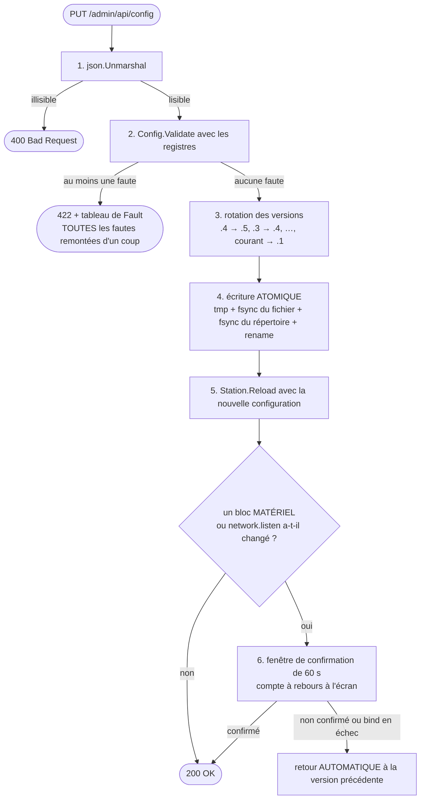

```go
// Reload publishes a new configuration and restarts only the subsystems whose
// block actually changed.
func (s *Station) Reload(next domain.Config) error {
    previous := *s.cfg.Load()
    s.cfg.Store(&next) // limits, tiers, template, UI, journal: instant, no service gap

    // NORMALIZED comparison, not reflect.DeepEqual over json.RawMessage: two
    // configurations that are semantically identical but serialized with a
    // different key order must NOT cut the serial port in the middle of a
    // service. We compare a hash of the canonical JSON (sorted keys, no spaces).
    if blockFingerprint(previous.Scale) != blockFingerprint(next.Scale) {
        if err := s.restartScale(next); err != nil { return err }
    }
    if blockFingerprint(previous.Printer) != blockFingerprint(next.Printer) {
        if err := s.restartPrinter(next); err != nil { return err }
    }
    // station.number is reloaded WITH the catalog: its only real consumer is the
    // name of the watched file, flv_<n>.csv (§11.2).
    if blockFingerprint(previous.Catalog) != blockFingerprint(next.Catalog) ||
        previous.Station.Number != next.Station.Number {
        if err := s.restartCatalog(next); err != nil { return err }
    }
    // A net.Listener closes and reopens in three lines: there has never been a
    // technical reason to demand a process restart (ADR-027). The 60 s
    // confirmation window remembers the previous address: if the bind fails, or
    // if nobody confirms, we rebind the old one.
    if previous.Network.Listen != next.Network.Listen {
        if err := s.rebindListener(next); err != nil { return err }
    }
    return nil
}

// restartScale cancels the sub-context, THEN WAITS for the device to be
// effectively closed before re-instantiating. On Windows the serial port is
// exclusive: without that wait, reopening fails intermittently with "Access
// denied". This is why Scale.Close() is BLOCKING.
//
// bloquant-2: the h.measurements channel is NEVER closed nor set to nil; only
// the disposable `done` channel signals the end of the reader goroutine. The
// re-instantiated driver writes into the SAME channel. Serial → manual → serial
// therefore works, and it is tested.
//
// ★ défaut 8: BOTH WAITS ARE BOUNDED, by the injected clock. The caller is the
// PUT /admin/api/config handler: writing a configuration must NEVER be able to
// hang. Two hangs were possible, and both had to be handled:
//   a) a bare `<-s.scaleDone` — the §5.3 contract does require closing `done`
//      on EVERY exit path, including a Start that fails before launching its
//      goroutine; but a contract is not an execution guarantee, and a faulty
//      third-party driver would freeze the admin screen;
//   b) `s.scale.Close()` — declared BLOCKING, it may never return on a failed
//      Windows serial port, and the bounded wait placed AFTER it would then
//      never have been reached.
func (s *Station) restartScale(next domain.Config) error {
    s.cancelScale()

    // Close() runs in a DISPOSABLE goroutine: transient just like the one of
    // ports.WithBudget (§5.3, §13.1), at most one per reload, released when the
    // serial driver releases the port.
    closed := make(chan struct{})
    go func() { defer close(closed); s.logIfErr(s.scale.Close()) }()

    if !waitAll(s.clock, 3*time.Second, closed, s.scaleDone) {
        // We RE-INSTANTIATE ANYWAY. Reopening may fail with "Access denied":
        // that is an amber light and the fallback to manual entry described
        // below, never a stalled configuration write.
        s.log.Technical("error", "scale", "ERR-SCL-08",
            "fermeture du port non confirmée en 3 s, réinstanciation forcée",
            next.Scale.Port)
        s.counters.UnconfirmedScaleCloses.Add(1)
    }
    // The old `done` channel is ABANDONED, never reused: a late goroutine that
    // closed it afterwards would close nothing observable.
    s.scaleDone = make(chan struct{})
    // … re-instantiation, Start(ctx, s.measurements, s.scaleDone)
    return nil
}

// waitAll reports whether ALL the channels were closed before the deadline. It
// closes nothing and retains no goroutine.
func waitAll(clk ports.Clock, d time.Duration, cs ...<-chan struct{}) bool
```

| Bloc modifié | Effet | Interruption |
|---|---|---|
| `pricing`, `limits`, `stability`, `barcode`, `ui`, `journal`, `printer.template`, `network.admin_on_lan` | `atomic.Store` | **aucune** |
| `printer.options` | fermeture / reconstruction / auto-test | ~200 ms |
| `scale.*` | fermeture / réouverture / remise à zéro du figeur et du cadencemètre | ~1 s, `ScaleLost` transitoire |
| `catalog.*` **et `station.number`** | arrêt / relance de la veille, **sur le nouveau nom de fichier** | aucune (catalogue mémoire conservé) |
| `admin.password_hash` | invalidation des sessions | déconnexion admin |
| `network.listen` | fermeture de l'écouteur / rebind / **compte à rebours de 60 s** | ~100 ms, bandeau « Reconnexion… » côté front |

> **Aucun bloc de configuration n'exige un redémarrage du processus, et il faut dire pourquoi cette ligne a existé.** Sous Access, changer un réglage voulait dire régénérer les formulaires, donc relancer l'application : « redémarrer » était la **seule** primitive disponible (`BoutonSauvegarder_Click` → `InitTableSysteme` → reconstruction, `Application.Quit`). Cette architecture a construit exactement l'outillage qui rend ce recours inutile — comparaison d'empreinte par bloc, fermeture bornée, réinstanciation, fenêtre de confirmation de 60 s avec retour arrière automatique — et elle l'applique déjà aux **deux ressources les plus difficiles à reprendre** : le port série exclusif de Windows et la file d'impression. S'arrêter devant un `net.Listener`, qui se ferme et se rouvre en trois lignes, n'avait aucune justification technique. `network.listen` passe donc par le **même schéma en trois temps** que le matériel : on ferme l'écouteur, on rebinde, on lance le compte à rebours ; sans confirmation, ou si le bind échoue, on revient à l'adresse précédente — c'est le `ip route` sous SSH revendiqué ci-dessous. Le front sait déjà se reconnecter (§14.3). **Disparaissent avec cette ligne** : le bandeau, le bouton, la route `POST /admin/api/restart` (§14.5) et la mention « redémarrage » de la page Poste (§14.4). *(`station.number` figurait aussi sur cette ligne alors qu'il est exclu de l'export et posé une seule fois par l'assistant de premier démarrage : la contrainte décrite ne se produisait jamais. Il est désormais rechargé à chaud avec le bloc catalogue, dont il est le seul consommateur réel.)* **Le seul redémarrage légitime est celui que le superviseur — SCM ou systemd — déclenche tout seul.**

**Le garde-fou qui compte — « Appliquer et tester » en trois temps.** Pour tout bloc matériel **et pour `network.listen`** :

1. **Valider** — contrôles de forme **+ existence réelle** : la file `SATO WS408_2` est-elle énumérée ? le port `COM8` existe-t-il ? Sinon, la liste des valeurs disponibles s'affiche en clair.
2. **Appliquer et tester** — nouvelle configuration appliquée, auto-test lancé (3 s d'écoute de trames, ou étiquette de test).
3. **Confirmer sous 60 s** — compte à rebours à l'écran. Sans confirmation, **retour automatique à la version précédente**. C'est `ip route` sous SSH : impossible de se couper la branche.

**Le retour arrière remet deux documents, et non un.** Le poste et son fichier ne portent pas toujours le même : le poste revient à ce qu'il **opérait**, le fichier à ce qu'**il** portait avant l'écriture de l'étape 4. Sur un poste hors service (§11.3) ces deux documents n'ont rien de commun — la mémoire porte le profil neutre, le fichier les tarifs, les garde-fous et les catégories de la coopérative — et les confondre revenait à écrire le profil d'usine sur le fichier du magasin, soixante secondes après le geste qui le réparait. `Station.Reload` reçoit donc les deux, `ReloadRequest.Next` et `ReloadRequest.FileBefore` ; un `FileBefore` absent — le fichier n'a pas pu être relu — fait retomber le retour arrière sur la configuration en service, c'est-à-dire sur tout ce qu'un tel appelant possède.

Le poste, lui, ne se voit **jamais** appliquer le fichier d'avant : sur un poste hors service, ce document est précisément celui que §11.3 refuse de faire tourner, et rien ne fait *entrer* un poste dans l'état hors service — `ConfigurationRepaired` ne sait qu'en **sortir**.

L'écriture précédant le compte à rebours, **un second enregistrement pendant la fenêtre est refusé en 409**, comme une confirmation demandée hors fenêtre l'est déjà : l'accepter déplacerait la cible du retour arrière sur une version que personne n'a confirmée non plus, et la version que quelqu'un avait vraiment validée serait celle qu'on perd. La restauration d'une des cinq copies (`POST /admin/api/config/restore`, §14.5) suit la même règle, et lit elle aussi le fichier **avant** de l'écrire.

**Repli si tout échoue** : le poste entre en **saisie manuelle** — un *état*, entré automatiquement, et non un driver qu'on aurait écrit dans un fichier —, bascule l'impression en `preview`, journalise, et affiche un bandeau rouge « matériel indisponible, mode dégradé » **avec sa cause et son horodate**. Il **continue de peser** plutôt que de mourir. Cette horodate est ce qui rend enfin décidable la question qu'un bénévole pose vraiment : *« pourquoi ce poste est-il en saisie manuelle ce matin ? »*

### 11.5 Cloner un poste

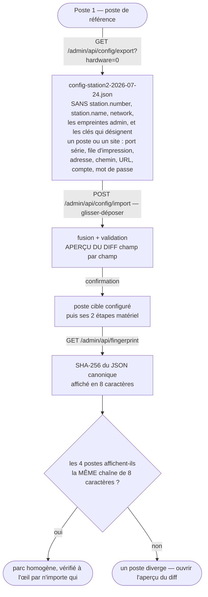

**Le reste des options de driver voyage**, et ce défaut est délibéré : une option de
réglage est partagée par les quatre postes jusqu'à preuve du contraire, et la preuve
s'écrit dans `stationSpecificOptions` (`internal/domain/redact.go`). Le décalage
d'étiquette est le cas qui a tranché — la notice promet depuis toujours qu'il voyage
avec la configuration clonée, et il partait avec `printer.options`.

Les 4 postes affichent la même chaîne de 8 caractères, ou pas. Vérification immédiate à l'œil, par n'importe qui — ce que les 227 colonnes `_Poste1..4` de l'existant ne permettaient pas.

**Le mot de passe admin n'est jamais exporté**, ni haché ni en clair. À l'import, si le poste cible n'a pas de mot de passe, le parcours « premier accès » est déclenché et **impose** d'en définir un.

**Un seul profil compilé — `NeutralProfile()`** : mono-tarif, garde-fous génériques, panier désactivé, imprimante `preview`, `scale.present = false`. Il est réduit au **strict minimum qui permet au processus de démarrer et d'afficher son écran d'administration** — exactement le rôle qu'il joue déjà en §11.3 quand la configuration est invalide. Il ne contient aucune URL, aucun coefficient de tarif, aucun seuil relevé chez un client.

**Les valeurs de La Cagette sont un fichier livré, pas du code** : `config-lacagette.json`, versionné dans l'archive de release avec son empreinte, copié par l'installateur et **rejouable par le chemin d'import qui existe déjà ci-dessus**, avec l'aperçu du diff champ par champ.

> **Pourquoi `LaCagetteProfile()` disparaît.** C'était le réflexe de la table `SystemeDefaut` (227 colonnes, une ligne) et de ses boutons *ENREGISTRER / RESTAURER LES VALEURS PAR DÉFAUT* : la configuration de référence habitait **à l'intérieur** de l'application, et on la « restaurait » dans la configuration effective. L'ancienne application le faisait faute de pouvoir copier un fichier. Cette architecture a un `config.json` copiable, exportable, importable, avec diff et empreinte — et réintroduisait malgré tout une référence enfermée dans le binaire. Conséquences concrètes qu'on supprime : changer un coefficient de tarif ou l'URL du partage n'est plus une **recompilation** suivie d'un redéploiement sur 4 postes ; il n'y a plus **deux sources de vérité** pour les valeurs par défaut (le code Go *et* les fichiers) ; le binaire redevient un **produit** au lieu d'un exécutable sur mesure pour un seul client ; et le contrôle n° 43, dont l'objet était de valider du code source, redevient une validation de configuration ordinaire. Le lot L9 livre désormais **un fichier**, pas un binaire recompilé. Voir ADR-026.

### 11.6 Migration d'un `config.json` ancien

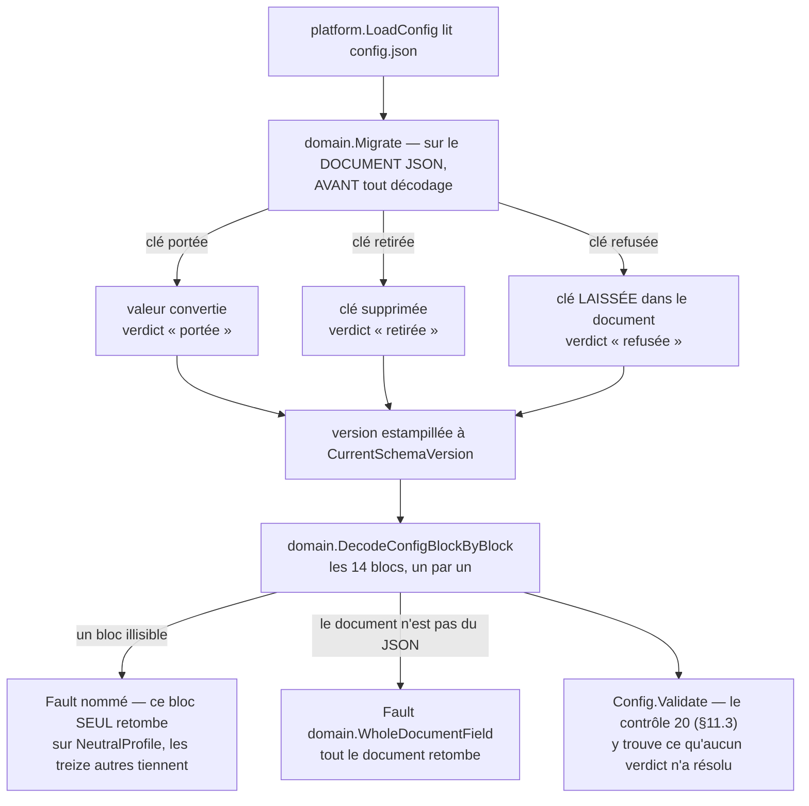

**`platform.LoadConfig` est la porte unique par laquelle les octets d'un fichier deviennent une `Config`.** Il y en avait quatre avant ce lot — `serve`, ce paquet lui-même, `openscale doctor` et `openscale config` — et c'est cette quadruplication qui a permis à l'incident du 01/08/2026 d'exister : un garde-fou posé dans l'une des quatre laissait les trois autres ouvertes. `LoadConfig` réserve son erreur au seul cas « il n'y a pas de fichier lisible à ce chemin » — tout le reste, document tronqué, bloc illisible, clé que ce binaire refuse, revient sous forme de fautes plutôt que de tuer le processus.

**`domain.Migrate` travaille sur le document JSON *avant* décodage, et c'est ce qui lui permet de rattraper un champ dont le TYPE a changé** — `weight_decimals` d'un entier vers autre chose, `coef_num` d'un nombre vers une chaîne — ce qu'`encoding/json` ne pardonne pas : une migration qui tournerait après le décodage tournerait sur un poste qui a déjà échoué à démarrer. Elle rend trois verdicts par clé retirée qu'un document porte encore (ADR-058) : **portée**, la valeur devient son équivalent au schéma actuel ; **retirée**, la clé disparaît parce que le défaut de son remplaçant est déjà le comportement qu'elle demandait ; **refusée**, ce binaire ne devine pas et la clé reste dans le document telle quelle — un refus consiste à **ne rien faire**, ce qui est ce qui laisse le contrôle 20 (§11.3) dire la phrase qu'il dit déjà. `domain.CurrentSchemaVersion` est écrit sur le document migré ; c'est une **estampille et non une autorité** — `Config.Version` a toujours existé sans jamais être lu, si bien que tout fichier du parc annonce 1 quel que soit son âge, et c'est pourquoi les étapes de migration se déclenchent sur les **clés présentes**, pas sur ce numéro.

**`domain.DecodeConfigBlockByBlock` décode ensuite le document migré, un bloc à la fois.** Les quatorze blocs de premier niveau (`station`, `network`, `ui`, `scale`, `printer`, `pricing`, `barcode`, `limits`, `stability`, `catalog`, `journal`, `admin`, `maintenance`, `update`) sont sondés isolément contre un `NeutralProfile` frais : un bloc qui ne décode pas retombe seul sur sa valeur neutre et porte une faute nommée, les treize autres gardent la leur. Un document qui n'est même pas un objet JSON exploitable produit une seule faute, sur `domain.WholeDocumentField`, et le poste sert cet écran sur la configuration d'usine plutôt que de ne pas démarrer.

**Le démarrage n'écrit toujours pas** (§11.4 inchangé) : `serve` appelle `LoadConfig`, garde le résultat en mémoire, et ne touche jamais le fichier. Seule `openscale config migrate` — appelée par `update.ps1` et `update.sh` une fois le poste debout, ou à la main par un exploitant — rend une migration permanente, en écrivant par le même `ConfigStore` que l'écran d'administration. Elle est **idempotente** : un fichier déjà à ce schéma en ressort inchangé. Et `domain.Migrate` n'est appelé que là où un poste **lit** un fichier hérité — démarrage, `doctor`, `config validate`, `config migrate`, le kiosque, **et `ConfigStore.Read`**, donc `config password`, `config recovery-code`, `ConfigStore.Restore` et les routes d'administration qui repartent du fichier plutôt que de la mémoire —, jamais sur ce que `PUT /admin/api/config` reçoit (§11.4) : ce chemin-là reçoit un document tapé maintenant, pas un fichier ancien, et le contrôle 20 y reste le seul rempart. *Oublier `ConfigStore.Read` dans cette énumération est ce qui a caché, une journée entière, que ses appelants avaient perdu l'erreur sur laquelle ils comptaient (02/08/2026).*

**`ConfigStore.Read` garde la lecture de `LoadConfig` et en refuse la tolérance, et cette dissymétrie est délibérée.** `serve`, `doctor`, `config validate` et `config migrate` veulent une `Config` sortie de n'importe quel fichier : un poste qui sert sa liste de fautes vaut mieux qu'un poste qui ne démarre pas. Aucun appelant de `Read` ne veut cela : une configuration qui *ressemble* au fichier — même `station.coop`, même nom, un bloc silencieusement remplacé par celui d'usine — est la seule valeur qu'aucun d'eux ne doit recevoir, puisque chacun en fait la vérité à l'écriture suivante. `Read` rend donc `domain.UnreadableBlocksError` dès qu'une faute de décodage existe, et sa `Config` revient **à zéro** : un appelant qui ignorerait l'erreur n'obtient rien d'exploitable plutôt que les blocs substitués. Pour la même raison, `openscale config migrate` **n'écrit rien** tant qu'un bloc n'a pas été lu, et `openscale config validate` **compte les fautes de décodage** avec celles de `Validate`, exactement comme `serve` : deux portes sur le même fichier ne peuvent pas rendre deux verdicts.

**Mais « je n'ai pas pu tout lire » n'a pas UN verdict, il en a trois, et c'est l'erreur qui a coûté le plus cher de ce lot.** Un refus sec vaut exactement autant qu'une tolérance silencieuse — dans l'autre sens. Tolérée (avant le 02/08/2026), la lecture faisait écrire la grille d'usine par-dessus les tarifs d'une coopérative. Refusée sèchement (02/08/2026), la **récupération par code de secours** cessait de lire le fichier et lui écrivait les **quatorze** blocs d'usine — identité, tarifs, identifiants du catalogue, garde-fous —, en HTTP 200 et sans un avertissement, sur le seul geste qui existe pour sauver ce poste. `domain.UnreadableBlocksError` **porte** donc la `Config` telle qu'elle a été lue et **nomme** les blocs qui ne l'ont pas été, et chaque appelant tranche par `errors.As` selon ce qu'il fait du fichier :

| Appelant | Ce qu'il fait du fichier | Son verdict |
|---|---|---|
| `GET /admin/api/config` | l'affiche | montre les blocs **lus**, et nomme les substitués dans `unreadable_blocks` — **champ servi, qu'aucun écran ne lit encore** (le bandeau est recensé non fait dans `SUIVI.md` ; `openscale doctor` nomme le bloc en attendant) |
| Récupération par code de secours | le réécrit entier | repart des blocs **lus**, **ne persiste pas**, ouvre la session avec un avertissement |
| `PUT /admin/api/config`, restauration | le réécrit | s'en sert comme référence — garde « clé retirée », report du mot de passe du catalogue, cible du retour arrière de 60 s |
| `POST /admin/api/config/reload` | le met en service | **refuse**, en nommant le bloc |
| `config password`, `config recovery-code` | le réécrivent entier | **refusent** |
| `ManualEntry` (retour) | ne lit que `scale` | **passe outre** une faute sur un autre bloc |
| `ConfigStore.Restore` | rend une version | la sauvegarde **existe** : 422 avec la raison, jamais 404 |

**Ce qui *répond à propos* du fichier refuse aussi, et pour une raison distincte de ce qui l'écrit.** `openscale config fingerprint` et `openscale config export` n'ont aucun moyen de dire « sauf ce bloc-là » : le premier rend les huit caractères que quatre postes d'une coopérative comparent **à l'œil** (ADR-012, §11.4), le second rend le **fichier** dont ces postes sont configurés (§11.5). Un bloc retombé sur le profil neutre fait donc porter le premier sur une configuration que **personne n'a déclarée** — mesuré, `428807b3` devient `7b386ddb` **en silence, code de retour 0** — et fait **cloner** cette configuration par le second, ce qui est la panne de `config migrate` propagée par la recopie. Les deux refusent, en nommant le bloc, avec un statut non nul. `validate` n'est pas dans cette liste et ne doit pas y être : son travail est précisément de **nommer** les fautes, pas de refuser de regarder. Même règle enfin pour l'empreinte en tête du rapport d'`openscale doctor` et de `diagnostic.zip`, qui n'est plus affichée quand un bloc a été substitué — `doctor` ne refuse toujours rien, et le contrôle 7 nomme le bloc juste en dessous. Le critère y est la faute de **décodage** et non la faute : un fichier dont tous les blocs se décodent se décrit parfaitement lui-même, même si toutes ses valeurs sont fausses.

**`config.redacted.json` de `diagnostic.zip` reste dans l'archive, et porte l'avertissement dans son `_readme`.** Le retirer priverait de toute vue de la configuration le poste qui a treize blocs lisibles sur quatorze — c'est-à-dire précisément celui que le support a besoin de voir. Y mettre les **octets bruts** y remettrait `admin.password_hash`, le code de secours et les identifiants WebDAV, dans le fichier dont la promesse entière est « vous pouvez l'envoyer sans le relire » : c'est refusé, et sans discussion. Un en-tête **hors JSON** casserait toute lecture machine. `Config.Readme` — « le mode d'emploi que JSON ne peut pas porter en commentaire » — est le véhicule prévu : le document reste du JSON valide, le caviardage s'y applique comme au reste, et ce champ est **hors empreinte** — `Fingerprint` remet `Readme` à zéro, par une ligne écrite exprès et non par une propriété structurelle —, donc il ne déplace rien de ce qui se compare. L'avertissement est **ajouté en tête** et n'écrase pas ce que le fichier expliquait déjà. Les fautes de décodage lui **parviennent** depuis `Doctor.readConfiguration` plutôt que d'être recalculées : après le décodage, un bloc remplacé ne se distingue plus d'un bloc qu'un poste aurait réellement déclaré ainsi.

---

## 12. Persistance

### 12.1 Ce qui est en base, ce qui n'y est pas

| En SQLite | Sur disque, hors base | Nulle part |
|---|---|---|
| catalogue (**355 lignes mesurées**), catégories, **décisions locales** | `config.json` + 5 versions | statistiques agrégées |
| journal des pesées (5 000 max) + lignes de tarif | images **JPEG ou PNG** (171 / 10 dans le fichier réel), une sur deux (§10.7) | secrets SMTP/WebDAV en clair |
| journal technique (2 000 max) **+ anneau RAM de 500** | gabarits embarqués + surcharges | sauvegarde N−1 du catalogue |
| historique des imports + **signalements** + **quarantaine** | archives / rejets CSV, étiquettes capturées | mot de passe réseau exporté |
| `meta` (versions, dernier import, compteur de rouleau) | journaux texte (5 Mo × 3) | — |

### 12.2 Ouverture — les pragmas dans le DSN, jamais dans le schéma

```go
// Open opens the database stored at path and applies every pending migration.
//
// FIXED BUG: a PRAGMA journal_mode = WAL placed at the top of a schema.sql that
// runs inside a transaction fails ("cannot change into wal mode from within a
// transaction"), and busy_timeout / foreign_keys are PER-CONNECTION settings:
// applied once at migration time, they do not apply to the other connections of
// the pool. Everything therefore goes through the DSN.
func Open(path string) (*DB, error) {
    pragmas := strings.Join([]string{
        "_pragma=journal_mode(WAL)",
        "_pragma=synchronous(NORMAL)",         // ~30 writes/min: FULL adds nothing on top of WAL
        "_pragma=busy_timeout(5000)",
        "_pragma=foreign_keys(1)",
        "_pragma=journal_size_limit(8388608)", // 8 MB: the -wal file does not grow
    }, "&")
    dsn := "file:" + path + "?" + pragmas

    // TWO handles on the SAME file. database/sql assigns no role to the
    // connections of a pool: the correct idiom is a write pool limited to 1
    // connection (SQLite accepts a single writer anyway) and a separate read
    // pool. Without that, two concurrent writes degenerate into SQLITE_BUSY
    // arbitrated by busy_timeout.
    writer, err := sql.Open("sqlite", dsn+"&_txlock=immediate")
    if err != nil { return nil, err }
    writer.SetMaxOpenConns(1); writer.SetMaxIdleConns(1); writer.SetConnMaxLifetime(0)

    reader, err := sql.Open("sqlite", dsn+"&mode=ro")
    if err != nil { return nil, err }
    reader.SetMaxOpenConns(4)

    d := &DB{writer: writer, reader: reader, path: path}
    return d, d.migrate()
}
```

> `_txlock=immediate` est un paramètre de `modernc.org/sqlite` **épinglé en version exacte** dans `go.mod`. Un test de démarrage vérifie qu'une transaction d'écriture prend bien le verrou immédiatement ; s'il échoue, le repli est un `BEGIN IMMEDIATE` explicite. On ne fait pas reposer une propriété de concurrence sur une chaîne de DSN non vérifiée.

### 12.3 DDL

Toutes les tables sont **`STRICT`** (SQLite ≥ 3.37, fourni par `modernc.org/sqlite`). **Objectif : rendre impossible le « `VARCHAR(255)` pour un poids » de l'existant.** Aucun PRAGMA dans les fichiers de migration.

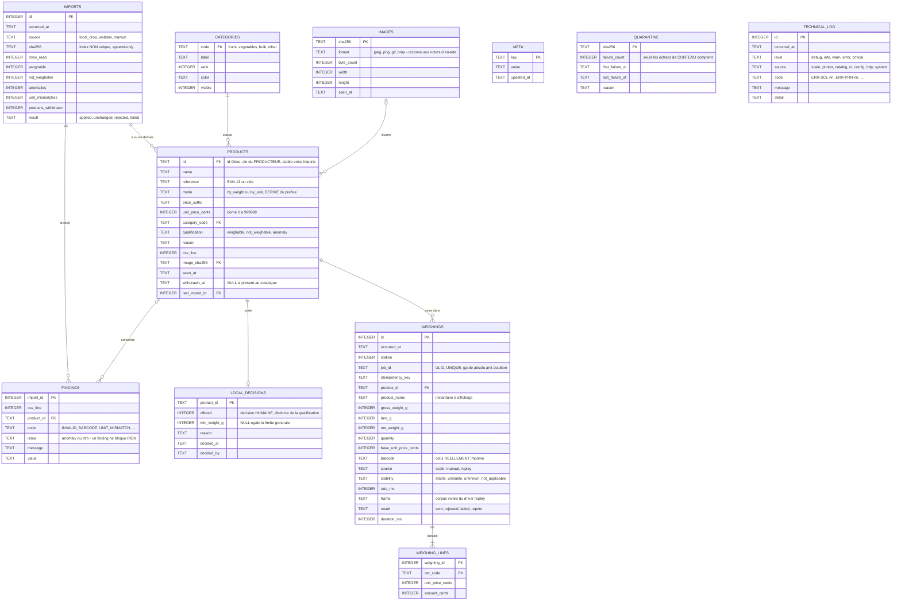

*`meta`, `quarantine` et `technical_log` n'ont volontairement aucune relation : ce sont respectivement un magasin clé-valeur, un état de bannissement indexé par sha et un journal roulant.*

```sql
CREATE TABLE meta (key TEXT PRIMARY KEY, value TEXT NOT NULL, updated_at TEXT NOT NULL) STRICT;

-- ------------------------------------------------------------------ CATALOG
CREATE TABLE imports (
    id INTEGER PRIMARY KEY AUTOINCREMENT,
    occurred_at TEXT NOT NULL, source TEXT NOT NULL,       -- local_drop|webdav|manual
    file_name TEXT NOT NULL, sha256 TEXT NOT NULL, byte_count INTEGER NOT NULL,
    rows_read INTEGER NOT NULL, unreadable_rows INTEGER NOT NULL,
    -- The three outcomes of the qualification (§10.3), counted separately
    -- because they are worded differently on screen. "hidden_products" is gone:
    -- it summed a prepackaged product and a wrong check digit, which means
    -- nothing.
    weighable INTEGER NOT NULL, not_weighable INTEGER NOT NULL,
    anomalies INTEGER NOT NULL, unit_mismatches INTEGER NOT NULL,
    images_decoded INTEGER NOT NULL, images_rejected INTEGER NOT NULL,
                                   -- 181 and 0 on the real file. Two counters, because
                                   -- "no image decoded" on a file that carried some is a
                                   -- symptom, whereas a catalog without images is a normal
                                   -- case (flv_1.csv).
    products_withdrawn INTEGER NOT NULL,                   -- seen at N−1, absent here (§10.9)
    result TEXT NOT NULL CHECK (result IN ('applied','unchanged','rejected','failed')),
    code TEXT NOT NULL DEFAULT '', reason TEXT NOT NULL DEFAULT '',
    duration_ms INTEGER NOT NULL
) STRICT;
-- APPEND-ONLY: NON unique index (important-2). The same content may be dropped
-- every night; that is a normal event, not an anomaly.
CREATE INDEX idx_imports_sha         ON imports(sha256);
CREATE INDEX idx_imports_occurred_at ON imports(occurred_at DESC);

CREATE TABLE quarantine (
    sha256 TEXT PRIMARY KEY, failure_count INTEGER NOT NULL DEFAULT 0,
    first_failure_at TEXT NOT NULL, last_failure_at TEXT NOT NULL,
    code TEXT NOT NULL DEFAULT '', reason TEXT NOT NULL DEFAULT ''
) STRICT;

CREATE TABLE categories (
    code TEXT PRIMARY KEY, label TEXT NOT NULL, rank INTEGER NOT NULL DEFAULT 0,
    color TEXT NOT NULL DEFAULT '', visible INTEGER NOT NULL DEFAULT 1 CHECK (visible IN (0,1))
) STRICT;

CREATE TABLE images (
    sha256 TEXT PRIMARY KEY, byte_count INTEGER NOT NULL,
    format TEXT NOT NULL CHECK (format IN ('jpeg','png','gif','bmp')),
                                   -- REAL format, recognized from the header bytes. The
                                   -- legacy application wrote <id>_image.jpg whatever the
                                   -- content: 10 of the 181 images of the real file are
                                   -- PNGs named .jpg (§10.7). The served extension derives
                                   -- from this column, never the other way round.
    width INTEGER NOT NULL, height INTEGER NOT NULL, seen_at TEXT NOT NULL
) STRICT;

CREATE TABLE products (
    id               TEXT    PRIMARY KEY,      -- Odoo id: the PRODUCER's key, unique and
                                   -- stable (355 out of 355 in the real file, ids from 20
                                   -- to 5209, NOT contiguous: never an index). It survives
                                   -- imports (§10.9).
    name             TEXT    NOT NULL,
                                   -- search_name REMOVED: derived value, computed when the
                                   -- JSON catalog is served. A single source of truth, the
                                   -- name.
    reference        TEXT    NOT NULL DEFAULT '' CHECK (length(reference) IN (0,13)),
                                   -- '' is a NORMAL case: 0 product out of 355 in flv.csv,
                                   -- 9 out of 153 in flv_1.csv (§10.3)
    mode             TEXT    NOT NULL CHECK (mode IN ('by_weight','by_unit')),
                                   -- and not 'P'/'U': those two letters existed only
                                   -- because Access stored them. The domain says
                                   -- ByWeight/ByUnit, and this value is DERIVED FROM THE
                                   -- barcode PREFIX, never from the CSV 'unite' column
                                   -- (§10.2): the till reads the prefix only — nobody ever
                                   -- read 'P'.
    price_suffix     TEXT    NOT NULL DEFAULT '',
                                   -- ' €/kg' | ' € le litre' | ' € l'unité'. That is ALL
                                   -- the CSV 'unite' column drives (kg 328, Unité(s) 18,
                                   -- Litre(s) 9 in flv.csv). A display, never a rule.
    unit_price_cents INTEGER NOT NULL CHECK (unit_price_cents BETWEEN 0 AND 999999),
                                   -- upper bound = MaxUnitPrice (§6.1): this is the 1st of
                                   -- the three enforcements that make the "no overflow"
                                   -- invariant trivially true
    category_code    TEXT    NOT NULL REFERENCES categories(code) ON DELETE RESTRICT,
    qualification    TEXT    NOT NULL CHECK (qualification IN ('weighable','not_weighable','anomaly')),
    reason           TEXT    NOT NULL DEFAULT '',  -- NO_BARCODE, PREPACKAGED_PRODUCT, …
    csv_line         INTEGER NOT NULL DEFAULT 0,   -- to name the row to fix
    image_sha256     TEXT    REFERENCES images(sha256) ON DELETE SET NULL,
    seen_at          TEXT    NOT NULL,             -- timestamp of the last import that saw it
    withdrawn_at     TEXT,                         -- NULL = present in the catalog (§10.9)
    last_import_id   INTEGER NOT NULL REFERENCES imports(id) ON DELETE RESTRICT
) STRICT;
CREATE INDEX idx_products_grid      ON products(qualification, category_code, name);
CREATE INDEX idx_products_reference ON products(reference);
-- subcategory REMOVED: the CSV has 7 columns and none carries a subcategory. No producer,
--   hence an empty column in every circumstance — and §14.3 was building a UI on top of it.
--   We had copied even the UNREALIZED intentions of the legacy application.
-- organic REMOVED: derived from a substring of the name — false on the 153 rows of
--   flv_1.csv, true on 83 of the 355 of flv.csv: a criterion that jumps from 0 % to 23 %
--   between two exports of the same shop. And without a single consumer here (§10.2).
-- visible REMOVED: it was a stored derived column. The grid reads
--   "qualification = 'weighable' AND withdrawn_at IS NULL" joined to local_decisions.
-- rank REMOVED: no path of this document wrote it, and it nevertheless appeared in 3rd
--   position of the grid index. Sorting is alphabetical.
-- anomalies (JSON) REMOVED: it duplicated the findings table below.
-- No index on the unaccented name: the search happens BROWSER-SIDE on the complete catalog
-- (~60 kB for 355 products, images excluded: they are served separately and addressed by
-- their sha). A LIKE '%AIL%' cannot use a B-tree index anyway. Should the catalog ever
-- exceed 5 000 rows: FTS5.

-- HUMAN decision, distinct from the computed qualification (§10.6). Ordinary foreign key:
-- the product no longer disappears from one import to the next (§10.9).
CREATE TABLE local_decisions (
    product_id   TEXT PRIMARY KEY REFERENCES products(id) ON DELETE CASCADE,
    offered      INTEGER NOT NULL DEFAULT 1 CHECK (offered IN (0,1)),
    -- Minimum weight exemption, PER PRODUCT (§10.6). NULL = limits.min_weight_g.
    -- Replaces limits.light_product_terms: no runtime rule depends any more on a substring
    -- of a name that Odoo may rename without notice.
    min_weight_g INTEGER CHECK (min_weight_g IS NULL OR min_weight_g > 0),
    reason TEXT NOT NULL DEFAULT '', decided_at TEXT NOT NULL, decided_by TEXT NOT NULL DEFAULT ''
) STRICT;

CREATE TABLE findings (
    import_id INTEGER NOT NULL REFERENCES imports(id) ON DELETE CASCADE,
    csv_line INTEGER NOT NULL, product_id TEXT,
    product_name TEXT NOT NULL DEFAULT '',     -- instantané d'affichage, comme
                                               -- weighings.product_name : le nom bouge dans
                                               -- Odoo, la ligne qui décrit un import ne
                                               -- bouge pas. Vide quand le fichier n'en donne
                                               -- pas — signalement sans produit, ou ligne
                                               -- trop abîmée pour porter un nom
    code TEXT NOT NULL,                        -- INVALID_BARCODE, UNIT_MISMATCH, …
    issue TEXT NOT NULL CHECK (issue IN ('anomaly','info')),
    message TEXT NOT NULL, value TEXT NOT NULL DEFAULT ''
) STRICT;
CREATE INDEX idx_findings_import ON findings(import_id, issue);
-- "blocking 0/1" became "issue": a finding BLOCKS nothing, it SAYS something. What decides
-- whether a product enters the grid is its qualification, and that is carried by the
-- product itself.

-- -------------------------------------------------------------------- JOURNAL
CREATE TABLE weighings (
    id INTEGER PRIMARY KEY AUTOINCREMENT,
    occurred_at TEXT NOT NULL, station INTEGER NOT NULL,
    job_id TEXT NOT NULL UNIQUE,               -- ULID — absolute duplicate guard
    idempotency_key TEXT NOT NULL DEFAULT '',
    product_id TEXT REFERENCES products(id) ON DELETE RESTRICT,  -- REAL foreign key (§10.9)
    product_name TEXT NOT NULL,                -- display snapshot: the name moves in Odoo,
                                               -- the journal row does not
    reference TEXT NOT NULL,
    mode TEXT NOT NULL CHECK (mode IN ('by_weight','by_unit')),
    gross_weight_g INTEGER NOT NULL DEFAULT 0,
    tare_g INTEGER NOT NULL DEFAULT 0,
    net_weight_g INTEGER NOT NULL DEFAULT 0,
    quantity INTEGER NOT NULL DEFAULT 0,
    base_unit_price_cents INTEGER NOT NULL DEFAULT 0,
    barcode TEXT NOT NULL DEFAULT '',          -- the one ACTUALLY printed
    source TEXT NOT NULL CHECK (source IN ('scale','manual','replay')),
    stability TEXT NOT NULL CHECK (stability IN ('stable','unstable','unknown','not_applicable')),
    rate_ms INTEGER NOT NULL DEFAULT 0,        -- median rate at the time of the weighing (A3)
    frame TEXT NOT NULL DEFAULT '',            -- living corpus for the replay driver
    result TEXT NOT NULL CHECK (result IN ('sent','rejected','failed','reprint')),
    detail TEXT NOT NULL DEFAULT '',
    duration_ms INTEGER NOT NULL DEFAULT 0
) STRICT;
CREATE INDEX idx_weighings_occurred_at ON weighings(occurred_at DESC);
CREATE INDEX idx_weighings_result      ON weighings(result, occurred_at DESC);
CREATE INDEX idx_weighings_product     ON weighings(product_id, occurred_at DESC);

CREATE TABLE weighing_lines (
    weighing_id INTEGER NOT NULL REFERENCES weighings(id) ON DELETE CASCADE,
    tier_code TEXT NOT NULL,
    unit_price_cents INTEGER NOT NULL, amount_cents INTEGER NOT NULL,
    PRIMARY KEY (weighing_id, tier_code)
) STRICT, WITHOUT ROWID;

-- ------------------------------------------------------------- TECHNICAL LOG
CREATE TABLE technical_log (
    id INTEGER PRIMARY KEY AUTOINCREMENT, occurred_at TEXT NOT NULL,
    level TEXT NOT NULL CHECK (level IN ('debug','info','warn','error','critical')),
    source TEXT NOT NULL CHECK (source IN ('scale','printer','catalog','ui','config','http','system')),
    code TEXT NOT NULL DEFAULT '', message TEXT NOT NULL, detail TEXT NOT NULL DEFAULT ''
) STRICT;
CREATE INDEX idx_technical_log_occurred_at ON technical_log(occurred_at DESC);
CREATE INDEX idx_technical_log_code        ON technical_log(code, occurred_at DESC);
```

> `result` de `weighings` ne contient plus `'ok'` : la distinction « imprimée » / « envoyée » est supprimée (important-7). Une pesée réussie est **`'sent'`**.

### 12.4 Purge et volumétrie

```sql
DELETE FROM weighings
 WHERE id <= (SELECT MAX(id) FROM weighings) - ?1
    OR occurred_at < ?2;
```

Appelée **une insertion sur 50**, index-friendly (contrairement à un `NOT IN (SELECT … LIMIT n)`). ~300 octets par ligne ⇒ **5 000 lignes ≈ 1,5 Mo**, base complète (catalogue + 2 journaux) **< 4 Mo**. `VACUUM` n'est jamais nécessaire ; il est exposé dans l'admin. **Aucune extrapolation annuelle n'est avancée** : les 20 662 lignes de `Stats` sont le cumul d'un seul poste sur une période inconnue.

### 12.5 Migrations

```go
//go:embed migrations/*.sql
var migrations embed.FS

func (d *DB) migrate() error {
    var v int
    if err := d.writer.QueryRow("PRAGMA user_version").Scan(&v); err != nil { return err }
    files, _ := fs.Glob(migrations, "migrations/*.sql")
    sort.Strings(files)

    if v > len(files) {
        return fmt.Errorf("ERR-DB-02 : base créée par une version plus récente "+
            "(schéma %d, ce binaire connaît %d). Mettez l'application à jour.", v, len(files))
    }
    if v < len(files) && v > 0 {
        // Backup BEFORE any migration. VACUUM INTO refuses to overwrite an
        // existing file: we timestamp it and clean up the older copies.
        // ★ défaut 7: the timestamp comes from the INJECTED CLOCK (d.clock,
        // received by store.Open), never from time.Now — that is the promise of
        // §5.3, and it is what makes the migration test reproducible down to the
        // file name.
        dst := fmt.Sprintf("%s.before-v%d-%s", d.path, len(files),
            d.clock.Now().UTC().Format("20060102T150405"))
        if _, err := d.writer.Exec(`VACUUM INTO ?`, dst); err != nil {
            return fmt.Errorf("sauvegarde préalable impossible : %w", err)
        }
        d.keepLastBackups(3)
    }
    for i := v; i < len(files); i++ {
        script, _ := migrations.ReadFile(files[i])
        tx, err := d.writer.Begin()
        if err != nil { return err }
        if _, err := tx.Exec(string(script)); err != nil {
            tx.Rollback()
            return fmt.Errorf("migration %s : %w", files[i], err)
        }
        if _, err := tx.Exec(fmt.Sprintf("PRAGMA user_version = %d", i+1)); err != nil {
            tx.Rollback(); return err
        }
        if err := tx.Commit(); err != nil { return err }
    }
    return nil
}
```

Règles absolues :
- **une transaction par fichier**, aucun PRAGMA dans un fichier de migration ;
- **aucune migration ne supprime ni ne modifie une ligne de `weighings`** : le journal est la seule donnée non reconstructible du poste (le catalogue vient du CSV, la configuration est exportée) ;
- sens unique, pas de migration descendante : un retour arrière de version restaure la copie `.before-vN-<timestamp>` ;
- `PRAGMA integrity_check` **une fois par semaine** (marqueur dans `meta`) et à la demande ; < 300 ms sur 25 000 lignes ;
- **aucune migration depuis l'ancienne application** (contrainte 6) : catalogue reconstruit par le premier CSV, journal à zéro.

**L'échange de catalogue est UNE transaction** : soit l'ancien catalogue reste intact, soit le nouveau est complet. Il n'existe pas d'état intermédiaire visible. Les images sont écrites **avant** la transaction (adressées par sha, donc idempotentes).

---

## 13. Temps réel et concurrence

### 13.1 Inventaire exhaustif des goroutines

| # | Goroutine | Propriétaire | Fin | Nombre |
|---|---|---|---|---|
| 1 | Lecture balance | driver (`serial.Loop`) | `ctx.Done()` puis `Close()`, ferme `done` | 1 |
| 2 | **Hub** | `station.Hub.run` | `ctx.Done()` | 1 |
| 3 | Worker impression | `station.printing` | fermeture du canal | 1 |
| 4 | Worker journal | `station.journal` | fermeture du canal | 1 |
| 5 | Veille catalogue | `catalog.Watch` | `ctx.Done()` | 1 |
| 6 | Superviseur | `station.supervisor` | `ctx.Done()` | 1 |
| 7 | Serveur HTTP | `net/http` | `Shutdown` | 1 + 1 par connexion |
| 8 | Flux SSE | `web.stream` | `r.Context().Done()` ou canal fermé | 1 par abonné (≤ 8) |

**6 goroutines applicatives fixes.** Le ticker de 100 ms n'est **pas** une goroutine (c'est un timer du runtime consommé dans le `select`). Le test de non-régression compare `runtime.NumGoroutine()` **au repos, sans client connecté**, avant et après 10 000 pesées simulées : un chiffre absolu serait instable dès le premier client.

**Deux goroutines TRANSITOIRES complètent l'inventaire**, nommées et bornées, jamais en vol au repos : celle de `ports.WithBudget` (§5.3), qui meurt avec le contexte ou l'échéance qu'elle porte, et celle qui exécute `Scale.Close()` pendant un rechargement de configuration (§11.4), au plus une par rechargement. **Aucun handler HTTP n'attend jamais sans échéance** : la goroutine d'une commande sort sur son accusé — garanti par le filet de fin de cycle du Hub (§13.2) — ou sur `r.Context().Done()`.

### 13.2 La boucle du Hub — horloge unique (bloquant-1)

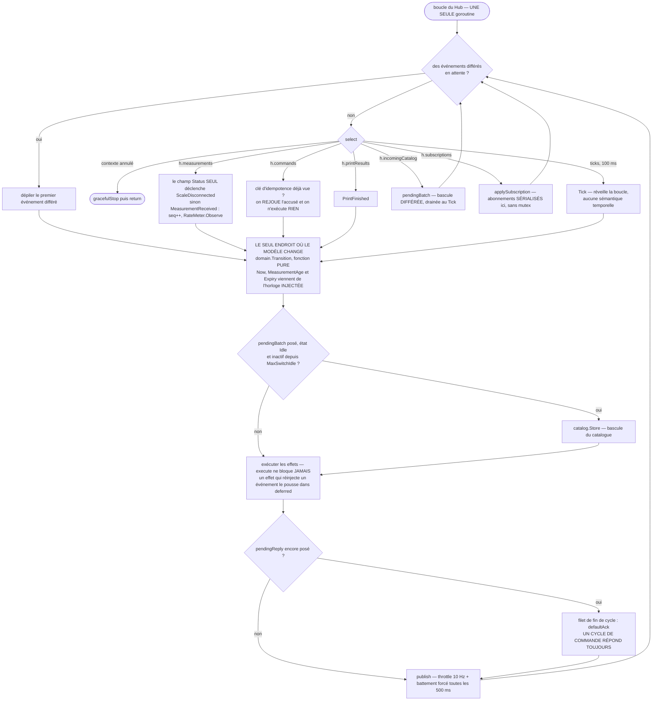

```go
// internal/station/loop.go
func (h *Hub) run(ctx context.Context) {
    defer close(h.done)

    // ★ bloquant-1: the ticker comes from the INJECTED CLOCK, not from
    // time.NewTicker. With the fake clock, clk.Advance(2*time.Second) REALLY
    // produces 20 ticks: every time-dependent test (stability, expiry, UI
    // timeouts, reprint window, return to idle) runs in microseconds instead of
    // testing nothing.
    // Ticker returns a CHANNEL and a stop function (§5.3) — not a *time.Ticker:
    // we therefore read `<-ticks`, and never `ticker.C`. (défauts 18 et 28.)
    ticks, stopTicker := h.clock.Ticker(100 * time.Millisecond)
    defer stopTicker()

    var deferred []domain.Event // events re-injected by an effect

    for {
        var ev domain.Event

        if len(deferred) > 0 {
            ev, deferred = deferred[0], deferred[1:]
        } else {
            select {
            case <-ctx.Done():
                h.gracefulStop()
                return

            // ★ bloquant-2: h.measurements belongs to the Hub for the lifetime
            // of the process. The driver NEVER closes it; it emits one last
            // ScaleEvent{StatusDisconnected} then closes its own `done` channel.
            // There is therefore no `!ok` branch left, no `measurements = nil`,
            // and serial → manual → serial works.
            case e := <-h.measurements:
                switch {
                // ★ défaut 40: the trigger is the Status ALONE. The last event
                // emitted by Loop on its way out does carry a non-nil Err
                // (§9.1), but the Err CONDITIONS nothing: it is only a logged
                // reason. Making the loss of the scale depend on an optional
                // field lets the signal fall into `default: continue` and never
                // reach the machine. ScaleDisconnected is idempotent: received
                // while the state is already ScaleLost, Transition produces no
                // effect — the repeated StatusDisconnected of the backoff
                // therefore cost nothing.
                case e.Status == domain.StatusDisconnected:
                    ev = domain.ScaleDisconnected{Err: e.Err}
                case e.Status == domain.StatusConnected && h.model.State == domain.ScaleLost:
                    ev = domain.ScaleReconnected{}
                case e.Measurement != nil:
                    h.seq++
                    m := *e.Measurement
                    m.Seq = h.seq
                    h.lastMeasurement = m
                    h.rate.Observe(m) // ★ A3: real observed rate
                    ev = domain.MeasurementReceived{M: m}
                default:
                    continue
                }

            case c := <-h.commands:
                if c.Key != "" {
                    if ack, seen := h.idempotency.Lookup(c.Key); seen {
                        reply(c.Reply, ack) // replays the ack, EXECUTES NOTHING
                        continue
                    }
                }
                h.pendingReply = c.Reply
                ev = c.Ev

            case r := <-h.printResults:
                ev = domain.PrintFinished{JobID: r.JobID, Err: r.Err, Duration: r.Duration}

            case batch := <-h.incomingCatalog:
                h.pendingBatch = batch // ★ 10.8: DEFERRED swap, drained on Tick
                continue

            case d := <-h.subscriptions:
                // ★ défaut 61: subscribing, unsubscribing and closing subscriber
                // channels are SERIALIZED here, in the only goroutine allowed to
                // touch h.subscribers. That is what makes invariant 1 true of
                // the map itself, and not of the easy fields alone.
                h.applySubscription(d)
                continue

            case <-ticks:
                ev = domain.Tick{}
            }
        }

        // ---- THE ONLY PLACE WHERE THE MODEL CHANGES ---------------------
        now := h.clock.Now()
        tc := domain.TransitionContext{
            Cfg:             *h.cfg.Load(),
            Now:             now,
            LastMeasurement: h.lastMeasurement,
            // ★ bloquant-1: the age is COMPUTED, never accumulated. A lost tick
            // (import of a full catalog, VACUUM INTO, weekly integrity_check)
            // can no longer UNDER-COUNT the age and let an expired weight
            // through. The Tick no longer carries any temporal semantics: it
            // only wakes the loop up.
            MeasurementAge: now.Sub(h.lastMeasurement.Timestamp),
            Expiry:         h.rate.Expiry(h.cfg.Load().Stability, h.nominalRate),
            Catalog:        h.catalog.Load(),
        }
        next, effects := domain.Transition(h.model, ev, tc)
        h.model = next

        // Deferred catalog swap (10.8). MaxSwitchIdle is a CODE CONSTANT, never a
        // configuration key: setting it to 0 would reopen the failure mode where
        // an import reorders the tiles under a customer's finger (§11.2).
        if h.pendingBatch != nil && h.model.State == domain.Idle &&
            now.Sub(h.lastInteraction) >= domain.MaxSwitchIdle {
            h.catalog.Store(h.pendingBatch.Catalog)
            h.pendingBatch = nil
        }

        for _, ef := range effects {
            // ★ execute NEVER blocks and NEVER calls Transition: an effect that
            // must re-inject an event pushes it onto `deferred`, drained on the
            // next turn. Without that, an inject() called from execute() inside
            // the Hub goroutine is an immediate deadlock.
            if e := h.execute(ef); e != nil {
                deferred = append(deferred, e)
            }
        }

        // ★ défaut 62: A COMMAND CYCLE ALWAYS REPLIES. The hard rule is that
        // every terminal transition emits an AckEffect; this block is the safety
        // net that makes it true by construction rather than by discipline.
        // Rejection, blocking safeguard, hidden product, event ignored by the
        // current state: without it, h.pendingReply stays set, the HTTP handler
        // waits without a deadline, and the next command OVERWRITES the channel
        // having never answered on it — one goroutine leaks per rejected
        // command, in the very component whose inventory §13.1 claims to be
        // exhaustive.
        if h.pendingReply != nil {
            reply(h.pendingReply, defaultAck(h.model, ev))
            h.pendingReply = nil
        }

        h.publish(now)
    }
}

// reply NEVER BLOCKS: the ack channel has a capacity of 1 and is written only
// once, but the `default` covers the case where the HTTP client gave up before
// the answer (browser closed, request context cancelled). A nil channel is also
// tolerated: a command can be injected without a caller.
func reply(ch chan<- domain.Ack, a domain.Ack) {
    if ch == nil {
        return
    }
    select {
    case ch <- a:
    default: // caller gone — we do not hold the Hub goroutine back for it
    }
}

// defaultAck derives, from the resulting model, the ack that no effect produced:
// state reached, possible rejection and its code, never a JobID. It is distinct
// from an acceptance ack, and the admin screen renders it as such.
func defaultAck(m domain.Model, ev domain.Event) domain.Ack
```

**Le contrat symétrique côté HTTP** : le handler attend sur ce canal de capacité 1 **et** sur `r.Context().Done()`, jamais sur le seul canal. Les deux moitiés sont nécessaires — le Hub ne retient personne, et personne ne retient une goroutine HTTP si le Hub s'arrête. Test nommé : **`TestNoLeakOnCommandWithoutAck`** — 500 commandes refusées (produit masqué, garde bloquante, prix nul, poids périmé) alternées avec 500 commandes nominales, puis `runtime.NumGoroutine()` comparé à la ligne de base **au repos, sans client connecté** (même méthode qu'en §13.1) : écart nul.

**Trois invariants, vérifiés par `-race` et par revue :**

1. **Tout l'état du Hub est mono-écrivain, et l'inventaire est complet.** L'ancienne rédaction de cet invariant ne citait que les champs déjà mono-écrivains et laissait hors de son périmètre l'état réellement partagé — l'invariant était donc vrai de ce qu'il listait et muet sur ce qui comptait (défaut 61). Inventaire exhaustif :

   | État | Écrit par | Lu par | Protection |
   |---|---|---|---|
   | `h.model`, `h.seq`, `h.lastMeasurement`, `h.rate`, `h.pendingBatch`, `h.lastInteraction`, `h.idempotency`, `h.message`, `h.sound`, `h.pendingReply`, `h.lastPublished`, `h.lastPublishedAt`, `h.publishPending` | boucle du Hub | boucle du Hub | **aucune** — un seul écrivain par construction |
   | `h.subscribers` (≤ 8 canaux) | boucle du Hub **uniquement** | boucle du Hub (`publish`) | **aucune** — `Subscribe`, le désabonnement et `CloseSubscribers` postent sur `h.subscriptions`, servi par le même `select` que `h.commands` ; **aucun appelant externe ne touche la map ni ne ferme un canal** (§13.3) |
   | `h.ring` (500 derniers événements en RAM) | `execute` (boucle du Hub) | handlers d'administration | `sync.RWMutex` **dans** l'anneau ; `Entries()` rend une **copie** |
   | `h.state` (dernier snapshot) | `publish` | handlers HTTP, via `Hub.State()` (premier envoi de `/api/v1/stream`, `/admin/api/health`) | `atomic.Pointer[Snapshot]`, snapshot **immuable** |
   | `h.cfg` | `Reload` (§11.4) | boucle du Hub, handlers | `atomic.Pointer[Config]` |
   | `h.counters` | partout | admin, `doctor` | `atomic.Int64` |
   | `h.catalog` | boucle du Hub | boucle du Hub, handlers | `atomic.Pointer[Catalog]`, catalogue **immuable** |

   La règle qui rend le tableau tenable : **rien de mutable n'est publié**. Un snapshot, un catalogue et un accusé sont construits puis figés ; seul le pointeur circule.
2. `Transition` est pure : on peut la rejouer hors ligne depuis le journal.
3. `h.execute` ne bloque jamais et n'appelle jamais `Transition`.

```go
func (h *Hub) execute(ef domain.Effect) domain.Event {
    switch e := ef.(type) {
    case domain.PrintEffect:
        select {
        case h.printJobs <- job{Label: e.Label, JobID: e.Label.JobID}:
        default:
            // ABNORMAL: the machine forbids two prints within one cycle.
            h.logTechnical("error", "printer", "ERR-PRN-09", "worker d'impression saturé", "")
            return domain.PrintFinished{JobID: e.Label.JobID, Err: printing.ErrBusy}
        }
    case domain.RecordEffect:
        select {
        case h.journalEntries <- e.Weighing:
        default:
            // Slow or full disk: the weighing is LOST FOR THE JOURNAL, but the
            // label came out and the customer is served.
            // WE DEGRADE THE JOURNAL, NEVER THE SERVICE.
            h.counters.UnloggedWeighings.Add(1)
            h.ring.Add(e.Weighing) // safety net: last 500 in RAM
        }
    case domain.AckEffect:
        h.idempotency.Store(e.Key, e.Ack)
        reply(h.pendingReply, e.Ack)
        h.pendingReply = nil
    case domain.MessageEffect:
        h.message = &Message{Level: e.Level, Code: e.Code, Text: e.Text,
            ExpiresAt: h.clock.Now().Add(e.Duration)}
    case domain.SoundEffect:
        h.sound = e.Name // the browser plays the sound; the backend does no audio I/O
    case domain.TechnicalLogEffect:
        h.logTechnical(e.Level, e.Source, e.Code, e.Message, e.Detail)
    }
    return nil
}
```

### 13.3 Diffusion vers l'écran

```go
// publish: 10 Hz throttle + forced heartbeat every 500 ms.
// ★ bloquant-1: `now` is passed as a parameter — the SAME clock as the ticker.
// And publishPending is CONSUMED (it was consumed nowhere): without that, on a
// fake clock the Hub published a single snapshot then fell silent for good.
func (h *Hub) publish(now time.Time) {
    s := h.buildSnapshot()
    changed := s.Revision != h.lastPublished.Revision
    since := now.Sub(h.lastPublishedAt)

    if !changed && !h.publishPending && since < 500*time.Millisecond {
        return
    }
    if changed && since < 100*time.Millisecond {
        h.publishPending = true // will be emitted on the next Tick
        return
    }
    h.publishPending = false
    h.lastPublished, h.lastPublishedAt = s, now
    h.state.Store(s)
    for ch := range h.subscribers {
        select {
        case ch <- s:
        default:
            select { case <-ch: default: }   // capacity-1 channel: drop the stale one
            select { case ch <- s: default: }
        }
    }
}
```

**Un abonné lent ne peut jamais bloquer la lecture de la balance** : canal de capacité 1, vidé puis réécrit. Un snapshot vieux de 400 ms n'a aucune valeur. Débit réel : 2 à 10 messages/s × ~320 octets = **au pire 3,2 ko/s**.

**À qui appartient `h.subscribers` — et qui ferme ces canaux (défaut 61).** `publish` parcourt la map dans la goroutine du Hub pendant que des goroutines HTTP s'abonnent et se désabonnent : c'est une course, et fermer ces canaux depuis une troisième goroutine pendant que `publish` émet dessus, c'est un « send on closed channel ». Les deux sont réglés par une seule règle de propriété.

```go
// Subscribe returns the snapshot channel of a new subscriber and the function
// that unsubscribes it.
//
// h.subscribers is a field of the Hub JUST LIKE h.model: it is read and written
// only in the loop goroutine. Subscribe() and the unsubscribe function it
// returns do NOT touch it — they post a request on h.subscriptions (dedicated
// channel, capacity 16, served by the same `select` as h.commands) and wait for
// the ack, or give up if h.done is already closed. No mutex, no exception to
// invariant 1.
func (h *Hub) Subscribe() (<-chan Snapshot, func())

// CloseSubscribers closes every subscriber channel and empties the map. Two
// properties, both of them necessary:
//
//  1. IDEMPOTENT — the body is guarded by a sync.Once. It has TWO legitimate
//     call sites (Stop() and srv.RegisterOnShutdown, §13.4) and the old code ran
//     both of them: double close(), panic on every shutdown with a browser
//     connected. We keep both sites (the second is the safety net if the
//     shutdown goes through Shutdown without going through Stop); the Once turns
//     the later one into a no-op.
//  2. ORDERED — it is called only AFTER <-h.Done(), that is, after the loop has
//     returned. No publish() can then still emit on a closed channel.
//     gracefulStop(), which runs in the Hub goroutine just before
//     close(h.done), goes through the SAME sync.Once: depending on the shutdown
//     path, either it or the external caller closes, never both.
func (h *Hub) CloseSubscribers()
```

```go
// internal/web/stream.go
func (s *Server) stream(w http.ResponseWriter, r *http.Request) {
    w.Header().Set("Content-Type", "text/event-stream")
    w.Header().Set("Cache-Control", "no-store")
    w.Header().Set("X-Accel-Buffering", "no")
    rc := http.NewResponseController(w) // Go 1.20+

    snaps, unsubscribe := s.hub.Subscribe()
    defer unsubscribe()

    // ★ défaut 7: the heartbeat comes from the INJECTED CLOCK, not from
    // time.NewTicker. Without it a Playwright test or an endurance test on a
    // fake clock would have to wait 15 s of wall time to observe a ping, and
    // §5.3 would be false for internal/web.
    heartbeat, stopHeartbeat := s.clock.Ticker(15 * time.Second)
    defer stopHeartbeat()

    // First send: the complete state, so that a browser that has just restarted
    // is immediately correct without an extra request.
    if err := writeEvent(w, rc, s.dto(s.hub.State())); err != nil { return }

    for {
        select {
        case <-r.Context().Done():
            return
        case snap, ok := <-snaps:
            if !ok {
                return // ★ important-4: CloseSubscribers() makes this handler exit
            }
            // Write deadline: without it, a zombie client that stops draining
            // blocks this goroutine and leaks a connection indefinitely.
            _ = rc.SetWriteDeadline(time.Now().Add(5 * time.Second))
            if err := writeEvent(w, rc, s.dto(snap)); err != nil { return }
        case <-heartbeat:
            // These two SetWriteDeadline calls are the ONLY ones in the whole
            // repository still on the real clock: an I/O deadline set in the TCP
            // stack of the OS kernel, which no fake clock can drive and which
            // carries no business decision. That, and only that, is why they
            // appear in the `make boundary` allow-list (exception 1 of §5.3).
            _ = rc.SetWriteDeadline(time.Now().Add(5 * time.Second))
            if _, err := io.WriteString(w, ": ping\n\n"); err != nil { return }
            _ = rc.Flush()
        }
    }
}
```

**SSE, pas WebSocket** : le flux est unidirectionnel serveur → client, les commandes sont des `POST` ; `EventSource` **se reconnecte tout seul** (0 ligne de JS, contre ~80 avec backoff pour un WebSocket) ; c'est dans la bibliothèque standard ; et `curl -N http://127.0.0.1:8085/api/v1/stream` est lisible à l'œil pour le débogage. Sur `127.0.0.1`, un aller-retour `POST` coûte 1 à 3 ms — invisible sur un écran tactile ; la reconnexion gratuite, non.

### 13.4 Arrêt propre — corrigé (important-4)

> **Ce qui était faux** : « `http.Server.Shutdown` refuse les nouvelles requêtes, les SSE voient `ctx.Done` et sortent ». `Shutdown` ferme les connexions **inactives** et attend que les actives le deviennent ; il ne les interrompt pas. Un flux SSE est actif en permanence. Et `r.Context()` dérive de `Server.BaseContext`, qui vaut `context.Background()` par défaut : annuler le contexte racine ne l'annule pas. Résultat : `Shutdown` consommait **systématiquement les 10 s de timeout**, à chaque arrêt, dès qu'un navigateur était connecté — c'est-à-dire toujours. Budget réel 20 s contre `TimeoutStopSec=20` : systemd envoyait un `SIGKILL` au moment même où l'arrêt s'achevait, et `update.ps1` échouait par intermittence sur un poste parfaitement sain.

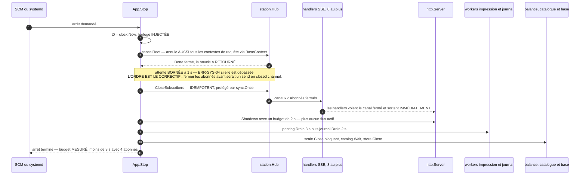

```go
// Stop shuts the station down in the only safe order: cancel the root context,
// wait for the Hub loop to return, then close the subscriber channels.
func (a *App) Stop() {
    t0 := a.clock.Now()        // ★ défaut 7: injected clock, not time.Now
    a.log.Info("arrêt demandé")

    a.cancelRoot()             // t=0 — cancels EVERY in-flight r.Context() (since
                               //        srv.BaseContext derives them from it) AND
                               //        the Hub loop context

    // ★ défaut 61 — THE ORDER IS THE FIX. We first wait for the Hub loop to
    // RETURN, and only then close the subscriber channels. Closing them before
    // means closing while publish() is emitting on them: "send on closed
    // channel". The loop exits through ctx.Done() within a few µs — it never
    // blocks (invariant 3) — but the wait stays bounded: a shutdown does not
    // hang on an invariant.
    select {
    case <-a.hub.Done():
    case <-a.clock.After(1 * time.Second):
        a.log.Warn("ERR-SYS-04 : boucle du Hub non terminée en 1 s, arrêt poursuivi")
    }
    a.hub.CloseSubscribers()   // IDEMPOTENT (sync.Once, §13.3): the SSE handlers
                               //        see `!ok` and exit IMMEDIATELY. The
                               //        RegisterOnShutdown below will call the
                               //        same function: it will be a no-op.

    // ★ défaut 7: budget measured by the injected clock (§5.3), not by
    // context.WithTimeout, which reads the real clock.
    ctx, cancel := ports.WithBudget(context.Background(), a.clock, 2*time.Second)
    defer cancel()             // never dropped: go vet lostcancel
    _ = a.http.Shutdown(ctx)   // t+0…0.1 s in practice: no active stream left

    a.printing.Drain(8 * time.Second) // let the in-flight job finish
    a.journal.Drain(2 * time.Second)
    _ = a.scale.Close()        // BLOCKING: RTS/DTR low, close(fd)
    a.catalog.Wait()           // rollback if an import transaction is running
    a.store.Close()            // PRAGMA wal_checkpoint(TRUNCATE); PRAGMA optimize
    a.log.Info("arrêt terminé", "duration", a.clock.Now().Sub(t0))
}
```

Câblage nécessaire, à ne pas oublier :

```go
srv := &http.Server{
    Handler:     routes,
    BaseContext: func(net.Listener) context.Context { return rootCtx },
}
// Second call site, kept ON PURPOSE: it covers a Shutdown triggered without
// going through Stop(). It is safe because CloseSubscribers is idempotent
// (sync.Once, §13.3) — that was the panic of défaut 61.
srv.RegisterOnShutdown(func() { hub.CloseSubscribers() })
```

**Budget d'arrêt mesuré : < 3 s avec 4 abonnés SSE connectés** — c'est une **assertion du test d'endurance**, pas une intention. `TimeoutStopSec` passe à **45 s** (≥ 1,5 × la somme des budgets internes) et le `sc failure` Windows est aligné.

Deux tests nommés gardent cette section : **`TestStopWithFourSubscribersDoesNotPanic`** — 4 flux SSE ouverts, `Stop()` appelé deux fois de suite, `Shutdown` déclenché en parallèle ; aucun `close of closed channel`, aucun `send on closed channel`, `-race` vert — et **`TestStopDoesNotWaitOnRealClock`**, qui rejoue le même arrêt sur horloge factice et exige une durée murale inférieure à 50 ms.

**`ListenAndServe` n'est jamais lancé avec son erreur jetée** :

```go
ln, err := net.Listen("tcp", cfg.Network.Listen)
if err != nil {
    // The single-instance lock IS the socket: no orphan lock file after a crash,
    // no Windows named mutex. But we tell the two cases apart, otherwise we send
    // a volunteer hunting for a ghost process.
    if isPortInUse(err) && respondsToProbe(cfg.Network.Listen) {
        fatal("ERR-SYS-01 : une autre instance de Balance est déjà lancée sur ce poste.")
    }
    fatal("ERR-SYS-02 : impossible d'écouter sur %s : %v", cfg.Network.Listen, err)
}
go func() {
    if err := srv.Serve(ln); err != nil && !errors.Is(err, http.ErrServerClosed) {
        a.fatal("ERR-SYS-03", err)
    }
}()
```

`fatal` écrit dans le journal texte, dans le journal technique **et** sur `stderr`, et retourne le code de sortie 3. **Un poste ne peut pas « tourner normalement en étant mort ».**

---

## 14. L'interface

### 14.1 Technologie et budget

| Choix | Valeur | Justification |
|---|---|---|
| Framework | **Svelte 5 (runes) + TypeScript**, compilé par Vite | compile vers du JS impératif sans VDOM ; un composant se relit en 3 ans |
| CSS | écrit à la main, variables CSS | pas de framework à mettre à jour pour 12 composants |
| Polices | **Inter** (variable, WOFF2 sous-ensemblé latin, ~28 ko) embarquée | zéro requête externe : le poste est hors ligne |
| Bundles | **2 entrées séparées** : `index.html`, `admin.html` | l'admin ne pèse pas dans le budget de l'écran client et n'est ni téléchargée ni évaluée tant que personne ne l'ouvre — **la séparation porte sur le poids et le chargement, pas sur le contexte d'exécution** (voir la note ci-dessous) |
| Budget client | **< 110 ko gzip**, premier rendu < 400 ms sur un i3 de 2015 | mesuré en CI |
| Versions | **exactes dans `package.json`** (aucun `^`), `package-lock.json` et `internal/web/dist` **commités** | `go build` doit fonctionner sur une machine sans Node ; dans 3 ans, un mainteneur qui corrige une règle métier n'installe pas de chaîne JS |

> **Ce que les deux bundles isolent, et ce qu'ils n'isolent pas.** §14.3 charge le bundle admin **paresseusement dans la même fenêtre** sur appui long. Une fois chargé, il partage donc le **même contexte JS** que l'écran client : même `window`, même `window.onerror`, même processus de rendu, même tas. **Il serait faux d'écrire que l'admin ne peut pas casser l'écran client** — une exception non rattrapée dans l'admin déclenche la même surcouche `ERR-UI-01` et le même rechargement automatique à 5 s (§14.3). Ce que la séparation garantit réellement, et qui est mesuré en CI : (a) **le poids** — le budget « < 110 ko gzip » de l'écran client ne contient aucun octet d'admin ; (b) **le chargement** — sur un poste qui n'ouvre jamais l'admin (le cas nominal, toute la journée), le code d'admin n'est ni téléchargé, ni analysé, ni exécuté, donc il ne peut ni ralentir le premier rendu ni provoquer d'erreur. Un isolement réel du contexte d'exécution demanderait un `iframe` ou une fenêtre séparée ; **ce n'est pas retenu** : le kiosque est mono-fenêtre, `Alt+F4` et la gestion de fenêtres n'y sont pas disponibles, et la garantie qui compte vraiment — un poids périmé ne peut pas être imprimé — est tenue **côté Go**, pas côté navigateur (§13.2).

### 14.2 Direction visuelle

Échelle typographique (base 16 px sur 1920 × 1080, écran 24″, distance 60–80 cm) : poids **96 px / 700 / tabulaire** (lisible à 2,5 m) · prix principal 64 px · **nom de produit sur tuile 34 px / 700 au nominal, dans un bloc de hauteur fixe, sans troncature** ← *l'élément principal de la tuile* · prix sur tuile 24 px · filtre actif 28 px · consigne 28 px · mention légale 18 px.

> **Ce qui est tenu constant est le BLOC, pas le nombre de lignes** (ADR-030). Le nom est ajusté dans un bloc de **90 px** : deux lignes au corps nominal, quatre au plancher, ce dont le nom de 69 caractères a besoin. Les 331 tuiles du fichier de référence font donc **231 × 180 px exactement**, mesurées dans le navigateur, quelles que soient la longueur du nom, la présence d'une photo et sa forme. Fixer « au plus trois lignes » ne pouvait pas donner ça : trois lignes de 34 px et trois lignes au plancher sont deux tuiles différentes.

> **Le plus petit corps de l'échelle ne vaut plus 18 px sur une tuile : le plancher est à 16 px** (ADR-057, 01/08/2026). Ce n'est pas un assouplissement esthétique, c'est ce qui rend vraie la borne haute du réglage de colonnes : depuis que ce plancher borne **aussi** les deux corps du bloc des prix, il décide si un prix tient dans sa tuile. À 18 px, 12 colonnes sur un 15″ en double tarif coupent **38 prix** de 8,7 px et donnent au kiosque une **barre de défilement horizontale**, ce qu'un poste en kiosque ne doit pas avoir. Il descend en outre pour le rythme de l'écran aux densités qu'un magasin choisit réellement : à 8 colonnes sur 1920, double tarif, prix affichés, 18 px met **53 noms** au plancher et fait grandir **6 rangées**, contre **1 et 1** à 16 px. Ce qu'il ne fait pas, c'est descendre pour la cible du magasin — à 7 colonnes sur 1920, 18 px n'y met qu'**un seul nom sur 331**, et l'argument contraire, écrit un temps dans la conception, est **faux**. Le plancher n'est pas réglable : aucun écran ne l'atteint. *(Un fait qui ne doit rien à ce chantier : sur un 15″ en mode automatique, sans qu'aucun réglage existe, **3 noms atteignaient déjà le plancher de 18 px**.)*
>
> **Le plancher est une limite de lisibilité, le plafond une proportion — et c'est pourquoi un seul des deux suit la tuile.** `NAME_SIZE_MAX_PX` (34 px) est mis à l'échelle avec la tuile : sans cela, aller vers l'aéré offrirait une plus belle photo et **exactement le même texte**, alors que la lisibilité est précisément ce qu'on achète en y allant. Le plancher, lui, ne bouge pas. Le plafond mis à l'échelle est **borné par le bas par le plancher** : il tombe à **17,6 px** dès 10 colonnes sur 1920, et sans cette borne l'ajustement partirait d'un plafond inférieur à son propre plancher — la boucle ne s'exécuterait pas, **tous** les noms sortiraient au plancher, et rien ne le dirait.

> **La hiérarchie de la tuile est inversée par rapport à la première version, et c'est la donnée réelle qui l'impose.** Le nom y était un sous-titre de 26 px **sous une image**, parce que l'ancienne application posait 120 contrôles `Image0…Image119` porteurs de l'événement et dimensionnait l'image d'abord (`Systeme_Dimensions.LargeurImage`, `HauteurImage`, puis `HauteurLabel`). Or les fichiers authentiques disent le contraire, et la mesure de 2026 le dit **plus fort** que celle de 2022 : `flv_1.csv` n'a aucune image (0 sur 153), et `flv.csv`, qui en a enfin, n'en a que pour **181 produits sur 355 — 49 % du catalogue n'a pas de photo** (§10.2, §10.7). Le déséquilibre est de surcroît très inégal selon la catégorie : `F` est illustrée à 69 %, `A` à 32 %. **Une tuile sans photo n'est donc pas un cas dégradé qu'on soigne à la marge : c'est un produit sur deux, et deux tuiles voisines de la même grille seront l'une illustrée et l'autre non.** Ce qu'on a **certainement**, ce sont des noms — 8 à 69 caractères, 27 en moyenne — et des prix. **Le corpus de rendu de référence reste donc un catalogue SANS image**, et c'est le nom qui est dimensionné en premier : 34 px / 700 doit tenir « ♥AA-LA TOMME DES CROQUANTS AFFINE A LA LIQUEUR DE NOIX DU PERIGORD-MV » (**69 caractères**, le plus long de `flv.csv`) dans une tuile de 230 px sans points de suspension — deux lignes n'y suffisent plus, et le corps se réduit par pas d'un demi-pixel jusqu'à ce que le nom tienne dans son bloc, exactement comme sur l'étiquette (§7.3). La photo, quand elle existe, occupe une **plaque carrée de 56 px en tête de tuile**, avec le prix aligné à droite sur la même bande ; quand elle manque, **rien ne bouge et il n'y a ni trou ni cadre gris** — la même plaque porte l'initiale sur la couleur de catégorie. La bande pleine largeur de la première version laissait les deux tiers de sa surface vides sur chacune des 331 tuiles ; la plaque carrée récupère la hauteur d'une **quatrième rangée visible**.

`font-variant-numeric: tabular-nums` sur **tous** les chiffres : sans cela le poids « saute » latéralement à chaque décimale, défaut visuel le plus fatigant d'un afficheur temps réel. **Une exception, et elle est mesurable** : le **nom** d'une tuile revient à `normal`. Sur Inter, `tabular-nums` élargit bien plus que les chiffres — le trait d'union et le signe pour-cent aussi —, si bien que « Arc-en-Ciel » se compose **6 % plus large** que ce qu'un `canvas` mesure. Six pour cent, c'est une ligne entière dans un bloc dimensionné pour deux : le nom doit être dessiné avec la variante qui le mesure. Les chiffres qu'un client lit sur une tuile sont dans le prix, qui garde les siens.

```css
:root {
  --bg:#F7F6F3; --surface:#FFFFFF; --border:#E2DFD8;
  --ink:#1C1B19; --ink-muted:#5B5850;
  --waiting:#8A867C;  /* grey: weight not latched yet */
  --ready:#1E8E4E;    /* green: weight latched, success */
  --warning:#C8641B;  /* orange: business rejection, the customer acts */
  --fault:#B3261E;    /* red: hardware failure, a volunteer acts */
  --focus:#1E5FA8;
  --action:#17518F;   /* blue: this act WRITES the configuration — administration only */
  --danger:#A11F19;   /* red: this act cannot be undone in one click — administration only */
}
```

**Aucune couleur ne porte de lettres, sauf l'encre.** `--warning` plafonne à 3,97:1 sur `--surface` et `--fault` à 6,54:1 : les employer comme couleur de texte violerait la règle qui les déclare. Elles n'existent donc qu'en **liserés, anneaux, pastilles et lavis à 10 %** — les quatre lavis sont précalculés en jetons (`--ready-wash`, `--warning-wash`, `--fault-wash`, `--waiting-wash`) plutôt que composés par `color-mix()`, qu'un navigateur de kiosque pourrait ignorer en silence, emportant le sens de l'état avec lui.

**Deux fonds pleins, et une règle qui ne bouge pas.** `--action` (`#17518F`, **8,05:1**) et `--danger` (`#A11F19`, **7,71:1**) portent l'**encre blanche** sur les boutons de l'administration (ADR-037). Ce n'est pas une exception à « aucune couleur ne porte de lettres » : cette règle interdit d'**écrire en** `--warning` ou `--fault` sur fond clair, ce qui reste vrai. Ici la couleur est le **fond**, l'encre est `--surface`, et le rapport est mesuré par le test de jetons. Deux teintes nouvelles plutôt que `--focus` et `--fault`, qui plafonnent à **6,45:1** et **6,54:1** sur blanc : sous le 7:1 exigé au-delà de 24 px, alors qu'un libellé de bouton fait 17 px ici et 22 px sur le Dépannage. Viser 7:1 ne coûte que deux teintes plus sombres et rend la règle vraie quel que soit le corps qu'un bouton prendra demain.

**La couleur d'un rayon vient de la configuration, donc elle est corrigée avant d'être dessinée.** `categories[].color` est écrite à la main dans un JSON, sans aperçu (§14.3-2) : l'ocre du fichier livré, `#B7950B`, plafonne à **2,7:1** sur blanc, et une initiale dessinée telle quelle serait illisible à 80 cm — le CSS ne peut rien y faire puisqu'il ne voit jamais la valeur. L'écran n'emploie donc jamais la couleur reçue telle quelle : un **lavis** de celle-ci identifie le rayon, et une forme **assombrie jusqu'à 4,5:1** porte tout ce qui doit être lu. Les deux sont calculés au rendu, et un test les vérifie sur les quatre couleurs livrées.

Contrastes **AAA** (≥ 7:1) sur tout texte ≥ 24 px, **AA** partout ailleurs — vérifié par un test qui parcourt les jetons. Aucune animation > 200 ms ; `prefers-reduced-motion` supprime les transitions ; **le liseré ne clignote jamais** (il glisse) : un clignotement à 3 Hz est un déclencheur photosensible. **Cibles tactiles ≥ 20 mm**, espacement ≥ 8 px : une dérive de calibration tactile de 5 mm — cas réel après un changement d'écran — reste sans effet. C'est une mitigation par le design, pas par la procédure. **La conversion, refaite** : un 24″ 16:9 mesure 531 mm de large, donc 1920 / 531 = **3,61 px/mm**, et 20 mm = **≈ 72 px** (la valeur « ≈ 190 px » qui figurait ici était fausse d'un facteur 2,6). Le test de jetons vérifie que toute cible touchable déclare `min-height`/`min-width` ≥ 72 px sur l'écran de référence, exprimés en unités relatives. **C'est cette valeur, avec la lisibilité d'un nom de 69 caractères** — le plus long de `flv.csv` ; le « 49 » écrit ici jusqu'au 01/08/2026 était celui de `flv_1.csv`, le catalogue de 2022 que §10.2 tient pour non représentatif — **qui borne la densité de la grille**. Elle en reste le **défaut** (§14.3-1) : il n'y a toujours pas de réglage `confort`/`dense` à arbitrer, mais depuis ADR-057 un magasin peut lui **surcharger un nombre de colonnes**, et ces deux bornes cessent alors d'être un interdit pour devenir ce que §14.4 annonce avant l'enregistrement.

### 14.3 Écran client

```
┌──────────────────────────────────────────────────────────────────────────┐
│  1,236 kg   │  Touchez votre produit,                        ┌────────┐  │
│  tare 0 g   │  l'étiquette sort                              │ (tare) │  │ 152 px
│             │                                                │  TARE  │  │
│▔▔▔▔▔▔▔▔▔▔▔▔▔▔▔▔▔▔▔▔▔▔▔▔ liseré d'état, pleine largeur ▔▔▔▔▔▔▔▔▔▔▔▔▔▔▔▔▔▔│
├──────────────────────────────────────────────────────────────────────────┤
│ ┌────────────┐ ┌────────────┐ ┌────────────┐ ┌────────────┐ ┌──────────┐ │
│ │ ▣ 5,32 €/kg│ │ ▣ 2,90 €/kg│ │ ▣ 1,80 €/kg│ │ ▣ 3,10 €/kg│ │▣6,40 €/kg│ │ 180 px
│ │ AIL        │ │ BANANES    │ │ CAROTTES   │ │ COURGETTES │ │ ÉPINARDS │ │ par
│ │            │ │            │ │            │ │            │ │          │ │ rangée
│ └────────────┘ └────────────┘ └────────────┘ └────────────┘ └──────────┘ │
│  … 4 rangées visibles, défilement inertiel — les 316 d'un seul tenant    │
├──────────────────────────────────────────────────────────────────────────┤
│ ⎙ Dernière étiquette : ail 1,236 kg          [ Réimprimer ] ← PERMANENTE │  80 px
├──────────────────────────────────────────────────────────────────────────┤
│ (Tout 316) (Fruits 23) (Légumes 59) (Vrac 108) (Autres 126)   [🔍]     ● │  88 px
└──────────────────────────────────────────────────────────────────────────┘
```

> **Les quatre bandes s'additionnent, et l'addition est le dessin.** 152 + 80 + 88 = 320 px ; 1080 − 320 = 760 px pour la grille, moins ses 2 × 8 px de marge = **744 px**, soit exactement **quatre rangées de 180 px et leurs trois gouttières de 8**. La grille montre quatre rangées pleines et aucune demie. Changer l'une de ces quatre valeurs coupe la quatrième rangée en deux : elles sont liées, et le commentaire de `app.css` le dit à l'endroit où on les modifierait.
>
> **Le dessin ci-dessus est celui d'une tuile à un seul prix, et le poste installé en affiche deux.** Relevé au navigateur le 01/08/2026, sur 1920 × 1080, en double tarif et prix affichés : la grille occupe **736 px** et il y tient **deux rangées** en mode automatique, pas quatre — **5 × 2, soit 10 tuiles d'un coup et 34 écrans** pour les 331 pesables. Les deux réglages qui ont fait fondre les rangées sont réversibles, et c'est ce qui rend leur effet mesurable : `ui.show_grid_prices` à faux ou un tarif unique rendent chacun une rangée entière à densité égale. La règle de la maquette ne change pas — quatre valeurs liées, aucune demie rangée — mais **le nombre de rangées se mesure, il ne se lit pas ici** : c'est précisément ce que l'écran de §14.4 affiche avant qu'on enregistre un nombre de colonnes (ADR-057).

**L'exigence, formulée en client et non en réfutation de l'ancien logiciel :** *les produits pesables sont tous atteignables en un défilement, et n'importe lequel en moins de 4 secondes* — **mesuré**, pas supposé, par `weighings.duration_ms` (§12.3). Sur la pièce de référence cela fait **331 produits** — 107 seulement sur `flv_1.csv`. Le chiffre a **triplé en quatre ans** : c'est la mesure qui compte, pas le 340 hérité de la table `Produits` de l'ancienne base, qui ne venait pas de la donnée reçue (§10.2). Une grille qui tiendrait juste à 107 et casserait à 331 serait déjà périmée. Une exigence qui se serait écrite « nous n'avons pas la limite qu'ils avaient » — ni 120 produits, ni 16 colonnes, ni 50 résultats, ni 32 767 twips — aurait encore été rédigée depuis l'ancienne application.

1. **Une seule grille, une densité continue par défaut et surchargeable en colonnes.** `repeat(auto-fill, minmax(var(--tile-min), 1fr))` où `--tile-min` vaut `clamp(15rem, 19vw, 22rem)` (ADR-035), tuile ≥ 72 px de haut (§14.2). Mesuré dans le navigateur sur le catalogue réel : **5 colonnes de 371 px sur 1920 × 1080**, 5 de 261 px à 1366, 7 de 354 px à 2560, **10 de 374 px sur un 4K**. Sur l'écran de référence, en double tarif et prix affichés — les réglages du poste installé —, cela fait **2 rangées, soit 10 tuiles d'un coup et 34 écrans** de défilement pour les 331 pesables — et d'autant moins qu'un filtre est actif (la plus grosse catégorie, `A`, en compte **126 pesables** pour 140 lignes reçues). *(« Une dizaine d'écrans », écrit ici jusqu'au 01/08/2026, comptait des rangées et non des écrans : la campagne au navigateur en relève 34.)* **Les trois conditions comptent autant que le nombre de colonnes** : masquer les prix ou retirer le second palier de tarif ajoute une rangée entière à densité égale, et c'est pourquoi aucun tableau de cette page ne fait référence — l'aperçu de §14.4 mesure une vraie tuile dans les réglages réels du poste (ADR-057). **Et c'est ici que le plafond de 120 produits par catégorie de l'ancienne application cesse d'être une anecdote de conception : il est franchi aujourd'hui, en production.** Chaque écran de catégorie est une copie de `FormulaireSquelette`, qui porte exactement **120 contrôles `Image0…Image119`** (§14.2) ; la boucle de remplissage (`FormulaireCalcul.cls` l. 552-664) parcourt **tout** le jeu d'enregistrements — `… WHERE Categorie.Intitule = "Autres" AND Visible=True ORDER BY NomProduit` — et cherche pour chacun le contrôle `"Image" & i` dans un `Select Case` **sans branche par défaut** : passé `i = 119`, aucun `Case` ne correspond, rien n'est écrit, rien n'est journalisé, et la boucle continue jusqu'à `EOF`. **Sur `flv.csv`, 126 produits « Autres » franchissent le contrôle d'intégrité de l'ancienne application pour 120 emplacements : les six derniers de l'ordre alphabétique ne s'affichent sur aucune balance aujourd'hui, sans un message ni une ligne de journal.** L'écart monterait à **20** si `ProduitIndisponibleSurErreur` repassait à `"N"` — le masquage des 14 codes à zone de réservation occupée de cette catégorie (§10.3) dissimule une partie du dépassement. Le défaut est **daté** : il est né le jour où « Autres » a franchi 120 produits, quelque part entre le catalogue de 2022 (`A = 1`) et celui de 2026 (`A = 140`). **Cette architecture n'a aucune limite de ce genre** — la grille est une liste, pas un gabarit d'emplacements ; aucun nombre de tuiles n'apparaît en configuration (§11.2), et `GET /api/v1/catalog` sert le catalogue **entier** (§14.5). C'est le bénéfice le plus directement chiffrable de la réécriture — **six produits vendables qui redeviennent visibles**, sans une ligne de code écrite pour eux — et un écart à annoncer à la mise en service (§18, L9). La densité reste **continue par défaut** : elle suit l'écran, `clamp()` bornant ce que `vw` produirait d'illisible aux deux extrêmes (ADR-035, qui remplace les trois valeurs d'ADR-031). Les deux bornes restent les mêmes contraintes physiques qu'avant — cible ≥ 72 px, nom de **69 caractères** lisible à 60–80 cm —, et `auto-fill` absorbe le reste. **Elle devient surchargeable en nombre de colonnes** (`ui.grid_columns`, ADR-057) : à `0`, qui est le défaut et ce que fait un poste dont personne n'a rien réglé, la déclaration de grille est celle ci-dessus **mot pour mot** ; de `3` à `12`, c'est `repeat(N, minmax(0, 1fr))` et **ce nombre de colonnes sur n'importe quel écran**, le reste de la tuile suivant par un facteur déduit de la largeur de colonne obtenue. **Les deux contraintes physiques ne bougent pas pour autant : elles cessent d'être un interdit et deviennent ce que l'écran d'administration ANNONCE** (§14.4) — combien de tuiles la grille montrera d'un coup, en combien d'écrans, et combien de noms descendent au plancher —, avant l'enregistrement et non après. C'est la différence de fond avec ADR-031 : ce n'est plus l'exploitant qui choisit une taille à l'aveugle, c'est la mise en page qui lui répond sur son propre écran. *(Le réglage `confort`/`dense` de la première version était la bascule « grandes/petites vignettes » de l'existant, adossée aux tranches 0-24 / 25-47 / … / 100-120 de `Systeme_Dimensions` — que CSS grid rend caduques. Les trois valeurs mesurées d'ADR-031 n'étaient pas ce réglage-là non plus, mais elles demandaient encore à un exploitant de choisir : `clamp()` répond à sa place.)*

2. **Les catégories sont des filtres, pas quatre écrans.** L'ancienne application posait quatre boutons en dur — `BoutonFruits`, `BoutonLegumes`, `BoutonVrac`, `BoutonAutres` — parce que quatre formulaires étaient préconstruits au démarrage, et ouvrait `FormulaireLegumes` en dur au lancement. La répartition réelle interdit cette parité, **et elle s'inverse d'un export à l'autre** : `flv.csv` donne **A = 140, V = 118, L = 68, F = 29**, `flv_1.csv` donnait **L = 84, V = 58, F = 10, A = 1**. En 2022, « Autres » menait à **un seul produit** — un quart de barre de navigation pour une tuile ; en 2026, c'est la catégorie la plus peuplée. Aucune barre en dur ne survit à ça. Donc : **la vue au repos est « Tout »**, une puce par catégorie **peuplée** (seuil **configuré**, `ui.min_products_for_chip`, 5 par défaut ; en deçà, la catégorie reste dans « Tout » et ses produits restent atteignables par la recherche), l'effectif **pesable** est écrit sur la puce — jamais le nombre de lignes reçues, qui compte des préemballés sans tuile —, l'ordre et la couleur viennent de la configuration **et non d'un classement figé dans le code** (c'est précisément ce que l'inversion 2022 → 2026 rend nécessaire), et une catégorie peut être masquée sur **ce** poste (`categories[].visible` — le poste « fruits » n'a pas à montrer le vrac : c'est une vraie décision de magasin). Il n'y a **plus de catégorie ouverte par défaut** à configurer : « Tout » est toujours juste, et c'est un toucher de moins dans tous les cas. *(La « sous-catégorie en puces dès qu'une catégorie en compte plus de 3 » est supprimée : le CSV a sept colonnes et aucune ne porte de sous-catégorie — le mécanisme ne se serait jamais déclenché. C'était la transposition d'une fonctionnalité que l'ancienne application n'avait elle-même jamais implémentée.)*

3. **Recherche : un filtre en place, jamais une vue.** Le clavier est un **panneau ancré au tiers bas de l'écran** ; la grille reste visible au-dessus et **se réduit lettre après lettre**, insensible aux accents. Pas de bouton « OK », pas de validation, pas d'écran de résultats, **pas de plafond de résultats** — sur 331 entrées, deux ou trois lettres suffisent. Disposition **réduite** : les 26 lettres, l'espace et le retour arrière, à la cible tactile de 72 px ; ni touches accentuées (la normalisation s'en charge), ni symboles — aucun nom des deux fichiers réels ne contient de point-virgule ni de guillemet, et les 10 apostrophes n'ont jamais besoin d'être tapées. Refermer le panneau **est** l'effacement. Le catalogue complet (~60 ko JSON pour 355 produits, images exclues, §12.3) est **dans le navigateur** : filtrage et tri instantanés, **et fonctionnels pendant un redémarrage du service**. *(L'existant remplaçait la grille par un `FormulaireClavier` AZERTY plein écran puis par un `FormulaireProduitsClavier` distinct, avec refus au-delà de 50 résultats. Une surcouche plein écran cache exactement ce qu'elle filtre — la première version de ce document promettait des « résultats en direct dès la 1ʳᵉ lettre » tout en rangeant la recherche parmi les surcouches qui occupent tout l'écran : les deux ne pouvaient pas être vrais ensemble.)*

4. **Pas de rail alphabétique A–Z.** Il visait une liste trop longue pour être parcourue ; sur 331 entrées déjà triées, filtrables par catégorie et cherchables au clavier, il ajoute une cible de 26 zones étroites — donc fragiles au doigt — pour économiser un geste de défilement. Le défilement inertiel et la recherche couvrent le besoin. **S'il manque, `weighings.duration_ms` le dira** : c'est un ajout d'une demi-journée, réversible, qu'on ne fait pas avant d'avoir la mesure.

> **La vue au repos est la grille complète des produits pesables *que ce poste montre*.** Deux masquages, et deux seulement, la réduisent : une **catégorie** que ce poste ne sert pas (`categories[].visible`, point 2) et les **produits vendus à l'unité** quand `ui.show_by_unit_products` est faux (§11.2, ADR-041). Les deux sont des choix de **poste**, appliqués dans le navigateur, et jamais des décisions d'import : `GET /api/v1/catalog` sert toujours **tout ce qui a une tuile**, et les puces comptent ce que la grille montre réellement. La maquette ci-dessus est celle d'un poste au réglage par défaut : sur `flv.csv`, **316 tuiles pour 331 pesables**, les quinze produits à l'unité répartis en 5 fruits, 8 légumes et 2 vrac — aucun rayon ne passe sous le seuil de la puce (`ui.min_products_for_chip`, 5 par défaut), donc aucune catégorie ne disparaît. Ce n'est **ni un plafond ni une perte** : l'ancienne application, elle, perdait six produits vendables par dépassement silencieux de ses 120 emplacements, sans un message ni une ligne de journal. Ici l'écart est annoncé, sur la page Catalogue, et une case le défait.

> **La divergence de normalisation, fermée par la machine.** Le serveur envoie le nom désaccentué **calculé au moment de servir le catalogue** par `domain.Normalize` — jamais stocké, une seule source de vérité, le `name` (§12.3). Le navigateur ne normalise que la **requête**, avec une fonction de 12 lignes. Un fichier `web/testdata/normalization.json` (120 paires : « Œufs », « Poêlée », « ÉPINARD », « CÜRCÜMA », « Ail  violet »…) est consommé **par le test Go et par le test Vitest**. Si les deux implémentations divergent, la CI casse. **Les chaînes réelles des fichiers authentiques y entrent** : « ♥ LENTILLES VERTES 10Kg » (le cœur U+2665 doit être ignoré à la recherche, sinon **127 produits sur 355** deviennent introuvables au clavier), « Œuf chocolat lait cœur lacté 2 kg » (la **ligature `Œ` se cherche par `OE`**, sinon le produit est inatteignable au clavier réduit), « Figue baglama calibre n°3  BIO » (le `°` et la **double espace**), « Chou Frisé Kale SAF », « FLOCONS D'AVOINE GROS 5KG » et « ♥AA-LA TOMME DES CROQUANTS AFFINE A LA LIQUEUR DE NOIX DU PERIGORD-MV ».

**Le produit peut être choisi avant que le sac soit posé.** Toucher une tuile au poids sur une balance vide **arme** la sélection (§6.6, ADR-022) : la tuile reste visiblement sélectionnée, le bandeau affiche *« Posez votre produit »*, et la **première mesure valide déclenche l'impression**. Le client n'a toujours fait **qu'un seul toucher**, dans l'ordre qui lui est venu. L'armement dure 10 s, se réarme sur le toucher d'un autre produit et se relâche en silence — un client parti n'imprime jamais l'étiquette du sac du suivant (test de panne n° 17).

**Un toucher = une étiquette, y compris à l'unité.** Un produit vendu à l'unité — 15 sur 355, préfixe `0499` — s'imprime **au premier toucher, pour 1 unité**, exactement comme un produit au poids. La quantité multiple est une affordance **secondaire et non modale** : un appui **maintenu** (≥ 500 ms) sur la tuile l'agrandit en place et y fait apparaître un incrémenteur `− 1 +` ; le compteur **est** le bouton d'impression (« IMPRIMER 3 »). La grille reste visible, rien ne s'ouvre, rien ne se valide. *(L'existant ouvrait `FormulairePaveNumeriqueUnites`, un clavier plein écran, avec ses règles caractéristiques « Pas de "0" ! », « Pas de virgule », `Len > 4` refusé — trois gestes minimum et disparition de la grille pour saisir, dans l'immense majorité des cas, le chiffre 1. Ces formulaires séparés existaient parce qu'Access ne sait pas éditer une valeur en place dans une grille.)*

**La tare vit dans le bandeau, pas devant lui.** Aucun modèle du parc ne supporte `Tare()` sur l'interface série (§19) : la saisie chiffrée en grammes est **imposée par le matériel** et reste. Sa **forme** change : toucher `TARE` transforme la ligne de tare du bandeau haut en champ actif avec un pavé compact **sous le bandeau**, la balance restant visible pendant toute la saisie — un client qui pose son bocal doit voir le poids bouger pendant qu'il tape. Même traitement pour le pavé de **poids manuel** (chemins dégradés uniquement, §11.2) : il prend la place du poids dans le bandeau, là où le poids serait s'il arrivait.

**Ce qui occupe encore tout l'écran — et rien d'autre** : `Faulted` (avec le code `ERR-xxx-nn` en 18 px, pour le téléphone), `OutOfService`, et l'écran de configuration invalide `ERR-CFG-01` (§11.3). Le critère est net : **on n'occupe l'écran que lorsque le poste ne peut pas servir**. Tout le reste vit dans le bandeau ou sur la tuile :

| Ce qui était une surcouche plein écran | Ce que ça devient |
|---|---|
| `TarePad` | champ actif dans le bandeau haut + pavé compact ancré dessous |
| `UnitsPad` | incrémenteur `− 1 +` **dans la tuile**, sur appui maintenu — supprimé du parcours nominal |
| `ManualWeightPad` | pavé à la place du poids dans le bandeau haut (chemins dégradés) |
| `Search` | panneau de clavier ancré au tiers bas, la grille reste visible et se filtre |
| `AwaitingStability` *(mode `blocking` seul, A3)* | « Pesée en cours… » dans le bandeau, liseré qui glisse |
| `Succeeded` | **accusé discret dans le bandeau** — le vrai retour d'information, c'est l'étiquette qui sort. **La tuile, elle, est relâchée** : l'anneau dit « ce produit est en cours », jamais « ce produit a été vendu ». Le garder allumé laissait la tuile verte jusqu'au retrait du sac, c'est-à-dire pour toujours sur un poste sans balance et sur tout poste dont le client s'éloigne |
| `Rejected` | message dans le bandeau **et liseré orange sur la tuile touchée**, sans masquer la grille : le client corrige sans avoir rien à fermer |

> **Une exception au plein écran, et une seule.** Le voile couvre tout ce qui **sert un client** — la grille, les puces, le bandeau, la réimpression — et épargne la **touche « Réglages »** de la barre basse, qui reste peinte et touchable par-dessus lui. Sans cette exception, un poste neuf n'est réglable par aucun chemin prévu : il démarre en `OutOfService`, le voile prend l'écran dès le premier instant, et ADR-032 ne laisse aucune autre entrée vers l'administration depuis le poste. Le voile garde `inset: 0` — aucune tuile ne redevient touchable, un client ne peut toujours pas peser — et la touche « Réimprimer » reste couverte : ce qui traverse est **l'entrée vers l'administration**, pas la barre basse.
>
> L'empilement est tenu par un banc, `web/test/layers.test.ts` : voile **10** < touche Réglages **20** < administration **90** < panneau de mot de passe **95** < écran fatal `ERR-UI-01` **100**. Le même banc refuse qu'on raccourcisse le voile pour arriver au même résultat, et qu'on ouvre un contexte d'empilement sur la barre basse — la touche y serait enfermée et repasserait sous le voile **en silence**, avec tous les nombres déclarés encore justes.

> **La minuterie de fermeture forcée n'est pas transposée, parce que la maladie qu'elle soignait n'existe plus.** `FormulaireTimerMessages.SupprimeFenetres` fermait d'office les formulaires oubliés toutes les 10 s et envoyait `SendKeys "{ENTER}"` sur la fenêtre « Avertissement ». Cette minuterie existait pour **une** raison, écrite noir sur blanc dans l'aide de l'ancienne application : une `MsgBox` modale **bloque tout le VBA**, donc la boucle balance, donc l'application entière. Rien de tel ne peut se produire ici — aucune surcouche web ne gèle quoi que ce soit, et la garantie dure (un poids périmé n'est jamais imprimé) est tenue côté Go (§13.2). Transposer le remède aurait ramené avec lui la forme modale qui avait causé la maladie. Pire : une incrustation de succès plein écran **ajoutait** un écran là où l'existant n'en avait aucun — impression directe, bandeau vidé quand le sac quitte le plateau — c'est-à-dire une dégradation de la seule qualité qu'on est censé préserver.

**Politique de retour au repos — le signal physique d'abord.** Ce qui ramène l'écran au repos, c'est **le retrait du sac** : `MeasurementReceived` en zone vide depuis `Succeeded` ou `Rejected` → `Idle`, modèle remis à zéro (§6.6). C'est le signal que la machine possède déjà, il est exact, et il n'attend rien. `idle_timeout_s` (45 s) ne subsiste que pour ce qu'aucun signal physique ne couvre : une **saisie** commencée et abandonnée — tare tapée à moitié, incrémenteur laissé à 3. Un client qui s'éloigne ne laisse jamais un chiffre pré-rempli au suivant, mais **plus aucun compte rendu n'est chassé par un chronomètre**.

**Robustesse côté navigateur** : `window.onerror` et `onunhandledrejection` capturés → surcouche « Une erreur est survenue (ERR-UI-01) », `POST /api/v1/ui/error`, **rechargement automatique au bout de 5 s** — un bug JS ne laisse jamais un écran mort. Perte du flux SSE : bandeau « Reconnexion… », dernier état grisé, poids masqué au bout de 1,5 s. Chien de garde client : > 2 s sans message → « Poids indisponible » **visible** ; > 5 s → reconnexion forcée. *(La garantie dure reste côté Go : même un navigateur gelé ne peut pas faire imprimer un poids périmé — §13.2.)* `touch-action: manipulation`, `user-select: none`, `overscroll-behavior: none`, `contextmenu` annulé.

> **Le filet lit ce qu'il attrape : un avertissement du navigateur n'est pas une exception** (01/08/2026, poste pilote). `window.onerror` transporte aussi des **avis de mise en page** — `ResizeObserver loop completed with undelivered notifications`, émis quand un cycle mesure → style → mesure ne converge pas dans la frame. Aucune exception n'est levée, aucune pile n'existe. Le filet les prenait pour des plantages : voile, rechargement à 5 s, remesure, même avis — **43 entrées au journal, une toutes les 5,12 s**, sur un poste qui servait ses clients. Dix colonnes n'ont été que le déclencheur du jour : *n'importe quel* hoquet de mise en page blanchissait un poste en libre-service, sans fin.
>
> **La règle, tenue par `web/test/error-net.test.ts`** : un événement `error` **sans exception derrière** (`e.error` nul) dont le message commence par `ResizeObserver loop` ne lève pas le voile et ne programme aucun rechargement. Il part par **`POST /api/v1/ui/layout-notice`** — sa propre route —, que le poste journalise en **`ERR-UI-02`, niveau `warn`** : « La grille de l'écran client n'a pas convergé ; l'écran reste utilisable. » **Une fois par chargement de page**, un avis se répétant à chaque frame. Le taire entièrement a été écarté : cette ligne est la seule qui ait nommé le défaut, et une grille qui ne converge pas reste un symptôme. La journaliser en `ERR-UI-01` a été écarté aussi, et pour la même raison qu'ailleurs dans ce document — une ligne rouge sur un poste sain apprend à ignorer le rouge.
>
> Le banc **pose** l'événement tel que le navigateur l'écrit au lieu de l'attendre d'une mesure : `web/test/setup.ts` neutralise `ResizeObserver` et jsdom ne fait aucune mise en page, donc l'événement réel n'existe nulle part dans cette suite. C'est ce qui a laissé passer le défaut — et c'est pourquoi le filet vit désormais dans `web/src/lib/error-net.ts` et non dans `main.ts`, qui monte l'application à l'import : **ce qu'aucun banc ne peut atteindre, aucun banc ne garde.**

**Anti-double-impression** : tuile désactivée dès le `pointerdown` jusqu'à la réponse SSE **côté front**, clé d'idempotence **côté serveur**.

**Il n'y a pas d'horloge, mais il y a une date de catalogue** *(amendé par ADR-031, puis par ADR-053)*. Une balance en libre-service n'a pas à donner l'heure : `LabelHeure` était là parce qu'il était là (et n'avançait qu'au rythme du timer Odoo). Ce qui est affiché **en permanence** en barre basse est autre chose : **l'instant du dernier import qui a appliqué des modifications**, au format `27/07/2026 08:06:48`. Ce n'est pas une horloge — elle n'avance pas — et c'est la réponse à la seule question qu'un bénévole pose devant une grille : *« ces prix datent de quand ? »*. Une date qui cesse d'avancer est aussi la façon dont un poste dit qu'il ne reçoit plus rien, sans avoir besoin d'une alerte pour le dire. L'instant est celui de l'**import appliqué** — la ligne `imports.occurred_at` dont `result` vaut `applied`, écrite dans la même transaction que le catalogue — et **jamais** une date lue dans un fichier, ni l'horloge au démarrage du service : un fichier identique est enregistré `unchanged` et ne bouge rien, un fichier refusé non plus. **Ce n'est plus l'instant de la bascule** : la bascule est jusqu'à `MaxSwitchIdle` plus tard, elle n'est écrite nulle part, et un redémarrage la réinventait donc à l'heure du redémarrage — la date rattrapait chaque matin exactement le silence qu'elle devait révéler (ADR-053). Numéro de poste, nom de coopérative et version vivent au tableau de bord d'administration, où §14.4 les affiche déjà. Le seul indicateur conservé en barre basse est la **pastille de santé** (balance / imprimante), lisible d'un coup d'œil par un bénévole. Quant au bandeau *« Certains produits sont momentanément indisponibles »*, il est supprimé : il aurait été affiché **tous les jours, en permanence** et il aurait été **faux** (§10.4).

**Accès à l'administration depuis l'application** (contrainte 7) *(amendé par ADR-032)* : une **touche nommée « Réglages »**, en barre basse, à l'extrémité opposée aux puces — **et non sur la pastille de santé** : faire dépendre l'entrée en administration du maintien d'un élément d'affichage, c'est se condamner à garder cet élément pour une raison qui n'a rien à voir avec lui. → le **bundle admin est chargé paresseusement dans la même fenêtre**, donc dans le **même contexte JS** que l'écran client — la séparation en deux bundles porte sur le poids et le chargement, pas sur l'exécution (§14.1). Aucune URL à taper, aucune sortie du kiosque.

> **L'appui long de 3 s sur un coin muet a été essayé, et il marche.** Mesuré à la souris sur le poste réel : la zone de 72 × 72 px répond, et l'administration s'ouvre. Ce qui ne marche pas, c'est de le **trouver** : rien à l'écran ne dit qu'il existe, et un bénévole qui n'a pas lu cette page conclut que le poste n'a pas d'administration — ce qui est exactement ce qui s'est produit. La protection qu'il apportait était par ailleurs déjà relative : quiconque est derrière le comptoir peut débrancher l'imprimante (§14.4), et les pages qui écrivent la configuration restent, elles, derrière un mot de passe.

### 14.4 Écran d'administration

**Deux niveaux explicites.** 99 % des utilisateurs ne sont pas à l'aise avec l'informatique : mettre 9 pages d'expert devant eux est une faute.

**Mode bénévole — 2 pages, ouvertes par défaut, SANS mot de passe** (important-10) :

| Page | Contenu |
|---|---|
| **Tableau de bord** | 6 feux (balance, imprimante, **rouleau**, catalogue, disque, journal) · **cadence balance observée** · source catalogue + chemin ou URL surveillé + compte utilisé + dernier essai · **l'inventaire du dernier import, en une ligne** (voir ci-dessous) · décisions locales actives, avec motif et date · **redémarrage sans intervention : OK / NON CONFIGURÉ** ← bloquant-7 · 10 derniers événements · version + empreinte de configuration en 8 caractères |
| **Dépannage** | 9 gros boutons : *Tester la balance* · *Tester l'imprimante* · *Imprimer une étiquette de test* · *Réimprimer la dernière* · *Recharger le catalogue* · **« Importer un catalogue » (glisser-déposer d'un CSV, A4)** · *Basculer en saisie manuelle* · *J'ai changé le rouleau* · **« Télécharger le fichier de diagnostic »** — plus *« Imprimer sur l'imprimante du poste N »* si une imprimante de secours est configurée |

> **L'inventaire du catalogue, mot pour mot.** C'est la phrase que lit un bénévole, et elle décide s'il s'inquiète ou non. Sur la pièce de référence, elle vaut :
>
> ```
> Catalogue du 24/07/2026 — 355 produits reçus
>   331 pesables            ← dans la grille        (181 avec photo, 174 sans)
>     8 non pesables        ← préemballés (7), code interne 0490 (1)
>    16 anomalies           ← à corriger dans Odoo         [voir les 16 lignes]
>   + 1 unité divergente    ← pesable, unité à corriger    [voir la ligne]
> ```
>
> Sur `flv_1.csv`, la même phrase vaut « 153 reçus · 107 pesables · 39 non pesables · 7 anomalies · 5 unités divergentes ». **Les deux doivent tenir sur une ligne et rester lisibles** : c'est la seule contrainte que cet écran impose au chiffre.
>
> **Jamais « 46 produits en erreur ».** Trois raisons, dans l'ordre d'importance. (1) C'est **faux** : un boulgour préemballé n'est pas en erreur, il ne relève pas de la balance. (2) C'est **alarmant sans action possible** : pour 39 de ces 46 lignes, le producteur n'a rien à corriger, et une consigne « prévenez le producteur » qu'on ne peut pas suivre apprend à ignorer l'écran. (3) Le chiffre qui **doit** attirer l'œil — les lignes réparables, nommées — se noie dans un chiffre dix fois plus gros. Le lien « voir les lignes » ouvre le rapport de correction d'Odoo (§10.3 bis), avec pour chacune l'`id` Odoo, ce qu'il faut corriger et pourquoi. Les seuils sont affichés **à côté de la mesure du jour** (§10.4), pour qu'un réglage sans rapport avec la réalité se voie du premier coup d'œil.

> **Les signalements affichés sont ceux du catalogue EN SERVICE, et pas toujours ceux de la dernière ligne d'import.** Deux des quatre issues n'écrivent aucun signalement, et c'est voulu : un export redéposé à l'identique est enregistré `unchanged` — un événement **nominal** (ADR-015) — et un lot que la base a refusé est enregistré `failed` ; ni l'un ni l'autre n'a touché la grille, donc ce qui la décrit reste l'import **appliqué**, une ligne plus haut. Lire les signalements de la dernière ligne vidait les trois listes de la page Catalogue à la première redéposition, **définitivement**, pendant que l'inventaire au-dessus continuait d'annoncer seize anomalies à corriger : des compteurs sans plan de travail. Le poste nomme donc la ligne à lire (`catalog_findings_id`), parce qu'il est le seul des deux côtés à voir au-delà des vingt imports que cette page reçoit. Les deux issues qui portent les leurs les gardent : un import `applied` a produit la grille, et un lot `rejected` n'a écrit aucun produit — ses remarques sont exactement ce qu'il faut corriger pour que le fichier suivant entre (§10.5), et lui répondre avec celles d'un catalogue sain serait la mauvaise liste. C'est la lecture qu'ADR-053 a donnée à la date de la barre basse, appliquée au même endroit : deux écrans, une ligne d'une table, aucun moyen de se contredire.

> **Pourquoi « redémarrage sans intervention » figure au tableau de bord et pas seulement dans `doctor`** (bloquant-7). L'indicateur reprend le 3ᵉ contrôle de `openscale doctor` (§15.4) : `AutoAdminLogon = 1`, `DefaultUserName` égal au compte kiosque, tâche « Balance-Kiosk » présente. `doctor` est une ligne de commande **qu'un bénévole ne lance jamais spontanément** ; or la panne qu'il détecte — le poste reste sur l'écran de connexion Windows après une coupure de courant — ne se manifeste qu'au moment où elle coûte le plus cher, et `/healthz` répond 200 pendant ce temps. Le service réévalue les trois conditions à chaque démarrage et affiche le résultat en permanence. **NON CONFIGURÉ** s'affiche en orange et produit un événement technique `ERR-SYS-08` ; ce n'est **pas** un 7ᵉ feu — les 6 feux restent ceux des périphériques et des ressources. Sur Linux, l'équivalent est « unité `openscale.service` activée (`enabled`) + unité kiosque activée ».

> **L'écran de dépannage dit où le poste cherche, et « Recharger le catalogue » répond un fait.** La source du catalogue et le chemin ou l'adresse surveillée y sont affichés **en permanence**, sans que personne ait à appuyer : c'est la page qui porte ce bouton, et *« où le poste va-t-il chercher ? »* est la première question de qui trouve la grille vide — le tableau de bord et la page Catalogue le disaient, celle-ci non. Le bouton, lui, ne promet rien. La route regarde **une fois** — un `os.Stat` **borné** sur le fichier surveillé, qui n'ouvre, n'analyse ni n'applique quoi que ce soit — et rend ce qu'elle a vu : *« Aucun fichier `flv_2.csv` dans … : il n'y a rien à relire »*, ou *« `flv_2.csv` est là, dans … : la veille le relit maintenant »*. Une source qui ne surveille aucun fichier de cette machine — un partage WebDAV — n'affirme rien qu'elle n'ait vérifié.
>
> **L'issue, elle, ne peut pas voyager dans cette réponse.** L'import est asynchrone par conception — c'est la veille, goroutine n° 5 (§13.1), qui lit, qualifie, applique et acquitte — et la route rend un **202** (§14.5). L'écran l'apprend par le sondage de trois secondes qu'il fait déjà, en comparant l'identifiant de l'import en service à celui que la réponse lui a donné : le même mécanisme que la page Catalogue emploie pour relire ses signalements. Passé dix sondages sans nouvel import — une trentaine de secondes, soit plus du double du pire cas de la veille elle-même —, l'écran dit ce qu'il sait et rien de plus : *« Aucun nouvel import enregistré à cet instant. Le poste surveille … »*

> **Pourquoi ces actions ne sont pas protégées.** Quiconque est derrière le comptoir peut déjà débrancher l'imprimante : le mot de passe n'ajoute là **aucune** sécurité et supprime **tout** le dépannage. Le mot de passe reste exigé pour tout ce qui **écrit la configuration**.
>
> **Deux exceptions, ajoutées par ADR-033**, et ce qui les distingue est qu'elles ne testent rien : **« Basculer en saisie manuelle »** coupe la balance et laisse **le client taper son propre poids**, et le **dépôt d'un CSV** remplace toute la grille par un fichier apporté. L'une et l'autre changent ce que le poste vend ou la façon dont il pèse, et laissent leur trace en caisse. Elles portent la mention « CLÉ » **avant** d'être touchées : un bénévole qui n'a pas le mot de passe doit savoir ce qui lui est accessible sans aller chercher quelqu'un.

**Les 6 pages de réglages — ouvertes en lecture, protégées à l'écriture** *(ADR-033)* **:**

> **L'ossature.** Un **rail vertical** à gauche porte les neuf pages en deux groupes — « Au quotidien » et « Réglages » — et l'identité du poste en pied. Il n'y a plus d'onglet « Réglages avancés » : les six pages s'ouvrent, on y **voit** les prix, les ports et les garde-fous, et le mot de passe est demandé **au moment d'enregistrer**, après quoi l'acte est **rejoué** sans que personne ait à ressaisir. Le corps vit dans une colonne de lecture bornée à **68rem** ; les tableaux larges — journal, historique d'imports, diff — sortent de cette borne dans leur propre conteneur défilant, jamais en poussant la page. *(Mesuré dans le navigateur sur les huit pages : rail à 256 px, colonne à 1 088 px, aucun défilement horizontal.)*
>
> **L'interrupteur « Montrer les noms techniques »**, en pied de rail sous l'identité du poste, **décoché par défaut**. Coché, il fait réapparaître la clé de configuration sous un champ et la clé brute dans la barre de refus. Il vit dans le `localStorage` du navigateur et **pas** dans la configuration du poste : pas de clé nouvelle au schéma, pas de route, pas de contrôle de validation, et le réglage suit la personne qui conduit l'écran plutôt que la machine qu'elle règle. Ce qu'il masque devait être remplacé par autre chose : un refus de `Validate` **n'est pas auto-porteur** — le service répond un couple clé + message, et « attendu : nombre entier » ne nomme rien tout seul. La barre de refus nomme donc le champ **en français**, depuis l'index `chemin → libellé` qui est la seule source de ces noms ; un chemin qu'il ne connaît pas s'affiche tel quel, pour qu'un refus venu d'un contrôle qu'aucune page n'édite reste lisible par quelqu'un au téléphone.
>
> **La couleur d'un bouton dit la nature de l'acte** (ADR-037) : neutre quand il interroge le poste, bleu plein quand il écrit la configuration, rouge plein quand il ne se défait pas d'un clic. La pastille « CLÉ » reste **orthogonale** à la couleur — un acte neutre peut demander le mot de passe : exporter la configuration ne change rien au poste et l'exige, parce que le fichier emporte l'empreinte du mot de passe (§11.5).
>
> **La densité.** La cible tactile de 20 mm de §14.2 **ne s'applique pas ici** : l'administration se conduit à la souris, et imposer 72 px à chacun des 45 champs de la page Règles en faisait une page de 1 900 px de haut. Les contrôles de formulaire font **44 px** ; gardent leurs **72 px** les neuf boutons du Dépannage — §14.4 les veut gros — et **toute action destructrice ou irréversible**, où qu'elle se trouve. Le test de jetons couvre désormais l'écran client seul, et les gros boutons ont leur propre test.

| Page | Contenu |
|---|---|
| Matériel | Balance : **protocole** (deux entrées, §9.3), **liste déroulante des ports détectés avec description USB**, **« Détecter automatiquement »** (ouvre le port 3 s et y essaie le **décodeur de chaque protocole qui déclare pouvoir être reconnu sur un port série**, un décodeur neuf par candidat ; annonce « COM8 : 12 trame(s) valide(s) en 3s — GRAM XFOC RS, GRAM XFOC + » et propose **le driver qui a reconnu les trames**, jamais la première entrée du registre — **c'est la détection qui répond à « y a-t-il une balance ? », pas l'exploitant**, ADR-046), case **« ce poste n'a pas de balance »** (`scale.present`, qui éteint le feu au lieu de le laisser rouge), **visualiseur des 20 dernières trames brutes en direct** (hexa + décodé, **toujours actif** : ce n'est plus un réglage ; le **découpage est celui du décodeur du protocole**, `Decoder.FrameEnd`, et jamais une recherche de `CR`/`LF` faite sur place — ADR-047), **cadence médiane**. Imprimante : driver, **transport en liste déroulante** (les transports que le binaire déclare, §8.4), **un seul champ d'appareil, celui de la clé que le transport choisi lit** — file, nœud d'impression ou adresse réseau —, **« Lister les files »**, **« Rechercher l'imprimante »** (les destinations que le transport choisi ne peut pas ouvrir ne sont pas proposées, et l'écart est annoncé), statut, **les auto-tests que le driver déclare honorer** (§8.6, ADR-049), trame de statut brute en hexa. |
| Étiquette | Menu de gabarit, **aperçu PNG rafraîchi à chaque frappe** (identique à l'impression, A2), décalage X/Y en dots avec flèches ±1 **bornées par la géométrie**, noircissement, vitesse, exemplaires, **bandeau chiffré de `Diagnose()`** avec la mention « troncature volontaire (ADR-003) », éditeur tabulaire du gabarit. |
| Règles | Grille de tarifs (code/libellé/abrégé/**remise en %**/ordre), **la ligne du tarif de référence en lecture seule pour son prix et modifiable pour ses mots**, les deux arrondis **avec l'explication de l'écart au centime**, les 14 garde-fous avec **leur seuil et leur message modifiables, leur sévérité en lecture seule** (§6.4), **aperçu en direct** (« à 8 g, ce produit serait refusé »), code-barres. **La liste des dérogations de poids minimum actives** — un produit nommé par ligne, avec son `min_weight_g`, sa date et son auteur —, en lecture ici et **modifiable depuis l'onglet Catalogue**, où se trouve le produit (§10.6). |
| Catalogue | **Où le poste va chercher le catalogue** — répertoire local ou serveur WebDAV, avec le répertoire surveillé, ou l'adresse et le compte (§10.1, ADR-038) ; le mot de passe s'y saisit **en écriture seule**, laissé vide il ne bouge pas, et choisir WebDAV avertit **au moment du choix** que le dépôt d'un CSV depuis l'écran n'y existe plus · Dernier import et son **inventaire** · **liste des anomalies et des unités divergentes, chacune avec le nom du produit, son numéro de ligne du CSV, son motif en français et la valeur fautive** · **liste des non-pesables** (préemballés, sans code-barres), nommés eux aussi, présentée comme un **inventaire neutre** et jamais comme une liste d'erreurs · produits **retirés** depuis l'import précédent (§10.9) · historique des 20 derniers imports · **glisser-déposer d'un CSV (A4)** · **interrupteur « Ne plus proposer ce produit »** · **« Autoriser ce produit à peser moins de 10 g »** (dérogation par produit, §10.6) · « Oublier la quarantaine » · état de la source · **le panneau « Ce que la grille montre »** : l'interrupteur des produits vendus à l'unité, le **choix des colonnes de la grille** — avec la phrase chiffrée qui dit ce que le brouillon donnerait sur cet écran (ci-dessous, ADR-057) — et **le seuil de puce** (`ui.min_products_for_chip`, champ nombre, plancher 1, sans plafond, ADR-059), sans cette phrase chiffrée : rien n'annonce sur cet écran, avant l'enregistrement, si une catégorie va perdre sa puce. |
| Journal | 200 dernières pesées, filtres, export CSV, détail **avec la trame brute** et bouton « Rejouer cette trame ». Journal technique en dessous. |
| Poste | Numéro, nom, coop, **adresse d'écoute et `admin_on_lan`** (§11.4 : enregistrer déplace la socket sur-le-champ et laisse 60 s pour confirmer, sinon le poste revient seul à l'adresse précédente ; les deux champs vont **ensemble**, une adresse ouverte au réseau derrière une garde fermée étant le demi-bloc que le repli de §11.3 refuse déjà d'emprunter), empreinte, export/import avec **aperçu du diff champ par champ**, 5 versions restaurables, version du binaire, chemins, espace disque. **Rubrique Maintenance** en bas de page : *relire le fichier de configuration* (sans coupure) · *redémarrer le poste* (~5 s) · *redémarrer l'ordinateur* (rouge, confirmation puis 30 s annulables). *(Aucun bloc de configuration n'exige toujours de redémarrage — §11.4, ADR-027 : ces trois gestes sont des réparations, pas des conséquences d'un réglage.)* |

> **Les colonnes de la grille se règlent dans le panneau « Ce que la grille montre »**, page Catalogue, sous l'interrupteur `ui.show_by_unit_products` (ADR-057). Pas de page neuve, pas de panneau neuf : la note du panneau dit déjà le statut exact de ce réglage — *« Un réglage d'affichage : il ne change ni le fichier reçu, ni ce que le poste sait peser »* —, et le mot de passe vient avec la page (ADR-033). **Onze choix visibles d'un coup, et non une glissière** : ce sont des entiers qu'on nomme, et « Automatique » n'est pas un cran de plus au bout d'une course, c'est une **autre nature de réponse**. Revenir à l'automatique écrit `0` et n'efface jamais la clé.
>
> ```
> Colonnes de la grille
>
>   [ Automatique ]  [3] [4] [5] [6] [7] [«8»] [9] [10] [11] [12]
>
>   8 colonnes × 3 rangées — 24 tuiles d'un coup, sur cet écran (1920 × 1080).
>   Les 331 tuiles de la grille tiennent en 14 écrans.
>   1 nom sur 331 atteint le plancher de 16 px : leur rangée peut être plus haute
>   que les autres.
> ```
>
> *(Nombres relevés sur 1920 × 1080, double tarif, prix affichés. Ceux qui s'afficheront sont mesurés à l'exécution, dans les réglages réels du poste — le même 8 donne 16 tuiles sur un 15″ et 32 avec les prix masqués.)*
>
> **Cet écran est ce qui fait référence, et aucun tableau de ces pages ne l'est** (ADR-057). Trois réglages se croisent — les colonnes, `ui.show_grid_prices`, le nombre de paliers de tarif — sur un parc d'écrans hétérogène : le nombre de combinaisons dépasse ce qu'une documentation peut énumérer sans mentir par omission, et un tableau recopié serait faux en silence pour la première coopérative qui masque ses prix. `docs/` donne des ordres de grandeur **nommés avec leurs conditions** ; le chiffre d'un poste donné se lit ici.
>
> **La phrase suit le BROUILLON et non le fichier enregistré** : l'arbitrage se lit avant l'enregistrement, pas après, et elle dit les colonnes **avant** les rangées parce que c'est le vocabulaire dans lequel la demande est arrivée. Sa dernière ligne est le « ce qu'on perd » qu'ADR-025 exige — les fortes densités se paient en rangées irrégulières, et l'exploitant doit voir combien avant d'enregistrer. Le verbe y est *« peuvent être plus hautes »* et non *« sont »*, et c'est délibéré : l'ajustement rend le plancher aussi bien quand il suffit tout juste que quand il déborde, et distinguer les deux demanderait de réimplémenter le modèle d'enroulement. **Affaiblir le verbe plutôt qu'affirmer ce qu'on ne mesure pas.** Sur « Automatique », il n'y a rien à arbitrer, donc rien à faire perdre : la phrase dit ce que l'écran fait **et** que ce n'est pas figé — *« Automatique : 5 colonnes × 2 rangées sur cet écran. Un écran plus large en montrera davantage sans qu'on y revienne. »*
>
> **D'où viennent ces nombres — de la mise en page, jamais d'une arithmétique parallèle.** Des sondes invisibles portent la **vraie déclaration de grille du brouillon**, et c'est `getComputedStyle` qui répond, y compris sur « Automatique » où le nombre de colonnes n'est connu de personne d'autre. Les rangées viennent du quotient de deux autres sondes : la hauteur que la grille occupe chez le client — composée des **jetons** des trois barres et non de leurs pixels recopiés ici, de sorte que le compte suive le jour où l'une d'elles change — et **une tuile réelle**, avec sa plaque, son bloc de nom et son bloc de prix. Une tuile et non `var(--tile-height)`, et c'est un fait mesuré : ce jeton ignore le bloc des prix, 189,3 px annoncés contre 245,5 px dessinés, **30 % d'écart**, soit trois rangées annoncées pour deux dessinées. Une tuile réelle suit en outre `show_grid_prices` du brouillon, la mise à l'échelle des prix et le plancher **sans qu'on y revienne** : c'est la vraie raison, les 30 % n'en sont que le symptôme du jour.
>
> **L'honnêteté du « sur cet écran », et elle est gratuite.** `admin_on_lan` permet d'ouvrir cette page depuis un portable. Quand l'adresse n'est ni `localhost` ni `127.0.0.1`, la phrase ajoute : *« Cet écran n'est pas celui du poste : ce compte vaut pour l'écran que vous lisez. »* Zéro donnée en plus, zéro route en plus, et le cas « faux en silence » est **nommé** au lieu d'être subi. C'est aussi pourquoi une erreur de réglage n'est pas grave ici : elle se voit sur le poste, et elle se répare en revenant sur cette page — ce que la dernière ligne du panneau dit en toutes lettres.

> **Le seuil de puce se règle dans le même panneau, sous le choix des colonnes** (`ui.min_products_for_chip`, ADR-059) : un simple champ nombre, plancher `1`, sans plafond. **Il n'a pas l'aperçu chiffré des colonnes** : aucune phrase n'annonce, avant l'enregistrement, si le nombre qu'on vient de taper va faire perdre sa puce à une catégorie du catalogue en service — la note du champ dit seulement ce que le réglage fait en général, jamais ce qu'il donnerait sur ce poste. C'est la conséquence assumée d'ADR-059 : se tromper se répare en revenant sur le champ, mais rien ne le signale avant.

**Premier démarrage** : assistant en 5 étapes (mot de passe → poste → balance → imprimante → catalogue). Tant que le catalogue est vide, la grille client affiche *« Catalogue vide. En attente du fichier `flv_<n>.csv` depuis 4 min »* — **le nom est dérivé de `station.number`**, jamais écrit en dur dans un message — **avec le chemin surveillé en clair** et un renvoi vers l'import manuel.

**Authentification** : `POST /admin/api/session` → **argon2id** (`x/crypto/argon2`) → cookie `HttpOnly; SameSite=Strict; Path=/admin`, session 30 min en mémoire, **5 tentatives/minute par IP** puis verrouillage 5 min. Vérification de `Origin`/`Host` sur toute méthode non-`GET` (CSRF et DNS-rebinding contre `127.0.0.1`). **Aucune porte dérobée** — le littéral `"admin"` de l'existant disparaît.

**Mot de passe oublié** (important-10) : un **code de secours de 8 caractères** est généré à l'installation, **imprimé sur la fiche d'installation** et consigné dans le classeur du magasin. Il permet de réinitialiser le mot de passe **depuis l'écran lui-même**, sans ligne de commande — indispensable sur un poste en Assigned Access où il n'y a plus ni bureau ni invite. `openscale config password` reste disponible en ligne de commande.

**Le plancher du mot de passe d'administration est de QUATRE caractères** (10/08/2026, arbitrage du propriétaire du produit, ADR-060). Il n'était écrit nulle part dans ces pages, et c'est ce qui a permis au chiffre d'exister en **six exemplaires** — deux en Go, un en TypeScript, un en Svelte, deux en PowerShell — qui pouvaient diverger sans que rien ne rougisse. L'autorité est désormais **une constante unique**, `web.MinPasswordLength` ; les copies qu'un autre langage impose sont **reliées à elle par un banc qui lit le fichier source**. Le comptage se fait en **points de code** aux quatre portes : `« é »` est un caractère au clavier et deux octets sur le fil, et la porte HTTP comptait des octets — elle acceptait donc un secret que la ligne de commande refusait.

> **Ce que ce plancher protège, et ce qu'il ne protège pas.** Il se saisit sur l'**écran tactile du poste**, en libre-service, au clavier virtuel — pas depuis le réseau. Ce qu'il garde est le droit de *changer* le poste : grille de prix, garde-fous, gabarit d'étiquette, plan du code-barres. Ce qu'il ne garde pas, ce sont les dix actions de dépannage sans risque, délibérément laissées libres (ADR-018). **Un point est assumé plutôt que tu** : le limiteur de `admin.attempts_per_minute` remet son compteur à zéro à chaque fenêtre d'une minute écoulée, si bien qu'un rythme régulier ne verrouille **jamais** — environ 236 essais à l'heure depuis une même adresse. Une fenêtre glissante est un chantier à part, et le mélanger à celui-ci rendrait impossible de mesurer lequel des deux a servi. **Aucune garde de composition** n'est ajoutée : un refus qu'un bénévole du samedi ne comprend pas ne protège rien.

> **Qui tire ces huit caractères, et pourquoi ce n'est pas l'écran.** `install.ps1` les tire, par `openscale config recovery-code`, juste après avoir copié la configuration livrée — et il le fait parce qu'un poste sort de l'installeur **sans mot de passe d'administration** : la configuration livrée est l'export de §11.5, qui ne porte aucun secret. Sans ce code, il n'existe donc **aucune porte d'entrée** vers les pages qui écrivent la configuration, sur un poste dont la configuration est incomplète *par construction* et doit être terminée depuis ces pages-là. PowerShell ne sait pas produire une empreinte argon2id ; le binaire, si — et il est le seul à afficher le code **en clair, une fois**. Le code n'est écrit ni dans `install.log`, qui reste sur le poste, ni dans la configuration, qui n'en garde que l'empreinte : **la fiche est la seule copie**. Une réinstallation ne le fait pas tourner, sans quoi la fiche déjà rangée dans le classeur deviendrait fausse en silence.
>
> L'alphabet exclut `I`, `L`, `O`, `U`, `0` et `1` : ce code est recopié à la main depuis une feuille de papier, des mois plus tard, et la paire `O`/`0` explique à elle seule la plus grande partie de ce qu'une transcription perd. La saisie est comparée **en majuscules** — une touche Maj n'est pas un facteur d'authentification.

### 14.5 Contrat HTTP

```
GET  /                                 écran client (SPA, embed.FS)
GET  /images/{sha}.{ext}               ext ∈ {jpg,png,gif,bmp}, issue du format DÉTECTÉ
                                       (§10.7) ; Content-Type accordé ; 404 si l'ext ne
                                       correspond pas au format stocké. immutable 1 an, ETag
GET  /api/v1/stream                    SSE : un événement « state » par changement
GET  /api/v1/screens                   {attached} — combien d'écrans clients tiennent le
                                       flux. Lu UNIQUEMENT par le superviseur du kiosque
                                       (ADR-056) : zéro pendant 15 s = un navigateur qui a
                                       quitté l'application, et qu'on ramène
GET  /api/v1/catalog                   catalogue complet (~60 ko pour 355 produits,
                                       images exclues), ETag. Porte `updated_at` —
                                       l'instant de l'IMPORT APPLIQUÉ (ADR-053),
                                       RFC 3339, vide tant qu'aucun import n'a abouti
                                       — et, par produit, `prices[]` : un prix dérivé
                                       par palier configuré (ADR-036)
POST /api/v1/weigh                     {product_id, tare_g, units, manual_weight_g,
                                        seen_weight_g, measurement_seq, key} → 202 {job_id}
POST /api/v1/reprint                   {job_id, key}                 → 202
POST /api/v1/cancel · POST /api/v1/dismiss
POST /api/v1/ui/error                  {message, stack} → journal technique
GET  /healthz                          200 si le Hub répond          (VIVACITÉ SEULE)
GET  /readyz                           200 si balance ET imprimante nominales (aptitude)

--- OUVERT : ce qu'on peut REGARDER, et les gestes qui réparent (ADR-033) ---
POST /admin/api/troubleshooting/reprint · /reload-catalog
POST /admin/api/troubleshooting/roll-changed · /fallback-printer
POST /admin/api/troubleshooting/test-scale · /test-printer · /test-label
       ← 7 des 9 boutons de la page Dépannage (§14.4). Aucun n'écrit la configuration :
         ils lisent un port, interrogent un statut, sortent une étiquette de
         démonstration. Un bénévole seul devant un poste muet doit pouvoir tester la
         balance et l'imprimante — c'est le premier geste du dépannage.
GET  /admin/api/config            ← EXPURGÉ des deux empreintes admin ET du mot de passe
                                    WebDAV du catalogue (§11.2) : un mot de passe n'y
                                    gardait rien, et il coûtait à qui ne l'avait pas sous
                                    la main de pouvoir seulement LIRE un numéro de port —
                                    mais ce qui sort d'ici est lisible par quiconque
                                    atteint le poste, et le compte WebDAV de la coopérative
                                    n'est pas quelque chose qu'un magasin a choisi de
                                    publier. Le champ de l'écran est donc en ÉCRITURE
                                    SEULE : laissé vide, PUT reprend celui du fichier.
GET  /admin/api/config/versions · GET /admin/api/ports · GET /admin/api/printers
GET  /admin/api/label/preview.png?template=…&demo=1&dual=1
GET  /admin/api/journal · GET /admin/api/journal/export.csv
       ← l'export CSV aussi : la page montre déjà les 200 pesées, et diagnostic.zip,
         que personne ne protège, les emporte également. Une serrure sur la troisième
         porte n'en est pas une.
GET  /admin/api/technical · GET /admin/api/imports
GET  /admin/api/diagnostic.zip · GET /admin/api/health

--- PROTÉGÉ : ce qui change ce que le poste vend, ou la façon dont il pèse ---
POST /admin/api/session · POST /admin/api/session/recovery
PUT  /admin/api/config · POST /admin/api/config/confirm
GET  /admin/api/config/export?hardware=0    ← il emporte encore l'empreinte du mot de
                                              passe (§11.5), là où GET /config l'expurge
POST /admin/api/config/import · POST /admin/api/config/restore
POST /admin/api/troubleshooting/manual-entry
       ← elle coupe la balance et laisse LE CLIENT taper son propre poids
POST /admin/api/catalog/import
       ← il remplace toute la grille par un fichier apporté (A4, ADR-011)
POST /admin/api/printers/discover
POST /admin/api/scale/detect · POST /admin/api/scale/capture
POST /admin/api/printer/test?what=alignment|ruler   (auto-tests EXPERTS, §8.6 ;
       `what=label` a son doublon ouvert ci-dessus — même handler)
POST /admin/api/catalog/reload · POST /admin/api/catalog/forget-quarantine
POST /admin/api/products/{id}/decision  {offered: false|true, min_weight_g: int|null,
                                         reason: string}                ← §10.6
       une seule route pour la seule table de décisions humaines : « ne plus proposer »
       et la dérogation « ce produit peut peser moins de 10 g » sont deux colonnes de
       local_decisions, pas deux mécanismes.
POST /admin/api/replay

POST /admin/api/config/reload           ← relit config.json TEL QU'IL EST SUR LE DISQUE
       même chemin que config/restore — validation complète, rechargement à chaud,
       compte à rebours de 60 s — mais depuis le fichier lui-même et sans l'écrire.
       Sur retour arrière, le FICHIER N'EST PAS RÉÉCRIT : il n'en existe aucune copie.
POST /admin/api/restart                 ← le poste s'arrête, son superviseur le relance
       501 quand personne ne le relancerait (ERR-SYS-10) ; 409 pendant une pesée.
POST /admin/api/reboot                  ← l'ordinateur redémarre dans 30 s
DELETE /admin/api/reboot                ← et ces 30 s sont annulables
       501 hors Windows et Linux (ERR-SYS-11) ; 409 pendant une pesée, et 409 sur un
       second armement. Le délai est APPLICATIF, sur l'horloge injectée : shutdown.exe
       sait attendre, systemctl reboot non, et un délai porté par l'OS ne se teste pas.

   (aucun bloc de configuration n'exige toujours un redémarrage du processus — §11.4,
    ADR-027 — et POST /admin/api/restart ne le contredit pas : c'est une réparation,
    pas la conséquence d'un réglage. Le redémarrage lui-même reste celui que le SCM ou
    systemd déclenche : la station se contente de s'arrêter avec un code non nul.)
```

> **Les deux routes de rechargement du catalogue sont la même action et le même handler.** `POST /admin/api/troubleshooting/reload-catalog` (libre) et `POST /admin/api/catalog/reload` (protégée) : une porte pour un bénévole, une pour un expert, exactement comme l'auto-test d'impression ci-dessus. Toutes deux répondent **202** avec :
>
> ```json
> {
>   "done": true,
>   "message": "Aucun fichier flv_2.csv dans C:\\ProgramData\\OpenScale\\data\\catalog\\incoming : il n'y a rien à relire.",
>   "watched": "dépôt local, flv_2.csv dans C:\\ProgramData\\OpenScale\\data\\catalog\\incoming",
>   "last_import_id": 7,
>   "last_import_at": "2026-07-24T14:00:00Z"
> }
> ```
>
> `message` est ce que le poste a **vu**, jamais ce qu'il va faire (§14.4). `watched` est **vide** quand rien ne publie la source, et l'écran n'affirme alors rien d'elle. `last_import_id` vaut **0** sur un poste sans journal (ADR-013) : l'écran ne doit y attendre aucune issue, il guetterait un identifiant qui n'arrivera jamais. Un refus de la source reste un **502 `ERR-CAT-03`** ; un poste sans source de catalogue câblée répond **501**.

> **`/healthz` et `/readyz` sont strictement séparés.** `healthz` = « le Hub a répondu à un événement en moins de 500 ms » ; `readyz` = « les périphériques sont nominaux ». **Aucun mécanisme automatique (watchdog, redémarrage, retour arrière) ne dépend de `/readyz`** : une imprimante sans papier ne doit jamais provoquer un redémarrage.

Le DTO est **découplé du noyau** : `domain.Label.NetWeight` peut être renommé sans casser l'IHM d'un poste non mis à jour en même temps que le service — cas réel quand un bénévole met à jour 3 postes sur 4. Prix : une fonction de conversion de 70 lignes, gelée par un test de compatibilité JSON.

---

## 15. Exploitation

### 15.1 Sous-commandes

```
openscale serve                               le service (défaut)
openscale kiosk                               superviseur de navigateur
openscale doctor [--zip]                      17 contrôles + diagnostic.zip — fonctionne même
                                            quand le service ne démarre pas
openscale capture --port COM8 --duration 30m  dump hexa + ASCII du port série
openscale replay frames.txt [--x10]           rejoue un fichier de trames — C'EST LA SURFACE
                                            du driver `replay`, avec le bouton « Rejouer cette
                                            trame » (§15.4). Il n'est PAS dans config.json (§9.3)
openscale label --template X --demo           rend un PDF + un PNG grandeur nature
openscale config validate|export|fingerprint|password|recovery-code
                                            `import` reste un geste de l'ÉCRAN — l'aperçu du
                                            diff et la confirmation de 60 s en font partie.
                                            `password` et `recovery-code` sont l'inverse : un
                                            poste sans mot de passe n'a AUCUN écran à offrir
balance service install|uninstall
balance --version                           version, commit, date de build
```

### 15.2 Windows

**Deux pièces, et la raison de chacune.** Un service tourne en **session 0**, isolée du bureau interactif depuis Vista : il ne peut pas lancer le navigateur sur l'écran physique. Mais l'inverse est faux — rien n'oblige le **serveur** à vivre dans une session.

- **`openscale serve` = service Windows**, démarrage automatique. Il tient le port série, la base et l'imprimante ; il démarre **avant** toute ouverture de session et survit à une déconnexion.
- **`openscale kiosk` = tâche planifiée à l'ouverture de session**, qui ne fait **que du HTTP**.

**Et le kiosque masque sa propre console** (ADR-054). Le binaire est une application console — c'est ce que produit la chaîne Go sur Windows — donc la tâche planifiée, qui le lance dans la session interactive, reçoit une fenêtre noire qui reste devant le client tant que le superviseur tourne. `platform.HideOwnConsole()` la retire, **et seulement quand ce processus est seul attaché à cette console** : lancé à la main depuis un terminal (§15.4), le poste laisse à l'opérateur la fenêtre qui est la sienne. Le service, lui, n'a jamais rien montré : la session 0 n'a pas de bureau.

**Le compte du service.** La file `SATO WS408_n` doit être visible depuis le contexte du service. La réponse correcte n'est pas un compte de service dédié (le SCM n'appelle pas `LoadUserProfile`, `HKCU` n'est pas monté) : c'est **d'installer la file en imprimante LOCALE machine**. `install.ps1` le vérifie et refuse de continuer si la file est « installée pour l'utilisateur », avec la procédure exacte à l'écran. `openscale doctor` le re-vérifie **depuis le contexte du service**, pas depuis celui de l'opérateur (important-11).

**L'ouverture de session automatique est écrite par l'installeur** (bloquant-7). C'était l'écueil le plus coûteux du plan précédent : l'installeur posait `DevicePasswordLessBuildVersion=0` puis affichait *« lancez maintenant netplwiz »*. Étape manuelle, faite une fois, **jamais vérifiée ensuite**. Après la moindre coupure de courant ou un redémarrage forcé par Windows Update, le poste revenait sur l'écran de connexion Windows : `/healthz` répond 200, l'application est « en bonne santé », **et le poste est inutilisable**. Personne dans l'équipe du samedi n'a le mot de passe du compte Windows.

```powershell
# install.ps1 — excerpt, idempotent, logs to install.log
$ErrorActionPreference = 'Stop'

# $ErrorActionPreference = 'Stop' DOES NOT CATCH a native executable: icacls,
# sc.exe, schtasks and powercfg can fail silently and let the script run to
# completion while announcing a successful install. Every native call therefore
# goes through this guard.
function Assert-Success([string]$what) {
  if ($LASTEXITCODE -ne 0) { throw "$what a échoué (code $LASTEXITCODE) — installation interrompue" }
}

# 0. BACK UP everything about to be overwritten (important-15) -> restore.json
Backup-Settings

# 1. DEDICATED LOCAL ACCOUNT, WITHOUT administrative rights.
#    ★ IT IS CREATED BEFORE THE STEP 2 ACL, WHICH NAMES IT. In the reverse order
#    icacls fails on a non-existent principal, goes uncaught (native executable),
#    and the ACL described as mandatory is never applied.
$password = New-Password 20
if (Get-LocalUser -Name balance -ErrorAction Ignore) {
  Set-LocalUser -Name balance -Password $password -PasswordNeverExpires $true   # idempotent
} else {
  New-LocalUser -Name balance -Password $password -PasswordNeverExpires -AccountNeverExpires
}
Add-LocalGroupMember -Group "Utilisateurs" -Member balance -ErrorAction Ignore

# 2. Directory tree + ACL. C:\ProgramData carries an inherited CREATOR OWNER ACE:
#    without this the files created by the installer are read-only for the kiosk
#    account, and the database becomes unwritable on the first start.
New-Item -ItemType Directory -Force `
  "C:\Program Files\Balance", "C:\ProgramData\Balance\data\images",
  "C:\ProgramData\Balance\data\catalog\archives",
  "C:\ProgramData\Balance\data\catalog\rejected",
  "C:\ProgramData\Balance\data\labels", "C:\ProgramData\Balance\data\logs" | Out-Null
icacls "C:\ProgramData\Balance" /grant "SYSTEM:(OI)(CI)F" "balance:(OI)(CI)M" /T | Out-Null
Assert-Success "icacls C:\ProgramData\Balance"

# 3. AUTOMATIC LOGON — written here, not delegated to a human
$winlogon = "HKLM:\SOFTWARE\Microsoft\Windows NT\CurrentVersion\Winlogon"
Set-ItemProperty $winlogon AutoAdminLogon   "1"
Set-ItemProperty $winlogon DefaultUserName  "balance"
Set-ItemProperty $winlogon DefaultDomainName $env:COMPUTERNAME
Set-ItemProperty $winlogon DefaultPassword  (ConvertFrom-SecureStringPlain $password)
# The password is readable by a local administrator. This is accepted: on a
# self-service station, physical access ALREADY AMOUNTS TO administrator access.
# harden.ps1 offers the Sysinternals Autologon variant (LSA secrets) for whoever
# wants to apply it.

# 4. Service + kiosk
& "C:\Program Files\Balance\openscale.exe" service install ; Assert-Success "balance service install"
sc.exe config  Balance start= auto     # ... or "demand" during the pilot period (L9)
Assert-Success "sc.exe config Balance"
sc.exe failure Balance reset= 86400 actions= restart/5000/restart/10000/restart/30000
Assert-Success "sc.exe failure Balance"
# ★ AND THE FLAG, WITHOUT WHICH THE LINE ABOVE COVERS ONLY CRASHES. Windows defaults it
# to FALSE, and false means "apply the recovery actions only if the service stops WITHOUT
# reporting SERVICE_STOPPED". The restart of ADR-055 stops cleanly and reports it: without
# this flag the station stops and nobody starts it again.
sc.exe failureflag Balance 1
Assert-Success "sc.exe failureflag Balance"
schtasks /create /tn "Balance-Kiosk" /xml "$PSScriptRoot\balance-kiosk.xml" /f
Assert-Success "schtasks /create Balance-Kiosk"
#   <LogonType>InteractiveToken</LogonType>: NO password to supply

# 5. Power: no sleep, no screen blanking, and no USB SELECTIVE SUSPEND
powercfg /change monitor-timeout-ac 0
powercfg /change standby-timeout-ac 0
powercfg /change hibernate-timeout-ac 0
powercfg /setacvalueindex SCHEME_CURRENT `
  2a737441-1930-4402-8d77-b2bebba308a3 48e6b7a6-50f5-4782-a5d4-53bb8f07e226 0
powercfg /setactive SCHEME_CURRENT
Assert-Success "powercfg (power plan / USB selective suspend)"

# 6. Windows Update: no reboot during opening hours.
#    POLICY keys (the UX\Settings ones are rewritten by the system).
$windowsUpdate = "HKLM:\SOFTWARE\Policies\Microsoft\Windows\WindowsUpdate"
New-Item -Path $windowsUpdate -Force | Out-Null
Set-ItemProperty $windowsUpdate SetActiveHours 1; Set-ItemProperty $windowsUpdate ActiveHoursStart 7
Set-ItemProperty $windowsUpdate ActiveHoursEnd 21

# 7. INSTALL SHEET to print and file in the shop binder: Windows account and
#    password, admin recovery code (8 chars), station number, configuration
#    fingerprint, date. This is the deliverable that is missing most often and
#    costs the most when it is missing.
Write-InstallSheet "C:\ProgramData\Balance\install-sheet.txt"
```

La **suspension USB sélective** provoque en pratique la moitié des « la balance ne répond plus » sur un adaptateur USB-série. Elle n'est dans aucune procédure d'installation standard ; elle est ici, et `openscale doctor` la vérifie.

**Le navigateur** : ordre de recherche `msedge.exe` → `chrome.exe` → `chromium.exe`, arguments `--kiosk`, `--user-data-dir` (profil dédié effacé à chaque démarrage), `--no-first-run`, `--disable-session-crashed-bubble` (pas de « Restaurer les pages ? » après coupure), `--noerrdialogs`, `--check-for-update-interval=31536000`, `--autoplay-policy=no-user-gesture-required` (le bip d'étiquette). Sur Edge, `--edge-kiosk-type=fullscreen` en plus. Le superviseur relance en < 2 s ; **au-delà de 20 morts en moins de 10 s dans l'heure**, il ouvre une page de secours locale (« Le poste rencontre un problème — ERR-KSK-02 ») au lieu de clignoter devant les clients. Il appelle `SetThreadExecutionState(ES_CONTINUOUS|ES_DISPLAY_REQUIRED|ES_SYSTEM_REQUIRED)` toutes les 30 s — ceinture et bretelles par-dessus `powercfg`.

**Aucune ligne de commande ne dit « ce navigateur n'a le droit d'ouvrir qu'une adresse » : c'est une stratégie** (ADR-056). Juste avant de lancer le navigateur, `openscale kiosk` écrit sous **sa propre ruche** — `HKCU\Software\Policies\Microsoft\Edge`, ou l'équivalent Chrome / Chromium — `URLBlocklist = *`, `URLAllowlist` = l'adresse de ce poste et `file://*` (la page de secours), et neuf valeurs qui ferment ce qui reste : `DefaultSearchProviderEnabled = 0`, qui **retire du menu contextuel** l'entrée « Rechercher sur le web » au lieu de la laisser cliquer puis refuser, `AllowFileSelectionDialogs = 0` pour Ctrl+O, les outils de développement, la fenêtre privée, la connexion au navigateur, les téléchargements, l'impression, le gestionnaire de mots de passe. **`HKCU` et jamais `HKLM`** : le compte du poste est le seul qui ne doit pas pouvoir sortir de l'écran, et un technicien connecté sur ce PC garde un navigateur qui marche. C'est le kiosque qui écrit, et non l'installeur, parce qu'au moment où `install.ps1` tourne le profil du compte n'existe pas encore — il n'y a aucune ruche à charger. Écrites à chaque ouverture de session, ces clés reviennent seules quand quelqu'un les efface.

**Et le superviseur surveille l'ÉCRAN, pas le processus.** Un navigateur qu'un clic a emmené sur une autre page est vivant, en plein écran, et ne montre plus la grille : c'est la seule panne que la surveillance de processus ne voit pas. Le témoin est le flux d'état — `GET /api/v1/screens` dit combien d'écrans clients le tiennent (§14.5). Le superviseur le demande **une fois par seconde** sur l'écran client, et **quinze secondes sans aucun écran attaché** valent une relance, qui n'est **pas comptée comme un plantage**. Il ne se déclenche que sur un écran qu'il a **vu attaché** : sans cette garde, un poste lent tuerait le navigateur qui allait s'ouvrir. Et « le poste ne répond pas » ne vaut jamais « aucun écran » — c'est la page de secours qui couvre ce cas-là.

**Le démarrage à froid**, mesuré sur `PC-RECEPTION` le 29/07/2026 et corrigé le même jour. Le service est en démarrage automatique **différé** — les disques, la pile réseau et le spouleur passent devant — et Windows fixe ce différé à **120 s** par défaut, valeur que personne n'avait choisie : démarrage machine à 17:47:54, tâche du kiosque à 17:48:15, service à 17:50:11. Deux minutes de page d'attente, terminées par un redémarrage du navigateur que celui qui regarde l'écran lit comme une panne qui s'est réparée toute seule. Trois règles en découlent :

1. `install.ps1` écrit `HKLM\SYSTEM\CurrentControlSet\Control\AutoStartDelay = 20` (sauvegardé dans `restore.json`, remis à la désinstallation). Le différé garde son sens, il cesse d'être un minuteur aveugle.
2. Le superviseur accorde un **délai de grâce de 20 s** à un poste qui n'a **jamais** répondu : pendant ce temps il n'affiche **rien**, écran noir, ce qu'une machine qui vient de démarrer a de toute façon l'air d'être. Le cas nominal devient **un seul lancement du navigateur, directement sur l'écran client**. La grâce est servie une fois : un service qui tombe à midi retrouve sa page d'attente en moins de 2 s.
3. La page locale a **deux formulations d'attente**, pas une : « **Application en cours de démarrage…** » tant que le poste n'a jamais répondu, « **Le poste redémarre…** » ensuite. Les deux portent trois points animés **en CSS** — jamais en JavaScript, la page est ouverte en `file://` — que la page ERR-KSK-02 n'a pas : elle n'attend rien.

**Le journal du kiosque** : `C:\ProgramData\OpenScale\kiosk.log` (+ une génération `.1`, 256 Kio chacune), en plus de la sortie standard. La tâche planifiée ne redirige rien, et les lignes du superviseur — « le poste ne répond pas encore », « le poste répond de nouveau » — sont exactement celles qu'on cherche le lendemain. `--log ""` les laisse à la seule sortie standard, ce dont une station systemd n'a pas besoin.

**Ce qui reste possible** : `Ctrl+Alt+Suppr` (impossible à bloquer sans stratégie) et `Alt+F4`. Dans les deux cas l'agent relance en < 2 s. **On l'assume et on le documente**, plutôt que de prétendre à un verrouillage parfait comme le faisait l'existant avec son `FindWindowA(NULL, "La Cagette")`. Le niveau 3 optionnel (Assigned Access / Shell Launcher v2) est fourni dans `harden.ps1` ; il est optionnel car il complique le dépannage — et c'est précisément pour ce niveau que le **code de secours** existe (§14.4).

### 15.3 Linux

Debian 12 minimal, sans environnement de bureau. **Wayland + `cage`**, compositeur mono-application : il n'y a littéralement rien vers quoi s'échapper.

```bash
apt-get install --no-install-recommends -y cage chromium seatd
useradd -m -G dialout,lp,video,input balance   # dialout = SERIAL, lp = printer
install -m 0755 balance /usr/local/bin/
install -d -o balance -g balance /var/lib/openscale /var/log/balance /etc/openscale

# STABLE symlinks: /dev/ttyUSB0 becomes ttyUSB1 after a replug.
cat > /etc/udev/rules.d/99-balance.rules <<'EOF'
SUBSYSTEM=="tty", ATTRS{idVendor}=="0403", ATTRS{idProduct}=="6001", \
  SYMLINK+="balance-serial", MODE="0660", GROUP="dialout"
SUBSYSTEM=="usbmisc", ATTRS{idVendor}=="XXXX", MODE="0660", GROUP="lp", \
  SYMLINK+="sato-weighing"
EOF
udevadm control --reload && udevadm trigger
```

*(Les `idVendor` sont relevés par `lsusb` sur site — §21 n° 10. On ne les invente pas.)*

**Le droit de redémarrer l'ordinateur.** Le service tourne en `openscale`, shell `nologin`, et `cage` ne laisse rien vers quoi s'échapper : sans autorisation explicite, le bouton « Redémarrer l'ordinateur » de §14.4 est refusé par polkit et le seul recours d'un bénévole redevient la coupure de courant. `install.sh` pose donc `/etc/polkit-1/rules.d/49-openscale-reboot.rules`, **et sa portée est la plus étroite possible** :

```javascript
polkit.addRule(function (action, subject) {
  if (action.id === 'org.freedesktop.login1.reboot' && subject.user === 'openscale') {
    return polkit.Result.YES
  }
})
```

Un compte, une action. **Ni `power-off`** — un poste éteint à distance ne se rallume pas à distance, et l'écran n'offre pas ce bouton — **ni les variantes `*-ignore-inhibit`**, qui passeraient outre une mise à jour du système en cours. Un test de `deploy/` tient ces bornes en lisant le **code** de la règle et non ses commentaires, et le 16ᵉ contrôle de `doctor` signale son absence **avant** que quelqu'un en ait besoin. Sous Windows il n'y a rien à poser : le service tourne en `LocalSystem`, qui porte le privilège d'arrêt.

```ini
# /etc/systemd/system/openscale.service
[Unit]
Description=Poste de pesée — service
After=network.target
# NO RequiresMountsFor here, and no /srv/odoo in ReadWritePaths: the SHIPPED
# configuration is catalog.type = "webdav" (§11.2), which touches no mount
# point. Under ProtectSystem=strict a ReadWritePaths= pointing at a
# non-existent path makes the unit FAIL to start, and a RequiresMountsFor=
# pointing at an absent mount unit adds an unsatisfied dependency: the service
# would not start at all, in direct contradiction with guiding principle 7
# ("the station always starts").
# The "mounted share" case is handled by a drop-in, right after this block.

[Service]
Type=notify                 # sd_notify: a write on a unixgram socket, pure Go
NotifyAccess=main
WatchdogSec=30              # fed ONLY by the liveness of the Hub loop
ExecStart=/usr/local/bin/balance serve
User=balance
Restart=always
RestartSec=2
TimeoutStopSec=45           # ★ important-4: >= 1.5 × the sum of the internal budgets
ProtectSystem=strict
ReadWritePaths=/var/lib/openscale /var/log/balance /etc/openscale
PrivateTmp=yes
NoNewPrivileges=yes
LimitNOFILE=1024

[Install]
WantedBy=multi-user.target
```

> **Il n'y a plus de drop-in `10-catalog-mount.conf`, et c'est une simplification nette.** La version précédente en posait un — `RequiresMountsFor=/srv/odoo`, `ReadWritePaths=-/srv/odoo` — plus un conditionnel dans `install.sh`, plus un contrôle `openscale doctor` comparant `catalog.path` aux `ReadWritePaths` effectifs, plus une ligne de dépannage, pour un mode de déploiement que le document déclarait lui-même ne pas livrer. Depuis §10.1, les deux seules sources sont `webdav` (qui ne touche aucun point de montage) et `local_drop`, **un répertoire sous `/var/lib/openscale` que le service crée lui-même** et qui est déjà dans `ReadWritePaths`. Si un administrateur veut y faire arriver les fichiers depuis un partage, il monte ce qu'il veut **où il veut** et y synchronise : c'est son affaire, elle est hors de l'unité, et le service n'a rien à en savoir. **Personne n'écrit un `RequiresMountsFor` pour lire un fichier de 10 ko.**

Le kiosque : unité séparée, `ExecStart=/usr/bin/cage -d -- /usr/local/bin/balance kiosk`, `PAMName=login`, `TTYPath=/dev/tty1`, **`WantedBy=multi-user.target`** — **pas** `graphical-session.target` : `systemd.special(7)` déconseille explicitement cette cible dans un `WantedBy=`, elle n'est activée que par un gestionnaire de session, et sur un poste minimal l'unité ne démarrerait jamais.

> **`WatchdogSec` est alimenté uniquement par la vivacité de la boucle du Hub, jamais par la santé des périphériques.** Une imprimante hors papier ne doit pas provoquer une boucle de redémarrage. **Les pannes de périphérique se dégradent, elles ne redémarrent rien. C'est la règle la plus importante de cette section.**

### 15.4 Ce que voit un bénévole quand ça casse

| Symptôme | Écran client | Écran de dépannage | Action |
|---|---|---|---|
| Balance débranchée | « Le poids n'est plus disponible. Vous pouvez saisir le poids à la main. » + bouton | feu rouge Balance, `ERR-SCL-02`, dernière trame il y a 47 s | rebrancher, ou saisie manuelle |
| Balance qui émet trop lentement | poids affiché puis masqué | feu orange, **« la balance émet toutes les 2,4 s ; le poids est considéré périmé au bout de 5 s »** | vérifier le câble / le réglage de la balance |
| Imprimante sans papier | *(rien : la pesée sort)* | feu **orange** Rouleau, `ERR-PRN-06`, « media-empty » | changer le rouleau, *J'ai changé le rouleau* |
| Rouleau bientôt fini | rien | feu orange à 90 % : « environ 100 étiquettes restantes » | anticiper |
| Imprimante injoignable | « L'imprimante ne répond pas. Prévenez un responsable. » | `ERR-PRN-01`, ce qui est configuré **vs** la liste des files disponibles | *Imprimer sur l'imprimante du poste N* |
| Étiquette pas sortie | **barre basse permanente** « Réimprimer » | — | 1 clic → réimpression **marquée** |
| CSV corrompu | (rien : le catalogue précédent reste) | feu rouge Catalogue, `ERR-CAT-03`, **numéro de ligne fautif** | prévenir le producteur |
| CSV non supprimable | (rien) | feu **orange**, `ERR-CAT-05`, « droits manquants sur \<chemin\> pour \<compte\> » | corriger les droits |
| Catalogue jamais reçu | « Catalogue vide. En attente de `flv_<n>.csv` depuis 4 min. » + chemin | feu orange, chemin + compte + dernier essai | vérifier le partage, **ou glisser-déposer un CSV** |
| **Anomalies dans le catalogue** | **rien — et c'est voulu** | feu orange, **la liste nommée** : ligne CSV, motif, valeur fautive (« ligne 28, clé de contrôle fausse : `9999990005422` ») | prévenir le producteur **pour ces lignes-là** |
| Chute du nombre de produits pesables | (rien : le catalogue précédent reste) | feu rouge, lot **non appliqué**, 3 motifs majoritaires + ligne d'exemple | décalage de colonne probable chez Odoo — prévenir le producteur |
| Beaucoup de produits non pesables | **rien, jamais** | inventaire neutre : « 39 non pesables — préemballés ou sans code-barres » | **aucune** : ces produits ne relèvent pas de la balance |
| Disque plein | (rien : la pesée sort) | feu rouge Journal, `ERR-SYS-05`, « 12 pesées non journalisées » | libérer de l'espace |
| Config invalide | plein écran « Poste en configuration d'usine (ERR-CFG-01) » | **toutes** les fautes en français | corriger, ou restaurer une version |
| Service pas encore démarré (démarrage à froid) | écran noir pendant 20 s, puis page « Application en cours de démarrage… » | — | attendre ; sinon `openscale doctor` |
| Service mort en cours de journée | page de secours « Le poste redémarre… » | — | attendre 5 s ; sinon `openscale doctor` |
| **Redémarrage sans intervention non configuré** | (rien — la panne ne se voit qu'après une coupure de courant, quand le poste reste sur l'écran de connexion Windows) | tableau de bord : **« redémarrage sans intervention : NON CONFIGURÉ »** en orange, `ERR-SYS-08` | relancer `install.ps1` en administrateur (§15.2 étape 3), puis refaire la recette de redémarrage (§15.5) |
| **Le navigateur a quitté l'application** (clic droit → « Rechercher sur le web », un lien) | la page où le clic l'a emmené, **sans barre d'adresse ni bouton retour** — puis l'écran client revient seul en 15 s | `doctor` : **« écran client verrouillé sur l'application : NON »**, `ERR-KSK-03` | aucune dans l'instant : le superviseur ramène l'écran. Si `doctor` est rouge, rouvrir la session du poste (§15.2, ADR-056) |
| Mot de passe admin perdu | — | **code de secours 8 caractères** (fiche d'installation) | réinitialiser depuis l'écran |

**`openscale doctor` — 17 contrôles**, exécutable même quand le service ne démarre pas : service présent et démarré · **tâche kiosque présente** · **ouverture de session automatique configurée (OUI/NON)** ← bloquant-7 · droits d'écriture sur le répertoire de données · espace disque · port d'écoute libre ou occupé par nous · configuration valide · base ouvrable + `integrity_check` · migrations à jour · port série présent et ouvrable · **file d'impression visible depuis le contexte du service** · **cadence balance observée** ← A3 · répertoire catalogue accessible **tel que le service le voit** (via `/admin/api/health`, pas avec les droits de l'opérateur) · horloge système cohérente · suspension USB sélective et veille désactivées · **droit de redémarrer l'ordinateur depuis l'écran** — sous Linux, la règle polkit de §15.3 ; sous Windows, `LocalSystem` le porte et il n'y a rien à poser · **écran client verrouillé sur l'application** — les stratégies de navigation du kiosque, relues **dans la ruche du compte du poste** et jamais dans celle de l'opérateur (ADR-056).

> **Le compte des contrôles vit dans `diag.ControlOrder`, et nulle part ailleurs.** Il était écrit « quinze » dans une douzaine de commentaires, trois fichiers de tests et cinq paragraphes d'ici ; en ajouter un seizième a fait rougir trois tests et laissé tout le reste faux en silence. Les tests comparent désormais à `len(ControlOrder)`, et cette section est le seul endroit qui énumère.

**`diagnostic.zip`** : rapport `doctor`, `config.json` **caviardé**, 200 dernières pesées, 500 derniers événements techniques, 30 dernières trames brutes, 5 derniers `.sbpl`, 3 derniers PNG d'étiquette, version + OS + uptime. **Un seul bouton**, sans mot de passe. C'est le seul mécanisme de support à distance réaliste pour une équipe de bénévoles.

**Le corpus vivant** : toute trame ayant provoqué un refus inexpliqué atterrit dans `internal/scale/testdata/frames/<scale.type>/` et devient un test permanent. Le bouton « Rejouer cette trame » ouvre le driver `replay` sur la trame de la ligne, **avec le décodeur du protocole que la capture nomme** (ADR-047).

> **Le corpus est classé PAR PROTOCOLE, et ce n'est pas du rangement.** C'était un répertoire à plat, relu par un test unique qui passait la grammaire de la GRAM sur tout ce qu'il y trouvait. Le commentaire de ce test invitait un contributeur à y déposer une capture « sans toucher au Go » — et déposer la capture de **n'importe quelle autre balance** faisait exactement cela et rendait la suite rouge, un accumulateur GRAM ne reconnaissant rien dans les trames d'un autre protocole. **Le geste que le fichier encourageait était celui qui le cassait.** Une capture vit désormais sous l'ID du protocole qui l'a produite, et elle est rejouée par **le décodeur de ce driver-là** ; l'attente est écrite dans le **nom du fichier** (`nominal-*` : toute ligne doit décoder). Une capture d'un protocole que ce binaire ne porte pas atterrit dans un répertoire qu'aucun driver ne réclame, et le banc le **dit** au lieu de la laisser dormir.

**L'horloge** : le superviseur compare l'heure système à la date de build du binaire et détecte les sauts > 5 min. Un journal horodaté n'a de valeur pour le rapprochement caisse que si l'heure est juste, et aucune dépendance NTP n'est garantie hors ligne. Feu orange + `ERR-SYS-07`.

### 15.5 Installer, mettre à jour, désinstaller

**Installer un poste — 15 minutes** : décompresser · `install.ps1` en administrateur, **qui demande le mot de passe d'administration, le numéro et le nom du poste** (ADR-060) · **redémarrer et cocher « le poste est revenu seul sur l'écran client »** (recette obligatoire, bloquant-7) · appui long 3 s dans le coin bas-droit de l'écran client (§14.3) → *Réglages avancés* → **le mot de passe posé à l'installation** *(le code de secours de la fiche ne sert plus que si le poste n'en a aucun — installation scriptée — ou s'il est perdu ; l'assistant en 5 étapes de §14.4 n'est toujours pas écrit, mais il n'est plus nécessaire pour démarrer)* · Balance → *Détecter automatiquement* → **« Utiliser cette balance »** sur le port qui a répondu, qui déclare la présence, le protocole et le port d'un seul geste · Imprimante → *Imprimer une étiquette de test* → **superposer avec une étiquette actuelle** → régler le décalage ±1 dot · Catalogue → **source et numéro de poste** *(pas de « chemin » à saisir : `local_drop` est créé par le service, et le nom du fichier dérive du numéro de poste — §11.2)* → *Importer maintenant* (ou glisser-déposer un CSV). Postes 2 à 4 : *Poste → Importer* la configuration du poste 1 **sans le bloc matériel**, puis les deux étapes matériel. **Vérifier que l'empreinte affichée est identique.**

**Mettre à jour — un bouton, page « Mise à jour »** (ADR-040). Le poste sonde une fois par jour l'API des publications du dépôt suivi (`update.repository`, contrôle 48) et porte une pastille au tableau de bord dès qu'une version plus récente existe. Le bouton télécharge l'archive de la plateforme, **vérifie son empreinte SHA-256** contre `SHA256SUMS-archives.txt`, l'extrait sous `<data>/updates/<tag>/`, écrit `pending.json` **avant** de rendre la main, et lance `update.ps1` détaché. Le service tourne en `LocalSystem` : il n'y a aucune élévation à obtenir. Le poste **refuse** de tomber pendant une pesée ou tant qu'un catalogue lu n'est pas entré en service — sa suppression valant acquittement, l'arrêter là le perdrait. Un poste **hors service**, lui, passe : c'est la sortie de secours d'une version cassée.

`update.ps1` fait le travail, et il est le même que celui de la notice : il arrête tout ce qui tient le binaire — le service **et la tâche du kiosque** —, sauvegarde le binaire sous un nom horodaté, copie, redémarre, **vérifie `/healthz` (jamais `/readyz`)**, **restaure automatiquement** en cas d'échec, et **relance l'écran client** sur les quatre chemins. Il écrit `outcome.json` sur les quatre aussi : au moment où il se termine, le processus qui aurait pu lire son code de retour est mort depuis une minute, puisque c'est lui qui l'a arrêté. Le binaire qui démarre ensuite — le neuf **ou l'ancien restauré** — relit ce fichier, le verse au journal technique et le sert à l'écran, si bien qu'un navigateur fermé au mauvais moment ne perd rien.

| Code | `status` | Ce que l'écran en dit |
|---|---|---|
| `0` | `succeeded` | La nouvelle version tourne |
| `10` | `rolled-back` | Échec, version précédente remise, **le poste fonctionne** — personne à appeler |
| `11` | `rolled-back-unhealthy` | Échec **et le poste ne répond pas** — `openscale doctor`, et le chemin de la sauvegarde |
| `12` | `not-started` | **Rien n'a été remplacé.** On peut recliquer |

La configuration et la base ne sont pas touchées : elles vivent dans `ProgramData`, pas à côté du binaire. Les migrations s'appliquent au démarrage, **précédées d'un `VACUUM INTO` horodaté** ; le retour arrière restaure le binaire sauvegardé **et** la copie `openscale.db.before-vN-…` si le schéma a bougé — le script nomme cette copie, et **ne la remet pas lui-même** : perdre les pesées enregistrées depuis la mise à jour est une décision qui appartient à un humain.

Le geste manuel reste documenté et reste valable : `update.ps1` lancé à la main depuis l'archive décompressée, sans `-OutcomePath`, écrit son compte rendu sur la console. C'est le seul chemin sous Linux, où l'écran répond honnêtement que la mise à jour n'y existe pas.

**Désinstaller** (important-15) : `uninstall.ps1` **restaure** ce que `install.ps1` a sauvegardé dans `restore.json` — plan d'alimentation, stratégies Windows Update, ouverture de session automatique, suspension USB — supprime la tâche kiosque, arrête et retire le service, et **laisse `C:\ProgramData\OpenScale` intact** (données et configuration) sauf `--purge` explicite. Sans cela, la bascule est irréversible et le retour à l'application Access impossible.

---

## 16. Tests

### 16.1 Stratégie par couche

**Tout ce qui décide est pur ; tout ce qui a un effet de bord est trivial. Il n'y a donc rien à simuler.** Aucun mock au sens objet : des `TransitionContext` littéraux, des canaux alimentés à la main, **une horloge injectée qui produit de vrais tics**.

| Cible | Type | Volume | Critère |
|---|---|---|---|
| `domain.RoundingPolicy.Divide` | **exhaustif** vs `big.Rat` | 30 005 cas × 3 politiques | égalité exacte ; `D(−n) == −D(n)` ; `RoundHalfToEven` == VBA `Round` sur les demis |
| `domain.CheckDigit`, `Generate`, **plan de numérotation** | table + propriété + golden | **35 cas** (Annexe A : T1–T34 + T14 bis) + 10⁵ tirages | reproduction au digit près ; **les 16 codes réels refusés de `flv.csv` un par un** (T31), le contre-exemple `0493100100006` → `0493100112368` lu 11,236 kg (T32) et la collision des 3 étiquettes (T33) ; **la largeur n'est jamais un paramètre libre** — `width ≠ plan[prefix].PayloadWidth` rend `ErrWidthNotInPlan` (T9, T10) |
| `domain.Price` | table + propriété | vecteur ail (PU solidaire 5,32 €/kg, remise adhérent 10 %, 1,236 kg) × **3 politiques** × **2 portées** (`amount_rounding` seul / `amount_rounding` **et** `unit_price_rounding`) × mono/double + monotonie sur 10⁴ tirages | **normatif, dans l'ordre montant solidaire / montant adhérent / PU adhérent** : `half_up` partout (défaut A6) → **6,58 / 5,92 / 4,79** ; `amount_rounding = truncate` **seul**, `unit_price_rounding` restant `half_up` → **6,57 / 5,92 / 4,79** ; **les deux** politiques en `truncate` → **6,57 / 5,90 / 4,78** (le PU adhérent tombe à 4,78, d'où 4,78 × 1,236 = 5,908… → 5,90) |
| `domain.Evaluate` | table de **frontières** | −283, −282, −271, −270, −269, −6, −5, 0, 5, 6, 10, 11, 99 999, 100 000 | l'ensemble **exact** de codes attendus, **dans l'ordre** |
| `domain.Evaluate` — **âge de la mesure** ← défaut 1 | table de **frontières**, sur l'âge | `age` = péremption − 1 ms · péremption **exacte** · péremption + 1 ms, pour péremption = 1 200 ms (plancher), 1 260 ms (dérivée) et 5 000 ms (plafond) | la règle 2 `MEASUREMENT_EXPIRED` est **absente** à −1 ms **et à l'égalité** (la condition est `age > Expiry`, pas `≥`), **présente** à +1 ms ; elle est **bloquante dans les deux modes de stabilité** (§6.5) |
| `domain.Normalize` | table + **fixture partagée** | `web/testdata/normalization.json`, 120 paires | idempotence ; **le test Vitest lit la même fixture** |
| `frame.Accumulator` | table (30 cas) + **fuzz** | découpage à 18 octets, bruit binaire, concaténation, resync | 100 trames sur 100 ; `len(buf) ≤ 512` ; jamais de panique |
| `domain.WeightLatch`, `RateMeter` | **scénario temporel** | séquences horodatées à la main | figeage à ±1 trame ; médiane robuste aux trous ; péremption dérivée correcte |
| `domain.Transition` | **exhaustif** + scénarios | 16 états × 14 événements = **224 couples** + **17 scénarios** (le catalogue de `Prepare`), dont **l'expiration de `ProductArmed`** | jamais de panique ; invariants §6.7, y compris le n° 8 |
| `domain.Prepare` | **17 scénarios** | nominal poids/unité, tare, tare invalide, produit léger, panier absent, instable **en mode `advisory`**, instable **en mode `blocking`**, **mesure périmée** ← défaut 1, manuel, poids changé, surcharge, prix nul, zone de réservation occupée, code non pesable, produit non proposé localement, réimpression, mono-tarif | `Label` comparée champ à champ ; sur « mesure périmée », **aucune `Label` produite** et diagnostic `MEASUREMENT_EXPIRED` |
| `domain.Template.ValidateOn` | table | 3 gabarits livrés + 14 gabarits fautifs, **sur plusieurs têtes** | les 9 règles, message français exact, **dont « le contenu encré descend à N dots, au-delà des 200 dots de hauteur encrée de l'étiquette »** — jamais « plus haut que le média » : aucune règle ne dépend de la **taille** du média déclaré (§7.5-3). Plus l'attelage refusé : un gabarit à 8 dots/mm sur une tête à 12 est nommé par ses deux chiffres (règle 3 bis, ADR-045) |
| `domain.Config.Validate` | table | **`config-lacagette.json` du dépôt** + 26 configurations fausses | **toutes** les fautes remontées d'un coup |
| `printing.Rasterize` | **golden mixte** | 3 gabarits × 6 jeux, **dont les chaînes réelles** : « ♥AA-LA TOMME DES CROQUANTS AFFINE A LA LIQUEUR DE NOIX DU PERIGORD-MV » (**69 car., le plus long de `flv.csv`** — cas dédié de la réduction automatique de corps, §7.3), « Œuf chocolat lait cœur lacté 2 kg » (ligature `Œ`), « Figue baglama calibre n°3  BIO » (`°`), « ♥ LENTILLES VERTES 10Kg », « Chou Frisé Kale SAF », « FLOCONS D'AVOINE GROS 5KG » | **zone code-barres au pixel près** ; texte : boîte englobante + densité d'encre ±3 % ; **le nom de 69 caractères tient dans la laize de 35 mm, réduit et non tronqué** ; **le cœur U+2665 et la ligature `Œ` sont rendus par la police de repli, jamais en carré vide** — un test dédié force une police sans ces glyphes et exige le `U+FFFD` visible **plus** l'événement `MISSING_GLYPH` (§10.2) |
| `printing.DrawEAN13` | **invariant** | `0493021012365`, modules 2344 et 2000 | 95 bits figés · `|edge(i) − i×module| ≤ 0,5 dot` · largeur totale exacte · à module entier, **toute plage a une largeur multiple du module** |
| `printing/sbpl` | **golden octet à octet** | 8 trames + bornes de chaque champ | égalité binaire ; refus explicite hors bornes |
| `catalog/csvodoo` | **deux fixtures authentiques** + corpus cassé | **`testdata/flv.csv` — 527 233 o, 355 produits, 181 images** et **`testdata/flv_1.csv` — 10 413 o, 153 produits, 0 image** + 14 CSV corrompus dérivés d'eux | **les deux inventaires exacts, figés : 355 / 331 / 8 / 16 / 1** et **153 / 107 / 39 / 7 / 5**, avec le motif de chaque ligne signalée et son numéro de ligne CSV. Vérifie aussi : **le mode vient du préfixe et jamais de la colonne `unite`** — les 2 produits `0493` déclarés `Litre(s)` sortent `by_weight` avec le libellé ` € le litre` et **sans signalement**, le `0493` déclaré `Unité(s)` sort `by_weight` **avec** `UNIT_MISMATCH` ; `"16.05"`→1605, `"4.3"`→430 sans jamais un `ParseFloat` ; **format d'image reconnu aux octets d'en-tête — 171 JPEG et 10 PNG, dont les 10 PNG que l'ancienne application nommait `.jpg`** ; champ image vide sur 174 lignes de `flv.csv` et 153/153 de `flv_1.csv` **sans un seul signalement** ; **lecture en flux : RSS stable sur un fichier synthétique porté à `max_file_size_mb` (8 Mo, le plafond — §10.1), et refus net au-delà** |
| `domain.Qualify` | table exhaustive | les **6 questions** de §10.3 × leurs réponses (8 lignes de la table d'enchaînement), **plus toutes les lignes signalées des deux fichiers réels, une par une** : les **17** de `flv.csv` (16 zones de réservation occupées — les codes de T31 — et 1 unité divergente) et les **12** de `flv_1.csv` (7 clés fausses, 5 unités divergentes) | l'issue **et** le motif exacts ; un EAN-13 standard valide rend `NotWeighable/PREPACKAGED_PRODUCT` et **jamais** `Anomaly` — c'est le test qui garde le document honnête |
| `store` | intégration | base réelle dans `t.TempDir()` | migrations, remplacement atomique, purge, `VACUUM INTO`, `_txlock=immediate` effectif |
| `station` (Hub) | **bout en bout en mémoire** | **17 scénarios** (le catalogue de `Prepare`, rejoué de bout en bout) + **23 tests de panne** (§16.2) | drivers `replay` + `preview` + SQLite temporaire |
| `web` | `httptest` + vrai Hub | 34 tests | contrat JSON **gelé** par golden |
| Front | Vitest (18) + **Playwright** (14) | binaire réel `--scale replay --printer preview` | |
| Endurance | 12 h, 20 000 pesées simulées | nocturne | RSS ±5 %, goroutines au repos stables, base < 30 Mo, **arrêt < 3 s avec 4 abonnés SSE** |
| Matériel | `//go:build hardware` | 9 | exclu du CI, procédure écrite |

### 16.2 Les 23 tests de panne

**Vingt-trois lignes, numérotées 1, 1 bis, 1 ter, 2, 3, 3 bis, 3 ter, 4 à 12, 12 bis, 12 ter, 13 à 17.** Le titre annonçait « 16 » : le compte n'avait suivi ni l'ajout des tests **1 bis**, **1 ter** et **3 bis** (bloquant-2, A3), ni celui du test **3 ter** (péremption, bloquant-1) ; s'y ajoutent **12 bis** et **12 ter** (§10.3, §10.9), puis **17** (armement, ADR-022). Le numéro d'une ligne est son identifiant stable, pas son rang.

| # | Panne | Injection | Attendu |
|---|---|---|---|
| 1 | Balance débranchée en pleine pesée | le driver sort ; **puis la même sortie avec `Err` laissé à nil** ← défaut 40 | `ScaleLost`, message, **aucune étiquette**, **pas de boucle CPU**. Test nommé **`TestScaleLossTriggeredByStatusAlone`** : les deux variantes atteignent la machine, et 20 `StatusDisconnected` consécutifs (backoff) ne produisent qu'une transition |
| **1 bis** | **Retour de la balance** ← bloquant-2 | fermer le driver, réinstancier, pousser une mesure | la mesure atteint le Hub **en moins de 200 ms** ; état `Idle` |
| **1 ter** | **Aller-retour série → manuel → série, et fermetures qui ne rendent pas la main** ← bloquant-2, défaut 8 | (a) deux `Reload` successifs ; (b) driver dont `Start` retourne une erreur **avant** de lancer sa goroutine ; (c) driver dont `Close()` ne rend **jamais** la main | (a) les deux sens fonctionnent, aucun canal perdu ; (b) et (c) `PUT /admin/api/config` **répond**, la configuration est **écrite**, l'attente est bornée à 3 s d'horloge **factice** (durée murale < 20 ms), `ERR-SCL-08` journalisé en (c), repli `manual` + feu orange si la réouverture échoue |
| 2 | Balance qui babille | 600 octets aléatoires | 0 mesure, buffer resynchronisé ≤ 64 o, aucune fuite |
| 3 | Balance qui n'émet jamais `ST` | corpus 100 % `US` | **en mode `advisory` : les étiquettes sortent**, `stability='unstable'` journalisée |
| **3 bis** | **Balance trop lente** ← A3 | cadence 2,4 s | péremption dérivée à 5 s (plafond), feu orange nommant la cause, **pesées possibles** |
| **3 ter** | **Mesure périmée : la balance se tait après une mesure valide** ← bloquant-1, défaut 1 | horloge **factice gelée** ; pousser une mesure stable à 1 236 g, cadence médiane 400 ms (péremption dérivée = 1 200 ms), **ne plus rien pousser**, puis `clock.Advance(1600 * time.Millisecond)` | Test nommé **`TestExpiredMeasurementRejectsWeighing`** : `Expired == true` dans l'état publié, poids **masqué** (« Poids indisponible »), et `POST /api/v1/weigh` **refusé** avec le diagnostic `MEASUREMENT_EXPIRED` — **dans les deux modes de stabilité**, `advisory` compris. Un second passage à 1 199 ms d'âge exige l'inverse (`Expired == false`, pesée acceptée). **Durée murale < 5 ms** : l'horloge est injectée |
| 4 | Imprimante injoignable | driver factice | 2 réessais (300 ms, 1 s), `Rejected`, **pas de double impression** |
| 5 | Imprimante sans papier **après** un envoi réussi | statut `KindConsumable` post-impression | **`result='sent'`**, feu **orange**, **jamais d'erreur client** ← important-9 |
| 6 | Imprimante qui pend 60 s | factice qui dort | annulation à 8 s par le contexte, **Hub jamais bloqué** |
| 7 | Disque plein | `store` sur un tmpfs de 10 Mo (Linux) | **la pesée sort**, anneau RAM, compteur, bandeau admin rouge |
| 8 | CSV tronqué en cours d'écriture | taille qui change entre 2 scrutations | non lu tant que la taille n'est pas stable 2 scrutations |
| 9 | CSV corrompu × 3 | 14 variantes | quarantaine + `.reason.txt` + suppression source, catalogue N−1 conservé |
| **10** | **Même CSV deux fois** ← important-2 | fichier valide déposé deux fois | **2 lignes dans `imports`** (`applied` puis `unchanged`), **aucun feu rouge, aucune quarantaine** |
| **11** | **CSV non supprimable** ← important-12 | répertoire en lecture seule | `ERR-CAT-05`, feu **orange**, **quarantaine non incrémentée** |
| **12** | **Catalogue amputé** ← important-13 | import avec 40 % de **pesables** en moins | lot **non appliqué**, catalogue N−1 en service, feu rouge, 3 motifs majoritaires + ligne |
| **12 bis** | **Le catalogue normal n'allume rien** ← §10.3 | **les deux fichiers authentiques, tels quels**, chacun sur une base vierge puis une seconde fois | `flv.csv` : **feu ORANGE au premier import** (16 anomalies nommées, corrigeables dans Odoo) ; 331 tuiles dont **174 sans photo** ; `flv_1.csv` : **feu VERT**, 107 tuiles, aucune photo. Dans les deux cas : **aucun bandeau sur l'écran client**, inventaire exact, second import `inchange`. **Le filtre `A` de `flv.csv` rend exactement 126 tuiles** — six de plus que les 120 emplacements de l'ancien formulaire (§14.3) : c'est l'assertion qui interdit qu'un plafond par catégorie revienne un jour par la fenêtre. **C'est aussi le test qui interdit le retour du calque** : si un jour quelqu'un reclasse les préemballés en erreurs, ou fait dépendre la tuile de la présence d'une photo, ce test tombe |
| **12 ter** | **Un produit disparaît du CSV** ← §10.9 | import N, puis import N−1 privé de 4 lignes | les 4 produits sont **marqués retirés à une date**, pas effacés ; leurs pesées historiques restent lisibles ; leur décision locale survit ; l'admin affiche « 4 produits retirés » |
| **13** | **Catalogue remplacé pendant une pesée** ← important-18 | lot appliqué à l'état `WeightPresent` | bascule **différée** jusqu'à `Idle` + 10 s d'inactivité |
| 14 | Base verrouillée | processus concurrent | `busy_timeout` puis échec journalisé, **pesée non impactée** |
| 15 | Double-tap | 2 POST, même clé | **1 seule étiquette**, le 2ᵉ rejoue l'accusé |
| 16 | Deux instances | second `serve` | bind refusé, `ERR-SYS-01`, code de sortie 3 |
| **17** | **Le client arme un produit puis s'en va** ← ADR-022 | toucher un produit au poids, balance vide, **ne rien poser** ; avancer l'horloge factice de 10,1 s ; **puis** poser un sac de 800 g | Test nommé **`TestArmingExpiresBeforeNextCustomerBag`** : après expiration, `State == Idle` et `CurrentProduct == nil` ; la pose du sac **n'imprime rien**. Variantes exigées : (a) sac posé à 9,9 s → **une** étiquette, du bon produit ; (b) second produit touché à 5 s → l'étiquette porte **le second**, timer réarmé ; (c) `Cancel` pendant l'armement → `Idle` immédiat. **Durée murale < 5 ms** : l'horloge est injectée |

### 16.3 Le test qui vaut tous les autres

```go
// internal/web/weigh_test.go

// weighRequest is the exact body the screen sends on a single product tap;
// replaying it verbatim is what makes the double-tap assertion meaningful.
const weighRequest = `{"product_id":"4412","seen_weight_g":1236,"key":"01J9F2ABC"}`

// TestWeighingEndToEnd proves that one tap yields one label, that what is
// printed is what was displayed, and that a repeated idempotency key prints
// nothing more.
func TestWeighingEndToEnd(t *testing.T) {
    db := store.OpenTest(t)                            // SQLite in t.TempDir()
    db.ReplaceCatalog(ctx, garlicBatch())              // 1 product, ref 0493021000003

    scale := fake.NewScale()
    printer := fake.NewPrinter()
    clock := fake.NewClock(t0)                         // ★ emits REAL ticks
    st := station.New(db, scale, printer, clock, loadConfig("testdata/config-lacagette.json"))
    go st.Start(ctx)
    srv := httptest.NewServer(web.Routes(st, db))
    defer srv.Close()

    scale.Push(1236, domain.Stable, 4, 400*time.Millisecond)
    clock.Advance(2 * time.Second) // ★ 20 real ticks: stability, rate and
                                   //   expiry are GENUINELY exercised

    r, _ := http.Post(srv.URL+"/api/v1/weigh", "application/json",
        strings.NewReader(weighRequest))
    jobID := readAck(t, r)                             // 202
    res := waitSSEResult(t, srv.URL, jobID, 2*time.Second)

    if res.Barcode != "0493021012365" {
        t.Fatalf("barcode = %q, want 0493021012365", res.Barcode)
    }
    if got := printer.Jobs()[0].Label.Barcode; string(got) != res.Barcode {
        t.Fatalf("PRINTED (%q) differs from DISPLAYED (%q)", got, res.Barcode)
    }
    // A6: half-up rounding.
    if res.Amounts["MEMBER"] != "5,92" || res.Amounts["SOLIDARITY"] != "6,58" {
        t.Fatalf("amounts = %v", res.Amounts)
    }
    // Double tap: same key, no second print.
    http.Post(srv.URL+"/api/v1/weigh", "application/json", strings.NewReader(weighRequest))
    if n := len(printer.Jobs()); n != 1 {
        t.Fatalf("%d print jobs, want 1", n)
    }
}
```

**Aucune balance, aucune imprimante, aucun réseau, aucun navigateur, aucun `time.Sleep`.** Durée : ~45 ms.

### 16.4 Chaîne de CI — et le Makefile corrigé

> **Erreur factuelle corrigée (important-3).** `export CGO_ENABLED=0` global au Makefile **empêche `-race` de fonctionner** : le détecteur de course repose sur ThreadSanitizer et **exige cgo** (`-race requires cgo; enable cgo by setting CGO_ENABLED=1`). `make test` échouait donc à la première exécution, et `make dist` avec lui — les deux seules cibles qui gardent la qualité. Le risque réel était le contournement : le premier développeur qui rencontre l'erreur retire `-race`, et l'on perd la seule vérification automatique des trois invariants de concurrence du Hub.

```makefile
VERSION := $(shell git describe --tags --always --dirty)
LDFLAGS := -s -w -X main.version=$(VERSION) -X main.commit=$(COMMIT) -X main.date=$(DATE)
# NO global "export CGO_ENABLED=0".

front:
	npm --prefix web ci
	npm --prefix web run build          # -> internal/web/dist (COMMITTED)

boundary:
	@./tools/boundary/check.sh          # imports forbidden from internal/domain

deps:
	@go run ./tools/deps                # go.mod vs §17.1 and THIRD-PARTY.md (ADR-039)

test: front
	go vet ./...
	CGO_ENABLED=1 go test ./... -race -count=1   # needs mingw-w64 on Windows (README)
	CGO_ENABLED=0 go test ./... -count=1         # ★ proves the SHIPPED config builds without cgo
	$(MAKE) boundary
	$(MAKE) deps

build: front
	CGO_ENABLED=0 go build -trimpath -ldflags "$(LDFLAGS)" -o bin/balance ./cmd/openscale

dist: test
	for t in windows/amd64 linux/amd64 linux/arm64; do \
	  CGO_ENABLED=0 GOOS=$${t%/*} GOARCH=$${t#*/} go build -trimpath \
	    -ldflags "$(LDFLAGS)" -o dist/balance-$${t%/*}-$${t#*/} ./cmd/openscale || exit 1; \
	done
	cd dist && sha256sum * > SHA256SUMS
```

Le second passage `CGO_ENABLED=0 go test` est **ce qui protège la contrainte 2** : il prouve que la configuration réellement livrée compile et passe. En CI, le job `-race` est restreint à `linux/amd64` ; `mingw-w64` est documenté comme prérequis de développement sous Windows dans le README.

Pipeline : `npm ci && npm run build` **avant** `go` (`//go:embed all:dist`) · `vitest` · `go vet` · `staticcheck` · `make boundary` · `make deps` · `go test -race` · couverture (`domain` 95 %, `scale` 90 %, `printing` 80 %, `catalog` 85 %) · **3 cibles en `CGO_ENABLED=0`** · Playwright contre le binaire réel.

- **`go test ./... -race -count=1` doit passer en < 10 s.** Si un test a besoin d'un `time.Sleep`, c'est que la dépendance temporelle n'a pas été extraite — critère de conception, pas consigne.
- **Aucun diff byte-exact sur `web/dist`** : les sorties Vite ne sont pas reproductibles entre versions de Node ; le garde-fou est le Playwright contre le dist fraîchement rebâti.
- **Chaîne d'outils épinglée** (`toolchain go1.23.x` dans `go.mod`, `x/image` en version exacte) : les golden de rendu ne cassent pas à la première montée de version.

---

## 17. Livraison

### 17.1 Dépendances — 6, toutes vérifiées pur Go

| Module | Rôle | Licence | cgo |
|---|---|---|---|
| `modernc.org/sqlite` | base | BSD-3 | non |
| `go.bug.st/serial` (+ `/enumerator`) | port série, énumération VID/PID | BSD-3 | non |
| `golang.org/x/image` | `font/sfnt`, `font/opentype`, `vector` | BSD-3 | non |
| `golang.org/x/text` | NFD, désaccentuation | BSD-3 | non |
| `golang.org/x/crypto` | argon2id | BSD-3 | non |
| `golang.org/x/sys` | syscalls Windows/Linux, `windows/svc` | BSD-3 | non |

**Quatre budgétées, non prises.** Elles figuraient dans cette table ; l'implémentation les a écartées une par une, et chaque refus est argumenté **dans le fichier qui les remplace**. Cette annexe est conservée et non effacée : c'est la base de preuve d'ADR-039, et la trace que ces quatre décisions ont été prises plutôt que subies.

| Module budgété | Ce qui s'est passé | Où c'est écrit | Forme du refus |
|---|---|---|---|
| `github.com/alexbrainman/printer` | sept appels `syscall` vers `winspool.drv`, liés paresseusement | `internal/printing/transport/winspool_windows.go` | surface trop petite |
| `github.com/go-pdf/fpdf` | cinq objets PDF, une table d'offsets, un trailer | `internal/printing/pdf.go` | surface trop petite |
| `github.com/kardianos/service` | `golang.org/x/sys/windows/svc` était déjà une dépendance du module | `internal/platform/service_windows.go` | redondante |
| `github.com/oklog/ulid/v2` | le front frappe la clé d'idempotence au `pointerdown` ; `deriveJobID` est une fonction pure, sans entropie ni horloge, et n'a donc jamais à en générer une | `deriveJobID` (`internal/domain/reading.go`), `web/src/lib/ulid.ts` | sans objet |

Le quatrième est le plus instructif : **aucune ligne de code maison n'a remplacé `oklog/ulid`**. C'est une décision de conception qui a fait disparaître le besoin. La meilleure dépendance est celle qu'une décision d'architecture supprime.

**Retirées par rapport à la synthèse** : `golang.org/x/text/encoding/charmap` (plus de mode texte natif, A2), `github.com/OpenPrinting/goipp` (CUPS/IPP hors V1, important-16), `gopkg.in/natefinch/lumberjack.v2` (remplacé par ~60 lignes de rotation maison : trois fichiers de 5 Mo, c'est une dépendance qu'on n'a pas besoin de maintenir 10 ans).

**Aucune** dépendance de framework web, de logging, de configuration, de CLI, de migration, de mock, d'assertion — et ce n'est pas une préférence de style, c'est **ADR-039**, qui donne le critère et, ce qui compte autant, le critère de réouverture. L'inventaire des licences est `THIRD-PARTY.md`. **`make deps` échoue si une dépendance apparaît ou disparaît sans que cette table et celle de `THIRD-PARTY.md` soient mises à jour**, et la CI l'exécute — c'est ce contrôle qui manquait, et son absence est la raison pour laquelle cette table a annoncé dix modules pendant que le binaire en portait six.

### 17.2 Le livrable

```
openscale-2.0.0-windows-amd64.zip                (~14 Mo compressé)
├── openscale.exe                                ~34 Mo — LE binaire, UI comprise
├── install.ps1 · uninstall.ps1 · harden.ps1
├── balance-kiosk.xml                          tâche planifiée, InteractiveToken
├── config-lacagette.json                      valeurs de production, SANS le bloc matériel
│                                              — c'est LE livrable de configuration (§11.5),
│                                              avec son empreinte dans SHA256SUMS
├── flv_demo.csv                               60 produits : essayer sans Odoo. Il est bâti
│                                              À L'IMAGE DU FICHIER RÉEL (§10.2) — "kg" /
│                                              "Litre(s)" / "Unité(s)", prix à point décimal,
│                                              UNE IMAGE SUR DEUX (dont un PNG), un préemballé,
│                                              un sans code-barres, un cœur U+2665, une ligature
│                                              Œ, un nom de 69 caractères —
│                                              pour que la démonstration montre le vrai monde
├── INSTALLATION.md · TROUBLESHOOTING.md       écrits pour un bénévole
├── install-sheet.txt                          GÉNÉRÉE : comptes, code de secours, empreinte
├── start.bat · update.ps1
└── SHA256SUMS
```

**Les 3 cibles se construisent depuis n'importe quelle machine, sans chaîne C, sans Docker, en ~25 s.** C'est la contrepartie directe du « zéro cgo ». Le binaire est signé si un certificat est disponible ; sinon `INSTALLATION.md` documente explicitement l'écran SmartScreen et `Unblock-File` — un bénévole qui ne s'y attend pas s'arrête là.

---

## 18. Découpage en lots

Chaque lot livre quelque chose de **démontrable** et laisse le dépôt vert.

> **Re-baseline assumée (important-14).** Le total précédent (~19,5 semaines) était un chiffrage de **codage** : ni intégration, ni recette, ni reprise après essais matériels, ni mise en service. Le total ci-dessous inclut tout cela. **Les coupes qui financent la différence sont listées en §19.**

| Lot | Contenu | **Ce qu'on peut DÉMONTRER à la fin** |
|---|---|---|
| **L0 — Banc de développement**<br>*~2 j·h, matériel annoncé pour les prochains jours* | Installer sur le poste du développeur le matériel que **le commanditaire met à disposition** : **1 SATO WS408 + 2 rouleaux du modèle réellement utilisé + 1 GRAM XFOC + 1 lecteur de code-barres USB (~30 €)**. Récupérer **3 étiquettes imprimées par l'application actuelle**, **un troisième `flv_N.csv` archivé** *(deux sont acquis : `docs/annexes/flv.csv` — 355 produits, images comprises — et `docs/annexes/flv_1.csv` — 153 produits, sans image, §10.2. Les seuils de §10.4 sont donc déjà refixés sur deux points ; un troisième dirait si la répartition par catégorie et le taux d'images se stabilisent)*, et faire **30 min de capture de trames en heure de pointe**. | Le matériel est sur le bureau et alimenté ; une étiquette de production est sous le pied à coulisse ; `frames.txt` est dans `testdata/`, où **`flv.csv` et `flv_1.csv` figurent déjà**. C'est le lot qui **transforme deux hypothèses en mesures** (§21 n° 2 et n° 4) ; L1 et L2 ne l'attendent pas et démarrent en parallèle. |
| **L1 — Socle et arithmétique**<br>*2 sem.* | Dépôt, `go.mod`, Makefile **corrigé** (important-3), CI 3 cibles, `make boundary`. `quantity.go`, `text.go`, `ean13.go` (**dont `internalPlan` et son auto-contrôle au démarrage**, §6.2, ADR-028), `pricing.go`, `product.go`. Vecteurs T1–T34 **et T14 bis**, exhaustif `Divide` vs `big.Rat` sur les 3 politiques. | **`openscale barcode 0493021000003 --weight 1236`** → `0493021012365` ; **`openscale price --unit-price 5,32 --weight 1236 --tiers cagette`** → `A 4,79 €/kg · A 5,92 € · S 6,58 €`. `go test -race` vert en < 3 s, couverture 97 % sur `domain`. **Les 5 codes de `FAideDecimalesPoids` compatibles avec la politique d'arrondi retenue (A6) sont reproduits au digit près** ; **le 6ᵉ (`0493021006579`, prix tronqué à 6,57 €) n'est reproduit qu'en mode `amount_rounding = truncate`, et ce cas est couvert par un test dédié** (T14 bis, Annexe A). *Note : les textes d'aide de l'ancienne application contiennent au moins **deux erreurs avérées** — ce 6,57 € (1,236 × 5,32 = 6,5755 → 6,58 en arrondi commercial) et la clé de `0493021000009` (la bonne est `0493021000003`). **Ils ne font pas foi : la table de configuration et le code font foi.*** |
| **L2 — Noyau complet**<br>*3 sem.* | `safeguard.go` (14 règles), `measurement.go` (`WeightLatch` + **`RateMeter`**), `frame/` (grammaire + accumulateur + fuzz), `prepare.go`, `machine.go`, `config.go` + `profiles.go`, `template.go` + `Validate`. `store` complet (DDL, migrations, 6 dépôts, purge, quarantaine, décisions locales). | **`openscale config validate config.broken.json`** liste les 26 fautes en français, d'un coup. Les **208** couples (état × événement) passent sans panique. Les **17 scénarios** de `Prepare` passent, **dont « mesure périmée »** (§16.1), et la table de frontières d'âge de `Evaluate` fixe la règle 2 `MEASUREMENT_EXPIRED` à `age > Expiry`. **`Template.ValidateOn` refuse un gabarit dont le contenu encré déborde la géométrie encrée que la tête déclare (280 × 200 dots sur la WS408 du parc)** (A1, §7.5-3, ADR-045). Une base est créée, migrée, purgée. |
| **L3 — Balance**<br>*2 sem.* | `serial/loop.go`, `gramxfoc` (2 entrées **et rien d'autre dans `scale.type`**, §9.3), `absent/` (source vide de l'état saisie manuelle), `replay/` (**hors configuration** : `openscale capture` / `openscale replay` et le bouton « Rejouer cette trame »), `conformance`. Registre + schéma d'options. Corpus `testdata/frames/`. | **Sur la vraie GRAM du banc** : `openscale capture --duration 30s` produit un fichier ; `openscale replay frames.txt` réaffiche les poids décodés avec l'état de figeage **et la cadence médiane mesurée**. Le test « découpage 18 octets » décode 100 trames sur 100 là où l'existant en perdait une sur deux. **La valeur de `expiry` est enfin fondée sur une mesure.** |
| **L4 — Étiquette et rendu raster**<br>*3 sem.* | `printing/render.go`, `symbol.go` (**module fractionnaire + HRI**), les **2** gabarits (`weighing_identical`, `weighing_neutral_single`), driver `preview` (PDF/PNG), `openscale label`. Golden mixtes. | **`openscale label --template weighing_identical --demo --dual --pdf output.pdf`** → un PDF **imprimable en 100 %**, mesurable au réglet : **module 0,293 mm, hors-tout 33,125 mm, barres 11,375 mm** (ADR-051 ; c'était 10,875 sous ADR-029 et 11,7 dans l'existant Access). La superposition sur table lumineuse **ne coïncide plus en hauteur de barres, et c'est voulu** — elle reste le contrôle du module et du hors-tout. L'invariant « pas de dérive cumulative » passe. **Ce lot permet de valider la géométrie sans imprimante.** |
| **L5 — Impression réelle**<br>*2,5 sem.* | `raster/`, `sbpl/` (encapsulation typée `<A>…<G>…<Z>`), les 4 transports, statut N1/N2/N3, les 3 auto-tests, compteur de rouleau, imprimante de secours. Golden `.sbpl`. | **Une vraie étiquette sort de la vraie SATO WS408 du banc, par la file Windows en RAW.** L'auto-test `alignment` lève la polarité de `<G>` en 10 min. **Superposition avec une étiquette de production : identique.** Puis le **test terrain A/B** : 50 étiquettes de chaque gabarit passées au lecteur USB du banc **et** à la douchette de la caisse. **Le comptage produit une recommandation chiffrée remise au commanditaire (« A : n refus sur 50 ; B : m refus sur 50 »), pas un basculement : `weighing_identical` (A) reste le gabarit livré dans `config-lacagette.json` quel que soit le résultat** (A1 fixe le grandissement à celui d'aujourd'hui, et B est à 75,8 %, sous le plancher GS1). Adopter B exigerait une **décision humaine explicite du commanditaire, tracée dans un ADR amendant ADR-003**, et une ligne de configuration (§7.6). Le même passage sert au comptage qui tranche le **tracé géométrique** : 50 étiquettes de production Access contre 50 étiquettes neuves du gabarit A, au même scanner (§7.4, ADR-019). **C'est ici, et pas ailleurs, que le rendu du symbole s'affine** : le commanditaire a tranché — *« fait au mieux pour l'instant, on affinera avec des tests réels d'impression »*. Le tracé géométrique déterministe est donc le **point de départ validé**, et les trois boutons d'ajustement (noircissement, vitesse, décalage ±1 dot) se règlent sur tirage réel, en une demi-heure de banc. |
| **L6 — Poste vivant et écran client**<br>*4,5 sem.* | `station/` complet (Hub avec **horloge injectée**, workers, superviseur, idempotence, effets, **bascule différée**), `web/` (SSE, DTO, routes, auth, code de secours), front client Svelte complet. Les **23 tests de panne** (§16.2 : 1, 1 bis, 1 ter, 2, 3, 3 bis, 3 ter, 4 à 12, 12 bis, 12 ter, 13 à 17). | **Un poste complet fonctionne** : on pose un sac, on touche le produit, l'étiquette sort — **et dans l'ordre inverse aussi** (armement, test de panne n° 17). Le double-tap ne produit qu'une étiquette. Débrancher **puis rebrancher** la balance revient à l'état nominal en < 200 ms. `TestWeighingEndToEnd` passe sans matériel en 45 ms. **L'arrêt complet prend < 3 s avec 4 navigateurs connectés.** |
| **L7 — Catalogue**<br>*2,5 sem.* | `source.go`, drivers `local_drop` et `webdav`, dépôt par glisser-déposer **(A4)**, `csvodoo` (parseur **en flux** + **qualification à trois issues**), **upsert par `id` + marquage des retirés**, source d'images, transaction atomique, quarantaine, gardes absolu et relatif, décisions locales. | **On dépose le fichier authentique `flv.csv` dans le répertoire ; la grille se peuple en 5 s avec 331 tuiles — 181 avec photo, 174 sans, aucun trou dans la grille —, le fichier disparaît, et l'admin affiche « 355 · 331 · 8 · 16 » avec les 16 lignes à corriger dans Odoo, nommées.** Le déposer **deux fois** ne produit aucune alerte. **`flv_1.csv` passe aussi, feu VERT, 107 tuiles, sans une seule photo.** Un CSV corrompu part en quarantaine après 3 essais sans jamais écraser le catalogue en service. **Un bénévole glisse un CSV dans l'admin et la grille se remplit.** Un produit cesse d'être proposé en un clic, et il le reste après le prochain import — **sans que la table ait à « survivre » à quoi que ce soit**. Un produit absent du fichier suivant apparaît **retiré, à une date**, et son historique de pesées reste lisible. |
| **L8 — Admin et exploitation**<br>*4 sem.* | Front admin (2 pages bénévole **non protégées** + 6 pages expert), `diag/` (doctor 17 contrôles, santé, `diagnostic.zip`), installeurs **avec sauvegarde/restauration**, unités systemd, `INSTALLATION.md` et `TROUBLESHOOTING.md`, Playwright. | **Un bénévole installe un poste seul en 15 minutes, sans développeur**, redémarre la machine et **le poste revient seul sur l'écran client**, règle le décalage d'étiquette avec l'aperçu, clone la configuration vers les 3 autres postes et vérifie l'empreinte. `openscale doctor` diagnostique un service qui ne démarre pas et dit **pourquoi**. |
| **L9 — Recette et mise en service**<br>*3 sem.* | **Un poste pilote en exploitation réelle pendant 2 semaines**, l'application Access restant installée et relançable **en moins de 2 minutes** (service en démarrage **manuel** pendant la période pilote). Reprise des écarts. Extension aux 3 autres postes. **Deux écarts de catalogue sont annoncés à l'équipe AVANT le basculement, pas découverts le jour même** : (a) **six produits « Autres » réapparaissent** — la catégorie compte 126 pesables pour les 120 emplacements de l'ancien formulaire, et les six derniers étaient perdus en silence (§14.3) : ce sont des produits que personne n'a vus sur une balance depuis des mois, et il faut le dire avant qu'on ne prenne la nouveauté pour une erreur d'import ; (b) **16 produits restent absents** tant que leur code-barres n'est pas corrigé dans Odoo — ils sont déjà inutilisables sur les balances actuelles (§10.3) et le rapport d'import les nomme **dès la première exécution**, avant la mise en service (§10.3 bis). | **Liste de go/no-go mesurable** avant d'étendre : ≥ 300 étiquettes scannées en caisse **sans rejet** · **0 étiquette attribuée au mauvais produit** · journal des pesées **rapproché de la caisse sur une journée complète** · aucune intervention d'un développeur sur site pendant 5 jours consécutifs. |

**Total : ~27 semaines-homme.** L0 est **hors chemin critique** — le banc arrive dans les prochains jours et son installation tient en deux jours-homme, pendant que L1 et L2, qui ne demandent aucun matériel, avancent. L1 → L5 sont linéaires ; L6 dépend de L2 + L3 + L5 ; L7 et L8 sont parallélisables une fois L6 livré ; L9 clôt.

---

## 19. Ce qu'on ne fait pas en V1

| Écarté | Pourquoi |
|---|---|
| **Driver `system` : GDI Windows (~450 lignes) et IPP/CUPS (~280 lignes)** | important-16 adopté. Le filet de sécurité de la V1 est **le raster en `<G>` par la file Windows en RAW**, déjà présent en L5 à coût marginal nul. Le GDI ne sert qu'à piloter une imprimante **non SATO** — cas qui n'existe pas dans le parc. Reporté en V1.1 ; il reste **le repli documenté** si `<G>` déçoit sur site (§21 n° 4), chiffré à 1,5 semaine. |
| **Commande SBPL `<BD>`, mode texte natif, table de caractères, CP858, octet euro** | A2 : le symbole est dans le bitmap. |
| **Auto-tests `barcode-frame` et `character-table`** | Sans objet (A2). |
| **Mise en conformité du symbole EAN-13** (média plus haut, 305 dpi, module 2 ou 3 dots imposé) | **A1** : décision explicite du commanditaire. Voir ADR-003. |
| **5 gabarits livrés → 3, puis → 2** | `weighing_identical`, `weighing_neutral_single`. Les variantes 40×30, 50×40 et 305 dpi n'ont aucun média correspondant dans le parc. `weighing_integer_module` (test A/B) a tenu jusqu'au 30/07/2026, où la règle 9 réécrite contre la plage GS1 l'a refusé : 75,8 %, sous le plancher (ADR-051). |
| **Thème sombre** | Aucun poste en vitrine dans le parc. |
| **Mise à jour automatique du binaire** | Réintroduit la dépendance réseau que la contrainte 4 supprime, pour 4 postes dans la même pièce ; le chemin de mise à jour est le code le plus dangereux d'un produit de ce type. L'existant en avait un — **neutralisé par un `Exit Sub` en première instruction**, donc mort depuis des années. On copie un fichier. |
| **Mode kiosque bricolé en Win32** (`SetWindowLong`, `FindWindowA`) | Remplacé par de la configuration (kiosque navigateur + Assigned Access optionnel) : 200 lignes d'API en moins, un mode d'échec en moins. |
| **Les 137 réglages de l'ancienne app** | Un réglage n'existe que si un exploitant a un **choix légitime** à faire (ADR-025). Tout le reste est une constante du code, une constante de l'adaptateur, ou une **détection**. |
| **Multi-postes par colonnes `_PosteN`** | Chaque poste est 100 % autonome ; le clonage se fait par export/import avec empreinte vérifiable. |
| **Télécommande par fichier déposé** (`Z:\cmd<N>.txt`) | Surface d'attaque non authentifiée sur un poste en libre-service, pour un besoin couvert par l'admin et `diagnostic.zip`. |
| **Envoi de mails** (SMTP, `dev@example.org` en dur) | Dépendance réseau, identifiants en clair, et l'existant l'avait déjà désactivé (`GererEnvoiDeMails = N`). Les alertes passent par les feux. |
| **Listings A4 et étiquettes de rayon** | Hors périmètre explicite. `SATO WS408_CUTTER` et la Canon MF510 ne sont plus pilotées. |
| **Blagues, slogans, `TableWTF`** | Hors périmètre explicite. |
| **CRUD produit local** *(mais pas la décision « ne plus proposer »)* | Le catalogue appartient à Odoo. **Le seul geste conservé est la décision locale** (§10.6), qui n'est ni une création ni une modification de prix. |
| **Interrogation directe d'Odoo** (API, en remplacement du CSV déposé) | **Souhaitée par le commanditaire, mais « à terme »** : *« à terme je souhaite interroger Odoo directement pour avoir des données plus fiables »*. Elle exige un accès réseau depuis les postes, ce que la contrainte 4 refuse pour peser, donc un poste-relais et une conception qui n'existe pas encore. Ce que la V1 doit à cette cible, elle le paie déjà : la source de catalogue est un **driver enfichable** (§5.3), donc `odoo` s'ajoute à côté de `local_drop` et `webdav` sans toucher au reste, et le **rapport d'anomalies** (§10.3 bis) est écrit dès maintenant parce qu'il **survivra au changement de source** — l'API donne des champs structurés, elle ne corrige pas une fiche mal remplie. |
| **Écran de statistiques** | Hors périmètre explicite. Le journal roulant est exportable en CSV. |
| **Tare par produit** | Non alimentable par le CSV à 7 colonnes : ce serait un champ mort. La migration `0002` est prête en commentaire. |
| **`Tare()` sur l'interface `Scale`** | Aucun modèle du parc ne le supporte, et la séquence de retarage de l'existant n'a **jamais** été émise en 6 ans. Ce sera une interface **optionnelle** testée par assertion de type, sans toucher aux drivers existants. |
| **TLS sur l'écoute HTTP** | L'écoute est sur `127.0.0.1` par défaut ; il n'y a rien à chiffrer. `admin_on_lan` est opt-in, documenté « réseau de confiance uniquement ». |
| **Panier multi-produits, confirmation avant impression, file d'étiquettes** | Le parcours actuel est « un toucher = une étiquette ». Le jour où il en faut, on ajoute un `domain/session.go` **autour** de `Prepare`, sans rien réécrire — la règle contractuelle étant qu'**aucune règle métier ne descend dans le navigateur**. |

---

## 20. ADR — Architecture Decision Records

### ADR-001 — Zéro cgo, un binaire, trois cibles
**Contexte.** Le parc est Windows ; une migration Linux ou ARM (mini-PC) est envisagée ; l'équipe n'a pas de développeur permanent et personne n'installera de chaîne de compilation C dans trois ans.
**Décision.** `CGO_ENABLED=0` sur les trois cibles, vérifié en CI. SQLite par `modernc.org/sqlite`. Toute dépendance exigeant cgo est refusée (`libusb`/`gousb` nommément).
**Conséquences.** Les 3 binaires se construisent depuis n'importe quelle machine en ~25 s, sans Docker. `-race` **exige cgo** : il tourne dans une cible de test séparée (`CGO_ENABLED=1`, restreinte à linux/amd64 en CI), et une seconde passe `CGO_ENABLED=0` prouve que la configuration livrée passe. Performance SQLite en retrait de ~30 % sur le C : sans effet à 30 écritures/minute.

### ADR-002 — Le driver raster est le chemin de production par défaut
**Contexte.** Le module du code-barres actuel vaut 0,293 mm. En SBPL le module se déclare en **dots entiers** : à 203 dpi, 2 dots = 0,250 mm (33,1 → 28,3 mm, plus étroit), 3 dots = 0,375 mm (42,4 mm, ne rentre pas). **Aucune valeur entière ne redonne 33,1 mm.**

> **Amendement du 30/07/2026 — l'argument ci-dessus est un calque, et la décision
> mérite mieux.** « Redonner 33,1 mm » défend un nombre hérité d'Access : 33,109 mm
> est le hors-tout produit par la police `Code EAN13` au corps 34, pas une exigence.
> Un lecteur qui rouvrirait A1 pourrait donc croire qu'ADR-002 tombe avec lui. **Il
> ne tombe pas** — et voici l'argument qui ne doit rien à l'existant.
>
> Sur cette largeur, la fenêtre des modules **à la fois conformes GS1 et tenant sur
> le papier** se calcule sans référence au legacy :
>
> ```
> X ≥ 0,264 mm                          plancher GS1 (80 % de 0,330)
> 113·X ≤ 35 mm  →  X ≤ 0,309735 mm     hors-tout, zones de silence comprises
> ```
>
> soit **X ∈ [0,2640 ; 0,3097] mm**, un grandissement de 80,0 % à 93,9 %. Traduite en
> dots, cette fenêtre est **vide aux deux résolutions accessibles** :
>
> | Tête | dot | n admissible | Entiers dans la fenêtre |
> |---|---|---|---|
> | 203 dpi (8 dots/mm) | 0,125000 mm | [2,112 ; 2,478] | **aucun** |
> | 300 dpi (11,811/mm) | 0,084667 mm | [3,118 ; 3,658] | **aucun** |
> | 305 dpi (12 dots/mm) | 0,083333 mm | [3,168 ; 3,717] | **aucun** |
> | 600 dpi (23,622/mm) | 0,042333 mm | [6,236 ; 7,317] | 7 → 0,2963 mm, 89,8 % |
>
> À 8 dots/mm, 2 dots donnent 75,8 % (**sous** le plancher) et 3 dots donnent 35,625 mm
> pour les 95 modules seuls — hors papier avant même les zones de silence. À 12 dots/mm,
> 3 dots redonnent 75,8 % et 4 dots donnent 101,0 % mais **37,667 mm hors-tout**, soit
> 2,7 mm de plus que l'imprimable et 0,33 mm de moins que le support entier : deux dots
> de marge par côté, contre une découpe à coins arrondis de 1 mm de rayon.
>
> **L'énoncé fort est donc celui-ci, et il survit à une page blanche :** le SBPL natif
> (`<BD>`), qui ne sait déclarer qu'un module entier, **ne peut produire aucun EAN-13
> conforme sur ce support à aucune résolution en dessous de ~600 dpi**, quelle que soit
> la mise en page et quel que soit le sort d'A1. Le module fractionnaire n'est pas
> *hérité*, il est *nécessaire*.
>
> **Deux justifications supplémentaires ne parlent pas du code-barres du tout**, et
> tiendraient même si un module entier existait : le raster rend l'aperçu écran
> littéralement identique à l'impression (important-1), et il referme les inconnues de
> firmware — origine de `<H>`, inclusion de la HRI dans `ccc`, format du sélecteur,
> table de caractères, CP858, octet euro.
>
> **Conséquence pour un passage à 305 dpi :** il n'affranchit pas du raster. Ce qu'il
> achèterait vraiment est ailleurs — voir §7.7.
**Décision.** Le driver **raster** dessine l'intégralité de l'étiquette — textes, cadres, symbole et HRI — dans un bitmap 1 bit au pas de la tête, et l'envoie à l'imprimante. Le SBPL n'a plus qu'à **transporter ce bitmap** (`<G>`).
**Conséquences.** Seul chemin qui reproduit l'étiquette à l'identique (A1). Suppression du champ `WithBarcode`, de la commande `<BD>` et de ses inconnues, de la table de caractères du firmware, de CP858, de l'octet euro et du sélecteur de type. **L'aperçu à l'écran devient littéralement identique à l'impression.** Les critiques important-1 et important-5 sont adoptées en totalité, important-6 et important-8 deviennent sans objet pour le code-barres. Coût : ~16 ko par étiquette au lieu de ~400 octets — négligeable sur USB, rédhibitoire sur une liaison série, que la configuration refuse donc explicitement.
**Précision technique.** L'hypothèse « SBPL à 2 dots = barres uniformes » est exacte, mais l'uniformité vient du **module entier**, pas du langage : le rastériseur produit tout aussi bien un module rigoureusement uniforme. L'hypothèse devait donc se tester par un **second gabarit**, sans code spécifique. *(`weighing_integer_module` a porté ce test jusqu'au 30/07/2026. Il est retiré : 2 dots valent 75,8 %, sous le plancher GS1, donc son bras gagnant n'était pas adoptable — un test dont on s'interdit d'utiliser le résultat n'en est pas un. L'invariant de tracé subsiste en test unitaire. Voir §7.6 et ADR-051.)*

### ADR-003 — Le symbole EAN-13 est volontairement tronqué

> **⚠ REMPLACÉ PAR ADR-051 le 30/07/2026.** Le commanditaire a rouvert A1, et avec lui
> les trois interdits que cet ADR posait — changer de consommable, passer en 305 dpi,
> modifier le grandissement. **Ils sont levés.** Ce qui suit reste au dossier comme
> l'état antérieur et comme la trace de l'amendement du 29/07 sur l'ordre d'autorité,
> qui, lui, n'est pas rouvert : l'imprimante d'abord, le pied à coulisse ensuite, les
> documents en dernier.
>
> **Ce qui survit et change seulement de statut** : la troncature. Elle n'est plus une
> décision du commanditaire mais **un résultat de calcul** — sur 25 mm de hauteur, un
> EAN-13 de hauteur normative laisserait 1,8 mm pour cinq champs texte au grandissement
> retenu, et 4,3 mm au plancher GS1 de 80 %. Une seule ligne de 7 pt y tiendrait. Voir
> ADR-051 et §7.7.

**Contexte.** Le symbole imprimé a un module de 0,293 mm (grandissement 88,8 %, **dans** la plage GS1) mais des barres de ~11,7 mm au lieu des 20,3 mm normatifs, soit une troncature à ~58 %. Un EAN-13 conforme à ce grandissement occupe 33,1 × 23,3 mm ; sur une étiquette de 40 × 25 mm il ne resterait pas 2 mm pour les cinq champs texte imposés.
**Décision (commanditaire).** **L'étiquette est reproduite à l'identique, code-barres compris.** Ce n'est **pas** un défaut à corriger. Ne pas proposer de changer de consommable, ni de passer en 305 dpi, ni de modifier le grandissement.
**Conséquences.** (a) Une **règle de validation dure** refuse tout gabarit dont le contenu encré déborde la géométrie de l'étiquette — voir l'amendement ci-dessous pour les chiffres, qui ne sont plus ceux du PDF. (b) Le gabarit porte `truncation_accepted: true` : le diagnostic est **informatif**, pas un avertissement — pour qu'aucun contributeur ne « corrige » cette décision par zèle. **Les critiques bloquant-3, bloquant-4, bloquant-5 et bloquant-10 sont closes sans objet** : elles portaient toutes sur la mise en conformité du symbole. Ce qu'on en retient est intégré : la règle de validation et le présent ADR.

**Amendement du 29/07/2026 — la géométrie vient de l'imprimante, plus du PDF.**
Le banc L0 a mis les deux sources face à face, et le PDF a perdu.

Ce que cet ADR affirmait — `35,1 × 25,2 mm`, et « aucune mesure de rouleau n'est
requise » — était **tiré de `reference/test_etiquette_EtataImprimer.pdf`**, un document
qui n'a jamais été produit par le pilote de l'imprimante. Ce n'était donc pas une
mesure du parc, mais celle d'un fichier dont rien ne garantit la fidélité.

| Grandeur | Ce que l'ADR disait | **Mesuré au banc** |
|---|---|---|
| Support physique | non mesuré | **38 × 25 mm**, au pied à coulisse |
| Zone imprimable | non mesurée | **35 × 25 mm**, réglée dans l'imprimante |
| Contenu encré | 35,1 × 25,2 mm | **35,0 × 25,0 mm** (280 × 200 dots) |

Le code, lui, déclarait un média de **40 × 25,4 mm** : cinq millimètres de plus que le
support. La moitié de la mire d'alignement tombait à côté de l'étiquette, et personne
ne pouvait le voir sans imprimante.

**L'ordre d'autorité est désormais explicite** : l'imprimante d'abord — ses réglages
survivent au RAW et gouvernent le tirage —, le pied à coulisse sur le rouleau ensuite,
les documents en dernier. « Aucune mesure de rouleau n'est requise » est **retiré** :
c'est exactement la mesure qui manquait.

**Ce que l'amendement ne touche pas** : le module reste à 0,293 mm (2 344 milli-dots),
le grandissement à 88,8 %, le hors-tout à 33,109 mm, et la troncature reste une
décision assumée du commanditaire. Les 93 µm rendus par `weighing_identical` pour
tenir dans 25 mm ont été pris sur l'**interligne** (350 → 277 µm), jamais sur les
barres. `weighing_neutral_single`, qui ne reproduit rien, a ramené ses barres de
11 720 à 10 875 µm — la valeur qu'ADR-029 avait déjà fixée pour la production.

**Contrepartie mesurée** : le contenu remplit désormais sa largeur à 22 µm près, donc
le décalage d'alignement de §7.5 ne dispose plus que d'**un dot vers la gauche et zéro
vers la droite**. Tant que le média était déclaré à 40 mm, les flèches avaient cinq
millimètres de jeu — sur du papier qui n'existait pas. Élargir cette plage exige de
rétrécir le dessin ; la question reste ouverte.
**Risque assumé.** Si le taux de lecture en caisse se dégrade un jour (tête usée, nouvelle douchette), le remède géométrique a été écarté par décision. Le remède qui reste est le gabarit B (§7.6) et le réglage du noircissement. Aucune mesure ISO/IEC 15416 n'est au plan.

> **Mis à jour le 30/07/2026 — c'est le paragraphe qu'on relira ce jour-là, il doit
> nommer des remèdes qui existent.** Le gabarit B n'existe plus (ADR-051). L'ordre des
> remèdes est désormais celui-ci, du gratuit au coûteux :
>
> 1. **Le balayage noircissement × vitesse** (§21 n° 8 bis) — une heure, 100 étiquettes,
>    aucun achat, et son rendement est inconnu donc potentiellement le meilleur ;
> 2. **le reste du budget vertical** — la bande HRI peut encore descendre à 2 200 µm au
>    prix de 12 % de la taille des chiffres, ce qui rendrait 500 µm de barres (§7.7) ;
> 3. **le consommable** — 38 × 34 mm rend le symbole conforme à 89,7 % sans toucher à la
>    mise en page. Écarté faute de budget le 30/07/2026, **pas pour une raison
>    technique** : c'est le remède réel, et il est chiffré et prêt.
>
> Le risque, lui, ne change pas de nature : la conformité pleine est hors du périmètre
> V1 par arbitrage économique, et aucune mesure ISO/IEC 15416 n'est au plan.

### ADR-004 — L'acquittement est la suppression du fichier
**Contexte.** Une application distante dépose `flv_<n>.csv` dans un répertoire surveillé, **un fichier par poste**. Le protocole est imposé et ne se renégocie pas.
**Décision.** `Next()` lit et valide **sans toucher au fichier** ; `Acknowledge()` **copie** vers `archives/` (ou `rejected/` + `.reason.txt`), `fsync`, **puis `os.Remove`**. La suppression **est** l'acquittement. Jamais d'`os.Rename` : entre un partage réseau et le disque local il échoue en `EXDEV`/`ERROR_NOT_SAME_DEVICE`, ce qui reboucterait l'import indéfiniment.
**Conséquences.** Un plantage entre lecture et application ne perd pas la mise à jour : le fichier est toujours là au tick suivant. Un fichier au sha **déjà appliqué** est un cas **nominal** : on n'importe pas, on acquitte quand même, feu vert (important-2, important-12). Un échec de suppression pour cause de droits est un code d'erreur **distinct** (`ERR-CAT-05`, feu orange), qui n'incrémente **jamais** le compteur de quarantaine.

### ADR-005 — La stabilité du poids n'est pas bloquante par défaut
**Contexte.** L'ancienne application ne testait **jamais** le flag `ST`/`US` et le magasin fonctionne. Imposer la stabilité serait une **régression de service** : une balance qui ne stabilise qu'une fois sur deux (table qui bouge, sac qui balance, courant d'air) refuserait une pesée sur deux après 3 s d'attente et 5 s d'écran de refus. Par ailleurs la cadence d'émission réelle de la GRAM est **inconnue** (400 ms est le timer de *polling* d'Access, pas la cadence de la balance).
**Décision.** On implémente la détection — l'information est dans la trame. Le mode par défaut est **`advisory`** : indicateur visuel, journalisation, **impression jamais bloquée**. Le mode `blocking` existe en configuration. La **péremption est dérivée de la cadence réellement observée** — `max(1,2 s ; 3 × médiane sur 64 intervalles)`, plafonnée à 5 s — jamais d'une constante ; et cette cadence est **affichée dans l'écran de diagnostic** et contrôlée par `openscale doctor`.
**Conséquences.** Aucune régression de service possible le jour de la mise en service (bloquant-6). Le champ `weighings.stability` et `weighings.rate_ms` permettent de **mesurer** avant de décider d'activer le mode `blocking`. Contrepartie : une étiquette peut encore porter un poids transitoire — exactement comme aujourd'hui, mais désormais **détectable a posteriori**.

### ADR-006 — Aucune migration depuis l'ancienne application
**Contexte.** 17 tables sans aucune relation ni contrainte, presque tous les champs en `VARCHAR(255)`, y compris les poids, prix et dates ; 5 198 lignes de table d'erreurs ; un catalogue entièrement reconstructible depuis le CSV.
**Décision.** **Installation = données vierges.** Le catalogue est reconstruit par le premier CSV, le journal repart à zéro, la configuration est saisie par l'assistant ou importée d'un poste réglé.
**Conséquences.** Aucun code de migration, aucun jeu de règles de conversion de `VARCHAR` douteux, aucune dette importée. **En contrepartie, un poste neuf sans CSV a une grille vide** — c'est précisément ce qui rend l'import manuel (ADR-011) obligatoire au périmètre V1. L'historique de pesées de l'ancienne application reste consultable dans le `.mdb` archivé.

### ADR-007 — Transport d'impression local par défaut
**Contexte.** Le montage réel est **une file Windows par poste** (`SATO WS408_1..4`), donc une imprimante rattachée au poste. La contrainte 4 interdit toute dépendance réseau pour peser.
**Décision.** Transport **local** par défaut : `winspool` en RAW sous Windows, `devfile` sous Linux. `tcp:9100` reste disponible pour une imprimante réellement en réseau, **mais n'est pas le défaut**. Une **imprimante de secours facultative** (celle du poste voisin) est configurable et actionnable depuis l'écran de dépannage.
**Conséquences.** Un redémarrage de box ou de switch n'affecte plus l'impression (bloquant-8). Quand une imprimante meurt, le poste continue de servir au lieu de fermer pour la journée. L'écran Matériel propose « Lister les files » et « Rechercher l'imprimante » : un bénévole ne sait pas ce qu'est une adresse IP, il sait cliquer sur une ligne. Contrepartie : en RAW on court-circuite le rendu du pilote, donc **l'imprimante doit être calibrée pour le rouleau installé** (§21 n° 4).

### ADR-008 — Arrondi commercial (half-up), configurable
**Contexte.** La configuration de production porte `Decimales_Prix = 2` = « centimes arrondis », et le chemin d'impression automatique — 90 % des pesées — fait `Round(Prix_calcule, 2)`. L'exemple « 6,57 € » du texte d'aide est **erroné** (1,236 × 5,32 = 6,5755 → 6,58) ; ce même texte contient une seconde erreur établie (référence `0493021000009`, clé invalide).
**Décision.** **Arrondi commercial** (half-up) par défaut, sur le prix unitaire dérivé **et** sur le montant. Le mode est **configurable** : `half_up` (défaut), `truncate`, `half_even`.
**Conséquences.** VBA `Round()` est un arrondi **au pair le plus proche** : l'écart ne peut apparaître **que** sur une égalité exacte au demi-centime et vaut **au maximum 1 centime**. Sa fréquence est chiffrée **sur la seule volumétrie observée, sans aucune extrapolation temporelle** : les **20 662 pesées** de la table `Stats` de la base sauvegardée — cumul d'**un seul poste sur une période inconnue** (§12.4, §6.1) — donnent ≈ **10 étiquettes** qui auraient différé d'un centime **sur toute la durée couverte par cette base**. **Aucune fréquence annuelle n'est avancée ici**, et aucune décision n'en dépend. `RoundHalfToEven` est implémenté et testé pour qui voudrait l'égalité stricte. Arithmétique entière de bout en bout : le comportement est désormais déterministe, ce que le `Double` de VBA ne garantissait même pas.

### ADR-009 — Double tarif : optionnel, appliqué partout, rendu établi par les preuves *(amendé par ADR-034)*
**Contexte.** Dans l'existant, `LabelPrix = "A: " & prix_adhérent` en corps 11 gras (le **gros**) et `LabelAPayer = "S: " & prix_solidaire` en corps 7 (le **petit**) ; le coefficient est appliqué **au prix unitaire** puis multiplié par le poids, avec ré-arrondi. Mais la remise n'existe **que** dans le chemin automatique et **pas** dans les trois pavés numériques : deux clients paient deux prix différents pour le même produit au même poids.
**Décision.** Grille de tarifs nommés avec coefficient **rationnel** (num/den, jamais `0.9` en dur). Le prix **adhérent** est celui imprimé en gros. Ordre des opérations reproduit exactement. **La règle est appliquée sur TOUS les chemins de saisie**, par construction : `Prepare` est le point de passage unique.
**Conséquences.** Le double tarif n'est plus un booléen mais le **cardinal** de la grille : mono-tarif = une entrée, et le champ secondaire disparaît par sa condition, sans aucun `if` dans le rendu. Un troisième tarif s'ajoute par configuration. L'incohérence tarifaire de l'existant est supprimée par construction, pas par vigilance.

### ADR-010 — Une seule goroutine décide, avec une horloge injectée
**Contexte.** L'existant pilotait tout par `Form_Timer`, `SetFocus`, `SendKeys` et des `Caption` de labels invisibles servant de modèle de données. La première version de cette architecture mélangeait `time.NewTicker` et une horloge injectée.
**Décision.** Un **Hub mono-goroutine** est le seul écrivain du modèle ; `Transition` est pure ; les effets sont des valeurs exécutées par des workers qui ne bloquent jamais la boucle. **Aucun paquet n'appelle `time.Now()`** : `ports.Clock` fournit `Now`, `After` **et `Ticker`**. L'âge d'une mesure est **calculé** (`Now − Measurement.Timestamp`), **jamais accumulé**.
**Conséquences.** Zéro mutex sur l'état métier. Un tick perdu (import d'un catalogue complet, `VACUUM INTO`, `integrity_check`) ne peut plus faire sous-compter l'âge et laisser imprimer un poids périmé (bloquant-1). Tous les tests temporels s'exécutent en microsecondes : la stabilité, la péremption, les timeouts d'IHM et la fenêtre de réimpression sont **réellement** couverts. Le canal de mesures **appartient au Hub pour la vie du processus** et n'est jamais fermé par un driver, ce qui rend le mode dégradé **réversible** (bloquant-2).

### ADR-011 — Import manuel de CSV au périmètre V1
**Contexte.** En production `Recup_Odoo_activee = N` ; le dernier chargement Odoo réussi date de **12/2022** ; la dernière tentative (22/08/2025) est **en échec**. Le format, lui, **n'est plus reconstitué par inversion** : deux exemplaires authentiques ont été fournis (`docs/annexes/flv.csv` du 24/07/2026 et `docs/annexes/flv_1.csv` du 05/01/2022, §10.2), et **le plus récent date d'aujourd'hui — donc le job d'export produit encore un fichier**. Ce qui reste inconnu, c'est s'il est déposé automatiquement là où les postes le lisent. Et il n'y a aucune migration (ADR-006).
**Décision.** L'écran d'administration permet de **déposer un CSV à la main (glisser-déposer)**. Le fichier est écrit dans `local_drop` et suit **exactement** le chemin nominal : même parseur, même qualification, même transaction, même acquittement ; lot marqué `source='manual'` comme observation de provenance, pas comme branche de code.
**Conséquences.** Un poste neuf ne peut plus rester avec une grille vide sans recours. C'est **le seul repli le jour de la mise en service**. Coût : un handler HTTP qui écrit un fichier. Corollaire : la lecture du CSV reste **en flux** (`bufio` + `encoding/csv`), ce qui supprime le pic mémoire à deux fois la taille du fichier — et elle reste *justifiée* par un volume d'images bien réel, quoique trente fois plus petit qu'annoncé : 500 ko de base64 sur 527 ko de fichier (§10.5). Le plafond descend malgré tout de 32 à **8 Mo**, soit quinze fois la mesure.

### ADR-012 — La configuration est un fichier JSON hors base
**Contexte.** L'existant stockait 227 colonnes de réglages dans une table, avec des suffixes `_Poste1..4` et aucune synchronisation.
**Décision.** Un fichier JSON, qui **est** aussi le format d'export. 5 versions conservées, écriture atomique (tmp + fsync fichier + fsync répertoire + rename), empreinte SHA-256 du JSON canonique affichée en 8 caractères.
**Conséquences.** « Cloner un poste » est une copie de fichier avec aperçu du diff. Les 4 postes affichent la même empreinte, ou pas : vérification à l'œil par n'importe qui. L'application démarre et sert l'écran d'admin **même si la base est corrompue**. Contrepartie : pas de commentaires dans le fichier — un champ `_readme` en tête, et personne ne l'édite à la main.

### ADR-013 — Le journal se dégrade, le service jamais
**Contexte.** Un disque plein, une base verrouillée ou un import en cours ne doivent pas empêcher un client de peser.
**Décision.** Aucun accès disque dans le chemin de pesée : le catalogue est un snapshot immuable en mémoire. Le journal est un worker à canal borné ; en saturation, la pesée part dans un **anneau RAM de 500 entrées** et un compteur s'incrémente. Le `WatchdogSec` systemd est alimenté **uniquement** par la vivacité de la boucle du Hub, **jamais** par la santé des périphériques. `/readyz` n'est branché sur **aucun** mécanisme automatique.
**Conséquences.** Une imprimante sans papier ne provoque jamais un redémarrage ni un retour arrière de mise à jour. Contrepartie : des pesées peuvent manquer au journal lors d'un incident disque — c'est signalé en clair au tableau de bord, avec le compte exact.

### ADR-014 — SSE plutôt que WebSocket
**Contexte.** Le flux d'état est unidirectionnel serveur → client ; les commandes sont rares (une par toucher).
**Décision.** `text/event-stream` + `POST`. `EventSource` se reconnecte seul.
**Conséquences.** ~80 lignes de JS de reconnexion en moins, rien hors bibliothèque standard, et `curl -N` est lisible à l'œil pour le débogage. Contrepartie : `http.Server.Shutdown` **n'interrompt pas** un flux actif — d'où `BaseContext` câblé sur le contexte racine **et** `RegisterOnShutdown(CloseSubscribers)`, sans quoi chaque arrêt consommait 10 s (important-4).

### ADR-015 — Historique d'imports append-only, quarantaine séparée
**Contexte.** Une contrainte `UNIQUE(sha256)` sur la table d'historique transformait un événement **normal** — le même export déposé deux nuits de suite — en violation de contrainte, en transaction annulée, en fichier non acquitté, puis en **bannissement définitif** avec feu rouge.
**Décision.** `imports` est **append-only** (index non unique). Une table `quarantine(sha256 PK, failure_count, …)` porte l'état d'échec. Un sha déjà appliqué est court-circuité : pas de réimport, acquittement quand même, feu vert. L'admin expose « Oublier la quarantaine ».
**Conséquences.** Le bouton « Recharger le catalogue » redevient utilisable. L'historique peut enregistrer plusieurs tentatives. Économie collatérale : on ne requalifie plus 355 lignes ni ne redécode 181 images chaque nuit pour rien. *(Les versions précédentes chiffraient cette économie à « ≈ 16 Mo de base64 revalidés » ; les fichiers authentiques ont montré que le volume réel est de l'ordre du demi-mégaoctet — §10.5.)*

### ADR-016 — La bascule de catalogue est différée
**Contexte.** L'existant ne basculait que lorsque l'écran était inactif depuis `Delai_idle_en_s` (10 s). Cette garde avait disparu.
**Décision.** Le lot est mis en attente et n'est appliqué que si l'état est `Idle` **et** qu'aucune interaction n'a eu lieu depuis 10 s. Côté front : pas de re-rendu tant qu'un pointeur est enfoncé, et sélection par `product_id`, jamais par index de tuile.
**Conséquences.** Un import ne peut plus réordonner les tuiles sous le doigt d'un client et faire imprimer **le mauvais produit au mauvais prix** — incident indétectable après coup, puisque le journal enregistrerait une pesée parfaitement cohérente.

### ADR-017 — Une décision locale « ne plus proposer », mais pas de CRUD produit
**Contexte.** Le rejet du « CRUD produit local » avait emporté une fonction d'exploitation quotidienne (accessible par clic droit dans l'existant, sans mot de passe).
**Décision.** Un interrupteur **« Ne plus proposer ce produit »** et sa réciproque, persistés dans `local_decisions` (§10.6), clé étrangère sur `products(id)`. Il est **distinct de la qualification** (§10.3), qui est calculée et non réglable.
**Conséquences.** Trois périmètres disjoints, qu'il faut distinguer sous peine de contradiction. (1) Un produit **non pesable** — préemballé, sans code-barres — n'entre jamais dans la grille : ce n'est pas une décision, c'est un fait, et il ne se dit pas « retiré de la vente ». (2) Un produit en **anomalie** — clé de contrôle fausse, prix illisible, zone de réservation occupée — est signalé avec son numéro de ligne CSV et attend une correction chez le producteur. (3) Une référence **irréprochable mais fausse au fond** (code appartenant à un autre article, prix erroné, produit hors saison) est qualifiée `Weighable` **par construction** — aucune règle d'import ne peut la détecter — et c'est **exactement** ce que cet interrupteur traite : un clic, et le produit cesse d'être proposé sans attendre Odoo. Ce n'est ni une création, ni une modification de prix, ni une divergence avec Odoo. Les décisions actives sont affichées au tableau de bord **avec leur motif et leur date**, pour qu'aucune n'y reste oubliée six mois.

### ADR-018 — Dépannage sans mot de passe, écriture de configuration protégée
**Contexte.** Le mot de passe admin de l'existant est en clair, avec une porte dérobée (`"admin"`). À l'inverse, protéger le dépannage rend le poste inutilisable dès que le mot de passe est perdu — rotation normale des bénévoles.
**Décision.** Les actions **sans risque** (tester la balance, tester l'imprimante, imprimer une étiquette de test, réimprimer la dernière, recharger le catalogue, **importer un catalogue par glisser-déposer**, basculer en saisie manuelle, « j'ai changé le rouleau », télécharger le diagnostic, imprimante de secours) sont **accessibles sans mot de passe** — aucune n'écrit la configuration ; elles lisent un port, interrogent un statut ou sortent une étiquette. Tout ce qui **écrit la configuration** l'exige. Un **code de secours de 8 caractères** généré à l'installation, imprimé sur la fiche et rangé dans le classeur du magasin, permet de réinitialiser le mot de passe **depuis l'écran**.

**L'arbitrage explicite sur `POST /admin/api/catalog/import`.** Cette route était dans le bloc authentifié, alors que §15.4 prescrit le glisser-déposer d'un CSV comme action du **bénévole** face au symptôme « catalogue jamais reçu », et qu'ADR-011 en fait **le seul repli du jour de la mise en service**. Les deux ne pouvaient pas être vrais ensemble. **Tranché : l'import manuel passe dans le bloc dépannage NON authentifié**, et le bouton figure sur la page Dépannage du mode bénévole (§14.4, §14.5). Trois raisons. (1) Le critère de cet ADR est « ce qui **écrit la configuration** », et un import n'écrit pas la configuration : il alimente le catalogue, exactement comme le dépôt d'un fichier dans le répertoire surveillé — que personne n'authentifie non plus. (2) Le jour de la mise en service, le mot de passe admin **n'existe pas encore** (il est posé par l'assistant de premier démarrage, §14.4) : un repli derrière ce mot de passe n'est pas un repli. (3) Le risque est déjà borné par le chemin lui-même, pas par l'authentification : qualification de chaque ligne (§10.3), garde absolu sur les lignes illisibles et garde relatif sur les pesables (§10.4), quarantaine (§10.5), bascule différée (§10.8) et catalogue N−1 conservé — un CSV hostile ou tronqué **ne remplace pas** le catalogue en service. Contrepartie assumée et journalisée : n'importe qui derrière le comptoir peut déposer un CSV. C'est le même niveau d'accès que débrancher l'imprimante, et chaque import est tracé dans `imports` avec `source='manual'`, son sha256 et son horodate.

**Conséquences.** Quiconque est derrière le comptoir peut déjà débrancher l'imprimante : le mot de passe n'y ajoutait aucune sécurité et supprimait tout le dépannage. La porte dérobée `"admin"` disparaît ; argon2id, session 30 min, 5 tentatives/minute, vérification d'`Origin`/`Host`. Le glisser-déposer reste **aussi** présent dans la page Catalogue du mode expert : même route, même handler, deux points d'entrée.

### ADR-019 — Le symbole est tracé géométriquement, et non rendu par la fonte `Code EAN13`
**Contexte.** Le symbole de l'étiquette actuelle **n'est pas tracé** : c'est un label Access dont le `Caption` est une chaîne de 15 glyphes (`"1CDOFQR*iacfad+"`) rendue au corps 34 avec la police TrueType **`Code EAN13`** de *grandzebu*, rastérisée par **GDI** via le pilote (§7.4). Cette fonte est sous **LGPL**, donc redistribuable : l'embarquer et reproduire le rendu actuel « par le même chemin » était une **option réelle**, pas un obstacle juridique. L'alternance 2/3 dots réellement imprimée découle donc des **contours de cette fonte** et du **rastériseur GDI**, pas d'un arrondi de position idéale.
**Décision.** Le symbole est **tracé géométriquement** par `DrawEAN13` : position idéale de chaque bord, arrondie à l'entier de dot (`edge(i) = round(i × module)`), HRI comprise. **La fonte `Code EAN13` n'est pas embarquée** et n'apparaît dans aucun chemin de rendu.
**Conséquences.** (a) Le tracé est **déterministe et testable au pixel** — golden binaire, invariant « chaque bord à ±0,5 dot », largeur hors-tout exacte, aucune dépendance à une version de rastériseur de fontes, à du hinting ou à un pilote. (b) On garantit le **même module moyen, le même hors-tout et la même séquence de modules** que le rendu actuel ; on **ne garantit pas** l'égalité bit à bit avec GDI, et le document ne le prétend nulle part — l'affirmation « l'alternance est reproduite à l'identique » est retirée. (c) **Ce qui tranche est physique, pas pixellaire** : 50 étiquettes sorties de la production Access contre 50 étiquettes neuves du gabarit A, passées **au même scanner de caisse**, refus et relectures comptés — critère de recette de L5, même passage que le comptage A/B de §7.6. (d) Si ce comptage était défavorable, le repli est identifié et borné : embarquer la fonte LGPL et rendre le symbole comme aujourd'hui, au prix de la testabilité au pixel. **Cette bascule serait une décision explicite, tracée par un ADR amendant celui-ci.**

### ADR-020 — La police de l'étiquette est Carlito, clone métrique de Calibri
**Contexte.** Le source de l'étiquette (`reports/EtataImprimer.report`) déclare `FontName = "Calibri"` au bloc de valeurs par défaut du rapport, et **aucun** des cinq labels ne surcharge `FontName` : les cinq champs texte de l'étiquette de production sont en **Calibri**. Or **Calibri n'est pas redistribuable** — police propriétaire Microsoft, licence liée au système ou à Office : on ne peut ni l'embarquer dans le binaire, ni la supposer présente sur un poste Linux. Une substitution est donc **obligatoire**, et c'est la seule divergence de fond avec « l'étiquette est reproduite à l'identique » (A1). Le premier choix envisagé, **DejaVu Sans Condensed**, a une **chasse différente** : à corps égal les chaînes n'occupent pas la même largeur, la position de fin des champs alignés à gauche se déplace et le seuil de réduction automatique du corps ne tombe plus au même endroit — ce qui casse A1 précisément là où il se vérifie, à la superposition sur table lumineuse.
**Décision.** Embarquer **Carlito** (Regular, Bold — et Italic/BoldItalic disponibles si un gabarit futur en a besoin), **SIL Open Font License 1.1**, distribuée avec LibreOffice : c'est un **clone métriquement compatible de Calibri**, mêmes largeurs d'avance et mêmes crénages. Les chaînes occupent la **même largeur** et les retours à la ligne tombent **au même endroit**. DejaVu Sans Condensed reste embarquée comme police des **gabarits neutres** et comme repli de caractère manquant ; **elle n'est la police d'aucun champ de l'étiquette de production**.
**Conséquences.** (a) ~700 ko de fontes dans le binaire, sans dette de licence. (b) Le dessin des glyphes diffère de Calibri **à la loupe** ; la mise en page ne bouge pas — c'est exactement ce que « métriquement compatible » veut dire, et c'est ce que A1 exige. (c) **Un test de rendu compare les largeurs, il ne les suppose pas** : pour les 5 chaînes réelles de l'étiquette de démonstration, `font.MeasureString` avec Carlito au corps du gabarit doit rendre une largeur **à moins de 1 %** de la largeur mesurée sur le PDF de test produit par Access en Calibri ; au-delà, l'écart est journalisé et remonté **avant** le figement du gabarit (critère de recette de L4, §7.3). (d) La substitution est **écrite et justifiée**, plus subie par omission : aucun contributeur ne « corrigera » Carlito en DejaVu par zèle sans lire cet ADR.

### ADR-021 — « Ce produit est-il pesable ? » remplace le contrôle d'intégrité
**Contexte.** L'ancienne application soumettait chaque ligne du CSV à 13 contrôles d'intégrité au verdict binaire — *valide* / *en erreur* — et masquait les seconds (`ProduitIndisponibleSurErreur = "O"`). La première version de cette architecture a transposé le mécanisme, son nombre, son ordre, son vocabulaire et sa sanction, jusqu'au nom du réglage (`product_unavailable_on_anomaly`). **Les fichiers authentiques ont montré que l'interprétation était fausse** : 46 lignes sur 153 (30 %) de `flv_1.csv` tombent dans ce filet, dont **30 EAN-13 standard parfaitement valides** — `3329482011050 « BOULGOUR GROS 5 KG »` et consorts, des produits **préemballés** qui portent déjà leur code-barres — et **9 produits sans code-barres** ; sur `flv.csv`, 24 sur 355 (6,8 %), dont 7 préemballés. Avec ces chiffres, le poste démarrait au premier import avec un feu rouge permanent et un bandeau client mensonger. Et l'écart entre 30 % et 7 % dit le reste : ce nombre ne mesurait rien de stable.
**Décision.** Remplacer les 13 contrôles par une **qualification à trois issues**, calculée à l'import, portée par le produit comme champ énuméré, **non réglable** : `Weighable` (0493/0499 conformes) · `NotWeighable` — *et c'est normal* (EAN-13 standard valide = préemballé ; pas de code-barres = non référencé en caisse ; code interne `0490`/`0491`/`0492` = non encodable par la balance) · `Anomaly` (clé de contrôle fausse, prix illisible ou nul, zone de réservation occupée). Les règles sont nommées **en langage métier** et non par le numéro d'un test VBA. Supprimer `product_unavailable_on_anomaly`, `limits.rules`, `products.visible`, `products.anomalies` et le bandeau de l'écran client. Recalibrer chaque garde de qualité sur la grandeur qu'il surveille (§10.4).
**Conséquences.** L'écran d'administration annonce **« 355 produits reçus · 331 pesables · 8 non pesables · 16 anomalies »**, un compte juste et lisible, au lieu de « 46 produits en erreur », qui est faux et alarmant. Le feu ne s'allume que pour ce qu'un humain peut corriger. On perd la faculté de « masquer les produits en erreur » par configuration — et c'est le but : aucun exploitant n'a de choix légitime à faire sur *est-ce que je vends les produits en erreur ?*, la question métier étant *ce produit est-il pesable ?*, dont la réponse est déterminée par le code-barres. Contrepartie assumée : les produits dont le préfixe et la colonne `unite` se contredisent **par nature** restent proposés (1 dans `flv.csv`, 5 dans `flv_1.csv`), **le code-barres faisant foi** parce qu'il est la seule des deux informations que la caisse lit ; ils sont nommés, datés, listés « à corriger dans Odoo », et un clic suffit à les retirer (ADR-017). **Et cette qualification a désormais une seconde finalité, explicitement voulue par le commanditaire** : le rapport d'import est l'outil qui dit à l'équipe **quoi corriger dans Odoo, où et pourquoi** (§10.3 bis). Il ne disparaîtra pas avec l'API Odoo — il changera de sujet.

### ADR-022 — Toucher le produit avant de poser le sac **arme** la sélection au lieu de la refuser
**Contexte.** L'existant imposait l'ordre « poser le sac PUIS toucher le produit » : `ImprimeDirectementEtiquettePesee` commençait par tester `−5 ≤ v ≤ 5` et affichait `MsgBox « La balance est vide. »`. Cet ordre n'était pas un choix ergonomique — c'était une **conséquence technique** : l'impression était déclenchée **synchroniquement** par `ImageSelectionnee`, qui relisait le `Caption` de `LabelPoidsBandeau` à l'instant du clic. Il n'existait **aucun endroit où mémoriser une sélection en attente**. La première version de cette architecture a transposé le refus tel quel, jusqu'à en faire une surcouche rouge de 5 s (`reject_delay_ms`).
**Décision.** Nouvel état `ProductArmed` : `Idle` + `ProductTapped` sur un produit au poids arme la sélection (tuile sélectionnée, bandeau « Posez votre produit ») ; la **première mesure hors zone vide** déclenche `Validating`. L'armement est **borné à 10 s** (`MaxArmingTime`, constante du code), réarmé au toucher d'un autre produit, relâché en silence à l'expiration. Le garde-fou n° 4 `SCALE_EMPTY` est conservé comme **filet** — il reste évaluable par les chemins dégradés — mais il n'est plus atteignable par le parcours nominal, et son texte devient une consigne de bandeau.
**Conséquences.** (a) **Une surcouche de refus disparaît du parcours nominal**, et un geste correct de l'utilisateur cesse de produire un écran d'erreur. (b) Le client fait toujours **un seul toucher**, dans l'ordre qui lui vient. (c) Le seul risque introduit — un client qui s'arme puis s'en va, et le suivant repart avec son étiquette — est fermé par la borne de 10 s et **couvert par le test de panne n° 17**, dont les quatre variantes sont nommées. (d) Ce n'est possible que parce que cette architecture a ce qui manquait à l'ancienne : un `Model` persistant et un `WeightLatch`. La transposition consistait à garder la contrainte **après** avoir supprimé sa cause.

### ADR-023 — L'écran client n'a plus aucune surcouche modale sur le parcours de vente
**Contexte.** L'ancienne application vivait dans un parc de formulaires pop-up — `FormulaireClavier`, `FormulairePaveNumeriqueUnites`, `…Tare`, `…PoidsBalCon`, `…PoidsBalDec`, `FormulaireErreurTare` — et de `MsgBox`, avec une minuterie `FormulaireTimerMessages.SupprimeFenetres` qui les fermait d'office toutes les 10 s et envoyait `SendKeys "{ENTER}"`. Cette minuterie a **une** cause documentée : une `MsgBox` modale bloque tout le VBA, donc la boucle balance, donc l'application. La première version de cette architecture avait repris les neuf surcouches plein écran **et** la minuterie (`idle_timeout_s`, `success_delay_ms`, `reject_delay_ms`).
**Décision.** On distingue les **saisies** des **comptes rendus**. Les saisies (tare, quantité) sont rares, locales et non modales : la tare vit dans le bandeau haut avec un pavé ancré dessous, la quantité dans la tuile elle-même sur appui maintenu — et un produit à l'unité s'imprime **au premier toucher, pour 1 unité**. La recherche est un **filtre en place** : clavier ancré au tiers bas, grille visible au-dessus. Les comptes rendus ne sont **jamais** modaux : `Succeeded` devient un accusé de bandeau, `Rejected` un message de bandeau plus un liseré sur la tuile touchée. Le plein écran est réservé à ce qui empêche de servir : `Faulted`, `OutOfService`, `ERR-CFG-01`. Le retour au repos est piloté par le **signal physique** (sac retiré → `Idle`) ; `idle_timeout_s` ne vide plus qu'une saisie abandonnée. `success_delay_ms`, `reject_delay_ms` et `switch_delay_s` deviennent des constantes du code.
**Conséquences.** (a) La qualité centrale de l'existant — **un toucher = une étiquette, sans confirmation** — est préservée **y compris pour les 15 produits à l'unité**, qui exigeaient trois gestes et la disparition de la grille. (b) Une incrustation de succès plein écran **ajoutait** un écran que l'ancienne application n'avait pas : elle est supprimée, le vrai retour d'information est l'étiquette qui sort. (c) Un refus n'oblige plus le client à fermer quoi que ce soit pour corriger. (d) La machine à états perd un état et un événement (`EnteringUnits`, `UnitsConfirmed`) : le produit cartésien testé tombe de 224 à 208 couples. (e) On perd la possibilité de saisir une quantité en aveugle depuis un clavier plein écran ; c'est le but — sur ce volume, la réponse est « 1 » dans l'immense majorité des cas, et la quantité multiple reste accessible en un appui maintenu. (f) **Le plein écran laisse passer une chose, et une seule** : la touche « Réglages » de la barre basse. Un poste neuf démarre en `OutOfService` ; couvrir cette touche le rendait inconfigurable par tout chemin prévu, puisqu'ADR-032 n'en laisse aucun autre. Le voile garde toute la fenêtre, « Réimprimer » comprise (§14.3).

### ADR-024 — Une seule grille, des filtres dérivés de la donnée, pas quatre écrans *(amendé, sans être renversé, par ADR-059)*
**Contexte.** L'écran client de l'existant était **quatre formulaires préconstruits au démarrage** (`FormulaireFruits`, `FormulaireLegumes`, `FormulaireVrac`, `FormulaireAutres`), d'où quatre boutons en dur, un `SourceObject = "FormulaireLegumes"` écrit en dur au lancement, quatre cases `Categorie…Visible`, et une taille de tuile pilotée par les tranches de `Systeme_Dimensions`. La première version de cette architecture a conservé la barre de quatre onglets équipondérés, un `default_category`, un réglage de densité et un rail A–Z — plus une exigence chiffrée à « 340 produits », héritée de la table `Produits` de l'ancienne base.
**Décision.** Une **seule grille**, celle des produits pesables, triée, ouverte par défaut sur « Tout ». Les catégories deviennent des **puces de filtre** dont le rendu dérive de la donnée : une catégorie n'obtient sa puce qu'au-delà de 5 produits pesables sur ce poste, avec son effectif écrit dessus. Une **seule densité**, déduite de la cible tactile (≥ 72 px) et de la lisibilité d'un nom de 49 caractères. **Pas de rail alphabétique**, pas de `ui.open_category`, pas de `ui.grid_density`, pas d'horloge. L'exigence est reformulée en termes d'utilisateur et **mesurée** : *n'importe quel produit atteint en moins de 4 secondes*, via `weighings.duration_ms`.
**Conséquences.** (a) La répartition réelle — **V = 58, L = 84, A = 1, F = 10** — rendait la barre de quatre onglets absurde : un quart de la navigation menait à **un** produit. (b) 128 px de barre d'onglets et un rail vertical libérés au profit de la grille. (c) Un toucher de moins dans tous les cas où le client ne connaît pas la catégorie de son produit. (d) On perd la mémoire d'une catégorie préférée par poste ; `categories[].visible` couvre le seul cas qui le justifiait (un poste « fruits » qui ne montre pas le vrac), et c'est une décision de magasin, pas un défaut d'affichage. (e) Le rail A–Z et un regroupement plus fin restent des ajouts d'une demi-journée, **à décider sur la mesure** — pas avant. (f) **Le plafond de 120 produits par catégorie s'en va avec les formulaires qui le portaient**, et ce n'est pas une précaution théorique : les 120 contrôles `Image0…Image119` du squelette Access sont dépassés **aujourd'hui** par les 126 pesables de « Autres », dont les six derniers sont perdus en silence (§14.3). Une grille qui est une liste n'a pas de plafond à franchir ; c'est le gain de la réécriture le plus facile à vérifier — et le seul qui se compte en produits vendables.

### ADR-025 — Un réglage n'existe que si un exploitant a un choix légitime à faire
**Contexte.** L'ancienne application comptait 137 réglages, dont l'annexe `dom-admin-config` établit qu'une large part n'avait aucun effet, n'avait qu'une seule valeur correcte, ou existait pour contourner une limite d'Access. La première version de cette architecture a transposé le réflexe : chaque champ Access retiré revenait sous un nom neutre en `config.json`, avec parfois un contrôle de validation chargé de rattraper le dégât que le réglage venait de rendre possible.
**Décision.** **Un réglage n'existe que si un exploitant a un choix légitime à faire, et si l'écran sait dire ce qu'on gagne et ce qu'on perd en le changeant.** Tout le reste devient l'un des trois autres états : une **constante du code** (avec sa justification écrite et un test), une **constante de l'adaptateur** quand c'est un tiers qui l'impose, ou une **détection** quand la machine peut répondre elle-même. Sont sortis de la configuration à ce titre : `product_unavailable_on_anomaly` et `limits.rules` (la qualification est calculée, §10.3), `catalog.pattern` et `catalog.mappings` (constantes du format d'échange, §10.2), `ui.grid_density`, `ui.open_category`, `ui.title` et les quatre durées d'interface (§14.3), `limits.light_product_terms` (devenu une propriété du produit, §10.6), `journal.capture_frames` (une seule valeur correcte), et les valeurs `manual` / `replay` de `scale.type` (un état et un outil de diagnostic, §9.3).
**Conséquences.** (a) Quatre contrôles de validation disparaissent, et **c'est le bon sens de lecture** : un contrôle dont la seule fonction est de rattraper un réglage qui n'aurait pas dû exister est un symptôme, pas une garantie (§11.3). (b) La surface d'erreur d'un bénévole se réduit d'autant, sur un poste où personne ne relit sa configuration. (c) Le prix à payer est nommé : chaque valeur figée doit être **justifiée par écrit et couverte par un test**, faute de quoi on aura simplement déplacé le problème dans le code. (d) La question se repose à chaque ajout : *« devant ce champ, un exploitant a-t-il une décision à prendre, ou est-il en train de deviner ? »*

### ADR-026 — Un seul profil compilé ; les valeurs d'un site sont un fichier livré
**Contexte.** L'existant portait sa configuration de référence **dans la base de chaque poste** (table `SystemeDefaut`, 227 colonnes, une ligne) avec deux boutons *ENREGISTRER / RESTAURER LES VALEURS PAR DÉFAUT*. La première version de cette architecture a réintroduit le même schéma sous une autre forme : `NeutralProfile()` **et** `LaCagetteProfile()`, deux jeux de valeurs par défaut **compilés dans le binaire**, le second contenant l'URL WebDAV de production, les coefficients de tarif et les seuils relevés chez le client.
**Décision.** **Un seul profil compilé, `NeutralProfile`**, réduit au minimum qui permet au processus de démarrer et d'afficher son écran d'administration. Les valeurs de La Cagette deviennent **`config-lacagette.json`**, livré dans l'archive de release avec son empreinte dans `SHA256SUMS`, copié par l'installateur et rejouable par le chemin d'import qui existe déjà (§11.5), avec l'aperçu du diff champ par champ.
**Conséquences.** (a) Changer un coefficient de tarif ou l'URL du partage n'est plus une **recompilation** suivie d'un redéploiement sur 4 postes. (b) Il n'y a plus deux sources de vérité pour les valeurs par défaut. (c) Le binaire redevient un **produit**, et non un exécutable sur mesure pour un seul client — ce qui compte le jour où une seconde coopérative le demande. (d) Le contrôle n° 43, dont l'objet était de valider du code source, redevient une validation de configuration ordinaire. (e) Le lot L9 livre un fichier, pas un binaire.

### ADR-027 — Aucun bloc de configuration n'exige un redémarrage du processus
**Contexte.** Sous Access, changer un réglage voulait dire régénérer les formulaires, donc relancer l'application : « redémarrer » était la seule primitive disponible. La première version de cette architecture a conservé cette ligne pour `network.*` et `station.number`, avec un bandeau, un bouton et une route `POST /admin/api/restart`.
**Décision.** Le rechargement à chaud en trois temps — appliquer, tester, confirmer sous 60 s avec retour arrière automatique — **couvre tous les blocs**, y compris `network.listen` : on ferme l'écouteur, on rebinde, on lance le compte à rebours ; sans confirmation ou si le bind échoue, on revient à l'adresse précédente. `station.number` rejoint le bloc catalogue, son seul consommateur réel.
**Conséquences.** (a) Un `net.Listener` se ferme et se rouvre en trois lignes, là où le mécanisme s'appliquait déjà au port série exclusif de Windows et à la file d'impression — les deux ressources les plus difficiles à reprendre. (b) Le front sait déjà se reconnecter (§14.3). (c) Disparaissent : le bandeau, le bouton, la route, et la mention « redémarrage » de la page Poste. (d) **Le seul redémarrage légitime est celui que le superviseur — SCM ou systemd — déclenche tout seul.**

### ADR-028 — La largeur des champs du code-barres vient d'un plan déclaré par préfixe, jamais d'un réglage ni d'une déduction
**Contexte.** L'existant pilotait la largeur du champ poids par `Decimales_Poids` (`Module1.bas:8743-8800`), un réglage présenté comme un choix d'arrondi d'**affichage** alors que `FormulaireCalcul.cls:3455` — `Left(Reference, 12 − Len(Poids_sansvirgule)) & Poids_sansvirgule` — en faisait aussi la largeur du champ **lu par la caisse**. La revue anti-clonage a supprimé ce réglage, à juste titre. Restait une question qu'elle n'avait pas tranchée : **d'où vient alors la largeur ?** `flv.csv` a rendu la question urgente en exhibant 16 codes `0493` qui ressemblent à une seconde convention (référence 4 digits, charge 4 digits), tous à clé valide, sur des références contiguës `1001`…`1022` — de quoi croire que le catalogue porte deux conventions simultanées et qu'il faudrait deviner la bonne, produit par produit.
**Décision.** **Un plan de numérotation interne, table constante du binaire, indexée par préfixe** : `0493`–`0498` ⇒ au poids, référence 3 digits, charge 5 digits, 3 décimales ; `0499` ⇒ à l'unité, référence 6 digits, charge 2 digits. Le plan s'**auto-contrôle au démarrage** (`4 + RefWidth + PayloadWidth + 1 = 13`). L'appartenance de chaque produit se vérifie par un **invariant de gabarit** — la charge utile du catalogue doit être intégralement à zéro —, sous peine de refus signalé (§10.3, §10.3 bis). **Trois interdits** : la largeur n'est **pas configurable** (ce serait le retour de `weight_decimals` sous un autre nom), elle n'est **pas déduite** des chiffres du code (compter les zéros terminaux est un pile ou face : 95,2 % des codes `0493` de `flv.csv` et **100 %** de ceux de `flv_1.csv` admettent les deux lectures ; la déduction ne « tranche » que sur les 16 codes cassés, et elle y tranche **faux**), et un préfixe hors plan n'est **pas** une erreur mais une **autre nature d'article** (préemballé, ADR-021).
**Conséquences.** (a) **0 largeur devinée et 0 cas ambigu sur les 508 produits** des deux fixtures, contre 316 ambiguïtés (`flv.csv`) et 92 sur 92 (`flv_1.csv`) pour la variante « déduction stricte », qui était inexploitable. (b) Les 16 codes fautifs sont **isolés et nommés**, au lieu d'être validés en silence — ils produiraient à 1,236 kg trois étiquettes désignant *PATATE DOUCE SAF*, *SAUCISSE CANARD FACON TOULOUSE* et *AIL BLANC SAF*, avec un facteur 10 sur la masse (§6.2, T31–T33). (c) La suppression de `weight_decimals` **tient toujours**, et son argumentaire est complété : ce qui la remplace n'est pas un autre réglage, c'est un **contrat déclaré**, indexé par préfixe — il porte donc déjà deux largeurs différentes, ce qu'un réglage global ne pouvait pas faire. (d) Le prix à payer est nommé : **le plan est établi, pas prouvé**. Il est confirmé par un **test d'acceptation physique bloquant** avant mise en service — imprimer, scanner en caisse, vérifier article et poids (§21 n° 13). (e) Un futur article qui aurait besoin de plus de 3 digits de référence ne fera pas élargir `0493` — 684 références y sont libres — mais **ouvrir un autre préfixe**, en accord avec la caisse. (f) Non couverts, et dits : l'EAN-8, et les codes à prix variable `0491`/`0492` que l'ancienne application signalait déjà (`Module1.bas:4096`, `4105`), absents des deux catalogues.

### ADR-029 — Les barres du symbole deviennent uniformes ; le texte cesse de les recouvrir

> **⚠ SA DÉCISION TIENT, SES CHIFFRES SONT REMPLACÉS PAR ADR-051 le 30/07/2026.**
> Empiler les trois lignes et poser le symbole dessous reste juste, et c'est le seul
> point de cet ADR qui repose sur une mesure du monde et non sur une contrainte. Les
> **10 875 µm** ci-dessous étaient l'optimum sous une contrainte — « le module et le
> hors-tout ne changent pas, donc l'interligne et la bande HRI ne se touchent pas » —
> que le commanditaire a levée. **La valeur livrée est 11 375 µm.**
>
> À lire aussi comme un avertissement de méthode : cet ADR justifiait sa compatibilité
> avec A1 en listant ce qu'il ne touchait pas. Cette liste était sa vraie limite.

**Contexte.** L'étiquette de production superpose les deux prix **par-dessus les barres** du code-barres. Ce n'est pas un accident de mise en page : c'est un **choix délibéré du commanditaire**, qui avait besoin de place pour afficher les deux politiques tarifaires de la coopérative — adhérent et solidaire — au-dessus d'un symbole de cette hauteur. Cela fonctionne en caisse parce qu'un lecteur linéaire n'a besoin que d'**une** ligne de balayage propre, et qu'il la trouve sous le texte.

Le PDF de test a été décompressé et son flux de contenu lu. Il **confirme les six boîtes de §7.2 à 40 µm près** — moins d'un tiers de dot — et il chiffre le coût de ce choix :

| Grandeur | Valeur mesurée |
|---|---|
| Barres annoncées par §7.2 | 11 722 µm |
| dont recouvertes par le prix solidaire (7 pt) | 1 192 µm |
| dont recouvertes par le prix adhérent (11 pt) | 3 381 µm |
| **Barres réellement propres sur toute la largeur** | **8 341 µm** — 71 % de l'annoncé |

Le PDF révèle en outre que **le symbole ne commence pas en haut de sa boîte** : §7.2 donne l'origine du bloc à 8 996 µm, qui est le haut du contrôle Access `CodeBarre`, alors que la ligne de base du glyphe est à 21 326 µm et que les barres montent de 0,977 em au-dessus, soit un départ à **9 604 µm**. La *hauteur* du bloc est exactement les 14 650 µm annoncés ; c'est l'origine qui dérive de 608 µm.

**Décision (commanditaire).** Les trois lignes de texte sont **empilées** avec un interligne de **350 µm**, et le symbole est placé **sous** elles. Les barres deviennent **uniformes sur toute la largeur**, à **10 875 µm** (87 dots exactement à 8 dots/mm).

**Ce qui ne change pas, et c'est ce qui rend la décision compatible avec A1 :** le **module** reste à 0,293 mm (2 344 milli-dots, grandissement 88,8 %, dans la plage GS1) et le **hors-tout** reste à 33,109 mm. ADR-003 interdit trois remèdes nommés — changer de consommable, passer en 305 dpi, modifier le grandissement — et cette décision n'en touche aucun. La hauteur des barres était **déjà** déclarée volontairement tronquée : elle est tronquée autrement, et mieux.

**Conséquences.**

1. **La hauteur réellement lisible augmente de 30 %** : 10 875 µm uniformes contre 8 341 µm propres aujourd'hui. Rapportée à la norme ramenée à ce grandissement (20,29 mm), la hauteur passe de **41 % à 54 %** : la conformité *s'améliore*, elle ne se dégrade pas.
2. **La règle dure n° 3 de §7.5 devient satisfiable pour le gabarit de production**, ce qui n'était pas le cas : les 9 règles s'appliquent enfin à `weighing_identical` au lieu d'être suspendues pour lui. Le contenu encré descend à **200,744 dots** sur les 202 admis.
3. **L'aperçu à l'écran devient fidèle sans réserve**, et le réglage du décalage ±1 dot fait dans l'admin est juste sur la vraie étiquette.
4. **Un lecteur ne peut plus tomber sur une ligne de balayage coupée** en haut du symbole — le mode de panne le plus difficile à diagnostiquer d'un code-barres partiellement masqué, puisqu'il dépend de l'angle de présentation.
5. L'origine du symbole n'est plus lue depuis une boîte de contrôle Access : elle est **posée par sa propre valeur mesurée**, ce qui rend l'écart de 608 µm sans objet.

**Ce qui reste à valider physiquement, et c'est un critère de recette de L5.** L'étiquette **change visuellement** : les barres sont plus courtes de 847 µm que les 11 722 annoncés, le texte n'est plus dessus. Le protocole de §7.6 s'applique tel quel — 50 étiquettes de production Access contre 50 étiquettes neuves, au même scanner de caisse, refus et relectures comptés. L'attente est un taux de lecture **meilleur** ; si le comptage disait le contraire, le repli est d'augmenter l'interligne pour rendre les barres plus hautes encore, jusqu'à 11 632 µm à 150 µm d'interligne.

**Ce que cette décision ne fait pas.** Elle ne rouvre pas la question du grandissement, ni celle du consommable, ni celle de la résolution. Elle ne rend pas le symbole conforme à la norme — il reste tronqué, volontairement, et `truncation_accepted` reste levé sur le gabarit pour que le diagnostic de l'admin demeure **informatif** et non un avertissement (ADR-003).

---

### ADR-030 — La tuile a une hauteur, pas un nombre de lignes

**Statut** : accepté · **Date** : 27/07/2026 · **Portée** : §14.2, §14.3

**Contexte.** La première version dimensionnait le nom d'un produit « en au plus **trois lignes**, corps réduit au besoin ». Rendue dans un navigateur sur le catalogue réel, la grille donnait **331 hauteurs de tuile différentes** — de 185 à 226 px — parce que trois lignes de 34 px et trois lignes de 18 px ne mesurent pas la même chose. Les rangées ne s'alignaient plus, et l'œil lisait un damier plutôt qu'une grille.

**Décision.** Ce qui est tenu constant est le **bloc** : le nom est ajusté dans une hauteur fixe de 90 px, et un corps plus petit y achète des lignes supplémentaires — deux au nominal de 34 px, quatre au plancher. La tuile mesure **180 px**, toujours ; une rangée ne grandit que si un nom déborde même au plancher, et alors **toutes les tuiles de cette rangée grandissent ensemble**. La troncature n'est jamais une issue.

> *Les deux nombres de cette décision ont bougé depuis, sans que la décision bouge.* Le plancher valait 18 px et vaut **16 px** depuis ADR-057 ; le plafond de 34 px **suit désormais la tuile** quand un nombre de colonnes est réglé, le plancher non. La tuile, elle, a cessé de faire 180 px le jour où ADR-036 lui a mis deux tarifs. Ce qu'ADR-030 tient — **le bloc, et non le nombre de lignes** ; une rangée qui grandit **entière** ; jamais de troncature — n'a pas bougé d'un pixel, et les campagnes du 01/08/2026 le vérifient sur 3 résolutions × 10 densités sans trouver une seule rangée à deux hauteurs.

**Ce que l'ajustement doit savoir du navigateur, et qui a été mesuré et non supposé.** Un `canvas` sert de mesureur ; quatre écarts entre ce qu'il annonce et ce que le navigateur compose ont dû être fermés, chacun valant une ligne de trop :

| Écart | Effet | Traitement |
|---|---|---|
| La police n'est pas chargée à la première mesure | mesure faite sur la fonte de repli, plus étroite | `document.fonts.load()` de la **fonte nommée** — `ready` se résout avant qu'elle soit demandée |
| `tabular-nums`, hérité de `body`, élargit trait d'union et pour-cent | « Arc-en-Ciel » composé 6 % plus large que mesuré | le nom repasse en `font-variant-numeric: normal` |
| `measureText(' ')` sous-évalue l'espace de 3,2 px à 100 px | 1 px par mot, et le mot suivant passe à la ligne | l'espace est mesuré **entre deux lettres** : `« a a » − « aa »` |
| Le navigateur coupe **entre deux glyphes**, pas au pixel | « CRANBERRY/CANNEBERGES », 1,96 colonne, occupe **trois** lignes | un fragment trop large est compté en caractères par ligne |

Les opportunités de coupure ont été mesurées de la même façon plutôt que lues dans UAX #14 : Chrome coupe **après un trait d'union** et **jamais après une barre oblique** — les deux normes divergent, c'est le navigateur qui compose.

**Conséquences.** Les **331 tuiles font 231 × 180 px**, vérifié dans le navigateur, avec ou sans photo, sur les deux exports authentiques, et de 1024 × 768 à 2560 × 1440. La largeur utile d'une colonne n'est plus **calculée** mais **relue dans la mise en page** — l'estimation avait oublié les deux filets d'un pixel de la tuile, et 205 px de texte étaient ajustés contre 207. Un test vérifie que chacun des 331 noms réels tient dans son bloc, en recopiant la règle de coupure du navigateur : le jour où l'un des deux modèles dérive, la CI le dit.

---

### ADR-031 — La densité de la grille redevient un réglage, à trois valeurs

**Statut** : accepté · **Date** : 27/07/2026 · **Portée** : §11.2, §14.2, §14.3 · **Amende** : ADR-024, ADR-025

> **Remplacé par ADR-035 le 28/07/2026** : la densité redevient continue, et
> `ui.tile_size` est retiré du schéma. Le tableau des trois tailles ci-dessous
> décrit ce qui a été livré entre le 27 et le 28/07/2026, et rien d'actuel.

**Contexte.** §14.3-1 déclarait la densité **non réglable**, et le raisonnement était juste : elle se déduit de deux contraintes physiques — une cible tactile de 20 mm et la lisibilité d'un nom de 69 caractères à 60–80 cm — et ADR-025 interdit un réglage sur lequel aucun exploitant n'a de choix légitime. Deux faits ont changé. **La première contrainte a une exception** : le poste pilote est conduit à la **souris**, sur un écran non tactile, et un pointeur n'est pas tenu par les 20 mm. Et le parc n'est pas fait d'un seul écran : le 24″ de référence n'est pas le 22″ qu'un magasin a déjà.

**Décision.** Une clé, `ui.tile_size`, à **trois valeurs mesurées** — `small`, `medium`, `large` — et rien d'autre : ni nombre de colonnes, ni largeur en pixels, ni bascule « grandes vignettes ». Chaque valeur fixe quatre longueurs (largeur de colonne, plaque, bloc de nom, hauteur) dont la somme est vérifiée dans le navigateur. `medium` est le défaut, et une configuration écrite avant l'existence du réglage garde exactement la grille qu'elle avait. Le contrôle 46 refuse toute autre valeur, avec la liste des trois — sans lui, « moyen » retomberait en silence sur le défaut et l'exploitant conclurait que le réglage ne fait rien.

| `ui.tile_size` | Colonne | Photo | Bloc de nom | Tuile | Rangées à 1080 p |
|---|---|---|---|---|---|
| `small` | 204 px | 48 px | 108 px | **204 × 190** | 3,9 |
| `medium` *(défaut)* | 231 px | 80 px | 84 px | **231 × 198** | 3,7 |
| `large` | 311 px | 112 px | 80 px | **311 × 230** | 3,2 |

**Ce qui ne change pas.** L'uniformité d'ADR-030 tient **à chaque taille** : les 331 tuiles y sont identiques au pixel, vérifié dans le navigateur pour les trois. Le bloc de nom ne suit pas la taille de la photo — il est dimensionné par le nom le plus long au plancher de 18 px, et une colonne **plus étroite** en demande **plus** : c'est pourquoi `small` a le bloc le plus haut des trois. La photo passe de 56 à **80 px au défaut** (+ 43 %), ce que la hauteur récupérée sur le prix — désormais empilé sous son montant — finance en partie.

---

### ADR-032 — L'entrée en administration est une touche nommée

**Statut** : accepté · **Date** : 27/07/2026 · **Portée** : §14.3 · **Amende** : la contrainte 7

**Contexte.** L'entrée était un **appui de 3 s sur un coin de 72 × 72 px sans contenu ni indication**. Mesuré sur le poste réel, à la souris : il **fonctionne**. Ce qui ne fonctionne pas, c'est de le trouver — rien ne dit qu'il existe, et le premier exploitant à installer un poste en a conclu que l'écran n'avait pas d'administration.

**Décision.** Une touche **« Réglages »**, visible, en barre basse, à l'extrémité opposée aux puces de catégorie, ouvrant l'administration **en un appui**. Le coin muet disparaît : garder les deux, c'était garder un mécanisme que personne n'emploierait, et deux chemins vers un même montage qui doit rester unique.

**Conséquence — cette touche traverse le plein écran de panne.** Elle est la seule chose de l'écran client à le faire (§14.3), et c'est une suite directe de la décision ci-dessus : puisqu'elle est l'**unique** entrée, elle ne peut pas être ce que le poste couvre au moment précis où il faut le régler. Un poste neuf démarre en `OutOfService` et n'aurait, sans cela, aucun chemin prévu vers son propre écran de réglages.

**Ce que cela coûte, et pourquoi c'est acceptable.** Un client peut désormais atteindre le tableau de bord et l'écran de dépannage. Ces deux pages sont **délibérément sans mot de passe** (§14.4, important-10) parce que quiconque est devant le poste peut déjà débrancher l'imprimante : le secret n'y ajoutait aucune sécurité. **Tout ce qui écrit la configuration reste derrière le mot de passe**, et cela n'a pas bougé. Le jour où un poste sera placé là où un client peut s'y attarder, la réponse ne sera pas de recacher la touche — ce serait revenir au défaut d'aujourd'hui — mais de protéger les deux pages ouvertes, ce qui est une décision d'exploitation et non de dessin.

**Addendum du 28/07/2026.** Le bouton redevient une icône seule, sans texte visible, à la demande explicite du commanditaire (maquette « Grand Format »). Il reste un bouton VISIBLE et bordé dans une barre permanente — ce que ADR-032 corrigeait était un coin muet et invisible, pas l'absence de texte en soi.

---

### ADR-033 — La protection porte sur l'acte, et non sur la porte

**Statut** : accepté · **Date** : 27/07/2026 · **Portée** : §11.3, §14.4, §14.5 · **Amende** : ADR-018, et le contrôle 31 de §11.3

**Contexte.** ADR-018 énonçait le bon critère — « ce qui écrit la configuration est protégé » — et l'appliquait à **l'entrée** : « Réglages avancés » était une porte, et il fallait un mot de passe pour **lire** un numéro de port. Cette porte ne gardait rien : `GET /admin/api/config` **expurge les deux empreintes** avant de répondre (`internal/web/config.go:89-93`), donc ce qu'elle protégeait était déjà public par construction. Elle coûtait, en revanche, tout le dépannage à qui n'avait pas le mot de passe sous la main. Et la table de risque a montré que **deux routes libres** — `manual-entry`, qui coupe la balance et laisse le client taper son propre poids, et `catalog/import`, qui remplace toute la grille — pesaient plus lourd que ce que la porte gardait.

**Décision.** Le critère devient : **ce qui change ce que le poste vend, ou la façon dont il pèse.** On peut tout voir ; on ne peut pas tout écrire.

- Les six pages de réglages **s'ouvrent** ; le mot de passe est demandé **au moment d'enregistrer**, et **l'acte est rejoué** derrière, sans que personne ait à ressaisir. Sans ce rejeu, un exploitant qui vient de modifier sept champs les perdrait — et ne recommencerait qu'une fois.
- `manual-entry` et `catalog/import` **entrent** dans le camp protégé, et portent la mention « CLÉ » avant d'être touchées.
- `config/export` **reste** protégé bien qu'il ne fasse que lire : c'est la seule charge utile qui emporte encore l'empreinte du mot de passe.
- L'export CSV du journal **s'ouvre** : la page montre déjà les 200 pesées et `diagnostic.zip`, libre, les emporte aussi.

**Ce que cela change à §11.3, et ce n'est pas anodin.** Le contrôle 31 faisait d'un `admin.password_hash` vide une **faute**, et `serve.go:256` met hors service tout poste dont la configuration en porte une : un fichier de coopérative complet jusqu'aux tarifs et aux catégories **refusait de peser** faute d'un secret d'administration. Un poste sans mot de passe pèse désormais ; c'est l'administration qui répond « aucun mot de passe n'est posé » (409) et offre le code de secours de la fiche, et c'est `doctor` qui **avertit**. Le contrôle 31 refuse en revanche une empreinte **inutilisable** — voir §5.2 de la spécification de conception.

**Ce que cela coûte, et pourquoi c'est acceptable.** Un client peut atteindre le tableau de bord, le dépannage et la **lecture** des réglages. Les deux premières pages sont délibérément sans mot de passe depuis important-10, pour une raison qui n'a pas bougé : quiconque est devant le poste peut déjà débrancher l'imprimante. La troisième ne divulgue aucun secret. **Tout ce qui écrit reste fermé**, et deux routes qui ne l'étaient pas le sont devenues : la surface réellement dangereuse a **diminué**.

**Conséquences vérifiées.** Rail à 256 px et colonne de lecture à 1 088 px sur les huit pages, aucun défilement horizontal, aucune erreur console. La cible tactile de 20 mm sort de l'administration — elle se conduit à la souris — et l'écran client garde la sienne, avec son test ; les neuf gros boutons du Dépannage ont désormais le leur.

---

### ADR-034 — La remise d'un tarif est un pourcentage, dans le fichier comme à l'écran

**Statut** : accepté · **Date** : 27/07/2026 · **Portée** : §6.3, §11.2, §11.3, §14.4 · **Amende** : ADR-009

**Contexte.** ADR-009 a posé le coefficient **rationnel** (`coef_num`/`coef_den`) contre le `0.9` en dur de l'existant, avec l'exactitude pour justification. La forme a été mise à l'épreuve de son premier lecteur : le commanditaire a ouvert la page Règles et n'a pas su lire les colonnes « Numérateur » et « Dénominateur ». Une remise de 10,2 % s'y écrit 449/500. Par ailleurs, le tarif de référence — le prix Odoo, celui que la caisse encaisse — portait un coefficient modifiable comme les autres, alors que sa valeur 1/1 n'est pas un réglage mais sa définition.

**Décision.** La remise se déclare en **pourcentage au dixième de point** (`discount_percent`), stocké en dixièmes entiers. Le tarif désigné par `reference_code` **ne porte aucune clé de remise** : l'absence *est* le prix du catalogue. `coef_num` et `coef_den` rejoignent les clés retirées du contrôle 20.

**Conséquences.** L'exactitude est tenue : le calcul reste entier de bout en bout, et aucun prix imprimé ne bouge. Le dénominateur devient une constante, ce qui **supprime par construction** la panne que le contrôle 11 retenait — un dénominateur non positif atteignant `Divide` et tuant la goroutine du Hub. « Le tarif solidaire n'est pas configurable » devient un fait du format et non une règle d'écran. Le fichier redevient lisible par un humain, ce qui compte pour un artefact que quatre postes comparent à l'œil. **Contrepartie assumée** : les majorations et les remises non décimales — dont le `1/3 exactement` dont ADR-009 se réclamait — deviennent inexprimables ; un tiers se saisit 33,3 %. ADR-009 est **amendé** sur la forme du coefficient, et confirmé sur tout le reste : ordre des opérations, application sur tous les chemins de saisie, double tarif comme cardinal de la grille.

---

### ADR-035 — La densité de la grille redevient continue, `ui.tile_size` est retiré

**Statut** : accepté · **Date** : 28/07/2026 · **Portée** : §11.2, §14.2, §14.3 · **Amende** : ADR-031

**Contexte.** ADR-031 avait figé trois paliers mesurés au pixel près pour absorber un parc d'écrans hétérogène (22″/24″). La maquette « Grand Format » validée par le commanditaire choisit un dimensionnement **continu** (`clamp()` en `vw`/`vh`) : la grille s'adapte à la largeur réelle de l'écran sans qu'un exploitant ait à choisir entre trois valeurs.

**Décision.** Les jetons de densité passent en `clamp()`. `ui.tile_size` est retiré du schéma de configuration par le mécanisme des clés retirées (§11.2, précédent ADR-034) : un fichier qui le porte encore est refusé, pas ignoré.

**Conséquence.** ADR-030 reste entier : la hauteur du bloc de nom est toujours mesurée dans la mise en page par `Grid.svelte`, seulement continue.

---

### ADR-036 — La tuile de la grille montre les deux tarifs, pas seulement la référence

**Statut** : accepté · **Date** : 28/07/2026 · **Portée** : §6.3, §14.2, §14.5

**Contexte.** Le calcul par palier (`domain.Price`) n'existait qu'au moment de peser ; la grille n'affichait que le prix de référence (Odoo), jamais le tarif réellement payé par un adhérent. La maquette « Grand Format » montre les deux tarifs empilés sur chaque tuile, avant même que le client ne pose son produit.

**Décision.** `internal/domain/pricing.go` expose `UnitPriceFor`, la même arithmétique que `Price` extraite pour un usage sans pesée. Le DTO de catalogue (`internal/web/catalog.go`) porte un prix dérivé par palier configuré. Le calcul reste ENTIÈREMENT côté Go — jamais réimplémenté en JavaScript, pour ne pas dupliquer l'arrondi validé par ailleurs (§16.4).

---

### ADR-037 — La couleur d'un bouton d'administration dit la nature de l'acte

**Statut** : accepté · **Date** : 28/07/2026 · **Portée** : §14.2, §14.4

**Contexte.** L'écran livré en L8 ne distinguait pas « Tester la balance » de « Basculer en saisie manuelle », qui coupe la balance et laisse le client taper son propre poids : deux boutons blancs à bordure grise, côte à côte. Le commanditaire a demandé des boutons « autrement qu'en noir et blanc » ; la couleur est ce qu'un bénévole lit sans légende. Par ailleurs `.act` était redéfinie dans **quatre** fichiers avec des variantes qui avaient divergé, et chaque bouton recopiait à la main sa pastille « CLÉ » et son « En cours… ».

**Décision.** Trois familles, et rien d'autre : lire ou tester reste **neutre**, ce qui écrit la configuration est **bleu plein**, ce qui ne se défait pas d'un clic est **rouge plein** et garde ses 72 px. Deux jetons nouveaux, `--action` et `--danger`, portent l'encre blanche à plus de 7:1 (§14.2). Un composant unique, `web/src/admin/components/Act.svelte`, porte les trois familles, la pastille et l'état « En cours… ».

**Conséquences.** Les quatre définitions divergentes de `.act` et le `.save` de la barre d'enregistrement disparaissent : trente et un boutons passent par `Act`, les neuf gros du Dépannage reçoivent leur famille par `BigButton`, et quatre commandes qu'un `<button>` ne peut pas porter — les trois sélecteurs de fichier, qui sont des `<label>` habillant un `<input type="file">`, et l'export CSV du Journal, qui est une ancre `download` — ne prennent que le jeton. La pastille reste **orthogonale** à la couleur : un acte neutre peut demander le mot de passe. **Contrepartie mesurée** : un survol qui éclaircirait un fond plein le ferait retomber sous 7:1 — il fonce.

---

### ADR-038 — Le répertoire de dépôt cesse d'être imposé

**Statut** : accepté · **Date** : 28/07/2026 · **Portée** : §10.1, §11.2, §11.3, §14.4

**Contexte.** §10.1 refusait un chemin libre pour une raison juste — un répertoire « local » réclamant un compte et un mot de passe serait le lecteur `Z:` de l'existant sous un autre nom. Mais la conclusion tirée était trop large : ce qui définit cette source est **l'absence de secret**, pas l'immobilité du chemin. Le répertoire était une constante de `internal/catalog/localdrop/localdrop.go` et n'existait pas au descripteur d'options ; un poste dont le producteur dépose ailleurs n'avait aucun moyen d'être branché dessus, sinon monter quelque chose par-dessus.

**Décision.** `catalog.options.directory` nomme le répertoire surveillé. **Vide**, le poste garde `<data>/catalog/incoming`, qu'il crée. **Renseigné**, il surveille ce répertoire-là et **ne le crée jamais** : un chemin mal saisi fabriquerait une arborescence que personne ne surveille.

**Conséquences.** Le contrôle 46 vérifie à l'enregistrement qu'un fichier témoin peut être créé **puis supprimé** dans ce répertoire — l'acquittement d'un import *est* une suppression (ADR-004) — et refuse le répertoire d'archives du poste, comparé par inode et non par chaîne. Le contrôle 47 refuse la clé sur `webdav`. `local_drop` continue de refuser `username` et `password` : c'est le contrôle 39, et il ne bouge pas. `domain.PathChecker` gagne `Droppable` à côté de `Readable` et reçoit enfin l'implémentation de production qui lui manquait (`platform.NewPathChecker`) — **le contrôle 44 se met à travailler du même coup**, lui qui n'était câblé que dans les tests. Le refus nomme le piège qui arrive vraiment : un service Windows ne voit pas les lecteurs réseau montés par une session, et la faute sort au moment de la saisie plutôt qu'au premier import manqué. Les archives restent sur le disque local : la copie puis le `os.Remove` gardent leur raison d'être, un `Rename` entre un partage et le disque échouant en `EXDEV`.

---

### ADR-039 — Une dépendance se justifie par la surface appelée, pas par la réputation du module

**Statut** : accepté · **Date** : 28/07/2026 · **Portée** : §8.4, §17.1, `THIRD-PARTY.md`, `tools/deps`, `Makefile`, `make.ps1`, `.github/workflows/ci.yml` · **Complète** : ADR-001

**Contexte.** La question a été posée dans les termes où elle se pose toujours : pourquoi ne pas prendre un framework HTTP, un ORM, un framework d'injection, tous éprouvés, plutôt que d'écrire à la main ? En allant vérifier l'état du dépôt avant d'y répondre, trois choses sont apparues. Le code avait déjà **refusé quatre des dix dépendances** que §17.1 budgétait, chaque fois avec une raison écrite dans le fichier qui les remplace — mais la règle commune n'était formulée nulle part. Le fichier de justification annoncé, `docs/adr/0018-dependencies.md`, **n'existait pas**. Et le garde-fou promis par la même ligne — « la CI échoue si une nouvelle apparaît » — **n'existait pas non plus** : rien n'empêchait d'ajouter un framework sans que personne ne le voie.

**Décision — le critère.** Une dépendance entre quand la surface **réellement appelée** est grande devant ce qu'elle coûte : une ligne de licence, un maillon de chaîne d'approvisionnement, et dix ans de montées de version que personne ne fera sur site. Elle n'entre ni parce qu'elle est réputée, ni parce qu'elle est « le standard de l'industrie ». Les deux extrêmes de l'inventaire disent le critère mieux qu'une définition : `modernc.org/sqlite` apporte un moteur SQL entier dont on emprunte l'intégralité par `database/sql`, et n'a jamais fait débat ; `alexbrainman/printer` enveloppe sept appels, et n'est pas entré. Les quatre refus de l'annexe de §17.1 donnent les trois questions à poser à un candidat : sa surface est-elle **trop petite**, est-il **redondant** avec ce qui est déjà là, ou une décision de conception l'a-t-elle rendu **sans objet** ?

**Décision — le refus par catégorie.** Une raison unique répétée quatre fois serait un slogan ; ces catégories échouent pour des motifs différents, et c'est la différence qui est utile.

| Catégorie | Raison du refus |
|---|---|
| Framework HTTP (chi, gin, echo) | `net/http.ServeMux` route par méthode et par wildcard depuis **Go 1.22** — `POST /api/v1/weigh`, `GET /images/{name}` sont dans `internal/web/server.go`. La surface appelée se réduit à `HandleFunc` et à un intercepteur (`internal/web/guard.go`). **Sans objet** : la roue éprouvée est déjà celle de la bibliothèque standard |
| ORM (GORM, ent) | Deux murs **durs**, pas des préférences. (1) Le driver SQLite de référence de GORM est `mattn/go-sqlite3`, exclu par ADR-001 ; l'alternative pur Go est un fork moins éprouvé que `modernc` — on échangerait de l'éprouvé contre du moins éprouvé. (2) La coupe n° 1 (§5.2) interdit à `domain` d'importer `database/sql`, et un ORM à balises de structure ferait entrer la persistance dans le noyau. **`sqlc` franchit les deux murs** — il génère du Go typé au-dessus de `database/sql`, sans dépendance à l'exécution — et il est nommé ici comme le seul candidat recevable de sa catégorie |
| Injection de dépendances (fx, wire) | Sur un poste sans développeur sur site, une erreur de câblage doit être une erreur **de compilation**. `fx` la déplace vers un graphe résolu par réflexion au démarrage, c'est-à-dire vers une panne devant un client. `wire` (codegen, sans dépendance à l'exécution) passe ce filtre, mais la chaîne de constructeurs explicite de `cmd/openscale/serve.go` est déjà la forme d'injection la plus lisible **sans outil** — et c'est la lisibilité par un inconnu qui est en jeu |
| Journalisation, configuration, CLI, migration, assertions | `log/slog`, `encoding/json` (ADR-012), `flag`, un fichier `.sql`, `testing`. Tous dans la bibliothèque standard |

**Décision — le critère de réouverture.** Sans lui, ce qui précède est un dogme. Un candidat entre si les cinq points sont réunis : (1) **déclencheur** — le code maison qui tient le rôle dépasse ~500 lignes, ou il a fallu l'amender au moins deux fois pour corriger un défaut fonctionnel distinct ; (2) il est **pur Go**, vérifié et non supposé (ADR-001) ; (3) il n'oblige `domain` à importer aucun paquet interdit et ne fait entrer aucune balise de sérialisation dans le noyau (coupe n° 1) ; (4) son API n'a pas cassé depuis **trois ans**, ou il publie une promesse de compatibilité ; (5) il entre par **un ADR qui amende celui-ci**, et par une ligne dans §17.1 et dans `THIRD-PARTY.md` — sans quoi `make deps` échoue.

**Conséquence.** L'argument de revue et l'argument des dix ans sont le même argument : `net/http` et `database/sql` sont couverts par la **promesse de compatibilité de Go** — du code qui compile aujourd'hui compilera contre les versions 1.x à venir. Un framework tiers ne l'est pas ; la version épinglée en 2026 demandera des montées de version pour suivre le Go de 2034, et chaque montée est une migration que personne ne fera dans une épicerie coopérative sans développeur. La règle cesse par ailleurs d'être une convention : `tools/deps` compare `go.mod` aux deux tables de l'inventaire, dans les deux sens, et la CI l'exécute. C'est ce contrôle qui manquait — son absence est la raison pour laquelle §17.1 a annoncé dix modules pendant que le binaire en portait six.

### ADR-040 — La mise à jour se déclenche depuis l'écran, `update.ps1` l'exécute

**Statut** : accepté · **Date** : 29/07/2026 · **Portée** : `internal/update`, `internal/platform/update_*.go`, `internal/web/update.go`, `internal/station/workers.go`, `deploy/windows/`, §11.2 (bloc `update`), §11.3 (contrôle 48), §14.4 (page Mise à jour), §15.5 · **Complète** : ADR-033, ADR-037

**Contexte.** Mettre à jour un poste demandait qu'un humain télécharge une archive, la décompresse, ouvre une console **en administrateur** et lance `update.ps1`. Aucun bénévole de la coopérative ne fera ça. La conséquence est mesurable et elle est déjà arrivée à ce projet : un correctif publié reste sur GitHub, et le poste tourne sur la version qu'il avait le jour de son installation.

**Décision.** Un bouton de l'écran d'administration interroge l'API des publications du dépôt suivi, télécharge l'archive de la plateforme, **vérifie son empreinte SHA-256** contre `SHA256SUMS-archives.txt`, l'extrait sous `<data>/updates/<tag>/`, puis lance **détaché** le `update.ps1` de cette archive. Le service tournant en `LocalSystem` (`internal/platform/service_windows.go` n'écrit aucun `ServiceStartName`), il n'y a **aucune élévation à obtenir** : le processus qui sert `/admin/api` peut déjà écrire dans `Program Files` et piloter le gestionnaire de services.

**Pourquoi `update.ps1` et non du Go.** Le script fait déjà l'arrêt des détenteurs du binaire, la sauvegarde horodatée, la copie, le redémarrage, le contrôle de `/healthz` et le **retour arrière automatique**, et `deploy/deploy_test.go` le couvre. Une seconde implémentation de cette procédure divergerait — c'est ce que `station.ShutdownBudget()` a supprimé ailleurs. Le bouton fait donc littéralement ce que la notice demandait à un humain de faire.

**Conséquence — `update.ps1` devient un contrat.** Six paramètres, quatre codes de sortie (`0`, `10` restauré et sain, `11` restauré et mort, `12` rien n'a bougé) et un `outcome.json` écrit **sur les quatre**. C'est le seul objet qui traverse : au moment où le script se termine, le processus qui aurait pu lire son code de retour est mort depuis une minute, puisque c'est ce script qui l'a arrêté. Le binaire qui démarre ensuite — le neuf **ou l'ancien restauré** — le relit, le verse au journal et le sert à l'écran.

**Conséquence — deux défauts existants, payés par ce chantier.** La tâche du kiosque n'était relancée par personne après `schtasks /end`, et `openscale-kiosk.xml` n'a qu'un `LogonTrigger` : l'écran client restait **noir** après toute mise à jour, et après tout installeur rejoué sur un poste qui marche — le geste que `TROUBLESHOOTING.md` recommande. Le défaut a survécu parce qu'un humain qui met à jour finit par redémarrer le poste. Et `update.ps1` confondait « restauré, le poste marche » avec « restauré, le poste est mort », alors que le premier n'appelle personne.

**Conséquence — le dépôt devient un réglage, en `owner/repo` et jamais en URL.** Le code est sous AGPL : une coopérative qui fait tourner son fork doit pouvoir le suivre. Mais c'est le seul champ du fichier qui désigne **d'où viendra du code privilégié**, et un champ acceptant une adresse entière ferait de « enregistrer la configuration » un « télécharger du code de n'importe où, et l'exécuter en `LocalSystem` ». L'hôte est compilé dans le binaire ; le contrôle 48 refuse tout ce qui n'est pas un couple. Le bloc entre dans `Export(false)`, donc dans l'empreinte : un poste qui suit un autre dépôt que ses voisins se voit sur les huit caractères du tableau de bord.

**Contrepartie assumée — le modèle de menace.** L'empreinte vient de la même publication que l'archive : elle prouve que le téléchargement n'a pas été abîmé, **elle ne prouve pas que la publication est légitime**. Quiconque obtient le droit de publier sur le dépôt configuré obtient l'exécution de code privilégié sur les quatre postes. Le risque n'est pas neuf — un bénévole qui suit `INSTALLATION.md` télécharge et exécute la même archive sans vérifier davantage — mais le **délai** change : le bouton propage en une journée ce qu'un geste manuel propageait en plusieurs mois. Ce qui le contient : le contrôle 48, le mot de passe à l'enregistrement, la journalisation en `warn` de tout changement de dépôt, et la présence du dépôt dans `diagnostic.zip`. Une signature détachée — clé publique compilée, clé privée hors GitHub — reste possible plus tard sans rien casser : ce serait une vérification de plus dans `Stager`.

**Contrepartie assumée — Windows seulement.** Les quatre postes de la coopérative sont sous Windows. `platform.ApplyUpdate` répond `ErrUpdateUnsupported` ailleurs, l'écran le **dit** au lieu de montrer un bouton mort, et `update.sh` reste manuel sur un Raspberry Pi. Écrire un chemin systemd que rien n'exécuterait ne prouverait rien et demanderait quand même d'être maintenu.

**Le drapeau qui a été mesuré et non choisi.** `platform.ApplyUpdate` lance la PowerShell avec `CREATE_NO_WINDOW | CREATE_NEW_PROCESS_GROUP`, et **jamais `DETACHED_PROCESS`**. Les deux cachent la fenêtre ; un seul exécute le script. Mesuré au banc le 29/07/2026 sur quatre jeux de drapeaux : avec `DETACHED_PROCESS`, `powershell.exe` sort en 100 ms avec le code **0** sans lire son fichier — c'est une application console, et son hôte abandonne quand il n'a aucune console à attacher. Un échec silencieux avec un code de retour de réussite, sur le chemin dont personne ne regarde la sortie. Que l'enfant survive ensuite à l'arrêt du service par le gestionnaire de services a été mesuré le même jour : 113 des 120 lignes du témoin ont été écrites après l'arrêt.

---

### ADR-041 — Les produits vendus à l'unité sont masqués par défaut, et l'exploitant les rappelle

**Statut** : accepté · **Date** : 29/07/2026 · **Portée** : §11.2, §11.5, §14.3, §14.4 · **Complète** : ADR-024, ADR-025

**Contexte.** Quinze produits sur 355 se vendent à l'unité — préfixe `0499` du plan de numérotation (§6.2). Leur tuile imprime une étiquette **sans jamais lire la balance** : le toucher suffit, et la machine à états va d'`Idle` à `Validating` sans qu'aucune mesure intervienne (§6.6). Toute coopérative n'a pas à offrir ce geste au comptoir, et celle du poste de référence ne le veut pas. Rien ne permettait de retirer ces tuiles de la grille sans les retirer aussi de ce que la caisse sait lire.

**Décision.** Une clé `ui.show_by_unit_products`, booléenne, **de valeur par défaut `false`**, dans le bloc `ui` et non dans `catalog` — §11.2 donne les trois raisons, qui tiennent toutes à ce qu'un changement du bloc `catalog` coûte. Le filtre vit **dans le navigateur**, à côté du masquage de catégorie qui est son précédent exact : le serveur continue de servir tout ce qui a une tuile. Le nom porte `by_unit` et non `unit` parce que **le mode de vente vient du préfixe** ; la colonne `unite` du CSV n'est qu'un libellé de prix et ne décide de rien (§10.2). L'interrupteur est sur la page **Catalogue**, posé à côté du nombre qui crée la confusion, et il annonce combien de produits sont concernés sur le catalogue en service.

**Pourquoi ce réglage a le droit d'exister.** Un exploitant a ici une décision à prendre — *ce poste sert-il des articles à la pièce ?* — et l'écran sait dire ce qu'on gagne **et** ce qu'on perd : c'est la condition qu'ADR-025 pose à tout réglage. Ce n'est donc pas un `grid_density` déguisé. Sur `flv.csv`, la grille passe de **331 à 316 tuiles** ; les quinze masqués se répartissent en 5 fruits, 8 légumes et 2 vrac, aucun rayon ne descend sous le seuil de la puce, et « CAROTTE BOTTE SAF » — préfixe au poids, colonne `unite` à l'unité — **reste** dans la grille : c'est ce cas qui prouve que le filtre lit le préfixe et non le libellé.

**Ce qu'on perd.** (a) **Un poste qui masque ces produits ne peut plus imprimer d'étiquette à l'unité depuis sa grille**, et la recherche ne le rattrape pas — « melon », « pastèque », « avocat », « mangue », « menthe » ne rendent plus rien. Cela reste un **affichage et jamais un refus** : `Prepare` ne juge toujours que la qualification, un navigateur qui tient encore un catalogue plus ancien imprime, et la caisse lit ces codes exactement comme avant. Fermer ce chemin serait un garde-fou de plus, avec son numéro de règle et sa phrase en français (§6.4) — ce n'est pas ce qui est décidé ici. (b) La clé traverse `Export(false)`, donc l'**empreinte de configuration** que les postes d'un parc comparent à l'œil : deux postes qui ne répondent pas la même chose à cette question n'affichent plus les mêmes huit caractères, et l'ajout même de la clé change l'empreinte de **tous** les postes, à valeur identique comprise. Pendant un déploiement échelonné, quatre postes rigoureusement identiques afficheront donc deux chaînes (§11.5). (c) Le défaut s'applique **en silence** à un fichier écrit avant la clé : un poste mis à jour perd quinze tuiles sans un message. C'est pourquoi les configurations livrées et le profil neutre **écrivent** la clé au lieu de compter sur le zéro du langage.

---

### ADR-042 — Le schéma d'options d'un driver, et sa lecture, vivent dans le paquet du driver

**Statut** : accepté · **Date** : 30/07/2026 · **Portée** : §5.1, §5.2, §8.4, §11.3 · **Complète** : ADR-025 · **Confirme** : ADR-002, ADR-028

**Contexte.** `cmd/openscale/drivers.go` ne se contentait pas de **nommer** les drivers : il les **construisait**. `printerOptionSchema()` y épelait les **treize clés** de `printer.options`, groupe `fallback` compris, `rasterSettings()` y traduisait ces clés en réglages, `rasterDriver()` et `previewDriver()` y déclaraient capacités et fabriques. Trois conséquences, dont deux mesurées ailleurs dans ce chantier. Toute option nouvelle d'une imprimante demandait d'éditer **la racine de composition** — exactement le couplage que §5.2 supprime, et le contraire de la promesse « 1 paquet + 1 ligne ». La borne de `copies` s'y trouvait recopiée une **troisième** fois, à côté du schéma et du contrôle 37 (ADR-044). Et la géométrie de la tête y était écrite en dur, donc juste pour la WS408 du parc et fausse pour tout le reste (ADR-045).

**Décision.** Un paquet driver **livre une valeur complète** — descripteur, capacités, schéma d'options, fabrique — et `drivers.go` ne fait que la nommer : `raster.Driver()`, `preview.Driver()`, `gramxfoc.Drivers()`. Le schéma est déclaré **dans le paquet qui lit les clés**, et il en est la seule autorité d'orthographe. Ce dont un driver a besoin d'une configuration est **l'affaire du driver**.

**Ce que la racine garde, et pourquoi elle seule peut le faire.** **Le transport reste construit ET fermé par la racine de composition, et aucun driver d'impression n'ouvre un périphérique.** C'est cette clause qui rend vraie « une trame, quatre destinations » (§8.4) : le même bitmap part vers une file Windows, un fichier de périphérique, une socket TCP ou un fichier, sans qu'une ligne du driver change. La racine ne lit donc pour elle-même que **sept clés** — `transport`, `queue`, `path`, `address`, qui bâtissent la couche d'octets ; `offset_x` et `offset_y`, qui décalent le **gabarit**, seul décalage que l'écran d'aperçu montre ; `roll_capacity`, qui dimensionne un compteur d'étiquettes **de poste** et non d'imprimante. Tout le reste de `printer.options` est lu par `raster.ParseOptions`, dans le paquet qui le déclare. **Cette clause est écrite ici parce qu'un chantier futur la « simplifiera » sinon**, en confiant l'ouverture du périphérique au driver — et l'aperçu, le fichier et le TCP partiront avec.

**Ce qu'un schéma d'options n'a PAS le droit de déclarer.** Un schéma est une surface publique : il **génère un formulaire**, et un bénévole remplit ce qu'il voit. Une clé qui rouvrirait une décision tranchée est donc interdite, et deux sont nommément à portée d'un schéma trop généreux. `payload_width` — ou tout nom qui laisserait régler la largeur des champs du code-barres — contredirait **ADR-028**, où cette largeur vient du plan déclaré par préfixe et jamais d'un réglage ; c'est le `weight_decimals` que le contrôle 20 refuse, revenu par une autre porte. `barcode_native` — ou toute clé rendant le symbole à la tête plutôt qu'au rastériseur — contredirait **ADR-002** et rendrait l'aperçu à nouveau différent de l'impression. **Aucun test ne tomberait** : ces clés seraient valides au regard du schéma, acceptées par le contrôle 7, et le driver qui les déclarerait serait formellement conforme. Le garde-fou est cette phrase, et il s'applique à la revue de tout schéma nouveau.

**Conséquences.** `drivers.go` passe de **324 à 182 lignes** et ne porte plus une seule borne. Un driver se relit **entier, dans son paquet**. La coupe 2 devient vérifiable pour ce qu'elle est — un paquet driver est un paquet qui **expose une entrée de registre** —, ce que `tools/boundary` calcule désormais (ADR-043). Contrepartie assumée : la racine ne peut plus refuser une option avant le driver ; ce qu'elle refusait, le schéma le refuse — et il le refuse **pour tous les appelants**, au lieu du seul chemin qui passait par elle.

---

### ADR-043 — L'enregistrement d'un driver reste une ligne explicite dans `drivers.go`

**Statut** : accepté · **Date** : 30/07/2026 · **Portée** : §5.1, §5.2 · **Amende** : §5.1, qui décrivait des imports « `_` »

**Contexte.** §5.1 décrivait `drivers.go` comme portant des *« imports “ `_` ” des drivers »*, c'est-à-dire l'enregistrement **par effet de bord d'un `init()`**, forme courante en Go et jamais implémentée ici. §5.2, cent lignes plus bas, disait « 1 paquet + 1 ligne », qui est ce que le code fait. **Les deux se contredisaient, et la fausse venait en premier** : un agent qui lit le document dans l'ordre écrit le mauvais code, et il a raison de le faire.

**Décision.** L'enregistrement est **une ligne écrite à la main** dans `scaleRegistry()` ou `printerRegistry()`. Ni `init()` déclenché par un import anonyme, ni génération de code.

**Trois raisons, et aucune n'est une préférence de style.**

1. **L'ordre du registre est celui que lit un bénévole.** `Descriptors()` le documente en toutes lettres : les drivers sortent *dans l'ordre où `drivers.go` les a enregistrés, donc dans l'ordre où le bénévole les lit* dans la liste déroulante. L'ordre des `init()` d'un programme Go est celui du graphe de dépendances et du nom des fichiers — pas celui d'un fichier qu'on relit pour vérifier ce que l'écran montrera.
2. **Un registre alimenté par `init()` est nécessairement global**, donc non réinitialisable entre deux tests. Or les deux registres sont des **valeurs** précisément pour cela, et leur godoc le dit : « la seule chose qu'une variable de paquet achèterait est un état partagé entre tests qu'on ne peut pas remettre à zéro ».
3. **`Register` panique sur une faute de composition** — un ID vide, un libellé absent, une fabrique nulle, un driver enregistré deux fois, un `manual` ou un `replay` qui se ferait passer pour un protocole. C'est délibéré : ce sont des fautes sans aucune saisie d'opérateur dedans, tranchées avant la première pesée, exactement comme un plan de numérotation incohérent « arrête le processus au démarrage, jamais à l'impression ». **Une panique dans un `init()` tue le binaire avant `main`**, sans le contexte de ce qui l'a demandée — c'est-à-dire au pire endroit possible pour un message que seul un développeur peut lire.

**Conséquences.** La coupe 2 cesse d'être une convention et devient un contrôle : `go run ./tools/boundary` marche l'AST de `./cmd/...`, `./internal/...` et `./tools/...`, calcule **ce qu'est un paquet driver** — tout paquet qui expose une déclaration exportée de type `scale.Driver` ou `printing.Driver` — et refuse que quiconque, sauf `cmd/openscale/drivers.go`, l'importe. La liste n'est écrite nulle part et ne s'allonge pas à la main ; un modèle ajouté ne demande aucune maintenance de l'outil, et un chemin ajouté à une liste ne peut pas l'élargir. Le contrôle **refuse aussi de ne rien trouver** : zéro paquet driver est une violation, parce qu'un contrôle qui n'a plus rien à protéger est un contrôle qui s'est éteint — et celui-ci a passé six lots éteint, sans le dire. Contrepartie : ajouter un driver reste un geste **manuel**, et c'est ce qu'on veut — l'oublier produit un binaire qui ne porte pas le driver, ce qui se voit ; l'inverse produit une liste déroulante qui propose ce que personne n'a choisi d'y mettre.

---

### ADR-044 — `Config.Validate` applique le schéma du driver choisi, et ne nomme aucune clé d'option en propre

**Statut** : accepté · **Date** : 30/07/2026 · **Portée** : §11.3 (contrôles 3, 7 et 37), §5.2 · **Complète** : ADR-042

**Contexte.** Deux contrôles de §11.3 nommaient des clés d'options que le noyau ne peut pas connaître. Le **3** exigeait littéralement `scale.options.port` de tout poste dont `scale.present` était levé, **quel que soit son `scale.type`** : un driver atteint par une adresse — TCP, USB, bibliothèque constructeur — était refusé avant même d'être interrogé, sur une clé que son propre schéma ne porte pas, et en accueillir un aurait demandé d'éditer `Config.Validate`. Le **37** portait `copies ∈ [1,10]`, et il était l'une de **trois bornes posées sur le même chiffre** : cette règle et le schéma d'options disaient `[1, 10]`, pendant que `raster/settings.go` acceptait les six chiffres du champ `<Q>` — jusqu'à 999 999. Le désaccord ne se voyait qu'en lisant les trois endroits.

**Décision.** `Config.Validate` valide `scale.options` et `printer.options` **par le schéma que le driver choisi déclare** (contrôles 6 et 7), et n'épelle aucune clé d'option. Les deux numéros ne sont pas réutilisés : le 3 subsiste, réduit à ce qu'il sait faire — *ce protocole existe-t-il dans ce binaire ?* — et le **37 est laissé en trou**. §11.3 désigne ses contrôles par leur **numéro**, ici, dans les tests et dans le code : renuméroter ferait mentir toutes les citations d'un coup. Il y a donc **48 numéros pour 47 contrôles appliqués**.

**Ce que les trois bornes de `copies` disaient réellement, et qui n'était pas une incohérence.** Ce sont **deux notions**, qu'un même mot recouvrait. Ce qu'un **travail d'impression** demande — le champ `<Q>` de SBPL, six chiffres, borne du protocole — et ce qu'une **configuration** autorise à un exploitant : dix, parce que personne n'a de raison légitime d'en demander mille depuis un écran, et qu'une faute de frappe à trois zéros vide un rouleau. Il y a désormais **une constante par notion**, déclarées côte à côte dans le paquet de l'imprimante (`MaxCopies` et `MaxConfiguredCopies`), et le schéma cite la seconde. **Rien ne bouge pour le parc.**

**Ce qui est abandonné, et il faut le dire.** Sur un registre **vide** — `openscale config validate` lancé sur un portable, sans drivers — le contrôle par schéma ne s'exécute pas du tout, et la borne de `copies` n'est donc plus appliquée à la validation. Elle l'est à la **construction du driver**, là où elle décide de quelque chose. C'est le même abandon que le contrôle 3 consent sur `port`, et il se paie du même prix : une borne qu'un paquet d'imprimante est seul à pouvoir énoncer vaut mieux qu'une borne que le noyau répète.

**Conséquences.** Un bénévole gagne une ligne : `scale.options.port` était compté **deux fois** dans la liste de fautes — « un poste qui déclare une balance doit nommer son port », puis « option exigée par le driver `gram-xfoc-plus` » —, deux règles pour un seul champ, et un bénévole devant l'écran ne compte pas des fautes, il compte des **lignes à remplir**. Un driver nouveau n'oblige plus à toucher au noyau pour être validé. Et `Registries` reste le seul objet qui traverse la frontière : il porte les descripteurs, la sonde de chemins, et depuis ce chantier la géométrie de tête (ADR-045).

---

### ADR-045 — La géométrie encrée et la résolution sont déclarées par la tête ; le core refuse l'attelage incohérent

**Statut** : accepté · **Date** : 30/07/2026 · **Portée** : §7.1, §7.3, §7.5, §11.3 (contrôles 29 et 38), §21 n° 1 · **Complète** : ADR-042 · **Ne rouvre ni A1 ni ADR-003**

**Ce que cet ADR ne fait pas, dit en premier.** **L'étiquette livrée est identique, octet pour octet.** Le module reste à 0,293 mm, le grandissement à 88,8 %, le hors-tout à 33,109 mm, la troncature reste la décision assumée du commanditaire, et les empreintes de trame qui figent tout cela ne bougent pas. **Seul l'endroit où le chiffre est déclaré change.** A1 et ADR-003 ne sont ni rouverts ni amendés.

**Contexte.** Les règles dures 3 et 4 de §7.5 comparaient le contenu encré d'un gabarit à **deux constantes du noyau**, `280 × 200 dots`, comptées à 8 dots/mm. C'est vrai **de la SATO WS408**, et de rien d'autre. Tenu ainsi, le contrôle 29 faisait échouer la validation **au démarrage** — donc mettait le poste en « configuration d'usine », §11.3 — sur tout poste dont la tête n'est pas celle du parc, et sur un gabarit que personne ne pouvait lui faire accepter. Le noyau affirmait pour tout le monde un fait qui appartenait à un modèle d'imprimante.

**Décision.** La tête déclare sa propre géométrie dans son descripteur : `PrinterCapabilities.DotsPerMM`, `InkedWidthDots`, `InkedHeightDots`. `Template.ValidateOn(head, tierCount)` mesure les règles 3, 4 et le décalage maximal **contre cette déclaration**. `Registries` la transporte jusqu'au contrôle 29, qui la lit au lieu de la supposer. Un driver qui **n'encre rien** — `preview` — déclare **zéro**, ce qui est la réponse honnête, et les règles retombent alors sur `ReferenceHead`, la tête du parc : elles ne sont **pas suspendues**, parce que l'écran d'aperçu est précisément là où un bénévole règle ses ±1 dot, et un aperçu qui accepterait tout le laisserait s'arrêter sur un décalage que le driver de production refuse.

**`Template.Media.DotsPerMM` reste la source unique de résolution, et gagne un second rôle.** C'est aussi la déclaration de **la tête pour laquelle ce gabarit a été mesuré**, et le core **refuse l'attelage incohérent au chargement**, en français, en nommant les deux chiffres : *« le gabarit est mesuré pour une tête de 8 dots/mm et la tête d'impression en fait 12 dots/mm : à ce module le symbole sortirait à un autre grandissement »*. Sans ce refus, `symbol.module_milli_dots` — **la seule longueur d'un gabarit exprimée en unités de résolution**, délibérément, 0,293 mm valant 2,344 dots — imprimerait 0,195 mm sur une WS412, **sous tous les planchers GS1, sans qu'un octet de la trame le dise**. Les règles 3 et 4 ne sont d'ailleurs même pas énumérées quand les deux pas divergent : nommer dix conséquences d'une cause déjà nommée n'aide personne.

**Conséquences.** Le chiffre du parc, `280 × 200`, reste écrit une fois — dans `raster`, qui pilote la WS408, et dans `domain.ReferenceHead` comme **repli** pour les appelants sans descripteur en main (`Validate`, l'aperçu, les tests). §7.5 gagne une règle « 3 bis » plutôt qu'un dixième numéro : ce n'est pas une contrainte de plus sur un gabarit, c'est la condition pour que les règles 3 et 4 veuillent dire quelque chose. Le contrôle 38 borne les flèches ±1 dot par la marge que **cette** tête laisse, et non par une marge comptée à un autre pas. Contrepartie mesurée : sur la tête du parc, `weighing_identical` remplit sa largeur à **22 µm près** et laisse **un dot** en hauteur — les flèches n'ont plus qu'un dot vers la gauche et zéro vers la droite. Élargir cette plage exige de rétrécir le dessin, et cette question reste ouverte.

---

### ADR-052 — L'origine des produits est un point d'enfichage à deux axes, et le CSV n'en est qu'un mode

**Statut** : accepté · **Date** : 31/07/2026 · **Portée** : §5.2, §10 entier, §11.3, `docs/08-ajouter-une-source-de-catalogue.md` · **Complète** : ADR-004, ADR-021, ADR-042, ADR-043, ADR-050 · **Supprime** : le contrôle 47 de §11.3

**Contexte.** Le commanditaire demande de pouvoir aller chercher les produits ailleurs que dans un fichier — les API d'Odoo, celles d'un autre ERP demain. Le dossier annonçait déjà `ports.CatalogSource` comme point d'enfichage, et il l'était : `local_drop` et `webdav` l'honorent tous les deux. Quatre constats, tous reproduits sur le code livré, disaient que la promesse ne tenait pas hors du fichier.

| # | Constat | Preuve |
|---|---|---|
| 1 | **Deux axes fondus en un.** `localdrop` et `webdav` ne diffèrent que par l'acquisition des octets, et chacun appelle `csvodoo.Parse` en dur. L'assemblage d'un lot — qualification, doublons d'identifiant, photos, garde absolue — vivait dans le paquet du **format** | `localdrop.go:287`, `webdav.go:365` |
| 2 | **`ports.Batch` avait la forme d'un fichier** : `FileName`, `Bytes`, `ID` = condensat du fichier, et `Acknowledge` documenté comme « archiver puis **supprimer** ». Une API n'a rien à supprimer | `ports.go:260-300` |
| 3 | **La racine de composition n'utilisait pas le registre.** `newCatalogSource` tenait une `map` à elle et réimplémentait le lookup et le message « type inconnu » ; `catalog.Registry` n'était atteint que par l'appel aux descripteurs de `doctor` | `drivers.go:126-166` |
| 4 | **`Config.Validate` codait les identifiants de source en dur.** Les contrôles 39, 46 et 47 nommaient `local_drop` et `webdav` dans `internal/domain` : une troisième source obligeait à éditer le domaine | `config.go:1280`, `1365`, `1378` |
| 5 | **La coupe 2 ne couvrait pas les sources.** `tools/boundary` ne connaissait que `scale.Driver` et `printing.Driver` : `internal/web` aurait pu importer `internal/catalog/localdrop` sans un mot — la même classe de défaut que la coupe annoncée pendant six lots et éteinte, un point d'enfichage plus loin | `tools/boundary/main.go:441` |

**Décision.** L'origine des produits se déclare sur **deux axes séparés**, et ce qu'un catalogue **décide** n'est sur aucun des deux.

| Axe | Contrat | Ce qu'il possède |
|---|---|---|
| **Acquisition** | `ports.CatalogSource` | où l'on va chercher, l'authentification, la scrutation, l'archive, l'**identité** d'un lot, l'acquittement |
| **Format** | `catalog.RowReader` *(neuf)* | le fil, et le vocabulaire du producteur traduit en `catalog.Row` |
| **Ni l'un ni l'autre** | `catalog.Assemble` *(neuf)* | la question à trois réponses de §10.3, les doublons d'identifiant, les règles de §10.7 sur les photos, les signalements, la garde absolue de §10.4a |

**Le contrat entre les deux axes est un FLUX, et c'est la propriété à ne pas perdre.** `Next` rend une ligne à la fois ; le pic mémoire d'un import reste **une ligne**, mesuré — la colonne image *est* le fichier, 500 368 des 527 233 octets de l'export de référence. `internal/catalog/example` tient la promesse **à travers une pagination** : le décodeur est positionné dans le tableau JSON, une page finie va chercher la suivante, deux pages ne coexistent jamais.

**`Row.Image` porte des OCTETS et non une adresse.** Reconnaître l'en-tête parmi les quatre formats, refuser une photo trop grosse ou trop large, en calculer l'empreinte, remarquer qu'elle est déjà celle d'un autre produit : ce sont les règles de §10.7 et elles ne sont pas des faits sur un format. Le lecteur décode — base64 ici, octets bruts ailleurs — **et s'arrête un octet après le plafond**, ce qui est ce qui refuse un champ annonçant trois mégaoctets après 256 ko lus.

**L'identité d'un lot est celle du CONTENU, et sur une API ce n'est pas le condensat du corps.** Hacher le JSON reçu ferait dépendre l'identité de l'ordre des clés du serveur, de ses espaces et de tout champ que ce poste ignore : le même catalogue arriverait neuf chaque nuit, « le même catalogue deux fois » cesserait d'être le cas nominal de §10.5, chaque scrutation réécrirait la grille sous le doigt d'un client, et la quarantaine ne verrait jamais un contenu refusé trois fois. `catalog.Fingerprint` hache donc les **produits**, dans un ordre qu'il impose. Sur un **refus**, à l'inverse, ce sont bien les octets reçus : il n'y a pas de produits à hacher, et une clé qui n'identifie rien compterait trois tentatives contre trois inconnus.

**L'acquittement est asymétrique**, et c'est la seule chose qu'une source sans fichier doit inventer plutôt que copier : un lot `applied` ou `unchanged` est retenu — sans quoi le poste retélécharge tout le catalogue à chaque scrutation pour conclure qu'il l'avait déjà —, un lot **refusé** ne l'est jamais. Retenir un refus ferait cesser de demander un contenu jamais mis en service : la quarantaine ne le verrait pas trois fois, le voyant rouge ne s'allumerait pas, et le producteur ne corrigerait rien puisque personne ne le lui aurait dit.

**Les règles croisées de §11.3 deviennent déclaratives.** `domain.OptionSchema` gagne un champ `Use` : `Kind` dit quelle **forme** a une valeur, `Use` dit ce qu'elle **désigne**. Une seule valeur aujourd'hui, `UseDropDirectory`, et elle est lue par deux contrôles :

| Contrôle | Avant | Après |
|---|---|---|
| **39** — pas d'hôte HTTP(S) derrière un chemin de dépôt (important-11) | `if catalog.type == "local_drop"` | toute option déclarée `UseDropDirectory`, quelle que soit la source |
| **46** — le répertoire nommé doit être exploitable par le service | `if catalog.type == "local_drop"`, clé `directory` écrite dans le domaine | la clé que le **schéma** désigne |
| **47** — un répertoire de dépôt ne veut rien dire pour un partage | un `if` sur `webdav` | **supprimé, numéro laissé en trou** (ADR-044) |
| **9** — option inconnue du driver | « option inconnue du driver `"webdav"` » | « … : c'est `"local_drop"` qui la déclare » — pour **toute** famille de drivers |

Le 47 n'apportait rien que sa phrase : le contrôle 9 refusait déjà une clé que la source choisie ne déclare pas, pour toute source, présente ou à venir. La phrase est passée dans le 9, qui **nomme** désormais le driver qui déclare la clé — ce qui vaut aussi pour un `queue` sous un transport TCP ou un `port` sous une balance réseau.

**La coupe 2 gagne son troisième type de registre.** `tools/boundary` lit désormais une table `{paquet → type}` au lieu de deux tests, et `catalog.Source` y est. Vérifié en provoquant la violation : un import de `internal/catalog/localdrop` depuis `internal/diag` est refusé, en nommant la déclaration qui fait de ce paquet un paquet driver — `func Descriptor() catalog.Source`.

**Conséquences.** Ajouter une source est redevenu **un paquet et une ligne**, et la ligne est dans `catalogSourceRegistry()` de `cmd/openscale/drivers.go`, comme pour une balance et pour une imprimante. `internal/catalog/example` est la preuve exécutable que la séparation tient pour un producteur sans fichier : elle pagine, s'authentifie, acquitte sans rien supprimer, et **n'est enregistrée nulle part** (ADR-050). `docs/08-ajouter-une-source-de-catalogue.md` parcourt le même chemin en français.

**Trois contreparties assumées.** (1) Le champ `ports.Batch.FileName` **garde son nom** alors qu'il désigne désormais ce qu'un lot était **appelé** là où il a été lu : la valeur voyage jusqu'à `domain.Import.FileName`, la colonne `file_name`, l'écran d'administration et l'archive de diagnostic, et renommer la chaîne entière coûte une migration pour un mot. (2) Le décodage d'une photo se fait **avant** que la ligne soit connue comme produit, où l'ancien code le faisait après : un lecteur en flux ne peut pas connaître une qualification qu'il n'effectue pas. Le coût est un décodage base64 sur une ligne qui a à la fois un identifiant illisible et une photo — combinaison qu'aucun des deux exports authentiques ne contient. (3) **Il n'existe toujours aucun banc de conformité pour une source de catalogue**, là où une balance, une imprimante et un transport en ont un. C'est l'écart qu'ADR-048 a comblé côté impression après qu'un défaut classé au mauvais `Kind` eut traversé deux drivers livrés ; il reste ouvert ici, et il est nommé dans `docs/08` §9 plutôt que laissé à découvrir.

---

### ADR-051 — L'étiquette n'est plus un calque ; ce qui est tenu est le contrat de caisse

**Statut** : accepté · **Date** : 30/07/2026 · **Portée** : A1, §7 entier, §11.3 · **Remplace** : ADR-003 · **Remplace les chiffres d'** : ADR-029 · **Confirme** : ADR-002, ADR-045

**Contexte.** A1 — « l'étiquette est reproduite à l'identique » — était traité comme une
contrainte. Ce n'en était pas une : c'était l'**état d'un logiciel Access/VB**, que la
reprise avait pris pour référence faute de mieux. Le commanditaire l'a rouvert. La
séparation demandée a montré que le dossier confondait trois choses :

| Nature | Ce qui en relève |
|---|---|
| **Physique** | support 38 × 25, tête à 8 dots/mm, plage GS1 [0,264 ; 0,660] mm, 113 modules hors-tout, 22,85 mm de barres normatives à 100 % |
| **Hérité** | module 0,293 mm *(= corps 34 de la fonte `Code EAN13`)*, barres 11,72 mm *(= 0,977 em au même corps)*, bande HRI 2,93 mm *(= 0,244 em)*, hors-tout 33,109 mm, corps et positions des cinq champs, interligne, Calibri |
| **Dérivé** | le choix du raster contre le SBPL natif — **et il tient**, voir ci-dessous |

**Décision.** **Ce qui est tenu est le contrat de caisse, pas le dessin** : un EAN-13 au
plan de numérotation d'ADR-028, zones de silence intactes, HRI imprimée. La mise en
page, la hauteur des barres, l'interligne et la bande HRI deviennent des **variables de
conception**, arbitrées par le budget vertical du support.

**Le support et l'imprimante ne changent pas, et c'est une décision, pas un oubli.** Les
options 38 × 32, 38 × 34 et 40 × 40 rendraient le symbole pleinement conforme ; elles
sont **écartées le 30/07/2026 faute de budget**, et sur un constat d'exploitation que le
dossier doit respecter : *« on ne changera ni l'imprimante ni les étiquettes si tout
fonctionne comme ça »*. Les étiquettes passent en caisse depuis des années. **La
conformité pleine reste donc hors d'atteinte au périmètre V1, par arbitrage économique
et non par impossibilité** — la distinction compte, parce qu'elle nomme la condition de
réouverture : une **dégradation du taux de lecture en caisse**. Les trois chiffres
restent au dossier (§7.7) pour que ce jour-là personne ne refasse l'analyse.

**Trois nombres hérités ont été rouverts, et un seul n'a pas bougé.**

1. **Le module reste à 0,293 mm — et sa justification a entièrement changé.** Ce n'est
   plus « A1 le fige » mais : la fenêtre des modules à la fois conformes GS1 et tenant
   dans 35 mm vaut `X ∈ [0,264 ; 0,3097] mm`, et **aucun entier de dot n'y tombe à 203,
   300 ni 305 dpi** (amendement d'ADR-002). Le module fractionnaire n'est pas hérité,
   il est **nécessaire**. Le nombre a survécu à sa propre justification, ce qui est rare
   et méritait d'être écrit.
2. **L'interligne passe de 277 à 150 µm** — le repli qu'ADR-029 nommait déjà. **+381 µm.**
3. **La bande HRI passe de 2 930 à 2 700 µm**, et **pas plus bas.** Elle a été **mesurée
   plutôt qu'estimée**, et la mesure a démenti l'attente : `FitHRIFace` est borné par la
   **cellule** (14 dots de large), pas par la bande, si bien que sur 23 dots de bande
   **21 sont de l'encre**. Deux étaient libres, et l'un des deux doit rester — treize
   chiffres soudés au bas des barres dégradent le filet de secours au moment même où
   l'on prétend l'améliorer. **+230 µm**, et **les chiffres sortent inchangés** (em
   3 699 µm, comme avant).

**Le texte n'a pas été touché**, et c'est délibéré : le commanditaire avait porté le prix
solidaire de 7 à 11 pt **la veille**, pour la lisibilité à bout de bras. Cette décision
tient et fixe le budget texte à 10 538 µm.

**Conséquences.**

1. **Les barres passent de 10 875 à 11 375 µm** — 91 dots exactement — soit **56,1 % de
   la norme au grandissement retenu, contre 53,6 %**. Le gain est de **+4,6 %**, et il est
   modeste : c'est le résultat honnête d'une mise en page déjà proche de son optimum.
2. **La marge basse passe de 1,0 à 1,9 dot.** Les flèches ±1 dot de l'admin retrouvent
   une course verticale que l'amendement d'ADR-045 déclarait épuisée.
3. **Le gabarit B (`weighing_integer_module`) est retiré** — voir §7.6. La règle dure 9,
   réécrite contre la plage GS1, le refuse désormais : son bras gagnant n'était pas
   adoptable, donc ce n'était pas un test.
4. **La règle dure 9 mesure le module en micromètres contre le pas que la tête déclare**,
   à la place d'une paire de milli-dots sans origine. Sur le parc : `[2112, 2478]`.
5. **La troncature reste, et change de statut** : elle n'est plus une décision mais un
   **résultat de calcul**. Sur 25 mm, un EAN-13 de hauteur normative laisse 1,8 mm pour
   cinq champs au grandissement retenu et 4,3 mm au plancher GS1 — une seule ligne de
   7 pt. `truncation_accepted` reste donc levé, avec un motif désormais vérifiable.
6. **Les deux empreintes de trame changent, et cessent d'être des lectures de banc.**
   Elles figent une trame calculée, qu'aucune imprimante n'a tirée. Le nombre d'octets,
   lui, ne bouge pas — 14 072 — parce que le bitmap fait toujours 280 × 200 dots.

**Ce que cette décision ne fait pas.** Elle ne change pas le support, ne touche pas au
module, ne rend pas le symbole conforme, et ne rouvre pas la lisibilité des prix. Elle
ne remplace pas non plus la recette physique : l'étiquette **change visuellement**, et
le protocole de §7.6 s'applique tel quel.

---

### ADR-046 — La reconnaissance du matériel est déclarée par le driver ; l'énumération des points d'accès reste au core

**Statut** : accepté · **Date** : 30/07/2026 · **Portée** : §9.3, §14.4 · **Complète** : ADR-042, ADR-047

**Contexte.** §9.3 fonde la suppression de `Systeme.BalanceConnectee = O/N` sur une phrase : *« Celle-ci sait »* — la détection répond à « y a-t-il une balance ? », pas l'exploitant. Le code ne le savait qu'à moitié. La détection construisait l'accumulateur de la GRAM dans la racine de composition, essayait ce seul décodeur, et une fonction nommée `firstScaleType()` proposait au formulaire **la première entrée du registre** plutôt que ce qui avait répondu. Sur un binaire à deux entrées d'une même famille, l'erreur ne se voyait pas ; sur le troisième driver, elle proposait un protocole que rien n'avait reconnu.

**Décision.** Les deux questions sont séparées **par le type**. `Driver.Endpoint` déclare la famille de points d'accès sur laquelle ce protocole sait se faire reconnaître ; `Registry.Candidates(endpoint)` rend un candidat par protocole concerné, **chacun avec un décodeur neuf à lui**. **Énumérer** les points d'accès d'une machine — quels ports série existent, quelles adresses répondent sur ce réseau — est une question posée au **système d'exploitation**, et elle reste à la racine, là où vit `platform`. **Reconnaître** ce qui répond est une question sur le protocole, et seul le driver y répond. `firstScaleType()` disparaît : la détection propose **le driver qui a reconnu des trames**, et la phrase nomme tous les modèles qui ont reconnu le même flux — ce que font précisément les deux entrées GRAM, qui partagent une grammaire et ne diffèrent que par l'autocollant.

**`EndpointNone` est la valeur par défaut, et c'est une déclaration légitime.** Une balance qui ne parle que si on l'interroge, ou qu'on atteint par une bibliothèque constructeur, **n'est pas reconnaissable à l'écoute**. Le zéro du type dit donc la chose qui ne peut pas induire en erreur : l'écran nomme le protocole et invite à le choisir à la main, phrase sur laquelle un bénévole peut agir. Un bouton de détection dont la seule issue possible est le silence l'enverrait chercher un câble. Et quand **aucun** candidat n'existe, le port **n'est même pas ouvert** : un port série est exclusif, et le tenir trois secondes pour rendre du silence est exactement la réponse qu'il ne faut pas donner.

**Conséquences.** Les trois issues de la détection sont distinctes et chacune appelle un geste différent : des trames reconnues (le protocole est nommé), **des octets mais aucune trame** (« vérifiez la vitesse de la liaison, ou l'appareil branché sur ce port »), aucun octet (« la balance est-elle allumée ? »). Le second cas n'existait pas et se confondait avec le troisième. Un refus d'ouverture continue de distinguer ce qui vient **des réglages** — nommés avec la clé de `scale.options` à corriger, avant que rien ne soit ouvert — de ce qui vient **du système**, un port déjà tenu ; les deux n'appellent pas le même geste.

---

### ADR-047 — Le décodeur de trames est fabriqué par le driver, pour tout ce qui lit des octets

**Statut** : accepté · **Date** : 30/07/2026 · **Portée** : §9.2, §9.3, §14.4, §15.1, §15.4 · **Complète** : ADR-042, ADR-046

**Contexte.** Quatre outils lisent des octets **sans faire tourner un poste** : la détection de §14.4, `openscale capture`, `openscale replay`, et le bouton « Rejouer cette trame » du journal. Tous les quatre construisaient un `frame.Accumulator` dans la racine de composition — c'est-à-dire parlaient la grammaire de la GRAM **quoi que dise `scale.type`**. Aucun n'échouait sur un autre protocole : ils rendaient **zéro trame, en silence**, qui est la réponse exacte d'un câble débranché. Le défaut est sorti au banc : `openscale capture` a écrit un fichier **vide de trames** en annonçant 194 décodées, parce que son rédacteur découpait le flux sur `CR`/`LF`, que la vraie GRAM XFOC PLUS n'envoie jamais. Le même défaut est remonté d'un étage : le visualiseur des 20 dernières trames brutes de §14.4 rendait **zéro trame** pendant que la ligne au-dessus en annonçait N valides.

**Décision.** `Driver.NewDecoder` est **obligatoire** dans une entrée de registre — `Register` panique sans elle —, et c'est une **fabrique**, jamais une valeur partagée. `Registry.NewDecoder(id)` est ce que les quatre outils demandent ; il refuse un protocole que ce binaire ne porte pas **en nommant ceux qu'il porte**, au lieu de décoder avec un autre. Le contrat `domain.Decoder` gagne deux méthodes : `FrameEnd(p []byte) int`, qui dit combien d'octets en tête de `p` forment la première trame **complète**, et `Resyncs() int`.

**Pourquoi une fabrique et pas une valeur.** Un décodeur **retient les octets qui attendent la fin de leur trame**. Deux appelants partageant un tampon se compléteraient mutuellement leurs demi-trames : une masse que personne n'a jamais pesée, sur une étiquette qu'on colle sur un sac. Chaque appelant demande donc le sien, et il n'existe aucun moyen d'en distribuer un par mégarde.

**Pourquoi `FrameEnd` est sur le décodeur.** **Un seul endroit décide de ce qu'est une trame, et c'est le protocole.** `openscale capture` écrit le corpus vivant une trame par ligne et doit couper le flux exactement là où le décodeur coupe ; le visualiseur de §14.4 montre la même coupure. Un protocole dont les trames ne portent **aucun délimiteur** — longueur fixe, ou octet de longueur — répond ici aussi, là où un appelant qui cherche un terminateur ne le pourrait pas.

**Pourquoi `Resyncs` est sur le contrat et non sur une implémentation.** C'était un champ exporté de `frame.Accumulator`, **inatteignable à travers `domain.Decoder`**. Le résumé de `openscale capture` aurait donc affiché « 0 resynchronisation » **en silence** pour tout protocole autre que celui qui portait le champ. Or ce chiffre est un **diagnostic** et non une statistique : une resynchronisation est normale, une **cadence** de resynchronisations est un problème de câblage et non de parseur (§15.4). Un décodeur qui ne renonce jamais à son tampon répond zéro, et répondre zéro est une affirmation.

**Conséquences.** Le corpus vivant est classé **par protocole**, `internal/scale/testdata/frames/<scale.type>/`, et `internal/scale/corpus` rejoue chaque capture par le décodeur du driver qui la réclame. Le geste que le répertoire encourageait — « déposez une capture, sans toucher au Go » — devient enfin celui qu'il promet : il rendait la suite rouge dès qu'on y déposait autre chose qu'une GRAM. Une capture d'un protocole que ce binaire ne porte pas atterrit dans un répertoire qu'aucun driver ne réclame, et le banc **le dit** au lieu de la laisser dormir.

---

### ADR-048 — Tout driver enregistré passe un banc de conformité, seul juge en l'absence de matériel

**Statut** : accepté · **Date** : 30/07/2026 · **Portée** : §8.5, §8.6, §9.1, §16.1 · **Complète** : ADR-042

**Contexte.** `internal/scale/conformance` existait et tenait les drivers de balance au contrat de `ports.Scale`. Rien d'équivalent n'existait côté impression, alors que `ports.Printer` est **l'interface la plus large de l'application** — cinq méthodes, un travail qui porte une étiquette entière, un statut qu'un bénévole lit, des auto-tests qu'un écran propose — et celle dont les manquements atteignent **directement un client** : un sac sans étiquette, un feu vert au-dessus d'un poste dont rien ne sort, un prix que personne ne peut vérifier. Un défaut trouvé pendant ce chantier dit ce que l'absence coûtait : `Print` après `Close` était classé `KindTemplate` **dans les deux drivers livrés**, parce que tous deux composaient l'étiquette **avant** de tester `closed` ; le rendu échouait alors sur une bibliothèque de polices déjà fermée, et un message **développeur, en anglais**, atterrissait au milieu d'une phrase française lue sur l'écran de dépannage. Aucun test existant ne le voyait : ils n'assertaient que `err != nil`, jamais le `Kind`.

**Décision.** La famille imprimante obtient son banc, `internal/printing/conformance`, et **tout driver enregistré y passe**. Ses **dix-huit contrôles**, pour dix-sept clauses — la dernière est vérifiée dans les deux sens, ce qu'un opérateur lit est **français**, ce que seul un développeur peut lire reste **anglais** —, sont des **modes de panne**, jamais des règles de style — pas les clauses de `ports.Printer` auxquelles un contributeur pense, celles qui ont déjà renvoyé quelqu'un avec une feuille blanche à la main. Les trois qui disent le mieux ce que le banc achète : **une écriture courte sans erreur est un échec** (`KindTransient`), parce que c'est le mode qui coûte le plus cher — la trame est tronquée, l'étiquette sort blanche, et le poste journalise un **succès** ; **`Status` ne prétend jamais `PrinterReady` sans les mots de l'appareil**, un driver sans voie de retour répondant `PrinterUnknown`, valeur qui existe pour lui ; et **`Print` est sérialisé**, une sonde de statut glissée au milieu de 16 ko étant la façon dont une étiquette sort en charabia.

**Un banc que rien ne peut faire échouer ne vérifie rien.** Le paquet porte donc un driver de référence qui **passe** et une table de drivers cassés qui ne doivent **pas** passer, chacun trahissant exactement une clause ; ses propres tests vérifient **quel contrôle attrape quelle trahison**. C'est le test des tests, et c'est la raison pour laquelle les contrôles rendent compte à travers une interface étroite plutôt qu'à `*testing.T` directement.

**Conséquences.** Le banc est **le seul juge en l'absence de matériel**, et c'est ce qui rend la promesse de §5.2 tenable pour quelqu'un qui n'a ni WS408 ni GRAM sur son bureau. Il vérifie aussi ce que `go run ./tools/boundary` ne peut pas atteindre : que le driver utilise **l'horloge qu'on lui a donnée** — l'outil marche nos fichiers, jamais ceux d'un contributeur hors du dépôt (§5.3). Et il tient les deux moitiés de la déclaration d'auto-tests (ADR-049) : un motif déclaré **imprime**, un motif non déclaré est refusé par une phrase qui le **nomme avec sa raison**. Contrepartie : `Suite` ne s'appelle **jamais** sous `t.Parallel` — le contrôle de fuite compare un compte de goroutines à l'échelle du processus, et un second driver tournant à côté rendrait ce nombre insignifiant.

---

### ADR-049 — Les auto-tests qu'un driver honore sont déclarés dans son entrée de registre

**Statut** : accepté · **Date** : 30/07/2026 · **Portée** : §8.6, §14.4 · **Application d'** : ADR-025 · **Amende** : §8.6

**Contexte.** §8.6 disait que `preview` refuse `alignment` et `ruler` « et le dit en français ». C'était vrai, et c'était le problème : la phrase était parfaitement écrite, et la page **Matériel** offrait quand même **les trois boutons**. Deux d'entre eux échouaient **au clic**, devant quelqu'un qui cherchait déjà pourquoi rien ne sort de son imprimante. Un écran qui doit connaître le catalogue des auto-tests pour savoir lesquels dessiner détient une copie de ce que le driver sait, et les deux dérivent.

**Décision.** `Driver.SelfTests` porte, dans l'entrée de registre, **les motifs que ce driver honore**. `Register` refuse un nom hors catalogue et un nom déclaré deux fois. La déclaration voyage jusqu'à l'écran dans le descripteur, et **la page Matériel ne dessine que les boutons honorés**. C'est ADR-025 appliqué à un écran : un contrôle n'existe que là où un choix légitime existe, et **un bouton dont la seule réponse possible est un refus n'est pas un choix**.

**Ce qui voyage est *lesquels*, jamais la liste.** Les trois noms restent le vocabulaire d'un écran et vivent dans `printing.SelfTests()`. `raster` en déclare trois — il pilote une tête, et `alignment` comme `ruler` se lisent **sur du papier**, qui est exactement ce qu'il produit. `preview` en déclare **un**, `label` : il écrit des fichiers et n'encre rien, donc ni la polarité de `<G>` ni le pas réel de la tête ne sont des faits qu'il puisse établir. **Une liste vide est une affirmation** — « ce driver n'imprime aucun auto-test » — et c'est une chose légitime à dire. Ce qu'aucun driver n'a le droit de faire, c'est de **se taire** sur un motif qu'il ne produit pas : c'est ce silence qui a mis les deux boutons fautifs sur l'écran.

**Le refus subsiste, en seconde ligne, et ce n'est pas une redondance.** `preview.SelfTest` répond toujours à `alignment` et à `ruler` la phrase qui dit pourquoi ils demandent du papier, parce que la route `POST /admin/api/printer/test?what=…` s'appelle **depuis l'extérieur de l'écran** — tapée à la main, rejouée depuis un script. Ce refus est désormais atteignable **par la route et par aucun bouton**. Le banc exige les deux moitiés, et exige que le refus **nomme** le motif et sa raison plutôt que de répondre « auto-test inconnu » : cette formule, sur un nom que `printing.LookupSelfTest` accepte, envoie chercher une faute de frappe que personne n'a faite. Les deux auto-tests supprimés par A2, `barcode-frame` et `character-table`, gardent pour la même raison leur nom et le motif de leur suppression.

---

### ADR-050 — Un paquet driver exemplaire est livré, compilé, couvert par le banc, et jamais enregistré

**Statut** : accepté · **Date** : 30/07/2026 · **Portée** : §5.2, §9.3, `docs/07-ajouter-un-materiel.md` · **Complète** : ADR-043, ADR-048

**Contexte.** « 1 paquet + 1 ligne » est la promesse structurante de §5.2, et jusqu'ici elle ne s'exerçait que sur des drivers **réels**, adossés à un matériel que le dépôt ne possède pas. Un contributeur qui voulait la vérifier n'avait à copier que `gramxfoc` — qui reproduit un protocole précis et mêle donc, dans les mêmes fichiers, ce qui est **du modèle** et ce qui est **de la forme d'un driver**. Une documentation en prose ne suffit pas : elle ne compile pas, et elle vieillit sans que rien ne le dise.

**Décision.** Deux paquets d'exemple sont livrés — `internal/scale/example` et `internal/printing/example` —, **complets** (identité, capacités, schéma d'options, décodeur ou géométrie de tête, fabrique), **compilés** par la CI, **couverts par le banc de conformité** qu'ils passent inchangés, et **enregistrés nulle part**. Chaque point de variation porte un marqueur `TODO(driver)`, et il n'y en a nulle part ailleurs. Ce qui n'est pas réel est le seul élément qu'un dépôt ne peut pas posséder : **le matériel** — le protocole de l'exemple de balance n'est parlé par aucune vraie balance, et l'imprimante d'exemple écrit sa trame dans un tampon en mémoire.

**Pourquoi ils ne sont pas enregistrés, et ne doivent pas l'être.** `drivers.go` enregistre les protocoles qu'un poste peut nommer dans `scale.type` et `printer.type`. Une entrée y est **une ligne dans une liste déroulante qu'un bénévole choisit** : y mettre un jouet lui offrirait un protocole qu'aucune balance du parc ne parle, ou une imprimante qui n'imprime rien. C'est exactement le raisonnement que `drivers.go` applique déjà à `sbpl`, que §8.1 nomme et qu'aucun poste ne porte. **L'absence est assertée par un test** (`cmd/openscale/drivers_test.go`) : sans lui, la seule chose qui la garantirait serait l'attention de la personne suivante.

**Conséquences.** Le banc devient vérifiable **de bout en bout sans matériel** : les deux exemples sont la preuve exécutable que la promesse de §5.2 tient, et ils échouent en CI le jour où un contrat de driver change sans que le chemin d'ajout suive. `docs/07-ajouter-un-materiel.md` parcourt le même chemin en français, avec les commandes, et il porte la phrase qui compte le plus : **capturer le flux avant d'écrire une ligne**. La notice d'une balance est une hypothèse tant qu'une capture ne l'a pas confirmée, et la seule notice à laquelle ce projet a fait confiance s'est trompée sur le cadrage, sur le séparateur de statut et sur la somme de contrôle — le driver écrit d'après elle décodait **zéro trame** au banc. Contrepartie assumée : deux paquets de plus à maintenir en cohérence avec les deux contrats, et c'est précisément ce que le banc rend automatique — un contrat qui bouge sans eux fait rougir la CI, ce qui est le seul rappel qui fonctionne.

### ADR-053 — La date en barre basse est celle de l'import appliqué, pas celle de la bascule

**Statut** : accepté · **Date** : 31/07/2026 · **Portée** : §10.8, §14.3, §14.5 · **Amende** : §14.3

**Contexte.** §14.3 affiche en permanence un instant, pour répondre à *« ces prix datent de quand ? »*, et il en donnait une définition — **l'instant de la bascule** — qui a une propriété fatale : **elle n'est écrite nulle part**. Le Hub la tenait dans un entier atomique, en mémoire, et `newHub` la posait à `Clock.Now()` sur le catalogue lu en base au démarrage. Conséquence mesurable sur un poste réel : **tout redémarrage — reboot, mise à jour, reprise après plantage — redatait un catalogue que personne n'avait réimporté**. Un poste installé, allumé chaque matin et privé de fichier depuis trois semaines affichait la date du matin. C'est exactement le signal que §14.3 avait bâti la date pour donner (« une date qui cesse d'avancer est la façon dont un poste dit qu'il ne reçoit plus rien ») : il ne cessait jamais d'avancer.

**Décision.** L'instant affiché est celui de **l'import que le poste a appliqué en dernier** — la ligne `imports` dont `result` vaut `applied`, dont `occurred_at` est écrit **dans la même transaction que le catalogue** (`store.ReplaceCatalog`). Trois conséquences directes, et c'est le tout de la décision :

1. **Au démarrage**, la racine de composition relit `LastAppliedImport` et l'injecte (`station.Options.CatalogAt`) ; le Hub ne lit plus l'horloge pour dater ce qu'il n'a pas importé.
2. **À la bascule**, l'instant voyage avec le lot (`ports.BatchResult.AppliedAt` → `CatalogBatch.ImportedAt` → `CatalogReady` → `ApplyCatalogEffect`) au lieu d'être relu à l'arrivée. Le même catalogue porte donc **le même nombre** en service et après le prochain redémarrage.
3. **`unchanged` et `rejected` ne bougent rien**, ce qui est déjà vrai de la grille et devient vrai de sa date : un fichier identique redéposé chaque nuit n'a rien mis à jour, et le dire serait un mensonge quotidien.

**Pourquoi pas persister la bascule, qui aurait gardé la définition d'origine.** Il aurait fallu écrire en base **depuis la goroutine du Hub**, qui est précisément celle dont §13.2 interdit toute I/O — une écriture SQLite y bloque la boucle qui doit répondre à un client. Il aurait donc fallu un canal, un worker et un état de plus, pour dater à dix secondes près un instant que la base tient déjà exactement. **La donnée existait ; ce qui manquait, c'est qu'on la lise.**

**Ce qu'on accepte en échange.** L'écart entre l'import et la bascule — au plus `MaxSwitchIdle`, soit 10 s — est désormais absorbé du côté de l'import : entre les deux, l'écran montre **l'ancienne date**, ce qui est juste, puisque l'ancienne grille est encore servie. La date ne prétend plus dire *quand cette grille est passée à l'écran* mais *quand ce catalogue a été importé*, et c'est la question que les bénévoles posent. Le tableau de bord d'administration (§14.4) et l'écran client citent maintenant **la même ligne de la même table**, ce qui supprime la classe de bug où deux écrans dataient le même catalogue différemment.

---

### ADR-054 — La console du kiosque est masquée par le poste lui-même, et seulement quand elle lui appartient

**Statut** : accepté · **Date** : 31/07/2026 · **Portée** : §15.2, §15.4 · **Amende** : §15.2

**Contexte.** `openscale.exe` est une **application console** : le champ `Subsystem` de son en-tête PE vaut 3, `IMAGE_SUBSYSTEM_WINDOWS_CUI` — mesuré le 31/07/2026 sur un binaire fraîchement construit, et c'est ce que produit la chaîne Go sur Windows, sans réglage. La tâche planifiée de §15.2 lance `openscale kiosk` dans la **session interactive** du compte non privilégié : Windows lui alloue donc une console, et cette fenêtre reste à l'écran aussi longtemps que tourne le superviseur — c'est-à-dire indéfiniment, par conception. Devant un client, sur un poste dont l'écran client *est* la raison d'être, une fenêtre noire que personne ne regarde et où rien ne peut se faire. **Le service `serve` n'a jamais eu le problème** : le gestionnaire de services le tient en session 0, invisible quel que soit le sous-système.

**Décision.** Le poste masque sa propre console, depuis son propre code : `platform.HideOwnConsole()`, appelé par `openscale kiosk` **juste avant** d'entrer dans la boucle du superviseur.

**Le garde-fou, qui est le tout de la décision.** La règle n'est pas « masquer la console », c'est **« masquer la console qu'on nous a donnée »**. Le même binaire se lance à la main depuis un terminal quand un poste n'affiche rien (§15.4) : la console est alors celle de l'opérateur, partagée avec le shell, et la masquer lui retirerait sa fenêtre en plein diagnostic. Le discriminant est `GetConsoleProcessList`, et il est **exact et non heuristique** — c'est le nombre de processus attachés à la console, et être seul dessus est précisément ce qui la rend nôtre. Mesuré le 31/07/2026 :

| Lancement | processus attachés |
| --------- | ------------------ |
| depuis une invite PowerShell | **4** |
| `Start-Process` (console neuve) | **1** |
| `cmd /c start` (console neuve) | **1** |

Le Planificateur de tâches est dans le second cas, comme tout `CreateProcess` portant `CREATE_NEW_CONSOLE`.

**Pourquoi pas `-H=windowsgui`, qui supprimerait la fenêtre à la racine.** Parce qu'un seul binaire porte **toutes** les sous-commandes, et que la plupart existent pour écrire dans un terminal qu'un humain lit : `doctor` et ses 17 contrôles, `drivers`, `label`, `capture`, `replay`, `config export`. Le sous-système GUI ne cache pas la fenêtre de ces commandes-là, **il leur retire leur sortie standard** — `doctor` deviendrait une commande qui ne répond rien. Un poste en panne se diagnostique par ces lignes ; les perdre pour gagner une fenêtre serait un échange perdant, et silencieux.

**Pourquoi pas un second binaire `openscale-kiosk.exe` construit en `windowsgui`.** Il n'a aucun défaut de conception, seulement un coût : deux exécutables à construire pour trois cibles, deux à empaqueter dans l'archive de §17.2, deux dans `SHA256SUMS`, deux à remplacer par `update.ps1`, deux à vérifier dans l'empreinte. C'est la mécanique de livraison entière qui double, pour une fenêtre.

**Pourquoi `ShowWindow(SW_HIDE)` et pas `FreeConsole`.** Les deux font disparaître la fenêtre ; **un seul laisse une sortie standard qui fonctionne**. Mesuré le même jour : après `ShowWindow(SW_HIDE)`, une écriture sur `os.Stdout` rend toujours `n=37, err=nil`. Or `openscale kiosk` écrit à travers un `io.MultiWriter` posé sur la sortie standard **et** sur le journal du superviseur, et `io.MultiWriter` abandonne au premier writer en échec : détacher la console arrêterait le journal à la ligne qui précède l'appel. Le seul fichier que quelqu'un ouvre quand un poste n'affiche rien deviendrait muet, pour cacher une fenêtre. **Ne pas intervertir les deux.**

**Ce qu'on accepte en échange.** L'appel est placé **après** la recherche du navigateur, et non au début : « aucun navigateur trouvé sur ce poste » n'est rapporté par rien d'autre, et masquer plus tôt enverrait cette phrase à une fenêtre déjà sortie de l'écran. Le prix est donc une console visible pendant les quelques centaines de millisecondes qui précèdent le navigateur, à l'ouverture de session, devant un bureau Windows que le client ne regarde pas. Un échec de démarrage, lui, garde sa fenêtre — c'est voulu.

**Effet de bord sur `start.bat`.** La démonstration ouvrait trois fenêtres — la console de `serve`, celle de `kiosk`, le navigateur — là où son propre en-tête en annonçait deux. Elle en ouvre maintenant deux. La fenêtre « OpenScale - poste » est **conservée** : c'est le seul geste d'arrêt documenté sans ligne de commande.

### ADR-055 — Redémarrer est une réparation, jamais la conséquence d'un réglage

**Statut** : accepté · **Date** : 31/07/2026 · **Portée** : `internal/web`, `internal/platform`, `internal/diag`, `cmd/openscale`, `deploy/linux`, §11.4, §14.4, §14.5, §15.3, §15.4 · **Complète, sans la contredire** : ADR-027

**Contexte.** ADR-027 a supprimé `POST /admin/api/restart`, et cette décision tient : **aucun bloc de configuration n'exige un redémarrage du processus**, le rechargement à chaud en trois temps les couvre tous, `network.listen` compris. Ce qu'elle n'a pas traité, parce que ce n'était pas sa question, c'est le **dépannage** — un poste en vrac pour une raison qui n'est pas un réglage. Or le poste est enfermé : `cage` ne laisse « littéralement rien vers quoi s'échapper » et Shell Launcher **remplace** l'explorateur Windows. Trois besoins n'avaient donc aucune porte : relire un `config.json` édité à la main — le `_readme` du fichier demandait « arrêtez le service, éditez, redémarrez », trois gestes impossibles ici —, relancer l'application, et redémarrer la machine. La réponse était de couper le courant.

**Décision.** Quatre gestes, rangés par brutalité croissante, tous derrière la session d'administration et tous soumis au **même garde** que la mise à jour — `station.DowntimeGuard`, renommé depuis `UpdateGuard` parce que la règle n'a jamais dépendu de ce qui venait après l'arrêt.

| Geste | Coupure | Réversible |
| --- | --- | --- |
| `POST /admin/api/config/reload` — relit le fichier | aucune | 60 s, automatique |
| `POST /admin/api/restart` — le poste s'arrête | ~5 s (SCM) / ~2 s (systemd) | non |
| `POST` · `DELETE /admin/api/reboot` — l'ordinateur | ~1 min | 30 s, par bouton |
| `openscale service restart` | ~5 s | non |

**Trois choix portent tout le reste.**

1. **Le redémarrage du poste passe par l'arrêt ordonné de §13.4 et un code de sortie non nul.** systemd applique alors son `Restart=always`. Aucun script neuf, aucun second chemin d'arrêt — et **c'est littéralement le redémarrage qu'ADR-027 appelle légitime** : celui que le superviseur déclenche. La station ne se redémarre pas, elle s'arrête.

   **Amendement du 10/08/2026 — le code de sortie n'est que la moitié du mécanisme, et l'autre moitié manquait.** Cet ADR écrivait « le SCM applique alors les reprises de §15.2 ». **C'est faux sous Windows tant qu'un second réglage n'est pas posé.** Les reprises de `sc failure` ne s'appliquent, par défaut, qu'à un service qui s'arrête **sans** signaler `SERVICE_STOPPED` — c'est-à-dire à un plantage. Or l'arrêt ordonné de §13.4 se termine proprement et le signale : le SCM voyait un arrêt normal, n'appliquait aucune reprise, et **le poste restait éteint**. Constaté sur un poste de production le 10/08/2026 : le bouton reste sur « En cours… », le poste ne revient pas, l'écran client est noir. `sc failureflag <service> 1` — `SetRecoveryActionsOnNonCrashFailures` — étend les reprises aux arrêts signalés ; `InstallService` le pose désormais avec les délais, et un banc refuse qu'il parte sans eux. **Un poste enregistré avant cette date n'est pas réparé par une mise à jour** : `service install` est le seul appelant, donc il faut relancer `install.ps1` en administrateur. Le défaut avait la forme de celui de §15.3 côté Linux — un geste annoncé à l'écran, refusé en silence par la plateforme.
2. **Le délai avant le redémarrage machine est applicatif**, sur l'horloge injectée, et non `shutdown /r /t 30`. Sous Linux `systemctl reboot` est immédiat et n'a rien à annuler : un délai porté par l'OS donnerait **deux comportements pour un bouton**. Et un délai porté par l'OS ne se teste pas sans redémarrer une machine, là où celui-ci s'arme, s'annule et échoit en microsecondes.
3. **La relecture n'écrit pas le fichier, et un retour arrière ne le réécrit pas non plus.** `writeConfig` fait l'inverse, à juste titre : là le document venait de l'écran, qui en garde une copie. Ici il vient de la main de quelqu'un, et l'écraser détruirait le seul exemplaire. Le fichier et la configuration en service divergent alors jusqu'à la relecture suivante — ce que §11.3 sait déjà faire, avec le profil neutre.

**Conséquences.** (a) `ADR-027 n'est pas rouvert` : aucun réglage n'exige de redémarrage, et aucun bandeau « redémarrez pour appliquer » ne revient. Un bouton **de réparation** n'est pas un bouton **de configuration**, et c'est la seule distinction à retenir de cet ADR. (b) Le journal d'événements Windows enregistrera ces arrêts comme « inattendus » : c'est le prix du mécanisme, et il est compensé par `ERR-SYS-09`, écrit au journal technique **avant** le départ — rien écrit après ne serait écrit. (c) Le délai de reprise n'est pas promis à l'écran : le compteur de `sc failure` est partagé avec les vrais plantages, un poste qui a planté deux fois le matin repartira en 30 s l'après-midi. (d) **Sous Linux, le service tourne en `openscale` et non en root** : sans la règle polkit de §15.3, le redémarrage machine est refusé. Le refus n'était visible nulle part — l'écran avait annoncé le départ trente secondes plus tôt — d'où `ERR-SYS-12` au journal technique et un **16ᵉ contrôle** dans `doctor`, qui le dit avant que quelqu'un en ait besoin. (e) Un poste que personne ne relancerait — `openscale serve` dans un terminal — répond **501** au lieu de s'arrêter : le bouton tuerait un processus que rien ne rallume. (f) Le mot **« ordinateur »** désigne la machine et **« poste »** l'application, sur l'écran comme dans ces pages : deux sens du même mot devant un bénévole était le défaut qui avait déjà valu au mot « version » une page séparée (ADR-040).

**Ce qui reste dehors, et qui est dit.** Le **kiosque** n'est pas redémarrable depuis l'écran : il se reconnecte seul en SSE, son superviseur le relance en moins de 2 s, et surtout un écran tactile figé ne peut pas recevoir le clic qui le réparerait. Il n'y a **pas d'extinction** de l'ordinateur, ni de redémarrage programmé.

### ADR-056 — Un navigateur vivant qui n'affiche plus l'application est une panne, et elle se voit à l'écran attaché

**Statut** : accepté · **Date** : 31/07/2026 · **Portée** : `internal/kiosk`, `internal/platform`, `internal/web`, `internal/diag`, `cmd/openscale`, §14.5, §15.2, §15.4 · **Amende** : §15.2

**Contexte, et il est daté d'un poste réel.** Le 31/07/2026, sur un poste en service, un clic droit puis « Rechercher sur le web » a emmené la fenêtre du kiosque sur un moteur de recherche. Il n'y avait ni barre d'adresse ni bouton retour — c'est ce que `--kiosk` produit —, et **rien dans le poste n'a rien vu** : le processus tournait, `/healthz` répondait 200, la tâche planifiée était en cours, la fenêtre était en plein écran. Les seize contrôles de `doctor` étaient verts et le poste ne vendait rien.

Le menu contextuel de l'écran client est bloqué depuis L6 (`web/src/main.ts`). **Il reste deux surfaces où il ne l'est pas, et les deux sont volontaires** : l'écran d'administration, qui s'ouvre dans la même fenêtre (§14.1) et où « Copier » est ce qu'on demande à un bénévole au téléphone ; et la page de secours, qui est un `file://` sans script par conception (§15.2). Fermer la première dégraderait le dépannage ; ajouter un script à la seconde retirerait à la page dont c'est tout le métier d'être lisible quand rien ne marche sa seule propriété : ne dépendre de rien.

**Décision. Trois couches indépendantes, et la troisième est celle qui garantit.**

1. **Le kiosque pose les stratégies de son navigateur, sous SA propre ruche, à chaque ouverture de session.** `URLBlocklist = *`, `URLAllowlist` = l'adresse de ce poste et `file://*`, plus neuf valeurs qui ferment ce qui reste : `DefaultSearchProviderEnabled`, qui **retire l'entrée du menu contextuel** au lieu de la laisser cliquer puis refuser ; `AllowFileSelectionDialogs` pour Ctrl+O ; les outils de développement, la fenêtre privée, la connexion au navigateur, les téléchargements, l'impression, le gestionnaire de mots de passe.
2. **Rien n'est écrit à l'échelle de la machine.** `HKCU` et non `HKLM` : le compte du poste est dédié (§15.2 étape 1), c'est lui seul qui ne doit pas pouvoir sortir de l'écran, et un technicien connecté sur ce PC garde un navigateur qui marche.
3. **Le superviseur surveille l'écran ATTACHÉ, pas le processus.** `GET /api/v1/screens` dit combien d'écrans clients tiennent le flux d'état ; le superviseur le demande une fois par seconde, et **quinze secondes sans aucun écran** valent une relance — non comptée comme un plantage.

**Pourquoi c'est le kiosque qui écrit, et pas l'installeur.** `New-LocalUser` crée un compte, pas un profil : au moment où `install.ps1` tourne, `C:\Users\openscale\NTUSER.DAT` n'existe pas encore et il n'y a **aucune ruche à charger**. Il faudrait fabriquer le profil pour écrire dedans. Le kiosque, lui, tourne **comme** ce compte, dans sa session, juste avant de lancer le navigateur : il écrit dans son propre `HKCU`, sans privilège, et il le refait à chaque ouverture de session — une clé que quelqu'un a supprimée est revenue au démarrage suivant.

**Pourquoi la troisième couche, alors que la première suffirait.** Parce qu'une stratégie que le navigateur ignore est une stratégie que personne ne remarque : aucune erreur, aucune trace, un poste qui se croit verrouillé. La surveillance de présence ne dépend d'aucun réglage de navigateur, elle couvre Linux gratuitement, et elle ramène l'écran **même sur la page de refus** qu'affiche une navigation bloquée — laquelle n'est toujours pas la grille.

**Ce que la surveillance NE fait pas, et c'est délibéré.** Elle ne se déclenche que sur un écran **qu'elle a vu attaché** pendant cette ouverture-là. Sans cette garde, les quinze secondes se compteraient depuis le lancement du navigateur, et un poste lent assez pour les passer à ouvrir sa page tuerait le navigateur qui allait apparaître — puis recommencerait. De même, « le poste ne répond pas » ne vaut jamais « aucun écran » : les deux se ressemblent depuis un compteur et appellent des gestes opposés. **Toutes les incertitudes retardent la relance ; aucune ne la provoque.** Le prix est nommé : un ordinateur portable qui lit `/admin` sur le réseau du magasin tient un flux lui aussi, et masque donc un kiosque parti. Le défaut est un chien de garde qui n'aboie pas, jamais un qui mord un écran qui travaille.

**Ce qui reste dehors.** La **station Linux** ne reçoit que la troisième couche. Sa stratégie se pose dans `/etc/chromium/policies/managed`, un fichier de root que `install.sh` écrirait — mais la liste blanche a besoin de l'adresse du poste, que le script devrait lire dans un JSON qu'il ne sait pas analyser. Sous `cage` il n'y a par ailleurs rien vers quoi s'échapper, et la surveillance de présence y ramène l'écran comme ailleurs. C'est une couche manquante, pas une couche impossible.

**Le dix-septième contrôle.** `doctor` relit `URLBlocklist` **dans la ruche du compte qui exécute le kiosque**, jamais dans la sienne : le contrôle est tapé par quelqu'un connecté sous un autre nom, et lire son propre `HKCU` rendrait vert un poste grand ouvert. C'est la même faute que celle qui avait fait lire le déclencheur au lieu du principal de la tâche planifiée. La ruche d'un compte sans session ouverte n'est pas montée, et **rien ici ne la monte** : un diagnostic ne monte pas le registre de quelqu'un. Ne pas savoir est alors la réponse, en orange — jamais en rouge, parce que la couche 3 tient pendant ce temps.

### ADR-057 — Le nombre de colonnes de la grille devient un réglage, l'automatique restant le défaut

**Statut** : accepté · **Date** : 01/08/2026 · **Portée** : `internal/domain`, `internal/web`, `web/src`, §11.2, §11.3 (contrôle 49), §14.2, §14.3-1, §14.4 · **Amende, sans le renverser** : ADR-035 · **Amende** : §14.2 · **Ne ressuscite pas** : ADR-031

**Contexte.** Le magasin veut **moins de défilement** sur l'écran client. Mesuré au navigateur sur `flv.csv` — 355 produits, 331 pesables, nom le plus long 69 caractères —, le poste installé montre **5 colonnes × 2 rangées, soit 10 tuiles d'un coup, et 34 écrans** à parcourir pour voir la grille entière. La demande est arrivée en tuiles, et la question qu'elle pose est *combien de produits voir d'un coup* : ce n'est ni une taille, ni une proportion, c'est un nombre de produits, et personne d'autre que le magasin ne connaît sa clientèle et son catalogue.

**L'aller-retour, qui doit être dit avant la décision et non gommé après.**

| Date | Ce qui a été décidé |
| --- | --- |
| §14.3-1 d'origine | La densité **n'est pas réglable** : elle se déduit de deux contraintes physiques — cible tactile ≥ 72 px, nom de 69 caractères lisible à 60–80 cm |
| 27/07/2026 | **ADR-031** : elle redevient un réglage, `ui.tile_size ∈ {small, medium, large}`, trois paliers mesurés au pixel — le parc d'écrans n'est pas fait d'un seul 24″ |
| 28/07/2026 | **ADR-035** : elle redevient continue, `ui.tile_size` **retiré du schéma** et refusé par le contrôle 20. `clamp()` répond à la place de l'exploitant |
| 01/08/2026 | **Cet ADR** : le nombre de colonnes redevient réglable, `ui.tile_size` **reste retiré et refusé** |

**Ce qui rend la réouverture légitime, et ce n'est pas « le commanditaire l'a demandé ».** ADR-035 a retiré un réglage dont le motif était **l'hétérogénéité du parc d'écrans**, et sur ce motif il a raison : `clamp()` fait ce travail mieux qu'un exploitant, et **il continue de le faire**, puisqu'il reste le défaut. Le motif d'aujourd'hui est autre, et aucune mesure d'écran n'y répond — c'est une décision de magasin, donc ADR-025 en autorise un réglage. Même argument qu'`ui.show_by_unit_products` (ADR-041) : *un exploitant a ici une décision à prendre, et l'écran sait dire ce qu'on gagne **et** ce qu'on perd.*

**Décision 1 — `ui.grid_columns`, un entier, défaut `0`.**

| Valeur | Ce que fait la grille |
| --- | --- |
| `0` *(défaut)* | **Exactement ce qu'elle fait aujourd'hui** : `repeat(auto-fill, minmax(var(--tile-min), 1fr))`, densité continue, 5 / 5 / 10 colonnes sur 1366 / 1920 / 3840. ADR-035 intact |
| `3` … `12` | **Ce nombre de colonnes sur n'importe quel écran** — `repeat(N, minmax(0, 1fr))` — et le reste de la tuile suit par un facteur déduit de la largeur de colonne obtenue |

**Le défaut n'est pas un nombre, c'est un comportement**, et c'est la clé de voûte. Une configuration écrite avant ce réglage — et une coopérative qui n'y touche jamais — garde la grille d'aujourd'hui **sur tous les écrans**, sans qu'un `5` figé vienne casser le 4K qui en montre 10. Le réglage est une **surcharge**, jamais un remplacement. C'est aussi pourquoi la clé porte un nombre de colonnes et non un facteur d'échelle : un facteur se pose par-dessus `clamp()` et donne donc 5, 6 ou 12 colonnes selon l'écran pour la **même valeur écrite**, ce qui est exactement le travail que `clamp()` fait déjà. Ici le fichier décrit une grille.

**Et beaucoup de postes n'auront jamais rien à régler — c'est l'argument le plus court pour l'automatique comme défaut.** Sur un 4K, `auto-fill` donne **10 × 4 = 40 tuiles d'un coup et 9 écrans** sans que personne ne touche à rien : c'est-à-dire **plus** que l'écran de référence poussé à 8 colonnes, qui en montre 24 en 14 écrans. Et sur cet écran-là, **aucun nom n'atteint jamais le plancher, à aucune des onze valeurs**. La question du plancher typographique ne concerne donc que le 1366 et le 1920, et une coopérative équipée d'un grand écran obtient déjà, sans réglage, ce que ce réglage existe pour aller chercher.

**Ce que 8 colonnes coûte, entier, parce que c'est le réglage retenu.** Tous les nombres qui suivent valent sous **quatre conditions nommées — 1920 × 1080, double tarif, prix affichés, plancher 16 px** —, qui sont celles du poste installé : **8 × 3 = 24 tuiles d'un coup et 14 écrans**, contre 10 tuiles et 34 écrans en automatique. Colonne de 229,08 px, facteur d'échelle 0,651, rangée de 226,21 px avec 41,4 px de marge sous la troisième, corps des noms de 16 à 22,1 px. Le prix à payer se compte : **un** nom sur 331 descend au plancher — la tomme de 69 caractères, sur quatre lignes — et **une** rangée sur 42 est plus haute que les autres, de 11,1 px.

**Ces quatre conditions ne sont pas une précaution de rédaction, elles changent le résultat du simple au double.** Trois réglages se croisent ici — le nombre de colonnes, `ui.show_grid_prices`, le nombre de paliers de `pricing.tiers` — et chacun déplace le nombre de **rangées**, donc tout le reste :

| Ce qu'on change, à colonnes égales | Ce que ça fait |
| --- | --- |
| Masquer les prix, 1920 en double tarif | **Une rangée entière de plus dès 6 colonnes**, deux à partir de 10 : à 8 colonnes, 32 tuiles et 11 écrans au lieu de 24 et 14 ; à 12, 60 et 6 au lieu de 36 et 10 |
| Passer du double au mono-tarif | À 7 colonnes sur 1920, **3 rangées au lieu de 2** — c'est la seconde ligne du bloc des prix, et elle vaut 22,8 px à elle seule |

**Le même réglage ne se transporte pas d'un écran à l'autre non plus, et c'est le chiffre le plus important de cet ADR.** « 8 colonnes » veut dire 8 partout, mais pas la même chose partout — mêmes quatre conditions, seul l'écran change :

| Écran | Grille | Tuiles | Écrans | Noms au plancher | Rangées plus hautes |
| --- | --- | --- | --- | --- | --- |
| 1920 × 1080 | 8 × 3 | 24 | 14 | **1** sur 331 | **1** sur 42 |
| 1366 × 768 | 8 × 2 | 16 | 21 | **158** sur 331 | **39** sur 42 |
| 3840 × 2160 | 8 × 3 | 24 | 14 | **0** | **0** |

Sur un 15″, le réglage retenu par le magasin met donc **près de la moitié du catalogue au plancher et rend 39 rangées sur 42 irrégulières**, pour huit tuiles de **moins** que sur l'écran de référence. C'est exactement ce que « le même `N` est confortable sur un 4K et absurde sur un 15″ » veut dire, et ça n'était chiffré nulle part : une coopérative qui lit « 8 colonnes » sans lire cette ligne l'installera sur son poste d'appoint.

**Les trois tableaux ci-dessus sont des ordres de grandeur nommés, et non une référence — la référence est l'écran, par décision de conception.** Trois réglages qui se croisent sur un parc d'écrans hétérogène font que le nombre de combinaisons dépasse ce qu'une page peut énumérer sans mentir par omission. `docs/` donne donc des repères **avec les conditions sous lesquelles ils valent**, et jamais un tableau exhaustif ; le chiffre d'un poste donné est celui que l'aperçu de §14.4 mesure **sur une vraie tuile, dans les réglages réels de ce poste, avant l'enregistrement**. Un tableau exhaustif recopié ici serait périmé au premier champ qu'on ajoute à la présentation, et faux en silence pour la première coopérative qui masque ses prix.

**Et `7 × 3` n'existe pas en double tarif, ce qui n'est pas un cas limite.** Il faudrait une rangée sous **240 px** ; elle en fait **256,5 px** au plancher de 18 et **252,8 px** à 14. La seconde ligne de prix vaut **22,8 px** à elle seule : aucun plancher ne comble l'écart, et descendre de 18 à 14 ne gagne que 3,7 px là où il en faut 49,5. Les trois rangées de l'écran de référence commencent à 8 colonnes, et c'est de l'arithmétique de mise en page, pas un arbitrage.

**Les bornes sont des garde-fous, et il faut le dire honnêtement.** `3` et `12` ne sont pas calculés : le tableau des trois écrans ci-dessus est la démonstration qu'**aucun couple de bornes ne peut être vrai pour tout le parc**. La mesure le montre aux deux bouts. En haut, 12 colonnes sur un 4K donnent encore des colonnes de 310 px, plus larges que le `--tile-min` d'un 15″ : la borne y est trop prudente, et personne n'est lésé par une borne trop prudente. En bas, **à 3 colonnes sur un 15″ en double tarif, prix affichés, aucune tuile n'est visible en entier** — la tuile fait 439,6 px pour 424 px de hauteur disponible. Ce n'est pas un défaut, c'est la géométrie. **Ce qui protège l'exploitant entre les deux n'est donc pas la borne, c'est l'écran qui lui montre le résultat avant qu'il enregistre** (§14.4), et le fait que se tromper se répare en revenant.

**Ce que l'intervalle offre vraiment, puisque la demande était arrivée en couples.** Elle parlait d'aller « du très aéré au très dense, de l'ordre de 3 × 2 à 10 × 5 » : **aucun de ces deux couples n'existe tel quel**. Mesuré en double tarif avec les prix affichés, l'intervalle réellement offert va de **3 × 0** — un 15″ à 3 colonnes ne montre **aucune tuile en entier** — à **12 × 5** sur un 4K. Le couple 10 × 5 n'apparaît qu'en **mono-tarif** : sur un 4K, ou sur 1920 avec les prix masqués ; sur un 4K en double tarif, 10 colonnes donnent 10 × 4 et les cinq rangées commencent à 11. Et ce `3 × 0` est plus utile que la borne basse qu'il remplace : c'est le fait qui dit à un exploitant de 15″ que le bas de l'intervalle ne lui est pas destiné. Cela ne déplace ni les bornes ni la conception — le couple était une illustration, pas une exigence — mais repris tel quel il promettrait une aération que personne n'obtiendrait.

**Décision 2 — le plancher typographique descend de 18 à 16 px, et §14.2 est amendé.** `NAME_SIZE_MIN_PX` reste **une constante déclarée, indépendante du réglage** : la lisibilité à 60–80 cm ne se négocie pas au curseur, et l'abaissement est une décision en propre, pas un effet de bord caché dans une constante TypeScript.

**L'argument est le vrai, et il n'est pas celui qu'on croit.** La conception avait d'abord écrit que garder 18 px « rendrait 7 colonnes laides » : **c'est faux, et c'est écrit ici pour que personne ne le restaure**. À 7 colonnes sur 1920, 18 px met **un seul nom sur 331** au plancher. Le plancher descend pour deux raisons mesurées, et aucune n'est la cible du magasin :

1. **Il décide de la borne haute du réglage.** Depuis que le plancher borne aussi les deux corps du bloc des prix — sans quoi ceux-ci, en `rem` constants, sortaient de la tuile et donnaient au kiosque une barre de défilement horizontale —, il ne règle plus la seule lisibilité. À **18 px**, le prix d'une tuile de 12 colonnes sur un 15″ n'a plus où rétrécir : **38 prix sont coupés de 8,7 px** par le bord de l'écran, avec défilement horizontal. **Un kiosque n'a pas de barre de défilement horizontale.** 16 px est le plus haut plancher où `12` tient sur les trois résolutions ; à 18, il faudrait descendre la borne à 11 et faire payer au 4K, qui n'a aucun problème à 12, une limite née d'un 15″.
2. **Il décide du rythme de l'écran aux densités que le magasin va choisir.** À 8 colonnes sur 1920 en double tarif, 18 px met **53 noms** au plancher et fait grandir **6 rangées** ; 16 px ramène cela à **1 et 1**. Le réglage retenu est précisément celui où le plancher de 18 px coûte le plus cher.

**Pourquoi pas 14 px.** Il n'achète, par rapport à 16, que des densités déjà mauvaises pour une autre raison, et son seul gain propre est sur une valeur que l'aperçu de §14.4 déconseille de toute façon. Deux points de lisibilité sur **tout le parc** pour cela est un mauvais échange.

**Décision 3 — le plafond du corps de nom suit la tuile ; le plancher, non.** `NAME_SIZE_MAX_PX` (34 px) est une **proportion**, pas une limite de lisibilité : à 4 colonnes sur un grand écran, une tuile deux fois plus grande qui garderait un nom de 34 px offrirait une plus belle photo et **exactement le même texte**, alors que la lisibilité est précisément ce qu'on achète en allant vers l'aéré. Le plafond reçoit donc le facteur d'échelle, le plancher non — **les deux bouts de la descente ne sont pas de même nature, et c'est la seule raison pour laquelle ils se comportent différemment.**

**Le plafond mis à l'échelle est borné par le bas par le plancher**, et ce n'est pas une précaution de style : `NAME_SIZE_MAX_PX × échelle` tombe à **17,6 px** dès 10 colonnes sur 1920. Sans cette borne, `fitNameSize` partirait d'un plafond inférieur à son propre plancher, la boucle ne s'exécuterait pas, **tous** les noms sortiraient au plancher, et rien ne le dirait.

**Conséquences.**

(a) **Aucun octet imprimé ne change.** Ni le plan de numérotation, ni la géométrie SATO, ni le contrat de caisse : ce réglage ne touche que ce qu'un client regarde.

(b) **`ui.tile_size` reste une clé retirée**, refusée par le contrôle 20, et la clé neuve porte un autre nom parce qu'elle n'a ni la même forme ni le même sens. Un test de non-régression l'exige, pour que l'aller-retour ADR-031 → ADR-035 → celui-ci ne se rejoue pas par la bande.

(c) **Les deux contraintes physiques de §14.3-1 n'ont pas bougé d'un pouce** — cible tactile ≥ 72 px, nom de 69 caractères lisible à 60–80 cm. Elles cessent d'être un **interdit** et deviennent ce que l'écran d'administration **annonce** : combien de noms atteignent le plancher, combien de rangées peuvent en grandir, avant l'enregistrement et non après.

(d) **Aucun nom n'est jamais tronqué**, et cette exigence de §14.2 n'était pas négociable ici : zéro sur l'ensemble des campagnes, jusqu'à des colonnes de 103,9 px. Quand même le plancher déborde, `fitNameSize` rend le plancher et **la rangée grandit, toutes ses tuiles ensemble** (ADR-030), dont l'uniformité tient sur tous les relevés.

(e) **Le réglage doit atteindre l'écran client, et il ne l'aurait pas atteint.** Le navigateur ne redemandait le catalogue que si le nombre de produits bougeait : une présentation qui change sans changer le compte n'arrivait jamais — ce qui était déjà vrai de `show_grid_prices`, invisible parce qu'aucun écran ne l'éditait. Le flux d'état porte donc une **empreinte de présentation**, prise sur le DTO de présentation **et non sur la configuration entière** : une empreinte globale rechargerait toute la grille au changement de port série ou de noircissement d'impression. L'ETag du catalogue fait qu'une présentation inchangée coûte un 304. **Le réglage se change donc à chaud**, et c'est là que la mesure a trouvé un défaut du code de la veille : les noms étaient ajustés contre une tuile non mise à l'échelle puis posés dans une tuile qui l'est, si bien qu'une bascule de 12 à 3 colonnes rendait des noms **d'un quart trop petits** — sur l'écran qu'un exploitant regarde au moment précis où il vient de régler. Corrigé, les quatre bascules essayées rendent à chaud exactement ce qu'un rechargement rend, au centième de pixel.

(f) **Les nombres de l'écran d'administration viennent de la mise en page, jamais d'une arithmétique parallèle** — c'est la même règle qu'ADR-030 applique déjà à la hauteur du bloc de nom. Ce qui l'a prouvé : une sonde portant `var(--tile-height)` annonçait 189,3 px là où la rangée en dessine 245,5, **30 % d'écart**, parce que ce jeton ignore le bloc des prix. La sonde porte donc **une tuile réelle**, qui suit du même coup `show_grid_prices`, la mise à l'échelle des prix et le plancher, sans qu'on y revienne.

(g) **Ce que cette décision ne fait pas.** Elle **n'impose pas les rangées** : les imposer en même temps que les colonnes fixerait le *ratio* de la tuile — large et plate sur un 4K, étroite et haute sur un 15″ — et le bloc de nom n'aurait plus de forme prévue. Les rangées sont **annoncées**, jamais saisies. Elle **ne rend pas le plancher réglable** : aucun écran ne l'atteint. Elle **ne remonte pas la largeur réelle de l'écran du poste** — l'aperçu mesure l'écran où l'administration est ouverte, et **le dit** quand ce n'est pas celui du poste.

### ADR-058 — Le contrôle 20 rend trois verdicts et non un

**Statut** : accepté · **Date** : 01/08/2026 · **Portée** : `internal/domain`, `internal/platform`, `cmd/openscale`, `internal/diag`, `deploy/windows`, `deploy/linux`, §11.3 (contrôle 20), §11.6 (nouveau) · **Amende** : §11.3 · **Amende, sans le renverser** : ADR-035 · **Ne rouvre pas** : ADR-006, ADR-028, ADR-034, ADR-057

**Contexte, et il est daté d'un poste réel.** Le 01/08/2026, un poste de test mis à jour a démarré en **configuration d'usine (ERR-CFG-01)**. Son `config.json`, conservé tel quel par la mise à jour comme §15.5 le prévoit, portait encore `ui.tile_size` — retiré **le jour même** par ADR-057. La réparation a été manuelle : rouvrir le fichier, retirer la ligne, redémarrer. Rien dans le binaire ne savait faire ce geste à la place de quelqu'un.

**Pourquoi le refus du contrôle 20 était juste, et il faut le dire avant de le limiter.** ADR-034 l'a établi : `encoding/json` laisse tomber en silence tout ce qu'aucun champ ne réclame. Un `coef_num` simplement ignoré à la lecture aurait donc mis **toutes les remises d'un tarif à zéro sans un mot**, et chaque adhérent aurait payé le prix fort sans que rien à l'écran ne dise pourquoi. Refuser plutôt qu'ignorer est ce qui rend l'erreur visible au lieu de la rendre chère, et rien ici ne le renverse.

**Pourquoi il ne l'est plus partout.** La question que le contrôle 20 pose n'est pas *« cette clé pourrait-elle exister »*, elle est *« un binaire publié l'a-t-il vraiment écrite »* — et l'historique du dépôt y répond clé par clé, pas par famille :

| Clé | Un binaire livré l'a-t-elle écrite ? | Depuis / jusqu'à |
| --- | --- | --- |
| `ui.tile_size` | **Oui** — chaîne `small` / `medium` / `large`, un champ réel de `Config` | jusqu'à `9b406ca` (ADR-035), versions v0.1 à v0.3 |
| `coef_num` / `coef_den` | **Oui** — `PriceTier.CoefNum` / `CoefDen`, **par tarif** | jusqu'à `cc3c604` (ADR-034), versions v0.1 à v0.3 |
| `weight_decimals`, `units_field_width`, `weight_prefix`, `unit_prefix`, `content`, `rules_by_prefix` | **Non, jamais** | entrées dans le code **déjà retirées**, `8e434fa` du 25/07/2026, message de commit : « le contrôle 20 ne refuse que les six clés du plan de numérotation » |

Trois des neuf clés que le contrôle 20 refuse aujourd'hui décrivent donc un fichier qui a réellement existé sur un poste ; les six autres décrivent un fichier que **personne n'a jamais écrit**, puisqu'elles sont entrées dans le code refusées dès le premier jour. Traiter les neuf de la même façon revient à refuser un fichier réel exactement comme on refuse un fichier qui n'a jamais pu exister — et c'est cette confusion qui a mis le poste du 01/08/2026 par terre.

**La décision. Trois verdicts, et non un refus uniforme.** `domain.Migrate` (§11.6) classe chaque clé retirée qu'un document porte encore :

- **portée** (`MigrationCarried`) — la valeur devient son équivalent dans le schéma actuel ; `coef_num`/`coef_den` en `discount_percent` en est le seul cas ;
- **retirée** (`MigrationDropped`) — la clé disparaît parce que le défaut du réglage qui la remplace **est** le comportement qu'elle demandait ; `ui.tile_size` en est le seul cas ;
- **refusée** (`MigrationRefused`) — ce binaire ne devine pas. La clé **reste dans le document**, et c'est le point qui fait tenir tout le reste : **un refus consiste à ne rien faire**. `Migrate` ne supprime rien qu'il ne sait pas remplacer ; la clé traverse donc intacte jusqu'au contrôle 20, qui dit exactement la phrase qu'il disait déjà. Une migration ne peut donc jamais **cacher** un refus — c'est la garantie qu'ADR-034 exigeait, et ce lot ne la retire pas.

**Deux arbitrages à écrire, parce qu'un lecteur pressé les rouvrira sinon.**

`ui.tile_size` **se retire et ne se convertit pas.** La faire correspondre à un nombre de colonnes ressusciterait ADR-031 par la bande : une densité (`small`/`medium`/`large`) est une **proportion**, pas un compte, et le même mot atterrirait sur cinq, six ou douze colonnes selon l'écran (ADR-057). Il n'y a pas de conversion honnête d'une proportion vers un entier sans connaître l'écran — que `ui.grid_columns` ne connaît pas non plus au moment où la migration tourne.

La conversion de `coef_num`/`coef_den` est **exacte ou n'est pas.** `discount_percent` s'écrit au dixième de point (ADR-034) ; la formule est `(dénominateur − numérateur) × 1000 / dénominateur`, et ce qui ne tombe pas sur un entier est **refusé en nommant les deux nombres** plutôt qu'arrondi. Arrondir la remise d'une coopérative sans le lui dire est précisément ce qu'ADR-034 refuse — un dixième de point perdu en silence sur un coefficient hérité serait la même faute que celle que ce lot corrige, un cran plus loin.

**Ce qui ne bouge pas.** ADR-006 : aucune migration depuis l'ancienne application Access — ce lot ne parle que de fichiers écrits par OpenScale lui-même, jamais de l'existant. ADR-028, ADR-034, ADR-035, ADR-057 : aucune de leurs décisions n'est rouverte, seul le sort d'un **fichier déjà écrit** sous leur régime change. Et §11.4 : le démarrage **n'écrit toujours pas** — la migration tourne en mémoire à chaque lecture (§11.6), et seule `openscale config migrate`, lancée à la main ou par `update.ps1`/`update.sh` une fois le poste debout, touche le disque.

**La conséquence tenue par un test, pas par une relecture.** `TestEveryRetiredKeyHasADeclaredVerdict` échoue si une clé de `retiredKeys` (§11.3, contrôle 20) n'a pas de verdict déclaré dans `retiredVerdicts` (§11.6). C'est ce test, et non une convention à se souvenir, qui empêche qu'une dixième clé retirée demain rejoue le 01/08/2026 : qui retire une clé doit répondre, dans le même fichier, à *que devient un document qui la porte encore*.

### ADR-059 — Le seuil de puce devient un réglage, `ui.min_products_for_chip`

**Statut** : accepté · **Date** : 04/08/2026 · **Portée** : `internal/domain`, `internal/web`, `web/src`, §11.2, §11.3 (contrôle 50), §14.3-2, §14.4 · **Amende, sans le renverser** : ADR-024 · **Renvoie à** : ADR-025

**Contexte.** Le seuil qui donne sa puce de filtre à une catégorie était une constante du front, `MIN_PRODUCTS_FOR_CHIP`, dont le commentaire disait « CONSTANTE DU CODE, pas un réglage (ADR-025) ». ADR-024 a mesuré qu'un seuil doit exister — en 2022, `flv_1.csv` donnait `A = 1` : « Autres » menait à un seul produit, un quart de barre de navigation pour une tuile — mais aucune mesure n'y dit pourquoi cinq plutôt que trois ou huit. Le catalogue en service inverse la répartition qui a justifié ce seuil : `flv.csv` donne `A = 140, V = 118, L = 68, F = 29`, avec 126 tuiles pesables pour la seule catégorie « Autres ». Un nombre figé dans le code ne peut convenir ni aux deux formes à la fois, ni à celle d'une autre coopérative.

**Décision.** `ui.min_products_for_chip`, un entier, **défaut 5**, **plancher 1**, **pas de plafond**, appliqué à **chaque catégorie séparément, sur son propre effectif de tuiles sur ce poste**. Il n'existe nulle part de réglage sur le *nombre* de catégories : le seuil ne fait que retenir ou retirer une puce, une catégorie à la fois. Le contrôle 50 refuse une valeur sous 1 ; un document qui ne porte pas la clé — le fichier livré compris — se relit au défaut, exactement comme `ui.grid_columns` (ADR-057) : `Config.UnmarshalJSON` corrige le zéro, et le profil neutre écrit `5` en toutes lettres.

**Pourquoi ce réglage a le droit d'exister.** Même argument qu'`ui.grid_columns` (ADR-057) : « à partir de combien de produits une catégorie mérite-t-elle sa puce » dépend de la forme du catalogue d'une coopérative, une forme qu'aucune mesure d'écran ne tranche et qui s'inverse d'un export à l'autre pour la même coopérative. ADR-025 en autorise donc un réglage, et **ADR-024 n'est pas renversé** : ce qu'il a établi — qu'un seuil doit exister — reste vrai ; ce qui change est que le nombre qu'il avait posé devient la décision d'un exploitant plutôt qu'une valeur mesurée.

**Conséquences.** (a) **Le comportement livré ne bouge pas** : le fichier livré se tait sur cette clé, comme il se tait déjà sur `grid_columns`, et §11.2 dit pourquoi ce silence est sûr — un `Config` décodé sans la clé porte le défaut, jamais un zéro qui donnerait sa puce à une catégorie sans tuile. (b) **Le seuil retire une puce et jamais une tuile** : `categories[].visible` reste le seul mécanisme qui retire des produits d'un écran, et une catégorie sous le seuil garde toutes ses tuiles dans « Tout » et à la recherche. (c) **Le champ entre dans `presentationDigest` par réflexion** (§11.4) : un écran client voisin applique le nouveau seuil par le flux d'état, sans redémarrage. (d) **Conséquence assumée, et pas seulement possible** : sans plafond, un seuil supérieur au plus gros rayon d'une coopérative laisse la barre de catégories avec « Tout » seul, et rien à l'écran ne le signale avant l'enregistrement. C'est le prix d'« un seul paramètre » plutôt qu'un plafond dérivé du catalogue en service ; il est réversible en revenant sur le champ, exactement comme un mauvais nombre de colonnes l'est pour ADR-057.

### ADR-060 — L'installation demande ce qu'elle seule peut savoir, et le poste sort utilisable

**Statut** : accepté · **Date** : 10/08/2026 · **Portée** : `deploy/windows`, `cmd/openscale`, `internal/web`, §11.2, §14.4, §15.1, §15.2, §15.5 · **Amende** : §15.2, §15.5, ADR-018 · **N'amende pas** : ADR-012

**Contexte.** Un poste sortait de l'installeur avec **quatre fautes** et personne pour les lire. Trois étaient des réglages de site qu'une ligne de commande ne peut effectivement pas deviner ; la quatrième, `network.listen`, était **le fichier livré lui-même** — `Export` vide le bloc réseau, donc le poste refusait sa propre configuration de livraison (§11.2). Le parcours de première mise en service demandait alors d'ouvrir l'écran, d'aller chercher **le code de secours sur une fiche imprimée** pour poser le premier mot de passe, puis de saisir le numéro du poste. Constaté à l'installation d'un poste de production le 10/08/2026 : l'opérateur n'a rien pu enregistrer — `PUT /admin/api/config` valide le document **entier**, et une seule faute portant sur un champ qu'aucun écran n'édite verrouille **toute** l'administration — et a corrigé `config.json` à la main.

**Décision.** **L'installeur pose ce qu'il est le seul à pouvoir demander, et rien d'autre.** Trois questions — mot de passe d'administration, numéro et nom du poste —, posées quand elles ne sont pas fournies en paramètre, muettes quand personne n'est là pour répondre. La **balance sort déclarée absente**, parce qu'elle n'est ni branchée ni détectée au moment où le script tourne, et qu'un port série ne se devine pas. Une action de ligne de commande, `openscale config station`, écrit ces valeurs par le magasin atomique de §11.4 ; le mot de passe passe par `config password`, qui le lit sur **l'entrée standard** — **aucune option de `config` ne prend de secret**, un argument se lisant dans la liste des processus.

**Quatre choix portent le reste.**

1. **Le binaire arbitre, le script relaie.** Aucune borne n'est recopiée en PowerShell : `--number 0` part au binaire, qui le refuse avec la phrase du contrôle 1, et le script redemande. Un script qui aurait vérifié `[1,99]` lui-même aurait été un second exemplaire de la règle, appelé à diverger.
2. **Une installation scriptée ne s'arrête jamais devant une question.** Le fait qu'une session soit interactive **ne suffit pas** à décider qu'on peut demander : `Read-Host -AsSecureString` lit la **console**, pas le tube, et un `install.ps1 < réponses.txt` avec `UserInteractive` à vrai s'arrête indéfiniment sur la première invite — mesuré, et tué à 120 s. L'entrée redirigée et `-NonInteractive` entrent donc dans la décision.
3. **Le code de secours ne disparaît pas, il change de rôle.** Il reste tiré, imprimé sur la fiche et classé, mais il n'est plus le chemin **nominal** de première ouverture : il redevient ce que son nom dit, un recours — poste installé sans questions, mot de passe perdu. Le parcours « ce poste n'a pas encore de mot de passe » de l'écran reste en place et reste juste.
4. **La fiche dit ce qui a été posé, et jamais le secret.** Numéro, nom, et le fait que le mot de passe d'administration a été posé à l'installation, par qui le redemander. Il n'est écrit ni sur la fiche, ni au journal d'installation, ni dans la configuration, qui n'en garde qu'une empreinte.

**Conséquences.** (a) **Un poste neuf ne compte plus qu'une faute**, `catalog.options.url` — la source du catalogue est une étape de mise en service à part entière, et le champ est éditable à l'écran. (b) **L'empreinte de configuration d'un poste dont la balance est déclarée absente diffère de celle du parc** : `6c06605a` devient `79ba8bfc`, mesuré. Ce n'est pas un défaut de calcul et **ADR-012 n'est pas amendé** ; c'est son usage de terrain qui gagne une exception, la comparaison à l'œil des quatre empreintes de §15.5. L'empreinte **rejoint exactement celle du parc** dès que la balance est redéclarée, ce que la fiche, le message de fin de l'installeur et `INSTALLATION.md` disent tous les trois. (c) **`--no-scale` vide le protocole mais garde le dialecte série** — vitesse, bits, parité, temporisations : ce sont des réglages que les quatre postes **partagent** et qui voyagent dans la configuration clonée ; les vider empêchait le poste de revenir à l'empreinte du parc, mesuré. (d) **La détection de balance écrit désormais ce qu'elle a reconnu** — présence, protocole et port — au lieu de rendre une phrase que le bénévole devait retranscrire dans un volet replié : c'est ce que `DetectScale` avait toujours écrit dans son propre commentaire (« *what goes into the form is the driver that recognised what came out of the cable* ») sans que l'écran le câble. (e) **ADR-018 n'est pas renversé** : le principe — le poste ne demande rien pour être *regardé*, tout pour être *changé* — ne bouge pas ; seul le parcours de premier accès change. (f) **Linux reste asymétrique** : `deploy/linux/install.sh` ne pose aucune question et ne tire aucun code de secours. C'est **dit** dans `INSTALLATION.md` plutôt que laissé croire, et le rendre symétrique est un chantier à part.

**Ce qui reste dehors.** L'**assistant en 5 étapes** de §14.4 n'est toujours pas écrit : ce que cet ADR supprime, c'est la nécessité d'en traverser un pour qu'un poste démarre. Le plancher du mot de passe passe de 8 à 4 dans le même lot, sur demande du propriétaire du produit ; l'arbitrage et ce qu'il ne protège pas sont en §14.4.

---

## 21. Inconnues à lever sur site

Chacune est une inconnue **matérielle** ou **organisationnelle** que l'analyse documentaire ne peut pas lever. Pour chacune : quoi mesurer, comment, en combien de temps, et **ce qui est bloqué tant qu'elle n'est pas levée**.

| # | Quoi mesurer | Comment | Durée | Ce qui est bloqué |
|---|---|---|---|---|
| **1** | ~~Laize, pas, hauteur et type de détection du rouleau installé~~ — **LEVÉE AU BANC du 28/07/2026**, et non retirée comme ce document l'a écrit un temps. Elle avait été retirée sur décision du commanditaire *(« pourquoi veux-tu mesurer un rouleau ? pas besoin de cela je pense »)*, au motif que le pilote d'impression connaît déjà son média — motif juste, conclusion trop large : la règle de validation, elle, avait encore besoin d'un chiffre, et elle en tenait un **faux** | Pied à coulisse sur le rouleau **et** lecture des réglages du pilote | fait | **Plus rien.** Support **38 × 25 mm**, zone imprimable réglée dans l'imprimante **35 × 25 mm**, contenu encré **280 × 200 dots** — le `35,1 × 25,2 mm` tenu jusque-là venait d'un PDF de test que le pilote n'a jamais produit, et le poste déclarait un média **cinq millimètres plus large que le papier** (amendement d'ADR-003). Le chiffre est désormais **déclaré par le driver de la tête** et non figé dans le noyau (ADR-045) ; `media` cale l'aperçu, et seule sa **résolution** est structurante |
| **2** | **Géométrie imprimée réelle : hauteur des barres et position du bloc sur la découpe.** *(La ligne HRI n'est plus une inconnue : elle existe, elle est tracée par la police `Code EAN13` et ses métriques sont relevées — barres 11,72 mm, HRI 2,93 mm, bloc 14,65 mm, §7.4. On confirme une mesure, on n'en découvre plus une.)* | Pied à coulisse sur **3 étiquettes sorties de production**, puis superposition avec un tirage neuf sur une table lumineuse | **20 min** | La confirmation de `bar_height_um` et le calage vertical du bloc dans `weighing_identical`. **Prérequis de L4.** |
| **3** | **Cadence réelle d'émission de la GRAM en continu, et proportion de trames `ST`** | `openscale capture --port COM8 --duration 30m` **en heure de pointe**, puis `openscale replay` | **30 min de captation, 0 présence** | Le figement de `expiry_floor_ms` / `expiry_ceiling_ms` / `expiry_factor` et le calibrage de `min_duration_ms` / `tolerance_g` (L3). **Les valeurs livrées sont plausibles mais non mesurées.** Bloque aussi toute décision d'activer le mode `blocking`. |
| **4** | ~~**Le bloc `<G>` passe-t-il par la file Windows en RAW sur les WS408 installées ? Polarité des bits ?**~~ — **LEVÉE AU BANC du 29/07/2026** : une étiquette complète et juste est sortie par le chemin de production, `0493021012365`, le vecteur de référence de L1 imprimé sur du papier. Le carré plein confirme `invert_bits: false`, la valeur livrée | Auto-test **`alignment`**, déclenché depuis l'écran d'administration | fait | **Plus rien, et le repli GDI n'est plus au chemin critique.** Trois défauts ont dû être payés d'abord, chacun suffisant à tout bloquer : `Encode` n'émettait pas le cadrage `STX`/`ETX`, `<G>` déclarait sa hauteur en **dots** là où SBPL la compte en **octets**, et le média déclaré débordait le papier. Voir `SUIVI.md` |
| **5** | ~~Un exemplaire réel de `flv_N.csv`~~ — **LEVÉE deux fois.** `docs/annexes/flv.csv` (527 233 o, 24/07/2026, 355 produits) et `docs/annexes/flv_1.csv` (10 413 o, 05/01/2022, 153 produits), repris comme fixtures (§10.2, §16.1). ~~**D'où viennent les images des produits ?**~~ — **LEVÉE aussi : elles viennent du CSV**, qui en porte 181 sur 355 (§10.7). Ce qui reste ouvert est plus étroit : **pourquoi 174 produits sur 355 n'ont-ils pas de photo ?** | **Demander par écrit à Cooperatic** : l'article est-il sans photo dans Odoo, ou l'export en omet-il une partie ; le taux est-il appelé à monter. Accessoirement, inventorier `C:\Balance\Images\` sur un poste pour savoir si le répertoire hérité contient des photos que le CSV n'a pas | **20 min + 1 relance** | **Rien de bloquant, et c'est le résultat d'une décision.** La tuile est bâtie autour du **nom** ; la photo est un enrichissement qui s'ajoute quand elle existe et s'efface sans laisser de trou (§14.2, §14.3, ADR-024) — et cette décision est **confirmée** par la mesure, puisque 49 % du catalogue n'a pas d'image. Ce que la réponse conditionne : rien dans le code, seulement la cible de qualité à annoncer à l'équipe. **Repli livré : import manuel (ADR-011).** |
| **6** | **Nom exact des files d'impression et leur visibilité depuis le compte du service** | `openscale doctor` sur chaque poste (il interroge le service, pas l'opérateur) | **5 min / poste** | La configuration d'imprimante des 4 postes (L5, L9). Une file « installée pour l'utilisateur » est invisible du service : `install.ps1` le détecte et refuse de continuer. |
| **7** | **Poids réel d'un panier du magasin** (fenêtre `BASKET_MISSING`, aujourd'hui −282/−270 en dur) | Poser 3 paniers du magasin sur la balance et lire le bandeau | **5 min** | La valeur livrée dans `config-lacagette.json` pour le garde-fou n° 3. Non bloquant : la règle est désactivable et paramétrable. Un mauvais réglage produit des faux positifs sur un autre modèle de panier. |
| **8** | ~~Lisibilité comparée gabarit A / gabarit B~~ — **RETIRÉE le 30/07/2026 (ADR-051).** Le gabarit B est supprimé : son module de 2 dots vaut 75,8 %, sous le plancher GS1, donc son bras gagnant n'était pas adoptable. Ce qui subsiste du même passage en caisse est le comptage du **tracé géométrique** — 50 étiquettes de production Access contre 50 neuves (§7.4, ADR-019) | — | fait | — |
| **8 bis** | **Balayage noircissement × vitesse — le seul levier du dossier dont le rendement est inconnu.** À noircissement élevé chaque barre déborde thermiquement d'une fraction de dot : **tous les bords se décalent dans le même sens**, et la décodabilité chute sans qu'aucune cote du gabarit ne change. C'est le remède qu'ADR-003 nommait sans jamais lui donner de protocole | **5 combinaisons**, 20 étiquettes chacune, même douchette de caisse, refus et relectures comptés. Grille : vitesse **4 et 5 ips** × noircissement **3, 4 et 5** (la production est à 5 ips / 4). Imprimer les 100 étiquettes **dans le désordre** pour que l'usure de la tête et l'échauffement ne s'alignent pas sur une branche | **1 h** | **Rien, et c'est ce qui le rend attractif** : les deux réglages sont déjà exposés (`printer.options`), le changement est une ligne de configuration et se défait aussi vite. Ce comptage produit **un couple recommandé** remis au commanditaire. Il ne bascule rien tout seul — même règle que tous les comptages du dossier |
| **9** | **URL de production, compte et mot de passe d'accès au partage catalogue** | Cooperatic / classeur d'exploitation. L'URL relevée en base est `https://dav.example.org:8001/` — **valeur retirée du dépôt, voir `docs/00-donnees-retirees.md`** ; le code d'origine porte une autre URL | **10 min** | La mise en service (L9). Sans identifiant, le service voit un répertoire vide et le diagnostic dit « tout va bien » — c'est précisément le piège que le contrôle n° 40 et l'affichage du compte au tableau de bord suppriment. |
| **10** | **`idVendor` / `idProduct` de l'adaptateur USB-série et de l'imprimante** (Linux uniquement) | `lsusb` sur le poste | **2 min** | La règle udev qui donne des noms stables (`/dev/balance-serial`, `/dev/sato-weighing`). Sans elle, `ttyUSB0` devient `ttyUSB1` après un rebranchement. Sans objet sur Windows. |
| **11** | **Résolution réelle des files installées** (203 dpi supposé) | Journalisée par le driver au démarrage ; auto-test `ruler` mesuré au réglet | **2 min** | Rien : 8 dots/mm est cohérent avec le modèle WS408 et avec la géométrie mesurée. Contrôle de confirmation uniquement. |
| **12** | **Capacité d'un rouleau en nombre d'étiquettes** | Étiquette du fournisseur, ou compter sur un rouleau consommé | **2 min** | Le seuil d'alerte « rouleau à changer » (défaut 1000). Non bloquant. |
| **13** | **Le découpage que la caisse applique réellement à un code `0493` : référence 3 digits puis poids 5 digits à 3 décimales ?** C'est la **seule source d'autorité** du plan de numérotation (§6.2, ADR-028) ; l'analyse n'apporte que trois faisceaux concordants — le code de l'ancienne application, la structure des références, l'absence de contre-exemple sur 424 codes | **Question écrite** au commanditaire / à l'exploitant de la caisse, **et** test d'acceptation **physique** : imprimer une étiquette d'un produit connu à un poids connu (vecteur T1, l'ail à 1,236 kg), la passer à la douchette de caisse, vérifier que **l'article ET le poids affichés sont les bons** | **15 min** | **La mise en service (L9) — critère de recette bloquant.** Si la caisse lisait en réalité 2 décimales, le plan se décale d'un digit et les 316 références changent de sens. Rien d'autre n'est bloqué : aucun code ne change, seule une table constante changerait — avec une version du binaire |

**Les deux qui conditionnaient une date de livraison sont levées.** La n° 4 (chemin d'impression) et la n° 1 (géométrie du support) l'ont été **au banc, les 28 et 29/07/2026** ; la n° 2 (hauteur des barres et calage vertical, prérequis de L4) reste ouverte et se lève au pied à coulisse. *(L'ancienne n° 1 avait été **retirée** un temps, au motif que le pilote connaît son média — motif juste, conclusion trop large : c'est cette mesure-là qui manquait, et le banc l'a démentie sur les trois grandeurs.)* **La n° 13 est d'une autre nature** : elle ne conditionne pas une date mais un **feu vert**. C'est le seul endroit où ce document dépend d'une configuration qu'il ne voit pas — celle de la caisse — et elle se lève avec une étiquette, une douchette et un quart d'heure.

---

## 22. Les risques résiduels — dont un levé au banc — et un point d'ajustement qui n'en est pas un

### Risque 1 — ~~Le pari « bitmap `<G>` par la file Windows en RAW »~~ — **LEVÉ au banc, 29/07/2026**
Le chemin d'impression par défaut envoie ~14 ko de bitmap en SBPL brut à travers le spouleur Windows, en court-circuitant le rendu du pilote SATO. Personne n'avait jamais dialogué en SBPL avec ces imprimantes — la base de production sauvegardée était même configurée sur `Microsoft Print to PDF` —, et le pari portait sur trois inconnues : le firmware accepte-t-il `<G>`, la polarité est-elle la bonne, la file accepte-t-elle le type RAW.
**Résultat** : oui aux trois. **Une étiquette complète et juste est sortie par ce chemin**, portant `0493021012365`. La polarité livrée (`invert_bits: false`) est confirmée par le carré plein de l'auto-test `alignment`.
**Ce que le pari a coûté, et qui n'aurait pas pu se voir sans matériel** : trois défauts du chemin d'impression, chacun suffisant à tout bloquer, et **silencieux des deux côtés** — un cadrage `STX`/`ETX` absent, qui laissait le travail Windows dans « Printing » pour toujours et tenait l'unique session TCP de l'appareil jusqu'au redémarrage ; la hauteur de `<G>` déclarée en dots là où SBPL la compte en **octets**, l'imprimante attendant huit fois les données envoyées ; et un média déclaré plus large que le papier. C'est la **capture des octets du vrai pilote** — la file détournée vers un fichier — qui a tranché les trois, après quatre échecs et cinq cycles d'alimentation.
**Le repli GDI** (`StretchDIBits` d'un DIB 1 bit vers le pilote SATO, ~450 lignes de `syscall` pur Go, 1,5 semaine) **reste identifié et chiffré, et n'est plus au chemin critique.**

### Risque 2 — La chaîne d'alimentation du catalogue n'est pas sous notre contrôle
Le producteur du CSV est un job Odoo côté Cooperatic. Faits : `Recup_Odoo_activee = N` en production, dernier chargement réussi en **12/2022**, dernière tentative **en échec**. **Le format n'est plus en cause** : deux exemplaires authentiques sont au dossier et servent de fixtures (§10.2), identiques d'octet à quatre ans et demi d'écart. **La vivacité du job ne l'est plus non plus** : `flv.csv` est daté du **24/07/2026**, donc quelque chose écrit encore, et il a même **gagné les images** entre les deux tirages — le champ passe de 0 à 181 lignes remplies sur 355 (§10.7), ce qui est précisément la preuve que ce producteur **évolue sans nous prévenir**. C'est là que le risque s'est déplacé, et il est plus étroit : le fichier existe, mais **rien ne dit qu'il est déposé automatiquement là où les postes le lisent** (§21 n° 9) ; et s'il gagne demain une 8ᵉ colonne ou change de découpage comme il a changé de contenu, le catalogue ne se remplit pas — ou pas comme prévu — et **aucune ligne de notre code n'est en cause**.
**Mitigation** : le **dépôt manuel** (ADR-011) garantit qu'un poste peut toujours être alimenté ; la qualification et le garde relatif sur les pesables (§10.4) empêchent un format dérivé de détruire un catalogue sain ; l'en-tête est comparée octet à octet, donc une 8ᵉ colonne se voit immédiatement ; `flv_demo.csv` permet de faire la recette sans Odoo. **Mais le dépôt manuel est un travail humain quotidien, pas une solution.** La levée réelle passe par un engagement écrit de Cooperatic sur le canal de dépôt (§21 n° 9) et sur le taux d'images (§21 n° 5), qui est hors de notre main. **La sortie de fond, elle, est déjà nommée par le commanditaire** : interroger Odoo directement, ce qui remplacerait ce fichier par un contrat d'API — hors V1 (§19), et sans illusion sur ce que cela règle (§10.3 bis).

### Point d'ajustement — le rendu du symbole se cale sur tirage réel, en L5
**Ce n'était pas un risque, c'est un réglage de fin de lot, et le commanditaire l'a tranché ainsi** : *« fait au mieux pour l'instant, on affinera avec des tests réels d'impression »*. Le **tracé géométrique déterministe** (§7.4, ADR-019) est donc le point de départ validé : il produit la même séquence de largeurs qu'aujourd'hui, il est reproductible au dot près et il ne dépend d'aucune fonte tierce. Ce qui reste à faire est ce qu'on fait normalement devant une imprimante thermique : imprimer, passer au scanner, régler.

**Le protocole existe déjà et il ne change pas** : à la fin de L5, **50 étiquettes de production Access contre 50 étiquettes neuves du gabarit A, au même scanner de caisse** (§7.6) — le même passage qui produit la recommandation chiffrée A/B. Les boutons d'ajustement sont au tableau de bord et se règlent en une demi-heure de banc : **noircissement** (`<#E>`), **vitesse** (`<CS>`), **décalage ±1 dot** (`<A3>`). Le gabarit B (module rigoureusement uniforme) reste **livré** et sélectionnable en une ligne si le comptage le recommande — avec la décision explicite qu'exige ADR-003.

**Ce qui subsiste, et qui est une consigne d'exploitation, pas du code** : la lisibilité d'un symbole tronqué dérive avec l'usure de la tête, le consommable et le modèle de douchette. **Faire compter les refus de lecture en caisse une fois par trimestre** — c'est écrit dans `TROUBLESHOOTING.md`, et c'est tout ce que ce sujet demande.

*(Quatrième risque, honnête mais d'une autre nature : la charge. ~27 semaines-homme pour une équipe sans développeur permanent est un engagement lourd, et le lot le plus exposé à la pression de calendrier est L8 — l'écran d'administration, c'est-à-dire précisément l'exigence qui décide si l'équipe pourra se passer d'un développeur ensuite. Les coupes qui financent la re-baseline sont listées en §19 ; elles ne touchent pas L8.)*

---

## Annexe A — Les 35 vecteurs de test du code-barres

*(T1 à T34, plus **T14 bis** ajouté au titre du défaut 33 : le 6ᵉ code de `FAideDecimalesPoids`, reproductible seulement en `amount_rounding = truncate`. **T31 à T34 sont ajoutés au titre du plan de numérotation** (§6.2, ADR-028) : ils portent les **16 références réelles refusées** de `flv.csv` et le contre-exemple chiffré. Les numéros existants ne sont pas renumérotés — ils sont cités dans §16.1, §18 et le code de test —, mais **T9, T10 et T30 changent de résultat attendu** : ce qu'ils exerçaient n'existe plus.)*

**Nominal, mode poids, 3 décimales, préfixe 0493**

| # | Référence | Entrée | 12 digits | EAN-13 attendu |
|---|---|---|---|---|
| T1 | `0493021000003` | 1,236 kg (**l'ail**) | `049302101236` | **`0493021012365`** |
| T2 | `0493021000003` | 0,850 kg | `049302100850` | `0493021008504` |
| T3 | `0493021000003` | 12,345 kg | `049302112345` | `0493021123450` |
| T4 | `0493021000003` | 99,999 kg (max) | `049302199999` | `0493021999994` |
| T5 | `0493021000003` | 0,005 kg (curcuma) | `049302100005` | `0493021000058` |

**Quantification (mêmes 1,236 kg) — les 5 lignes de *poids* de `FAideDecimalesPoids` reproduites**

*(Le texte d'aide produit **six** codes ; les cinq ci-dessous sont des quantifications de poids. Le sixième est une ligne de **prix**, reprise en T14 et T14 bis plus bas — c'est celle que la politique d'arrondi A6 ne reproduit qu'en mode `truncate`.)*

| # | Réglage | Affiché | 12 digits | EAN-13 |
|---|---|---|---|---|
| T6 | 3 déc., valeur exacte | 1,236 kg | `049302101236` | `0493021012365` |
| T7 | **tronqué à 2 déc.**, ré-encodé sur le champ de 5 digits à 3 déc. | 1,230 kg | `049302101230` | `0493021012303` |
| T8 | **arrondi à 2 déc.**, ré-encodé sur le champ de 5 digits à 3 déc. | 1,240 kg | `049302101240` | `0493021012402` |
| **T9** | champ à 2 déc. — **plus aucun préfixe ne le porte** | 1,23 kg | — | **`ErrWidthNotInPlan`** |
| **T10** | champ à 2 déc. — **plus aucun préfixe ne le porte** | 1,24 kg | — | **`ErrWidthNotInPlan`** |

> **Intitulés corrigés (défaut 33).** T7 et T8 étaient libellés « 3 décimales tronquées / arrondies ». C'est faux : quantifier 1,236 kg à 3 décimales rend 1,236, pas 1,230 ni 1,240. Les deux lignes sont des quantifications **à 2 décimales** (troncature puis arrondi) **ré-encodées sur le champ de 5 digits réglé à 3 décimales**, d'où les zéros terminaux. C'est aussi ce qui les distinguait de T9/T10, où le champ lui-même était à 2 décimales.

> **T9 et T10 deviennent des rejets, et gardent leur numéro (§6.2, ADR-028).** Le champ de poids à 2 décimales n'est porté par **aucun préfixe du plan** : la largeur vient du plan et n'est jamais un paramètre libre. Appeler `Generate` avec `width = 4` sur un gabarit `0493` rend donc `ErrWidthNotInPlan`. Ces deux lignes ne sont pas supprimées : **elles gardent leur numéro et deviennent le test qui interdit le retour du réglage** — c'est exactement le cas que `weight_decimals = 2` rendait atteignable depuis un écran.

**Mode unité (préfixe 0499) et mode prix**

| # | Référence | Entrée | 12 digits | EAN-13 |
|---|---|---|---|---|
| T11 | `0499000034007` | 1 unité | `049900003401` | `0499000034014` |
| T12 | `0499000034007` | 3 unités | `049900003403` | `0499000034038` |
| T13 | `0499000034007` | 99 unités | `049900003499` | `0499000034991` |
| T14 | `0493021000003` | 6,58 € *(A6 : arrondi commercial, 1,236 × 5,32 = 6,5755)* | `049302100658` | `0493021006586` |
| **T14 bis** | `0493021000003` | 6,57 € *(`amount_rounding = truncate` — **6ᵉ code de `FAideDecimalesPoids`**)* | `049302100657` | **`0493021006579`** |

> **T14 et T14 bis, et pourquoi les deux (défauts 11, 20, 33).** Le texte d'aide `FAideDecimalesPoids` publie `0493021006579`, qui encode **657 centimes** : une **troncature**. La politique retenue par A6 est l'arrondi commercial, qui donne **658** et donc `0493021006586`. Les deux vecteurs sont donc conservés et **rattachés chacun à sa politique** : T14 est le cas nominal livré (`half_up`), **T14 bis est le test dédié qui reproduit le 6ᵉ code du texte d'aide, et il n'est atteignable qu'avec `amount_rounding = truncate`**. Le critère de sortie du lot L1 (§18) est écrit dans ces termes. **Les textes d'aide de l'ancienne application ne font pas foi** — ils portent au moins deux erreurs avérées, ce 6,57 € et la clé de `0493021000009` (encadré ci-dessous) : **la table de configuration et le code font foi.**

**Clé seule** — T15 `049302101236`→`5` · T16 `049302100000`→`3` · T17 `049900003400`→`7` · T18 `123456780250`→`3`

**Erreurs**

| # | Entrée | Erreur |
|---|---|---|
| T19 | poids net = 100 000 g | `ErrPayloadOutOfRange` |
| T20 | 100 unités | `ErrPayloadOutOfRange` |
| T21 | 1 000,00 € en mode prix | `ErrPayloadOutOfRange` |
| T22 | ref `0493021005008` (clé valide, digits 8-12 = `00500`) | `ErrPatternNotZeroed` — **cas critique** |
| T23 | ref `0493021000009` | `ErrEAN13CheckDigit` (clé correcte = `3`) |
| T24 | ref `0499000034007` avec `ByWeight` | `ErrPrefixModeMismatch` — le mode vient du **plan**, l'appelant ne peut pas le contredire |
| T25 | ref `0491021000009` | `ErrPrefixNotInPlan` — `0491` n'a **pas d'entrée au plan** (§6.2) ; l'interdiction ne vient plus d'une règle de configuration mais d'une absence, et le produit sort en `INTERNAL_CODE_NOT_WEIGHABLE` à l'import (§10.3) |
| T26 | ref `"049302100000"` (12 caractères) | `ErrEAN13Format` |
| T27 | poids net = 0 | `ErrZeroQuantity` |
| T28 | ref `049302100000A` | `ErrEAN13Format` |
| T29 | plan déclarant une charge utile de **0 digit** (`0493` : référence 8, charge 0 — l'arithmétique `4+8+0+1 = 13` passe, le champ variable n'existe plus) | **refus de démarrer** — l'auto-contrôle exige aussi `RefWidth ≥ 1` et `PayloadWidth ≥ 1` (§6.2). *(Appeler `Generate` avec `width = 0` sur un gabarit `0493` est, lui, le cas T9/T10 : `ErrWidthNotInPlan`.)* |
| T30 | plan incohérent (`0493` déclaré référence 3 + charge **6**) **ou** configuration portant encore `weight_decimals` | **refus de démarrer** — auto-contrôle du plan `4 + RefWidth + PayloadWidth + 1 = 13` (§6.2) et contrôle n° 20 (§11.3). Jamais une erreur à l'impression |

**Plan de numérotation — les 16 références réelles refusées, et le contre-exemple chiffré (§6.2, §10.3, ADR-028)**

| # | Entrée | Attendu |
|---|---|---|
| **T31** | les **16 codes réels de `flv.csv`**, un par un : `0493100100006` (id 5115, *♥AA-TOMME DE SAVOIE -MV*), `0493100200003` (5116), `0493100300000` (5117), `0493100600001` (5138), `0493100700008` (5139), `0493100800005` (5140), `0493101100005` (5144), `0493101200002` (5148), `0493101300009` (5149), `0493101400006` (5150), `0493101600000` (5151), `0493101700007` (5152), `0493101800004` (5157), `0493101900001` (5158), `0493102100004` (5200, *Concombre Local 100% Coopé*), `0493102200001` (5209, *MYRTILLE BIO*) | **clé EAN-13 valide pour les 16** — ce ne sont pas des codes cassés au sens de la clé, et c'est ce qui les rend dangereux — **puis** `ErrPatternNotZeroed` / `RESERVED_ZONE_NOT_EMPTY` : refusés, **aucune tuile**, une ligne de rapport chacun avec où / quoi / pourquoi (§10.3 bis) |
| **T32** | **le contre-exemple** : `0493100100006` à **1,236 kg**, encodé avec la mauvaise convention (référence lue sur 4 digits, `1001`) | l'étiquette serait **`0493100112368`** — que la caisse, qui lit 3 digits de référence et 5 de poids, décode en **référence `100` = `PATATE DOUCE SAF` (id 973, 4,67 €/kg) pesant 11,236 kg** au lieu de `TOMME DE SAVOIE` à 1,236 kg. **Facteur 10 sur la masse et substitution d'article.** Le test exige qu'**aucune étiquette ne soit produite** |
| **T33** | les 16 codes imprimés à 1,236 kg **sous le plan `3+5`**, si l'invariant n'était pas contrôlé | **3 étiquettes distinctes seulement** — `0493100012361`, `0493101012360`, `0493102012369` — soit *PATATE DOUCE SAF* (973), *SAUCISSE CANARD FACON TOULOUSE X 2-MR* (5143) et *AIL BLANC SAF* (894). Le défaut est une **collision d'articles**, pas un écart de poids |
| **T34** | avertissement de voisinage, **non bloquant**, sur les deux fixtures | `flv.csv` : **3** — id 973 (réf 100), id 5143 (réf 101), id 894 (réf 102), dont **un seul réellement suspect** (5143, du lot récent, visait `1010`) ; `flv_1.csv` : **0**. Le test fige aussi le fait qu'**aucun produit n'est retiré de la grille** par cet avertissement |

> **Anomalie de la documentation d'origine, corrigée.** La référence de l'exemple canonique, `0493021000009`, **n'est pas un EAN-13 valide** : la clé de `049302100000` vaut **3**, pas 9. Le contrôle d'intégrité de l'application elle-même (`Module1.bas:4032`) l'aurait rejetée. Le code-barres généré, `0493021012365`, est en revanche exact, la clé étant recalculée après substitution du poids. **T1 utilise donc `0493021000003` ; `0493021000009` devient le cas de rejet T23.**

---

## Annexe B — Traitement des 32 critiques

### Les 11 bloquants

| # | Sujet | Traitement | Où |
|---|---|---|---|
| **1** | Horloge mixte dans le Hub, péremption faussée, tests temporels inopérants | **Corrigé.** `ports.Clock` gagne `Ticker()` ; l'âge est **calculé** depuis `Measurement.Timestamp`, jamais accumulé ; `publish()` utilise la même horloge et **consomme** `publishPending`. Test de non-régression **nommé et porté par les tableaux** : `TestExpiredMeasurementRejectsWeighing` — geler l'horloge, avancer de 1,6 s, exiger `Expired == true` **et** le `POST /api/v1/weigh` refusé (§16.2 test **3 ter**), plus le scénario « mesure périmée » de `Prepare` et la table de frontières d'âge de `Evaluate` (§16.1). | §13.2, §13.3, §16.1, §16.2, ADR-010 |
| **2** | `measurements = nil` définitif : mode dégradé à sens unique | **Corrigé.** Le canal appartient au **Hub pour la vie du processus** ; le driver ne le ferme jamais et signale sa fin par un canal `done` jetable. Tests 1 bis et 1 ter obligatoires. | §5.3, §11.4, §13.2, §16.2 |
| **3** | Module 2 dots = 75,8 %, hors plancher GS1 | **Sans objet (A1).** L'étiquette est reproduite à l'identique : module 0,293 mm = 88,8 %, **dans** la plage. Clos par ADR-003. | ADR-003 |
| **4** | Aucun EAN-13 conforme sur 40 mm à 203 dpi | **Sans objet (A1).** La non-conformité en hauteur est une décision explicite et documentée. | ADR-003 |
| **5** | Budget vertical intenable sur un média de 25 mm | **Sans objet (A1).** Ce qui en est retenu : la **règle de validation dure**, formulée contre la **géométrie encrée que la tête déclare** (280 × 200 dots sur la WS408, mesurés au banc du 28/07/2026) et non contre un média supposé. | §7.5-3, ADR-003, ADR-045 |
| **6** | Stabilité bloquante par défaut, péremption constante : régression de service | **Corrigé (A3).** Mode `advisory` par défaut, impression **jamais** bloquée ; péremption **dérivée de la cadence observée** ; cadence affichée au tableau de bord et contrôlée par `doctor` ; **auto-désactivation du mode `blocking` sous 70 % de figeage sur 5 min** ; capture de 30 min en heure de pointe inscrite en inconnue n° 3, qui **bloque le figement de `expiry_floor_ms` / `expiry_ceiling_ms` / `expiry_factor` (L3) et toute activation du mode `blocking`** — elle ne conditionne **pas** la mise en service (§21 : seules les inconnues n° 2 et n° 4 conditionnent une date de livraison — l'ancienne n° 1 a été retirée, D1). | §6.5, §15.4, §21 n° 3, ADR-005 |
| **7** | Ouverture de session automatique déléguée à un humain, jamais vérifiée | **Corrigé.** `install.ps1` crée le compte local et écrit `AutoAdminLogon` ; **redémarrage de recette obligatoire** à l'installation ; **contrôle dédié dans `doctor`** (« ouverture de session automatique configurée (OUI/NON) », énuméré en **3ᵉ position** des contrôles, §15.4) ; compte et mot de passe consignés sur la **fiche d'installation** rangée dans le classeur du magasin. | §15.2, §15.5 |
| **8** | Transport TCP par défaut : dépendance réseau pour peser, aucun repli | **Corrigé (A5).** Transport **local** par défaut ; TCP réservé aux imprimantes réellement en réseau ; **imprimante de secours** configurable et actionnable depuis le dépannage ; boutons « Lister les files » et « Rechercher l'imprimante ». | §8.4, ADR-007 |
| **9** | Chaîne d'alimentation du catalogue non prouvée, format non observé, aucun repli | **Corrigé (A4), et le format n'est plus une hypothèse.** **Deux** exemplaires **authentiques** sont au dossier et servent de fixtures (`flv.csv` du 24/07/2026 et `flv_1.csv` du 05/01/2022, §10.2) ; le format est identique à quatre ans et demi d'écart. **Import manuel au périmètre V1** ; lecture **en flux**, qui rend le pic mémoire indépendant de la taille du fichier et reste justifiée par un volume d'images réel (500 ko de base64 sur 527 ko) : le plafond `max_file_size_mb` **descend de 32 à 8 Mo** (§10.1, §10.5). Reste à obtenir : un **troisième** exemplaire archivé (récupéré en L0, hors chemin critique) et la confirmation écrite de Cooperatic sur le taux d'images (§21 n° 5). | §10.1, §10.5, §21 n° 5, ADR-011, Risque 2 |
| **10** | Correction du code-barres géométriquement impossible sur le média actuel | **Sans objet (A1).** Retenu : la **règle de validation dure n° 3**, formulée contre la **géométrie encrée que la tête déclare** (280 × 200 dots sur la WS408) et non contre un média supposé. | §7.5-3, ADR-003, ADR-045 |
| **11** | Deux lots dépendent d'un matériel que personne ne possède | **Corrigé, et refermé.** **Lot L0** : SATO WS408 + rouleaux + GRAM XFOC + lecteur USB (~30 €) sur le poste du développeur, plus la récupération d'étiquettes de production, d'un CSV archivé et de 30 min de trames. **Le commanditaire annonce le banc pour les prochains jours** : L0 sort du chemin critique, et L1/L2 avancent sans lui. | §18 (L0) |

### Les 18 importants

| # | Sujet | Traitement |
|---|---|---|
| **1** | `WithBarcode: false` : la zone critique n'est ni prévisualisable ni testable | **Adopté en totalité (A2).** Symbole tracé dans le même bitmap pour tous les drivers ; le champ disparaît. |
| **2** | `UNIQUE(sha256)` sur l'historique : un CSV sain bannissable | **Adopté.** `imports` append-only, table `quarantine` séparée, court-circuit « déjà à jour », bouton « Oublier la quarantaine », test de panne n° 10. |
| **3** | `export CGO_ENABLED=0` global casse `-race` | **Adopté.** `CGO_ENABLED=1` pour `-race`, **plus une seconde passe `CGO_ENABLED=0`** qui prouve que la configuration livrée passe. mingw-w64 documenté. |
| **4** | `Shutdown` n'interrompt pas les SSE : 10 s d'arrêt systématiques | **Adopté.** `BaseContext` câblé sur le contexte racine + `RegisterOnShutdown(CloseSubscribers)` + ordre corrigé ; `TimeoutStopSec = 45` ; assertion « arrêt < 3 s avec 4 abonnés » dans le test d'endurance. |
| **5** | HRI non spécifiée, symboles différents selon le driver | **Adopté.** La HRI est un élément du symbole, tracée par `DrawEAN13` (1 chiffre à gauche + 6 + 6), identique pour tous les drivers **par construction** (A2). |
| **6** | Nombre de digits envoyés à `<BD>` | **Sans objet (A2)** : plus de commande `<BD>`. |
| **7** | Le contrôle post-impression confirme ce qu'il n'observe pas | **Adopté, option 1.** La distinction « imprimée » / « envoyée » est supprimée : toujours « Étiquette envoyée », plus une barre de réimpression permanente. |
| **8** | `barcode_type` en chaîne libre, champs SBPL à largeur fixe | **Sans objet pour le code-barres (A2)** ; le **principe est conservé** : toutes les commandes SBPL sont construites par des fonctions typées qui valident leurs bornes et refusent explicitement, avec un golden par champ. |
| **9** | Un succès transformé en erreur en fin de rouleau ; aucun préavis | **Adopté.** `err` n'est jamais réaffecté après un `Print` réussi ; feu **orange** de maintenance ; **compteur de rouleau** avec alerte à 90 % et bouton « J'ai changé le rouleau ». |
| **10** | Réimpression inatteignable, dépannage derrière un mot de passe, mot de passe perdu = poste bloqué | **Adopté.** Barre de réimpression **permanente** ; **9 actions de dépannage sans mot de passe** (§14.4, §14.5), plus une dixième conditionnée à une imprimante de secours ; **code de secours de 8 caractères** sur la fiche d'installation, utilisable depuis l'écran. |
| **11** | Source `directory` sur un hôte WebDAV, sans identifiants, `doctor` qui teste avec les mauvais droits | **Adopté, puis reconçu (§10.1).** Il n'y a plus qu'un canal authentifié — `webdav`, avec ses identifiants — et un `local_drop` **sans secret**, que le service possède : un répertoire local qui réclamait un compte et un mot de passe était le lecteur `Z:` de l'existant sous un nom neutre. Reste : contrôle n° 40 (pas d'hôte HTTP(S) derrière un chemin de dépôt), `doctor` qui **interroge le service**, source + chemin + compte + dernier essai affichés en permanence. |
| **12** | Sha déjà appliqué non spécifié ; échec d'acquittement confondu avec échec de contenu | **Adopté.** Cas nominal, feu vert, acquittement quand même ; `ERR-CAT-03` (contenu) et `ERR-CAT-05` (droits) séparés, compteurs séparés ; test de panne n° 11. |
| **13** | Garde de qualité seulement absolu : la moitié du catalogue peut disparaître sans signal | **Adopté, puis recalibré (§10.4).** Garde **relatif** à 90 % des **pesables** de l'import précédent ; feu rouge sur les **anomalies réelles**, jamais sur les non-pesables ; **aucun bandeau sur l'écran client** — il se serait affiché tous les jours et il aurait été faux (§14.3) ; tests de panne n° 12 et 12 bis. |
| **14** | ~19,5 semaines = chiffrage de codage seul, L6 et L8 sous-estimés d'un facteur 2 | **Adopté, re-baseline à ~27 semaines + L0.** Coupes qui la financent : GDI/CUPS hors V1, 5 gabarits → 3, thème sombre, auto-tests `barcode-frame` et `character-table` (sans objet), `lumberjack` et `goipp` retirés. **`webdav` est conservé, avec sa justification** (§10.1) : sans lui la chaîne réelle ne fonctionne pas. **L8 n'est pas coupé** : c'est l'exigence 7. |
| **15** | Aucune phase de bascule ; `install.ps1` irréversible | **Adopté.** **Lot L9** : poste pilote 2 semaines, Access relançable en < 2 min (service en démarrage **manuel** pendant le pilote), liste de go/no-go mesurable. `install.ps1` **sauvegarde** dans `restore.json`, `uninstall.ps1` **restaure**. |
| **16** | Driver `system` (GDI + IPP) en dernier lot alors qu'il est le filet de sécurité | **Adopté.** Le filet de la V1 est le **raster en `<G>` par winspool RAW**, validé dès L5. GDI et IPP/CUPS sortent du périmètre V1 ; le GDI reste le **repli documenté et chiffré** (1,5 sem.) de l'inconnue n° 4. |
| **17** | Le retrait d'un produit de la vente a été perdu avec le CRUD | **Adopté, puis reconçu (§10.6, ADR-017).** Table `local_decisions`, clé étrangère sur `products(id)` — elle n'a plus à « survivre » à une destruction, puisque le produit garde son identité (§10.9). Interrupteur **« Ne plus proposer ce produit »** dans l'onglet Catalogue, et les décisions actives affichées **avec leur motif et leur date**. |
| **18** | Bascule de catalogue inconditionnelle : tuiles réordonnées sous le doigt | **Adopté.** Bascule **différée** (état `Idle` + 10 s d'inactivité) ; pas de re-rendu pointeur enfoncé ; sélection par `product_id` ; test de panne n° 13. |

### Les 3 mineurs

| # | Sujet | Traitement |
|---|---|---|
| **1** | Hinting inexistant dans `sfnt`, faces jamais fermées, pas de repli d'ellipse | **Adopté.** Commentaire trompeur retiré. **Il n'y a AUCUN invariant « em ≥ 20 dots »** — le gabarit livré descend à 19,8 dots sur `secondary_total_price` (§7.2). Ce qui tient lieu de garantie, exactement comme en §7.3 : le **plancher dur `font_size_um ≥ 1800`** (règle 9 de §7.5), le passage automatique en **Bold sous 20 dots d'em avec son exception nommée `auto_bold: false`** (le cas de `weighing_identical`), le **seuil différencié** (0x80 symbole / 0x68 texte), et un **critère physique** de sortie de L4/L5 (impression réelle, relecture à 60–80 cm). Faces **mémoïsées** sur `{Font, PPEM, Bold}` **et fermées** ; **repli par troncature avec ellipse** + anomalie journalisée. |
| **2** | Décalage X/Y validé sur sa seule plage : zone de silence rognable | **Adopté.** Le décalage est appliqué **avant** `Template.Validate()` (règle 6) ; refus avec le maximum admissible en dots ; marges de silence affichées en mm dans l'aperçu et matérialisées en bleu en mode `annotate`, **y compris dans l'aperçu PNG interactif**. |
| **3** | Deux sources de vérité pour la résolution ; géométrie en mm alors que le matériel est en dots | **Adopté.** `barcode.resolution_dpi` **supprimé** ; seule source : `template.media.dots_per_mm`. La géométrie du symbole vit dans le **gabarit**, en **µm** dans le fichier et en **milli-dots entiers** dans le moteur. L'invariant de régularité porte sur le chemin de rendu — qui est désormais **le seul** (A2). |

