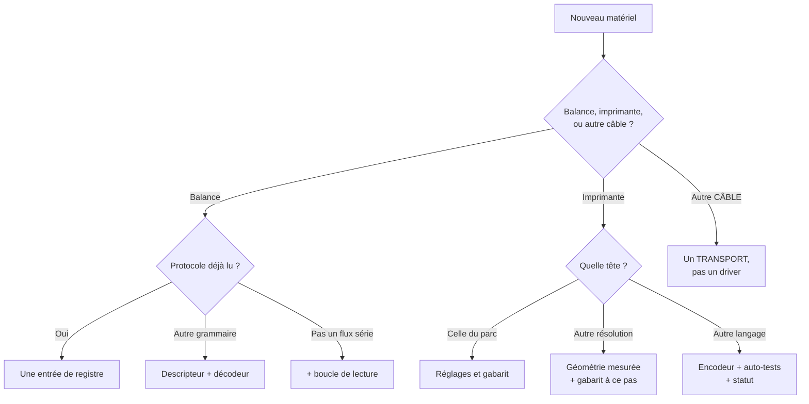

# Ajouter un matériel

> **Ce document dit comment faire.** Quand il devrait expliquer *pourquoi*, il cite le § de
> [`02-architecture.md`](02-architecture.md) ou l'ADR, et passe. Le nommage fait autorité dans
> [`03-glossaire.md`](03-glossaire.md), la géométrie dans
> [`04-parametrage-sato.md`](04-parametrage-sato.md).
>
> **La même chose en Go, compilée et testée :** `internal/scale/example/` et
> `internal/printing/example/` — des drivers **complets**, qui passent leur banc tel quel et
> que **rien n'enregistre**. On les copie, on renomme, on suit les `TODO(driver):`.

---

## 1. Trois questions avant d'écrire une ligne



| Cas | Ce qu'il faut écrire | Ce qui est déjà écrit | À copier |
|---|---|---|---|
| **Balance**, protocole déjà lu | une entrée de registre | tout | `gramxfoc.Drivers` |
| **Balance**, autre grammaire | descripteur + `domain.Decoder` | port, boucle, backoff, reconnexion — **95 %** (§9.1) | `scale/example/` |
| **Balance**, pas un flux série | + la **boucle** de lecture | registre, banc, corpus | `scale/serial/loop.go` |
| **Imprimante**, tête du parc | rien : `printer.options` et un gabarit | tout | — |
| **Imprimante**, autre résolution | géométrie mesurée + gabarit à ce pas | encodeur, rendu, transports | `printing/raster/` |
| **Imprimante**, autre langage | encodeur, auto-tests, statut | rendu, transports, banc | `printing/example/` |
| **Transport** | `ports.Transport` : 5 méthodes | les drivers — **aucun ne change** (§8.4) | `transport/file.go` |

---

## 2. Une balance, du paquet vide au driver enregistré

### 2.1 Capturer AVANT d'écrire

```bash
openscale capture --port COM8 --duration 30m --type gram-xfoc-rs --out frames.txt
```

**En heure de pointe, 30 minutes** (§21 n° 3). Elle donne trois chiffres qu'aucun manuel ne
donne : **cadence réelle**, **trames stables**, **resynchronisations**. Le manuel est une
hypothèse jusqu'à ce qu'une capture la confirme — celui de la GRAM XFOC PLUS s'est révélé
faux sur le cadrage, le séparateur de statut et la somme de contrôle.

Si `--type` ne nomme aucun protocole qui décode vos octets, la capture sert quand même : elle
affiche le flux en hexadécimal et en texte, et c'est cet affichage qui donne la grammaire.

### 2.2 Écrire le paquet

```
cp -r internal/scale/example internal/scale/monmodele
```

Cinq fichiers : `example.go` (identité, cadence, capacités, point d'accès), `decoder.go`
(**le seul vrai travail**), `decoder_test.go`, `conformance_test.go`, `corpus_test.go` (§2.3).

`domain.Decoder` demande quatre méthodes, et les quatre comptent :

| Méthode | Ce qu'elle doit faire |
|---|---|
| `Feed(p, now)` | accumuler, rendre les mesures complètes. **Ne jamais dépendre de l'endroit où une lecture s'arrête** |
| `Reset()` | jeter ce qui attend ; appelée à la réouverture du port |
| `FrameEnd(p)` | où finit la première trame **complète**, ou `-1`. C'est ce que lit `capture` |
| `Resyncs()` | combien de fois le décodeur a renoncé. Une fois = normal, une cadence = câblage |

**L'instant est reçu, jamais lu** : `time.Now` est interdit sous `internal/`, et `boundary`
échoue dessus (§5.3, coupe 1 bis).

### 2.3 Verser le corpus

La capture se dépose sous `internal/scale/testdata/frames/<scale.type>/`. Le nom porte
l'attente : `nominal-*` — **toutes** les lignes non commentées décodent, aucune perdue ;
`degraded-*` — rien ne panique, aucune ligne ne rend une masse hors grammaire. Trois lignes
suffisent à le brancher (`internal/scale/corpus`) :

```go
func TestTheCorpusDecodesAsRecorded(t *testing.T) {
	corpus.Check(t, "../testdata/frames", Driver())
}
```

Un répertoire qu'aucun protocole **enregistré** ne réclame fait échouer
`cmd/openscale/corpus_test.go` : la capture ne serait lue par personne.

### 2.4 Enregistrer

**Une ligne**, dans `scaleRegistry()` de `cmd/openscale/drivers.go` (§5.2) : seul fichier de
l'arbre autorisé à nommer un driver concret, et `boundary` refuse tout autre import.

---

## 3. Une imprimante, du paquet vide au driver enregistré

### 3.1 Mesurer AVANT d'écrire

Trois chiffres se lisent **sur du papier**, jamais sur une fiche technique :

| Chiffre | Comment on l'obtient |
|---|---|
| Pas de la tête (`DotsPerMM`) | auto-test `ruler` : une règle millimétrée |
| Surface encrée (`InkedWidth/HeightDots`) | auto-test `alignment` : quatre croix, un carré |
| Polarité du bitmap | le carré du même auto-test : plein ou creux |

Tant qu'aucune étiquette n'est sortie, on ne connaît ni le contraste, ni la vitesse, ni le
nombre de copies : §8.2 les règle sur un vrai tirage, et le profil neutre n'en porte aucun
(§11.3).

**Un driver qui écrit un FICHIER n'a pas de tête** : les trois chiffres restent à zéro (§7.5
porte alors sur `domain.ReferenceHead`), `Status` est `false`, `DrivesAHead` reste `false`, et
il **ne refuse aucun gabarit** — sans tête déclarée, tout gabarit deviendrait étranger.
`preview` et l'exemple sont cette forme ; copiez `raster` pour l'autre.

**Ne recopiez jamais les trois chiffres.** Ils voyagent jusqu'aux contrôles 29 et 38 : un poste
validerait son étiquette contre une tête que personne ne possède. Aucun banc ne le voit — il
imprime le gabarit que le sujet déclare, donc la copie se vérifie elle-même. C'est
`drivers_test.go` qui refuse la coïncidence avec la tête de référence.

**Il y a DEUX déclarations de tête, et elles ne répondent pas à la même question.** Celle de
l'**entrée de registre** (`Driver().Descriptor.Capabilities`) est lue sans rien construire, par
`checkHeadGeometry` et par les contrôles 29 et 38 ; celle de l'**instance**
(`(*Printer).Descriptor()`) est lue par le banc, qui vérifie que le gabarit imprimé tient dans
la tête. `preview` déclare **zéro** au registre et le pas du gabarit en cours sur l'instance —
c'est légitime, mais seul le premier chiffre engage un poste. Renseignez les deux, ou aucun.

### 3.2 Écrire le paquet

```
cp -r internal/printing/example internal/printing/monmodele
```

Quatre fichiers : `driver.go` (identité, capacités, `OptionSchema`, `ParseOptions`),
`printer.go` (`Print`, `Status`, `SelfTest`, `Close`), `driver_test.go`,
`conformance_test.go`.

`ports.Printer` demande cinq méthodes. Quatre règles gouvernent leur écriture :

1. **Le refus est un `*ports.PrintError`**, et son `Kind` décide de l'action (§8.5).
   `KindTransient` **seul** est réessayé — deux fois, 300 ms puis 1 s.
2. **Ce qu'un bénévole lit est en français** ; ce qu'un développeur seul peut lire — un
   collaborateur absent d'une racine de composition — reste en anglais.
3. **Un driver ne choisit jamais un chemin ni n'ouvre un périphérique.** Il atteint un
   appareil → il déclare la clé `transport` et reçoit un `ports.Transport` construit, et
   fermé, par la racine (§8.4). Il produit des fichiers → il ne déclare pas `transport` et
   reçoit son répertoire par `DriverConfig.OutputDir`, que la racine remplit **toujours**,
   pour tous les drivers, sans consulter aucun schéma.
4. **`ParseOptions` tolère les clés qu'il ne déclare pas.** Ce n'est pas du laxisme :
   `TestChaqueTypeDImprimanteDuDomaineEstConstructible` construit chaque driver depuis la
   configuration **livrée**, sans vider `printer.options` — qui porte donc les treize clés de
   `raster`. Un parseur qui refuserait une clé inconnue resterait rouge après le correctif de
   §3.3. Lisez ce que vous déclarez, ignorez le reste.

### 3.3 Enregistrer

Une ligne dans `printerRegistry()` — et **c'est le coût minimal**, celui d'un driver dont le
schéma d'options est celui de `raster`. Sinon, `make driver` en exige deux de plus : un cas
dans `TestTheDeliveredConfigurationValidatesOnEveryPrinterOfThisBinary`, qui soumet la
configuration **livrée** — donc les options de `raster` — à chaque driver du registre ; et, si
le driver ne déclare aucune option, une entrée dans `schemaExemptions` avec la raison.

**Un driver qui n'existe pas encore n'y entre pas** : `sbpl` est nommé par §8.1 et reste hors
du registre — une entrée est une valeur qu'un bénévole choisit.

---

## 4. Développer sans le matériel

| Outil | Ce qu'il remplace | Où |
|---|---|---|
| `openscale capture` | la balance, une fois | `--port COM8 --duration 30m` |
| `openscale replay` | la balance, indéfiniment | `frames.txt --x10`, `--read-size 18` |
| Le corpus vivant | la balance, dans les tests | `scale/testdata/frames/` |
| Driver `preview` | l'imprimante | un PNG au pas de la tête, un PDF à l'échelle |
| Transport `file` | le câble | `transport = "file"` → une trame/fichier |
| `internal/fake` | horloge, balance, imprimante | `NewClock`, `NewScale`, `NewPrinter` |
| `serial.Options.Open` | le port série | une `io.ReadCloser` du test (§9.1) |
| `Options.Sink` de l'exemple | l'imprimante | un `io.Writer` qui compte et qui tronque |
| `//go:build hardware` | rien : ces tests **exigent** le matériel | 3 fichiers, hors de `go test ./...` |

**`openscale replay --read-size 18`** reproduit le `CommRead(…, 18, …)` de l'ancienne
application, qui perdait une trame sur deux : c'est le réglage qui prouve qu'un décodeur ne
dépend pas de l'endroit où une lecture s'arrête.

**Détourner le pilote du fabricant.** Cette méthode a fait autorité au banc L0 là où la
lecture du manuel avait échoué quatre fois : rediriger la file du pilote constructeur **vers
un fichier**, imprimer depuis l'application d'origine, lire les octets qu'elle envoie
réellement. Elle a tranché le format de `<G>`, le cadrage et l'ordre des commandes en une
fois. Un rejeu à l'aveugle aurait coûté des dizaines d'étiquettes.

---

## 5. Le banc de conformité

Trois bancs, une seule façon de s'y brancher : `conformance.Suite(t, conformance.Subject{…})`.
Le `Subject` est une liste de **déclarations**, et « laissé `nil` » ne veut pas dire une seule
chose — c'est le piège du banc lui-même :

- `Short`, `WithoutDemoLabel`, `MissingCollaborator`, `DrivesAHead` → contrôle **SKIPPED**,
  avec la phrase qui dit ce qui n'est plus vérifié.
- `Copies` → **SKIPPED aussi**, mais seulement si le driver **accepte** un compte hors borne.
  Un driver qui les refuse n'en a pas besoin ; `preview` est exactement l'autre cas.
- `SelfTests` → le banc devient **plus strict** : le driver est tenu au catalogue entier.
  **Sauf** qu'une liste qui omet `label` fait sauter `TheDemonstrationLabelIsNeverInvented` —
  déclarer moins durcit sur un axe et relâche sur l'autre.
- `Delivered` → **aucun saut**, mais **9 des 18** contrôles cessent de vérifier qu'un refus
  n'a rien laissé sortir, et passent sur un driver qui a imprimé puis annoncé un échec. Le
  banc le dit et les nomme avant de commencer.

Aucune de ces six issues ne se devine : lire la sortie `-v` du banc est le seul moyen de
savoir ce qui a réellement été vérifié.

**Pas de `t.Parallel` autour de `Suite`** : le contrôle de fuite compare un compte de
goroutines à l'échelle du processus.

### 5.1 Balance — 9 contrôles

| Contrôle | La panne qu'il interdit |
|---|---|
| `Descriptor` | un `scale.type` que `config.json` ne peut plus nommer |
| `OutIsNeverClosed` | le retour série → manuel → série impossible : **l'état dégradé devient irréversible** |
| `DoneClosesWhenTheContextEnds` | l'attente d'un rechargement ne se débloque jamais : l'écran de configuration se fige |
| `DoneClosesWhenStartFails` | le même écran figé, quand `Start` échoue avant sa goroutine |
| `LastEventIsDisconnected` | le Hub ignore que la balance est partie : l'écran montre le poids d'un sac parti |
| `CloseIsIdempotent` | le second `Close` — rechargement puis arrêt — fait tomber le poste |
| `MeasurementsAreCoherent` | l'horloge murale rend l'âge d'une mesure incalculable ; masse hors grammaire = chiffres inventés |
| `StartSurvivesACancelledContext` | un rechargement qui chevauche un arrêt panique, ou fige `done` |
| `NoGoroutineLeaks` | une goroutine ou un ticker qui survit au driver |

### 5.2 Imprimante — 18 contrôles

| Contrôle | La panne qu'il interdit |
|---|---|
| `Descriptor` | un `printer.type` qu'un fichier de configuration ne peut pas nommer |
| `CopiesStayInsideTheDeclaredBound` | un compte de copies arrondi, ou une trame illisible |
| `AJobWithoutACopyCountStillPrints` | **zéro copie** quand l'écran annonce « Étiquette envoyée » |
| `AnUnusableBarcodeIsRefusedAsData` | un symbole illisible, découvert à la caisse |
| `AForeignTemplateIsRefused` | une étiquette **à une autre échelle**, invisible sans pied à coulisse |
| `AShortWriteIsATransientFailure` | une trame tronquée : étiquette blanche, journal en succès |
| `StatusNeverClaimsReadyWithoutProof` | un feu vert sur `/readyz` au-dessus d'une tête ouverte |
| `StatusAfterCloseIsUnknown` | un verdict sur un périphérique que personne ne tient |
| `PrintAfterCloseIsRefused` | un travail en retard qui rouvre le périphérique sous le suivant |
| `CloseIsIdempotent` | le second `Close` fait tomber le poste |
| `EverySelfTestAnswersAsDeclared` | un bouton qui échoue au clic, ou un auto-test que rien ne lance |
| `AnUnknownSelfTestNamesTheOnesThatExist` | un nom mal tapé qui ne laisse rien à essayer |
| `TheDemonstrationLabelIsNeverInvented` | **un prix inventé** sur l'étiquette qu'on pose sur une vraie |
| `TheClockIsTheOneTheDriverWasGiven` | un budget sur l'horloge murale, hors de portée des tests |
| `PrintIsSerialised` | deux trames entrelacées, ou un accusé qui nomme l'étiquette d'un autre |
| `NoGoroutineLeaks` | une goroutine qui survit à `Close` |
| `OperatorMessagesAreFrench` | « invalid parameter » devant un bénévole, la queue derrière |
| `ADeveloperMessageStaysEnglish` | une faute de câblage traduite comme si elle le concernait |

### 5.3 Transport — 12 contrôles

`Name`, `DescribeNamesTheDestination`, `WriteDeliversEveryByte`, `EmptyPayloadIsRefused`,
`PartialWriteIsAnError`, `UnreachableDeviceIsAnError`, `CancelledContextWritesNothing`,
`CancelDuringWriteLeavesNothing`, `QueryAnswersOrDeclares`, `CloseIsIdempotent`,
`WriteAfterCloseIsRefused`, `NoGoroutineLeaks`.

Les deux qui coûtent le plus cher : **une écriture partielle sans erreur est un échec** —
c'est ce que fait `WritePrinter` — et **une charge utile vide est refusée**, sinon un encodeur
muet devient un succès silencieux.

### 5.4 Ce que le branchement coûte, mesuré

Lignes des `conformance_test.go`, dans la même unité que §9.3 — balance : `absent` **34**,
`gramxfoc` 94, `serial` 129, `example` 136 ; imprimante : `raster` **97**, `preview` 104,
`example` 154. Le plancher est **34 lignes, dont 15 de code**, pour une source qui n'ouvre
rien ; les fichiers longs portent un banc, pas un contrat plus large.

Ces sept chiffres se re-mesurent, ils ne se recopient pas : `wc -l internal/*/*/conformance_test.go`.

**Chaque banc prouve qu'il mord** : il porte des sujets délibérément cassés — **29** côté
balance, **37** côté imprimante — avec assertion sur *quel contrôle attrape quelle trahison*.

---

## 6. Un transport

Un transport n'est **pas** un driver : il porte des octets et ne sait **rien** de ce qu'ils
disent (§8.4). Les quatre existants — `winspool`, `devfile`, `tcp`, `file` — sont écrits
contre le même contrat.

1. Le type dans `internal/printing/transport/` : `Name`, `Write`, `Query`, `Describe`,
   `Close`.
2. **Un handle par travail** : ouvrir, écrire, fermer dans un seul `Write`. `Close` n'a alors
   plus qu'une chose à faire — refuser ce qui vient après.
3. `Query` rend `ErrUnsupported` si le transport est à sens unique : c'est ce qui autorise
   `Status` à répondre `PrinterUnknown` honnêtement.
4. `Describe` est **français** : « file Windows "SATO WS408_1" », « /dev/usb/lp0 ».
5. L'inscrire dans `Descriptors()` puis `New()`, et le brancher à `transport/conformance`.

**Aucun driver ne change** : une destination de plus est une entrée de plus dans une liste.

---

## 7. Les pièges déjà payés

| Ce qui a été écrit | Ce que le matériel a fait | La parade |
|---|---|---|
| `<G>` déclarait sa hauteur **en dots** | SBPL la compte **en octets** : l'imprimante attendait 8× les données, indéfiniment | `b × c × 8` — 14 blocs `<G>` du vrai pilote, 14 sur 14 |
| `Encode` n'émettait **pas** `STX`/`ETX` | Travail jamais « terminé », session TCP tenue, **tout travail suivant échoue jusqu'au redémarrage**. Silencieux des deux côtés | Le cadrage est émis ; `04-parametrage-sato.md` |
| Média déclaré **40 × 25,4 mm** | Support réel **38 × 25**, dont 35 imprimables : la moitié de la mire hors de l'étiquette | 280 × 200 dots à 8 dots/mm. **L'imprimante fait foi** |
| Mire centrée sur l'**angle exact** | Bras rognés par le bord du bitmap, quart survivant dans le millimètre de découpe arrondie : **rien ne sortait** | Croix rentrées d'un millimètre, traits à deux dots |
| `nil` **typé** dans une interface | L'interface n'est pas nulle : garde franchie, méthode sur récepteur nul, connexion HTTP tombée toutes les 3 s | Construire l'interface, ou la laisser nulle |
| `filepath.Clean` sur un chemin d'archive | Sous Windows `/etc/cron.d/evil` devient `\etc\cron.d\evil`, que `filepath.IsAbs` dit **relatif** | Juger en séparateurs `/` **avant** conversion |
| `serial.Options{Port, Clock, Open}` | `Baud`, `Bits`, `Parity`, `Stop` au zéro Go, `withDefaults()` jamais appelée : **la détection ne pouvait réussir sur aucun port** | `Options.Complete`, appelée **au point de liaison** |
| `Print` après `Close` en `KindTemplate` | Le refus envoyait un bénévole regarder `printer.template`, qui n'avait rien | Vérifier la fermeture **avant** de composer |
| Découpage du flux sur `CR`/`LF` | La balance n'en envoie jamais : fichier **vide de trames** sous un résumé annonçant 194 décodées. Deux fois | `FrameEnd` : **une seule place décide de ce qu'est une trame** |
| `Resyncs` exposé en **champ** | Inatteignable à travers l'interface : tout outil qui l'imprimait imprimait **0**, en silence | Une **méthode** du contrat, pas un champ |

**La plupart de ces pièges étaient invisibles sans matériel, et silencieux des deux côtés.
Un banc vert ne prouve pas qu'une étiquette sort.**

---

## 8. Avant de dire que c'est terminé

```bash
gofmt -l .        # ne doit RIEN afficher
go vet ./...      # ne doit RIEN afficher
make driver       # ou : pwsh -File ./make.ps1 driver
```

Sortie attendue de la dernière ligne :

```
boundary: les coupes vérifiables automatiquement sont respectées
driver : conformite, registre et coupe 2 au vert — reste « make test » avant de livrer
```

Puis, avant de livrer, `make test` : la passe `-race` (les invariants de concurrence du Hub),
la passe `CGO_ENABLED=0` (**la configuration livrée** compile et passe), `boundary` et
`deps`. Tout doit rendre `ok` et les deux outils leur ligne verte.

**`-race` exige cgo**, donc `gcc` (`winget install BrechtSanders.WinLibs.POSIX.UCRT`). Sans
lui, `make.ps1` **saute** la passe avec un avertissement, et la CI Linux la couvre.

**Le zéro cgo se prouve deux fois** (ADR-001) : par la passe `CGO_ENABLED=0`, et par
`make dist`, qui compile les **trois** cibles depuis une machine sans chaîne C. Une
dépendance qui casse la compilation croisée ne se voit qu'ici.

**Une dépendance nouvelle impose quatre écritures** (ADR-039), et `make deps` échoue tant que
les quatre ne concordent pas : `go.mod` ; la table d'inventaire de **§17.1** ;
`THIRD-PARTY.md` ; et **un ADR qui amende ADR-039**, avec les cinq points du critère de
réouverture.

**L'identifiant s'inscrit au glossaire** : `docs/03-glossaire.md` porte une table par paquet,
où `<paquet>.ID` et `<paquet>.Label` s'ajoutent dans la graphie exacte du registre.

---

## 9. Pour un agent IA

### Le contexte minimal à charger

`02-architecture.md` pèse **580 Ko** et ne se lit pas en entier. Dans l'ordre :
`CLAUDE.md` ; `internal/scale/doc.go` **ou** `internal/printing/doc.go` ; le paquet
`example/` correspondant, `TODO(driver):` compris ; les sections 1, 5, 7 et 8 d'ici ; et
**seulement** les § cités par les commentaires du code rencontré.

### Les fichiers de référence à imiter, nommément

Sous `internal/`, sauf le dernier :

| Besoin | Fichier |
|---|---|
| Balance, driver complet | `scale/example/example.go` + `decoder.go` |
| Balance de production | `scale/gramxfoc/gramxfoc.go` — 157 lignes de câblage |
| Imprimante, driver complet | `printing/example/driver.go` + `printer.go` |
| Imprimante qui n'encre rien | `printing/preview/driver.go` |
| Imprimante qui pilote une tête | `printing/raster/driver.go` |
| Transport | `printing/transport/file.go` |
| Enregistrement | `cmd/openscale/drivers.go` — **le seul fichier qui nomme un driver** |

### Le critère de terminé, en une phrase

**`make driver` passe, le driver est enregistré et les tests de registre que §3.3 énumère sont
traités, et chaque valeur qu'il déclare a été mesurée — jamais recopiée — ou vient d'un
`TODO(driver):` explicitement levé.**

### Trois interdits, formulés positivement

1. **Les décisions de `CLAUDE.md` sont acquises.** Code-barres tronqué, driver raster comme
   chemin de production, CSV par poste supprimé après lecture, préfixe qui fait foi sur le
   mode de vente : tranchés après analyse. On les applique, on ne propose pas de les corriger.
2. **Une valeur que seul un tirage réel donne ne s'invente pas.** Contraste, vitesse, nombre
   de copies, pas de la tête, surface encrée, cadence : non mesurés, ils restent un
   `TODO(driver):`, et le driver est livré sans eux plutôt qu'avec des chiffres plausibles.
3. **On déclare exactement ce que le matériel fait.** `PrinterUnknown` et `StabilityUnknown`
   existent pour dire « je ne sais pas », et c'est une réponse recevable — `Status = false`
   et `Stability = false` aussi. Une capacité déclarée et non tenue est un garde-fou que le
   poste croit avoir.
