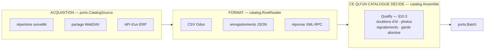
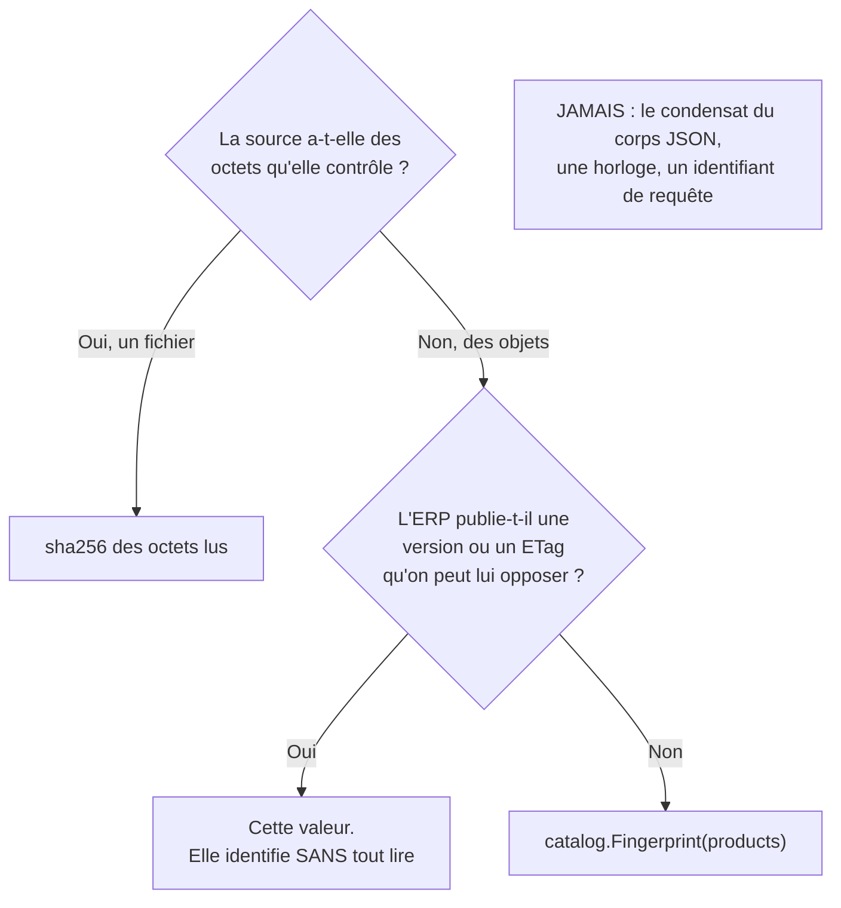

# Ajouter une source de catalogue

> **Ce document dit comment faire.** Quand il devrait expliquer *pourquoi*, il cite le § de
> [`02-architecture.md`](02-architecture.md) ou l'ADR, et passe. Le nommage fait autorité dans
> [`03-glossaire.md`](03-glossaire.md). Pour brancher une balance, une imprimante ou un
> transport, c'est [`07-ajouter-un-materiel.md`](07-ajouter-un-materiel.md).
>
> **La même chose en Go, compilée et testée :** `internal/catalog/example/` — une source qui
> lit un ERP par HTTP, pagine en flux, acquitte sans rien supprimer, et que **rien
> n'enregistre**. On la copie, on renomme, on suit les `TODO(source):`.

---

## 1. Deux questions avant d'écrire une ligne

Un catalogue arrive en deux temps, et **ce sont deux paquets, pas un** : *où* on va le
chercher, et *sous quelle forme* il se présente. C'est la seule chose à comprendre avant
d'écrire quoi que ce soit ; tout le reste en découle.



| Ce que vous ajoutez | Ce qu'il faut écrire | Ce qui est déjà écrit | À copier |
|---|---|---|---|
| **Un endroit** d'où vient un CSV Odoo | `ports.CatalogSource` seul | le format, la qualification, les images, les gardes | `catalog/webdav/` |
| **Un format** déposé au même endroit | `catalog.RowReader` seul | la scrutation, l'archive, la quarantaine, l'acquittement | `catalog/csvodoo/` |
| **Une API d'ERP** | les deux, dans un paquet | tout ce que décide un catalogue — **la moitié du travail** | `catalog/example/` |
| Une clé de réglage de plus | une ligne au schéma d'options | le formulaire d'administration, la validation | `catalog/localdrop/` |

**Le test qui tranche : est-ce que ma question porte sur des OCTETS ou sur des PRODUITS ?**
Un plafond de taille de fichier, un jeton d'authentification, une pagination, une
suppression : acquisition. Sept colonnes séparées par un point-virgule, une lettre de rayon,
un libellé d'unité, du base64 : format. « Ce produit est-il pesable ? » : ni l'un ni l'autre —
c'est `catalog.Assemble`, et **vous n'y touchez pas**.

---

## 2. Ce que chaque côté doit fournir, exactement

### 2.1 Le format — `catalog.RowReader`

```go
type RowReader interface {
    Next() (Row, []domain.Finding, error)
    Close() error
}
```

Trois formes de retour, et **c'est celle du milieu qui compte** :

| Retour | Sens | Ce que fait `Assemble` |
|---|---|---|
| une `Row`, `err == nil` | candidat produit | la qualifie (§10.3) |
| `catalog.ErrRowUnreadable` | **cette ligne** n'est pas un produit | la compte, garde les signalements, **continue** |
| `io.EOF` | le catalogue est complet | applique la garde absolue, rend le lot |
| toute autre erreur | la lecture elle-même a échoué | **refuse le lot entier** |

**`Next` doit être en flux.** Ce n'est pas une préférence : le pic mémoire d'un import est
**une ligne**, mesuré — la colonne image *est* le fichier, 500 368 des 527 233 octets de
l'export de référence. Un lecteur qui tiendrait tout le catalogue pour répondre à `Next`
mettrait l'export d'un producteur dans la mémoire d'un poste qui a un sac de carottes sur sa
balance. `internal/catalog/example/rows.go` montre comment tenir la promesse **à travers une
pagination** : le décodeur JSON est positionné à l'intérieur du tableau, une page qui se
termine va chercher la suivante, et deux pages ne sont jamais en mémoire ensemble.

Ce que le lecteur remplit dans une `Row` :

| Champ | Ce que le lecteur en fait |
|---|---|
| `Line` | le rang de l'enregistrement — un signalement qui ne nomme rien n'est pas corrigeable |
| `ID`, `Name`, `Barcode` | le texte du producteur, découpé, **rien d'interprété** |
| `Price` | **du TEXTE.** `domain.ParseCents` le lit, jamais un `float` — « le prix est-il un nombre exploitable ? » est une des six questions de §10.3 |
| `CategoryCode` | la lettre du producteur **traduite** en code de rayon de ce poste |
| `Magnitude`, `PriceSuffix` | le libellé d'unité traduit — il pilote l'AFFICHAGE, jamais le mode de vente |
| `Image` | les **octets** de la photo, extraits de ce que le format en avait fait |

**`Image` porte des octets et non une adresse, et c'est la ligne qui économise le plus de
code.** Reconnaître l'en-tête parmi les quatre formats acceptés, refuser une photo trop grosse
ou trop large, en calculer l'empreinte, remarquer que c'est déjà celle d'un autre produit et la
confier à `catalog.ImageSink` : ce sont les règles de §10.7, elles valent pour toute source, et
elles vivent dans `Assemble`. Le lecteur décode — base64 pour l'export Odoo, octets bruts pour un ERP
qui les donne tels quels — **et il s'arrête un octet après le plafond** : un champ qui annonce
trois mégaoctets est refusé après 256 ko lus, pas après trois mégaoctets alloués.

### 2.2 L'acquisition — `ports.CatalogSource`

```go
type CatalogSource interface {
    Name() string
    Next(ctx context.Context) (*Batch, error)
    Acknowledge(ctx context.Context, b *Batch, result BatchResult) error
    Close() error
}
```

`Next` **bloque** jusqu'à ce qu'un catalogue soit disponible, et il ne tient **aucune
goroutine** : il attend sur l'horloge injectée (`ports.Clock`), ce qui fait tourner un
scénario de scrutation entier en microsecondes de temps réel (§16.4). Aucune source ne lit
`time.Now` — `make boundary` marche l'AST et refuse l'appel.

---

## 3. Une source d'ERP, du paquet vide à la source enregistrée

### 3.1 Interroger AVANT d'écrire

Le format publié par un ERP est une **hypothèse** tant qu'une réponse réelle ne l'a pas
confirmée. Celui de l'Odoo de la coopérative s'est révélé porter des clés de contrôle fausses
sur 7 lignes et 16 zones réservées non nulles — aucune documentation ne le disait.

```bash
curl -s -H "Authorization: Bearer $TOKEN" "$URL?page=1&page_size=5" | tee page1.json | head -c 4000
```

Trois choses à en tirer, qu'aucun manuel ne donne :

1. **Comment se termine la pagination.** Un champ `next_page` ? Un `Link:` d'en-tête ? Une
   page vide ? `internal/catalog/example` refuse une page qui renvoie vers elle-même ou vers
   une page précédente, et c'est un garde-fou et non une politesse : sans lui, un ERP qui
   répond `next_page: 1` sur la page 1 est interrogé indéfiniment, et « le poste ne répond
   plus » est un symptôme sur lequel personne ne peut agir.
2. **Où est `next_page` par rapport à `products`.** S'il vient **après** le tableau — la forme
   naturelle pour un producteur qui diffuse ses produits en flux — un lecteur qui ne regarde
   qu'avant lit la page 1 d'un catalogue et l'appelle le tout : **en silence**, avec une
   grille qui a l'air parfaitement normale et à qui il manque les quatre cinquièmes de la
   boutique. Ce défaut a été écrit puis rattrapé par un test pendant la rédaction de ce
   paquet ; il est dans `finishPage`.
3. **Ce que l'ERP appelle un prix.** `12.90`, `12,90` ou `1290` ne se lisent pas pareil, et
   c'est `domain.ParseCents` qui tranche — jamais `encoding/json`.

### 3.2 Écrire le paquet

Copier `internal/catalog/example/`, renommer, suivre les `TODO(source):`. Trois fichiers :

| Fichier | Ce qu'il porte |
|---|---|
| `doc.go` | ce que ce paquet sait de ce producteur, et ce qu'il ne sait pas |
| `rows.go` | le `catalog.RowReader` : le protocole, le vocabulaire du producteur, le décodage des photos |
| `<nom>.go` | la `ports.CatalogSource` : l'adresse, le jeton, la scrutation, l'identité, l'acquittement, le `Descriptor()` |

Le cœur du fichier de la source tient en quelques lignes, et **ce qu'il ne contient pas est le
sujet** :

```go
func (s *Source) read(ctx context.Context) (*ports.Batch, error) {
    counter := newCountingReader()
    reader := &rowReader{fetch: ..., options: s.reader}
    assemble := s.assemble
    assemble.Now = s.clock.Now()

    batch, err := catalog.Assemble(reader, assemble)
    if err != nil {
        return nil, catalog.Refused(counter.digest(), counter.count, err)
    }
    batch.ID, batch.Bytes = catalog.Fingerprint(batch.Products), counter.count
    return batch, nil
}
```

### 3.3 Enregistrer

**Une ligne, dans `cmd/openscale/drivers.go`, et nulle part ailleurs** (§5.2) :

```go
func catalogSourceRegistry() *catalog.Registry {
    registry := catalog.NewRegistry()
    registry.Register(localdrop.Descriptor())
    registry.Register(webdav.Descriptor())
    registry.Register(monerp.Descriptor())   // ← la ligne
    return registry
}
```

Rien d'autre ne change : l'écran d'administration découvre la source par le registre et
**engendre son formulaire depuis le schéma d'options que la source déclare elle-même**
(§11.3). Ni `internal/station`, ni `internal/web`, ni le front n'ont un mot à changer.

> **Ce n'était pas vrai avant ADR-052.** Cette racine tenait une `map` à elle, plus une
> réimplémentation du `lookup` et du message « type inconnu » ; `catalog.Registry` — la chose
> à qui §5.2 promet qu'une source nouvelle n'ajoute qu'une ligne — n'était atteinte que par
> l'appel aux descripteurs de `doctor`. Ajouter une troisième source demandait d'éditer la
> map, le lookup et le message.

---

## 4. L'identité d'un lot, et pourquoi ce n'est pas le condensat des octets

`Batch.ID` est ce sur quoi **la quarantaine de §10.5 compte** : trois refus du **même
contenu** allument le voyant rouge. Une source fichier hache les octets lus et c'est réglé.
Une source qui a reçu des **objets** n'a pas ces octets, et en inventer est un piège.



**Pourquoi pas le corps JSON.** Le condensat dépendrait de l'ordre des clés choisi par le
serveur, de ses espaces, et de tout champ qu'il ajoute et que ce poste ne lit pas. Le même
catalogue arriverait avec une identité neuve chaque nuit : « le même catalogue deux fois »
cesserait d'être le cas nominal de §10.5, chaque scrutation réécrirait la grille sous le doigt
d'un client, et la quarantaine ne verrait jamais un contenu refusé trois fois.
`catalog.Fingerprint` hache donc les **produits**, dans un ordre qu'il impose lui-même, et
laisse dehors tout ce que ce binaire dérive d'eux — un signalement reformulé dans une version
ne doit pas faire croire à quatre postes que leur catalogue a changé.

**Sur un REFUS, en revanche, ce sont bien les octets reçus.** Il n'y a pas de produits à
hacher, et une clé qui n'identifie rien compterait trois tentatives contre trois inconnus sans
jamais atteindre le seuil. Un ERP qui répond trois fois la même page cassée est banni ; un
dont la casse varie ne l'est jamais. C'est plus faible que le condensat d'un fichier, et c'est
le maximum honnête ici.

---

## 5. Acquitter quand il n'y a rien à supprimer

`Acknowledge` est **explicite et séparé de la lecture** : `Next` lit et valide sans rien
toucher, et l'acquittement vient après, parce qu'une panne entre la lecture et l'application ne
doit pas perdre une mise à jour définitivement et sans trace (ADR-004).

Pour une source **fichier**, la suppression *est* l'acquittement. Pour les autres :

| Résultat | Ce que la source doit faire | Pourquoi |
|---|---|---|
| `applied`, `unchanged` | **retenir** l'identité | sans quoi le poste retélécharge tout le catalogue à chaque scrutation pour conclure qu'il l'avait déjà |
| `rejected`, `failed` | **ne rien retenir** | retenir un refus ferait cesser de demander un contenu jamais mis en service : la quarantaine ne le verrait jamais trois fois, le voyant rouge ne s'allumerait pas, et le producteur ne corrigerait rien puisque personne ne le lui aurait dit |

Cette asymétrie est tenue par deux tests dans `example_test.go`, et c'est le seul endroit du
contrat qu'une source sans fichier doit **inventer** plutôt que copier.

---

## 6. Ce que le schéma d'options déclare, et ce que les contrôles en font

Le `Descriptor()` d'une source déclare ses clés. L'écran d'administration en engendre son
formulaire, et `Config.Validate` s'en sert pour trois choses **sans connaître aucune source par
son nom** (ADR-052) :

| Déclaration | Ce que le contrôle en fait |
|---|---|
| une clé **absente** du schéma | contrôle 9 la refuse, et **nomme la source qui la déclare** : « option inconnue du driver `"webdav"` : c'est `"local_drop"` qui la déclare » |
| `Kind: domain.OptionURL` | contrôle 39 propose cette source à qui a tapé une adresse web dans un chemin de dépôt |
| `Use: domain.UseDropDirectory` | contrôles 39 et 46 : refus d'un hôte HTTP(S) derrière ce chemin (important-11), et **sondage réel** du répertoire par le compte du service |

> **Les contrôles 39, 46 et 47 nommaient `local_drop` et `webdav` en dur dans
> `internal/domain`** — une troisième source ne pouvait pas être ajoutée sans éditer le
> domaine, l'exact contraire d'un point d'enfichage. Le **47 est supprimé et son numéro laissé
> en trou** comme celui du 37 (ADR-044) : ce qu'il disait, le contrôle 9 le refusait déjà pour
> toute source ; son seul apport était sa phrase, et cette phrase est passée dans le 9.

**Une clé qui porte un secret ne se déclare pas comme telle, elle se déclare ailleurs.** Un
jeton ou un mot de passe appartient à une source qui **s'authentifie** ; une source qui
surveille un répertoire qu'elle possède n'en a aucun à porter, et le contrôle 9 refuse la clé
chez elle sans qu'une règle le dise. C'est le raisonnement d'important-11, et il tient tout
seul dès que chaque source déclare honnêtement ses propres clés.

---

## 7. Développer sans l'ERP

Aucune des trois choses ci-dessous ne demande un serveur, et c'est délibéré (§16.4) :

| Ce que vous voulez essayer | Comment, sans réseau |
|---|---|
| le **format** seul | un test sur `catalog.Assemble` avec votre `RowReader` sur des octets écrits à la main |
| la **source** entière | `httptest.NewServer` — `internal/catalog/example/example_test.go` en fait un ERP complet, pagination et pannes comprises, en une soixantaine de lignes |
| une **scrutation** de trente jours | `fake.NewClock` et `Advance` : la source attend sur l'horloge injectée, jamais sur la vraie |

Et le poste entier, avec la source déjà livrée :

```bash
openscale demo                                  # poste de démonstration
cp testdata/catalog/flv.csv "$DATA/catalog/incoming/flv_1.csv"
```

---

## 8. Les pièges déjà payés

| Ce qui a été écrit | Ce que ça a donné | La parade |
|---|---|---|
| `next_page` cherché **avant** `products` | la page 1 lue, appelée le catalogue entier, **en silence** : une grille normale à qui il manque tout le reste | marcher aussi ce qui **suit** le tableau (`finishPage`) |
| `next` hérité d'une page à l'autre | une page sans `next_page` reprenait le numéro de la précédente : boucle | remettre `next` à zéro à **chaque** page |
| une pagination suivie sans garde | `next_page: 1` sur la page 1 : le poste interroge l'ERP indéfiniment | refuser une page qui ne progresse pas, **en le nommant** |
| l'identité prise sur le corps JSON | ordre des clés et espaces du serveur : catalogue « neuf » chaque nuit, grille réécrite sous le doigt d'un client | `catalog.Fingerprint`, sur les **produits** |
| un refus acquitté comme un succès | le contenu cassé n'est plus demandé : jamais trois fois, jamais de voyant rouge, producteur jamais prévenu | ne retenir que `applied` et `unchanged` |
| le prix décodé en `float` par `encoding/json` | `12,90` d'un ERP français : erreur de décodage sur **toute la page** au lieu d'une anomalie nommée sur une ligne | tout le record en **texte**, `domain.ParseCents` tranche |
| le plafond de fichier jugé **après** l'assemblage | la lecture est coupée au plafond, donc le fichier arrive tronqué et ressort en « aucune ligne de produit » : on cherche une faute de contenu dans un fichier dont le seul défaut est sa taille | juger le plafond **avant** ce que `catalog.Assemble` a conclu |
| un test à 3 produits dont 1 cassé | refusé en bloc — et c'est **correct** : la garde absolue de §10.4a refuse sous 90 % de lignes exploitables | un test sur un défaut de ligne prend une page où les lignes saines sont la majorité |

**Les quatre premiers sont invisibles sans un vrai producteur, et silencieux des deux côtés.
Un banc vert ne prouve pas qu'un catalogue est complet.**

---

## 9. Avant de dire que c'est terminé

```bash
gofmt -l .        # ne doit RIEN afficher
go vet ./...      # ne doit RIEN afficher
go run ./tools/boundary
```

Sortie attendue de la dernière ligne :

```
boundary: les coupes vérifiables automatiquement sont respectées
```

**La coupe 2 couvre les sources de catalogue depuis ADR-052**, et pas avant : elle ne
connaissait que `scale.Driver` et `printing.Driver`, si bien que `internal/web` aurait pu
importer `internal/catalog/localdrop` sans un mot. `catalog.Source` est le troisième type de
registre, et **la liste des paquets sources ne s'écrit nulle part** : c'est tout paquet qui
expose une déclaration exportée de ce type.

Puis, avant de livrer, `make test`.

**Ce qu'aucun outil ne vérifie ici, et qu'il faut savoir :** il n'existe **aucun banc de
conformité pour une source de catalogue**, là où une balance, une imprimante et un transport en
ont un chacun (§5.1 à 5.3 de [`07`](07-ajouter-un-materiel.md)). Les clauses de
`ports.CatalogSource` sont donc tenues par les tests de chaque paquet, ce qui est plus faible :
c'est exactement l'écart qu'ADR-048 a comblé côté impression après qu'un défaut classé au
mauvais `Kind` eut traversé deux drivers livrés.

**L'identifiant s'inscrit au glossaire** : `docs/03-glossaire.md` porte une table par paquet, où
`<paquet>.ID` et `<paquet>.Label` s'ajoutent dans la graphie exacte du registre.

---

## 10. Pour un agent IA

### Le contexte minimal à charger

`02-architecture.md` pèse **617 Ko** — 632 637 octets, mesuré le 31/07/2026 — et ne se lit pas
en entier. Dans l'ordre :
`CLAUDE.md` ; `internal/catalog/doc.go` ; `internal/catalog/assemble.go`, dont la godoc de
`RowReader` est le contrat ; le paquet `internal/catalog/example/`, `doc.go` compris ; les
sections 1, 2, 4, 5 et 8 d'ici ; et **seulement** les § cités par les commentaires du code
rencontré.

### Les fichiers de référence à imiter, nommément

Sous `internal/`, sauf le dernier :

| Besoin | Fichier |
|---|---|
| Source d'API, complète | `catalog/example/example.go` + `rows.go` |
| Source fichier, la plus simple | `catalog/localdrop/localdrop.go` |
| Source fichier, avec réseau et secret | `catalog/webdav/webdav.go` |
| Format seul, en flux | `catalog/csvodoo/csvodoo.go` |
| Ce qu'un catalogue décide — **à ne pas recopier** | `catalog/assemble.go`, `catalog/qualify.go` |
| Identité d'un lot sans fichier | `catalog/fingerprint.go` |
| Enregistrement | `cmd/openscale/drivers.go` — **le seul fichier qui nomme une source** |

### Le critère de terminé, en une phrase

**`go run ./tools/boundary` passe, la source est enregistrée en une ligne, `catalog.Assemble`
est appelé et n'est réimplémenté nulle part, l'identité d'un lot ne dépend pas de la
sérialisation du producteur, et un refus n'est jamais acquitté.**

### Trois interdits, formulés positivement

1. **Ce qu'un catalogue décide appartient à `catalog.Assemble`.** La question à trois réponses
   de §10.3, un identifiant qu'une ligne précédente a déjà porté, les quatre en-têtes d'image
   acceptés, le sha qui adresse une photo, la garde absolue de §10.4a : une source qui les
   réimplémente les réimplémentera **différemment**, et c'est ainsi qu'un poste se met à
   refuser ce qu'un autre accepte.
2. **Les décisions de `CLAUDE.md` sont acquises.** Le préfixe du code-barres fait foi sur le
   mode de vente et non le champ `unite` ; le CSV par poste est supprimé après lecture et la
   suppression *est* l'acquittement ; aucune migration depuis l'ancienne application. Une
   source nouvelle **n'est pas** une occasion de les rouvrir — elle est la raison pour
   laquelle le CSV n'est plus le seul chemin, ce qui est autre chose.
3. **On déclare exactement ce que la source fait.** `Bytes` à zéro veut dire « je n'ai rien
   compté », et c'est une réponse recevable ; un `Use` déclaré fait sonder un répertoire que la
   source ne surveille peut-être pas. Une clé déclarée et non lue est un réglage que
   l'exploitant croit avoir.
