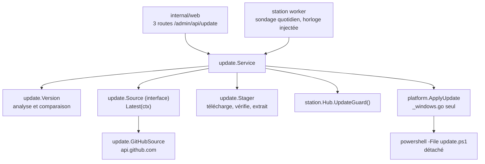
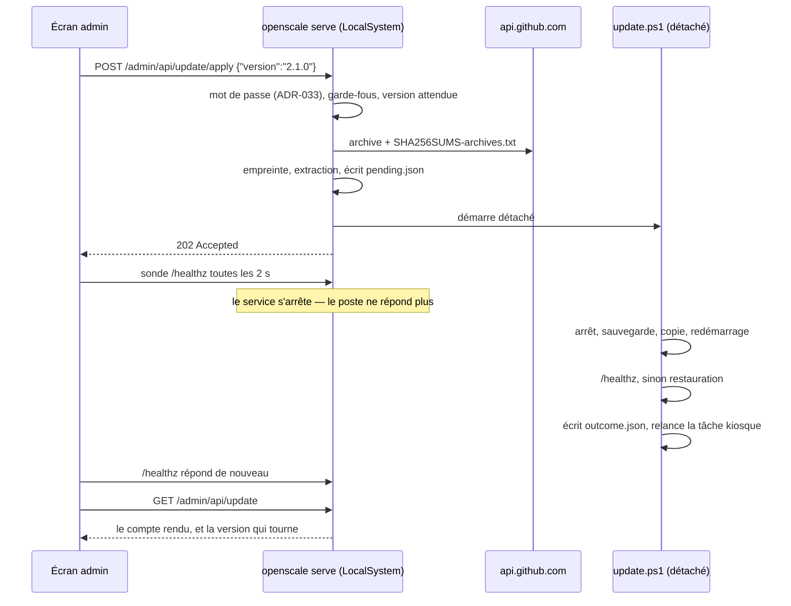

# Mettre à jour un poste depuis l'écran d'administration

> Conception validée le 29/07/2026. Elle décrit ce qui doit être construit, pas ce qui
> existe. L'implémentation n'a pas commencé.

## Le problème

Mettre à jour un poste demande aujourd'hui qu'un humain télécharge une archive, la
décompresse, ouvre une console **en administrateur** et lance `update.ps1`. Aucun bénévole
de la coopérative ne fera ça. Conséquence mesurable : un correctif publié reste sur GitHub,
et le poste tourne sur la version qu'il avait le jour de son installation.

Ce document décrit un bouton dans l'écran d'administration qui fait le même geste, avec les
mêmes garanties, sans console et sans humain qualifié.

## Ce qui existe déjà, et qu'on ne réécrit pas

Quatre pièces sont en place et portent l'essentiel du travail.

| Pièce | Ce qu'elle apporte |
|---|---|
| `deploy/windows/update.ps1` | Arrêt des détenteurs du binaire, sauvegarde horodatée, copie, redémarrage, contrôle `/healthz`, **retour arrière automatique** |
| `.github/workflows/release.yml` | Trois archives et `SHA256SUMS-archives.txt` publiées sur un tag, front reconstruit avant empaquetage |
| `internal/web/embed.go` | `//go:embed all:dist` — l'écran client et les pages d'administration sont **dans** le binaire |
| `internal/platform/service_windows.go` | Le service est installé sans `ServiceStartName`, donc il tourne en `LocalSystem` |

Trois conséquences directes :

1. **Un seul artefact à remplacer.** Remplacer `openscale.exe` remplace l'interface. Rien
   à déployer à côté, aucun cache à invalider — `internal/web/images.go` sert déjà
   `index.html` et `admin.html` en `Cache-Control: no-store`, et les bundles portent une
   empreinte dans leur nom.
2. **Le processus qui sert `/admin/api` a déjà les droits.** Écrire dans `Program Files`,
   arrêter un service, piloter le planificateur de tâches : `LocalSystem` peut tout ça. Il
   n'y a pas d'élévation à obtenir, donc pas d'assistant UAC à contourner.
3. **La procédure de bascule est écrite et éprouvée.** Le bouton n'a pas à la réinventer,
   seulement à la déclencher.

## Décisions, et ce qui les a tranchées

| # | Décision | Pourquoi |
|---|---|---|
| 1 | **Le bouton installe tout**, avec retour arrière | Un bouton qui se contente de signaler laisse le geste coûteux à la charge de quelqu'un qui ne le fera pas |
| 2 | **Go orchestre, `update.ps1` bascule** | Le retour arrière existe, il est couvert par `deploy/deploy_test.go`, et une seconde implémentation divergerait — c'est la leçon de `ShutdownBudget` |
| 3 | **TLS + empreinte SHA-256**, pas de signature | Décision du commanditaire. Protège du téléchargement abîmé, pas d'un compte GitHub compromis. Voir « Modèle de menace » |
| 4 | **Windows d'abord**, Linux plus tard | Les quatre postes de la coopérative sont sous Windows. Une implémentation systemd que rien n'exécuterait ne prouverait rien |
| 5 | **Sondage quotidien, pastille au tableau de bord** | Sans sondage, personne ne saura qu'un correctif existe. C'est le scénario qui laisse un bug six mois en production |
| 6 | **Le dépôt est un réglage**, en `owner/repo` | Le code est sous AGPL : une coopérative doit pouvoir suivre son fork. Mais un champ acceptant une URL entière ferait de « enregistrer la configuration » un « exécuter du code de n'importe où en `LocalSystem` » |
| 7 | **Refus si une pesée ou un import est en cours** | Couper au milieu d'un import perd le CSV, dont la suppression vaut acquittement |
| 8 | **Un poste `OutOfService` peut se mettre à jour** | C'est la sortie de secours d'une version cassée. La refuser fermerait la seule porte |
| 9 | **Neuvième page « Mise à jour »** | La page Poste porte déjà « Cinq versions restaurables », qui parle des versions de la **configuration**. Deux sens du mot sur un même écran, devant un bénévole, c'est un défaut d'usage |

### Modèle de menace, écrit parce qu'il est assumé

Le poste télécharge un binaire et l'exécute en `LocalSystem`. L'empreinte SHA-256 vient de
la même Release que l'archive : elle prouve que le téléchargement n'a pas été abîmé, elle
**ne prouve pas** que la Release est légitime. Quiconque obtient le droit de publier sur le
dépôt configuré obtient l'exécution de code privilégié sur les quatre postes.

Ce risque n'est pas neuf — un bénévole qui suit `INSTALLATION.md` télécharge et exécute la
même archive sans vérifier davantage. Ce qui change est le **délai** : le bouton propage en
une journée ce qu'un geste manuel propageait en plusieurs mois.

Ce qui le contient, et qui doit être tenu :

- le dépôt est un couple `owner/repo` **validé par le contrôle 48**, jamais une URL ; l'hôte
  `api.github.com` est compilé dans le binaire ;
- le changer est un acte protégé par le mot de passe, **journalisé en `warn`** avec
  l'ancienne et la nouvelle valeur, et lisible dans `diagnostic.zip` ;
- le dépôt entre dans `Fingerprint()` : un poste qui suit un autre dépôt que ses voisins se
  voit à l'œil sur les huit caractères du tableau de bord.

Passer à une signature détachée (clé publique compilée, clé privée hors GitHub) reste
possible plus tard sans rien casser : ce serait une vérification de plus dans `Stager`.

## Architecture

Un paquet `internal/update` porte tout ce qui est calculable. Une seule fonction est
privilégiée, et elle vit dans `internal/platform`.



### Les types

**`update.Version`** — analyse `v?MAJOR.MINOR[.PATCH][-PRERELEASE]`, compare
numériquement. Aucune E/S, aucune horloge. Une version portant un suffixe est une
préversion et n'est **jamais** proposée.

**`update.Source`** — interface définie côté consommateur, une méthode :

```go
// Source reports the newest release a station could move to.
type Source interface {
    // Latest returns the newest stable release, or ErrNoRelease when the
    // repository has published none.
    Latest(ctx context.Context) (Release, error)
}
```

`update.GitHubSource` l'implémente sur `GET /repos/{owner}/{repo}/releases/latest`. Ce
point d'entrée exclut déjà les brouillons et les préversions : c'est le contrat de l'API, et
c'est pourquoi il est préféré à `/releases`. Un dépôt qui n'a publié que des préversions
répond `404`, ce qui devient `ErrNoRelease` et non une panne.

**`update.Release`** porte `Tag`, `Version`, `PublishedAt`, `HTMLURL` et la liste des
archives publiées.

**`update.Stager`** — descend l'archive de la plateforme, vérifie, extrait :

1. cherche l'archive `openscale-<tag>-windows-amd64.zip` dans les fichiers de la Release ;
   absente → `ERR-UPD-08` ;
2. descend `SHA256SUMS-archives.txt` et y lit la ligne de cette archive ; absent → même
   code ;
3. descend l'archive, calcule le SHA-256 **en écrivant sur disque** (jamais en mémoire :
   l'archive fait des dizaines de méga-octets), compare ; écart → `ERR-UPD-02`, le
   répertoire de staging est effacé ;
4. extrait dans `<data>/updates/<tag>/`.

L'extraction refuse toute entrée dont le chemin nettoyé sort du répertoire cible
(`..`, chemin absolu, séparateur inversé) et toute entrée dépassant 256 Mio décompressés.
Ce n'est pas une précaution théorique : l'archive vient du réseau et est extraite par un
processus `LocalSystem`.

### Le staging

L'archive du Makefile contient un répertoire de tête. Après extraction :

```
<data>/updates/
  check.json                     ← dernier sondage : checked_at, tag, version,
                                   published_at, html_url
  pending.json                   ← une bascule est en vol
  outcome.json                   ← écrit par update.ps1, pas encore lu
  outcome-<horodate>.json        ← comptes rendus déjà versés au journal (3 gardés)
  2.1.0/
    openscale-2.1.0-windows-amd64/
      openscale.exe
      update.ps1
      common.ps1
      …
```

`<data>` est la racine de données du poste (`ProgramData\OpenScale` sous Windows), sur
laquelle `install.ps1:126` pose déjà les droits. **Aucune migration de base n'est
nécessaire** : tout l'état de ce chantier tient dans des fichiers.

### Le flux, et le moment où le poste meurt



Au démarrage suivant, le binaire — **le neuf ou l'ancien restauré** — trouve `outcome.json`,
le verse au journal technique, efface `pending.json`, et renomme le compte rendu en
`outcome-<horodate>.json`. Le renommage est ce qui rend l'opération idempotente : un poste
redémarré trois fois ne journalise pas trois fois la même bascule. `GET /admin/api/update`
sert le plus récent des `outcome-*.json`, si bien qu'un navigateur fermé au mauvais moment
ne perd rien.

Le répertoire de staging nommé par `pending.json` est effacé au même moment, **quelle que
soit l'issue** : une bascule annulée laisse sinon des dizaines de méga-octets sur un poste
dont personne ne surveille le disque. Les trois derniers comptes rendus sont gardés, le
reste est effacé.

## Le contrat `update.ps1`

Le script cesse d'être « ce qu'un humain lit avant de le lancer ». Il devient une interface,
et trois choses lui sont dues.

### Ce qui entre

`-Source`, `-InstallDir`, `-DataRoot` existent déjà. Go les passe **explicitement**, dérivés
de `os.Executable()` et non des valeurs par défaut de `Get-OpenScalePaths` : un poste
installé ailleurs ne doit pas dépendre d'une devinette.

S'ajoutent `-OutcomePath <fichier>` et `-LogPath <fichier>`.

### Ce qui sort

Aujourd'hui : `0` ou `1`. Quatre issues qui ne demandent pas la même chose à un humain :

| Code | Sens | Ce que le poste en fait |
|---|---|---|
| `0` | Basculé, le poste répond | Succès, la nouvelle version est affichée |
| `10` | Échec, version précédente restaurée, poste sain | `ERR-UPD-06` — la mise à jour a été annulée, le poste fonctionne |
| `11` | Échec, restauré, le poste **ne répond pas** | `ERR-UPD-07` — panne : `doctor`, et le chemin de la sauvegarde |
| `12` | Échec **avant** toute copie | Rien n'a bougé. On peut recliquer |

Et `outcome.json`, écrit **dans les quatre cas** :

```json
{
  "status": "succeeded",
  "exit_code": 0,
  "from": "2.0.3",
  "to": "2.1.0",
  "reason": "",
  "backup": "C:\\ProgramData\\OpenScale\\backups\\openscale-20260729-101500.exe",
  "database_backups": [],
  "finished_at": "2026-07-29T10:16:04+02:00"
}
```

`status` vaut `succeeded`, `rolled-back`, `rolled-back-unhealthy` ou `not-started`.
`database_backups` porte les copies `openscale.db.before-*` apparues pendant la bascule —
le script les relève déjà pour son message de fin, il les écrit maintenant aussi.

### La correction qui manquait : relancer le kiosque

`Stop-OpenScaleBinaryHolders` (`common.ps1:338`) fait `schtasks /end` sur la tâche du
kiosque, `openscale-kiosk.xml:38` n'a qu'un `LogonTrigger`, et **rien ne la redémarre** :
ni `install.ps1`, ni `update.ps1`. Après une mise à jour d'aujourd'hui, l'écran client reste
noir jusqu'à une ouverture de session.

C'est un défaut existant. Il ne s'est jamais vu parce qu'un humain qui met à jour un poste
finit par le redémarrer. Un bénévole qui clique un bouton, lui, regarde l'écran client.

`schtasks /run /tn OpenScale-Kiosk` en fin de script, **sur les quatre chemins de sortie** —
un retour arrière réussi qui laisserait l'écran noir serait une panne créée par la
réparation.

## L'API HTTP

| Route | Protection | Rôle |
|---|---|---|
| `GET /admin/api/update` | libre | Version installée, dernier sondage, version disponible, dépôt suivi, dernier compte rendu |
| `POST /admin/api/update/check` | mot de passe | Sonder maintenant, sans attendre le tour quotidien |
| `POST /admin/api/update/apply` | mot de passe | Corps `{"version":"2.1.0"}`. Répond `202`, puis le poste tombe |

La lecture est libre parce qu'ADR-033 ouvre les pages en lecture ; les deux `POST` entrent
dans la carte `guarded` de `server.go`, comme tous les `POST` existants.

Le corps d'`apply` porte la version **que l'écran montrait**. Si une autre est devenue
disponible entre l'affichage et le clic, c'est un `409` : le bénévole valide ce qu'il a lu,
jamais ce qui est arrivé depuis.

### Le sondage

Un worker de `internal/station/workers.go`, **sur l'horloge injectée** : un test fait passer
trente jours sans en attendre un seul. Il sonde au démarrage après cinq minutes de grâce,
puis toutes les vingt-quatre heures, et écrit `check.json`.

**Le sondage ne télécharge rien** : il lit un JSON de quelques kilo-octets. Le zip ne
descend qu'au clic. La limite anonyme de GitHub — soixante requêtes par heure et par IP —
n'est pas un sujet pour quatre postes.

Un sondage qui échoue s'écrit au journal en `warn` et **n'allume aucun feu** au tableau de
bord. Un magasin dont la connexion est tombée n'est pas un poste en panne.

## Les garde-fous

Une seule question, posée au Hub, qui répond en français :

```go
// UpdateGuard reports whether the station may be taken down for an update, and
// says in French why not when it may not.
func (h *Hub) UpdateGuard() (bool, string)
```

| État | Réponse |
|---|---|
| `Idle` | passe |
| Pesée en cours, impression en cours | refuse — « Une pesée est en cours. Réessayez dans un instant. » |
| Import de catalogue en vol | refuse — « Un catalogue est en cours de lecture. » |
| `OutOfService` | **passe** — c'est la sortie de secours d'une version cassée |
| Une bascule déjà en vol (`pending.json` présent) | refuse — `ERR-UPD-04` |

La couche web ne lit pas l'état pour en déduire une règle : elle pose la question et rend la
phrase. La règle vit là où vit l'état.

## La configuration

Un bloc `update` à côté de `maintenance` :

```json
"update": { "repository": "lostmind84/OpenScale" }
```

**Un contrôle nouveau — le 48, prochain numéro libre au 29/07/2026** — `update.repository`
respecte `^[A-Za-z0-9_.-]{1,39}/[A-Za-z0-9_.-]{1,100}$`.
Pas de schéma, pas d'hôte, pas de `..`, pas de barre oblique surnuméraire. L'hôte reste
compilé.

**L'absence de la clé est légale** et vaut `lostmind84/OpenScale`. C'est le symétrique exact
du défaut du 28 juillet, où le contrôle 20 a fait refuser au poste sa propre configuration
livrée : un fichier écrit avant cette version doit se relire sans rien. Et les deux
configurations livrées — `testdata/config-lacagette.json` et `testdata/config-demo.json` —
gagnent la clé **dans le même commit**, avec le test qui les charge toutes les deux.

Le bloc entre dans `Export(false)`, donc dans `Fingerprint()`. C'est voulu : les quatre
postes d'une coopérative doivent suivre le même dépôt, et une divergence se voit à l'œil.

Une coopérative qui héberge sur GitLab ou Forgejo n'a pas le bouton et garde `update.ps1` à
la main. L'API des Releases n'a pas la même forme d'un hébergeur à l'autre, et un adaptateur
par hébergeur coûterait cher pour un besoin que personne n'a encore.

## L'écran

**Neuvième page du rail, « Mise à jour »**, en fin du groupe « Réglages ».

```
── Mise à jour ────────────────────────────────
 Version installée   2.0.3
 Version disponible  2.1.0  (28/07/2026)   [voir les notes ↗]
 Dépôt suivi         lostmind84/OpenScale
 Dernière vérification  29/07/2026 08:12

 [ Installer la version 2.1.0 ]   ← rouge plein, 72 px

 Dernière tentative : aucune
```

**Au tableau de bord, une pastille, pas un feu.** « Version 2.1.0 disponible », en texte
neutre, qui mène à cette page. `lib/lights.ts` réserve les couleurs aux pannes ; un poste
sain ne s'allume pas parce qu'un correctif est sorti.

**Les notes de version ne sont pas rendues.** Le corps d'une Release est du Markdown venu du
réseau : le rendre demande une bibliothèque de plus et ouvre une injection dans l'écran
d'administration, pour un gain nul. Numéro, date, et un lien vers la page GitHub.

**Le bouton est rouge plein** (ADR-037). Le retour arrière est automatique sur le binaire,
il ne l'est **pas** sur la base : les migrations s'appliquent au démarrage, et y revenir est
un geste humain que `update.ps1` décrit déjà. Panneau de confirmation, cible 72 px, et trois
phrases qui disent ce qui va se passer :

> Le poste va s'arrêter environ une minute. L'écran client s'éteindra puis reviendra tout
> seul. Si la nouvelle version ne démarre pas, la précédente sera remise automatiquement —
> mais les données enregistrées, elles, ne reviendront pas en arrière.

**Pendant la bascule, l'écran sonde et encaisse les erreurs.** Pas de SSE : le serveur meurt,
la connexion aussi. Une boucle `fetch` sur `/healthz` toutes les deux secondes, où **une
erreur réseau est le cas nominal** — c'est le symétrique du défaut du 27 juillet, où
`refresh()` vidait le champ d'erreur toutes les trois secondes. L'écran ne conclut que sur
deux choses : une version qui répond, ou cinq minutes écoulées, auquel cas il dit d'aller
voir le poste.

Le champ `update.repository` s'édite sur cette page, dans une zone « Avancé », avec le
brouillon et le panneau de mot de passe des autres pages de réglage.

## Erreurs et journal

Huit codes, préfixe `ERR-UPD`, chacun avec un message français complet.

| Code | Quand | Message |
|---|---|---|
| `ERR-UPD-01` | GitHub injoignable | « Impossible de joindre le serveur des versions. » |
| `ERR-UPD-02` | Empreinte fausse | « Le fichier téléchargé est abîmé. Rien n'a été installé. » |
| `ERR-UPD-03` | Poste occupé | La phrase rendue par `UpdateGuard` |
| `ERR-UPD-04` | Bascule déjà en vol | « Une mise à jour est déjà en cours. » |
| `ERR-UPD-05` | Plateforme non gérée | « La mise à jour depuis l'écran n'existe que sous Windows. » |
| `ERR-UPD-06` | `outcome.json` dit `rolled-back` | « La mise à jour a échoué, la version précédente a été remise. Le poste fonctionne. » |
| `ERR-UPD-07` | `outcome.json` dit `rolled-back-unhealthy` | « La mise à jour a échoué et le poste ne répond pas. Lancez `openscale doctor`. » |
| `ERR-UPD-08` | Archive absente de la Release | « Cette version ne contient pas de fichier pour ce poste. » |

Journal technique : `info` pour une vérification et une version trouvée ; `warn` pour un
sondage échoué et pour un **changement de dépôt** ; `error` pour `-02`, `-06` et `-07`. Le
compte rendu de bascule y est versé au démarrage suivant.

## Tests

Tout ce qui suit s'exécute sans matériel, sans réseau, et sans attendre.

| Sujet | Ce qui le prouve |
|---|---|
| `update.Version` | Table de cas : `2.1.0 > 2.0.3`, `v2.1.0 == 2.1.0`, `2.1.0 > 2.1.0-rc1`, `2.1 == 2.1.0` ; une préversion n'est jamais proposée |
| `update.GitHubSource` | `httptest.Server` servant une charge utile **réelle** de l'API Releases, versée en `testdata` — la donnée fait foi contre la documentation, comme le corpus de trames |
| `ErrNoRelease` | Un `404` sur `/releases/latest` n'est pas une panne |
| `update.Stager` | Zip fabriqué dans le test : empreinte juste → accepté ; **un octet changé** → `ERR-UPD-02` et le staging est effacé ; archive absente → `ERR-UPD-08` |
| Extraction | Une entrée `../evil.exe`, un chemin absolu et une bombe de décompression sont refusés |
| `UpdateGuard` | Chaque état : `Idle` passe, `Printing` refuse, import en vol refuse, `OutOfService` **passe** |
| Les trois routes | Protection du mot de passe, `409` sur version périmée, `409` sur garde-fou, `501` hors Windows |
| Le sondage | Horloge injectée : trente jours passent en un test ; un échec réseau n'allume aucun feu |
| Le compte rendu | Trois démarrages successifs sur un `outcome.json` ne journalisent qu'une ligne |
| Contrôle 48 | Huit valeurs fautives refusées (`https://…`, `a/b/c`, `../x`, vide, une seule partie, caractères interdits, trop long, espace) |
| Configuration livrée | `config-lacagette.json` et `config-demo.json` chargent ; l'absence de la clé vaut le défaut ; l'empreinte change quand le dépôt change |
| `update.ps1` | `deploy/deploy_test.go` : `-OutcomePath` accepté, `outcome.json` écrit et `schtasks /run` appelé **sur les quatre chemins de sortie** |
| Le front | La boucle de sondage traite une erreur réseau comme le cas nominal ; la pastille ; le panneau de confirmation ; le rendu des quatre issues ; aucun renvoi `§X.Y` visible |

### Le risque à lever en premier, sur le banc

**La PowerShell détachée survit-elle à l'arrêt du service par le SCM ?** `DETACHED_PROCESS`
sans objet de travail hérité devrait suffire — mais « devrait » est le mot qui a coûté cinq
cycles d'alimentation la semaine du 29 juillet.

Cet essai se fait **avant** d'écrire quoi que ce soit d'autre. Il coûte vingt minutes et il
décide de l'approche : si le processus détaché meurt avec son parent, l'approche
« `update.ps1` fait la bascule » tombe, et il faut écrire la bascule en Go dans une
sous-commande lancée depuis le binaire neuf.

## Ce qui n'est pas au périmètre

Dit ici pour ne pas être redemandé :

- pas de mise à jour automatique planifiée — un poste ne change pas sans que personne ne
  l'ait demandé ;
- pas de choix de version ni de rétrogradation depuis l'écran : les sauvegardes horodatées
  et `TROUBLESHOOTING.md` restent le chemin ;
- pas de signature de code, ni détachée ni Authenticode ;
- pas de Linux — `update.sh` reste manuel, l'écran répond `501` ;
- pas de rendu des notes de version ;
- pas de mise à jour des quatre postes depuis un seul écran ;
- pas d'hébergeur autre que GitHub.

## Documentation touchée

- `docs/02-architecture.md` — une section, et **ADR-040 : la mise à jour se déclenche depuis
  l'écran, `update.ps1` l'exécute** ;
- `docs/03-glossaire.md` — les identifiants du paquet `internal/update`, le bloc `update`,
  les huit codes `ERR-UPD` ;
- `TROUBLESHOOTING.md` — les quatre issues et ce qu'un bénévole en fait ;
- `INSTALLATION.md` — la mise à jour cesse d'être une procédure de console ;
- `SUIVI.md` — le lot et son état.
