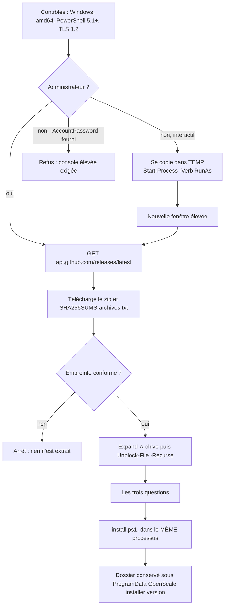

# Installer un poste en une commande

> Conception validée le 31/07/2026. La référence tenue à jour reste
> `docs/02-architecture.md` (§15.2, §17.2). Ce document décrit le chemin d'entrée dans
> l'installation, pas l'installation elle-même : celle-ci ne change pas.

## Le problème

Installer un poste demande aujourd'hui sept gestes, dont quatre n'ont rien à voir avec
OpenScale : trouver l'archive, la copier depuis une clé, cocher « Débloquer » dans les
propriétés du fichier, extraire, ouvrir PowerShell **en administrateur**, se placer dans le
bon répertoire, lancer `install.ps1`. `INSTALLATION.md` y consacre ses deux premières
étapes et cinq minutes sur les dix-sept annoncées.

Trois de ces gestes échouent en silence chez un bénévole :

- la case **« Débloquer »** oubliée fait refuser `install.ps1` par la stratégie
  d'exécution, avec un message qui parle de « fichier téléchargé depuis Internet » et
  jamais d'OpenScale ;
- **PowerShell ouvert sans élévation** fait sortir le script sur son propre refus, à la
  ligne 68 — le message est bon, mais il arrive après le téléchargement et l'extraction ;
- **le mauvais répertoire** produit « openscale.exe est introuvable à côté de
  install.ps1 », qui accuse l'archive alors que c'est le `cd` qui a manqué.

Ce document décrit une commande unique, sur le modèle de l'installation de Claude Code, qui
fait les sept gestes et pose les trois questions qui appartiennent vraiment à l'humain.

## Ce qui existe déjà, et qu'on ne réécrit pas

| Pièce | Ce qu'elle apporte |
|---|---|
| `deploy/windows/install.ps1` | Toute l'installation : compte local, ACL, ouverture de session automatique, service, tâche du kiosque, alimentation, Windows Update, fiche d'installation. Idempotent, éprouvé sur poste réel |
| `.github/workflows/release.yml` | `openscale-vX-windows-amd64.zip` et `SHA256SUMS-archives.txt` publiés sur un tag |
| `internal/domain/config.go` | `DefaultUpdateRepository = "lostmind84/OpenScale"` |
| `internal/update/github.go` | `DefaultBaseURL = "https://api.github.com"`, et le contrat de `/releases/latest` : ni brouillon ni pré-version |
| `deploy/deploy_test.go` | 32 tests qui lisent les scripts : parsing PowerShell réel, marque d'ordre des octets, appels natifs gardés, ordre des étapes de §15.2 |

**`install.ps1` n'est pas réécrit.** Le script d'amorçage l'appelle. C'est ce qui garde une
seule description de l'installation, et laisse la voie hors ligne entière : un poste sans
Internet s'installe toujours depuis une clé USB, exactement comme aujourd'hui.

## La commande

```powershell
irm https://raw.githubusercontent.com/lostmind84/OpenScale/main/deploy/windows/bootstrap.ps1 | iex
```

```cmd
curl -fsSL https://raw.githubusercontent.com/lostmind84/OpenScale/main/deploy/windows/bootstrap.cmd -o %TEMP%\openscale.cmd && %TEMP%\openscale.cmd
```

**L'URL pointe `main`, et pas une release.** Le fichier ne porte aucun numéro de version :
il demande la dernière à l'API. Le publier comme actif de release le figerait sur le tag qui
l'a produit, et corriger l'amorçage imposerait alors une release ; le publier sur GitHub
Pages en ferait une seconde copie à tenir synchrone avec `deploy/windows/`. Un seul fichier,
versionné là où il vit, corrigeable en un commit.

**Le poste de pesée est hors ligne par conception** (contrainte 4, citée par `harden.ps1`).
La commande suppose donc un accès Internet **au moment de l'installation seulement**, et la
voie clé USB reste documentée dans `INSTALLATION.md` pour le poste qui n'en a pas.

## Ce que fait `bootstrap.ps1`



Cinq points portent la conception, et le reste en découle.

### L'élévation et le mode non-interactif ne se combinent pas

Le one-liner est tapé dans une console non élevée neuf fois sur dix. Le script s'écrit donc
dans `%TEMP%` et se relance par `Start-Process -Verb RunAs` : une invite UAC, puis une
nouvelle fenêtre où se déroulent les questions et l'installation.

**Avec `-AccountPassword`, cette relance est refusée.** Relancer une fenêtre élevée fait
passer les paramètres par une ligne de commande, où n'importe quel utilisateur de la machine
lit le mot de passe dans la liste des processus. Le mode scripté exige donc une console déjà
élevée, et le dit. Ce n'est pas une limite technique qu'on lèvera plus tard : c'est le choix
de ne jamais écrire un secret dans un `argv`.

### L'empreinte est vérifiée avant l'extraction, pas après

`Expand-Archive` sur une archive non vérifiée écrit des fichiers sur le disque avant qu'on
sache d'où ils viennent. L'ordre est donc : télécharger le zip, télécharger
`SHA256SUMS-archives.txt`, comparer, **puis seulement** extraire. Un test le vérifie sur le
texte du script, parce que c'est un ordre que rien d'autre ne rappelle à qui édite le
fichier.

### `Unblock-File` est appelé, et c'est l'étape 1 d'`INSTALLATION.md` qui disparaît

Tout fichier extrait d'une archive téléchargée porte la marque de zone Internet. Sans
`Unblock-File -Recurse` sur le dossier extrait, `install.ps1` est refusé par la stratégie
d'exécution — le geste que la notice décrit aujourd'hui comme « clic droit → Propriétés →
Débloquer », et que personne ne fait du premier coup.

### `install.ps1` est appelé dans le même processus

Le mot de passe du compte ne transite ni par une ligne de commande, ni par un fichier, ni
par une variable d'environnement : la saisie est masquée à l'écran, et `install.ps1` est
appelé par éclatement de table dans le processus élevé où elle vient d'être faite.

### Le dossier extrait survit à l'installation

`install.ps1` copie le binaire, la configuration livrée et les deux notices dans
`Program Files`. **Il ne copie aucun script.** Aujourd'hui `uninstall.ps1`, `update.ps1` et
`harden.ps1` survivent parce que l'archive reste sur le Bureau ; un amorçage qui nettoierait
`%TEMP%` laisserait un poste **sans désinstalleur**.

Le dossier extrait est donc déplacé, après succès, vers
`C:\ProgramData\OpenScale\installer\<version>\`, et le chemin est affiché à la fin. C'est
aussi ce que `TROUBLESHOOTING.md` demande de retrouver quand il dit « relancez
`install.ps1` ».

## Les trois questions

```
Mot de passe de la session Windows « openscale »
  4 caractères minimum. Vide = l'installeur décide (tirage sur un poste neuf,
  mot de passe en place conservé sur un poste déjà installé).
  Il sera imprimé sur la fiche d'installation.
> ****
> **** (confirmation)

Type d'installation
  [1] Production — le poste démarre seul (défaut)
  [2] Pilote — service en démarrage manuel, l'application Access reste relançable
> 1

Ouverture de session automatique après une coupure de courant ? [O/n]
> O
```

Les répertoires d'installation ne sont pas demandés : `-InstallDir` et `-DataRoot` restent
des paramètres, pour le poste dont le disque système n'est pas `C:`, et ne méritent pas une
question posée aux quatre postes de la coopérative.

| Question | Paramètre | Défaut |
|---|---|---|
| Mot de passe du compte | `-AccountPassword` | `install.ps1` décide : tirage de 20 caractères sur un poste neuf, mot de passe en place conservé sur un poste déjà installé |
| Production ou pilote | `-Pilot` | production |
| Ouverture de session automatique | `-SkipAutoLogon` | activée |
| — | `-Yes` | pose zéro question, prend les défauts |
| — | `-Version` | dernière release |
| — | `-InstallDir`, `-DataRoot` | ceux de `Get-OpenScalePaths` |

Fourni = pas demandé. **Sans console interactive et sans `-Yes`, le script échoue** au lieu
de bloquer sur une invite que personne ne voit.

## Le mot de passe du compte à quatre caractères

Le mot de passe du compte Windows `openscale` est déjà écrit **en clair** dans
`Winlogon\DefaultPassword` — `install.ps1` l'y met lui-même, et l'assume en commentaire : sur
un poste en libre-service, l'accès physique vaut déjà l'accès administrateur. Le raccourcir
n'aggrave donc rien pour qui touche le poste ou en est administrateur. C'est l'arbitrage
que `common.ps1` porte en toutes lettres, et ce document ne fait que le citer.

Ce que ça change est l'accès **réseau** : un compte local Windows est joignable en SMB, et
un mot de passe de quatre caractères tombe en quelques secondes depuis n'importe quel PC du
magasin. La parade — refuser à ce compte `SeDenyNetworkLogonRight` et
`SeDenyRemoteInteractiveLogonRight` — a été proposée et **écartée le 31/07/2026** : le
réseau du magasin est un réseau de confiance et personne ne s'y connecte. C'est un choix
assumé, écrit ici pour qu'il soit rouvrable et non redécouvert.

La saisie est **masquée** (`Read-Host -AsSecureString`) et **confirmée**. Ce que le masque
achète n'est pas un secret gardé — le mot de passe finit sur la fiche et dans le registre —
mais un mot de passe qui ne s'affiche pas à l'écran d'un poste posé face aux clients, et qui
ne reste pas dans l'historique de la console.

## Ce que devient `install.ps1`

**Rien.** Cette section décrivait un paramètre `-SessionPassword` à ajouter ; `main` a livré
le même jour, pour un autre défaut, un `-AccountPassword` qui fait le même travail **en
mieux** — il conserve le mot de passe d'un poste réinstallé, le vérifie par
`Test-LocalCredential`, et confie la décision à `Resolve-AccountPassword`, exerçable en test
sans droits administrateur. Le bootstrap s'y branche.

Deux conséquences pour ce document :

- **le plancher de quatre caractères n'est pas dans le bootstrap.** Il est dans
  `common.ps1`, `Resolve-AccountPassword` en est l'autorité, et la question le lit. Un
  bootstrap qui le redirait accepterait ce que l'installeur refuse trois pas plus loin,
  devant un bénévole ayant déjà tout répondu ;
- **laisser la question vide ne veut plus dire « tirage au sort »** mais « `install.ps1`
  décide » : tirage sur un poste neuf, mot de passe en place conservé sur un poste déjà
  installé — la règle du code de secours, « la fiche déjà rangée dans le classeur doit
  rester vraie ».

## Les tests

Dans `deploy/deploy_test.go`, à côté des 32 existants. Le parsing PowerShell réel et la
marque d'ordre des octets couvrent le nouveau fichier sans une ligne de plus.

| Test | Ce qu'il empêche |
|---|---|
| Aucun numéro de version en dur dans le script | un amorçage qui installerait éternellement la v0.9 |
| L'empreinte est comparée avant `Expand-Archive` | une archive écrite sur le disque avant d'être vérifiée |
| `Unblock-File` est appelé sur le dossier extrait | le refus de la stratégie d'exécution, redécouvert sur place |
| Tout paramètre passé à `install.ps1` y est déclaré | un `-AccountPassword` que l'installeur ignorerait en silence |
| Le mot de passe n'est dans aucun `Write-Host` ni journal | un secret dans `install.log`, qui reste sur le poste |
| `bootstrap.cmd` et `bootstrap.ps1` nomment la même URL | deux entrées qui divergent |
| Le dépôt interrogé est `DefaultUpdateRepository`, l'hôte est `DefaultBaseURL` | un troisième endroit qui épelle `lostmind84/OpenScale` |
| Le minimum est 4 et la confirmation est demandée | un mot de passe saisi de travers, sur un poste dont on ne peut plus ouvrir la session |
| L'auto-relève est refusée quand `-AccountPassword` est fourni | un secret dans une ligne de commande |

## La documentation

- **`INSTALLATION.md`** : les étapes 1 et 2 fusionnent en une commande. La voie clé USB
  reste, sous un titre qui dit quand elle sert — poste sans Internet. Le tableau des durées
  est recalculé : `TestTheFifteenMinutesAreCountedAndNotClaimed` vérifie que le total est la
  somme de ses lignes.
- **`README.md`** et **`handbook/getting-started.md`** : la commande unique, et le renvoi à
  `INSTALLATION.md` par URL absolue depuis le handbook (ODR-0002).
