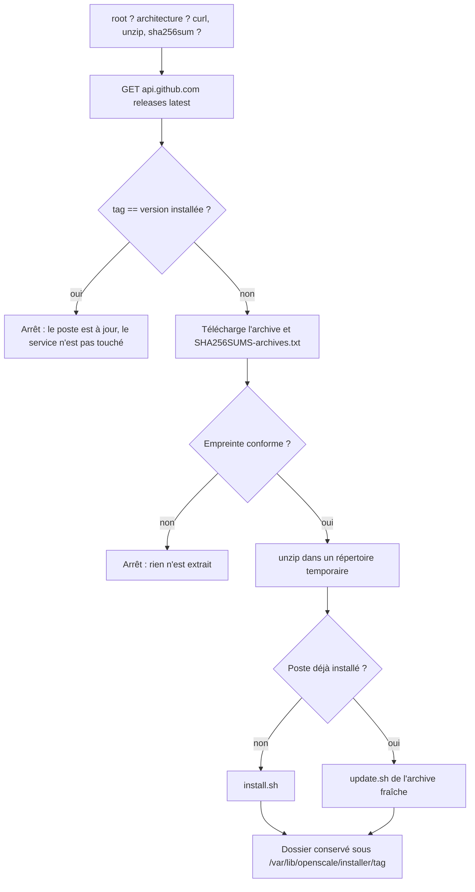

# Installer et mettre à jour un poste Linux en une commande

> Conception validée le 31/07/2026. La référence tenue à jour reste
> `docs/02-architecture.md` (§15.3, §15.5, §17.2). Ce document décrit le chemin d'entrée
> dans l'installation Linux, pas l'installation elle-même : `install.sh` ne change pas.
>
> Suite de `2026-07-31-installation-en-une-commande-design.md`, qui a fait le même travail
> pour Windows. Les décisions communes — l'URL sur `main`, l'empreinte vérifiée avant
> l'extraction, le dossier extrait qui survit — y sont argumentées et ne sont pas
> ré-argumentées ici.

## Le problème

Windows s'installe en une commande depuis le 31/07/2026. Linux, non : `INSTALLATION.md`
demande encore de trouver la release, télécharger l'archive, relever son empreinte à la
main, la comparer, décompresser, puis `sudo ./install.sh`.

Trois de ces gestes se passent mal, et aucun ne ressemble à une panne d'OpenScale :

- **l'empreinte comparée à l'œil** ne l'est pas. Elle fait 64 caractères, et personne ne
  lit 64 caractères deux fois ;
- **`unzip` n'est pas installé** sur une Debian 12 minimale. `unzip: command not found`
  arrive après le téléchargement, sur un poste où l'on croyait avoir fini ;
- **l'architecture** : le Raspberry Pi veut `linux-arm64`, le mini-PC `linux-amd64`, et
  l'archive de la mauvaise donne `cannot execute binary file: Exec format error` — un
  message qui accuse le binaire.

Et il manque un chemin de mise à jour tout court. Sous Windows, le bouton de l'écran
d'administration télécharge et applique (ADR-053). Sous Linux il n'existe pas :
`cmd/openscale/update.go:42` répond `nil` hors Windows, et `internal/update/stager.go`
nomme `openscale.exe` et `update.ps1` en dur. Le seul chemin restant est `update.sh`, qui
exige un binaire **déjà posé à côté de lui**.

## Ce qui existe déjà, et qu'on ne réécrit pas

| Pièce | Ce qu'elle apporte |
|---|---|
| `deploy/linux/install.sh` | Toute l'installation : paquets du kiosque, compte `openscale` et ses groupes, binaire, répertoires, règles udev, unités systemd, vérification de `/healthz`, fiche d'installation. Idempotent |
| `deploy/linux/update.sh` | Arrêt contrôlé sur le budget de §13.4, sauvegarde horodatée, `/healthz` — jamais `/readyz` —, **retour arrière automatique**, et le rappel de la copie de base à remettre à la main |
| `.github/workflows/release.yml` | `openscale-vX-linux-amd64.zip`, `openscale-vX-linux-arm64.zip` et `SHA256SUMS-archives.txt` publiés sur un tag |
| `Makefile` (cible `release`) | Met tout `deploy/linux/` dans l'archive, avec le binaire, les notices et la configuration livrée |

**Ni `install.sh` ni le corps de `update.sh` ne sont réécrits.** Le script d'amorçage les
appelle. C'est ce qui garde une seule description de l'installation, et laisse la voie hors
ligne entière : un poste sans Internet s'installe toujours depuis une clé USB.

## La commande

```sh
curl -fsSL https://raw.githubusercontent.com/lostmind84/OpenScale/main/deploy/linux/bootstrap.sh | sudo sh
```

Elle **installe** un poste neuf et **met à jour** un poste déjà installé. C'est la même
commande, et c'est délibéré : un bénévole n'a qu'une ligne à retrouver, et le script sait
lequel des deux gestes s'applique mieux que lui.

## Ce que fait `bootstrap.sh`



Six points portent la conception, et le reste en découle.

### Root est exigé, et il n'y a aucune question à poser

Les trois questions de la version Windows n'ont pas d'équivalent Linux : le compte
`openscale` est créé **sans mot de passe et sans shell** (`--shell /usr/sbin/nologin`), il
n'y a pas de mode pilote — l'application Access ne tourne pas ici —, et le kiosque est une
unité systemd qu'`install.sh` active toujours.

Ne restant rien à demander, le script **n'ouvre jamais `/dev/tty`** et se contente d'exiger
root. `curl … | sh` lit le script sur son entrée standard : un `read` y lirait le reste du
script au lieu d'une réponse humaine, et c'est le piège que cette absence de question
supprime au lieu de le contourner.

Lancé sans droits, il sort sur la commande à retaper — `| sudo sh` — et non sur
« Permission denied » au premier `install`.

### L'architecture est décidée par `uname -m`, avant tout téléchargement

`x86_64` donne `amd64`, `aarch64` et `arm64` donnent `arm64`. Toute autre valeur arrête le
script **avant** la première requête réseau, en nommant ce qui a été trouvé. Les deux
archives existent (`Makefile`, `TARGETS`), et se tromper d'archive produit
`Exec format error` — un message qui accuse le binaire alors que c'est le téléchargement
qui s'est trompé de machine.

### `unzip` est installé s'il manque, et l'absence d'apt-get est dite

Une Debian 12 minimale n'a pas `unzip`. Le script l'installe par `apt-get` s'il existe ;
sinon il s'arrête en nommant le paquet à poser. `sha256sum` vient de coreutils et est
toujours là ; `curl` ou `wget` — l'un des deux suffit.

C'est la même logique qu'`install.sh` avec `cage`, `chromium` et `seatd` : sur une
distribution sans `apt-get`, le script dit quoi installer plutôt que d'échouer sur une
commande introuvable.

### L'empreinte est vérifiée avant l'extraction, pas après

`unzip` sur une archive non vérifiée écrit des fichiers sur le disque avant qu'on sache
d'où ils viennent, et la ligne suivante en exécute un **en root**. L'ordre est donc :
télécharger l'archive, télécharger `SHA256SUMS-archives.txt`, comparer, **puis seulement**
extraire. Un test le vérifie sur le texte du script, parce que c'est un ordre que rien
d'autre ne rappelle à qui édite le fichier.

Il n'y a pas d'équivalent d'`Unblock-File` — Linux ne marque pas ce qui vient d'Internet.
En revanche `chmod +x` est nécessaire sur le binaire et les scripts extraits : `unzip` ne
restaure pas les modes Unix de toutes les archives.

### Un poste déjà installé passe par `update.sh`, jamais par `install.sh`

`install.sh` est idempotent, et il serait donc tentant de l'appeler dans les deux cas. Ce
serait perdre exactement ce qui distingue une mise à jour d'une installation : l'arrêt
contrôlé du service, la **sauvegarde horodatée** du binaire, la vérification de `/healthz`
et la **restauration automatique** de la version précédente. Un binaire fautif laisserait
le poste à l'arrêt un samedi matin, sans rien à remettre en place.

Le poste est réputé installé quand `/usr/local/bin/openscale` est exécutable **et** que
systemd connaît `openscale.service`. C'est alors l'`update.sh` **de l'archive fraîchement
extraite** qui est lancé — le script de la version qui arrive pilote sa propre mise à jour,
exactement comme le stager Windows lance l'`update.ps1` de l'archive téléchargée
(`internal/update/stager.go`).

`--force-install` force `install.sh` sur un poste installé : c'est le geste de réparation
que `TROUBLESHOOTING.md` appelle « relancez `install.sh` ».

### Le tag déjà installé arrête le script

Le one-liner sera relancé par réflexe, sur des postes déjà à jour. Sans garde, chacune de
ces exécutions arrêterait le service, remplacerait le binaire par les mêmes octets et le
redémarrerait — **en pleine journée de vente**, pour rien.

Le script compare donc le tag de la release à la version que `openscale --version` annonce,
et s'arrête en le disant. `--force` passe outre ; un binaire de développement (`dev`) n'est
égal à aucun tag et ne déclenche jamais ce garde.

### Le dossier extrait survit à l'installation

`install.sh` copie le binaire, les unités, la configuration livrée et les notices. **Il ne
copie aucun script** : `update.sh` et `uninstall.sh` ne survivaient jusqu'ici que parce que
l'archive restait dans le répertoire personnel de qui l'avait décompressée. Un amorçage qui
nettoierait son répertoire temporaire laisserait un poste **sans désinstalleur**.

Le dossier extrait est donc déplacé, après succès, vers
`/var/lib/openscale/installer/<tag>/`, et le chemin est affiché à la fin — symétrique du
`C:\ProgramData\OpenScale\installer\<version>\` de Windows.

## Ce que devient `update.sh`

Il gagne `--latest` (et `--version vX`), qui **ne duplique pas le téléchargement** : il
relance `bootstrap.sh`. Une seule implémentation du couple « résoudre la release / vérifier
l'empreinte » existe dans le dépôt, et elle est dans le fichier qui doit de toute façon
savoir le faire sans rien pouvoir sourcer — `bootstrap.sh` vit hors de l'archive.

Il n'y a pas de récursion : `bootstrap.sh` appelle toujours `update.sh` **sans** `--latest`,
c'est-à-dire dans son mode local, sur le binaire extrait à côté de lui. Le contrat actuel —
`SOURCE="${1:-$HERE/openscale}"` — ne bouge pas, et la voie clé USB reste entière.

| Geste | Commande |
|---|---|
| Installer un poste neuf | `curl -fsSL …/bootstrap.sh \| sudo sh` |
| Mettre à jour un poste | la même, ou `sudo /var/lib/openscale/installer/<tag>/update.sh --latest` |
| Mettre à jour sans Internet | `sudo ./update.sh` depuis l'archive copiée sur une clé USB |
| Revenir à une version | `curl -fsSL …/bootstrap.sh \| sudo sh -s -- --version v0.9` |

## Ce qui n'est PAS fait ici

**La mise à jour depuis l'écran d'administration reste Windows seule.** La débrider
demanderait de sortir `openscale.exe` et `update.ps1` du stager, d'écrire un applier
systemd, et de traiter le fait qu'un service Linux ne peut pas se remplacer lui-même sans
un tiers qui lui survit. C'est du code Go et un chantier à part entière ; il est nommé ici
pour qu'il ne soit pas cru fait.

Sous Linux, l'écran d'administration continue donc de répondre honnêtement que ce binaire
ne sait pas se mettre à jour, et la page de mise à jour renvoie à la commande ci-dessus.

## Les tests

Dans `deploy/bootstrap_test.go`, à côté de ceux de la version Windows. Plusieurs tests
existants couvrent le nouveau fichier sans une ligne de plus, parce qu'ils globent
`linux/*.sh` : les fins de ligne CRLF, `sh -n`, et le piège du `[ … ] && …` sous `set -e`.

| Test | Ce qu'il empêche |
|---|---|
| Aucun numéro de version en dur | un amorçage qui installerait éternellement la v0.9 |
| L'empreinte est comparée avant `unzip` | une archive écrite sur le disque avant d'être vérifiée, puis exécutée en root |
| Le dépôt et l'hôte interrogés sont ceux que le binaire compile | un quatrième endroit qui épelle `lostmind84/OpenScale` |
| Sur un poste installé, c'est `update.sh` et jamais `install.sh` | une mise à jour sans sauvegarde horodatée ni retour arrière |
| `--latest` ne repasse pas `--latest` | une récursion entre les deux scripts |
| Le tag déjà installé arrête le script | un service coupé en heure de vente pour réinstaller les mêmes octets |
| L'architecture est décidée avant le téléchargement | une archive `amd64` posée sur un Raspberry Pi |
| `root` est exigé, et aucun `read` n'est fait | un `read` qui lirait le script sur son entrée standard |
| Le one-liner est le même dans le script et les trois documents | quatre entrées qui divergent |

## La documentation

- **`INSTALLATION.md`** : la section Linux gagne la commande unique en tête ; la voie clé
  USB reste, sous un titre qui dit quand elle sert — poste sans Internet ;
- **`README.md`** : la commande Linux à côté des deux commandes Windows ;
- **`handbook/getting-started.md`** : la commande, et le renvoi à `INSTALLATION.md` par URL
  absolue (ODR-0002).
