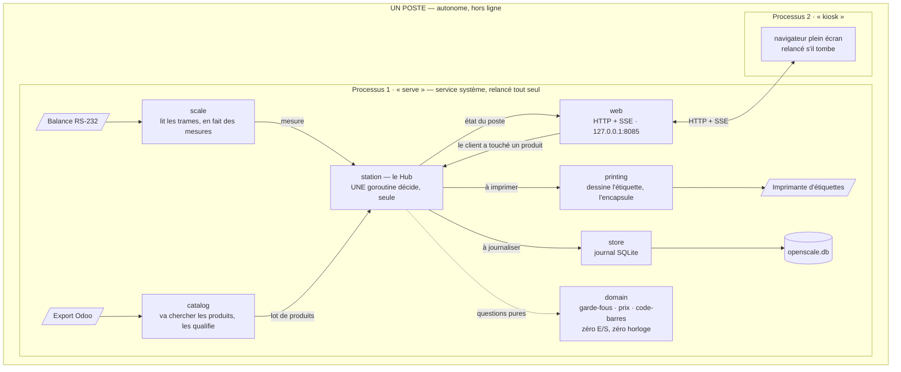

# Architecture

Un poste est **un exécutable et deux processus**. Le premier fait le travail : port
série, catalogue, règles, impression, base, serveur HTTP. Le second n'est qu'un
navigateur en plein écran. Le même binaire porte les deux, et un poste ne parle à
personne d'autre que lui-même.

## La carte

Une seule flèche est en pointillés, et c'est la plus importante : `domain` est
**appelé, jamais appelant**. Il ne connaît ni le Hub, ni le réseau, ni le disque.

## Ce qui se passe quand quelqu'un pèse

1. La balance envoie une trame ; `scale` la transforme en mesure et la pousse vers le
   Hub. Le canal ne garde que la dernière : une mesure en retard n'a aucune valeur.
2. Le client touche une tuile. Le navigateur envoie un `POST` avec une **clé
   d'idempotence** tirée au moment du toucher.
3. Le Hub **fige le poids** et interroge `domain` : garde-fous, prix, code-barres. Trois
   calculs purs, aucune E/S, moins d'une milliseconde.
4. Le Hub répond `202` tout de suite et confie l'impression à un ouvrier séparé.
   **Il n'attend jamais l'imprimante.** Le résultat remonte à l'écran par SSE.
5. Le journal s'écrit après coup, hors du chemin du client. Base verrouillée ou disque
   plein : l'étiquette sort quand même.

## Les frontières, et pourquoi elles existent

### `domain` ne touche à rien

Le noyau métier n'importe ni `os`, ni `net/http`, ni `database/sql`. Ce n'est pas une
règle de style : c'est ce qui rend les décisions **testables sans matériel**. Les
quatorze garde-fous de pesée, le calcul du prix et la composition du code-barres se
vérifient sur une machine sans balance, sans imprimante et sans réseau. Une régression
s'y voit en millisecondes, alors qu'elle coûterait autrement une étiquette qu'une caisse
refuse de lire.

### Personne n'a le droit de lire l'heure

`time.Now()` est **interdit** partout sauf en deux endroits nommés : l'implémentation de
l'horloge, et une échéance d'écriture réseau qui vit dans la pile TCP du noyau. Partout
ailleurs, l'horloge est un paramètre.

La raison est concrète. L'âge d'une mesure vaut « maintenant moins l'horodatage » ; une
horloge lue au mauvais endroit sous-estimerait cet âge, et le poste imprimerait un poids
périmé. En prime, tous les tests qui dépendent du temps — stabilité, expiration,
fenêtre de réimpression, budget d'impression — s'exécutent en microsecondes au lieu
d'attendre pour de vrai.

### `station` ignore quel matériel est branché

Le Hub ne voit que des interfaces : `Scale`, `Printer`, `Transport`, `CatalogSource`,
`Clock`. Elles sont déclarées **du côté qui les consomme**, dans `internal/station/ports`,
jamais du côté qui les implémente.

Un seul fichier de tout l'arbre nomme du matériel concret : `cmd/openscale/drivers.go`.
Ajouter un modèle de balance, c'est donc **un paquet et une ligne** — zéro modification
dans `station`, dans `web` ou dans le front, parce que l'écran d'administration découvre
les drivers par le registre et fabrique leur formulaire depuis le schéma que le driver
déclare lui-même. C'est ce qui permet à une coopérative de contribuer son modèle sans
toucher au cœur.

### `web` ne sérialise jamais un type du noyau

Les objets JSON de `/api/v1` sont des types à part, écrits pour l'API. Le contrat vu par
le navigateur peut donc rester stable pendant que le noyau bouge — et l'inverse.

### Deux processus, pas un

Le navigateur est la brique la plus susceptible de tomber : fuite mémoire du moteur de
rendu, mise à jour automatique, tactile insistant. Séparé du service, son crash ne ferme
pas le port série, ne coupe pas la base et ne perd pas la pesée en cours ; la connexion
SSE se rétablit seule. Symétriquement, le service peut redémarrer sans fermer la fenêtre.
**Aucune moitié n'entraîne l'autre dans sa chute.**

## Ce que la machine vérifie, et ce qu'elle ne vérifie pas

`make boundary` est un programme Go qui analyse l'arbre syntaxique du dépôt. La CI
échoue quand il échoue.

| Frontière | Comment elle tient |
|---|---|
| `domain` sans dépendance sortante | `make boundary` — imports directs, suivis à travers nos propres paquets |
| Pas de `time.Now()` hors des deux exceptions | `make boundary` — liste blanche de deux fichiers, nommés |
| Aucun driver concret hors de `drivers.go` | `make boundary` — un driver se reconnaît à ce qu'il expose une entrée de registre, pas à son chemin |
| DTO propres à `web` | fichier JSON de référence, gelé |
| Chaque `_windows.go` a son jumeau | compilation croisée sur trois cibles, à chaque commit |
| Interfaces déclarées côté consommateur | **relecture humaine** — aucun outil ne le vérifie |

La dernière ligne est la seule qui repose sur quelqu'un plutôt que sur quelque chose.
C'est assumé : ce n'est pas une question d'arbre syntaxique.

## Mettre un poste à jour

Mettre un poste à jour ne demande rien de neuf : le binaire se remplace, la configuration
et la base restent en place. Un `config.json` écrit par une version plus ancienne ne met
plus le poste en configuration d'usine à lui seul — la mise à jour migre ce qu'elle sait
convertir et nomme le reste, détaillé dans
[`docs/02-architecture.md`](https://github.com/lostmind84/OpenScale/blob/main/docs/02-architecture.md)
§11.6.

## Pour aller plus loin

Cette page est la carte. Le territoire est dans
[`docs/02-architecture.md`](https://github.com/lostmind84/OpenScale/blob/main/docs/02-architecture.md)
— 22 sections et l'ensemble des ADR, à lire par le paragraphe dont on a besoin :

| Vous cherchez | Section |
|---|---|
| Le chemin détaillé d'une pesée, avec les budgets de temps | §4 |
| L'arborescence des paquets et les cinq coupes | §5 |
| Le noyau métier, garde-fous et tarification | §6 |
| L'étiquette et le code-barres | §7 |
| Impression, drivers et transports | §8 |
| Catalogue et import | §10 |
| Concurrence et temps réel | §13 |

Deux guides valent d'être lus **avant** d'écrire du code, pas après :

- [Ajouter un matériel](https://github.com/lostmind84/OpenScale/blob/main/docs/07-ajouter-un-materiel.md)
  — balance, imprimante ou transport. Les paquets `internal/scale/example/` et
  `internal/printing/example/` en sont la version compilable, à copier.
- [Ajouter une source de catalogue](https://github.com/lostmind84/OpenScale/blob/main/docs/08-ajouter-une-source-de-catalogue.md)
  — API d'ERP, autre format, autre dépôt. `internal/catalog/example/` sert de modèle.

Le nommage, lui, fait autorité dans
[`docs/03-glossaire.md`](https://github.com/lostmind84/OpenScale/blob/main/docs/03-glossaire.md).
